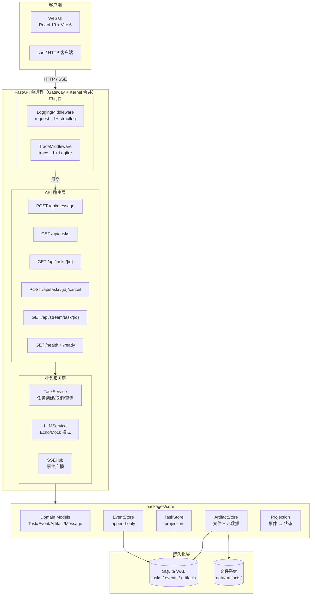
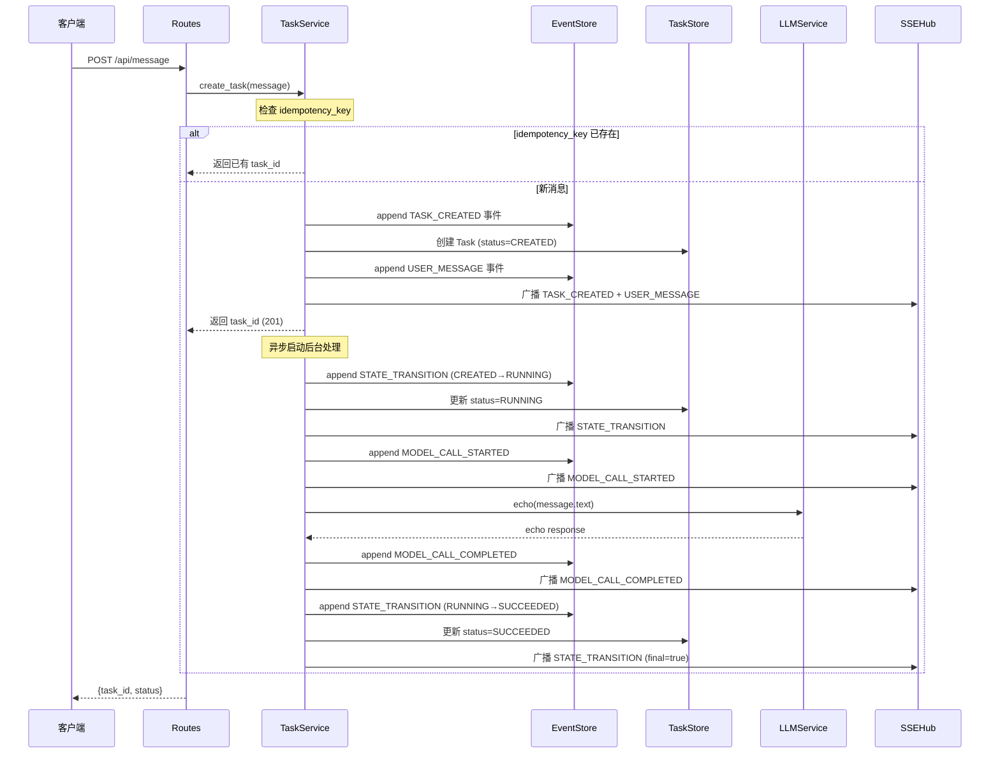
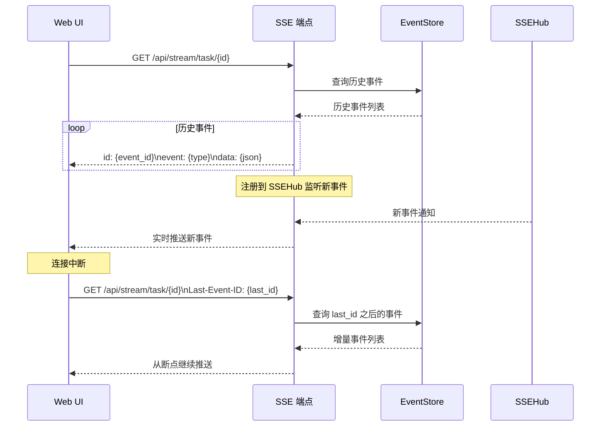

# M0 基础底座 -- 技术实现计划

**特性**: 001-implement-m0-foundation
**版本**: v1.0
**状态**: Draft
**日期**: 2026-02-28
**依据**: spec.md v1.0, Blueprint §7-§10/§14, research-synthesis.md

---

## 1. Summary

本计划将 M0 需求规范（spec.md）转化为可执行的技术实现方案。M0 的核心交付目标是构建 OctoAgent 的"可观测的任务账本"：一个基于 Event Sourcing 的持久化任务底座，支持 REST API 交互、SSE 实时事件推送和最小 Web UI。

**关键技术决策**:
- 单进程合并架构：Gateway + Kernel 合并为单个 FastAPI 进程
- 3 张 SQLite 表：tasks / events / artifacts（WAL 模式）
- 异步 LLM 处理：POST /api/message 同步创建任务后异步执行
- Echo/Mock LLM：不依赖外部 LLM 服务，端到端验证架构可行性
- React 19 + Vite 6：原生 EventSource 消费 SSE，无 CSS 框架

**预估工作量**: 10-13 天（数据层 3-4 天 / API 层 3-4 天 / UI 层 2-3 天 / 收尾 1-2 天）

---

## 2. Technical Context

### 2.1 语言/版本

- **Python**: 3.12+
- **Node.js**: 20+（前端）
- **TypeScript**: 5.x（前端）

### 2.2 主要依赖

| 类别 | 包 | 版本 | 用途 |
|------|-----|------|------|
| Web 框架 | fastapi | ~0.115 | REST API + 路由 |
| ASGI 服务器 | uvicorn | ~0.30 | 异步 HTTP 服务 |
| 数据模型 | pydantic | ~2.10 | Domain Models + 校验 |
| 数据库 | aiosqlite | ~0.21 | async SQLite 访问 |
| SSE | sse-starlette | ~3.0 | Server-Sent Events |
| 事件 ID | python-ulid | ~3.1 | ULID 生成（时间有序） |
| LLM 客户端 | litellm | ~1.55 | 模型网关抽象（直连模式） |
| 日志 | structlog | ~25.4 | 结构化日志 |
| APM | logfire | ~4.24 | OTel instrument（可选） |
| 包管理 | uv | latest | workspace 管理 |
| 测试 | pytest | ~8.x | 测试框架 |
| 测试 | pytest-asyncio | ~0.24 | async 测试支持 |
| Lint | ruff | latest | 代码风格检查 |
| 前端 | react | ~19.x | UI 框架 |
| 前端构建 | vite | ~6.x | 开发服务器 + 构建 |

### 2.3 项目结构

```
octoagent/
  pyproject.toml                        # uv workspace 根
  packages/
    core/                               # Domain Models + Store
      pyproject.toml
      src/octoagent/core/
        __init__.py
        models/                         # Pydantic 数据模型
        store/                          # SQLite Store 实现
        projection.py                   # Projection 应用/重建
        config.py                       # 配置常量
      tests/
  apps/
    gateway/                            # FastAPI 合并进程
      pyproject.toml
      src/octoagent/gateway/
        __init__.py
        main.py                         # FastAPI app
        routes/                         # API 路由
        services/                       # 业务服务
        middleware/                      # 中间件
      tests/
  frontend/                             # React + Vite
    package.json
    vite.config.ts
    src/
      pages/                            # TaskList + TaskDetail
      hooks/                            # useSSE
      api/                              # API client
  data/                                 # 运行时数据 (.gitignore)
    sqlite/
    artifacts/
  tests/                                # 集成测试
    unit/
    integration/
    conftest.py
```

### 2.4 存储方案

| 数据类型 | 存储 | 模式 |
|---------|------|------|
| Task / Event 元信息 | SQLite (WAL) | 3 张表，事务一致 |
| Artifact 元数据 | SQLite | artifacts 表 |
| Artifact 文件 | 文件系统 | `data/artifacts/{task_id}/{artifact_id}` |
| Artifact inline | SQLite parts.content | < 4KB 文本 |

### 2.5 测试策略

| 层级 | 范围 | 工具 |
|------|------|------|
| 单元测试 | Domain Models, 状态机, Store 逻辑 | pytest + pytest-asyncio |
| 集成测试 | API 端到端, SSE 流, 持久性验证 | pytest + httpx + aiosqlite |
| 回放测试 | Projection Rebuild 一致性 | pytest + golden test |
| 前端测试 | M0 不强制要求 | -- |

---

## 3. Constitution Check

| # | 原则 | 适用性 | 评估 | 说明 |
|---|------|--------|------|------|
| C1 | Durability First | **完全适用** | PASS | SQLite WAL + 事件落盘 + Projection Rebuild + 进程重启测试 |
| C2 | Everything is an Event | **完全适用** | PASS | 所有操作通过事件记录，tasks 表仅为 projection，状态更新必须通过事件触发 |
| C3 | Tools are Contracts | **M0 不适用** | N/A | M0 无工具调用，无 ToolBroker。数据模型预留 schema_version 供 M1 使用 |
| C4 | Side-effect Two-Phase | **M0 不适用** | N/A | M0 无不可逆操作，无 Policy Engine。Echo/Mock LLM 无外部副作用 |
| C5 | Least Privilege | **部分适用** | PASS | M0 不存储 secrets，日志不输出完整消息原文，仅 localhost 访问 |
| C6 | Degrade Gracefully | **部分适用** | PASS | Logfire 可选（send_to_logfire=false），LLM 失败写 MODEL_CALL_FAILED 事件，不影响系统存活 |
| C7 | User-in-Control | **完全适用** | PASS | Task 取消 API（POST /api/tasks/{id}/cancel），终态不可再操作 |
| C8 | Observability is Feature | **完全适用** | PASS | structlog 结构化日志 + request_id/trace_id 贯穿 + SSE 实时推送 + Web UI 可视化 |
| C8+ | 日志最小化 | **完全适用** | PASS | Event payload 8KB 阈值，超大内容存 Artifact；日志不输出完整原文 |
| C9 | 不猜关键配置 | **M0 不适用** | N/A | M0 无 Orchestrator/Worker 决策逻辑 |
| C10 | Bias to Action | **M0 不适用** | N/A | M0 无智能编排 |
| C11 | 上下文卫生 | **部分适用** | PASS | Event payload 最小化 + Artifact 引用模式，不在事件中存大文本 |
| C12 | 记忆写入治理 | **M0 不适用** | N/A | M0 无记忆系统 |
| C13 | 失败必须可解释 | **部分适用** | PASS | ERROR 事件包含 error_type 分类 + recovery_hint；MODEL_CALL_FAILED 记录失败原因 |
| C14 | A2A 协议兼容 | **部分适用** | PASS | Artifact parts 结构对齐 A2A；TaskStatus 枚举包含全部状态（含 M1+ 预留） |

**评估结论**: 无 VIOLATION。所有适用的 Constitution 原则均通过评估，M0 技术计划与 Constitution 完全兼容。

---

## 4. Architecture

### 4.1 M0 组件图



### 4.2 数据流

#### 4.2.1 消息接收与任务处理



#### 4.2.2 SSE 连接与断线重连



### 4.3 模块划分

| 模块 | 路径 | 职责 | 依赖 |
|------|------|------|------|
| **core.models** | `packages/core/src/octoagent/core/models/` | Domain Models（Pydantic） | pydantic |
| **core.store** | `packages/core/src/octoagent/core/store/` | SQLite Store 实现 | aiosqlite, python-ulid |
| **core.projection** | `packages/core/src/octoagent/core/projection.py` | Projection 应用/重建 | core.store |
| **core.config** | `packages/core/src/octoagent/core/config.py` | 配置常量 | -- |
| **gateway.routes** | `apps/gateway/src/octoagent/gateway/routes/` | API 路由定义 | fastapi |
| **gateway.services** | `apps/gateway/src/octoagent/gateway/services/` | 业务逻辑 | core, litellm, sse-starlette |
| **gateway.middleware** | `apps/gateway/src/octoagent/gateway/middleware/` | 日志/追踪中间件 | structlog, logfire |
| **frontend** | `frontend/src/` | React Web UI | react, vite |

---

## 5. Implementation Phases

### Phase 1: 数据层（packages/core）-- 3-4 天

#### P1.1 项目骨架搭建

**目标**: uv workspace 初始化 + 子包结构

**任务**:
1. 创建 `pyproject.toml`（workspace 根）
2. 创建 `packages/core/pyproject.toml` 子包
3. 创建 `apps/gateway/pyproject.toml` 子包
4. 配置 ruff、pytest
5. 确认 `uv sync` 成功

**验证**: `uv run python -c "import octoagent.core"` 成功

#### P1.2 Domain Models

**目标**: 实现所有 Pydantic 数据模型

**任务**:
1. `models/enums.py` -- TaskStatus, EventType, ActorType, RiskLevel, PartType 枚举；VALID_TRANSITIONS 映射；TERMINAL_STATES 集合
2. `models/task.py` -- Task, RequesterInfo, TaskPointers
3. `models/event.py` -- Event, EventCausality
4. `models/artifact.py` -- Artifact, ArtifactPart
5. `models/message.py` -- NormalizedMessage, MessageAttachment
6. `models/payloads.py` -- 所有 Event Payload 子类型

**验证**: 单元测试覆盖所有模型的序列化/反序列化、状态机合法/非法流转

#### P1.3 SQLite Store 实现

**目标**: 实现 3 张表的 CRUD 操作

**任务**:
1. `store/sqlite_store.py` -- 数据库初始化（DDL + PRAGMA）
2. TaskStore 实现：create_task, get_task, list_tasks, update_task_status
3. EventStore 实现：append_event, get_events_for_task, get_events_after, get_next_task_seq, check_idempotency_key
4. 事务封装：append_event + update_task_status 在同一事务内
5. `store/protocols.py` -- Store 接口定义（Protocol）

**验证**:
- 事务一致性测试：事件写入 + projection 更新原子性
- task_seq 单调递增测试
- idempotency_key 去重测试
- WAL 模式确认

#### P1.4 Artifact Store 实现

**目标**: 文件系统 + SQLite 元数据的双存储

**任务**:
1. `store/artifact_fs.py` -- 文件系统操作：按 `{task_id}/{artifact_id}` 存储
2. ArtifactStore 实现：put_artifact, get_artifact, list_artifacts_for_task, get_artifact_content
3. inline 阈值判断（< 4KB 存 parts.content，>= 4KB 写文件）
4. SHA-256 hash 计算 + size 记录

**验证**:
- inline 文本存取测试
- 大文件存取测试
- hash 完整性校验测试

#### P1.5 Projection 重建

**目标**: 从事件重建 Task 状态

**任务**:
1. `projection.py` -- apply_event 函数（单事件应用到 Task）
2. rebuild_all 函数（清空 tasks 表 → 回放所有事件）
3. CLI 入口：`python -m octoagent.core rebuild-projections`

**验证**:
- 重建后 tasks 表与原始状态一致
- 重建日志记录事件数量和耗时

---

### Phase 2: API 层（apps/gateway）-- 3-4 天

#### P2.1 FastAPI 骨架

**目标**: FastAPI app 初始化 + 生命周期管理

**任务**:
1. `main.py` -- FastAPI app 创建，lifespan 管理（初始化 SQLite / 关闭连接）
2. 路由注册（message, tasks, cancel, stream, health）
3. 依赖注入：Store 实例通过 FastAPI Depends 注入

**验证**: `GET /health` 返回 200

#### P2.2 消息接收与任务创建

**目标**: POST /api/message 端到端

**任务**:
1. `routes/message.py` -- 请求体校验 + idempotency_key 去重
2. `services/task_service.py` -- 创建 Task + 写入 TASK_CREATED / USER_MESSAGE 事件
3. 异步后台处理启动（asyncio.create_task）

**验证**:
- 正常创建任务返回 201
- 重复 idempotency_key 返回 200 + 已有 task_id
- 事件落盘验证

#### P2.3 任务查询与取消

**目标**: GET /api/tasks, GET /api/tasks/{id}, POST /api/tasks/{id}/cancel

**任务**:
1. `routes/tasks.py` -- 列表查询（支持 status 筛选）+ 详情查询
2. `routes/cancel.py` -- 取消逻辑（状态检查 + STATE_TRANSITION 事件）
3. 错误处理：404 / 409

**验证**:
- 列表按 created_at 倒序
- 详情包含 events + artifacts
- 取消终态任务返回 409
- 取消非终态任务返回 200

#### P2.4 SSE 事件流

**目标**: GET /api/stream/task/{id} 实时推送

**任务**:
1. `services/sse_hub.py` -- 内存中的事件广播器（asyncio.Queue per subscriber）
2. `routes/stream.py` -- SSE 端点（sse-starlette EventSourceResponse）
3. 历史事件推送 → 实时新事件推送
4. Last-Event-ID 断线重连
5. 心跳保活（15 秒间隔）
6. 终态 final: true 信号

**验证**:
- SSE 连接收到完整事件流
- 断线重连从 Last-Event-ID 继续
- 终态后收到 final: true

#### P2.5 Echo/Mock LLM 服务

**目标**: 模拟 LLM 调用，端到端验证事件流

**任务**:
1. `services/llm_service.py` -- LLMService 接口 + EchoProvider 实现
2. Echo 模式：返回输入消息的回声
3. Mock 模式：返回固定响应
4. MODEL_CALL_STARTED + MODEL_CALL_COMPLETED 双事件写入
5. 完整请求/响应存 Artifact + 事件 payload 仅摘要 + artifact_ref

**验证**:
- Echo 模式返回输入回声
- 双事件完整记录
- Artifact 引用正确

#### P2.6 可观测性中间件

**目标**: structlog 日志 + request_id/trace_id

**任务**:
1. `middleware/logging_mw.py` -- 为每个请求生成 request_id，绑定到 structlog context
2. `middleware/trace_mw.py` -- 为任务操作绑定 trace_id
3. structlog 配置：dev 模式 pretty print / json 模式
4. Logfire 可选初始化（send_to_logfire 环境变量控制）

**验证**:
- 每条日志包含 request_id
- 任务相关日志包含 trace_id
- dev 模式可读 / json 模式结构化

#### P2.7 健康检查

**目标**: GET /health + GET /ready

**任务**:
1. `routes/health.py` -- liveness (固定 ok) + readiness (核心检查)
2. Readiness 检查：sqlite 连通性、artifacts_dir 存在、磁盘空间
3. Profile 机制：M0 固定 "core"，litellm_proxy 返回 "skipped"

**验证**:
- /health 永远 200
- /ready 正常时 200，SQLite 不可访问时非 200

---

### Phase 3: Web UI（frontend/）-- 2-3 天

#### P3.1 前端骨架

**目标**: React + Vite 项目初始化

**任务**:
1. `npm create vite@latest frontend -- --template react-ts`
2. 配置 Vite 代理到后端
3. 基础 CSS（全局样式，无框架）
4. 路由配置（/ → TaskList，/tasks/{id} → TaskDetail）

**验证**: Vite dev server 启动成功，代理 API 请求正常

#### P3.2 API Client

**目标**: 前端 API 调用层

**任务**:
1. `api/client.ts` -- fetch 封装（GET/POST，错误处理）
2. TypeScript 类型定义（Task, Event, Artifact -- 与后端 Pydantic model 对齐）

**验证**: 能成功调用后端 API 并获取类型安全的响应

#### P3.3 任务列表页

**目标**: TaskList 组件

**任务**:
1. `pages/TaskList.tsx` -- 调用 GET /api/tasks，展示任务列表
2. 每个任务显示：标题、状态标记（颜色区分）、创建时间
3. 点击任务导航到详情页
4. 状态颜色：CREATED (灰)、RUNNING (蓝)、SUCCEEDED (绿)、FAILED (红)、CANCELLED (黄)

**验证**: 能展示所有任务，按创建时间倒序

#### P3.4 任务详情页（事件时间线）

**目标**: TaskDetail 组件 + SSE 实时更新

**任务**:
1. `pages/TaskDetail.tsx` -- 调用 GET /api/tasks/{id}，展示任务信息 + 事件列表
2. 事件时间线：类型、时间、关键 payload 摘要
3. SSE 实时追加新事件

**验证**: 能展示事件时间线，进行中的任务有实时更新

#### P3.5 SSE Hook

**目标**: 可复用的 SSE Hook

**任务**:
1. `hooks/useSSE.ts` -- 封装 EventSource 连接管理
2. 自动连接/断连/重连
3. 事件类型分发
4. 终态时关闭连接（final: true）

**验证**: SSE 连接稳定，断线自动重连，终态关闭

---

### Phase 4: 收尾与集成测试 -- 1-2 天

#### P4.1 集成测试

**目标**: 端到端验证所有 User Story

**任务**:
1. **SC-1 测试**: POST /api/message → Task 创建 → Event 落盘 → SSE 推送
2. **SC-2 测试**: 进程重启后 tasks 状态完整
3. **SC-3 测试**: Projection Rebuild 一致性
4. **SC-4 测试**: Artifact 存储与检索
5. **SC-5 测试**: 日志包含 request_id / trace_id
6. **SC-6 测试**: Task 取消正确推进到 CANCELLED
7. **SC-8 测试**: Echo LLM 回路端到端

**验证**: 所有成功标准通过

#### P4.2 生产静态文件托管

**目标**: FastAPI 托管前端构建产物

**任务**:
1. `npm run build` 生成 `frontend/dist/`
2. FastAPI 挂载 StaticFiles 服务 `dist/`
3. 单端口（8000）同时服务 API 和前端

**验证**: `http://localhost:8000` 直接访问 Web UI

#### P4.3 文档与清理

**目标**: 补充文档，清理代码

**任务**:
1. 更新项目 README
2. 确认所有公共函数有类型注解
3. ruff 检查通过
4. .gitignore 配置（data/ 目录）

---

## 6. Complexity Tracking

| 决策 | 简单方案 | 实际方案 | 理由 |
|------|---------|---------|------|
| Event ID | 自增整数 | ULID | SSE Last-Event-ID 需要时间有序的全局唯一标识，自增整数在 M1.5 多进程时冲突 |
| 事件+Projection 事务 | 分开写 | 同一 SQLite 事务 | Constitution C1 要求 Durability First，分开写存在不一致风险 |
| task_seq | 不维护 | 严格单调递增 | 确定性回放（Projection Rebuild）依赖事件顺序，ULID 仅提供毫秒精度 |
| Event Payload 阈值 | 无限制 | 8KB 阈值 + Artifact 引用 | Constitution C8/C11 要求日志最小化和上下文卫生 |
| SSE Hub | 数据库轮询 | 内存 asyncio.Queue | 200ms 延迟要求（NFR-M0-2）不允许轮询间隔开销 |
| 后台 LLM 处理 | 同步等待 | asyncio.create_task | 500ms 响应要求（NFR-M0-2）不允许同步阻塞 |
| Artifact inline | 全部写文件 | 4KB 阈值 inline | 减少小文件 IO 开销，大多数短文本回复不需要文件系统 |
| 前端路由 | 单页面 | 两个页面 + React Router | spec 要求 TaskList + TaskDetail 两个独立页面 |
| Domain Models | dict | Pydantic BaseModel | Constitution III 和 Blueprint 明确要求强类型 schema |
| Store 接口 | 直接 SQLite 调用 | Protocol 抽象 | NFR-M0-4 要求预留 M1+ 替换存储后端能力 |

---

## 7. 风险与缓解

| 风险 | 概率 | 影响 | 缓解 |
|------|------|------|------|
| Web UI 工程量溢出 | 中 | 中 | 严控 2 个页面范围，无 CSS 框架，无状态管理库 |
| SSE 内存泄漏（未清理断开连接） | 中 | 低 | SSEHub 使用 WeakRef 或 try/finally 清理 |
| aiosqlite 性能不足 | 低 | 低 | M0 单用户 < 1000 任务，性能余量充足 |
| 前后端 API 契约不一致 | 中 | 中 | contracts/rest-api.md 作为单一事实源，M1 引入 codegen |
| Logfire 免费 tier 配额耗尽 | 低 | 低 | send_to_logfire=false 降级为纯本地日志 |

---

## 8. 文件清单

本计划生成的配套制品：

| 文件 | 路径 | 说明 |
|------|------|------|
| plan.md | `.specify/features/001-implement-m0-foundation/plan.md` | 本文件，技术实现计划 |
| research.md | `.specify/features/001-implement-m0-foundation/research.md` | 14 项技术决策研究 |
| data-model.md | `.specify/features/001-implement-m0-foundation/data-model.md` | Pydantic Models + SQLite DDL + Store 接口 |
| rest-api.md | `.specify/features/001-implement-m0-foundation/contracts/rest-api.md` | 7 个 REST API 契约 |
| sse-protocol.md | `.specify/features/001-implement-m0-foundation/contracts/sse-protocol.md` | SSE 协议契约 |
| quickstart.md | `.specify/features/001-implement-m0-foundation/quickstart.md` | 快速上手指南 |
