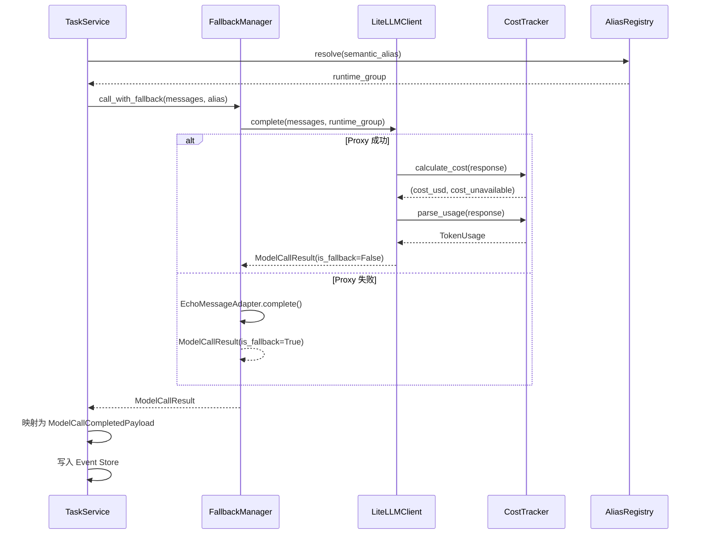

# Feature 002 数据模型

**特性**: 002-integrate-litellm-provider
**日期**: 2026-02-28
**来源**: spec.md SS5 (Key Entities) + tech-research.md SS5 (接口设计草案)

---

## 1. 实体关系图

```mermaid
erDiagram
    ModelCallResult {
        str content
        str model_alias
        str model_name
        str provider
        int duration_ms
        float cost_usd
        bool cost_unavailable
        bool is_fallback
        str fallback_reason
    }

    TokenUsage {
        int prompt_tokens
        int completion_tokens
        int total_tokens
    }

    AliasConfig {
        str name
        str description
        str category
        str runtime_group
    }

    AliasRegistry {
        list_AliasConfig aliases
    }

    ProviderConfig {
        str proxy_base_url
        str proxy_api_key
        str llm_mode
        int timeout_s
    }

    ModelCallCompletedPayload {
        str model_alias
        str model_name
        str provider
        str response_summary
        int duration_ms
        dict token_usage
        float cost_usd
        bool cost_unavailable
        bool is_fallback
        str artifact_ref
    }

    ModelCallResult ||--|| TokenUsage : contains
    AliasRegistry ||--|{ AliasConfig : manages
    ModelCallResult ..> AliasConfig : "alias 解析"
    ModelCallResult ..> ModelCallCompletedPayload : "映射到事件"
```

---

## 2. 核心实体定义

### 2.1 TokenUsage

**位置**: `packages/provider/src/octoagent/provider/models.py`
**用途**: Token 使用统计，对齐 OpenAI API 标准命名

```python
class TokenUsage(BaseModel):
    """Token 使用统计

    key 命名对齐 OpenAI/LiteLLM 行业标准：
    prompt_tokens / completion_tokens / total_tokens
    """

    prompt_tokens: int = Field(default=0, ge=0, description="输入 token 数")
    completion_tokens: int = Field(default=0, ge=0, description="输出 token 数")
    total_tokens: int = Field(default=0, ge=0, description="总 token 数")
```

**M0 兼容**: M0 的 `token_usage` 使用 `prompt`/`completion`/`total` 作为 key。Feature 002 起统一为行业标准命名。旧事件反序列化不受影响（`dict[str, int]` 类型）。

---

### 2.2 ModelCallResult

**位置**: `packages/provider/src/octoagent/provider/models.py`
**用途**: 单次 LLM 调用的完整结果，替代 M0 的 `LLMResponse` dataclass
**追踪**: FR-002-CL-3, FR-002-CT-1

```python
class ModelCallResult(BaseModel):
    """LLM 调用结果 -- 替代 M0 LLMResponse

    包含响应内容、路由信息、成本数据、降级标记等完整信息。
    所有 provider（LiteLLM、Echo、Mock）统一返回此类型。
    """

    # 响应内容
    content: str = Field(description="LLM 响应文本内容")

    # 路由信息
    model_alias: str = Field(description="请求时使用的语义 alias 或运行时 group")
    model_name: str = Field(default="", description="实际调用的模型名称（如 gpt-4o-mini）")
    provider: str = Field(default="", description="实际 provider（如 openai/anthropic）")

    # 性能指标
    duration_ms: int = Field(ge=0, description="端到端耗时（毫秒）")

    # Token 使用
    token_usage: TokenUsage = Field(
        default_factory=TokenUsage,
        description="Token 使用详情",
    )

    # 成本数据
    cost_usd: float = Field(default=0.0, ge=0.0, description="本次调用的 USD 成本")
    cost_unavailable: bool = Field(
        default=False,
        description="成本数据是否不可用（双通道均失败时为 True）",
    )

    # 降级信息
    is_fallback: bool = Field(default=False, description="是否为降级调用")
    fallback_reason: str = Field(default="", description="降级原因说明")
```

**与 M0 LLMResponse 的对比**:

| 字段 | M0 LLMResponse | Feature 002 ModelCallResult | 说明 |
|------|---------------|----------------------------|------|
| content | str | str | 不变 |
| model_alias | str | str | 不变 |
| model_name | -- | str (default="") | 新增：实际模型名称 |
| provider | -- | str (default="") | 新增：实际 provider |
| duration_ms | int | int | 不变 |
| token_usage | dict[str, int] | TokenUsage(BaseModel) | 升级为强类型 |
| cost_usd | -- | float (default=0.0) | 新增：USD 成本 |
| cost_unavailable | -- | bool (default=False) | 新增：成本可用性标记 |
| is_fallback | -- | bool (default=False) | 新增：降级标记 |
| fallback_reason | -- | str (default="") | 新增：降级原因 |

---

### 2.3 AliasConfig

**位置**: `packages/provider/src/octoagent/provider/alias.py`
**用途**: 单个语义 alias 的完整配置
**追踪**: FR-002-AL-1

```python
class AliasConfig(BaseModel):
    """单个语义 alias 的配置

    双层映射：
    - category: 成本归因维度（cheap/main/fallback）
    - runtime_group: Proxy model_name 维度（cheap/main/fallback）

    MVP 阶段 category 与 runtime_group 一一对齐。
    """

    name: str = Field(description="语义 alias 名称（如 router, planner）")
    description: str = Field(default="", description="alias 用途描述")
    category: str = Field(
        default="main",
        description="成本归因分类：cheap / main / fallback",
    )
    runtime_group: str = Field(
        default="main",
        description="运行时 group（对应 Proxy model_name）：cheap / main / fallback",
    )
```

---

### 2.4 AliasRegistry

**位置**: `packages/provider/src/octoagent/provider/alias.py`
**用途**: 所有 alias 的注册表，管理语义 alias 到 category/runtime_group 的映射
**追踪**: FR-002-AL-1, FR-002-AL-2, FR-002-AL-3

```python
class AliasRegistry:
    """Alias 注册表 -- 管理语义 alias -> category -> runtime_group 映射

    MVP：启动时从配置加载，运行期间不变。
    查询接口供 LiteLLMClient 和后续 Feature 使用。
    """

    def __init__(self, aliases: list[AliasConfig] | None = None) -> None:
        """初始化注册表

        Args:
            aliases: alias 配置列表，None 时使用 MVP 默认配置
        """
        ...

    def resolve(self, alias: str) -> str:
        """将语义 alias 解析为运行时 group（Proxy model_name）

        Args:
            alias: 语义 alias 名称

        Returns:
            运行时 group 名称

        Raises:
            KeyError: alias 未注册
        """
        ...

    def get_alias(self, alias: str) -> AliasConfig | None:
        """按名称查询 alias 配置"""
        ...

    def get_aliases_by_category(self, category: str) -> list[AliasConfig]:
        """按 category 查询 alias 列表"""
        ...

    def get_aliases_by_runtime_group(self, group: str) -> list[AliasConfig]:
        """按运行时 group 查询语义 alias 列表"""
        ...

    def list_all(self) -> list[AliasConfig]:
        """列出所有已注册的 alias"""
        ...
```

**MVP 默认配置**:

```python
DEFAULT_ALIASES = [
    AliasConfig(name="router", category="cheap", runtime_group="cheap",
                description="路由决策（轻量）"),
    AliasConfig(name="extractor", category="cheap", runtime_group="cheap",
                description="信息提取（轻量）"),
    AliasConfig(name="summarizer", category="cheap", runtime_group="cheap",
                description="摘要生成（轻量）"),
    AliasConfig(name="planner", category="main", runtime_group="main",
                description="规划推理（主力）"),
    AliasConfig(name="executor", category="main", runtime_group="main",
                description="执行生成（主力）"),
    AliasConfig(name="fallback", category="fallback", runtime_group="fallback",
                description="降级备选"),
]
```

---

### 2.5 ProviderConfig

**位置**: `packages/provider/src/octoagent/provider/config.py`
**用途**: Provider 包的配置，从环境变量加载
**追踪**: FR-002-CL-2, FR-002-LS-3, FR-002-SK-1

```python
class ProviderConfig(BaseModel):
    """Provider 包配置 -- 从环境变量加载

    环境变量:
        LITELLM_PROXY_URL: Proxy 地址（默认 http://localhost:4000）
        LITELLM_PROXY_KEY: Proxy 访问密钥
        OCTOAGENT_LLM_MODE: LLM 运行模式（litellm/echo）
        OCTOAGENT_LLM_TIMEOUT_S: 调用超时（秒，默认 30）
    """

    proxy_base_url: str = Field(
        default="http://localhost:4000",
        description="LiteLLM Proxy 基础 URL",
    )
    proxy_api_key: str = Field(
        default="",
        description="Proxy 访问密钥（不是 LLM provider API key）",
    )
    llm_mode: str = Field(
        default="litellm",
        description="LLM 运行模式：litellm / echo",
    )
    timeout_s: int = Field(
        default=30,
        ge=1,
        description="LLM 调用超时（秒）",
    )
```

---

### 2.6 ModelCallCompletedPayload（扩展）

**位置**: `packages/core/src/octoagent/core/models/payloads.py`（原地扩展）
**用途**: MODEL_CALL_COMPLETED 事件的 payload，新增成本和 provider 字段
**追踪**: FR-002-EP-1, FR-002-EP-2

```python
class ModelCallCompletedPayload(BaseModel):
    """MODEL_CALL_COMPLETED 事件 payload -- Feature 002 扩展

    新增字段均有默认值，确保 M0 旧事件可正常反序列化。
    """

    # M0 已有字段
    model_alias: str
    response_summary: str = Field(description="响应摘要（超过 8KB 截断）")
    duration_ms: int = Field(description="调用耗时（毫秒）")
    token_usage: dict[str, int] = Field(
        default_factory=dict,
        description="Token 用量（Feature 002 起使用 prompt_tokens/completion_tokens/total_tokens 命名）",
    )
    artifact_ref: str | None = Field(default=None, description="完整响应的 Artifact 引用")

    # Feature 002 新增字段（全部 Optional 或有默认值）
    model_name: str = Field(default="", description="实际调用的模型名称")
    provider: str = Field(default="", description="实际 provider 名称")
    cost_usd: float = Field(default=0.0, description="本次调用的 USD 成本")
    cost_unavailable: bool = Field(
        default=False,
        description="成本数据是否不可用",
    )
    is_fallback: bool = Field(default=False, description="是否为降级调用")
```

**向后兼容验证**:
- 所有新增字段均有默认值 -> M0 旧事件反序列化使用默认值，不报错
- `token_usage` 保持 `dict[str, int]` 类型 -> 新旧 key 命名均可存储
- `artifact_ref` 保持 `str | None` -> 不变

---

### 2.7 ModelCallFailedPayload（扩展）

**位置**: `packages/core/src/octoagent/core/models/payloads.py`（原地扩展）
**用途**: MODEL_CALL_FAILED 事件的 payload，新增 provider 和降级信息

```python
class ModelCallFailedPayload(BaseModel):
    """MODEL_CALL_FAILED 事件 payload -- Feature 002 扩展"""

    # M0 已有字段
    model_alias: str
    error_type: str
    error_message: str
    duration_ms: int

    # Feature 002 新增字段
    model_name: str = Field(default="", description="尝试调用的模型名称")
    provider: str = Field(default="", description="尝试使用的 provider")
    is_fallback: bool = Field(default=False, description="失败时是否已在降级模式")
```

---

## 3. 实体生命周期

### 3.1 ModelCallResult 生命周期



### 3.2 AliasConfig 生命周期

```
应用启动 -> 读取配置（环境变量/默认值）
         -> 构建 AliasConfig 列表
         -> 初始化 AliasRegistry
         -> 运行期间只读查询
         -> 应用关闭
```

---

## 4. 数据迁移说明

### 4.1 Event Payload 迁移

Feature 002 **不需要数据迁移**。所有新增字段均有默认值：

| 新增字段 | 默认值 | M0 旧事件行为 |
|---------|--------|-------------|
| model_name | "" | 反序列化为空字符串 |
| provider | "" | 反序列化为空字符串 |
| cost_usd | 0.0 | 反序列化为 0.0 |
| cost_unavailable | False | 反序列化为 False |
| is_fallback | False | 反序列化为 False |

### 4.2 LLMResponse -> ModelCallResult 迁移

`LLMResponse` dataclass 在 Feature 002 中**废弃但不删除**。迁移路径：

1. `packages/provider` 定义 `ModelCallResult`（新类型）
2. `LLMService` 改造后返回 `ModelCallResult`
3. `TaskService` 使用 `ModelCallResult` 的字段构建 `ModelCallCompletedPayload`
4. `LLMResponse` 保留在 `llm_service.py` 中，标记为 `@deprecated`（供 M0 测试兼容）
5. M0 旧测试逐步迁移到使用 `ModelCallResult`
