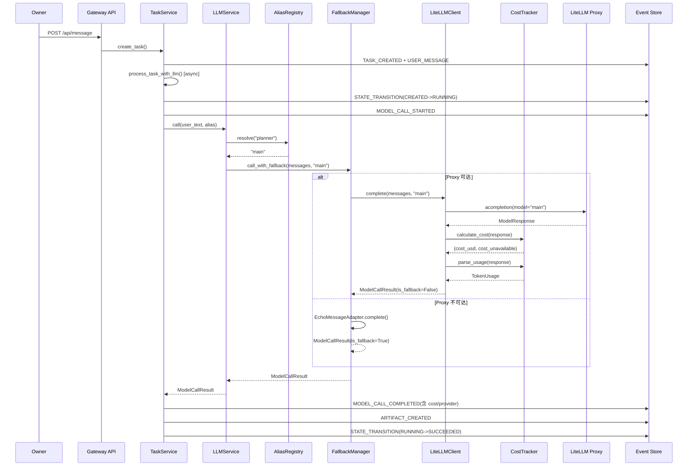
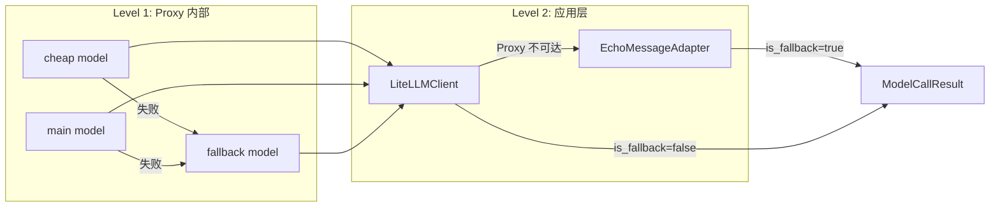

# Implementation Plan: LiteLLM Proxy 集成 + 成本治理

**Branch**: `feat/002-integrate-litellm-provider` | **Date**: 2026-02-28 | **Spec**: [spec.md](spec.md)
**Input**: Feature specification from `spec.md` + Research from `research/research-synthesis.md` + `research/tech-research.md`

---

## Summary

替换 M0 的 Echo 模式，通过 LiteLLM SDK (`acompletion()`) 接入 LiteLLM Proxy 实现真实 LLM 调用。新建 `packages/provider` 包，包含 4 个核心组件（LiteLLMClient、AliasRegistry、CostTracker、FallbackManager）+ EchoMessageAdapter 适配层。改造 Gateway 层的 LLMService、TaskService、健康检查端点。扩展 Event payload 增加成本/provider 字段。提供 Docker Compose 部署配置实现"从零到真实 LLM 响应 < 15 分钟"。

技术方案采用 **方案 A：SDK 直连 Proxy（OpenAI-compatible 模式）**，调研阶段已确认其在 Blueprint 对齐度、开发效率、Constitution 合规性三个维度全面领先。

---

## Technical Context

**Language/Version**: Python 3.12+
**Primary Dependencies**: litellm>=1.80,<2.0（新增）, FastAPI, Pydantic 2.x, httpx, structlog, aiosqlite
**Storage**: SQLite WAL（沿用 M0，Event Store append-only）
**Testing**: pytest + pytest-asyncio（M0 基线 105 测试 + Feature 002 新增 provider 测试）
**Target Platform**: macOS（开发）+ Linux Docker（Proxy 容器）
**Project Type**: Python uv workspace（packages/core + packages/provider + apps/gateway）
**Performance Goals**: LLM 调用端到端 < 30s（含 Proxy 转发）；健康检查 < 5s
**Constraints**: 单进程合并架构（不引入新进程）；LiteLLM Proxy 是唯一外部容器依赖
**Scale/Scope**: 单用户场景；并发调用数低

---

## Constitution Check

*GATE: 全部通过，无 VIOLATION。*

| 原则 | 适用性 | 评估 | 说明 |
|------|--------|------|------|
| C1: Durability First | 高 | PASS | MODEL_CALL_STARTED/COMPLETED/FAILED 事件持久化到 Event Store（SQLite WAL）；成本数据随事件落盘；进程重启后事件不丢失 |
| C2: Everything is an Event | 高 | PASS | 每次 LLM 调用生成 STARTED/COMPLETED/FAILED 事件链；成本、token usage、provider 信息全量写入事件 payload |
| C3: Tools are Contracts | 低 | N/A | Feature 002 不涉及工具调用（Tool Contract 是 Feature 003 范畴） |
| C4: Side-effect Two-Phase | 低 | N/A | LLM 调用是可重试操作（非不可逆副作用）；不需要 Plan-Gate-Execute |
| C5: Least Privilege | 高 | PASS | LLM provider API key 仅注入 Proxy 容器环境变量（.env.litellm）；应用层仅持有 Proxy 访问密钥（LITELLM_PROXY_KEY）；密钥不进 Event payload 和日志 |
| C6: Degrade Gracefully | 高 | PASS | FallbackManager 实现两级降级：Proxy 内置 model fallback + 应用层 Proxy-to-Echo fallback；降级时系统不整体不可用，任务仍可推进到 SUCCEEDED |
| C7: User-in-Control | 低 | PASS | LLM 调用不涉及不可逆操作，无需审批门禁；LLM 模式可通过配置切换（echo/litellm） |
| C8: Observability is a Feature | 高 | PASS | cost_usd/token_usage/provider/model_name/is_fallback 完整记录到事件；response_summary 遵循 8KB 截断阈值 + Artifact 引用；API key 不进日志；`/ready?profile=llm` 暴露 Proxy 健康状态 |
| C9: 不猜关键配置 | 中 | PASS | 所有配置从环境变量读取，不硬编码 provider/模型名；alias 映射从静态配置加载 |
| C10: Bias to Action | 低 | N/A | 基础设施层组件，不涉及代理行为策略 |
| C11: Context Hygiene | 中 | PASS | LLM 完整响应超 8KB 时截断 + Artifact 引用，不将大文本塞入 Event payload |
| C12: 记忆写入治理 | 低 | N/A | Feature 002 不涉及记忆写入 |
| C13: 失败可解释 | 高 | PASS | MODEL_CALL_FAILED 事件包含 error_type 分类 + error_message 说明 + is_fallback 降级状态；FallbackManager 在 fallback_reason 中记录降级原因 |
| C14: A2A 协议兼容 | 低 | PASS | Event payload 扩展不影响 A2A 状态映射；新增字段均为 metadata 层面 |

**Constitution WARN 处置**:

| WARN | 问题 | 处置 | 对应 FR |
|------|------|------|---------|
| WARN-1 | Secrets 注入路径 | API key 仅注入 Proxy 容器；应用层不持有 provider API key | FR-002-SK-1, SK-2 |
| WARN-2 | response_summary 数据边界 | 沿用 M0 的 8KB 截断阈值 + Artifact 引用 | FR-002-CL-4 |

---

## Project Structure

### Documentation (this feature)

```text
.specify/features/002-integrate-litellm-provider/
  spec.md                    # 需求规范
  plan.md                    # 本文件（技术实现计划）
  research.md                # 技术决策研究（10 个决策）
  data-model.md              # 数据模型（7 个实体）
  quickstart.md              # 快速上手指南
  contracts/
    provider-api.md          # packages/provider 公开 API 契约
    gateway-changes.md       # apps/gateway 改造契约
    deployment.md            # 部署配置契约
  research/
    product-research.md      # 产品调研（前序制品）
    tech-research.md         # 技术调研（前序制品）
    research-synthesis.md    # 产研汇总（前序制品）
```

### Source Code (repository root)

```text
octoagent/
  pyproject.toml                          # 根配置（新增 workspace member）
  packages/
    core/
      src/octoagent/core/
        models/
          payloads.py                     # [修改] ModelCallCompletedPayload 扩展
    provider/                             # [新增] packages/provider 包
      pyproject.toml
      src/octoagent/provider/
        __init__.py                       # 公开接口导出
        models.py                         # ModelCallResult, TokenUsage
        client.py                         # LiteLLMClient
        alias.py                          # AliasConfig, AliasRegistry
        cost.py                           # CostTracker
        fallback.py                       # FallbackManager
        echo_adapter.py                   # EchoMessageAdapter
        config.py                         # ProviderConfig, load_provider_config()
        exceptions.py                     # ProviderError, ProxyUnreachableError
      tests/
        __init__.py
        test_models.py                    # ModelCallResult, TokenUsage 单元测试
        test_client.py                    # LiteLLMClient 单元测试（Mock Proxy）
        test_alias.py                     # AliasRegistry 单元测试
        test_cost.py                      # CostTracker 单元测试
        test_fallback.py                  # FallbackManager 单元测试
        test_echo_adapter.py              # EchoMessageAdapter 单元测试
        test_config.py                    # ProviderConfig 单元测试
        conftest.py                       # 测试 fixtures
  apps/
    gateway/
      pyproject.toml                      # [修改] 新增 octoagent-provider 依赖
      src/octoagent/gateway/
        main.py                           # [修改] lifespan 初始化 LiteLLM 组件
        services/
          llm_service.py                  # [修改] LLMService 支持 messages + ModelCallResult
          task_service.py                 # [修改] 使用 ModelCallResult 新字段构建事件
        routes/
          health.py                       # [修改] /ready 支持 profile 参数
      tests/
        test_us4_llm_echo.py              # [修改] 适配 ModelCallResult 返回类型
  docker-compose.litellm.yml              # [新增] LiteLLM Proxy 部署
  litellm-config.yaml                     # [新增] Proxy 配置模板
  .env.example                            # [修改] 新增 LiteLLM 配置示例
  .env.litellm.example                    # [新增] LLM provider API key 示例
  tests/
    integration/
      test_sc8_llm_echo.py                # [修改] 适配 ModelCallResult
```

**Structure Decision**: 采用现有 uv workspace 多包结构（packages/core + packages/provider + apps/gateway）。`packages/provider` 作为新增的独立包，与 `packages/core` 平级。不引入新的 app 或独立进程。

---

## Architecture

### 整体架构图

```mermaid
graph TB
    subgraph "用户层"
        User[Owner]
        WebUI[Web UI]
    end

    subgraph "apps/gateway"
        API[FastAPI Routes]
        LLMSvc[LLMService]
        TaskSvc[TaskService]
        Health[/ready endpoint]
    end

    subgraph "packages/provider"
        FM[FallbackManager]
        LC[LiteLLMClient]
        EA[EchoMessageAdapter]
        AR[AliasRegistry]
        CT[CostTracker]
    end

    subgraph "packages/core"
        ES[Event Store]
        TS[Task Store]
        AS[Artifact Store]
        Payload[ModelCallCompletedPayload]
    end

    subgraph "外部依赖"
        Proxy[LiteLLM Proxy<br/>Docker Container]
        OpenAI[OpenAI API]
        Anthropic[Anthropic API]
    end

    User -->|POST /api/message| API
    API --> TaskSvc
    TaskSvc --> LLMSvc
    LLMSvc -->|resolve alias| AR
    LLMSvc --> FM
    FM -->|primary| LC
    FM -->|fallback| EA
    LC -->|acompletion| Proxy
    LC -->|calculate_cost| CT
    Proxy --> OpenAI
    Proxy --> Anthropic
    TaskSvc -->|write event| ES
    TaskSvc -->|update task| TS
    TaskSvc -->|store artifact| AS
    Health -->|health_check| LC
    WebUI -->|SSE| API
```

### LLM 调用序列图



### 降级链路图



---

## Implementation Phases

### Phase 1: packages/provider 核心组件

**目标**: 建立独立的 provider 包，包含所有 LLM 调用基础设施

| 步骤 | 内容 | 产出 | 追踪 |
|------|------|------|------|
| 1.1 | 创建 packages/provider 包骨架（pyproject.toml + __init__.py） | 包结构 | -- |
| 1.2 | 实现 models.py（TokenUsage + ModelCallResult） | 数据模型 | FR-002-CL-3 |
| 1.3 | 实现 exceptions.py（ProviderError 异常体系） | 异常体系 | -- |
| 1.4 | 实现 config.py（ProviderConfig + load_provider_config） | 配置加载 | FR-002-CL-2, LS-3 |
| 1.5 | 实现 alias.py（AliasConfig + AliasRegistry） | Alias 管理 | FR-002-AL-1, AL-2, AL-3 |
| 1.6 | 实现 cost.py（CostTracker） | 成本计算 | FR-002-CT-1, CT-2 |
| 1.7 | 实现 client.py（LiteLLMClient） | Proxy 客户端 | FR-002-CL-1, CL-2 |
| 1.8 | 实现 echo_adapter.py（EchoMessageAdapter） | Echo 适配器 | FR-002-LS-2 |
| 1.9 | 实现 fallback.py（FallbackManager） | 降级管理 | FR-002-FM-1, FM-2, FM-3 |
| 1.10 | 编写 provider 包单元测试（覆盖率 >= 80%） | 测试 | SC-7 |

### Phase 2: Gateway 改造

**目标**: 将 provider 包集成到现有 Gateway，实现 Echo -> LiteLLM 切换

| 步骤 | 内容 | 产出 | 追踪 |
|------|------|------|------|
| 2.1 | 扩展 ModelCallCompletedPayload（新增 cost/provider 字段） | Payload 扩展 | FR-002-EP-1, EP-2 |
| 2.2 | 扩展 ModelCallFailedPayload（新增 provider/is_fallback 字段） | Payload 扩展 | -- |
| 2.3 | 改造 LLMService（messages 支持 + ModelCallResult 返回） | 服务改造 | FR-002-LS-1, LS-2 |
| 2.4 | 改造 main.py lifespan（根据 LLM_MODE 初始化组件） | 初始化改造 | FR-002-LS-1, LS-3 |
| 2.5 | 改造 TaskService.process_task_with_llm（使用新字段构建事件） | 事件链改造 | FR-002-EP-1 |
| 2.6 | 改造 /ready 端点（支持 profile 参数） | 健康检查 | FR-002-HC-1, HC-2 |
| 2.7 | 更新 pyproject.toml（workspace + 依赖） | 依赖管理 | -- |

### Phase 3: 部署配置

**目标**: 提供即开即用的 LiteLLM Proxy 部署方案

| 步骤 | 内容 | 产出 | 追踪 |
|------|------|------|------|
| 3.1 | 创建 docker-compose.litellm.yml | Docker 配置 | FR-002-DC-1 |
| 3.2 | 创建 litellm-config.yaml（Proxy 配置模板） | Proxy 配置 | FR-002-DC-2 |
| 3.3 | 创建 .env.example 和 .env.litellm.example | 配置示例 | FR-002-SK-2 |
| 3.4 | 更新 .gitignore（secrets 保护） | Git 配置 | FR-002-SK-1 |

### Phase 4: 测试与验证

**目标**: 确保所有功能正确、M0 向后兼容

| 步骤 | 内容 | 产出 | 追踪 |
|------|------|------|------|
| 4.1 | M0 回归测试（所有 105 个测试通过） | 回归验证 | SC-6 |
| 4.2 | Provider 单元测试（覆盖率 >= 80%） | 单元测试 | SC-7 |
| 4.3 | 集成测试：Echo 模式全链路 | 集成测试 | SC-4 |
| 4.4 | 集成测试：LiteLLM 模式 Mock Proxy | 集成测试 | SC-1, SC-2, SC-3 |
| 4.5 | 集成测试：降级与恢复 | 集成测试 | SC-4 |
| 4.6 | 集成测试：健康检查 profile | 集成测试 | SC-5 |
| 4.7 | Contract 测试：Payload 向后兼容 | 契约测试 | SC-6 |
| 4.8 | 端到端测试：真实 Proxy + 真实 LLM（手动） | E2E 验证 | SC-1, SC-3 |

---

## Test Strategy

### 测试分层

| 层级 | 范围 | 工具 | 外部依赖 |
|------|------|------|---------|
| 单元测试 | packages/provider 各组件 | pytest + Mock | 无 |
| 集成测试（Echo） | Gateway 全链路（Echo 模式） | pytest + TestClient | 无 |
| 集成测试（Mock Proxy） | Gateway 全链路（模拟 LiteLLM） | pytest + httpx mock | 无 |
| 契约测试 | Payload 向后兼容性 | pytest | 无 |
| 端到端测试 | 真实 Proxy + 真实 LLM | 手动 / CI optional | LiteLLM Proxy + API Key |

### 关键测试用例

| 编号 | 测试场景 | 验证点 | 对应 SC |
|------|---------|--------|--------|
| T-01 | LiteLLMClient.complete() 成功 | ModelCallResult 字段完整 | SC-1 |
| T-02 | CostTracker 双通道计算 | cost_usd > 0 或 cost_unavailable=True | SC-2 |
| T-03 | AliasRegistry.resolve() 映射 | cheap/main/fallback 正确路由 | SC-3 |
| T-04 | FallbackManager Proxy 不可达 | is_fallback=True, fallback_reason 非空 | SC-4 |
| T-05 | /ready?profile=llm | litellm_proxy="ok" | SC-5 |
| T-06 | /ready?profile=core | litellm_proxy="skipped" | SC-5 |
| T-07 | M0 旧事件反序列化 | 新字段使用默认值，不报错 | SC-6 |
| T-08 | Echo 模式全链路 | 行为与 M0 一致 | SC-6 |
| T-09 | Provider 包覆盖率 | >= 80% | SC-7 |

---

## Dependency Management

### 新增依赖

| 包 | 版本范围 | 许可证 | 用途 | 安装目标 |
|----|---------|--------|------|---------|
| litellm | >=1.80,<2.0 | MIT | LLM SDK | packages/provider |
| httpx | >=0.27,<1.0 | BSD-3 | 健康检查 HTTP 客户端 | packages/provider |

### packages/provider/pyproject.toml

```toml
[project]
name = "octoagent-provider"
version = "0.1.0"
description = "OctoAgent Provider -- LLM 调用抽象层"
requires-python = ">=3.12"
dependencies = [
    "litellm>=1.80,<2.0",
    "httpx>=0.27,<1.0",
    "pydantic>=2.10,<3.0",
    "structlog>=25.1,<26.0",
    "octoagent-core",
]
```

### Workspace 配置更新

```toml
# octoagent/pyproject.toml
[tool.uv.workspace]
members = [
    "packages/core",
    "packages/provider",    # 新增
    "apps/gateway",
]

[tool.uv.sources]
octoagent-core = { workspace = true }
octoagent-provider = { workspace = true }  # 新增
octoagent-gateway = { workspace = true }

[tool.pytest.ini_options]
testpaths = [
    "packages/core/tests",
    "packages/provider/tests",    # 新增
    "apps/gateway/tests",
    "tests",
]
```

---

## Complexity Tracking

> 记录偏离"最简方案"的技术决策及其理由。

| 决策 | 为何不用更简单的方案 | 被否决的简单方案 |
|------|---------------------|----------------|
| AliasRegistry 双层映射（category + runtime_group） | Feature 003 summarizer 和 Feature 004 planner 需要语义粒度的 alias 调用；仅 3 个运行时 group 无法表达业务意图 | 直接使用 3 个运行时 group（cheap/main/fallback），无语义 alias |
| EchoMessageAdapter 适配层 | FallbackManager 需要统一的 `complete(messages)` 调用契约；直接修改 EchoProvider 会破坏 M0 测试 | 在 FallbackManager 内部做 prompt/messages 双轨分支 |
| CostTracker 双通道策略 | 部分新模型的 pricing 数据可能在 LiteLLM 中缺失，单通道存在盲区；cost_unavailable 标记对齐 C8 可观测要求 | 仅使用 `completion_cost()` 公开 API |
| ModelCallResult 替换 LLMResponse | FallbackManager 需要统一返回类型（含 is_fallback）；dataclass 不支持 Pydantic 验证 | 在 LLMResponse dataclass 上扩展字段 |

---

## Risk Mitigations

| 风险 | 概率 | 影响 | 缓解策略 |
|------|------|------|---------|
| LiteLLM SDK 版本 breaking change | 中 | 高 | 锁定 `>=1.80,<2.0`；Adapter 模式隔离 SDK 类型；CI 兼容性测试 |
| Proxy 部署阻塞 | 低 | 高 | 提供 docker-compose + 示例 config；EchoProvider 保底 |
| cost 数据不可靠 | 中 | 中 | 双通道策略 + cost_unavailable 标记 + raw usage 保留 |
| async event loop 阻塞 | 低 | 高 | 使用 `acompletion()` 原生 async；设置 request_timeout |
| M0 测试回归 | 低 | 高 | 所有新增字段有默认值；echo 模式保持 M0 行为不变 |

---

## Success Criteria Mapping

| SC 编号 | 标准 | 验证方式 | 对应 Phase |
|---------|------|---------|-----------|
| SC-1 | 通过 Proxy 成功调用真实 LLM | E2E 测试 (T-01, T-08) | Phase 1 + 4 |
| SC-2 | cost_usd/token_usage/provider/model_name 完整记录 | 集成测试 (T-02) | Phase 1 + 2 |
| SC-3 | 语义 alias 正确路由到运行时 group | 集成测试 (T-03) | Phase 1 |
| SC-4 | Proxy 不可达时自动降级到 Echo | 集成测试 (T-04) | Phase 1 |
| SC-5 | /ready 返回 Proxy 真实健康状态 | 集成测试 (T-05, T-06) | Phase 2 |
| SC-6 | M0 所有测试继续通过 | 回归测试 (T-07, T-08) | Phase 4 |
| SC-7 | Provider 包覆盖率 >= 80% | 覆盖率分析 (T-09) | Phase 4 |

---

## Estimated Effort

| Phase | 预估工作量 | 核心产出 |
|-------|-----------|---------|
| Phase 1: Provider 核心组件 | 1.5-2 天 | 9 个源文件 + 7 个测试文件 |
| Phase 2: Gateway 改造 | 1-1.5 天 | 5 个文件修改 |
| Phase 3: 部署配置 | 0.5 天 | 4 个配置文件 |
| Phase 4: 测试与验证 | 0.5-1 天 | 全量测试通过 |
| **合计** | **3.5-5 天** | -- |

**预估对齐**: 与 m1-feature-split.md 的 3-4 天估算基本一致。
