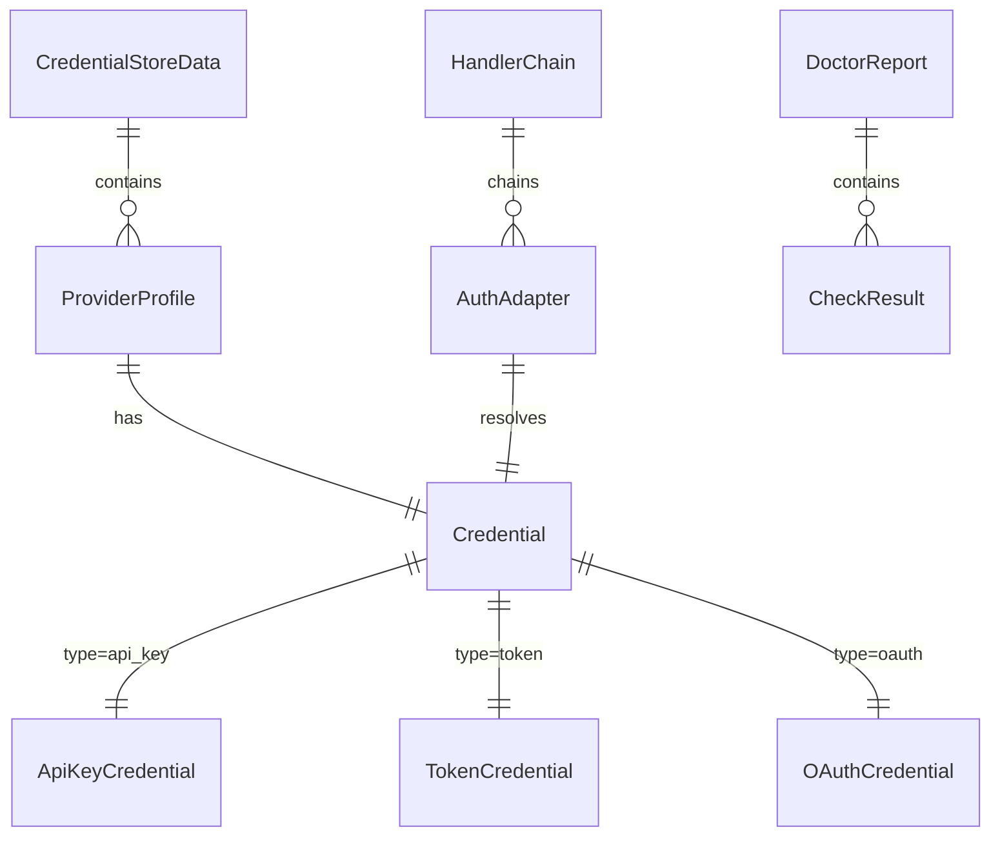

# Feature 003 数据模型

**Feature**: Auth Adapter + DX 工具
**Date**: 2026-03-01
**Status**: Draft
**Blueprint 依据**: SS8.9.4

---

## 1. 凭证类型体系

所有凭证类型继承自 `Credential` 联合类型（Discriminated Union），通过 `type` 字段区分。
代码位置：`packages/provider/src/octoagent/provider/auth/credentials.py`

### 1.1 ApiKeyCredential

标准 API Key 凭证，适用于 OpenAI / OpenRouter / Anthropic 标准模式。

```python
class ApiKeyCredential(BaseModel):
    """API Key 凭证 -- 标准 Provider 密钥

    适用 Provider: OpenAI、OpenRouter、Anthropic（标准模式）
    特征: 永不过期（除非用户主动吊销）
    """
    type: Literal["api_key"] = "api_key"
    provider: str = Field(description="Provider 标识（如 openai、openrouter、anthropic）")
    key: SecretStr = Field(description="API Key 值")
```

**字段说明**:

| 字段 | 类型 | 必填 | 说明 |
|------|------|------|------|
| type | `Literal["api_key"]` | Y | 凭证类型鉴别器 |
| provider | `str` | Y | Provider 标识 |
| key | `SecretStr` | Y | API Key 值，序列化时脱敏 |

### 1.2 TokenCredential

临时 Token 凭证，适用于 Anthropic Setup Token。

```python
class TokenCredential(BaseModel):
    """Token 凭证 -- 带过期时间的临时令牌

    适用 Provider: Anthropic Setup Token（sk-ant-oat01-* 格式）
    特征: 有过期时间，需要过期检测
    """
    type: Literal["token"] = "token"
    provider: str = Field(description="Provider 标识")
    token: SecretStr = Field(description="Token 值")
    acquired_at: datetime = Field(description="Token 获取时间")
    expires_at: datetime | None = Field(
        default=None,
        description="过期时间（基于 acquired_at + TTL 计算）"
    )
```

**字段说明**:

| 字段 | 类型 | 必填 | 说明 |
|------|------|------|------|
| type | `Literal["token"]` | Y | 凭证类型鉴别器 |
| provider | `str` | Y | Provider 标识 |
| token | `SecretStr` | Y | Token 值 |
| acquired_at | `datetime` | Y | 获取时间戳，用于计算过期 |
| expires_at | `datetime \| None` | N | 过期时间，None 表示未知 |

### 1.3 OAuthCredential

OAuth 凭证，适用于 Codex OAuth Device Flow。

```python
class OAuthCredential(BaseModel):
    """OAuth 凭证 -- 访问令牌 + 刷新令牌

    适用 Provider: OpenAI Codex（Device Flow）
    特征: 有过期时间，支持 token 刷新
    """
    type: Literal["oauth"] = "oauth"
    provider: str = Field(description="Provider 标识")
    access_token: SecretStr = Field(description="访问令牌")
    refresh_token: SecretStr = Field(default=SecretStr(""), description="刷新令牌")
    expires_at: datetime = Field(description="访问令牌过期时间")
```

**字段说明**:

| 字段 | 类型 | 必填 | 说明 |
|------|------|------|------|
| type | `Literal["oauth"]` | Y | 凭证类型鉴别器 |
| provider | `str` | Y | Provider 标识 |
| access_token | `SecretStr` | Y | 访问令牌 |
| refresh_token | `SecretStr` | N | 刷新令牌（Device Flow 可能不提供） |
| expires_at | `datetime` | Y | 访问令牌过期时间 |

### 1.4 Credential 联合类型

```python
from typing import Annotated, Union
from pydantic import Discriminator

Credential = Annotated[
    Union[ApiKeyCredential, TokenCredential, OAuthCredential],
    Discriminator("type"),
]
```

---

## 2. Provider Profile

一个 Profile 代表一个完整的 Provider 连接配置，包含元数据和凭证引用。
代码位置：`packages/provider/src/octoagent/provider/auth/profile.py`

```python
class ProviderProfile(BaseModel):
    """Provider 配置档 -- 关联的配置元数据和凭证

    一个 credential store 可包含多个 profile。
    """
    name: str = Field(description="Profile 名称（唯一标识）")
    provider: str = Field(description="Provider 标识")
    auth_mode: Literal["api_key", "token", "oauth"] = Field(
        description="认证模式"
    )
    credential: Credential = Field(description="关联的凭证")
    is_default: bool = Field(default=False, description="是否为默认 profile")
    created_at: datetime = Field(description="创建时间")
    updated_at: datetime = Field(description="最近更新时间")
```

**字段说明**:

| 字段 | 类型 | 必填 | 说明 |
|------|------|------|------|
| name | `str` | Y | Profile 唯一名称（如 `openrouter-default`） |
| provider | `str` | Y | Provider 标识 |
| auth_mode | `Literal[...]` | Y | 认证模式 |
| credential | `Credential` | Y | 关联凭证（Discriminated Union） |
| is_default | `bool` | N | 默认 False |
| created_at | `datetime` | Y | 创建时间 |
| updated_at | `datetime` | Y | 更新时间 |

---

## 3. Credential Store

凭证存储容器模型。
代码位置：`packages/provider/src/octoagent/provider/auth/store.py`

```python
class CredentialStoreData(BaseModel):
    """Credential Store 持久化数据结构

    对应 ~/.octoagent/auth-profiles.json 文件内容。
    """
    version: int = Field(default=1, description="Schema 版本号")
    profiles: dict[str, ProviderProfile] = Field(
        default_factory=dict,
        description="Profile 名称 -> Profile 映射"
    )
```

**JSON 示例**:

```json
{
  "version": 1,
  "profiles": {
    "openrouter-default": {
      "name": "openrouter-default",
      "provider": "openrouter",
      "auth_mode": "api_key",
      "credential": {
        "type": "api_key",
        "provider": "openrouter",
        "key": "sk-or-v1-xxx..."
      },
      "is_default": true,
      "created_at": "2026-03-01T10:00:00Z",
      "updated_at": "2026-03-01T10:00:00Z"
    },
    "anthropic-setup": {
      "name": "anthropic-setup",
      "provider": "anthropic",
      "auth_mode": "token",
      "credential": {
        "type": "token",
        "provider": "anthropic",
        "token": "sk-ant-oat01-xxx...",
        "acquired_at": "2026-03-01T10:00:00Z",
        "expires_at": "2026-03-02T10:00:00Z"
      },
      "is_default": false,
      "created_at": "2026-03-01T10:00:00Z",
      "updated_at": "2026-03-01T10:00:00Z"
    }
  }
}
```

---

## 4. AuthAdapter 接口

抽象认证适配器接口。
代码位置：`packages/provider/src/octoagent/provider/auth/adapter.py`

```python
class AuthAdapter(ABC):
    """认证适配器抽象基类

    每种认证模式对应一个 AuthAdapter 实现。
    Handler Chain 按优先级依次调用 adapter。
    """

    @abstractmethod
    async def resolve(self) -> str:
        """解析当前可用的凭证值（API key / access token）

        Returns:
            可直接用于 API 调用的凭证字符串

        Raises:
            CredentialError: 无法解析有效凭证
        """

    @abstractmethod
    async def refresh(self) -> str | None:
        """刷新过期凭证

        Returns:
            刷新后的凭证字符串，不支持刷新时返回 None
        """

    @abstractmethod
    def is_expired(self) -> bool:
        """检查凭证是否已过期

        Returns:
            True 表示已过期或即将过期
        """
```

---

## 5. Handler Chain

处理器链模型。
代码位置：`packages/provider/src/octoagent/provider/auth/chain.py`

```python
class HandlerChainResult(BaseModel):
    """Handler Chain 解析结果"""
    provider: str = Field(description="匹配的 Provider")
    credential_value: str = Field(description="解析到的凭证值")
    source: Literal["profile", "store", "env", "default"] = Field(
        description="凭证来源"
    )
    adapter: str = Field(description="匹配的 AuthAdapter 类名")
```

---

## 6. 诊断检查项模型

`octo doctor` 的检查项数据模型。
代码位置：`packages/provider/src/octoagent/provider/dx/models.py`

```python
class CheckStatus(StrEnum):
    """诊断检查状态"""
    PASS = "pass"
    WARN = "warn"
    FAIL = "fail"
    SKIP = "skip"

class CheckLevel(StrEnum):
    """检查项级别"""
    REQUIRED = "required"      # 必须通过（阻断）
    RECOMMENDED = "recommended" # 建议通过（警告）

class CheckResult(BaseModel):
    """单项诊断检查结果"""
    name: str = Field(description="检查项名称")
    status: CheckStatus = Field(description="检查状态")
    level: CheckLevel = Field(description="检查级别")
    message: str = Field(description="状态描述")
    fix_hint: str = Field(default="", description="修复建议")

class DoctorReport(BaseModel):
    """诊断报告"""
    checks: list[CheckResult] = Field(default_factory=list)
    overall_status: CheckStatus = Field(description="总体状态")
    timestamp: datetime = Field(description="诊断时间")
```

---

## 7. EventType 扩展

在现有 `EventType` 枚举中新增凭证事件类型。
代码位置：`packages/core/src/octoagent/core/models/enums.py`

```python
# 新增凭证生命周期事件（Feature 003 -- FR-012）
CREDENTIAL_LOADED = "CREDENTIAL_LOADED"
CREDENTIAL_EXPIRED = "CREDENTIAL_EXPIRED"
CREDENTIAL_FAILED = "CREDENTIAL_FAILED"
```

**事件 Payload 规范**:

| 事件类型 | Payload 字段 | 说明 |
|----------|------------|------|
| CREDENTIAL_LOADED | `{"provider": str, "credential_type": str, "source": str}` | 凭证成功加载 |
| CREDENTIAL_EXPIRED | `{"provider": str, "credential_type": str, "expired_at": str}` | 凭证已过期 |
| CREDENTIAL_FAILED | `{"provider": str, "credential_type": str, "reason": str}` | 凭证加载/刷新失败 |

注意：Payload 中 **不包含凭证值本身**，仅包含元信息。对齐 Constitution C5 + FR-012。

---

## 8. 异常体系扩展

在 `packages/provider/src/octoagent/provider/exceptions.py` 中新增凭证相关异常。

```python
class CredentialError(ProviderError):
    """凭证相关错误基类"""
    def __init__(self, message: str, provider: str = "") -> None:
        super().__init__(message, recoverable=True)
        self.provider = provider

class CredentialNotFoundError(CredentialError):
    """凭证未找到"""

class CredentialExpiredError(CredentialError):
    """凭证已过期"""

class CredentialValidationError(CredentialError):
    """凭证格式校验失败"""

class OAuthFlowError(CredentialError):
    """OAuth 流程错误（授权超时、端点不可达等）"""
```

---

## 实体关系图


