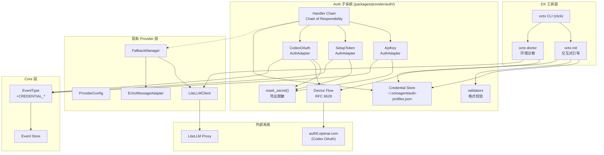
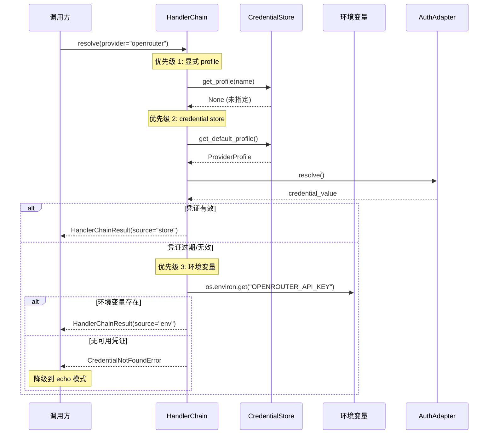
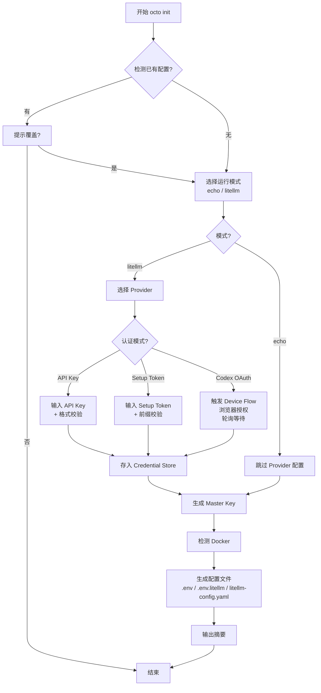
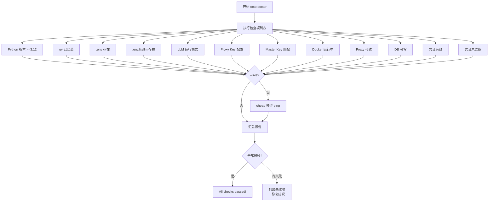

# Feature 003 技术实现计划

**Feature**: Auth Adapter + DX 工具
**Feature Branch**: `feat/003-auth-adapter-dx`
**Date**: 2026-03-01
**Status**: Draft
**Spec**: `spec.md` (v3)
**Blueprint**: SS8.9.4 + SS12.9

---

## 1. Summary

Feature 003 构建 OctoAgent 的完整 Auth 基础设施和开发者体验工具。核心交付：

1. **三种 AuthAdapter 实现**：API Key（OpenAI/OpenRouter/Anthropic 标准）、Anthropic Setup Token（免费试用）、Codex OAuth Device Flow（免费试用）
2. **Credential Store**：基于 JSON 文件的凭证持久化存储，文件锁保护并发安全，文件权限 `0o600`
3. **Handler Chain**：Chain of Responsibility 模式的凭证解析链，优先级为 显式 profile > credential store > 环境变量 > 默认值
4. **`octo init` CLI**：交互式引导配置，从 Provider 选择到配置文件生成的完整流程
5. **`octo doctor` CLI**：13 项环境诊断检查，支持 `--live` 端到端连通性验证
6. **dotenv 自动加载**：Gateway 启动时自动加载 `.env`
7. **凭证安全**：脱敏日志、凭证/配置物理隔离、EventType 扩展记录凭证生命周期事件

---

## 2. Technical Context

### 2.1 语言与运行时

| 项 | 值 |
|---|---|
| 语言 | Python 3.12+ |
| 包管理 | uv (workspace monorepo) |
| 类型系统 | Pydantic v2 BaseModel + SecretStr |
| 异步 | async/await（AuthAdapter.resolve/refresh） |
| 日志 | structlog |

### 2.2 目标包

**主包**：`octoagent-provider`（`packages/provider/`）

Auth 逻辑位于 `packages/provider/src/octoagent/provider/auth/` 子目录。
DX 工具位于 `packages/provider/src/octoagent/provider/dx/` 子目录。

**依赖包**：`octoagent-core`（EventType 枚举扩展）

### 2.3 新增依赖

| 依赖 | 版本约束 | 用途 |
|------|----------|------|
| `click` | `>=8.1,<9.0` | CLI 框架 |
| `rich` | `>=13.0,<14.0` | 终端格式化输出 |
| `questionary` | `>=2.0,<3.0` | 交互式提示 |
| `python-dotenv` | `>=1.0,<2.0` | .env 自动加载 |
| `filelock` | `>=3.12,<4.0` | 跨进程文件锁 |

### 2.4 存储方案

| 数据 | 存储 | 位置 |
|------|------|------|
| 凭证 | JSON 文件 | `~/.octoagent/auth-profiles.json` |
| 配置元数据 | .env 文件 | 项目根目录 `.env` / `.env.litellm` |
| LiteLLM 配置 | YAML 文件 | 项目根目录 `litellm-config.yaml` |
| 凭证事件 | Event Store (SQLite) | `data/octoagent.db` |

### 2.5 测试策略

| 层级 | 工具 | 覆盖范围 |
|------|------|----------|
| 单元测试 | pytest + pytest-asyncio | 凭证模型、Adapter、Store、Chain、脱敏、校验 |
| CLI 测试 | click.testing.CliRunner | `octo init`、`octo doctor` |
| 集成测试 | pytest + tmp_path | 文件系统操作、环境变量交互 |
| Contract 测试 | pytest | AuthAdapter 接口一致性 |

---

## 3. Constitution Check

| # | 原则 | 适用性 | 评估 | 说明 |
|---|------|--------|------|------|
| C1 | Durability First | 适用 | PASS | 凭证持久化到 `auth-profiles.json`，credential store 使用原子写入（先写临时文件再 rename），配置文件均持久化 |
| C2 | Everything is an Event | 适用 | PASS | EventType 扩展 CREDENTIAL_LOADED/EXPIRED/FAILED，凭证生命周期事件记录到 Event Store（FR-012） |
| C3 | Tools are Contracts | 低适用 | PASS | Feature 003 不引入新工具（tool schema 层面），AuthAdapter 本身是内部契约非工具 |
| C4 | Side-effect Two-Phase | 低适用 | PASS | `octo init` 生成配置文件前展示摘要并确认（交互式），非不可逆操作（文件可覆盖） |
| C5 | Least Privilege | 高适用 | PASS | 凭证与配置物理隔离（FR-013）；凭证不进日志/事件/LLM 上下文（FR-011）；SecretStr 类型 + mask_secret() 脱敏；文件权限 0o600 |
| C6 | Degrade Gracefully | 高适用 | PASS | Handler Chain 穷尽所有 handler 后降级到 echo 模式（FR-010）；dotenv 文件不存在时静默跳过；credential store 文件损坏时备份并创建空 store |
| C7 | User-in-Control | 高适用 | PASS | `octo init` 交互式引导（FR-007）；`octo doctor` 可视化诊断（FR-008）；配置生成前需用户确认 |
| C8 | Observability | 适用 | PASS | 凭证事件记录到 Event Store（FR-012）；`octo doctor` 提供全面的环境状态可视化；structlog 结构化日志包含凭证操作审计（脱敏） |
| C9 | 不猜关键配置 | 适用 | PASS | `octo init` 引导用户明确选择 Provider 和认证模式，不自动推断 |
| C10 | Bias to Action | 适用 | PASS | `octo doctor` 每项检查均给出具体修复建议，不输出无意义的"检查失败" |
| C11 | Context Hygiene | 低适用 | PASS | 凭证值不进 LLM 上下文（FR-011） |
| C12 | 记忆写入治理 | 不适用 | N/A | Feature 003 不涉及记忆系统 |
| C13 | 失败可解释 | 适用 | PASS | CredentialError 体系分类（NotFound/Expired/Validation/OAuthFlow）；每种错误提供恢复路径（重试/切换模式/运行 `octo doctor`） |
| C14 | A2A 兼容 | 不适用 | N/A | Feature 003 不涉及 A2A 协议 |

**结论**: 所有适用的 Constitution 原则均 PASS，无 VIOLATION。

---

## 4. Project Structure

### 4.1 新增文件

```
octoagent/packages/provider/
├── src/octoagent/provider/
│   ├── auth/                          # 新增: Auth 子系统
│   │   ├── __init__.py               # 公开接口导出
│   │   ├── adapter.py                # AuthAdapter ABC
│   │   ├── api_key_adapter.py        # FR-003: API Key 适配器
│   │   ├── setup_token_adapter.py    # FR-004: Setup Token 适配器
│   │   ├── codex_oauth_adapter.py    # FR-005: Codex OAuth 适配器
│   │   ├── chain.py                  # FR-010: Handler Chain
│   │   ├── credentials.py            # FR-001: 凭证数据模型
│   │   ├── profile.py                # Provider Profile 模型
│   │   ├── store.py                  # FR-006: Credential Store
│   │   ├── masking.py                # FR-011: 凭证脱敏
│   │   ├── validators.py             # 凭证格式校验
│   │   ├── events.py                 # FR-012: 凭证事件发射
│   │   └── oauth.py                  # FR-005: Device Flow 实现
│   ├── dx/                            # 新增: DX 工具
│   │   ├── __init__.py
│   │   ├── cli.py                    # CLI 入口（click）
│   │   ├── init_wizard.py            # FR-007: octo init
│   │   ├── doctor.py                 # FR-008: octo doctor
│   │   ├── dotenv_loader.py          # FR-009: dotenv 加载
│   │   └── models.py                 # DX 数据模型
│   └── exceptions.py                  # 修改: 新增凭证异常
├── tests/
│   ├── test_credentials.py            # 凭证模型测试
│   ├── test_profile.py                # Profile 模型测试
│   ├── test_store.py                  # Credential Store 测试
│   ├── test_api_key_adapter.py        # API Key 适配器测试
│   ├── test_setup_token_adapter.py    # Setup Token 适配器测试
│   ├── test_codex_oauth_adapter.py    # Codex OAuth 适配器测试
│   ├── test_chain.py                  # Handler Chain 测试
│   ├── test_masking.py                # 脱敏测试
│   ├── test_validators.py             # 校验测试
│   ├── test_oauth_flow.py             # Device Flow 测试
│   ├── test_doctor.py                 # octo doctor 测试
│   └── test_init_wizard.py            # octo init 测试
└── pyproject.toml                      # 修改: 新增依赖 + scripts

octoagent/packages/core/
└── src/octoagent/core/models/
    └── enums.py                        # 修改: EventType 扩展

octoagent/apps/gateway/
└── src/octoagent/gateway/
    └── main.py                         # 修改: dotenv 自动加载

octoagent/.gitignore                    # 修改: 确保排除 auth-profiles.json
```

### 4.2 修改文件

| 文件 | 修改内容 |
|------|----------|
| `packages/provider/pyproject.toml` | 新增 click/rich/questionary/python-dotenv/filelock 依赖 + `[project.scripts]` 入口 |
| `packages/provider/src/octoagent/provider/__init__.py` | 导出 auth 和 dx 子模块公开接口 |
| `packages/provider/src/octoagent/provider/exceptions.py` | 新增 CredentialError 及子类 |
| `packages/core/src/octoagent/core/models/enums.py` | EventType 新增 CREDENTIAL_LOADED/EXPIRED/FAILED |
| `apps/gateway/src/octoagent/gateway/main.py` | 添加 `load_dotenv(override=False)` |
| `octoagent/.gitignore` | 确保 `auth-profiles.json` 被排除 |

---

## 5. Architecture

### 5.1 整体架构图



### 5.2 Handler Chain 解析流程



### 5.3 `octo init` 流程



### 5.4 `octo doctor` 流程



---

## 6. Implementation Phases

### Phase A: 数据模型 + 异常体系（预估 2h）

**目标**: 建立凭证类型体系、异常层次、脱敏和校验工具。

| 任务 | 对齐 FR | 输出文件 |
|------|---------|----------|
| 凭证类型（ApiKey/Token/OAuth + Discriminated Union） | FR-001 | `auth/credentials.py` |
| ProviderProfile 模型 | - | `auth/profile.py` |
| 凭证脱敏工具 | FR-011 | `auth/masking.py` |
| 凭证格式校验 | FR-003, FR-004 | `auth/validators.py` |
| CredentialError 异常体系 | - | `exceptions.py` |
| EventType 枚举扩展 | FR-012 | `core/models/enums.py` |
| 单元测试 | - | `tests/test_credentials.py`, `tests/test_masking.py`, `tests/test_validators.py` |

### Phase B: 存储层（预估 2h）

**目标**: 实现 Credential Store 文件持久化，包含并发安全和容错。

| 任务 | 对齐 FR | 输出文件 |
|------|---------|----------|
| CredentialStoreData 模型 | FR-006 | `auth/store.py` |
| CredentialStore 读写（filelock + 原子写入） | FR-006, EC-5 | `auth/store.py` |
| 文件损坏恢复（备份 + 空 store） | EC-2 | `auth/store.py` |
| 文件权限设置（0o600） | FR-006 | `auth/store.py` |
| 凭证事件发射 | FR-012 | `auth/events.py` |
| 单元测试 | - | `tests/test_store.py` |

### Phase C: Adapter 层（预估 3h）

**目标**: 实现三种 AuthAdapter 和 Handler Chain。

| 任务 | 对齐 FR | 输出文件 |
|------|---------|----------|
| AuthAdapter ABC | FR-002 | `auth/adapter.py` |
| ApiKeyAuthAdapter | FR-003 | `auth/api_key_adapter.py` |
| SetupTokenAuthAdapter + TTL 管理 | FR-004, EC-1 | `auth/setup_token_adapter.py` |
| Codex Device Flow 实现 | FR-005 | `auth/oauth.py` |
| CodexOAuthAdapter | FR-005 | `auth/codex_oauth_adapter.py` |
| HandlerChain（优先级解析链） | FR-010 | `auth/chain.py` |
| 所有凭证失效时降级到 echo | FR-010, EC-4 | `auth/chain.py` |
| auth/__init__.py 公开接口 | - | `auth/__init__.py` |
| 单元测试 | - | `tests/test_api_key_adapter.py`, `tests/test_setup_token_adapter.py`, `tests/test_codex_oauth_adapter.py`, `tests/test_chain.py`, `tests/test_oauth_flow.py` |

### Phase D: DX 工具（预估 3h）

**目标**: 实现 `octo init` 和 `octo doctor` CLI 工具。

| 任务 | 对齐 FR | 输出文件 |
|------|---------|----------|
| DX 数据模型（CheckResult/DoctorReport） | FR-008 | `dx/models.py` |
| octo init 交互式引导 | FR-007 | `dx/init_wizard.py` |
| 中断恢复检测 | EC-3 | `dx/init_wizard.py` |
| 配置文件生成（.env / .env.litellm / litellm-config.yaml） | FR-007 | `dx/init_wizard.py` |
| octo doctor 检查器 | FR-008 | `dx/doctor.py` |
| --live 端到端验证 | FR-008 | `dx/doctor.py` |
| rich 格式化报告输出 | FR-008 | `dx/doctor.py` |
| click CLI 入口 | FR-007, FR-008 | `dx/cli.py` |
| dotenv 加载封装 | FR-009 | `dx/dotenv_loader.py` |
| CLI 测试 | - | `tests/test_doctor.py`, `tests/test_init_wizard.py` |

### Phase E: 集成（预估 1h）

**目标**: 将 Auth 子系统和 DX 工具集成到现有架构中。

| 任务 | 对齐 FR | 输出文件 |
|------|---------|----------|
| Gateway main.py 集成 dotenv 加载 | FR-009 | `gateway/main.py` |
| provider __init__.py 更新导出 | - | `provider/__init__.py` |
| pyproject.toml 更新依赖 + scripts | - | `provider/pyproject.toml` |
| .gitignore 更新 | FR-013 | `.gitignore` |
| uv sync 验证 | - | - |
| 端到端集成测试 | SC-001 ~ SC-008 | `tests/` |

---

## 7. Complexity Tracking

记录偏离"最简单方案"的决策及理由。

| 决策 | 简单方案 | 实际方案 | 增加复杂度的理由 |
|------|----------|----------|-----------------|
| Credential Store 使用 filelock | 不加锁 | filelock + 原子写入 | EC-5 要求防止多进程竞态，Constitution C1 要求持久化可靠性 |
| 三种 Adapter + Discriminated Union | 单一 API Key 类型 | 三种凭证类型 + AuthAdapter ABC | spec v3 合并决策——三种认证模式一期完成，Blueprint SS8.9.4 设计方向 |
| Handler Chain 模式 | 单一 resolve 函数 | Chain of Responsibility | FR-010 要求 + 扩展性需求（新增 Provider 无代码变更） |
| Device Flow 自行实现 | 引入第三方 OAuth 库 | 基于 httpx 的 ~100 行实现 | 依赖最小化原则，协议简单（仅 2 个端点） |
| rich + questionary CLI | 纯 input()/print() | rich 格式化 + questionary 交互 | DX 是本 Feature 的核心价值主张，用户体验不能妥协 |
| EventType 枚举扩展 | 不记录凭证事件 | 新增 3 个事件类型 | Constitution C2 硬性要求 |

---

## 8. Risk Assessment

| 风险 | 概率 | 影响 | 缓解措施 |
|------|------|------|----------|
| Codex OAuth 端点变更 | 低 | 中 | DeviceFlowConfig 外部化，端点可通过环境变量覆盖 |
| Setup Token TTL 估算不准 | 中 | 低 | 默认 24h 可通过 `OCTOAGENT_SETUP_TOKEN_TTL_HOURS` 覆盖 |
| questionary 与 CI 环境不兼容 | 中 | 低 | CLI 测试使用 click.testing.CliRunner，不依赖 TTY |
| filelock 在 NFS 上行为异常 | 低 | 低 | 目标用户为本地开发，不考虑 NFS 场景 |

---

## 9. Dependencies & Prerequisites

### 9.1 前序依赖

- Feature 002（LiteLLM Proxy 集成）已交付 -- **已满足**
- `octoagent-core` 包的 EventType 枚举可扩展 -- **已确认**（StrEnum，直接追加成员）
- `octoagent-provider` 包结构支持子目录 -- **已确认**（namespace package 模式）

### 9.2 后续影响

- M1.5 Token 自动刷新后台任务将基于 AuthAdapter.refresh() 接口
- M2 多 Agent credential 继承将基于 Handler Chain 的 profile 机制
- M2 `octo start` 将基于 `octo doctor` 的检查结果决定启动策略

---

## 10. 验收标准映射

| 验收标准 | 对齐 FR | 验证方式 |
|----------|---------|----------|
| SC-001: git clone 到首次 LLM 调用 < 3 分钟 | FR-007 | 手动端到端测试 |
| SC-002: Setup Token 零费用完整链路 | FR-004 | `octo init` + `octo doctor --live` |
| SC-003: Codex OAuth Device Flow 授权成功 | FR-005 | `octo init` + `octo doctor --live` |
| SC-004: `octo doctor` 诊断所有预定义故障 | FR-008 | 单元测试覆盖所有检查项 |
| SC-005: `--live` 区分 Proxy/Provider 故障 | FR-008 | 集成测试 Mock 不同故障场景 |
| SC-006: Gateway 自动加载 .env | FR-009 | 集成测试验证环境变量 |
| SC-007: 凭证值无明文泄露 | FR-011 | 日志输出审查 + 单元测试 |
| SC-008: credential store 文件权限 0o600 | FR-006 | 单元测试 + CI 检查 |

---

## 附录 A: 关联制品

| 制品 | 路径 |
|------|------|
| 需求规范 | `.specify/features/003-auth-adapter-dx/spec.md` |
| 技术决策研究 | `.specify/features/003-auth-adapter-dx/research.md` |
| 数据模型 | `.specify/features/003-auth-adapter-dx/data-model.md` |
| Auth Adapter API 契约 | `.specify/features/003-auth-adapter-dx/contracts/auth-adapter-api.md` |
| DX CLI API 契约 | `.specify/features/003-auth-adapter-dx/contracts/dx-cli-api.md` |
| 快速上手指南 | `.specify/features/003-auth-adapter-dx/quickstart.md` |
