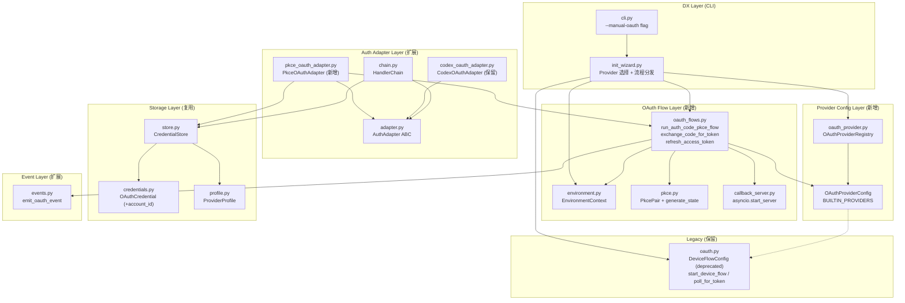
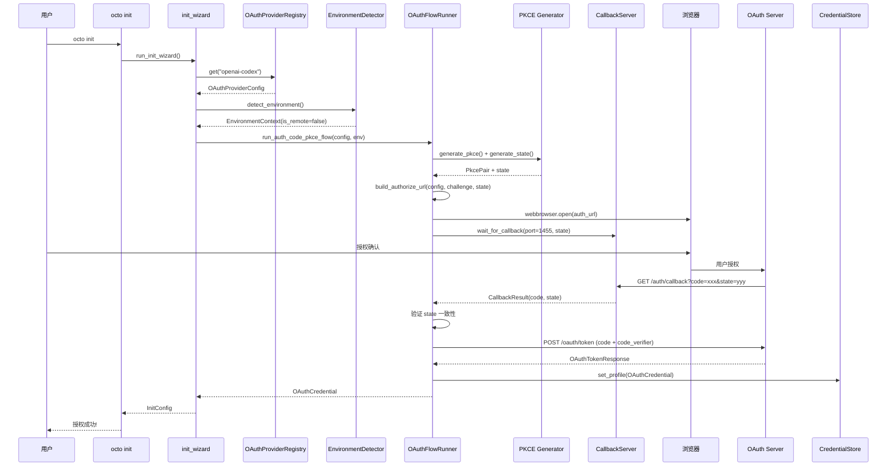

# Implementation Plan: Feature 003-b -- OAuth Authorization Code + PKCE + Per-Provider Auth

**Branch**: `feat/003b-oauth-pkce` | **Date**: 2026-03-01 | **Spec**: `spec.md`
**Input**: Feature specification from `.specify/features/003b-oauth-pkce/spec.md`
**前序**: Feature 003（Auth Adapter + DX 工具）已交付

---

## Summary

将 OctoAgent 现有的 OAuth Device Flow 认证升级为 Authorization Code + PKCE 流程，支持 Per-Provider OAuth 注册表管理、VPS/Remote 降级、Token 自动刷新。技术方案采用统一 OAuthFlow 抽象 + Provider Registry 架构（方案 A），基于纯 httpx + Python 标准库实现，零新增第三方依赖。

核心交付物：PKCE 生成器、本地回调服务器（asyncio.start_server）、OAuthProviderRegistry、PkceOAuthAdapter（含自动刷新）、环境检测与降级机制、init_wizard PKCE 集成、4 种 OAuth 事件类型。

---

## Technical Context

**Language/Version**: Python 3.12+
**Primary Dependencies**: httpx (>=0.27), pydantic (>=2.10), structlog (>=25.1), questionary (>=2.0), rich (>=13.0), filelock (>=3.12)
**New Dependencies**: 无（零新增，PKCE 使用标准库 secrets/hashlib/base64，回调服务器使用 asyncio）
**Storage**: JSON 文件 + filelock（复用 CredentialStore）
**Testing**: pytest + pytest-asyncio
**Target Platform**: macOS / Linux (包括 VPS/SSH/Docker/Codespaces)
**Project Type**: Monorepo -- `packages/provider`
**Constraints**: code_verifier 不持久化、token 脱敏、独立 state 参数

---

## Constitution Check

*GATE: Must pass before Phase 0 research. Re-check after Phase 1 design.*

| # | 原则 | 适用性 | 评估 | 说明 |
|---|------|--------|------|------|
| C1 | Durability First | 适用 | PASS | OAuth token 通过 CredentialStore 持久化到 `~/.octoagent/auth-profiles.json`；PKCE code_verifier 是临时值，不属于"关键状态"，流程中断后可重新生成 |
| C2 | Everything is an Event | 适用 | PASS | FR-012 定义了 OAUTH_STARTED / OAUTH_SUCCEEDED / OAUTH_FAILED / OAUTH_REFRESHED 四种事件类型，复用现有 emit_credential_event 机制 |
| C3 | Tools are Contracts | 适用 | PASS | OAuthProviderConfig 即合约（Pydantic BaseModel），Provider 配置 schema 与代码签名一致 |
| C4 | Side-effect Must be Two-Phase | 部分适用 | PASS | OAuth 授权是用户主动操作（浏览器授权），本身不属于"不可逆操作"。Token 写入 store 是可覆盖的，降级为手动模式是安全路径 |
| C5 | Least Privilege by Default | 适用 | PASS | code_verifier 不持久化、不写日志；token 使用 Pydantic SecretStr 包裹；存储文件权限 0o600；OAuth 事件 payload 脱敏 |
| C6 | Degrade Gracefully | 适用 | PASS | VPS/Remote 降级到手动模式；端口冲突降级到手动模式；Device Flow 保留作为不支持 PKCE 的 Provider 的备选 |
| C7 | User-in-Control | 适用 | PASS | 浏览器授权需用户主动操作；`--manual-oauth` CLI flag 允许手动覆盖环境检测；Provider 选择交互式确认 |
| C8 | Observability is a Feature | 适用 | PASS | OAuth 流程全链路 structlog 结构化日志（含脱敏）；成功/失败事件记录到 Event Store；事件 payload 不含敏感明文 |
| C9 | 不猜关键配置与事实 | 适用 | PASS | Client ID 从环境变量或注册表静态值获取，不猜测；端点信息从 OAuthProviderConfig 读取 |
| C10 | Bias to Action | 适用 | PASS | OAuth 流程自动检测环境并选择最佳交互模式，失败时提供明确的下一步建议 |
| C11 | Context Hygiene | 适用 | PASS | OAuth token 不进入 LLM 上下文；日志中 token 脱敏 |
| C13 | 失败必须可解释 | 适用 | PASS | OAuthFlowError 包含 provider 标识和 failure_stage；OAUTH_FAILED 事件记录 failure_reason 和 failure_stage |

**Constitution Check 结论**: 全部 PASS，无 VIOLATION，无需豁免。

---

## Architecture

### 组件关系图



### 数据流（Auth Code + PKCE 本地模式）



---

## Project Structure

### Documentation (this feature)

```text
.specify/features/003b-oauth-pkce/
├── plan.md              # 本文件
├── research.md          # 技术决策研究备忘
├── data-model.md        # 数据模型设计
├── spec.md              # 需求规范
├── contracts/
│   └── auth-oauth-pkce-api.md  # 接口契约
├── research/
│   └── tech-research.md        # 技术调研报告
└── checklists/
    └── requirements.md         # 需求检查清单
```

### Source Code (repository root)

```text
octoagent/packages/provider/src/octoagent/provider/
├── auth/
│   ├── __init__.py
│   ├── adapter.py              # AuthAdapter ABC (不变)
│   ├── api_key_adapter.py      # ApiKeyAuthAdapter (不变)
│   ├── setup_token_adapter.py  # SetupTokenAuthAdapter (不变)
│   ├── codex_oauth_adapter.py  # CodexOAuthAdapter (不变, 保留向后兼容)
│   ├── pkce_oauth_adapter.py   # [新增] PkceOAuthAdapter
│   ├── chain.py                # HandlerChain (小修: 注册 PkceOAuthAdapter factory)
│   ├── credentials.py          # Credential 模型 (小修: OAuthCredential +account_id)
│   ├── events.py               # 事件发射 (扩展: emit_oauth_event)
│   ├── masking.py              # 凭证脱敏 (不变)
│   ├── oauth.py                # Device Flow (保留, DeviceFlowConfig 标记 deprecated)
│   ├── pkce.py                 # [新增] PKCE 生成器
│   ├── oauth_provider.py       # [新增] OAuthProviderConfig + Registry
│   ├── callback_server.py      # [新增] 本地回调服务器
│   ├── environment.py          # [新增] 环境检测
│   ├── oauth_flows.py          # [新增] OAuth 流程编排
│   ├── profile.py              # ProviderProfile (不变)
│   ├── store.py                # CredentialStore (不变)
│   └── validators.py           # 凭证校验 (不变)
├── dx/
│   ├── __init__.py
│   ├── cli.py                  # CLI 入口 (修改: --manual-oauth flag)
│   ├── doctor.py               # 诊断工具 (不变)
│   ├── init_wizard.py          # 初始化向导 (修改: PKCE 流程集成)
│   ├── models.py               # DX 模型 (不变)
│   └── dotenv_loader.py        # .env 加载器 (不变)
└── exceptions.py               # 异常体系 (不变, OAuthFlowError 已存在)

octoagent/packages/core/src/octoagent/core/models/
└── enums.py                    # (修改: 新增 OAUTH_STARTED/SUCCEEDED/FAILED/REFRESHED)
```

### 测试结构

```text
octoagent/packages/provider/tests/
├── unit/
│   ├── auth/
│   │   ├── test_pkce.py                  # [新增] PKCE 生成器单元测试
│   │   ├── test_oauth_provider.py        # [新增] Provider 配置 + Registry 测试
│   │   ├── test_callback_server.py       # [新增] 回调服务器测试
│   │   ├── test_environment.py           # [新增] 环境检测测试
│   │   ├── test_oauth_flows.py           # [新增] OAuth 流程编排测试
│   │   ├── test_pkce_oauth_adapter.py    # [新增] PkceOAuthAdapter 测试
│   │   ├── test_codex_oauth_adapter.py   # (保留) 向后兼容: "refresh returns None"
│   │   └── test_adapter_contract.py      # (保留) 向后兼容: 契约测试
│   └── dx/
│       └── test_init_wizard.py           # (修改) 新增 PKCE 流程测试
├── contract/
│   └── test_oauth_events.py              # [新增] OAuth 事件契约测试
└── integration/
    └── test_oauth_e2e.py                 # [新增] OAuth 流程端到端测试
```

**Structure Decision**: 沿用 Feature 003 已建立的 `packages/provider/` 包结构，在 `auth/` 子模块下新增 5 个文件（pkce.py, oauth_provider.py, callback_server.py, environment.py, oauth_flows.py）和 1 个适配器文件（pkce_oauth_adapter.py）。保持 `dx/` 模块的修改量最小。

---

## Implementation Phases

### Phase 1: 核心 PKCE 基础设施

**目标**: 实现 PKCE 生成、环境检测、Provider 注册表三个独立模块。

| # | 文件 | 操作 | 对齐 FR | 说明 |
|---|------|------|---------|------|
| 1.1 | `auth/pkce.py` | 新增 | FR-001 | PkcePair + generate_pkce() + generate_state() |
| 1.2 | `auth/environment.py` | 新增 | FR-002 | EnvironmentContext + detect_environment() + is_remote_environment() |
| 1.3 | `auth/oauth_provider.py` | 新增 | FR-004, FR-011 | OAuthProviderConfig + OAuthProviderRegistry + BUILTIN_PROVIDERS + DISPLAY_TO_CANONICAL |
| 1.4 | `auth/credentials.py` | 修改 | FR-010 | OAuthCredential 新增 `account_id: str \| None = None` |
| 1.5 | `tests/unit/auth/test_pkce.py` | 新增 | FR-001 | PKCE 生成器单元测试（verifier 长度/熵/challenge 计算/state 独立性） |
| 1.6 | `tests/unit/auth/test_environment.py` | 新增 | FR-002 | 环境检测单元测试（SSH/容器/Linux 无 GUI/WSL） |
| 1.7 | `tests/unit/auth/test_oauth_provider.py` | 新增 | FR-004 | Provider 注册表单元测试（内置配置/注册/查询/Client ID 解析） |

**验收条件**:
- `generate_pkce()` 生成的 verifier 为 43 字符、challenge 为正确的 S256 哈希
- `detect_environment()` 在 SSH 环境变量存在时返回 `is_remote=True`
- `OAuthProviderRegistry` 内置 openai-codex 和 github-copilot 两个 Provider
- OAuthCredential 新增 account_id 字段，现有数据反序列化不报错

### Phase 2: 回调服务器 + OAuth 流程编排

**目标**: 实现回调服务器和完整的 Auth Code + PKCE 流程。

| # | 文件 | 操作 | 对齐 FR | 说明 |
|---|------|------|---------|------|
| 2.1 | `auth/callback_server.py` | 新增 | FR-003 | wait_for_callback() -- asyncio.start_server 实现 |
| 2.2 | `auth/oauth_flows.py` | 新增 | FR-005, FR-008 | run_auth_code_pkce_flow() + exchange_code_for_token() + build_authorize_url() + manual_paste_flow() + refresh_access_token() |
| 2.3 | `auth/events.py` | 扩展 | FR-012 | emit_oauth_event() + 四种 OAuth 事件 payload |
| 2.4 | `core/models/enums.py` | 修改 | FR-012 | 新增 OAUTH_STARTED/SUCCEEDED/FAILED/REFRESHED |
| 2.5 | `tests/unit/auth/test_callback_server.py` | 新增 | FR-003 | 回调服务器测试（成功/超时/无效请求/端口占用） |
| 2.6 | `tests/unit/auth/test_oauth_flows.py` | 新增 | FR-005 | 流程编排测试（mock httpx/webbrowser/callback） |
| 2.7 | `tests/contract/test_oauth_events.py` | 新增 | FR-012 | OAuth 事件契约测试（payload 不含敏感明文） |

**验收条件**:
- 回调服务器在 localhost:1455 监听，收到有效回调后返回 code + state 并关闭
- 端口占用时抛出 OSError，调用方可捕获并降级
- Token 交换使用 httpx POST，携带 code_verifier
- 四种 OAuth 事件正确发射，payload 不含敏感明文

### Phase 3: Adapter 集成 + DX 更新

**目标**: 实现 PkceOAuthAdapter，集成到 HandlerChain，更新 init_wizard。

| # | 文件 | 操作 | 对齐 FR | 说明 |
|---|------|------|---------|------|
| 3.1 | `auth/pkce_oauth_adapter.py` | 新增 | FR-006 | PkceOAuthAdapter（resolve + refresh + is_expired） |
| 3.2 | `auth/chain.py` | 修改 | FR-011 | 注册 PkceOAuthAdapter factory |
| 3.3 | `dx/init_wizard.py` | 修改 | FR-007 | _run_oauth_pkce_flow() + AUTH_MODE_LABELS 更新 + flow_type 分发 |
| 3.4 | `dx/cli.py` | 修改 | FR-002 | --manual-oauth CLI flag |
| 3.5 | `auth/oauth.py` | 修改 | FR-011 | DeviceFlowConfig 添加 deprecated 标记 |
| 3.6 | `tests/unit/auth/test_pkce_oauth_adapter.py` | 新增 | FR-006 | PkceOAuthAdapter 测试（resolve/refresh/expired/refresh失败） |
| 3.7 | `tests/unit/dx/test_init_wizard.py` | 修改 | FR-007 | 新增 PKCE 流程 + --manual-oauth 测试 |
| 3.8 | `tests/integration/test_oauth_e2e.py` | 新增 | SC-001~009 | 端到端集成测试 |

**验收条件**:
- PkceOAuthAdapter.refresh() 成功刷新后回写 CredentialStore
- init_wizard 选择 OpenAI 时触发 PKCE 流程，选择 GitHub 时触发 Device Flow
- `--manual-oauth` flag 强制手动模式
- 现有 CodexOAuthAdapter 测试继续通过（向后兼容）

---

## File Impact Summary

| 文件 | 操作 | 改动规模 | Phase |
|------|------|---------|-------|
| `auth/pkce.py` | 新增 | ~40 行 | 1 |
| `auth/environment.py` | 新增 | ~60 行 | 1 |
| `auth/oauth_provider.py` | 新增 | ~120 行 | 1 |
| `auth/credentials.py` | 修改 | +5 行 | 1 |
| `auth/callback_server.py` | 新增 | ~80 行 | 2 |
| `auth/oauth_flows.py` | 新增 | ~200 行 | 2 |
| `auth/events.py` | 扩展 | +30 行 | 2 |
| `core/models/enums.py` | 修改 | +4 行 | 2 |
| `auth/pkce_oauth_adapter.py` | 新增 | ~80 行 | 3 |
| `auth/chain.py` | 修改 | +10 行 | 3 |
| `auth/oauth.py` | 修改 | +3 行 (deprecated) | 3 |
| `dx/init_wizard.py` | 修改 | +40 行 | 3 |
| `dx/cli.py` | 修改 | +5 行 | 3 |
| **新增代码合计** | | **~580 行** | |
| **修改代码合计** | | **~97 行** | |
| **测试代码合计** | | **~500 行** (估算) | |
| `pyproject.toml` | **无变更** | 0 | - |

---

## Key Design Decisions

### 1. 纯 httpx + 标准库实现（零新增依赖）

PKCE 生成仅需 `secrets` + `hashlib` + `base64`（~15 行）。回调服务器使用 `asyncio.start_server`（~60 行）。Token 交换使用已有的 httpx。不引入 authlib/oauthlib 等 OAuth 库。

**理由**: 与 Feature 003 一致（Device Flow 也是纯 httpx）；OpenClaw 验证了纯手写 OAuth 的可行性；依赖链最短符合 Constitution C6。

### 2. 统一 OAuthFlow 抽象 + Provider Registry

OAuthProviderConfig 统一取代 DeviceFlowConfig，OAuthProviderRegistry 管理所有 Provider 配置。新增 Provider 仅需注册配置，无需新代码。

**理由**: 需求覆盖 OpenAI Codex（PKCE）和 GitHub Copilot（Device Flow）两种流程，且预留扩展；方案 B（最小增量）在第 3 个 Provider 时退化为重复代码。

### 3. PkceOAuthAdapter 注入 CredentialStore

PkceOAuthAdapter 构造时接受 CredentialStore 注入，refresh() 内部完成 token 请求 + store 回写。HandlerChain 仅负责调用 refresh()，不参与 store 写入。

**理由**: Adapter 最了解凭证结构和更新逻辑；HandlerChain 保持"调度者"职责边界。

### 4. 独立 state 参数（不复用 code_verifier）

使用独立的 `secrets.token_urlsafe(32)` 作为 CSRF state，不复用 code_verifier。

**理由**: Chutes 实现验证了独立 state 更安全；verifier 复用增加泄露风险面。

### 5. asyncio.start_server 回调服务器

使用 `asyncio.start_server` 手动解析 HTTP 请求，而非 aiohttp/uvicorn。

**理由**: 回调逻辑极简（仅处理一个 GET 请求）；零新增依赖；Node.js 等价方案已被 OpenClaw 验证。

---

## Complexity Tracking

> 本次 Constitution Check 全部 PASS，无 VIOLATION 需要 justification。
> 以下记录偏离"最简单方案"的设计决策及理由。

| 偏离 | 为何需要 | 被拒绝的更简方案 | 拒绝原因 |
|------|---------|----------------|---------|
| OAuthProviderRegistry（注册表模式） | 支持 2+ Provider 的 OAuth 配置管理 | 硬编码端点参数到各函数 | 第 3 个 Provider 时产生大量重复代码 |
| PkceOAuthAdapter 独立类 | 支持 refresh + store 回写 | 修改 CodexOAuthAdapter 兼容两种流程 | 职责混淆，破坏现有 Device Flow 测试 |
| 双层 Provider ID (canonical + display) | 兼容现有 init_wizard UI 标识 | 统一使用 canonical_id | init_wizard 中 "openai" 对用户更友好，改动量大 |
| EnvironmentContext dataclass | 封装检测结果，支持 `use_manual_mode` 属性 | 直接返回 bool | 多个检测维度需要结构化，利于日志和调试 |

---

## Risk Mitigation

| # | 风险 | 概率 | 影响 | 缓解策略 |
|---|------|------|------|---------|
| R1 | OpenAI Codex OAuth 端点变更 | 中 | 高 | client_id 通过环境变量注入，不硬编码；端点在 OAuthProviderConfig 中可配置 |
| R2 | 端口 1455 被占用 | 中 | 中 | 自动降级到手动粘贴模式（spec FR-003, Story 5） |
| R3 | VPS 环境检测误判 | 低 | 中 | `--manual-oauth` CLI flag 手动覆盖（spec FR-002） |
| R4 | asyncio event loop 冲突 | 中 | 中 | OAuth 流程通过 `asyncio.run()` 独立执行，与 questionary 隔离 |
| R5 | Token 刷新时 refresh_token 已失效 | 中 | 中 | 捕获 invalid_grant，清除过期凭证，提示重新授权 |
| R6 | OAuthCredential account_id 扩展破坏反序列化 | 低 | 中 | 使用 `Field(default=None)` 保证向后兼容 |

---

## Testing Strategy

### 单元测试（Phase 1-3）

| 模块 | 测试焦点 | Mock 策略 |
|------|---------|-----------|
| pkce.py | verifier 长度/熵、challenge S256 正确性、state 独立性 | 无需 mock |
| environment.py | SSH/容器/Linux 无 GUI 检测、WSL 排除、`--manual-oauth` | mock os.environ |
| oauth_provider.py | 内置配置正确性、注册/查询、Client ID 解析（静态值/环境变量/缺失） | mock os.environ |
| callback_server.py | 成功回调、超时、无效路径(404)、无效参数(400)、state 不匹配 | 使用 asyncio 测试客户端 |
| oauth_flows.py | 完整流程（mock httpx + webbrowser + callback）、手动模式、端口降级 | mock httpx.AsyncClient, webbrowser |
| pkce_oauth_adapter.py | resolve/refresh/expired、refresh 成功回写 store、refresh 失败 | mock httpx, CredentialStore |
| events.py | 四种 OAuth 事件 payload 结构、敏感值不出现在 payload | mock EventStoreProtocol |

### 契约测试

| 测试 | 验证内容 |
|------|---------|
| test_oauth_events.py | OAUTH_STARTED/SUCCEEDED/FAILED/REFRESHED payload 不含 access_token/refresh_token/code_verifier/state 明文 |
| test_adapter_contract.py | PkceOAuthAdapter 符合 AuthAdapter 接口契约 |
| test_codex_oauth_adapter.py | CodexOAuthAdapter.refresh() 仍返回 None（向后兼容） |

### 集成测试

| 测试 | 场景 |
|------|------|
| test_oauth_e2e.py | 完整 PKCE 流程（mock OAuth server）-> CredentialStore 验证 |
| test_init_wizard.py | init_wizard PKCE 流程集成 + Device Flow 回归 |

---

## Dependency on Feature 003

Feature 003-b 在以下 Feature 003 交付物上增量开发：

| Feature 003 交付物 | 003-b 使用方式 |
|-------------------|---------------|
| `AuthAdapter` ABC | 不变，PkceOAuthAdapter 继承 |
| `CodexOAuthAdapter` | 保留不变，向后兼容 |
| `CredentialStore` | 复用，PkceOAuthAdapter 注入 |
| `HandlerChain` | 修改：注册 PkceOAuthAdapter factory |
| `OAuthCredential` | 扩展：新增 account_id |
| `emit_credential_event` | 复用，新增 emit_oauth_event |
| `DeviceFlowConfig` | 标记 deprecated，通过 OAuthProviderConfig.to_device_flow_config() 兼容 |
| `init_wizard` | 修改：PKCE 流程集成 |
| `OAuthFlowError` | 复用 |
| `masking.py` | 复用 |
