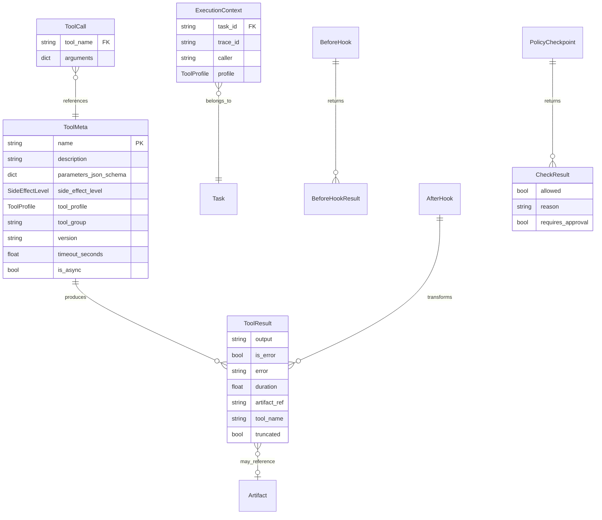

# 数据模型: Feature 004 — Tool Contract + ToolBroker

**Feature Branch**: `feat/004-tool-contract-broker`
**日期**: 2026-03-01
**来源**: spec.md Key Entities + research/tech-research.md 方案 A

---

## 1. 枚举定义

### 1.1 SideEffectLevel

副作用等级枚举。驱动 Feature 006 Policy Engine 的门禁决策。

**锁定状态**: 枚举值已锁定，变更需经 005/006 利益方评审（FR-025a）。

```python
from enum import StrEnum

class SideEffectLevel(StrEnum):
    """工具副作用等级 -- 对齐 spec FR-001, Blueprint §8.5.2"""

    NONE = "none"               # 纯读取，无副作用
    REVERSIBLE = "reversible"   # 可回滚的副作用
    IRREVERSIBLE = "irreversible"  # 不可逆操作
```

**约束**:
- 每个工具必须声明 side_effect_level（FR-002），不允许未声明的工具存在于注册表中
- `irreversible` 工具在无 PolicyCheckpoint hook 时被强制拒绝（FR-010a）

### 1.2 ToolProfile

工具权限 Profile 枚举。用于工具集的分级过滤（最小权限原则 C5）。

**锁定状态**: 枚举值已锁定（FR-025a）。

```python
class ToolProfile(StrEnum):
    """工具权限 Profile -- 对齐 spec FR-001, FR-007"""

    MINIMAL = "minimal"       # 最小权限集（只读工具）
    STANDARD = "standard"     # 标准权限（读写工具）
    PRIVILEGED = "privileged" # 特权操作（exec, docker, 外部 API）
```

**过滤规则**（FR-007）:
- `minimal` 查询 -> 仅返回 `minimal` 工具
- `standard` 查询 -> 返回 `minimal` + `standard` 工具
- `privileged` 查询 -> 返回所有工具

**层级关系**: `MINIMAL < STANDARD < PRIVILEGED`（用于过滤比较）

**M1 阶段**: 仅实现 `minimal` + `standard` 两级，`privileged` 在 M1.5 Docker 执行就绪后激活（CLR-001）。

### 1.3 HookType

Hook 类型枚举。

```python
class HookType(StrEnum):
    """Hook 类型"""

    BEFORE = "before"   # 执行前 hook
    AFTER = "after"     # 执行后 hook
```

### 1.4 FailMode

Hook 失败模式枚举。

```python
class FailMode(StrEnum):
    """Hook 失败模式 -- 对齐 spec FR-019, CLR-005"""

    CLOSED = "closed"   # 失败时拒绝执行（安全类 hook）
    OPEN = "open"       # 失败时记录警告并继续（可观测类 hook）
```

**默认值**: `open`（FR-025a），PolicyCheckpoint 强制 `closed`。

---

## 2. 核心数据模型

### 2.1 ToolMeta

工具的完整元数据描述——工具在系统中的"身份证"。由 Schema Reflection 自动生成。

```python
from typing import Any
from pydantic import BaseModel, Field

class ToolMeta(BaseModel):
    """工具元数据 -- 对齐 spec FR-001/003/004/005, Blueprint §8.5.2

    ToolMeta 是工具在系统中的身份证，由 Schema Reflection 自动生成。
    工具开发者通过 @tool_contract 装饰器声明元数据，
    系统从函数签名 + type hints + docstring 生成 parameters_json_schema。
    """

    # 必填字段
    name: str = Field(description="工具名称（全局唯一）")
    description: str = Field(description="工具描述（来自函数 docstring）")
    parameters_json_schema: dict[str, Any] = Field(
        description="参数 JSON Schema（自动反射生成）"
    )
    side_effect_level: SideEffectLevel = Field(
        description="副作用等级（必须声明，无默认值）"
    )
    tool_profile: ToolProfile = Field(
        description="权限 Profile 级别"
    )
    tool_group: str = Field(
        description="逻辑分组（如 'system', 'filesystem', 'network'）"
    )

    # 可选字段
    version: str = Field(default="1.0.0", description="工具版本号")
    timeout_seconds: float | None = Field(
        default=None,
        description="声明式超时（秒），None 表示不超时"
    )
    is_async: bool = Field(
        default=False,
        description="标记工具是否为异步函数"
    )
    output_truncate_threshold: int | None = Field(
        default=None,
        description="工具级输出裁切阈值（字符数），None 表示使用全局默认值"
    )
```

**字段来源映射**:
| 字段 | 来源 | 说明 |
|------|------|------|
| name | `@tool_contract(name=...)` 或 `func.__name__` | 装饰器优先 |
| description | `function_schema().description` (docstring) | 自动提取 |
| parameters_json_schema | `function_schema().json_schema` | 自动反射 |
| side_effect_level | `@tool_contract(side_effect_level=...)` | 必须显式声明 |
| tool_profile | `@tool_contract(tool_profile=...)` | 必须显式声明 |
| tool_group | `@tool_contract(tool_group=...)` | 必须显式声明 |
| is_async | `asyncio.iscoroutinefunction(func)` | 自动检测 |

### 2.2 ToolResult

工具执行的结构化结果。ToolBroker 执行的标准返回格式。

**锁定状态**: 必含字段已锁定（FR-025a）。

```python
class ToolResult(BaseModel):
    """工具执行结果 -- 对齐 spec FR-011

    是 ToolBroker execute() 的标准返回格式，
    也是 Feature 005 SkillRunner 结果回灌的输入。
    """

    # 锁定字段（FR-025a）
    output: str = Field(
        description="输出内容（原文或 artifact 引用摘要）"
    )
    is_error: bool = Field(
        default=False,
        description="是否为错误结果"
    )
    error: str | None = Field(
        default=None,
        description="错误信息（仅 is_error=True 时有值）"
    )
    duration: float = Field(
        description="执行耗时（秒）"
    )
    artifact_ref: str | None = Field(
        default=None,
        description="Artifact 引用 ID（仅大输出裁切时有值）"
    )

    # 扩展字段
    tool_name: str = Field(
        default="",
        description="执行的工具名称"
    )
    truncated: bool = Field(
        default=False,
        description="输出是否被裁切"
    )
```

### 2.3 ToolCall

工具调用请求。ToolBroker execute 方法的输入。

```python
class ToolCall(BaseModel):
    """工具调用请求 -- 对齐 spec Key Entities

    封装工具调用的名称和参数，
    是 ToolBroker.execute() 的结构化输入。
    """

    tool_name: str = Field(description="目标工具名称")
    arguments: dict[str, Any] = Field(
        default_factory=dict,
        description="调用参数（JSON 可序列化）"
    )
```

### 2.4 ExecutionContext

工具执行上下文。承载 task_id、trace_id、caller、profile 等信息。

```python
class ExecutionContext(BaseModel):
    """工具执行上下文 -- 对齐 spec CLR-002

    作为 ToolBroker.execute() 和 Hook 的上下文参数传递，
    用于事件生成和 Policy 决策。
    字段设计对齐现有 Event 模型的 trace_id / task_id 字段。
    """

    task_id: str = Field(description="关联任务 ID")
    trace_id: str = Field(description="追踪标识（同一 task 共享）")
    caller: str = Field(
        default="system",
        description="调用者标识（如 Worker ID）"
    )
    profile: ToolProfile = Field(
        default=ToolProfile.MINIMAL,
        description="当前执行上下文的 ToolProfile（决定可用工具集）"
    )
```

---

## 3. Hook 模型

### 3.1 ToolHook（基础 Protocol）

Hook 扩展点的抽象基类。分为 BeforeHook 和 AfterHook。

```python
from typing import Protocol

class BeforeHookResult(BaseModel):
    """before hook 执行结果"""

    proceed: bool = Field(
        default=True,
        description="是否继续执行工具（False 表示拒绝）"
    )
    rejection_reason: str | None = Field(
        default=None,
        description="拒绝原因（仅 proceed=False 时）"
    )
    modified_args: dict[str, Any] | None = Field(
        default=None,
        description="修改后的参数（None 表示不修改）"
    )


class BeforeHook(Protocol):
    """before hook Protocol -- 对齐 spec FR-019/020/021

    在工具执行前运行，可修改参数或拒绝执行。
    """

    @property
    def name(self) -> str:
        """hook 名称"""
        ...

    @property
    def priority(self) -> int:
        """优先级（从低到高执行，数值越小越优先）"""
        ...

    @property
    def fail_mode(self) -> FailMode:
        """失败模式"""
        ...

    async def before_execute(
        self,
        tool_meta: ToolMeta,
        args: dict[str, Any],
        context: ExecutionContext,
    ) -> BeforeHookResult:
        """执行前钩子"""
        ...


class AfterHook(Protocol):
    """after hook Protocol -- 对齐 spec FR-019/022

    在工具执行后运行，可修改结果。
    """

    @property
    def name(self) -> str:
        """hook 名称"""
        ...

    @property
    def priority(self) -> int:
        """优先级（从低到高执行）"""
        ...

    @property
    def fail_mode(self) -> FailMode:
        """失败模式"""
        ...

    async def after_execute(
        self,
        tool_meta: ToolMeta,
        result: ToolResult,
        context: ExecutionContext,
    ) -> ToolResult:
        """执行后钩子"""
        ...
```

### 3.2 PolicyCheckpoint Protocol

Feature 006 PolicyEngine 接入 ToolBroker before hook 的契约接口。
Feature 004 定义 Protocol，Feature 006 提供实现。

**锁定状态**: 方法签名已锁定（FR-025a）。

```python
class CheckResult(BaseModel):
    """PolicyCheckpoint 检查结果"""

    allowed: bool = Field(description="是否允许执行")
    reason: str = Field(default="", description="决策原因")
    requires_approval: bool = Field(
        default=False,
        description="是否需要人工审批（Feature 006 使用）"
    )


class PolicyCheckpoint(Protocol):
    """Policy 检查点 Protocol -- 对齐 spec FR-024

    作为 before hook 运行，对 irreversible 工具触发审批流。
    Feature 004 定义 Protocol，Feature 006 提供实现。
    """

    async def check(
        self,
        tool_meta: ToolMeta,
        params: dict[str, Any],
        context: ExecutionContext,
    ) -> CheckResult:
        """执行策略检查

        Args:
            tool_meta: 工具元数据
            params: 调用参数
            context: 执行上下文

        Returns:
            CheckResult 包含是否允许执行和原因
        """
        ...
```

---

## 4. 事件 Payload 模型

Feature 004 新增的三个事件 Payload，对齐 EventType 枚举扩展（CLR-003）。

```python
class ToolCallStartedPayload(BaseModel):
    """TOOL_CALL_STARTED 事件 payload -- 对齐 spec FR-014"""

    tool_name: str = Field(description="工具名称")
    tool_group: str = Field(description="工具分组")
    side_effect_level: str = Field(description="副作用等级")
    args_summary: str = Field(description="参数摘要（脱敏后）")
    timeout_seconds: float | None = Field(
        default=None,
        description="声明式超时"
    )


class ToolCallCompletedPayload(BaseModel):
    """TOOL_CALL_COMPLETED 事件 payload -- 对齐 spec FR-014"""

    tool_name: str = Field(description="工具名称")
    duration_ms: int = Field(description="执行耗时（毫秒）")
    output_summary: str = Field(description="输出摘要（脱敏后）")
    truncated: bool = Field(
        default=False,
        description="输出是否被裁切"
    )
    artifact_ref: str | None = Field(
        default=None,
        description="完整输出的 Artifact 引用"
    )


class ToolCallFailedPayload(BaseModel):
    """TOOL_CALL_FAILED 事件 payload -- 对齐 spec FR-014"""

    tool_name: str = Field(description="工具名称")
    duration_ms: int = Field(description="执行耗时（毫秒）")
    error_type: str = Field(
        description="错误分类（timeout / exception / rejection / hook_failure）"
    )
    error_message: str = Field(description="错误信息（脱敏后）")
    recoverable: bool = Field(
        default=False,
        description="是否可恢复"
    )
    recovery_hint: str = Field(
        default="",
        description="恢复建议"
    )
```

---

## 5. 关系图



---

## 6. 与现有模型的集成点

| Feature 004 模型 | 现有 core 模型 | 集成方式 |
|-----------------|---------------|---------|
| `ExecutionContext.task_id` | `Task.task_id` | 引用（同一 task 上下文） |
| `ExecutionContext.trace_id` | `Event.trace_id` | 共享追踪标识 |
| `ToolResult.artifact_ref` | `Artifact.artifact_id` | 引用（大输出存储后的 ID） |
| `ToolCallStartedPayload` 等 | `Event.payload` | 作为 Event payload 写入 EventStore |
| `EventType.TOOL_CALL_*` | `EventType` 枚举 | 向前兼容扩展 |
