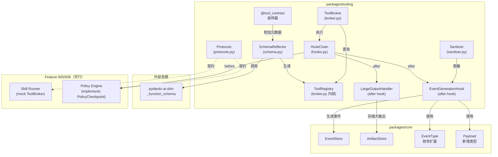
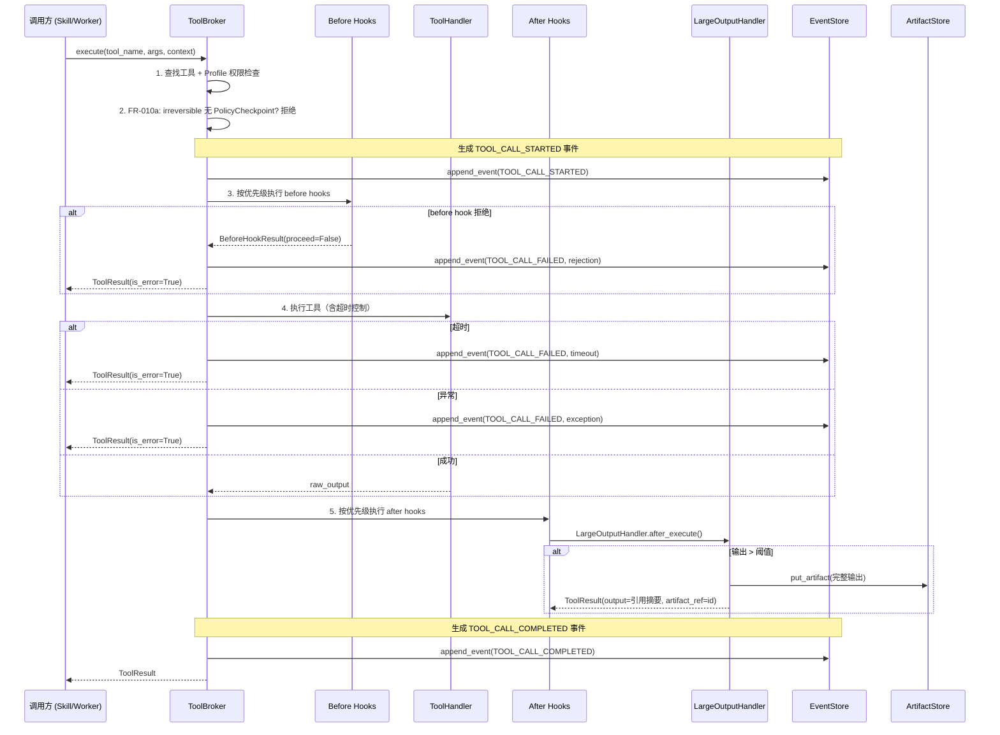
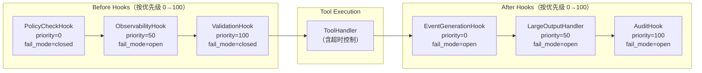

# Implementation Plan: Tool Contract + ToolBroker

**Branch**: `feat/004-tool-contract-broker` | **Date**: 2026-03-01 | **Spec**: `.specify/features/004-tool-contract-broker/spec.md`
**Input**: Feature specification (29 FR, 7 User Stories, 7 Edge Cases) + tech-research.md (方案 A: Pydantic-Native 融合)

---

## Summary

Feature 004 建立工具治理基础设施：工具可声明、可反射、可执行、大输出可裁切。核心技术方案采用 Pydantic-Native 融合方案（方案 A），复用 Pydantic AI 的 `_function_schema.function_schema()` 实现 code = schema 单一事实源，ToolBroker 采用 Protocol-based Mediator + Hook Chain 架构，支持 before/after 可插拔扩展。同时输出稳定的接口契约（ToolBrokerProtocol、ToolMeta、ToolResult、PolicyCheckpoint Protocol）供 Feature 005/006 并行开发引用。

**关键产出**: `packages/tooling` 新包 + EventType 枚举扩展 + 接口契约文档。

---

## Technical Context

**Language/Version**: Python 3.12+
**Primary Dependencies**: pydantic>=2.10,<3.0（已有）, pydantic-ai-slim>=0.0.40（新增）, structlog>=25.1,<26.0（已有）, python-ulid>=3.1,<4.0（已有）, aiosqlite>=0.21,<1.0（已有）
**Storage**: SQLite WAL（EventStore + ArtifactStore，复用 core 包现有实现）
**Testing**: pytest + pytest-asyncio
**Target Platform**: macOS (Darwin 25.3.0)，Python 3.12+
**Project Type**: monorepo workspace package（`packages/tooling`）
**Performance Goals**: Schema Reflection 在注册时一次性生成并缓存（非热路径）；工具执行 overhead < 5ms（hook 链开销）
**Constraints**: 不超出 spec 29 条 FR 范围；接口契约锁定后变更需 005/006 评审
**Scale/Scope**: 单用户个人 AI OS，M1 阶段 ~10 个工具注册

---

## Constitution Check

*GATE: 全部通过。无 VIOLATION。*

| # | Constitution 原则 | 适用性 | 评估 | 说明 |
|---|------------------|--------|------|------|
| C1 | Durability First | 适用 | PASS | 工具调用事件通过 EventStore 持久化（append-only）；大输出通过 ArtifactStore 落盘。ToolBroker 自身为无状态中介（注册表在内存），进程重启后需重新注册但不丢失历史事件 |
| C2 | Everything is an Event | 适用 | PASS | FR-014 要求生成 TOOL_CALL_STARTED / COMPLETED / FAILED 事件，覆盖工具调用全生命周期 |
| C3 | Tools are Contracts | **核心** | PASS | Schema Reflection 保证 code = schema 单一事实源（FR-003）；side_effect_level 强制声明（FR-002）；无类型注解的参数拒绝注册（FR-005） |
| C4 | Side-effect Two-Phase | **核心** | PASS | FR-010a: irreversible 工具在无 PolicyCheckpoint 时被强制拒绝（safe by default）；before hook + fail_mode="closed" 确保安全门禁不可绕过 |
| C5 | Least Privilege | 适用 | PASS | ToolProfile 分级过滤（FR-007）：minimal 查询仅返回 minimal 工具，standard 返回 minimal + standard |
| C6 | Degrade Gracefully | 适用 | PASS | after hook 异常 log-and-continue（FR-022）；ArtifactStore 不可用时保留原始输出不裁切（FR-018）|
| C7 | User-in-Control | 适用 | PASS | irreversible 工具默认阻止（FR-010a）；PolicyCheckpoint Protocol 预留审批流接入点（FR-024）|
| C8 | Observability | 适用 | PASS | 完整事件链 + 结构化日志；敏感数据脱敏（FR-015）；ToolCallStartedPayload 含参数摘要 |
| C9 | 不猜关键配置 | 不适用 | N/A | Feature 004 不涉及外部系统操作 |
| C10 | Bias to Action | 不适用 | N/A | Feature 004 是基础设施层，不涉及 Agent 行为 |
| C11 | Context Hygiene | **核心** | PASS | 大输出自动裁切 + artifact 引用模式（FR-016）；阈值 500 字符 |
| C12 | 记忆写入治理 | 不适用 | N/A | Feature 004 不涉及记忆写入 |
| C13 | 失败可解释 | 适用 | PASS | TOOL_CALL_FAILED 事件含 error_type（timeout/exception/rejection/hook_failure）和 recoverable 标记 |
| C14 | A2A 兼容 | 不适用 | N/A | Feature 004 不涉及 A2A 通信 |

---

## Project Structure

### Documentation (this feature)

```text
.specify/features/004-tool-contract-broker/
  spec.md                    # 需求规范（29 FR）
  plan.md                    # 本文件（技术规划）
  research.md                # 技术决策研究（9 个决策）
  data-model.md              # 数据模型定义
  contracts/
    tooling-api.md            # 接口契约（锁定的 Protocol 签名 + 枚举值 + 默认值）
  research/
    tech-research.md          # 技术调研报告（方案 A vs B 对比）
  checklists/
    requirements.md           # 需求检查清单
```

### Source Code (repository root)

```text
octoagent/
  packages/
    core/
      src/octoagent/core/
        models/
          enums.py            # [修改] 新增 TOOL_CALL_* EventType
          payloads.py         # [修改] 新增 ToolCall* Payload 类型
          __init__.py         # [修改] 导出新增类型
    tooling/                  # [新增] Feature 004 主包
      pyproject.toml
      src/octoagent/tooling/
        __init__.py           # 公共导出
        models.py             # ToolMeta, ToolResult, ToolCall, ExecutionContext, 枚举
        schema.py             # Schema Reflection（隔离 _function_schema 依赖）
        decorators.py         # @tool_contract 装饰器
        broker.py             # ToolBroker 实现
        hooks.py              # Hook Protocol + LargeOutputHandler + EventGenerationHook
        protocols.py          # ToolBrokerProtocol, ToolHandler, PolicyCheckpoint Protocol
        sanitizer.py          # 敏感数据脱敏
        exceptions.py         # 异常类型
        _examples/            # 示例工具
          __init__.py
          echo_tool.py        # side_effect_level=none 示例
          file_write_tool.py  # side_effect_level=irreversible 示例
      tests/
        __init__.py
        test_models.py        # 数据模型测试
        test_schema.py        # Schema Reflection 测试
        test_decorators.py    # 装饰器测试
        test_broker.py        # ToolBroker 测试
        test_hooks.py         # Hook 链测试
        test_large_output.py  # 大输出裁切测试
        test_sanitizer.py     # 脱敏测试
        test_examples.py      # 示例工具端到端测试
        conftest.py           # 测试 fixtures
```

**Structure Decision**: 新增 `packages/tooling` 独立包，遵循 monorepo 现有结构（packages/core, packages/provider）。tooling 包依赖 core 包但不依赖 provider 包，保持工具治理基础设施的独立性。

---

## Architecture

### 整体架构



### 工具执行流程



### Hook 链执行模型



---

## Module Design

### M1: models.py — 数据模型

**职责**: 定义 Feature 004 的所有 Pydantic 数据模型和枚举类型。

**包含**:
- `SideEffectLevel`（StrEnum）
- `ToolProfile`（StrEnum）
- `FailMode`（StrEnum）
- `ToolMeta`（BaseModel）
- `ToolResult`（BaseModel）
- `ToolCall`（BaseModel）
- `ExecutionContext`（BaseModel）
- `BeforeHookResult`（BaseModel）
- `CheckResult`（BaseModel）

**依赖**: pydantic（已有）

**FR 覆盖**: FR-001, FR-002, FR-004, FR-011

### M2: protocols.py — Protocol 接口定义

**职责**: 定义所有 Protocol 接口，供 Feature 005/006 引用。

**包含**:
- `ToolBrokerProtocol`
- `ToolHandler`
- `BeforeHook`
- `AfterHook`
- `PolicyCheckpoint`

**依赖**: models.py

**FR 覆盖**: FR-023, FR-024, FR-025, FR-025a

### M3: schema.py — Schema Reflection

**职责**: 从函数签名 + type hints + docstring 自动生成 ToolMeta。隔离 Pydantic AI `_function_schema` 依赖。

**核心函数**:
```python
def reflect_tool_schema(func: Callable) -> ToolMeta:
    """从装饰过的函数生成 ToolMeta（单一事实源）

    1. 检查 func 是否有 @tool_contract 装饰器元数据
    2. 检查所有参数是否有类型注解（无则拒绝）
    3. 调用 pydantic_ai._function_schema.function_schema() 生成 JSON Schema
    4. 合并装饰器元数据 + 自动生成的 Schema
    5. 返回 ToolMeta
    """
```

**Adapter 模式**: 所有对 `_function_schema` 的调用集中在此文件，对外暴露 `reflect_tool_schema()` 公共接口。当 Pydantic AI 升级导致 breaking change 时，仅需修改此文件。

**依赖**: pydantic-ai-slim, models.py

**FR 覆盖**: FR-003, FR-005

### M4: decorators.py — @tool_contract 装饰器

**职责**: 提供声明性标注 API，将工具元数据附加到函数对象上。

**核心实现**:
```python
def tool_contract(
    *,
    side_effect_level: SideEffectLevel,  # 必填（无默认值）
    tool_profile: ToolProfile,
    tool_group: str,
    name: str | None = None,
    version: str = "1.0.0",
    timeout_seconds: float | None = None,
    output_truncate_threshold: int | None = None,
) -> Callable[[F], F]:
    def decorator(func: F) -> F:
        func._tool_meta = {  # type: ignore[attr-defined]
            "side_effect_level": side_effect_level,
            "tool_profile": tool_profile,
            "tool_group": tool_group,
            "name": name or func.__name__,
            "version": version,
            "timeout_seconds": timeout_seconds,
            "output_truncate_threshold": output_truncate_threshold,
        }
        return func
    return decorator
```

**依赖**: models.py

**FR 覆盖**: FR-001, FR-002

### M5: broker.py — ToolBroker 实现

**职责**: 工具注册、发现、执行的中央中介者。实现 ToolBrokerProtocol。

**核心逻辑**:
1. **register()**: 名称唯一性检查 + ToolMeta 存储 + ToolHandler 存储
2. **discover()**: 按 ToolProfile 层级过滤 + 按 tool_group 过滤
3. **execute()**:
   - Profile 权限检查
   - FR-010a 强制拒绝逻辑
   - Before hook 链执行
   - 工具执行（含超时 + sync->async 包装）
   - After hook 链执行
   - 事件生成
4. **add_hook()**: Hook 注册和分类
5. **unregister()**: 工具移除

**ToolProfile 层级比较**:
```python
_PROFILE_LEVELS = {
    ToolProfile.MINIMAL: 0,
    ToolProfile.STANDARD: 1,
    ToolProfile.PRIVILEGED: 2,
}

def _profile_allows(tool_profile: ToolProfile, context_profile: ToolProfile) -> bool:
    """检查 context profile 是否允许访问 tool profile"""
    return _PROFILE_LEVELS[tool_profile] <= _PROFILE_LEVELS[context_profile]
```

**依赖**: models.py, protocols.py, hooks.py, sanitizer.py, schema.py

**FR 覆盖**: FR-006, FR-007, FR-008, FR-009, FR-010, FR-010a, FR-012, FR-013

### M6: hooks.py — Hook 实现

**职责**: 内置 Hook 实现（LargeOutputHandler + EventGenerationHook）。

**LargeOutputHandler**:
```python
class LargeOutputHandler:
    """大输出自动裁切 -- 对齐 spec FR-016/017/018

    作为 after hook 运行，对工具输出超过阈值时：
    1. 完整输出存入 ArtifactStore
    2. ToolResult.output 替换为引用摘要
    3. ToolResult.artifact_ref 设置为 Artifact ID

    降级策略：ArtifactStore 不可用时保留原始输出
    """

    DEFAULT_THRESHOLD = 500  # 默认裁切阈值（字符）

    def __init__(
        self,
        artifact_store: ArtifactStore,
        default_threshold: int = DEFAULT_THRESHOLD,
    ):
        ...

    @property
    def name(self) -> str:
        return "large_output_handler"

    @property
    def priority(self) -> int:
        return 50

    @property
    def fail_mode(self) -> FailMode:
        return FailMode.OPEN  # 裁切失败不影响工具结果

    async def after_execute(
        self,
        tool_meta: ToolMeta,
        result: ToolResult,
        context: ExecutionContext,
    ) -> ToolResult:
        threshold = tool_meta.output_truncate_threshold or self._default_threshold
        if not result.is_error and len(result.output) > threshold:
            try:
                artifact_id = await self._store_as_artifact(result.output, context)
                prefix = result.output[:200]
                return result.model_copy(update={
                    "output": f"[Output truncated. Full content: artifact:{artifact_id}]\n{prefix}...",
                    "artifact_ref": artifact_id,
                    "truncated": True,
                })
            except Exception:
                # ArtifactStore 不可用 -> 降级：保留原始输出
                logger.warning("artifact_store_unavailable", ...)
                return result
        return result
```

**EventGenerationHook**:
- 作为 after hook（priority=0）生成 TOOL_CALL_COMPLETED / TOOL_CALL_FAILED 事件
- TOOL_CALL_STARTED 事件在 Broker.execute() 入口直接生成（不通过 hook）
- 使用 Sanitizer 对事件 payload 进行脱敏

**依赖**: models.py, protocols.py, sanitizer.py, octoagent-core (EventStore, ArtifactStore)

**FR 覆盖**: FR-014, FR-016, FR-017, FR-018, FR-019, FR-020, FR-021, FR-022

### M7: sanitizer.py — 敏感数据脱敏

**职责**: 在事件生成前对参数和输出进行脱敏处理。

**脱敏规则**（FR-015）:
1. 文件路径中的 `$HOME` 或用户目录 -> `~`
2. 环境变量值 -> `[ENV:VAR_NAME]`
3. 匹配凭证模式（`token=*`, `password=*`, `secret=*`, `key=*`）-> `[REDACTED]`

```python
def sanitize_for_event(data: dict[str, Any]) -> dict[str, Any]:
    """对事件 payload 进行脱敏处理"""
```

**依赖**: 无外部依赖

**FR 覆盖**: FR-015

### M8: exceptions.py — 异常类型

**职责**: 定义 Feature 004 的所有异常类型。

**包含**:
- `ToolRegistrationError`
- `ToolNotFoundError`
- `ToolExecutionError`
- `ToolProfileViolationError`
- `PolicyCheckpointMissingError`
- `SchemaReflectionError`

### M9: _examples/ — 示例工具

**职责**: 提供至少 2 个不同 side_effect_level 的示例工具。

**echo_tool.py** (side_effect_level=none):
```python
@tool_contract(
    side_effect_level=SideEffectLevel.NONE,
    tool_profile=ToolProfile.MINIMAL,
    tool_group="system",
)
async def echo(text: str) -> str:
    """回显输入文本。

    Args:
        text: 要回显的文本
    """
    return text
```

**file_write_tool.py** (side_effect_level=irreversible):
```python
@tool_contract(
    side_effect_level=SideEffectLevel.IRREVERSIBLE,
    tool_profile=ToolProfile.STANDARD,
    tool_group="filesystem",
    timeout_seconds=30.0,
)
async def write_file(path: str, content: str) -> str:
    """写入文件内容（不可逆操作）。

    Args:
        path: 目标文件路径
        content: 要写入的内容
    """
    from pathlib import Path
    target = Path(path)
    target.write_text(content)
    return f"Written {len(content)} chars to {path}"
```

**FR 覆盖**: FR-026, FR-027

---

## core 包修改清单

Feature 004 需要对 `packages/core` 进行以下向前兼容的修改：

### 1. enums.py — EventType 扩展

```python
class EventType(StrEnum):
    # ... 现有值保持不变 ...

    # Feature 004: 工具调用事件 -- 对齐 FR-014
    TOOL_CALL_STARTED = "TOOL_CALL_STARTED"
    TOOL_CALL_COMPLETED = "TOOL_CALL_COMPLETED"
    TOOL_CALL_FAILED = "TOOL_CALL_FAILED"
```

### 2. payloads.py — 新增 Payload 类型

```python
# Feature 004: 工具调用 Payload 类型 -- 对齐 FR-014
class ToolCallStartedPayload(BaseModel): ...
class ToolCallCompletedPayload(BaseModel): ...
class ToolCallFailedPayload(BaseModel): ...
```

### 3. __init__.py — 导出新增类型

新增导出：`ToolCallStartedPayload`, `ToolCallCompletedPayload`, `ToolCallFailedPayload`

---

## packages/tooling pyproject.toml

```toml
[project]
name = "octoagent-tooling"
version = "0.1.0"
description = "OctoAgent Tooling - Tool Contract + Schema Reflection + ToolBroker"
requires-python = ">=3.12"
dependencies = [
    "octoagent-core",
    "pydantic>=2.10,<3.0",
    "pydantic-ai-slim>=0.0.40",
    "structlog>=25.1,<26.0",
    "python-ulid>=3.1,<4.0",
]

[build-system]
requires = ["hatchling"]
build-backend = "hatchling.build"

[tool.hatch.build.targets.wheel]
packages = ["src/octoagent"]

[project.optional-dependencies]
dev = [
    "pytest>=8.0",
    "pytest-asyncio>=0.24",
    "aiosqlite>=0.21,<1.0",
]
```

monorepo 根 `pyproject.toml` 需同步更新：
- `[tool.uv.workspace].members` 新增 `"packages/tooling"`
- `[dependency-groups].dev` 新增 `"octoagent-tooling"`
- `[tool.uv.sources]` 新增 `octoagent-tooling = { workspace = true }`
- `[tool.pytest.ini_options].testpaths` 新增 `"packages/tooling/tests"`

---

## 测试策略

### Contract Tests（Constitution C3）

验证 Schema Reflection 生成的 JSON Schema 与函数签名一致：
- 各种 type hint 组合（`str`, `int`, `Optional`, `Union`, `list`, `dict`, 嵌套 `BaseModel`）
- docstring 格式解析（Google 格式优先）
- async/sync 函数检测
- 无类型注解拒绝注册（EC-1）
- 零参数函数（EC-5）

### Unit Tests

- **models**: 枚举值、ToolMeta 构建、ToolResult 序列化/反序列化、Profile 层级比较
- **decorators**: `@tool_contract` 元数据附加、必填参数校验
- **broker**: 注册/发现/执行/注销、名称冲突检测（EC-7）、Profile 过滤（FR-007/008）
- **hooks**: 优先级排序、fail_mode 处理、before hook 拒绝、after hook 降级
- **sanitizer**: 各类脱敏规则覆盖
- **FR-010a**: irreversible 工具无 PolicyCheckpoint 时拒绝

### Integration Tests

- **端到端执行**: 工具声明 -> 注册 -> 发现 -> 执行 -> 事件生成 -> 结果返回
- **大输出裁切**: 超阈值输出 -> ArtifactStore 存储 -> 引用摘要返回
- **Hook 链**: before + after hook 完整执行顺序
- **超时控制**: 工具超时 -> 取消 -> FAILED 事件

### Edge Case Tests

- EC-1: 无类型注解参数拒绝注册
- EC-2: 同一工具并发调用（独立执行）
- EC-3: ArtifactStore 不可用时降级
- EC-4: Hook 执行超时处理
- EC-5: 零参数工具
- EC-6: 超大输出（>100KB）
- EC-7: 重复注册拒绝

---

## Complexity Tracking

| 决策 | 偏离简单方案 | 理由 | 更简单的替代方案为何被拒绝 |
|------|-------------|------|--------------------------|
| Hook Chain + fail_mode | 增加了 Hook Protocol + fail_mode 双模式 | Constitution C4 要求安全门禁不可绕过（fail-closed），C6 要求可观测层可降级（fail-open），两者冲突必须通过 fail_mode 区分 | 统一 fail-open 违反 C4；统一 fail-closed 违反 C6 |
| FR-010a 强制拒绝 | 增加了无 PolicyCheckpoint 时的阻断逻辑 | Constitution C4 + C7 要求 safe by default——不可逆操作在无门禁时必须阻止 | 默认放行 + 警告直接违反 Constitution |
| Adapter 隔离 _function_schema | 增加了 schema.py 适配层 | `_function_schema` 是 Pydantic AI private API，需要隔离变更风险 | 直接调用无隔离在升级时可能导致多处修改 |
| 装饰器 + Schema Reflection 双步骤 | 分离了元数据声明和 Schema 生成 | side_effect_level 等治理元数据无法从函数签名自动推断，必须显式声明 | 单步骤（仅 Schema Reflection）无法覆盖治理元数据 |

---

## 实施阶段规划

### Phase 1: 数据模型 + 枚举（Day 1 上午）

**目标**: 建立所有数据类型基础

**任务**:
1. 创建 `packages/tooling/` 目录结构和 `pyproject.toml`
2. 实现 `models.py`（SideEffectLevel, ToolProfile, FailMode, ToolMeta, ToolResult, ToolCall, ExecutionContext, BeforeHookResult, CheckResult）
3. 实现 `exceptions.py`（所有异常类型）
4. 修改 core `enums.py`：新增 TOOL_CALL_STARTED/COMPLETED/FAILED
5. 修改 core `payloads.py`：新增 ToolCallStarted/Completed/FailedPayload
6. 修改 core `__init__.py`：导出新增类型
7. 更新 monorepo 根 `pyproject.toml`
8. 编写 `test_models.py`

**验收**: 所有模型可实例化和序列化，枚举值正确

### Phase 2: Protocol 接口定义 + 装饰器（Day 1 下午）

**目标**: 输出稳定的接口契约

**任务**:
1. 实现 `protocols.py`（ToolBrokerProtocol, ToolHandler, BeforeHook, AfterHook, PolicyCheckpoint）
2. 实现 `decorators.py`（@tool_contract）
3. 编写 `test_decorators.py`（元数据附加、必填参数校验）

**验收**: Protocol 类型检查通过，装饰器正确附加元数据

### Phase 3: Schema Reflection（Day 2 上午）

**目标**: 实现 code = schema 单一事实源

**任务**:
1. 实现 `schema.py`（reflect_tool_schema，隔离 _function_schema 调用）
2. 编写 `test_schema.py`（各种 type hint 组合、docstring 解析、EC-1/EC-5）

**验收**: Contract test 通过——反射出的 JSON Schema 与函数签名 100% 一致

### Phase 4: ToolBroker 核心（Day 2 下午 - Day 3 上午）

**目标**: 实现工具注册、发现、执行的中央中介者

**任务**:
1. 实现 `broker.py`（ToolBroker 类）
   - register() + 名称唯一性检查
   - discover() + Profile 层级过滤 + Group 过滤
   - execute() + Profile 权限检查 + FR-010a 强制拒绝
   - add_hook() + Hook 分类和排序
   - unregister()
2. 实现 sync -> async 包装（FR-013）
3. 实现声明式超时控制（FR-012）
4. 编写 `test_broker.py`

**验收**: 工具注册/发现/执行/注销全链路通过

### Phase 5: Hook 链 + 大输出裁切（Day 3 下午）

**目标**: 实现可插拔的 Hook 扩展机制和大输出处理

**任务**:
1. 实现 `hooks.py`（LargeOutputHandler + EventGenerationHook）
2. Broker 集成 Hook 链执行逻辑
3. 实现 ArtifactStore 不可用时的降级处理（FR-018）
4. 编写 `test_hooks.py` + `test_large_output.py`

**验收**: Hook 按优先级执行，大输出正确裁切，降级策略生效

### Phase 6: 脱敏 + 事件生成（Day 4 上午）

**目标**: 完成可观测性基础设施

**任务**:
1. 实现 `sanitizer.py`（三条脱敏规则）
2. EventGenerationHook 集成 Sanitizer
3. 编写 `test_sanitizer.py`

**验收**: 事件 payload 中无敏感原文

### Phase 7: 示例工具 + 端到端测试（Day 4 下午）

**目标**: 验证完整链路

**任务**:
1. 实现 `_examples/echo_tool.py` + `_examples/file_write_tool.py`
2. 编写 `test_examples.py`（端到端：声明 -> 注册 -> 发现 -> 执行 -> 事件 -> 结果）
3. 编写集成测试
4. 实现 `__init__.py` 公共导出

**验收**: 示例工具端到端通过，所有测试绿色

### Phase 8: 契约文档验证 + 清理（Day 5）

**目标**: 确保接口契约完整可用

**任务**:
1. 验证 contracts/tooling-api.md 与代码实现一致
2. 编写 mock ToolBroker 验证 Protocol 可 mock
3. 运行全量测试 + ruff lint
4. 更新 `__init__.py` 导出清单

**验收**: 所有测试通过，lint 清洁，接口契约与实现一致
