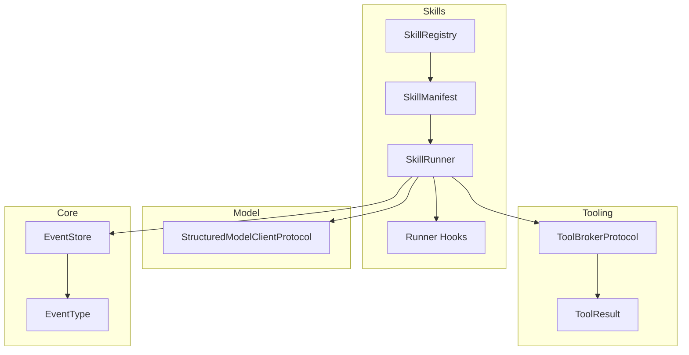

# Implementation Plan: Feature 005 — Pydantic Skill Runner

**Branch**: `codex/feat-005-pydantic-skill-runner` | **Date**: 2026-03-02 | **Spec**: `.specify/features/005-pydantic-skill-runner/spec.md`
**Input**: Feature specification + tech research（tech-only）

---

## Summary

Feature 005 交付 `SkillManifest + SkillRunner + SkillRegistry` 最小智能闭环：
- 强类型输入输出校验（Pydantic）
- tool_calls 经 `ToolBrokerProtocol` 执行与结构化回灌
- 异常分流、循环检测、上下文预算防护
- 生命周期 hooks 与 Skill 级事件追踪

核心策略：**005 只依赖 004 契约，不依赖具体实现**，保障 007 集成可替换性。

---

## Technical Context

**Language/Version**: Python 3.12+
**Primary Dependencies**: pydantic, pydantic-ai-slim（依赖可选用）, structlog, octoagent-core, octoagent-tooling
**Storage**: 复用 EventStore（core）进行 Skill 级事件写入
**Testing**: pytest + pytest-asyncio
**Target Platform**: macOS/Linux
**Project Type**: Monorepo workspace package（新增 `packages/skills`）
**Constraints**:
- 仅实现 SkillRunner，不实现 Graph Engine
- 不引入审批策略矩阵（Feature 006 负责）
- 兼容 ToolBrokerProtocol 锁定签名

---

## Constitution Check

| 原则 | 评估 | 说明 |
|------|------|------|
| C1 Durability First | PASS | Skill 级关键状态通过事件落盘，失败可追溯 |
| C2 Everything is an Event | PASS | 增加 SKILL_STARTED/COMPLETED/FAILED + 复用 MODEL/TOOL 事件 |
| C3 Tools are Contracts | PASS | Skill 调用工具仅走 ToolBrokerProtocol |
| C4 Side-effect Two-Phase | PASS | 不绕过 ToolBroker；审批逻辑由 006 接管 |
| C6 Degrade Gracefully | PASS | description_md 缺失降级；hook 失败 log-and-continue |
| C8 Observability | PASS | 生命周期事件 + trace/task 绑定 |
| C11 Context Hygiene | PASS | tool 结果预算防护，超限摘要/引用 |
| C13 失败可解释 | PASS | 明确错误分类与恢复建议 |

---

## Project Structure

### Documentation

```text
.specify/features/005-pydantic-skill-runner/
├── spec.md
├── plan.md
├── research.md
├── data-model.md
├── quickstart.md
├── contracts/
│   └── skills-api.md
└── tasks.md
```

### Source Code

```text
octoagent/
  packages/
    skills/                       # [新增]
      pyproject.toml
      src/octoagent/skills/
        __init__.py
        models.py
        manifest.py
        registry.py
        runner.py
        hooks.py
        exceptions.py
        protocols.py
      tests/
        __init__.py
        conftest.py
        test_models.py
        test_registry.py
        test_runner.py
        test_integration.py
```

---

## Architecture



运行时顺序:
1. 校验 input
2. 调用 model client 产出 envelope
3. 校验 output
4. 执行 tool_calls + 结果回灌
5. 循环/步数/预算检查
6. 终态输出 + 事件收尾

---

## Complexity Tracking

| 决策 | Why Needed | Simpler Alternative Rejected Because |
|------|------------|--------------------------------------|
| 抽象 StructuredModelClientProtocol | 让测试与实现解耦，兼容后续 provider 演进 | 直接绑定 LiteLLMClient 会把 005 与 provider 细节耦合 |
| 引入生命周期 hooks | 支持 observability 和可扩展拦截 | 在 runner 内硬编码日志会降低扩展性 |
| Skill 级事件枚举扩展 | 补齐 C2/C8 可观测闭环 | 仅依赖日志无法形成可查询审计链 |
