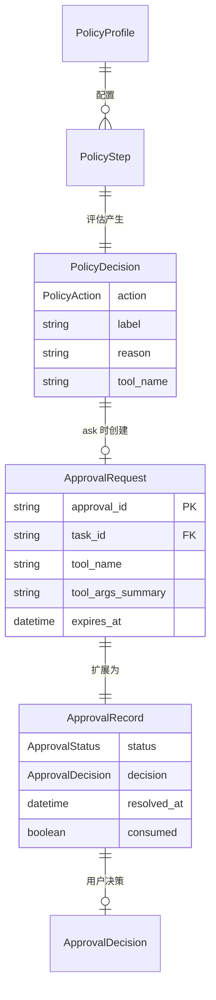

# 数据模型: Feature 006 — Policy Engine + Approvals + Chat UI

**Feature Branch**: `feat/006-policy-engine-approvals`
**日期**: 2026-03-02
**状态**: Draft
**包路径**: `packages/policy/`
**依赖**: `packages/core/` (EventType, TaskStatus), `packages/tooling/` (ToolMeta, SideEffectLevel, ToolProfile, CheckResult)

---

## 1. 枚举定义

### 1.1 PolicyAction

```python
from enum import StrEnum

class PolicyAction(StrEnum):
    """策略决策动作

    三种决策结果，严格度递增: allow < ask < deny
    """
    ALLOW = "allow"    # 允许执行
    ASK = "ask"        # 需要用户审批
    DENY = "deny"      # 拒绝执行
```

### 1.2 ApprovalDecision

```python
class ApprovalDecision(StrEnum):
    """用户的审批决策

    由用户通过 Approvals 面板或 REST API 提交。
    """
    ALLOW_ONCE = "allow-once"        # 一次性允许
    ALLOW_ALWAYS = "allow-always"    # 总是允许同类操作
    DENY = "deny"                    # 拒绝
```

### 1.3 ApprovalStatus

```python
class ApprovalStatus(StrEnum):
    """审批请求状态"""
    PENDING = "pending"        # 等待用户决策
    APPROVED = "approved"      # 已批准
    REJECTED = "rejected"      # 已拒绝
    EXPIRED = "expired"        # 已过期（自动 deny）
```

### 1.4 EventType 扩展

```python
# 在 packages/core/models/enums.py 的 EventType 中新增:

class EventType(StrEnum):
    # ... 现有值 (Feature 004 已新增 TOOL_CALL_STARTED/COMPLETED/FAILED) ...

    # Feature 006: 策略决策事件
    POLICY_DECISION = "POLICY_DECISION"

    # Feature 006: 审批事件
    APPROVAL_REQUESTED = "APPROVAL_REQUESTED"
    APPROVAL_APPROVED = "APPROVAL_APPROVED"
    APPROVAL_REJECTED = "APPROVAL_REJECTED"
    APPROVAL_EXPIRED = "APPROVAL_EXPIRED"
```

### 1.5 TaskStatus 扩展

```python
# 在 packages/core/models/enums.py 的 TaskStatus 中激活:

class TaskStatus(StrEnum):
    # ... 现有值 ...
    WAITING_APPROVAL = "WAITING_APPROVAL"  # M0 已预留，Feature 006 激活

# 新增合法状态转换:
# RUNNING -> WAITING_APPROVAL (策略决策为 ask)
# WAITING_APPROVAL -> RUNNING (用户批准)
# WAITING_APPROVAL -> REJECTED (用户拒绝 / 超时)
```

---

## 2. 策略管道模型

### 2.1 PolicyDecision

```python
from pydantic import BaseModel, Field
from typing import Literal
from datetime import datetime

class PolicyDecision(BaseModel):
    """策略评估的决策结果

    是策略管道的核心输出物。每一层评估产生一个 PolicyDecision，
    最终取最严格的决策作为最终结果。

    对齐 FR: FR-001, FR-002, FR-005, FR-006
    """
    action: PolicyAction
    label: str = Field(
        ...,
        description="决策来源标签，标识由哪一层规则产生。"
                    "格式: '<layer>.<detail>'，如 'tools.profile', 'global.irreversible'"
    )
    reason: str = Field(
        default="",
        description="决策原因说明（人类可读）"
    )
    tool_name: str = Field(
        default="",
        description="关联的工具名称"
    )
    side_effect_level: "SideEffectLevel | None" = Field(
        default=None,
        description="工具的副作用级别"
    )
    evaluated_at: datetime = Field(
        default_factory=datetime.utcnow,
        description="评估时间"
    )
```

**关键约束**:
- `label` 为必填字段，每个决策必须标注来源（FR-002）
- `action` 严格度排序: allow < ask < deny（FR-003）

### 2.2 PolicyStep

```python
from dataclasses import dataclass
from typing import Callable, Any

@dataclass(frozen=True)
class PolicyStep:
    """策略管道中的一个评估层

    包含评估函数和来源标签。多个 PolicyStep 按顺序组成完整的 Policy Pipeline。

    对齐 FR: FR-001
    """
    evaluator: Callable[
        ["ToolMeta", dict[str, Any], "ExecutionContext"],
        PolicyDecision
    ]
    label: str  # 层标签前缀，如 "tools.profile", "global"
```

**设计说明**:
- 使用 `@dataclass(frozen=True)` 保证不可变性
- `evaluator` 是纯函数，无副作用
- `label` 在评估结果中用作来源标识

### 2.3 PolicyProfile

```python
class PolicyProfile(BaseModel):
    """策略配置档案

    定义不同场景下的策略规则。M1 阶段为代码内静态配置，M2 支持动态变更。

    对齐 FR: FR-005, FR-027 (US-8)
    """
    name: str = Field(
        ...,
        description="Profile 名称，如 'default', 'strict', 'permissive'"
    )
    description: str = Field(
        default="",
        description="Profile 描述"
    )

    # === side_effect_level -> PolicyAction 映射 ===
    none_action: PolicyAction = Field(
        default=PolicyAction.ALLOW,
        description="side_effect_level=none 的默认决策"
    )
    reversible_action: PolicyAction = Field(
        default=PolicyAction.ALLOW,
        description="side_effect_level=reversible 的默认决策"
    )
    irreversible_action: PolicyAction = Field(
        default=PolicyAction.ASK,
        description="side_effect_level=irreversible 的默认决策"
    )

    # === ToolProfile 级别限制 ===
    allowed_tool_profile: "ToolProfile" = Field(
        default="standard",
        description="当前 Profile 允许的最高工具级别"
    )

    # === 超时配置 ===
    approval_timeout_seconds: float = Field(
        default=120.0,
        description="审批等待超时（秒）"
    )
```

**M1 预置 Profile**:

```python
DEFAULT_PROFILE = PolicyProfile(
    name="default",
    description="默认策略: irreversible 需审批，其余放行",
    none_action=PolicyAction.ALLOW,
    reversible_action=PolicyAction.ALLOW,
    irreversible_action=PolicyAction.ASK,
    allowed_tool_profile=ToolProfile.STANDARD,
    approval_timeout_seconds=120.0,
)

STRICT_PROFILE = PolicyProfile(
    name="strict",
    description="严格策略: reversible 和 irreversible 都需审批",
    none_action=PolicyAction.ALLOW,
    reversible_action=PolicyAction.ASK,
    irreversible_action=PolicyAction.ASK,
    allowed_tool_profile=ToolProfile.MINIMAL,
    approval_timeout_seconds=60.0,
)

PERMISSIVE_PROFILE = PolicyProfile(
    name="permissive",
    description="宽松策略: 全部放行（仅用于测试/受信任环境）",
    none_action=PolicyAction.ALLOW,
    reversible_action=PolicyAction.ALLOW,
    irreversible_action=PolicyAction.ALLOW,
    allowed_tool_profile=ToolProfile.PRIVILEGED,
    approval_timeout_seconds=300.0,
)
```

---

## 3. 审批模型

### 3.1 ApprovalRequest

```python
class ApprovalRequest(BaseModel):
    """审批请求记录

    是 Two-Phase Approval 的注册产物。包含审批所需的全部上下文信息。

    对齐 FR: FR-007, FR-018
    """
    approval_id: str = Field(
        ...,
        description="唯一审批 ID（UUID v4）"
    )
    task_id: str = Field(
        ...,
        description="关联的 Task ID"
    )
    tool_name: str = Field(
        ...,
        description="触发审批的工具名称"
    )
    tool_args_summary: str = Field(
        ...,
        description="工具参数摘要（脱敏后），用于审批面板展示"
    )
    risk_explanation: str = Field(
        ...,
        description="风险说明，解释为何需要审批"
    )
    policy_label: str = Field(
        ...,
        description="触发审批的策略层 label（如 'global.irreversible'）"
    )
    side_effect_level: "SideEffectLevel" = Field(
        ...,
        description="工具的副作用级别"
    )
    expires_at: datetime = Field(
        ...,
        description="审批过期时间（UTC）"
    )
    created_at: datetime = Field(
        default_factory=datetime.utcnow,
        description="审批请求创建时间（UTC）"
    )
```

### 3.2 ApprovalRecord

```python
class ApprovalRecord(BaseModel):
    """审批完整记录（含决策结果）

    在 ApprovalRequest 基础上增加决策状态和结果信息。
    是 ApprovalManager 管理的核心实体。

    对齐 FR: FR-007, FR-008, FR-009
    """
    request: ApprovalRequest
    status: ApprovalStatus = Field(
        default=ApprovalStatus.PENDING,
        description="当前审批状态"
    )
    decision: ApprovalDecision | None = Field(
        default=None,
        description="用户的审批决策（pending 时为 None）"
    )
    resolved_at: datetime | None = Field(
        default=None,
        description="决策解决时间（UTC）"
    )
    resolved_by: str | None = Field(
        default=None,
        description="解决者标识（如 'user:web', 'system:timeout'）"
    )
    consumed: bool = Field(
        default=False,
        description="allow-once 令牌是否已消费"
    )
```

**关键行为**:
- `status=PENDING` 时 `decision=None`
- `status=APPROVED` 时 `decision` 为 ALLOW_ONCE 或 ALLOW_ALWAYS
- `status=REJECTED` 时 `decision=DENY`
- `status=EXPIRED` 时 `decision=None`（自动按 deny 处理）
- `consumed=True` 仅对 ALLOW_ONCE 决策有意义（防止重放）

### 3.3 ApprovalResolveRequest

```python
class ApprovalResolveRequest(BaseModel):
    """审批决策 REST API 请求体

    由 POST /api/approve/{approval_id} 接收。

    对齐 FR: FR-019
    """
    decision: ApprovalDecision = Field(
        ...,
        description="审批决策: allow-once / allow-always / deny"
    )
```

### 3.4 ApprovalListItem

```python
class ApprovalListItem(BaseModel):
    """审批列表项（API 响应）

    GET /api/approvals 返回的列表项，包含前端展示所需的全部信息。

    对齐 FR: FR-018, FR-020
    """
    approval_id: str
    task_id: str
    tool_name: str
    tool_args_summary: str
    risk_explanation: str
    policy_label: str
    side_effect_level: str
    remaining_seconds: float = Field(
        ...,
        description="剩余等待时间（秒），由服务端计算"
    )
    created_at: datetime
```

---

## 4. 事件 Payload 模型

### 4.1 PolicyDecisionEventPayload

```python
class PolicyDecisionEventPayload(BaseModel):
    """POLICY_DECISION 事件的 payload

    对齐 FR: FR-006
    """
    action: PolicyAction
    label: str
    reason: str
    tool_name: str
    side_effect_level: str
    pipeline_trace: list[dict] = Field(
        default_factory=list,
        description="Pipeline 各层评估结果链（含 label 和 action）"
    )
```

### 4.2 ApprovalRequestedEventPayload

```python
class ApprovalRequestedEventPayload(BaseModel):
    """APPROVAL_REQUESTED 事件的 payload

    对齐 FR: FR-007, FR-012
    """
    approval_id: str
    task_id: str
    tool_name: str
    tool_args_summary: str  # 脱敏后
    risk_explanation: str
    policy_label: str
    expires_at: str  # ISO 格式
```

### 4.3 ApprovalResolvedEventPayload

```python
class ApprovalResolvedEventPayload(BaseModel):
    """APPROVAL_APPROVED / APPROVAL_REJECTED 事件的 payload

    对齐 FR: FR-012
    """
    approval_id: str
    task_id: str
    decision: str  # allow-once / allow-always / deny
    resolved_by: str
    resolved_at: str  # ISO 格式
```

### 4.4 ApprovalExpiredEventPayload

```python
class ApprovalExpiredEventPayload(BaseModel):
    """APPROVAL_EXPIRED 事件的 payload

    对齐 FR: FR-010
    """
    approval_id: str
    task_id: str
    expired_at: str  # ISO 格式
    auto_decision: str = "deny"
    reason: str = "approval timeout"
```

---

## 5. 内部运行时模型

### 5.1 PendingApproval

```python
import asyncio
from dataclasses import dataclass, field

@dataclass
class PendingApproval:
    """ApprovalManager 内部运行时状态

    不对外暴露，仅用于管理 asyncio.Event 和定时器。
    """
    record: ApprovalRecord
    event: asyncio.Event = field(default_factory=asyncio.Event)
    timer_handle: asyncio.TimerHandle | None = None
```

**设计说明**:
- `event` 是审批等待的核心原语，`wait_for_decision()` await 此 event
- `timer_handle` 是超时定时器句柄，审批解决后需取消
- 此模型不序列化、不持久化，仅存在于内存中

---

## 6. SSE 事件模型

### 6.1 SSEApprovalEvent

```python
class SSEApprovalEvent(BaseModel):
    """SSE 推送的审批事件

    前端 EventSource 接收后按 event_type 分发到对应组件。
    """
    event_type: str = Field(
        ...,
        description="SSE event type: 'approval:requested' / 'approval:resolved' / 'approval:expired'"
    )
    data: dict = Field(
        ...,
        description="事件数据（JSON）"
    )
```

---

## 7. 模型关系图



---

## 8. FR 覆盖追踪

| 模型 | 覆盖 FR |
|------|---------|
| PolicyAction | FR-005 |
| PolicyDecision | FR-001, FR-002, FR-005, FR-006 |
| PolicyStep | FR-001 |
| PolicyProfile | FR-005, FR-027 |
| ApprovalRequest | FR-007, FR-018 |
| ApprovalRecord | FR-007, FR-008, FR-009, FR-011 |
| ApprovalDecision | FR-008 |
| ApprovalResolveRequest | FR-019 |
| ApprovalListItem | FR-018, FR-020 |
| PolicyDecisionEventPayload | FR-006, FR-026 |
| ApprovalRequestedEventPayload | FR-007, FR-012, FR-026 |
| ApprovalResolvedEventPayload | FR-012, FR-026 |
| ApprovalExpiredEventPayload | FR-010, FR-026 |
| EventType 扩展 | FR-026 |
| TaskStatus 扩展 | FR-013 |
