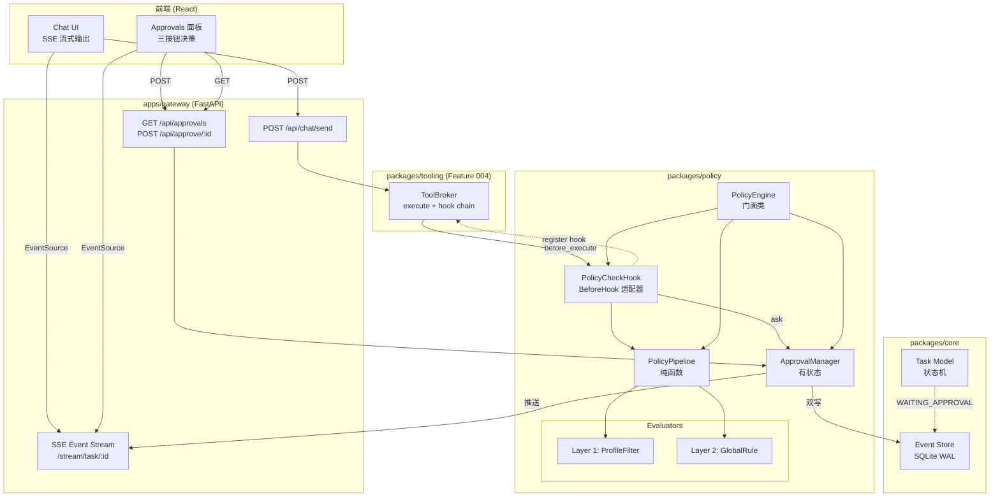
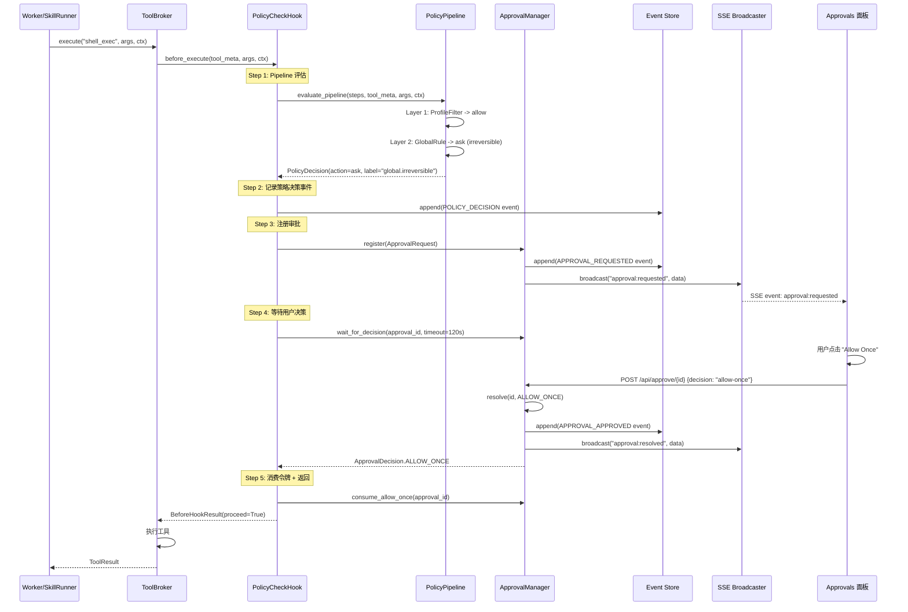
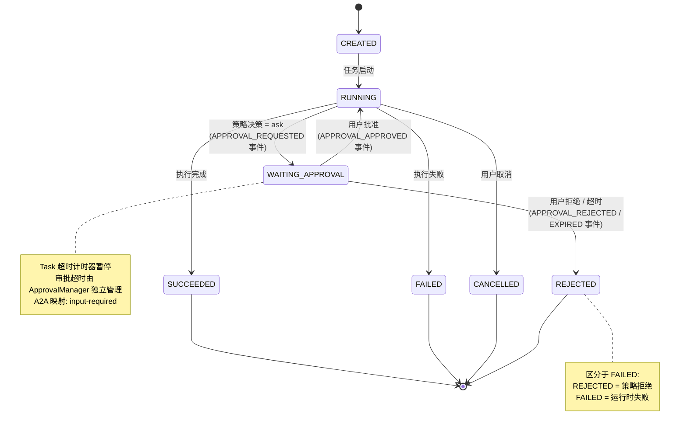
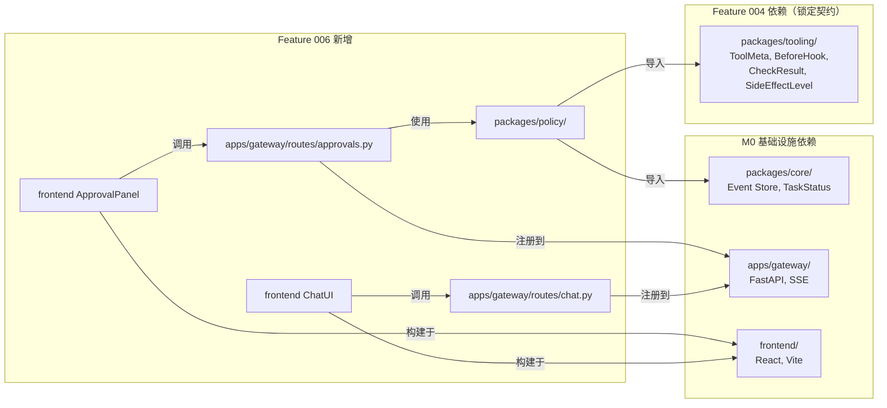

# Implementation Plan: Feature 006 — Policy Engine + Approvals + Chat UI

**Branch**: `feat/006-policy-engine-approvals` | **Date**: 2026-03-02 | **Spec**: `spec.md` (28 FR, 9 User Stories)
**Input**: Feature specification + tech-research.md + Feature 004 契约 + m1-feature-split

---

## Summary

Feature 006 建立 OctoAgent 的安全治理层。核心交付:

1. **多层 Policy Pipeline** — 纯函数管道（M1 两层: Profile 过滤 + Global 规则），每层决策附 label 追溯来源，遵循"只收紧不放松"原则
2. **Two-Phase Approval** — asyncio.Event 异步等待 + Event Store 双写，支持幂等注册、原子消费、15s 宽限期、120s 超时
3. **PolicyCheckHook** — 适配 Feature 004 BeforeHook Protocol，在 hook 内部完成审批等待，不修改 ToolBroker
4. **Approvals REST API** — GET /api/approvals + POST /api/approve/{id}
5. **前端 Approvals 面板** — 三按钮决策（Allow Once / Always Allow / Deny）+ SSE 实时更新 + 轮询兜底
6. **基础 Chat UI** — 消息输入 + SSE 流式输出
7. **事件全链路** — 5 个新 EventType + WAITING_APPROVAL 状态机扩展

技术方案: 纯函数 Pipeline 模式（OpenClaw 风格），零新依赖，全部基于项目现有技术栈（Python 3.12 asyncio + Pydantic v2 + FastAPI + React）。

---

## Technical Context

**Language/Version**: Python 3.12+（asyncio.Event, match/case, StrEnum）
**Primary Dependencies**: Pydantic v2（数据模型）, FastAPI（REST API + SSE）, sse-starlette（SSE 推送）, React 18（前端）
**Storage**: SQLite WAL（Event Store 持久化审批事件，已有基础设施）
**Testing**: pytest + pytest-asyncio（后端）, Vitest（前端）
**Target Platform**: macOS + 局域网（本地优先）
**Project Type**: Web 应用（backend + frontend）
**Performance Goals**: 审批注册到可见 < 3s (SC-003), 审批决策到恢复 < 2s (SC-004), SSE 首字节 < 1s (SC-008)
**Constraints**: 单进程单 event loop, 不引入分布式原语, 不修改 Feature 004 锁定契约
**Scale/Scope**: 单用户, 并发审批请求 < 10

---

## Constitution Check

*GATE: 必须全部通过方可进入实施阶段。*

| # | 宪法原则 | 适用性 | 评估 | 说明 |
|---|---------|--------|------|------|
| C1 | Durability First | **核心** | PASS | 审批状态双写 Event Store（FR-011），进程重启后通过 recover_from_store() 恢复（SC-006）。asyncio.Event 丢失通过 Event Store 重建。 |
| C2 | Everything is an Event | **核心** | PASS | 5 个新 EventType: POLICY_DECISION, APPROVAL_REQUESTED/APPROVED/REJECTED/EXPIRED（FR-026）。策略决策、审批全生命周期均有事件记录。 |
| C3 | Tools are Contracts | 高 | PASS | 复用 Feature 004 的 ToolMeta + PolicyCheckpoint Protocol。PolicyCheckHook 实现 BeforeHook Protocol。无新的工具定义。 |
| C4 | Side-effect Two-Phase | **核心** | PASS | PolicyPipeline(ask) -> ApprovalManager(register -> wait_for_decision) -> execute。完整二段式: Plan(Pipeline 评估) -> Gate(用户审批) -> Execute(工具执行)。 |
| C5 | Least Privilege | 高 | PASS | Layer 1 ToolProfile 过滤限制工具访问范围。审批 payload 参数脱敏（FR-028）。敏感值不进 Event payload。 |
| C6 | Degrade Gracefully | 中 | PASS | PolicyCheckHook fail_mode=closed（安全降级: 异常时拒绝而非放行）。SSE 断线有 30s 轮询兜底（FR-022）。前端 EventSource 自动重连。 |
| C7 | User-in-Control | **核心** | PASS | Approvals 面板三按钮决策。审批可取消（deny）。PolicyProfile 可配置调整门禁行为（US-8）。irreversible 默认 ask（safe by default）。 |
| C8 | Observability | 高 | PASS | 每个 PolicyDecision 附 label 追溯来源（FR-002）。完整审计事件链（FR-006, FR-026）。Approvals 面板展示风险说明和剩余倒计时。 |
| C9 | 不猜关键配置 | 低 | N/A | Policy 层不涉及外部系统配置操作。 |
| C10 | Bias to Action | 低 | N/A | Policy 层是被动评估，不主动发起动作。 |
| C11 | Context Hygiene | 中 | PASS | 审批 payload 使用摘要（tool_args_summary），不传原始参数。Event payload 脱敏。 |
| C12 | 记忆写入治理 | 低 | N/A | Policy 层不涉及记忆写入。 |
| C13 | 失败必须可解释 | 中 | PASS | deny 决策附带 reason 和 label。超时自动 deny 附带 APPROVAL_EXPIRED 事件和原因说明。 |
| C14 | A2A Protocol | 中 | PASS | WAITING_APPROVAL 映射为 A2A `input-required`。REJECTED 区分策略拒绝与运行时失败（FR-013）。 |

**Constitution Check 结论**: 全部 PASS，无 VIOLATION。

---

## Project Structure

### Documentation (this feature)

```text
.specify/features/006-policy-engine-approvals/
  spec.md              # 需求规范（28 FR, 9 User Stories）
  plan.md              # 本文件（技术规划主文档）
  research.md          # 技术决策研究（12 个决策）
  data-model.md        # 数据模型定义
  quickstart.md        # 快速上手指南
  contracts/
    policy-api.md      # Policy Engine + Approvals REST API 契约
  research/
    tech-research.md   # 技术调研（竞品分析）
```

### Source Code (repository root)

```text
packages/policy/                        # 新增 package: Policy Engine 核心
  __init__.py
  models.py                             # PolicyDecision, PolicyAction, PolicyStep,
                                        # PolicyProfile, ApprovalRequest, ApprovalRecord,
                                        # ApprovalDecision, ApprovalStatus, 事件 Payload 模型
  pipeline.py                           # evaluate_pipeline() 纯函数
  evaluators/
    __init__.py
    profile_filter.py                   # Layer 1: ToolProfile 过滤
    global_rule.py                      # Layer 2: SideEffectLevel 驱动规则
  approval_manager.py                   # ApprovalManager（幂等注册 + 异步等待 + 原子消费）
  policy_check_hook.py                  # PolicyCheckHook（BeforeHook 适配器）
  policy_engine.py                      # PolicyEngine 门面（组合 Pipeline + ApprovalManager）

packages/core/models/enums.py           # 修改: 新增 5 个 EventType + 激活 WAITING_APPROVAL
packages/core/models/task.py            # 修改: validate_transition() 新增 3 条转换规则

apps/gateway/
  routes/
    approvals.py                        # 新增: GET /api/approvals, POST /api/approve/{id}
    chat.py                             # 新增: POST /api/chat/send
  sse/
    approval_events.py                  # 新增: SSE 审批事件推送集成

frontend/src/
  components/
    ApprovalPanel/
      ApprovalPanel.tsx                 # 新增: Approvals 面板组件
      ApprovalCard.tsx                  # 新增: 单个审批卡片
    ChatUI/
      ChatUI.tsx                        # 新增: Chat UI 主组件
      MessageBubble.tsx                 # 新增: 消息气泡
  hooks/
    useApprovals.ts                     # 新增: SSE + 轮询审批状态管理
    useChatStream.ts                    # 新增: SSE 流式 Chat 管理

tests/
  unit/
    policy/
      test_pipeline.py                  # Pipeline 纯函数测试
      test_profile_filter.py            # Layer 1 评估器测试
      test_global_rule.py               # Layer 2 评估器测试
      test_approval_manager.py          # ApprovalManager 测试
      test_policy_check_hook.py         # PolicyCheckHook 测试
      test_models.py                    # 数据模型测试
  integration/
    test_approval_api.py                # REST API 集成测试
    test_approval_flow.py               # 完整审批流程测试
    test_sse_events.py                  # SSE 事件推送测试
  contract/
    test_policy_checkpoint_contract.py  # PolicyCheckpoint Protocol 契约测试
```

**Structure Decision**: 采用 monorepo 结构，新增 `packages/policy/` 独立包。与 `packages/core/`、`packages/tooling/` 平行，依赖方向为 policy -> tooling -> core（无循环依赖）。

---

## Architecture

### 整体架构图



### 核心调用流程



### Task 状态机扩展



---

## Implementation Phases

### Phase 0: 基础模型与枚举（Day 1 上午）

**目标**: 建立所有数据模型和枚举定义。

**交付物**:
- `packages/policy/models.py` — 全部 Pydantic 模型
- `packages/core/models/enums.py` 修改 — EventType 扩展 + TaskStatus 激活
- `packages/core/models/task.py` 修改 — validate_transition() 新增 3 条规则

**覆盖 FR**: FR-005 (PolicyAction), FR-008 (ApprovalDecision), FR-013 (TaskStatus), FR-026 (EventType)

**测试**: `tests/unit/policy/test_models.py`

### Phase 1: Pipeline 纯函数（Day 1 下午）

**目标**: 实现 Policy Pipeline 核心评估逻辑。

**交付物**:
- `packages/policy/pipeline.py` — evaluate_pipeline()
- `packages/policy/evaluators/profile_filter.py` — Layer 1
- `packages/policy/evaluators/global_rule.py` — Layer 2

**覆盖 FR**: FR-001 (多层管道), FR-002 (label 追踪), FR-003 (只收紧不放松), FR-004 (Profile 过滤), FR-005 (三种决策)

**测试**: `tests/unit/policy/test_pipeline.py`, `test_profile_filter.py`, `test_global_rule.py`

### Phase 2: ApprovalManager（Day 2）

**目标**: 实现 Two-Phase Approval 完整生命周期。

**交付物**:
- `packages/policy/approval_manager.py` — 幂等注册 + 异步等待 + 原子消费 + 超时 + 宽限期 + 启动恢复

**覆盖 FR**: FR-007 (幂等注册), FR-008 (三种审批决策), FR-009 (宽限期), FR-010 (超时), FR-011 (持久化与恢复)

**测试**: `tests/unit/policy/test_approval_manager.py`

### Phase 3: PolicyCheckHook + PolicyEngine（Day 3 上午）

**目标**: 实现 BeforeHook 适配器和门面类，完成与 Feature 004 的集成接口。

**交付物**:
- `packages/policy/policy_check_hook.py` — PolicyDecision -> CheckResult 映射 + ask 审批等待
- `packages/policy/policy_engine.py` — 门面类（初始化、启动恢复、Profile 管理）

**覆盖 FR**: FR-015 (PolicyCheckpoint Protocol), FR-016 (hook 内部审批), FR-017 (irreversible 无 hook 拒绝)

**测试**: `tests/unit/policy/test_policy_check_hook.py`, `tests/contract/test_policy_checkpoint_contract.py`

### Phase 4: REST API + SSE（Day 3 下午 ~ Day 4 上午）

**目标**: 实现 Approvals REST API 和 SSE 事件推送。

**交付物**:
- `apps/gateway/routes/approvals.py` — GET /api/approvals + POST /api/approve/{id}
- `apps/gateway/routes/chat.py` — POST /api/chat/send
- `apps/gateway/sse/approval_events.py` — SSE 审批事件集成

**覆盖 FR**: FR-018 (GET 列表), FR-019 (POST 决策), FR-022 (SSE 推送), FR-023 (Chat 发送), FR-024 (SSE 流式)

**测试**: `tests/integration/test_approval_api.py`, `tests/integration/test_sse_events.py`

### Phase 5: 前端 Approvals 面板（Day 4 下午）

**目标**: 实现 Web 审批面板。

**交付物**:
- `frontend/src/components/ApprovalPanel/` — 面板组件 + 审批卡片
- `frontend/src/hooks/useApprovals.ts` — SSE + 轮询状态管理

**覆盖 FR**: FR-020 (面板展示), FR-021 (三按钮), FR-022 (实时更新), FR-028 (脱敏展示)

### Phase 6: 前端 Chat UI（Day 5 上午）

**目标**: 实现基础 Chat UI。

**交付物**:
- `frontend/src/components/ChatUI/` — Chat 组件 + 消息气泡
- `frontend/src/hooks/useChatStream.ts` — SSE 流式 Chat

**覆盖 FR**: FR-023 (Chat 输入), FR-024 (SSE 流式输出), FR-025 (审批提示)

### Phase 7: 集成测试与事件审计（Day 5 下午）

**目标**: 端到端集成测试 + 事件链验证。

**交付物**:
- `tests/integration/test_approval_flow.py` — 完整审批流程测试
- 策略决策事件 + 审批事件完整链路验证

**覆盖 FR**: FR-006 (策略事件), FR-012 (审批工作流事件), FR-014 (Task 超时暂停), FR-027 (配置变更事件), FR-028 (脱敏验证)

---

## Key Design Decisions

详见 `research.md`，核心决策摘要:

| # | 决策 | 结论 | 理由 |
|---|------|------|------|
| D1 | Pipeline 架构 | 纯函数 Pipeline | Blueprint 8.6.4 直接映射 + OpenClaw 验证 |
| D2 | 等待原语 | asyncio.Event + Event Store 双写 | 单进程足够 + C1 Durability 满足 |
| D3 | Hook 集成 | hook 内部等待审批 | 不修改 Feature 004 锁定契约 |
| D4 | 决策映射 | PolicyDecision -> CheckResult 适配 | spec Clarification #2 已确认 |
| D5 | 状态扩展 | WAITING_APPROVAL + 3 条规则 | m1-feature-split 明确 + A2A 兼容 |
| D10 | deny 短路 | 立即返回 | spec Clarification #4 + 逻辑必然 |
| D12 | 包位置 | packages/policy/ | Blueprint Repo 结构 + 依赖清晰 |

---

## Dependency Graph



**依赖说明**:
- `packages/policy/` 仅依赖 `packages/tooling/`（类型定义）和 `packages/core/`（Event Store）
- `apps/gateway/routes/` 依赖 `packages/policy/`（ApprovalManager 实例）
- 前端组件依赖后端 REST API，无直接 Python 依赖
- **Feature 004 代码尚未实现**: 并行开发期间使用 Feature 004 契约文档中的 Mock 实现

---

## Complexity Tracking

> 以下记录偏离最简方案的设计决策及理由。

| 决策 | 选择的方案 | 更简单的替代 | 拒绝更简单方案的理由 |
|------|-----------|-------------|---------------------|
| Pipeline 多层（2 层）而非 1 层 | 2 层 Pipeline（Profile + Global） | 单层 if-else 判断 | Blueprint 8.6.4 明确定义 4 层 Pipeline，M1 实现前 2 层。单层不可扩展到 M2。 |
| ApprovalManager 双写 | 内存 + Event Store 双写 | 纯内存存储 | Constitution C1 Durability First 要求审批状态持久化。纯内存方案进程重启后丢失所有审批。 |
| PolicyCheckHook 适配器模式 | 将 Pipeline 决策适配为 CheckResult | 直接在 PolicyCheckpoint.check() 中写 Pipeline 逻辑 | 关注点分离: Pipeline 是可测试的纯函数，适配器仅负责映射。方便 M2 替换 Pipeline 实现。 |
| SSE + 轮询双模 | SSE 实时 + 30s 轮询兜底 | 纯轮询 | SC-003 要求 3s 内可见，30s 轮询无法满足。SSE 断线时轮询兜底保证可靠性。 |
| 前端 Custom Hooks | useApprovals + useChatStream 独立 hooks | 组件内直接 fetch | 状态隔离 + 可复用。M2 扩展（Telegram 渠道）时 hooks 可复用。 |

---

## Risk Mitigation

| 风险 | 概率 | 影响 | 缓解策略 |
|------|------|------|----------|
| R1: asyncio.Event 进程重启丢失 | 高 | 高 | 双写 Event Store + recover_from_store() 启动恢复 + 超时兜底 |
| R2: PolicyCheckHook 长时间阻塞 hook 链 | 中 | 高 | hook 内部等待（不阻塞 ToolBroker），120s 超时自动 deny |
| R3: WAITING_APPROVAL 与 Task 状态机冲突 | 中 | 中 | 扩展 validate_transition() 新增 3 条规则，单元测试覆盖 |
| R4: SSE 断线丢失审批通知 | 中 | 中 | 30s 轮询兜底 + API 为事实来源 |
| R5: 审批超时与 Task 超时冲突 | 中 | 中 | Task 进入 WAITING_APPROVAL 时暂停 Task 超时，审批超时独立管理（FR-014） |
| R6: Feature 004 Mock 与真实实现行为差异 | 中 | 中 | 依赖 Feature 004 锁定契约编写 contract test |

---

## FR Coverage Matrix

| FR | 描述 | Phase | 对应文件 |
|----|------|-------|---------|
| FR-001 | 多层策略管道 | P1 | pipeline.py |
| FR-002 | 决策来源标签 | P1 | pipeline.py, models.py |
| FR-003 | 只收紧不放松 | P1 | pipeline.py |
| FR-004 | Profile 过滤 | P1 | evaluators/profile_filter.py |
| FR-005 | 三种决策结果 | P0+P1 | models.py, evaluators/global_rule.py |
| FR-006 | 策略决策事件 | P3 | policy_check_hook.py |
| FR-007 | 幂等注册 | P2 | approval_manager.py |
| FR-008 | 三种审批决策 | P2 | approval_manager.py |
| FR-009 | 宽限期 | P2 | approval_manager.py |
| FR-010 | 超时自动 deny | P2 | approval_manager.py |
| FR-011 | 持久化与恢复 | P2 | approval_manager.py |
| FR-012 | 审批工作流状态 | P3 | policy_check_hook.py |
| FR-013 | WAITING_APPROVAL 状态 | P0 | core/models/enums.py, task.py |
| FR-014 | Task 超时暂停 | P7 | test_approval_flow.py |
| FR-015 | PolicyCheckpoint Protocol | P3 | policy_check_hook.py |
| FR-016 | hook 内部审批 | P3 | policy_check_hook.py |
| FR-017 | irreversible 无 hook 拒绝 | P3 | policy_engine.py |
| FR-018 | GET /api/approvals | P4 | routes/approvals.py |
| FR-019 | POST /api/approve | P4 | routes/approvals.py |
| FR-020 | Approvals 面板 | P5 | ApprovalPanel/ |
| FR-021 | 三按钮操作 | P5 | ApprovalPanel/ |
| FR-022 | SSE 实时更新 | P4+P5 | approval_events.py, useApprovals.ts |
| FR-023 | Chat UI 输入 | P6 | ChatUI/, routes/chat.py |
| FR-024 | SSE 流式输出 | P4+P6 | useChatStream.ts |
| FR-025 | 审批提示 | P6 | ChatUI/ |
| FR-026 | EventType 扩展 | P0 | core/models/enums.py |
| FR-027 | 配置变更事件 | P7 | policy_engine.py |
| FR-028 | 参数脱敏 | P3+P5 | policy_check_hook.py, ApprovalPanel/ |

---

## Success Criteria Verification

| SC | 目标 | 验证方式 |
|----|------|---------|
| SC-001 | 100% irreversible 触发审批 | 集成测试: 注册 3 个 irreversible 工具，执行后验证全部进入审批 |
| SC-002 | 100% none/reversible 无审批 | 集成测试: 注册 none + reversible 工具，执行后验证无审批请求 |
| SC-003 | 注册到可见 < 3s | SSE 事件时间戳 vs 前端渲染时间戳 |
| SC-004 | 决策到恢复 < 2s | resolve() 到 BeforeHookResult 返回的时间差 |
| SC-005 | 超时 5s 内自动 deny | test_approval_manager.py: 设置短超时验证 |
| SC-006 | 重启 30s 内恢复 | 集成测试: 注册审批 -> 模拟重启 -> recover_from_store() |
| SC-007 | 事件覆盖率 100% | 集成测试: 完整流程后查询 Event Store 验证事件链 |
| SC-008 | SSE 首字节 < 1s | Chat UI 发送消息后计时 |
| SC-009 | 实时更新 < 3s, 轮询 < 30s | 前端测试: SSE 连接/断线两种场景 |
