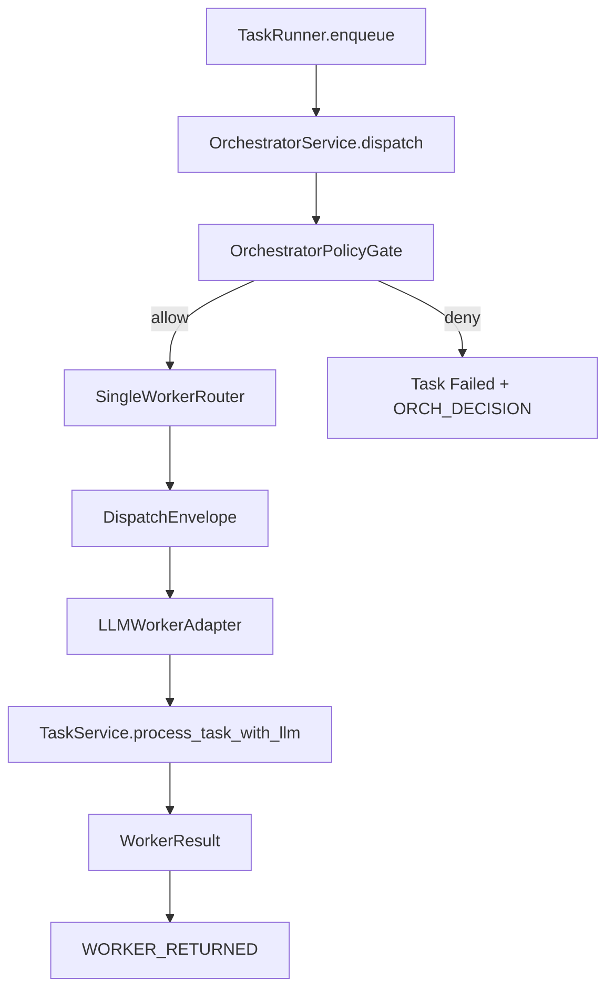

# Implementation Plan: Feature 008 Orchestrator Skeleton（单 Worker）

**Branch**: `codex/feat-008-orchestrator-skeleton` | **Date**: 2026-03-02 | **Spec**: `.specify/features/008-orchestrator-skeleton/spec.md`
**Input**: Feature specification + research/research-synthesis.md
**Rerun**: 2026-03-02（from `GATE_RESEARCH`，已级联重跑）

## Summary

本特性在现有 M1 主链路中引入最小 Orchestrator 控制平面：
- 冻结 `OrchestratorRequest/DispatchEnvelope/WorkerResult` 协议；
- 由 `TaskRunner` 调用 `OrchestratorService` 执行单 Worker 派发；
- 扩展三类控制平面事件；
- 接入高风险 gate（最小版本）；
- 补齐单元与集成测试。
- 在线调研复核结论（Perplexity）与本方案一致：保留 `contract_version/hop_count/max_hops`、`retryable` 分类、三段控制平面事件。

## Technical Context

**Language/Version**: Python 3.12+
**Primary Dependencies**: FastAPI, Pydantic, asyncio, structlog, pytest
**Storage**: SQLite WAL（复用 Event Store/Task Store）
**Testing**: pytest + pytest-asyncio
**Target Platform**: 本地单机服务（macOS/Linux）
**Project Type**: Monorepo（apps + packages）
**Performance Goals**: 单任务派发新增开销 < 20ms（不含模型调用）
**Constraints**: 不引入新外部依赖；不重写 Feature 006 策略核心
**Scale/Scope**: 单 Worker（MVP）

## Constitution Check

| 原则 | 评估 | 说明 |
|------|------|------|
| C1 Durability First | PASS | 控制平面决策/派发/回传均写事件 |
| C2 Everything is an Event | PASS | 三类新事件完整覆盖主链路 |
| C4 Side-effect Two-Phase | PASS | 高风险任务先 gate 再派发 |
| C6 Degrade Gracefully | PASS | worker 不可用/异常场景可解释失败 |
| C8 Observability | PASS | 事件 payload 结构化，含路由与结果摘要 |

## Project Structure

### Documentation

```text
.specify/features/008-orchestrator-skeleton/
├── spec.md
├── plan.md
├── tasks.md
├── research.md
├── data-model.md
├── quickstart.md
├── checklists/requirements.md
├── contracts/
│   └── orchestrator-worker-contract.md
├── research/
│   ├── product-research.md
│   ├── tech-research.md
│   └── research-synthesis.md
└── verification/
```

### Source Code

```text
octoagent/apps/gateway/src/octoagent/gateway/services/
├── task_runner.py               # 修改：改为通过 OrchestratorService 派发
├── task_service.py              # 复用：worker 执行与状态推进
└── orchestrator.py              # 新增：Orchestrator/Router/WorkerAdapter/Gate

octoagent/packages/core/src/octoagent/core/models/
├── orchestrator.py              # 新增：OrchestratorRequest/DispatchEnvelope/WorkerResult
├── enums.py                     # 修改：新增 3 个 EventType
├── payloads.py                  # 修改：新增 Orchestrator 事件 payload
└── __init__.py                  # 修改：导出新增模型

octoagent/apps/gateway/tests/
├── test_orchestrator.py         # 新增：路由/派发/失败回传/gate 单测
└── test_task_runner.py          # 修改：断言 Orchestrator 接入后仍通过

octoagent/tests/integration/
└── test_f008_orchestrator_flow.py   # 新增：用户消息到 Worker 回传集成测试
```

## Architecture



## Complexity Tracking

无宪法违规项，无额外复杂度豁免。
