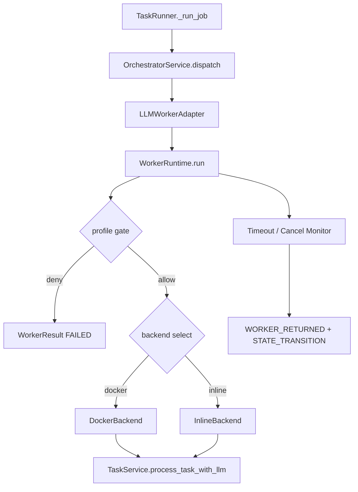

# Implementation Plan: Feature 009 Worker Runtime + Docker + Timeout/Profile

**Branch**: `codex/feat-009-worker-runtime` | **Date**: 2026-03-03 | **Spec**: `.specify/features/009-worker-runtime-docker-timeout/spec.md`
**Input**: spec + tech/online research

## Summary

在 Feature 008 的 Orchestrator 契约基础上，引入 Worker Runtime 运行层，补齐 Free Loop、Docker backend 接入、privileged 显式授权、分层超时和取消语义，并保持默认主链路兼容。

## Technical Context

**Language/Version**: Python 3.12+
**Primary Dependencies**: FastAPI, asyncio, Pydantic, structlog, pytest
**Storage**: SQLite WAL（复用 tasks/events/task_jobs）
**Testing**: pytest + pytest-asyncio
**Target Platform**: macOS/Linux 开发环境
**Project Type**: Monorepo（apps + packages）
**Performance Goals**: runtime 控制逻辑额外开销 < 30ms/步（不含模型调用）
**Constraints**: 不引入新三方依赖；不重构 010/011 范围
**Scale/Scope**: 单 Worker runtime（MVP）

## Constitution Check

| 原则 | 评估 | 说明 |
|------|------|------|
| C1 Durability First | PASS | timeout/cancel/return 均落事件与终态 |
| C2 Everything is an Event | PASS | Worker 回传含 runtime 元数据 |
| C4 Two-Phase Side-effect | PASS | privileged 需显式授权后执行 |
| C6 Degrade Gracefully | PASS | Docker 不可用可降级（preferred） |
| C8 Observability | PASS | timeout/cancel/profile 拒绝均可追溯 |

## Project Structure

### Documentation

```text
.specify/features/009-worker-runtime-docker-timeout/
├── spec.md
├── plan.md
├── tasks.md
├── data-model.md
├── quickstart.md
├── checklists/requirements.md
├── contracts/worker-runtime-contract.md
├── research/
│   ├── tech-research.md
│   ├── research-synthesis.md
│   └── online-research.md
└── verification/
```

### Source Code

```text
octoagent/apps/gateway/src/octoagent/gateway/services/
├── worker_runtime.py            # 新增: runtime + backend + timeout/cancel
├── orchestrator.py              # 修改: 适配 WorkerRuntime 与 runtime 元数据
├── task_runner.py               # 修改: cancel 协同 + job 终态完善
└── task_service.py              # 修改: 提供 running->cancelled 辅助能力

octoagent/apps/gateway/src/octoagent/gateway/routes/
└── cancel.py                    # 修改: 接入 TaskRunner cancel 信号

octoagent/packages/core/src/octoagent/core/models/
├── orchestrator.py              # 修改: WorkerSession/WorkerResult 扩展
├── payloads.py                  # 修改: WorkerReturnedPayload 扩展
└── __init__.py                  # 修改: 导出 Orchestrator/WorkerRuntime 相关模型

octoagent/packages/core/src/octoagent/core/store/
└── task_job_store.py            # 修改: 新增 mark_cancelled

octoagent/apps/gateway/tests/
├── test_worker_runtime.py       # 新增: profile/timeout/backend 单测
├── test_task_runner.py          # 修改: 增加 cancel 路径断言
└── test_us8_cancel.py           # 修改: 验证 task_runner 协同

octoagent/tests/integration/
└── test_f009_worker_runtime_flow.py  # 新增: 超时/取消/权限拒绝集成测试
```

## Architecture



## Complexity Tracking

无宪法违规项，无复杂度豁免。
