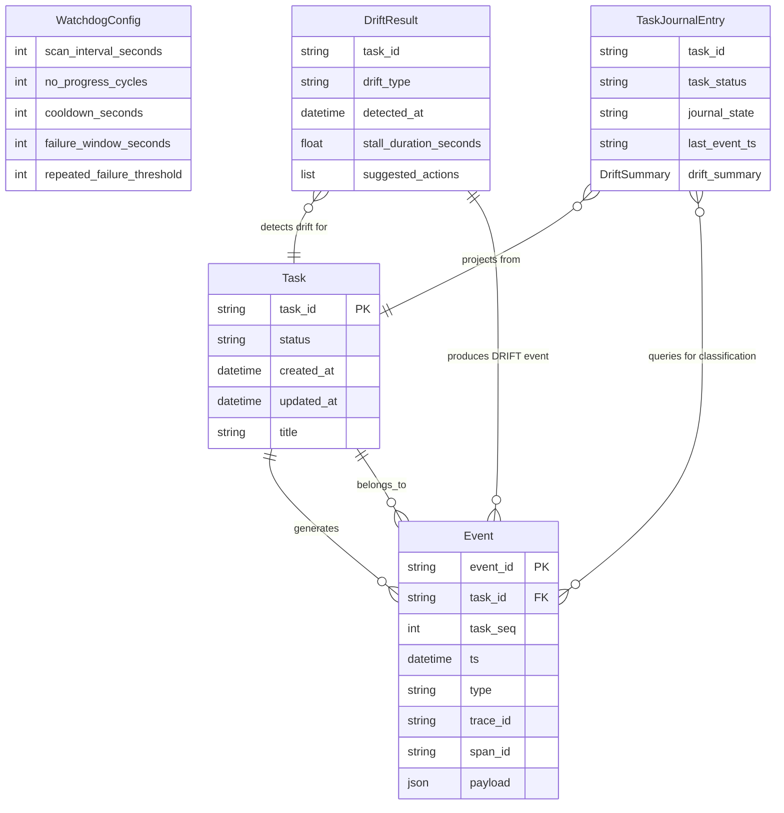

# 数据模型: Feature 011 — Watchdog + Task Journal + Drift Detector

**特性目录**: `.specify/features/011-watchdog-task-journal`
**创建日期**: 2026-03-03
**依据**: `spec.md` Key Entities + `research/tech-research.md` §6
**状态**: Final

---

## 一、新增枚举值（EventType 扩展）

文件路径: `octoagent/packages/core/src/octoagent/core/models/enums.py`

在 `EventType` 枚举中追加三个新事件类型（FR-001）：

```python
# Feature 011: Watchdog + Task Journal 事件类型
TASK_HEARTBEAT = "TASK_HEARTBEAT"          # Worker 心跳确认事件
TASK_MILESTONE = "TASK_MILESTONE"          # 任务里程碑完成标记事件
TASK_DRIFT_DETECTED = "TASK_DRIFT_DETECTED"  # 漂移检测告警事件
```

**向后兼容性**：新增枚举值不修改任何已有枚举值，不影响现有事件查询接口。
`EventType(row[4])` 反序列化逻辑无需修改。

---

## 二、新增 Event Payload 类型

文件路径: `octoagent/packages/core/src/octoagent/core/models/payloads.py`

### 2.1 TaskHeartbeatPayload

对应事件类型: `TASK_HEARTBEAT`（FR-003）

```python
class TaskHeartbeatPayload(BaseModel):
    """TASK_HEARTBEAT 事件 payload

    Worker 在执行关键节点主动写入，用于 Watchdog 进度感知。
    写入时间戳由服务端 UTC 时间确定，不依赖客户端时间。
    """

    task_id: str = Field(description="任务 ID")
    trace_id: str = Field(description="关联 trace ID")
    heartbeat_ts: str = Field(description="心跳时间戳（UTC ISO 8601）")
    loop_step: int | None = Field(
        default=None,
        description="当前执行步骤编号（Free Loop 循环计数）",
    )
    note: str = Field(default="", description="心跳备注（可选摘要）")
```

### 2.2 TaskMilestonePayload

对应事件类型: `TASK_MILESTONE`（FR-001 + spec Key Entities）

```python
class TaskMilestonePayload(BaseModel):
    """TASK_MILESTONE 事件 payload

    Worker 在完成重要阶段时主动写入，标记可观察的进展节点。
    """

    task_id: str = Field(description="任务 ID")
    trace_id: str = Field(description="关联 trace ID")
    milestone_name: str = Field(description="里程碑名称（如 'data_fetched'）")
    milestone_ts: str = Field(description="里程碑完成时间戳（UTC ISO 8601）")
    summary: str = Field(default="", description="里程碑完成摘要")
    artifact_ref: str | None = Field(
        default=None,
        description="关联产物引用（可选）",
    )
```

### 2.3 TaskDriftDetectedPayload

对应事件类型: `TASK_DRIFT_DETECTED`（FR-002 + FR-019）

```python
from typing import Literal

DriftType = Literal["no_progress", "state_machine_stall", "repeated_failure"]


class TaskDriftDetectedPayload(BaseModel):
    """TASK_DRIFT_DETECTED 事件 payload

    Watchdog Scanner 检测到漂移时写入，payload 包含诊断摘要。
    详细诊断信息通过 artifact_ref 引用访问，不直接内联（Constitution 原则 11）。
    """

    # 必填诊断字段（FR-002）
    drift_type: DriftType = Field(
        description="漂移类型: no_progress / state_machine_stall / repeated_failure",
    )
    detected_at: str = Field(description="检测触发时间（UTC ISO 8601）")
    task_id: str = Field(description="被检测任务 ID")
    trace_id: str = Field(description="继承被检测任务的 trace_id")

    # 诊断时间字段
    last_progress_ts: str | None = Field(
        default=None,
        description="最近进展事件时间戳（UTC ISO 8601），无则为 None",
    )
    stall_duration_seconds: float = Field(
        description="卡死/驻留持续时长（秒）",
    )

    # 操作建议
    suggested_actions: list[str] = Field(
        description="可执行的建议动作列表（如 ['cancel_task', 'check_worker_logs']）",
    )

    # 详细诊断 artifact 引用（Context Hygiene，Constitution 原则 11）
    artifact_ref: str | None = Field(
        default=None,
        description="详细诊断信息的 Artifact 引用 ID，完整内容不内联于 payload",
    )

    # Logfire / OTel 预留字段（FR-021）
    watchdog_span_id: str = Field(
        default="",
        description="Watchdog 扫描 span_id（F012 接入前为空字符串占位）",
    )

    # 重复失败模式专属字段（drift_type == 'repeated_failure' 时有值）
    failure_count: int | None = Field(
        default=None,
        description="时间窗口内失败事件次数（重复失败模式专属）",
    )
    failure_event_types: list[str] = Field(
        default_factory=list,
        description="失败事件类型统计列表（重复失败模式专属）",
    )

    # 状态机漂移专属字段（drift_type == 'state_machine_stall' 时有值）
    current_status: str | None = Field(
        default=None,
        description="当前任务状态名称（状态机漂移模式专属）",
    )
```

---

## 三、WatchdogConfig 配置模型

文件路径: `octoagent/apps/gateway/src/octoagent/gateway/services/watchdog/config.py`（新建）

```python
import os

from pydantic import BaseModel, Field, field_validator


class WatchdogConfig(BaseModel):
    """Watchdog 配置模型（FR-017 + FR-018）

    所有字段均有默认值，支持通过 WATCHDOG_{KEY} 环境变量覆盖。
    无效配置值（负数/零）回退到默认值，不影响系统启动（FR-018）。
    """

    scan_interval_seconds: int = Field(
        default=15,
        description="Watchdog 扫描周期（秒）",
    )
    no_progress_cycles: int = Field(
        default=3,
        description="无进展判定周期数（实际阈值 = cycles × interval）",
    )
    cooldown_seconds: int = Field(
        default=60,
        description="同一任务漂移告警 cooldown 时长（秒）",
    )
    failure_window_seconds: int = Field(
        default=300,
        description="重复失败统计时间窗口（秒）",
    )
    repeated_failure_threshold: int = Field(
        default=3,
        description="重复失败触发漂移的次数阈值",
    )

    @field_validator(
        "scan_interval_seconds",
        "no_progress_cycles",
        "cooldown_seconds",
        "failure_window_seconds",
        "repeated_failure_threshold",
        mode="before",
    )
    @classmethod
    def _positive_integer(cls, v: int, info) -> int:
        """无效值回退到默认值，记录警告（FR-018）"""
        if not isinstance(v, int) or v <= 0:
            import structlog
            log = structlog.get_logger()
            defaults = {
                "scan_interval_seconds": 15,
                "no_progress_cycles": 3,
                "cooldown_seconds": 60,
                "failure_window_seconds": 300,
                "repeated_failure_threshold": 3,
            }
            default = defaults.get(info.field_name, 1)
            log.warning(
                "watchdog_config_invalid_value",
                field=info.field_name,
                value=v,
                fallback=default,
            )
            return default
        return v

    @property
    def no_progress_threshold_seconds(self) -> int:
        """无进展阈值（秒）= 周期数 × 扫描间隔"""
        return self.no_progress_cycles * self.scan_interval_seconds

    @classmethod
    def from_env(cls) -> "WatchdogConfig":
        """从环境变量加载配置，遵循 WATCHDOG_{KEY} 命名规范（FR-018）"""
        kwargs: dict = {}
        env_map = {
            "WATCHDOG_SCAN_INTERVAL_SECONDS": "scan_interval_seconds",
            "WATCHDOG_NO_PROGRESS_CYCLES": "no_progress_cycles",
            "WATCHDOG_COOLDOWN_SECONDS": "cooldown_seconds",
            "WATCHDOG_FAILURE_WINDOW_SECONDS": "failure_window_seconds",
            "WATCHDOG_REPEATED_FAILURE_THRESHOLD": "repeated_failure_threshold",
        }
        for env_key, field_name in env_map.items():
            raw = os.getenv(env_key)
            if raw is not None:
                try:
                    kwargs[field_name] = int(raw)
                except ValueError:
                    pass  # 由 validator 处理无效值
        return cls(**kwargs)
```

---

## 四、DriftResult 中间值对象

文件路径: `octoagent/apps/gateway/src/octoagent/gateway/services/watchdog/models.py`（新建）

```python
from dataclasses import dataclass, field
from datetime import datetime
from typing import Literal

DriftType = Literal["no_progress", "state_machine_stall", "repeated_failure"]


@dataclass
class DriftResult:
    """漂移检测中间结果值对象（不持久化）

    由漂移检测器产生，传递给 DRIFT 事件写入器（spec Key Entities）。
    """

    task_id: str
    drift_type: DriftType
    detected_at: datetime
    stall_duration_seconds: float
    suggested_actions: list[str]
    last_progress_ts: datetime | None = None
    # 重复失败模式专属
    failure_count: int | None = None
    failure_event_types: list[str] = field(default_factory=list)
    # 状态机漂移专属
    current_status: str | None = None
```

---

## 五、TaskJournalEntry 视图记录

文件路径: `octoagent/apps/gateway/src/octoagent/gateway/services/watchdog/models.py`（同上文件追加）

```python
from typing import Literal

JournalState = Literal["running", "stalled", "drifted", "waiting_approval"]


@dataclass
class DriftSummary:
    """漂移摘要（嵌套在 TaskJournalEntry 中）"""

    drift_type: str
    stall_duration_seconds: float
    detected_at: str  # ISO 8601
    failure_count: int | None = None


@dataclass
class TaskJournalEntry:
    """Task Journal API 的返回单元（FR-015 + spec Key Entities）

    摘要 + artifact 引用模式：API 只返回摘要字段，详细诊断通过 drift_artifact_id 引用。
    task_status 使用内部完整 TaskStatus（FR-015，Constitution 原则 14）。
    """

    task_id: str
    task_status: str                    # 内部 TaskStatus 值（不映射为 A2A 状态）
    journal_state: JournalState
    last_event_ts: str | None          # 最近事件时间戳（ISO 8601）
    suggested_actions: list[str]
    drift_summary: DriftSummary | None = None
    drift_artifact_id: str | None = None  # 详细诊断 artifact 引用（可选）
```

---

## 六、CooldownRegistry 防抖注册表

文件路径: `octoagent/apps/gateway/src/octoagent/gateway/services/watchdog/cooldown.py`（新建）

```python
from datetime import UTC, datetime

from octoagent.core.models.enums import EventType
from octoagent.core.store.event_store import SqliteEventStore


class CooldownRegistry:
    """Watchdog cooldown 防抖注册表（spec Key Entities + FR-006）

    进程重启后通过查询 EventStore 最近 DRIFT 事件重建状态，
    保证 cooldown 跨重启一致性（边界情况 6）。
    """

    def __init__(self) -> None:
        # task_id -> 最近一次 TASK_DRIFT_DETECTED 事件时间戳
        self._last_drift_ts: dict[str, datetime] = {}

    async def rebuild_from_store(
        self,
        event_store: SqliteEventStore,
        active_task_ids: list[str],
        cooldown_seconds: int,
    ) -> None:
        """从 EventStore 重建 cooldown 状态（进程启动时调用）"""
        from datetime import timedelta
        since_ts = datetime.now(UTC) - timedelta(seconds=cooldown_seconds)
        for task_id in active_task_ids:
            events = await event_store.get_events_by_types_since(
                task_id=task_id,
                event_types=[EventType.TASK_DRIFT_DETECTED],
                since_ts=since_ts,
            )
            if events:
                # 取最近一次 DRIFT 事件时间戳
                latest = max(e.ts for e in events)
                self._last_drift_ts[task_id] = latest

    def is_in_cooldown(self, task_id: str, cooldown_seconds: int) -> bool:
        """判断任务是否在 cooldown 窗口内"""
        last_ts = self._last_drift_ts.get(task_id)
        if last_ts is None:
            return False
        elapsed = (datetime.now(UTC) - last_ts).total_seconds()
        return elapsed < cooldown_seconds

    def record_drift(self, task_id: str, ts: datetime) -> None:
        """记录最新 DRIFT 事件时间戳"""
        self._last_drift_ts[task_id] = ts
```

---

## 七、SQLite Schema 变更

### 7.1 新增索引（sqlite_init.py）

文件路径: `octoagent/packages/core/src/octoagent/core/store/sqlite_init.py`

在初始化脚本末尾追加：

```sql
-- Feature 011: Watchdog 查询优化索引
-- 支持 get_latest_event_ts 和 get_events_by_types_since 的高效查询
CREATE INDEX IF NOT EXISTS idx_events_type_ts
    ON events(task_id, type, ts);
```

**现有索引**（不修改）：
- `idx_events_task_seq`：`(task_id, task_seq)` — 唯一约束
- `idx_events_task_id`：`(task_id)` — 任务事件查询

### 7.2 Task Journal 无新表

Task Journal 采用实时聚合方案（research.md 决策 2），无需新建 `task_journal` 物化表。
升级路径：当活跃任务 > 200 时，可引入 `task_journal` 表并通过 SQLite migration 创建。

---

## 八、模块文件结构汇总

```text
# 新增文件
octoagent/apps/gateway/src/octoagent/gateway/services/watchdog/
├── __init__.py
├── config.py          # WatchdogConfig（Pydantic BaseModel）
├── cooldown.py        # CooldownRegistry（防抖注册表）
├── models.py          # DriftResult、TaskJournalEntry、DriftSummary
├── scanner.py         # WatchdogScanner（APScheduler job 主体）
└── detectors.py       # DriftDetectionStrategy Protocol + 三种检测器实现

octoagent/apps/gateway/src/octoagent/gateway/services/
└── task_journal.py    # TaskJournalService（实时聚合 Task Journal 查询）

octoagent/apps/gateway/src/octoagent/gateway/routes/
└── watchdog.py        # GET /api/tasks/journal 路由

# 修改文件
octoagent/packages/core/src/octoagent/core/models/enums.py
    # 追加 TASK_HEARTBEAT / TASK_MILESTONE / TASK_DRIFT_DETECTED

octoagent/packages/core/src/octoagent/core/models/payloads.py
    # 追加 TaskHeartbeatPayload / TaskMilestonePayload / TaskDriftDetectedPayload

octoagent/packages/core/src/octoagent/core/store/event_store.py
    # 追加 get_latest_event_ts / get_events_by_types_since

octoagent/packages/core/src/octoagent/core/store/task_store.py
    # 追加 list_tasks_by_statuses

octoagent/packages/core/src/octoagent/core/store/sqlite_init.py
    # 追加 idx_events_type_ts 索引

octoagent/apps/gateway/src/octoagent/gateway/main.py
    # lifespan 中注册 WatchdogScanner APScheduler job

octoagent/apps/gateway/src/octoagent/gateway/routes/__init__.py
    # 注册 watchdog 路由
```

---

## 九、实体关系图


