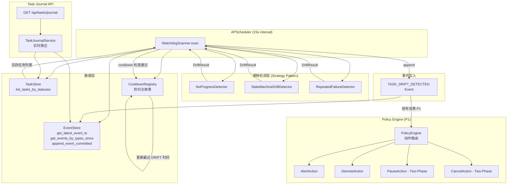

# Implementation Plan: Feature 011 — Watchdog + Task Journal + Drift Detector

**Branch**: `master` | **Date**: 2026-03-03 | **Spec**: `.specify/features/011-watchdog-task-journal/spec.md`
**Input**: `.specify/features/011-watchdog-task-journal/spec.md` (338 行) + `research/tech-research.md`

---

## Summary

Feature 011 构建 OctoAgent 的**任务运行治理层**，解决长任务（LLM 调用链、Skill Pipeline、外部工具执行）在运行过程中发生卡死与漂移失控的两类核心问题。

**技术方案**：APScheduler 定时扫描（15s 间隔）+ EventStore 持久化感知的三种漂移检测算法（Strategy 模式可插拔）+ Task Journal 实时聚合视图 API。

**关键约束满足**：
- Watchdog 仅产生 `TASK_DRIFT_DETECTED` 信号事件，高风险动作（取消/暂停）由 Policy Engine 门控（Constitution 原则 4）
- 进程重启后扫描从 EventStore 重建检测基准，无盲窗（Constitution 原则 1）
- 所有检测动作和 DRIFT 事件全链路携带 `task_id` 和 `trace_id`（Constitution 原则 8）

**交付分层**：
- P0（阻塞 M1.5 验收）：EventStore/TaskStore 扩展 + 新事件类型 + WatchdogScanner + Task Journal API
- P1（验收后补充）：状态机漂移检测 + 重复失败检测 + Policy Engine 动作路由
- P2（可选增强）：Logfire span_id 填充（F012 接入时）+ 物化视图升级

---

## Technical Context

**Language/Version**: Python 3.12+
**Primary Dependencies**:
- `apscheduler>=3.10,<4.0`（新增，Watchdog 定时调度）
- `aiosqlite>=0.21`（已有，EventStore 查询扩展）
- `pydantic>=2.10`（已有，WatchdogConfig 强类型配置模型）
- `structlog>=25.1`（已有，扫描日志）
- `logfire>=3.0`（已有，OTel trace 预留字段）

**Storage**:
- SQLite WAL（已有）— EventStore append-only 事件表 + 新增 `idx_events_type_ts` 索引
- 无新建持久化表（Task Journal 采用实时聚合，不建 `task_journal` 物化表）

**Testing**:
- `pytest-asyncio`（已有）— 单元测试 + 集成测试
- in-memory SQLite — E2E 漂移模拟（时间注入）

**Target Platform**: macOS 本地 / Linux 单机，FastAPI + Uvicorn

**Performance Goals**:
- Task Journal API 响应时间 < 2 秒（活跃任务 <= 200 时，SC-007）
- Watchdog 扫描耗时 < 100ms（含 `idx_events_type_ts` 索引优化）
- 漂移检测延迟 <= 1 个扫描周期（15s，SC-001）

**Constraints**:
- 锁定 `apscheduler<4.0`，避免 4.x API 不兼容风险
- WatchdogScanner 绝不直接调用 task cancel/pause（Constitution 原则 4 硬约束）
- 漂移检测必须使用内部完整 `TaskStatus` 枚举（Constitution 原则 14）

**Scale/Scope**: MVP 单用户，活跃任务 <= 200，可无缝升级至物化视图

---

## Constitution Check

| Constitution 原则 | 适用性 | 评估 | 说明 |
|-----------------|--------|------|------|
| 原则 1: Durability First | 直接适用 | PASS | Watchdog 事件写入 EventStore（append-only）；cooldown 状态从 EventStore 重建；进程重启后扫描无盲窗（FR-004, FR-006） |
| 原则 2: Everything is an Event | 直接适用 | PASS | 新增三种 EventType（TASK_HEARTBEAT / TASK_MILESTONE / TASK_DRIFT_DETECTED）；所有检测动作均产生持久化事件记录（FR-001 ~ FR-003） |
| 原则 3: Tools are Contracts | 间接适用 | PASS | 新增 EventStore/TaskStore 接口同步更新 Protocol 定义（单一事实源）；WatchdogConfig 有强类型 Pydantic 约束 |
| 原则 4: Side-effect Must be Two-Phase | 直接适用 | PASS | WatchdogScanner 只写 DRIFT 信号事件，不直接执行取消/暂停。pause/cancel 须经 Policy Engine Plan -> Gate -> Execute（FR-005, FR-023） |
| 原则 5: Least Privilege by Default | 间接适用 | PASS | WatchdogScanner 仅有 EventStore append（写 DRIFT 事件）+ read 权限，不持有任何高风险操作权限 |
| 原则 6: Degrade Gracefully | 直接适用 | PASS | 扫描失败（SQLite BUSY）记录 log.warning 并跳过本次，等待下一周期重试；扫描失败不影响主任务执行（FR-007） |
| 原则 7: User-in-Control | 直接适用 | PASS | 阈值可通过 `WATCHDOG_{KEY}` 环境变量配置（FR-018）；高风险动作须 Policy 门控或用户确认（FR-023） |
| 原则 8: Observability is a Feature | 直接适用 | PASS | 每次扫描产生结构化日志（FR-008）；DRIFT 事件携带 task_id + trace_id（FR-019, FR-020）；预留 watchdog_span_id 字段（FR-021） |
| 原则 11: 上下文卫生 | 直接适用 | PASS | DRIFT 事件 payload 只含摘要字段；详细诊断通过 artifact_ref 引用（FR-002, FR-016） |
| 原则 14: A2A 兼容 | 直接适用 | PASS | 漂移检测使用内部完整 TaskStatus 枚举（9 个状态），禁止降级为 A2A active/pending 二元划分（FR-011） |

**Constitution Check 结论**: **全部 PASS，无 VIOLATION。** 技术计划可进入 Phase 1 设计。

---

## Project Structure

### 文档制品（本特性）

```text
.specify/features/011-watchdog-task-journal/
├── spec.md              # 需求规范（338 行）
├── plan.md              # 本文件（技术规划）
├── research.md          # 技术决策记录（9 个决策）
├── data-model.md        # 数据模型（枚举/Payload/Config/Registry）
├── contracts/
│   └── rest-api.md      # GET /api/tasks/journal API 契约
├── research/
│   └── tech-research.md # 原始技术调研报告
├── checklists/          # 验收检查清单（待 tasks 阶段生成）
└── verification/        # 验收报告（待 F013 阶段生成）
```

### 源码变更布局

```text
# 新建模块
octoagent/apps/gateway/src/octoagent/gateway/services/watchdog/
├── __init__.py
├── config.py            # WatchdogConfig Pydantic BaseModel
├── cooldown.py          # CooldownRegistry（防抖注册表，跨重启持久化）
├── models.py            # DriftResult、TaskJournalEntry、DriftSummary
├── scanner.py           # WatchdogScanner（APScheduler job 主体）
└── detectors.py         # DriftDetectionStrategy Protocol + 3 种检测器

octoagent/apps/gateway/src/octoagent/gateway/services/
└── task_journal.py      # TaskJournalService（实时聚合查询）

octoagent/apps/gateway/src/octoagent/gateway/routes/
└── watchdog.py          # GET /api/tasks/journal FastAPI 路由

# 修改模块（扩展，不破坏现有接口）
octoagent/packages/core/src/octoagent/core/models/
├── enums.py             # 追加 3 个 EventType 值
└── payloads.py          # 追加 3 个 Payload 类型

octoagent/packages/core/src/octoagent/core/store/
├── event_store.py       # 追加 2 个查询方法
├── task_store.py        # 追加 list_tasks_by_statuses 方法
└── sqlite_init.py       # 追加 idx_events_type_ts 索引

octoagent/apps/gateway/src/octoagent/gateway/
└── main.py              # lifespan 中注册 WatchdogScanner job

# 测试文件
octoagent/apps/gateway/tests/
├── unit/watchdog/
│   ├── test_config.py           # WatchdogConfig 验证 + env 加载
│   ├── test_cooldown.py         # CooldownRegistry 重建与防抖
│   ├── test_no_progress.py      # NoProgressDetector 检测逻辑
│   ├── test_state_drift.py      # StateMachineDriftDetector
│   └── test_repeated_failure.py # RepeatedFailureDetector
├── integration/watchdog/
│   └── test_scanner.py          # WatchdogScanner 全链路集成
└── e2e/
    └── test_watchdog_e2e.py     # E2E 三场景：卡死/循环/漂移（F011-T06）

octoagent/packages/core/tests/
└── unit/store/
    ├── test_event_store_extensions.py  # 新增接口单元测试
    └── test_task_store_extensions.py   # list_tasks_by_statuses 测试
```

**Structure Decision**: 单体 monorepo（已有结构），新增代码遵循现有 `gateway/services/` 和 `core/` 分包约定。Watchdog 模块作为独立子包（`watchdog/`）放在 `gateway/services/` 下，保持职责清晰。

---

## Architecture

### 系统架构图



### 核心模块设计

#### WatchdogScanner（核心扫描器）

```python
class WatchdogScanner:
    """Watchdog 核心扫描器，APScheduler job 主体（FR-004, FR-007, FR-008）

    职责：
    1. 从 TaskStore 获取活跃任务列表
    2. 对每个任务运行注册的检测策略
    3. cooldown 防抖检查
    4. 向 EventStore 写入 TASK_DRIFT_DETECTED 事件
    5. 结构化日志记录扫描元数据
    """

    def __init__(
        self,
        store_group: StoreGroup,
        config: WatchdogConfig,
        cooldown_registry: CooldownRegistry,
        detectors: list[DriftDetectionStrategy],
    ) -> None: ...

    async def startup(self) -> None:
        """进程启动：重建 cooldown 注册表（FR-006 跨重启一致性）"""

    async def scan(self) -> None:
        """单次扫描周期（APScheduler 每 scan_interval_seconds 调用）"""
        # 1. try/except 包裹全部逻辑，失败记录 warning 不抛出（FR-007）
        # 2. list_tasks_by_statuses(NON_TERMINAL_STATES)
        # 3. 遍历任务，跳过终态
        # 4. 对每个任务运行 detectors
        # 5. cooldown 检查
        # 6. append_event_committed(DRIFT 事件)
        # 7. structlog 记录扫描元数据（FR-008）

    async def _emit_drift_event(
        self, task_id: str, trace_id: str, result: DriftResult
    ) -> None:
        """写入 TASK_DRIFT_DETECTED 事件（FR-002, FR-019）"""
```

#### DriftDetectionStrategy Protocol（可插拔检测接口）

```python
from typing import Protocol

class DriftDetectionStrategy(Protocol):
    """漂移检测策略协议（Strategy 模式）"""

    async def check(
        self,
        task: Task,
        event_store: SqliteEventStore,
        config: WatchdogConfig,
    ) -> DriftResult | None:
        """检测任务是否存在漂移，返回 DriftResult 或 None（无漂移）"""
        ...
```

#### NoProgressDetector（无进展检测，P0 核心）

```python
# 关键逻辑（FR-009, FR-010）
PROGRESS_EVENT_TYPES = {
    EventType.MODEL_CALL_STARTED,
    EventType.MODEL_CALL_COMPLETED,
    EventType.TOOL_CALL_STARTED,
    EventType.TOOL_CALL_COMPLETED,
    EventType.TASK_HEARTBEAT,
    EventType.TASK_MILESTONE,
    EventType.CHECKPOINT_SAVED,
}

async def check(self, task, event_store, config) -> DriftResult | None:
    threshold = config.no_progress_threshold_seconds
    since_ts = datetime.now(UTC) - timedelta(seconds=threshold)

    # 查询时间窗口内的进展事件
    events = await event_store.get_events_by_types_since(
        task_id=task.task_id,
        event_types=list(PROGRESS_EVENT_TYPES),
        since_ts=since_ts,
    )

    if events:
        return None  # 有进展，无漂移

    # LLM 等待期豁免（FR-010）：
    # 若最近事件是 MODEL_CALL_STARTED，且在阈值内，则排除
    latest_ts = await event_store.get_latest_event_ts(task.task_id)
    if latest_ts is None:
        # 使用 task.updated_at 作为时间参照（边界情况 4）
        latest_ts = task.updated_at

    # 检查是否在 LLM 等待期
    model_started_events = await event_store.get_events_by_types_since(
        task_id=task.task_id,
        event_types=[EventType.MODEL_CALL_STARTED],
        since_ts=since_ts,
    )
    if model_started_events:
        # MODEL_CALL_STARTED 在窗口内，豁免本次检测
        return None

    stall_duration = (datetime.now(UTC) - latest_ts).total_seconds()
    return DriftResult(
        task_id=task.task_id,
        drift_type="no_progress",
        detected_at=datetime.now(UTC),
        stall_duration_seconds=stall_duration,
        last_progress_ts=latest_ts,
        suggested_actions=["check_worker_logs", "cancel_task_if_confirmed"],
    )
```

#### TaskJournalService（实时聚合）

```python
class TaskJournalService:
    """Task Journal 实时聚合查询服务（FR-014, FR-015, FR-016）"""

    NON_TERMINAL_STATUSES = [
        TaskStatus.CREATED,
        TaskStatus.RUNNING,
        TaskStatus.QUEUED,
        TaskStatus.WAITING_INPUT,
        TaskStatus.WAITING_APPROVAL,
        TaskStatus.PAUSED,
    ]

    async def get_journal(self, config: WatchdogConfig) -> JournalResponse:
        """生成 Task Journal 视图（实时聚合）"""
        # 1. list_tasks_by_statuses(NON_TERMINAL_STATUSES)
        # 2. 对每个任务：
        #    a. get_latest_event_ts -> last_event_ts
        #    b. get_events_by_types_since(DRIFT_DETECTED) -> 是否已漂移
        #    c. 按优先级判断 journal_state
        #       **分组规则权威来源**：`contracts/rest-api.md § Task Journal 分组分类规则`。
        #       实现者必须以该规则为准，不得自行发明分组逻辑。
        # 3. 聚合为 JournalResponse
```

### APScheduler 集成（main.py lifespan）

```python
# 在 lifespan() 中追加（现有 task_runner.startup() 之后）
from apscheduler.schedulers.asyncio import AsyncIOScheduler
from .services.watchdog.config import WatchdogConfig
from .services.watchdog.scanner import WatchdogScanner
from .services.watchdog.cooldown import CooldownRegistry

watchdog_config = WatchdogConfig.from_env()
cooldown_registry = CooldownRegistry()
watchdog_scanner = WatchdogScanner(
    store_group=store_group,
    config=watchdog_config,
    cooldown_registry=cooldown_registry,
    detectors=[
        NoProgressDetector(),
        # P1 阶段追加:
        # StateMachineDriftDetector(),
        # RepeatedFailureDetector(),
    ],
)
await watchdog_scanner.startup()  # 重建 cooldown 注册表

scheduler = AsyncIOScheduler()
scheduler.add_job(
    watchdog_scanner.scan,
    trigger="interval",
    seconds=watchdog_config.scan_interval_seconds,
    id="watchdog_scan",
    misfire_grace_time=5,  # 允许最多 5 秒的执行延迟
)
scheduler.start()
app.state.watchdog_scheduler = scheduler
app.state.watchdog_scanner = watchdog_scanner

# shutdown 时追加
scheduler.shutdown(wait=False)
```

---

## Implementation Phases（交付路线图）

### P0: 核心能力（阻塞 M1.5 验收）

**目标**: 无进展检测闭环，Task Journal API 可用

| 任务 | 文件 | 对应 FR |
|------|------|---------|
| 追加 3 个 EventType 枚举值 | `core/models/enums.py` | FR-001 |
| 追加 3 个 Payload 类型 | `core/models/payloads.py` | FR-002, FR-003 |
| 追加 `idx_events_type_ts` 索引 | `core/store/sqlite_init.py` | 性能保障 |
| 实现 `get_latest_event_ts` | `core/store/event_store.py` | FR-009 |
| 实现 `get_events_by_types_since` | `core/store/event_store.py` | FR-009 |
| 实现 `list_tasks_by_statuses` | `core/store/task_store.py` | spec WARNING 3 |
| 实现 `WatchdogConfig` | `gateway/services/watchdog/config.py` | FR-017, FR-018 |
| 实现 `CooldownRegistry` | `gateway/services/watchdog/cooldown.py` | FR-006 |
| 实现 `DriftResult` / `TaskJournalEntry` | `gateway/services/watchdog/models.py` | spec Key Entities |
| 实现 `NoProgressDetector` | `gateway/services/watchdog/detectors.py` | FR-009, FR-010 |
| 实现 `WatchdogScanner` | `gateway/services/watchdog/scanner.py` | FR-004 ~ FR-008 |
| lifespan 注册 APScheduler job | `gateway/main.py` | FR-004 |
| 实现 `TaskJournalService` | `gateway/services/task_journal.py` | FR-014, FR-015 |
| 实现 `GET /api/tasks/journal` 路由 | `gateway/routes/watchdog.py` | FR-014 |
| 注册 watchdog 路由 | `gateway/routes/__init__.py` + `main.py` | — |
| P0 单元测试 + 集成测试 | `tests/unit/watchdog/` + `tests/integration/watchdog/` | F011-T06 |

**验收门禁（GATE-M15-WATCHDOG）**:
- `NoProgressDetector` 在 45s 无进展后写入 `TASK_DRIFT_DETECTED` 事件（SC-001）
- Task Journal API 返回正确四分组，无 Constitution 14 降级（FR-011）
- 事件携带 `task_id` + `trace_id`，满足 F013 全链路可观测性要求（SC-008）
- cooldown 防抖在进程重启后从 EventStore 重建（SC-006）

### P1: 完整性（验收后补充）

| 任务 | 文件 | 对应 FR |
|------|------|---------|
| 实现 `StateMachineDriftDetector` | `gateway/services/watchdog/detectors.py` | FR-011 |
| 实现 `RepeatedFailureDetector` | `gateway/services/watchdog/detectors.py` | FR-012 |
| 在 WatchdogScanner 中注册 P1 检测器 | `gateway/services/watchdog/scanner.py` | — |
| Policy Engine 消费 DRIFT 事件（动作路由） | `policy/policy_engine.py`（待扩展） | FR-022 ~ FR-024 |
| E2E 三场景测试（卡死/循环/漂移） | `tests/e2e/test_watchdog_e2e.py` | F011-T06 |

### P2: 增强（可选）

| 任务 | 文件 | 依赖 |
|------|------|------|
| F012 接入后填充 `watchdog_span_id` | `gateway/services/watchdog/scanner.py` | Feature 012 |
| 活跃任务 > 200 时迁移物化视图 | `core/store/sqlite_init.py` + 新建 `task_journal` 表 | 规模触发 |
| 事件频率统计检测器 | `gateway/services/watchdog/detectors.py` | M2 历史数据积累 |

---

## 技术风险与缓解措施

| 风险 | 概率 | 影响 | 缓解策略 |
|------|------|------|---------|
| SQLite WAL 并发竞争：Watchdog 与 Worker 同时写 EventStore 触发 SQLITE_BUSY | 中 | 中 | 已配置 `busy_timeout=5000ms`；`append_event_committed` 已有任务级 Lock；FR-007 要求扫描失败降级不抛出 |
| LLM 等待期误报：45s 阈值对单次 LLM 调用可能误报 | 高 | 中 | NoProgressDetector 显式排除 MODEL_CALL_STARTED 后的等待期（FR-010）；复用 `no_progress_threshold` 作为豁免窗口 |
| Watchdog 成为瓶颈：任务量增大时扫描触发大量 DB 查询 | 低（MVP） | 低 | 新增 `idx_events_type_ts` 索引；分批处理（chunk_size=50）；监控 scan 耗时日志 |
| Policy Engine P1 未实现：DRIFT 事件无消费者 | 高（MVP） | 中 | P0 先行："写事件 + 结构化日志告警"作为最小可行；Policy 动作路由为 P1 独立 PR |
| APScheduler 与 asyncio event loop 的兼容性 | 低 | 中 | 锁定 `apscheduler<4.0`；`AsyncIOScheduler` 与 FastAPI 共享 event loop，已有社区验证 |
| 漂移误报导致误动作 | 中 | 高 | Watchdog 只写 DRIFT 信号，取消须用户/Policy 确认（Constitution 4, 7）；cooldown=60s 防抖；P0 阶段 Policy 动作路由未实装，DRIFT 事件暂无自动动作 |

---

## Complexity Tracking

Feature 011 的技术计划通过了全部 Constitution Check，无 VIOLATION，无需豁免论证。

以下记录偏离最简实现的决策（均有充分理由）：

| 偏离项 | 选择 | 更简单替代 | 为何拒绝 |
|--------|------|-----------|---------|
| APScheduler job 而非纯 `asyncio.sleep` 循环 | APScheduler | `while True: await asyncio.sleep(N)` | APScheduler 提供 job store + misfire_grace_time，进程重启后注册状态更清晰；sleep 循环出异常后重启逻辑需要自己实现 |
| Strategy 模式可插拔检测器 | Protocol + 3 实现类 | 单一函数 + if-else | Strategy 支持 P1 检测器插入不改 scanner 主体；后续 M2 新增事件频率检测器时零改动核心逻辑 |
| CooldownRegistry 跨重启持久化 | EventStore 重建 | 进程内纯内存 dict | Constitution 原则 1 硬要求；进程内 dict 在进程重启后失效会产生连续告警轰炸（边界情况 6）|
| `list_tasks_by_statuses` 原子查询 | 单次 `IN (?)` SQL | 多次 `list_tasks(status)` 串行调用 | spec 明确在 WARNING 3 中禁止串行调用（竞态窗口）；单次查询性能更优 |
