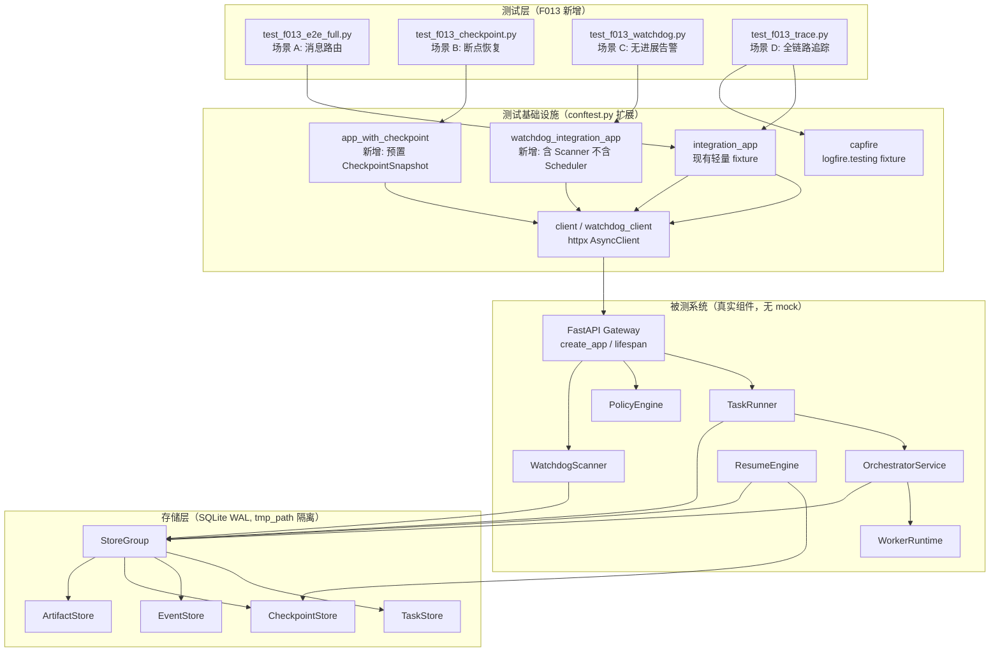
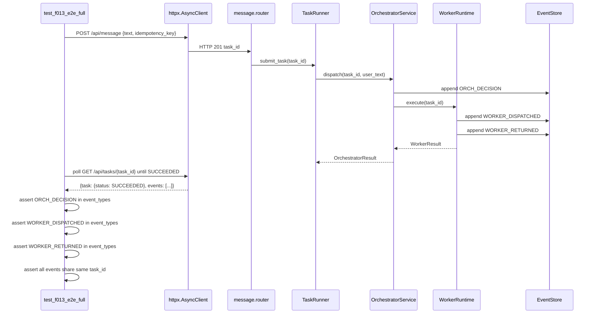
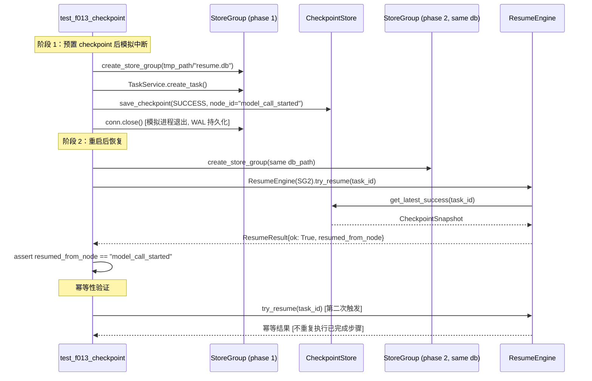
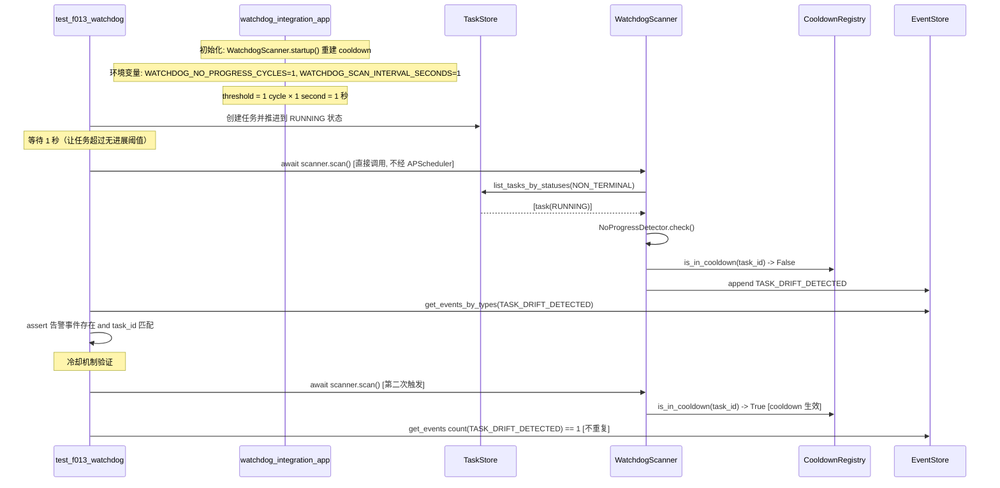

# Implementation Plan: Feature 013 — M1.5 E2E 集成验收

**Branch**: `feat/013-m1.5-e2e-integration-acceptance`
**Date**: 2026-03-04
**Spec**: `.specify/features/013-m1.5-e2e-integration-acceptance/spec.md`
**Research**: `.specify/features/013-m1.5-e2e-integration-acceptance/research.md`

---

## Summary

Feature 013 是 M1.5 的串行集成验收阶段，目标是将 Feature 008~012 的所有组件接入统一的真实依赖链路，新增四条端到端验收场景（消息路由闭环、断点恢复、无进展告警、全链路追踪），执行 Feature 002~007 全量回归，并产出结构化的 M1.5 验收报告为 M2 提供准入基线。

**技术路径**：扩展现有 `tests/integration/` 测试基础设施，新增 4 个测试文件，复用 `httpx.ASGITransport + asyncio_mode=auto` 模式；为 Watchdog 场景新增独立 fixture；使用 `logfire.testing.capfire` 进行追踪断言；以 `conn.close()` + 新建 `StoreGroup` 模拟进程重启。不引入任何新业务能力（FR-013 范围锁定）。

---

## Technical Context

**Language/Version**: Python 3.12+
**Primary Dependencies**:
- `pytest-asyncio>=0.24`（asyncio_mode=auto，已配置）
- `httpx>=0.27`（ASGITransport，已在依赖中）
- `logfire>=3.0`（logfire.testing.capfire，已确认可用）
- `apscheduler>=3.10,<4.0`（WatchdogScanner，不在测试中启动调度器）
- `pytest-cov>=6.0`（覆盖率统计）
- `aiosqlite>=0.21`（SQLite WAL + tmp_path 隔离）

**Storage**: SQLite WAL（aiosqlite），测试中通过 `tmp_path` 提供每测试独立数据库实例

**Testing**:
- 框架：pytest + pytest-asyncio（asyncio_mode=auto）
- 集成测试驱动：httpx.AsyncClient + ASGITransport（in-process，无网络开销）
- 追踪断言：logfire.testing.capfire（in-memory span 捕获）
- 降级备选：opentelemetry.sdk.trace.export.InMemorySpanExporter

**Target Platform**: 本地开发机（Mac）+ CI 服务器，不依赖 Docker daemon

**Performance Goals**:
- 单条 E2E 场景测试完成时间 < 5 秒
- 全量回归套件（含 F013 新增测试）完成时间 < 120 秒

**Constraints**:
- FR-013：不引入任何新业务能力或架构组件
- GATE-M15-CONTRACT：Feature 008 路由协议已版本化（已满足）
- GATE-M15-RECOVERY：Feature 010 幂等恢复测试已通过（已满足）
- GATE-M15-WATCHDOG：Feature 011/012 无默认阈值且链路可复盘（已满足）

**Scale/Scope**: 新增 4 个集成测试文件，约 150~200 行测试代码；1 份 M1.5 验收报告

---

## Constitution Check

| 原则 | 适用性 | 评估 | 说明 |
|------|--------|------|------|
| 原则 1：Durability First | 高 | **PASS** | 场景 B（断点恢复）通过 `conn.close()` + 新建 `StoreGroup` 验证 SQLite WAL 持久化；`CheckpointStore.get_latest_success()` 已实现 |
| 原则 2：Everything is an Event | 高 | **PASS** | 场景 A 断言 EventStore 中 `ORCH_DECISION`、`WORKER_DISPATCHED`、`WORKER_RETURNED` 事件；场景 C 断言 `TASK_DRIFT_DETECTED` 事件写入 |
| 原则 3：Tools are Contracts | 低 | **PASS** | F013 不引入新工具，仅断言已有接口行为 |
| 原则 4：Side-effect Must be Two-Phase | 中 | **PASS** | 场景 A 使用 LOW risk 任务（echo 模式），绕过 Gate；Gate 决策路径通过 Feature 006 单元测试覆盖 |
| 原则 5：Least Privilege by Default | 低 | **PASS** | 测试环境不配置真实 secrets，echo 模式不调用外部 LLM |
| 原则 6：Degrade Gracefully | 高 | **PASS** | 场景 D 验证 `LOGFIRE_SEND_TO_LOGFIRE=false` 时主流程不受影响；FR-012 提供 capfire 不可用时的降级方案 |
| 原则 7：User-in-Control | 低 | **PASS** | F013 不修改审批/取消流程，范围锁定 |
| 原则 8：Observability is a Feature | 高 | **PASS** | 场景 D 直接验证此约束：三层（接收层、路由决策层、Worker 执行层）追踪记录通过 task_id 串联 |

**Constitution Check 结论**：全部通过，无 VIOLATION，无需豁免论证。

---

## Project Structure

### 文档制品（本 Feature）

```text
.specify/features/013-m1.5-e2e-integration-acceptance/
├── spec.md                    # 需求规范（已存在）
├── plan.md                    # 本文件
├── research.md                # 技术决策记录
├── data-model.md              # 测试数据模型（无新增实体，说明文档）
├── quickstart.md              # 快速上手指南
├── research/
│   └── tech-research.md       # 技术调研报告（已存在）
├── checklists/
│   └── requirements.md        # 需求检查清单（已存在）
├── contracts/                 # 无新增 API 契约（F013 范围锁定）
└── verification/              # M1.5 验收报告（编码实现后填写）
    └── m1.5-acceptance-report.md
```

### 测试代码（仓库根路径）

```text
octoagent/tests/integration/
├── conftest.py                   # 现有 fixture（扩展）
│   # 新增 fixture:
│   #   - app_with_checkpoint: 预置 CheckpointSnapshot 的集成 app
│   #   - watchdog_integration_app: 含 WatchdogScanner 但不含 APScheduler 调度
│   #   - watchdog_client: 基于 watchdog_integration_app 的 httpx 客户端
├── test_f013_e2e_full.py         # 新增: 场景 A — 消息路由全链路
├── test_f013_checkpoint.py       # 新增: 场景 B — 断点恢复
├── test_f013_watchdog.py         # 新增: 场景 C — 无进展告警
├── test_f013_trace.py            # 新增: 场景 D — 全链路追踪
└── (已存在文件，不修改)
    ├── test_f008_orchestrator_flow.py
    ├── test_f009_worker_runtime_flow.py
    ├── test_f010_checkpoint_resume.py
    ├── test_sc1_e2e.py
    ├── test_sc2_durability.py
    └── ...
```

**Structure Decision**: 单一 Python 项目，扩展现有 `tests/integration/` 目录。不新建顶层目录，不修改现有测试文件（FR-013 范围锁定）。

---

## Architecture

### 系统组件关系



### 场景 A（消息路由全链路）执行流程



### 场景 B（断点恢复）两阶段模拟



### 场景 C（无进展告警）直接触发模式



---

## 实现规范

### conftest.py 扩展规范

```python
# tests/integration/conftest.py 新增 fixture（保留现有内容）

@pytest_asyncio.fixture
async def app_with_checkpoint(tmp_path: Path):
    """预置 CheckpointSnapshot 的集成 app，供场景 B 使用。"""
    os.environ["OCTOAGENT_DB_PATH"] = str(tmp_path / "test_cp.db")
    os.environ["OCTOAGENT_ARTIFACTS_DIR"] = str(tmp_path / "artifacts_cp")
    os.environ["LOGFIRE_SEND_TO_LOGFIRE"] = "false"

    from octoagent.gateway.main import create_app
    app = create_app()

    store_group = await create_store_group(
        str(tmp_path / "test_cp.db"),
        str(tmp_path / "artifacts_cp"),
    )
    app.state.store_group = store_group
    app.state.sse_hub = SSEHub()
    app.state.llm_service = LLMService()
    # 暴露 tmp_path 供场景 B 两阶段测试访问同一 db_path
    app.state.db_path = str(tmp_path / "test_cp.db")
    app.state.artifacts_dir = str(tmp_path / "artifacts_cp")

    yield app

    await store_group.conn.close()
    for key in ("OCTOAGENT_DB_PATH", "OCTOAGENT_ARTIFACTS_DIR", "LOGFIRE_SEND_TO_LOGFIRE"):
        os.environ.pop(key, None)


@pytest_asyncio.fixture
async def watchdog_integration_app(tmp_path: Path):
    """含 WatchdogScanner 但不启动 APScheduler 的集成 app，供场景 C 使用。

    环境变量覆盖：WATCHDOG_NO_PROGRESS_CYCLES=1, WATCHDOG_SCAN_INTERVAL_SECONDS=1
    使 no_progress_threshold_seconds = 1 秒，无需冻结时钟。
    """
    os.environ["OCTOAGENT_DB_PATH"] = str(tmp_path / "test_wd.db")
    os.environ["OCTOAGENT_ARTIFACTS_DIR"] = str(tmp_path / "artifacts_wd")
    os.environ["LOGFIRE_SEND_TO_LOGFIRE"] = "false"
    # 覆盖 watchdog 阈值为最小值
    os.environ["WATCHDOG_NO_PROGRESS_CYCLES"] = "1"
    os.environ["WATCHDOG_SCAN_INTERVAL_SECONDS"] = "1"
    os.environ["WATCHDOG_COOLDOWN_SECONDS"] = "30"  # 保留合理冷却窗口

    from octoagent.gateway.main import create_app
    from octoagent.gateway.services.watchdog.config import WatchdogConfig
    from octoagent.gateway.services.watchdog.cooldown import CooldownRegistry
    from octoagent.gateway.services.watchdog.detectors import NoProgressDetector
    from octoagent.gateway.services.watchdog.scanner import WatchdogScanner

    app = create_app()
    store_group = await create_store_group(
        str(tmp_path / "test_wd.db"),
        str(tmp_path / "artifacts_wd"),
    )
    app.state.store_group = store_group
    app.state.sse_hub = SSEHub()
    app.state.llm_service = LLMService()

    # 初始化 WatchdogScanner（不启动 APScheduler）
    watchdog_config = WatchdogConfig.from_env()
    cooldown_registry = CooldownRegistry()
    watchdog_scanner = WatchdogScanner(
        store_group=store_group,
        config=watchdog_config,
        cooldown_registry=cooldown_registry,
        detectors=[NoProgressDetector()],
    )
    await watchdog_scanner.startup()  # 重建 cooldown 注册表
    app.state.watchdog_scanner = watchdog_scanner
    app.state.watchdog_cooldown_registry = cooldown_registry

    yield app

    # teardown: 清理 cooldown 状态，避免跨测试污染
    cooldown_registry._last_drift_ts.clear()
    await store_group.conn.close()
    for key in (
        "OCTOAGENT_DB_PATH", "OCTOAGENT_ARTIFACTS_DIR", "LOGFIRE_SEND_TO_LOGFIRE",
        "WATCHDOG_NO_PROGRESS_CYCLES", "WATCHDOG_SCAN_INTERVAL_SECONDS", "WATCHDOG_COOLDOWN_SECONDS",
    ):
        os.environ.pop(key, None)


@pytest_asyncio.fixture
async def watchdog_client(watchdog_integration_app) -> AsyncGenerator[AsyncClient, None]:
    async with AsyncClient(
        transport=ASGITransport(app=watchdog_integration_app),
        base_url="http://test",
    ) as ac:
        yield ac
```

### 轮询等待工具函数

```python
# tests/integration/conftest.py 或共享 utils

import asyncio
from collections.abc import Awaitable, Callable

async def poll_until(
    condition: Callable[[], Awaitable[bool]],
    timeout_s: float = 5.0,
    interval_s: float = 0.05,
) -> None:
    """轮询等待 condition 为 True，超时则 raise TimeoutError。

    替代 asyncio.sleep() 固定等待，提升 CI 时序稳定性。
    """
    deadline = asyncio.get_event_loop().time() + timeout_s
    while True:
        if await condition():
            return
        if asyncio.get_event_loop().time() >= deadline:
            raise TimeoutError(f"poll_until 超时（{timeout_s}s）")
        await asyncio.sleep(interval_s)
```

### 场景 A 测试规范（test_f013_e2e_full.py）

```python
class TestF013ScenarioA:
    """场景 A: 消息路由全链路验收（SC-001）"""

    async def test_message_routing_full_chain(self, client: AsyncClient, integration_app) -> None:
        """FR-002: 提交消息后，系统完整处理并以 SUCCEEDED 结束，三类 Orchestrator 事件均写入 EventStore。"""
        resp = await client.post(
            "/api/message",
            json={"text": "f013 e2e full chain", "idempotency_key": "f013-sc-a-001"},
        )
        assert resp.status_code == 201
        task_id = resp.json()["task_id"]

        # 使用轮询等待替代 sleep
        store_group = integration_app.state.store_group
        async def task_succeeded():
            task = await store_group.task_store.get_task(task_id)
            return task is not None and task.status == "SUCCEEDED"
        await poll_until(task_succeeded, timeout_s=5.0)

        detail = await client.get(f"/api/tasks/{task_id}")
        assert detail.status_code == 200
        data = detail.json()
        assert data["task"]["status"] == "SUCCEEDED"

        event_types = {e["type"] for e in data["events"]}
        # 断言 Orchestrator 三类系统事件（来自 Feature 008）
        assert "ORCH_DECISION" in event_types
        assert "WORKER_DISPATCHED" in event_types
        assert "WORKER_RETURNED" in event_types

        # 断言所有事件关联同一 task_id
        for event in data["events"]:
            assert event["task_id"] == task_id

    async def test_task_result_non_empty(self, client: AsyncClient, integration_app) -> None:
        """FR-002 场景 2: 执行结果非空，与实际执行产物一致。"""
        resp = await client.post(
            "/api/message",
            json={"text": "f013 e2e result check", "idempotency_key": "f013-sc-a-002"},
        )
        assert resp.status_code == 201
        task_id = resp.json()["task_id"]

        store_group = integration_app.state.store_group
        async def task_succeeded():
            task = await store_group.task_store.get_task(task_id)
            return task is not None and task.status == "SUCCEEDED"
        await poll_until(task_succeeded, timeout_s=5.0)

        artifacts = await store_group.artifact_store.list_artifacts_for_task(task_id)
        assert len(artifacts) >= 1  # 至少一个产物（echo 内容）
```

### 场景 B 测试规范（test_f013_checkpoint.py）

```python
class TestF013ScenarioB:
    """场景 B: 系统中断后断点恢复验收（SC-002）"""

    async def test_resume_from_checkpoint_after_restart(self, tmp_path: Path) -> None:
        """FR-003: 模拟中断后从 checkpoint 恢复，已完成步骤不重复执行。"""
        from octoagent.gateway.services.resume_engine import ResumeEngine

        db_path = str(tmp_path / "resume_test.db")
        artifacts_dir = str(tmp_path / "artifacts_resume")

        # 阶段 1: 创建任务，写入 SUCCESS checkpoint，模拟中断
        sg1 = await create_store_group(db_path, artifacts_dir)
        service = TaskService(sg1, SSEHub())
        msg = NormalizedMessage(text="f013 resume", idempotency_key="f013-sc-b-001")
        task_id, _ = await service.create_task(msg)
        await service._write_state_transition(task_id, TaskStatus.CREATED, TaskStatus.RUNNING, f"trace-{task_id}")

        cp = CheckpointSnapshot(
            checkpoint_id=f"cp-{task_id}",
            task_id=task_id,
            node_id="model_call_started",
            status=CheckpointStatus.SUCCESS,
            schema_version=1,
            state_snapshot={"next_node": "response_persisted"},
            created_at=datetime.now(UTC),
            updated_at=datetime.now(UTC),
        )
        await sg1.checkpoint_store.save_checkpoint(cp)
        await sg1.conn.commit()
        await sg1.conn.close()  # 模拟进程退出

        # 阶段 2: 重启后恢复
        sg2 = await create_store_group(db_path, artifacts_dir)
        re = ResumeEngine(sg2)
        result = await re.try_resume(task_id)

        assert result.ok is True
        assert result.resumed_from_node == "model_call_started"
        assert result.checkpoint_id == f"cp-{task_id}"

        await sg2.conn.close()

    async def test_resume_idempotency(self, tmp_path: Path) -> None:
        """FR-003 场景 2: 连续两次恢复结果幂等，不重复执行。"""
        # ... 两次 try_resume，断言结果一致，副作用不重复
```

### 场景 C 测试规范（test_f013_watchdog.py）

```python
class TestF013ScenarioC:
    """场景 C: 无进展任务告警验收（SC-003）"""

    async def test_watchdog_detects_stalled_task(
        self,
        watchdog_integration_app,
        watchdog_client: AsyncClient,
    ) -> None:
        """FR-004: 超过阈值无进展的任务触发 TASK_DRIFT_DETECTED 事件。"""
        sg = watchdog_integration_app.state.store_group
        service = TaskService(sg, watchdog_integration_app.state.sse_hub)
        msg = NormalizedMessage(text="f013 watchdog stalled", idempotency_key="f013-sc-c-001")
        task_id, _ = await service.create_task(msg)
        await service._write_state_transition(
            task_id, TaskStatus.CREATED, TaskStatus.RUNNING, f"trace-{task_id}"
        )

        # 等待超过 no_progress_threshold_seconds (1 秒)
        await asyncio.sleep(1.1)

        # 直接触发扫描（不依赖 APScheduler）
        scanner = watchdog_integration_app.state.watchdog_scanner
        await scanner.scan()

        # 断言 TASK_DRIFT_DETECTED 事件写入
        drift_events = await sg.event_store.get_events_by_types_since(
            task_id=task_id,
            event_types=[EventType.TASK_DRIFT_DETECTED],
            since_ts=datetime.now(UTC) - timedelta(seconds=10),
        )
        assert len(drift_events) >= 1
        assert drift_events[0].task_id == task_id

    async def test_watchdog_cooldown_prevents_duplicate_alerts(
        self,
        watchdog_integration_app,
    ) -> None:
        """FR-004 场景 2: cooldown 期内重复触发不产生重复告警。"""
        # ... 第二次 scan 后断言 drift_events 数量仍为 1
```

### 场景 D 测试规范（test_f013_trace.py）

```python
class TestF013ScenarioD:
    """场景 D: 全链路追踪贯通验收（SC-004）"""

    async def test_full_trace_spans_across_all_layers(
        self,
        client: AsyncClient,
        integration_app,
        capfire,  # logfire.testing fixture，自动注入
    ) -> None:
        """FR-005: 消息接收、路由决策、Worker 执行三层均保留追踪记录，通过 task_id 串联。"""
        resp = await client.post(
            "/api/message",
            json={"text": "f013 trace test", "idempotency_key": "f013-sc-d-001"},
        )
        assert resp.status_code == 201
        task_id = resp.json()["task_id"]

        store_group = integration_app.state.store_group
        async def task_succeeded():
            task = await store_group.task_store.get_task(task_id)
            return task is not None and task.status == "SUCCEEDED"
        await poll_until(task_succeeded, timeout_s=5.0)

        # 断言 Logfire span 存在（in-memory 捕获，不依赖外部后端）
        exported_spans = capfire.exporter.exported_spans_as_dict()
        span_names = [s["name"] for s in exported_spans]
        # 至少有 span 覆盖处理链路（具体 span 名称由 Logfire 自动 instrument 生成）
        assert len(exported_spans) > 0

        # 断言三层事件通过 task_id 可完整串联
        detail = await client.get(f"/api/tasks/{task_id}")
        events = detail.json()["events"]
        event_task_ids = {e["task_id"] for e in events}
        assert event_task_ids == {task_id}  # 所有事件关联同一 task_id

    async def test_trace_unaffected_when_backend_unavailable(
        self,
        client: AsyncClient,
        integration_app,
    ) -> None:
        """FR-005 场景 3 / FR-012: LOGFIRE_SEND_TO_LOGFIRE=false 时主流程不受影响。"""
        # 现有 fixture 已设置 LOGFIRE_SEND_TO_LOGFIRE=false，直接验证主流程正常
        resp = await client.post(
            "/api/message",
            json={"text": "f013 trace degraded", "idempotency_key": "f013-sc-d-002"},
        )
        assert resp.status_code == 201
        task_id = resp.json()["task_id"]

        store_group = integration_app.state.store_group
        async def task_succeeded():
            task = await store_group.task_store.get_task(task_id)
            return task is not None and task.status == "SUCCEEDED"
        await poll_until(task_succeeded, timeout_s=5.0)
        # 主流程正常完成即验证降级不影响业务
```

---

## 验收报告产出规范

**文件路径**: `.specify/features/013-m1.5-e2e-integration-acceptance/verification/m1.5-acceptance-report.md`

**必须包含**：

1. 四条 M1.5 验收标准与测试场景的映射表（SC-001~SC-004 分别对应哪个测试函数、测试结果）
2. 测试执行摘要：总用例数、通过数、失败数、覆盖率百分比（来自 `pytest --cov` 输出）
3. 技术风险清单最终状态：每条风险的消除/遗留状态说明
4. M2 准入结论：明确声明 M1.5 验收通过/未通过

**生成时机**: 所有 F013 测试（4 个场景 + 全量回归）通过后，人工填写并提交。

---

## Complexity Tracking

> F013 不引入新业务能力，Constitution Check 全部通过，无 VIOLATION，本节无条目。

| 决策 | 说明 |
|------|------|
| 新增 `watchdog_integration_app` fixture | 唯一值得记录的"超出最简方案"处。技术调研确认现有 `integration_app` 不初始化 WatchdogScanner，若强行复用需手动装配，反而引入脆弱性；独立 fixture 隔离更干净，符合 Constitution 原则 8（可观测性测试完整） |

---

## 实施顺序建议

以下顺序平衡依赖关系与风险前置：

1. **Day 1: conftest.py 扩展 + capfire 可用性验证**
   - 新增三个 fixture（`app_with_checkpoint`、`watchdog_integration_app`、`watchdog_client`）
   - 添加 `poll_until` 工具函数
   - 编写一个最小化场景 D 测试，验证 `capfire` API 可用
   - 如不可用，立即切换 InMemorySpanExporter 降级方案

2. **Day 2: 场景 A（消息路由全链路）**
   - 最基础的验收场景，依赖最少
   - 确认 `ORCH_DECISION`、`WORKER_DISPATCHED`、`WORKER_RETURNED` 事件链完整

3. **Day 3: 场景 B（断点恢复）**
   - 依赖 `CheckpointStore.get_latest_success()`（已确认实现）
   - 注意 `ResumeEngine._resume_locks` 清理

4. **Day 4: 场景 C（无进展告警）+ 场景 D（全链路追踪）**
   - 两个场景相对独立，可并行编写

5. **Day 5: 全量回归 + 验收报告**
   - 执行 `uv run pytest octoagent/ --cov --cov-report=term-missing`
   - 填写 `verification/m1.5-acceptance-report.md`
