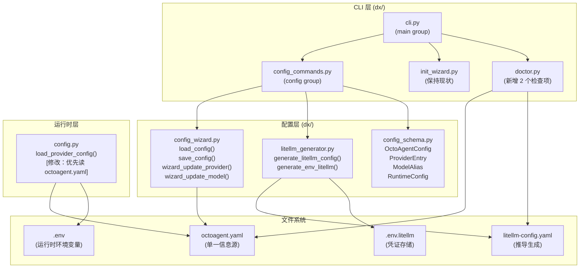
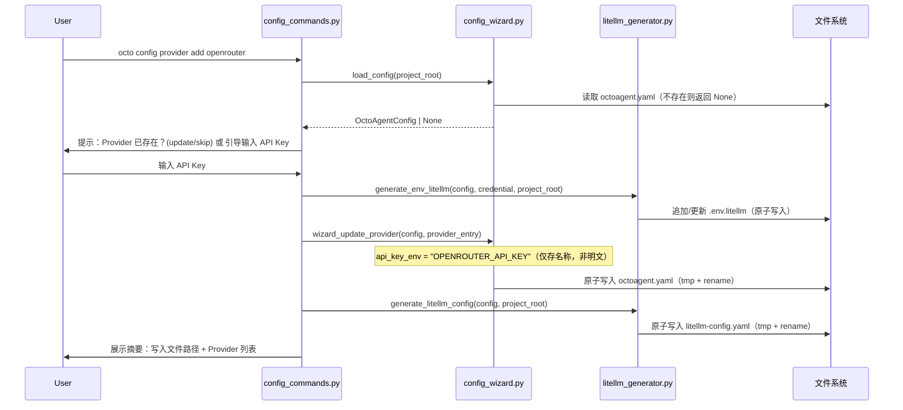
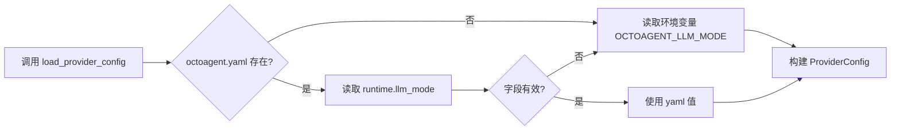

# Implementation Plan: Feature 014 — 统一模型配置管理 (Unified Model Config)

**Branch**: `feat/014-unified-model-config` | **Date**: 2026-03-04 | **Spec**: `spec.md`
**Input**: 将 OctoAgent 分散的三文件配置统一到 `octoagent.yaml`，并将 `octo init` 进化为增量式 `octo config` CLI。

---

## Summary

Feature 014 引入 `octoagent.yaml` 作为 OctoAgent 的**单一模型配置信息源**，替代当前用户需要手动维护的三文件体系（`.env` + `.env.litellm` + `litellm-config.yaml`）。核心技术路径：

1. 定义 Pydantic v2 数据模型（`OctoAgentConfig`）描述 `octoagent.yaml` 结构
2. 实现增量读写引擎（`config_wizard.py`），支持非破坏性更新
3. 实现配置推导引擎（`litellm_generator.py`），从 `octoagent.yaml` 自动生成 `litellm-config.yaml`
4. 在 Click CLI 注册新的 `config` 命令组（`config_commands.py`），与现有 `init`/`doctor` 并存
5. 更新 `ProviderConfig.load_provider_config()` 优先读取 `octoagent.yaml` 中的 `runtime` 块（Q3 决策）
6. `octo config provider add` 将 API Key 写入 `.env.litellm`，`octoagent.yaml` 仅存 env var 名称引用（Q2 决策）

---

## Technical Context

**Language/Version**: Python 3.12+
**Primary Dependencies**:
- `pydantic>=2.0`（数据模型与 schema 校验）
- `click`（CLI 框架，现有依赖）
- `rich`（终端格式化，现有依赖）
- `questionary`（交互式 prompt，现有依赖）
- `pyyaml`（YAML 解析/写入）
- `structlog`（结构化日志，现有依赖）

**Storage**:
- `octoagent.yaml`：项目根目录（`octoagent/`），纳入版本管理，不含凭证
- `.env.litellm`：项目根目录，不纳入版本管理，存储 API Key 明文
- `litellm-config.yaml`：项目根目录，由 `octoagent.yaml` 推导生成，可纳入版本管理

**Testing**: pytest（现有配置），`tmp_path` fixture 用于文件系统隔离

**Target Platform**: macOS + Linux（Docker 容器内）

**Project Type**: Python 包（`packages/provider`），CLI 工具

**Performance Goals**: `octo config sync` 本地文件操作 < 1 秒（NFR-001）

**Constraints**:
- `octoagent.yaml` 绝不存储明文凭证（Constitution C5，NFR-004）
- 原子写入防止配置损坏（NFR-003）
- 不破坏 `octo init` 和 `octo doctor`（NFR-005）
- schema 校验错误使用人类可读描述，含字段路径（NFR-002，Q7）

**Key Design Decisions**:

| 决策编号 | 问题 | 选择 | 理由 |
|---------|------|------|------|
| Q2 | 凭证落盘方式 | Option A：API Key 写 `.env.litellm`，`octoagent.yaml` 存 env var 名称引用 | 与现有 `octo init` 行为一致；凭证不进版本管理；符合 OpenClaw `$fromEnv` 模式 |
| Q3 | runtime 信息源 | Option B：`octoagent.yaml` runtime 块与 `.env` 独立，运行时优先读前者，降级读后者 | 向前兼容；`octoagent.yaml` 不存在时系统不崩溃（Constitution C6） |
| Q5 | migrate 命令 | SHOULD 级别（非 MVP 阻断项） | FR-012 / EC-6 均为 SHOULD，不阻塞核心验收 |
| Q6 | 交互模式 | 混合模式（CLI 参数优先，缺失时交互式补全） | 与 `octo init` 风格一致；支持脚本化调用 |
| Q8 | 自定义别名 | 允许（不限于内置 main/cheap） | Constitution C7（User-in-Control） |

---

## Constitution Check

| 原则 | 适用性 | 评估 | 说明 |
|------|--------|------|------|
| C1 Durability First | 低（配置文件非长任务） | COMPLIANT | `octoagent.yaml` 落盘即持久化，进程重启后配置不丢 |
| C2 Everything is an Event | 低（CLI 工具，非 Agent） | N/A | F014 为 DX 工具层，不涉及 Task/Event 系统 |
| C3 Tools are Contracts | 低 | N/A | 不新增 Agent 工具 |
| C4 Side-effect Must be Two-Phase | 中（写文件为不可逆操作） | COMPLIANT | `octo config provider add` 在写入前展示预览；原子写入防止中间态；`config init` 已有配置时要求显式确认（FR-011） |
| C5 Least Privilege by Default | **高** | COMPLIANT | `octoagent.yaml` 只存 env var 名称（`api_key_env`），API Key 明文写 `.env.litellm`；`octo config` 命令在写入前校验并拒绝明文凭证（NFR-004） |
| C6 Degrade Gracefully | **高** | COMPLIANT | `octoagent.yaml` 不存在时 `octo config` 引导初始化，不崩溃；同步失败不覆盖现有 `litellm-config.yaml`（FR-006）；`load_provider_config()` 降级读 `.env`（Q3 决策） |
| C7 User-in-Control | **高** | COMPLIANT | 非破坏性更新（FR-010/FR-011）；Provider 禁用不删除（可逆）；同步前展示摘要；允许用户自定义别名（Q8） |
| C8 Observability is a Feature | **高** | COMPLIANT | `octo config sync` 打印写入文件路径和摘要（FR-007）；`octo doctor` 新增配置一致性检查（FR-013）；错误信息包含字段路径 |

**Constitution Check 结论**: 无 VIOLATION，无需豁免。

---

## Project Structure

### 文档制品（本特性）

```text
.specify/features/014-unified-model-config/
├── plan.md                   # 本文件
├── data-model.md             # 数据模型定义
├── contracts/
│   ├── cli-api.md            # CLI 命令接口契约
│   ├── config-schema.md      # octoagent.yaml schema 契约
│   └── litellm-generator.md  # LiteLLM 配置生成契约
└── quickstart.md             # 快速上手指南（待生成）
```

### 源代码变更（`octoagent/` 目录）

```text
octoagent/
├── octoagent.yaml.example                          # [新增] 示例配置文件
└── packages/provider/
    ├── src/octoagent/provider/
    │   ├── config.py                               # [修改] 增加 octoagent.yaml runtime 读取
    │   └── dx/
    │       ├── cli.py                              # [修改] 注册 config command group
    │       ├── config_schema.py                    # [新增] Pydantic v2 数据模型
    │       ├── config_wizard.py                    # [新增] 增量读写引擎
    │       ├── config_commands.py                  # [新增] octo config CLI 命令组
    │       └── litellm_generator.py                # [新增] LiteLLM 配置推导生成器
    └── tests/
        ├── dx/
        │   ├── __init__.py                         # [新增]
        │   ├── test_config_schema.py               # [新增] schema 解析/序列化测试
        │   ├── test_config_wizard.py               # [新增] 增量更新逻辑测试
        │   └── test_litellm_generator.py           # [新增] 生成格式验证测试
        └── integration/
            └── test_live_llm.py                    # [新增] 真实 LLM 集成测试（条件运行）
```

**Structure Decision**: 在现有 `packages/provider` 包内扩展，不新建独立包。F014 是 DX 工具层增强，属于 provider 包的 `dx/` 子模块职责范围。新增 4 个文件 + 修改 2 个文件，最小化改动面。

---

## Architecture

### 模块关系图



### 数据流：`octo config provider add openrouter`



### 优先级读取逻辑（`load_provider_config` 修改后）



---

## File Change Manifest

### 新增文件

#### 1. `octoagent/packages/provider/src/octoagent/provider/dx/config_schema.py`

**职责**: 定义 `octoagent.yaml` 的 Pydantic v2 数据模型，负责序列化/反序列化和 schema 校验。

**关键类型**:
```python
class ProviderEntry(BaseModel):
    id: str                     # 全局唯一 provider ID（如 "openrouter"）
    name: str                   # 显示名称
    auth_type: Literal["api_key", "oauth"]
    api_key_env: str            # 凭证所在环境变量名（如 "OPENROUTER_API_KEY"）
    enabled: bool = True

class ModelAlias(BaseModel):
    provider: str               # 关联的 ProviderEntry.id
    model: str                  # LiteLLM 模型字符串（如 "openrouter/auto"）
    description: str = ""

class RuntimeConfig(BaseModel):
    llm_mode: Literal["litellm", "echo"] = "litellm"
    litellm_proxy_url: str = "http://localhost:4000"
    master_key_env: str = "LITELLM_MASTER_KEY"

class OctoAgentConfig(BaseModel):
    config_version: int = 1
    updated_at: str             # ISO 8601 日期字符串
    providers: list[ProviderEntry] = []
    model_aliases: dict[str, ModelAlias] = {}
    runtime: RuntimeConfig = RuntimeConfig()
```

**校验规则**:
- `model_aliases` 中引用的 `provider` 必须在 `providers` 列表中存在（引用完整性）
- `api_key_env` 不得包含 `=` 号（防止误写成 `KEY=value` 格式）
- `config_version` 当前仅支持 1，其他版本提示迁移

**序列化**:
- `OctoAgentConfig.to_yaml()` → 生成 YAML 字符串
- `OctoAgentConfig.from_yaml(text)` → 解析并校验，错误使用 Pydantic `loc` 路径

#### 2. `octoagent/packages/provider/src/octoagent/provider/dx/config_wizard.py`

**职责**: 读取、增量更新、原子写入 `octoagent.yaml`。

**关键函数**:
```python
def load_config(project_root: Path) -> OctoAgentConfig | None:
    """读取并校验 octoagent.yaml，不存在返回 None，格式错误抛出 ConfigError"""

def save_config(config: OctoAgentConfig, project_root: Path) -> None:
    """原子写入 octoagent.yaml（写临时文件 + os.replace）"""

def wizard_update_provider(
    config: OctoAgentConfig,
    entry: ProviderEntry,
    overwrite: bool = False,
) -> tuple[OctoAgentConfig, bool]:
    """增量添加/更新 Provider 条目，返回 (新配置, 是否实际修改)"""

def wizard_update_model(
    config: OctoAgentConfig,
    alias: str,
    model_alias: ModelAlias,
) -> OctoAgentConfig:
    """更新或新建 model alias 条目"""

def wizard_disable_provider(
    config: OctoAgentConfig,
    provider_id: str,
) -> OctoAgentConfig:
    """将 Provider.enabled 设为 False"""

def validate_no_plaintext_credentials(config: OctoAgentConfig) -> None:
    """校验配置中不含明文凭证（api_key_env 字段格式），违反则抛出 CredentialLeakError"""
```

**错误类型**:
- `ConfigParseError`：YAML 语法错误或 schema 校验失败
- `CredentialLeakError`：检测到可能的明文凭证
- `ProviderNotFoundError`：引用了不存在的 Provider

#### 3. `octoagent/packages/provider/src/octoagent/provider/dx/litellm_generator.py`

**职责**: 将 `OctoAgentConfig` 推导生成 `litellm-config.yaml` 和追加 `.env.litellm`。

**关键函数**:
```python
def generate_litellm_config(
    config: OctoAgentConfig,
    project_root: Path,
) -> Path:
    """
    从 enabled Providers 和 model_aliases 生成 litellm-config.yaml。
    校验失败时不写入，现有文件保持不变。
    写入前打印警告（若文件已存在且非本工具生成）。
    """

def generate_env_litellm(
    provider_id: str,
    api_key: str,
    env_var_name: str,
    project_root: Path,
) -> Path:
    """
    追加/更新 .env.litellm 中的 API Key 条目。
    使用原子写入。api_key 为明文（仅在此函数内接触，不进 OctoAgentConfig）。
    """

def check_litellm_sync_status(
    config: OctoAgentConfig,
    project_root: Path,
) -> tuple[bool, list[str]]:
    """
    检查 octoagent.yaml 和 litellm-config.yaml 是否一致。
    返回 (is_in_sync, diff_messages)。供 octo doctor 调用。
    """
```

**生成规则**:
- 仅处理 `enabled=True` 的 Provider 的 model_aliases
- `api_key` 字段格式：`os.environ/{api_key_env}`（与现有 `init_wizard.py` 格式一致）
- `general_settings.master_key` 格式：`os.environ/{runtime.master_key_env}`
- 生成头部注释：`# 由 octo config sync 自动生成，请勿手动修改`

#### 4. `octoagent/packages/provider/src/octoagent/provider/dx/config_commands.py`

**职责**: 定义 `octo config` Click 命令组及所有子命令。

**命令树**:
```
octo config                    # 显示当前配置摘要（无子命令）
octo config init               # 全量初始化（有配置时需确认）
octo config provider add <id>  # 增量添加 Provider
octo config provider list      # 列出 Providers
octo config provider disable <id>  # 禁用 Provider
octo config alias list         # 列出 model aliases
octo config alias set <alias>  # 更新 alias 映射
octo config sync               # 手动触发同步
octo config migrate            # (SHOULD) 从三文件迁移
```

**设计原则**:
- 混合模式：CLI 参数优先，缺失时 questionary 交互式补全（Q6）
- 所有写操作完成后打印写入文件路径（FR-007，C8）
- 错误信息使用中文，包含字段路径和修复建议（NFR-002，SC-007）

#### 5. `octoagent/octoagent.yaml.example`

**职责**: 示例配置文件，纳入版本管理，帮助新用户理解结构。

### 修改文件

#### 6. `octoagent/packages/provider/src/octoagent/provider/dx/cli.py`

**修改内容**: 在 `main` group 中注册 `config` 命令组。

```python
# 新增（不删除现有 init/doctor 命令）
from .config_commands import config  # noqa: E402
main.add_command(config)
```

**兼容性保证**: `octo init` 和 `octo doctor` 命令路径完全不变（NFR-005）。

#### 7. `octoagent/packages/provider/src/octoagent/provider/config.py`

**修改内容**: `load_provider_config()` 函数增加优先从 `octoagent.yaml` 读取 `runtime` 块的逻辑。

**修改后行为**:
1. 尝试在 `cwd()` 或 `PROJECT_ROOT` 环境变量指定的目录找 `octoagent.yaml`
2. 若存在且可解析，从 `runtime.llm_mode`、`runtime.litellm_proxy_url`、`runtime.master_key_env` 取值
3. 若不存在或 `octoagent.yaml` 字段为空，降级到原有环境变量读取逻辑
4. 降级时记录 `structlog` debug 日志（不打印到终端）

**修改后 `ProviderConfig` 增加字段**:
```python
config_source: Literal["octoagent_yaml", "env"] = "env"  # 记录配置来源（可观测性）
```

### 修改文件（doctor.py）

**新增检查项**（不修改签名，在 `run_all_checks` 中追加）:
- `check_octoagent_yaml_valid`：读取并校验 `octoagent.yaml` 格式（RECOMMENDED 级别）
- `check_litellm_sync`：检查 `octoagent.yaml` 与 `litellm-config.yaml` 是否一致（WARN 级别），不一致时 `fix_hint` 为 `octo config sync`

---

## Interface Design

### `octo config`（无子命令）输出格式

```
OctoAgent 配置摘要
─────────────────────────────────────────────
Providers（已配置）:
  openrouter    OpenRouter        enabled
  anthropic     Anthropic         disabled

Model Aliases:
  main     →  openrouter / openrouter/auto
  cheap    →  openrouter / openrouter/auto

Runtime:
  llm_mode:         litellm
  litellm_proxy_url: http://localhost:4000
  master_key_env:   LITELLM_MASTER_KEY

配置文件: /path/to/octoagent/octoagent.yaml
─────────────────────────────────────────────
```

### `octoagent.yaml` 标准格式

```yaml
# OctoAgent 统一配置文件
# 此文件安全纳入版本管理（不含凭证）
# 凭证由 .env.litellm 管理（已在 .gitignore）

config_version: 1
updated_at: "2026-03-04"

providers:
  - id: openrouter
    name: OpenRouter
    auth_type: api_key
    api_key_env: OPENROUTER_API_KEY   # 凭证存在 .env.litellm 中
    enabled: true

model_aliases:
  main:
    provider: openrouter
    model: openrouter/auto
    description: 主力模型别名
  cheap:
    provider: openrouter
    model: openrouter/auto
    description: 低成本模型别名（用于 doctor --live ping）

runtime:
  llm_mode: litellm
  litellm_proxy_url: http://localhost:4000
  master_key_env: LITELLM_MASTER_KEY
```

---

## Testing Strategy

### 单元测试

| 测试文件 | 覆盖场景 | 测试方式 |
|---------|---------|---------|
| `tests/dx/test_config_schema.py` | schema 解析、序列化、引用完整性校验、版本检查、明文凭证拒绝 | `tmp_path`，无网络 |
| `tests/dx/test_config_wizard.py` | `load_config` 文件不存在/格式错误/正常；`save_config` 原子写入；`wizard_update_provider` 新增/更新/重复检测；`wizard_disable_provider` | `tmp_path` mock fs |
| `tests/dx/test_litellm_generator.py` | 生成 `litellm-config.yaml` 格式正确（model_list 条目数、api_key 引用格式）；多 Provider 场景；禁用 Provider 不生成条目；同步检测（in_sync / out_of_sync） | `tmp_path`，字符串比较 |

### 集成测试

| 测试文件 | 覆盖场景 | 运行条件 |
|---------|---------|---------|
| `tests/integration/test_live_llm.py` | 完整流程：生成配置 → 启动 LiteLLM Proxy → 真实 LLM 调用 | 仅在 `OPENROUTER_API_KEY` 或 `ANTHROPIC_API_KEY` 环境变量存在时运行（`pytest.mark.skipif`） |

### 测试覆盖的关键边界场景（Edge Cases）

| EC | 对应测试 |
|----|---------|
| EC-1（YAML 语法错误） | `test_config_wizard.py::test_load_config_invalid_yaml` |
| EC-2（凭证引用缺失） | `test_litellm_generator.py::test_sync_warns_on_missing_credential_env` |
| EC-3（litellm-config 手动修改覆盖） | `test_litellm_generator.py::test_generate_overwrites_with_warning` |
| EC-4（doctor 检测不一致） | `test_litellm_generator.py::test_check_litellm_sync_status` |
| EC-5（alias 指向 disabled Provider） | `test_config_schema.py::test_validate_alias_disabled_provider` |

---

## Complexity Tracking

本特性所有实现决策均符合最简路径，无 Constitution VIOLATION 需要豁免。

| 决策 | 复杂度来源 | 是否可简化 |
|------|----------|----------|
| 原子写入（tmp + rename） | NFR-003 必须要求 | 不可简化，已是最简实现（`os.replace`） |
| 优先级读取（yaml > env） | Q3 决策，向前兼容 | 不可简化，否则破坏现有 `octo init` 用户 |
| 两种写目标（`.env.litellm` + `octoagent.yaml`） | Q2 决策，Constitution C5 | 不可合并，凭证必须与配置分离 |
| `migrate` 命令推迟 | 非 MVP 阻断 | 已降级为 SHOULD，不阻塞交付 |

---

## Implementation Order（建议执行顺序）

1. `config_schema.py`（基础数据模型，其他模块依赖）
2. `config_wizard.py`（读写引擎，依赖 schema）
3. `litellm_generator.py`（生成引擎，依赖 schema）
4. `config_commands.py`（CLI 命令，依赖 wizard + generator）
5. `cli.py` 修改（注册命令组）
6. `config.py` 修改（优先级读取）
7. `doctor.py` 修改（新增检查项）
8. `octoagent.yaml.example`（文档）
9. 测试文件（覆盖所有 Edge Cases）
