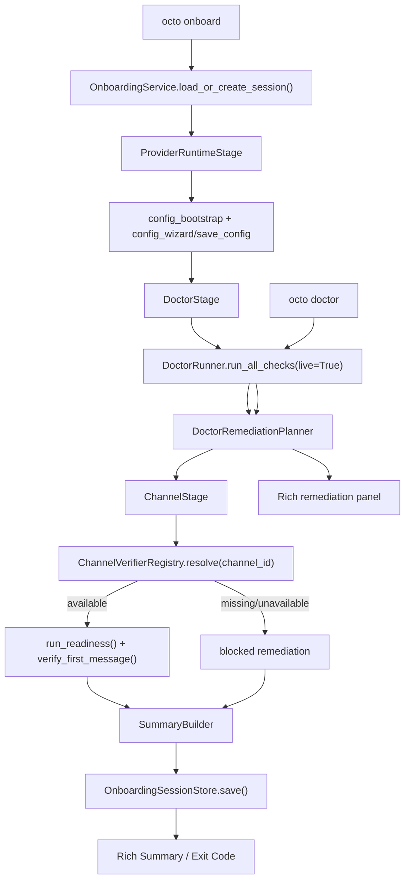

# Implementation Plan: Feature 015 — Octo Onboard + Doctor Guided Remediation

**Branch**: `codex/feat-015-octo-onboard-doctor` | **Date**: 2026-03-07 | **Spec**: `.specify/features/015-octo-onboard-doctor/spec.md`
**Input**: `.specify/features/015-octo-onboard-doctor/spec.md` + `research/research-synthesis.md`

---

## Summary

Feature 015 为 OctoAgent 增加一个真正面向新用户的首次使用闭环：`octo onboard` 成为统一入口，负责把 provider/runtime 配置、doctor live 诊断、channel readiness 和首条消息验证串成一条可恢复、可解释、可重跑的流程。

本特性的技术策略不是继续扩展 `octo init`，也不是让用户自己切换 `octo config` / `octo doctor` / channel 命令，而是新增一层轻量编排：

1. **配置层复用 F014**：provider/runtime 仍以 `octoagent.yaml`、`litellm-config.yaml` 和 `octo config` 的 schema/写入链路为单一事实源。
2. **诊断层升级但不破坏兼容**：`DoctorRunner` 继续产出 `DoctorReport + CheckResult`，新增独立的 remediation planner，把检查项映射为 action-oriented guidance，供 `octo doctor` 和 `octo onboard` 共用。
3. **恢复层新增持久化 session**：在项目目录下写入 `data/onboarding-session.json`，记录当前步骤、已完成步骤、阻塞项、下一步动作和整体 readiness。
4. **渠道层只定义 contract**：015 只交付 verifier protocol/registry 和 blocked fallback，不实现 Telegram transport/pairing；具体适配由 Feature 016 提供。

这样可以同时满足三个目标：
- 用户只需要记住一个入口；
- 中断后能从正确位置继续；
- 015 与 016 保持可并行边界，不互相吞职责。

---

## Technical Context

**Language/Version**: Python 3.12+

**Primary Dependencies**:
- `click` / `rich`（已有）— CLI 入口、确认提示、摘要展示
- `questionary`（已有）— provider/runtime 初次配置交互复用
- `pydantic>=2`（已有）— onboarding session / remediation / verifier 结果模型
- `filelock`（已有）— onboarding session 文件并发保护
- `structlog`（已有）— 记录 step 切换、blocked 原因、resume 命中

**Storage**:
- `octoagent.yaml`（已有）— provider/runtime 单一事实源
- `litellm-config.yaml`（已有）— 配置同步结果
- `.env.litellm`（已有）— 凭证引用目标
- `data/onboarding-session.json`（新增）— 015 的项目级恢复状态

**Testing**:
- `pytest`
- `click.testing.CliRunner`
- `tmp_path` + `monkeypatch`
- fake verifier / mocked `DoctorRunner`

**Target Platform**: macOS / Linux 本地 CLI 环境

**Performance Goals**:
- 已完成项目执行 `octo onboard`，在无阻塞网络调用时应在 3 秒内完成状态检查并输出摘要
- session 持久化为本地原子文件写入，不得在中断时产出半写入 JSON

**Constraints**:
- 不得把 015 做成 Telegram feature 的变体；015 只消费 verifier contract
- 默认重跑必须非破坏性；`--restart` 或重置行为必须显式确认
- doctor remediation 必须可同时被 `octo doctor` 和 `octo onboard` 消费，避免建议漂移
- 现有 `octo init` 仍保留兼容命令，但不是 015 的主路径

**Scale/Scope**: 单用户、单项目 CLI onboarding；只覆盖首个 channel 的 readiness + first-message verification

---

## Constitution Check

| Constitution 原则 | 适用性 | 评估 | 说明 |
|---|---|---|---|
| 原则 1: Durability First | 直接适用 | PASS | onboarding 进度落盘到 `data/onboarding-session.json`，使用原子写入和损坏备份，避免中断后丢状态 |
| 原则 2: Everything is an Event | 间接适用 | PASS | 015 属于 provider DX 本地编排，不接入 runtime task event store；用持久化 session 记录 step 迁移与摘要，避免“无痕状态” |
| 原则 4: Side-effect Must be Two-Phase | 直接适用 | PASS | 默认重跑不覆盖配置；`--restart`/重置 session 必须显式确认 |
| 原则 5: Least Privilege by Default | 间接适用 | PASS | onboarding 只读/写项目配置与本地 session 文件，不引入额外 secret 扩散路径 |
| 原则 6: Degrade Gracefully | 直接适用 | PASS | verifier 缺位、doctor 失败、session 损坏都必须落到可解释的 `BLOCKED`/`ACTION_REQUIRED`，不能直接崩溃 |
| 原则 7: User-in-Control | 直接适用 | PASS | 用户可查看当前状态、可安全退出、可 resume、可选择显式 restart |
| 原则 8: Observability is a Feature | 直接适用 | PASS | 每个阶段都输出状态、阻塞原因和下一步动作；`octo doctor` 也同步展示 remediation |

**结论**: 无硬性冲突，可进入任务拆解。

---

## Project Structure

### 文档制品

```text
.specify/features/015-octo-onboard-doctor/
├── spec.md
├── plan.md
├── data-model.md
├── contracts/
│   ├── onboard-cli.md
│   ├── doctor-remediation.md
│   └── channel-verifier.md
├── tasks.md
├── checklists/
└── research/
```

### 源码变更布局

```text
octoagent/packages/provider/src/octoagent/provider/dx/
├── cli.py                          # 注册 onboard 命令
├── config_commands.py              # 抽离共享 config bootstrap 逻辑后继续复用
├── config_bootstrap.py             # 新增：共享 provider/runtime 初始化引导
├── doctor.py                       # 接入 remediation planner，保留表格输出兼容
├── doctor_remediation.py           # 新增：CheckResult -> remediation 映射
├── onboarding_models.py            # 新增：session/step/summary/action 数据模型
├── onboarding_store.py             # 新增：session 持久化与损坏恢复
├── channel_verifier.py             # 新增：verifier protocol/registry
└── onboarding_service.py           # 新增：onboard 流程编排核心

octoagent/packages/provider/tests/
├── test_config_bootstrap.py
├── test_doctor_remediation.py
├── test_onboarding_models.py
├── test_onboarding_store.py
├── test_channel_verifier.py
└── test_onboard.py
```

**Structure Decision**: 015 的新逻辑全部放在 `provider/dx/` 下，不跨包引入新的 kernel/gateway 依赖。这样和 F014/F016 的边界清晰，也便于用 `CliRunner` 做本地闭环测试。

---

## Architecture

### 流程图



### 核心模块设计

#### 1. `config_bootstrap.py`

职责：把 `config_commands.config_init` 里的交互式初始化逻辑抽成可复用函数，避免 `octo config init` 和 `octo onboard` 重复维护 prompt / default alias / runtime 默认值。

```python
class ConfigBootstrapResult(BaseModel):
    config: OctoAgentConfig
    source: Literal["existing", "interactive", "echo"]
    changed: bool


def bootstrap_config(
    project_root: Path,
    *,
    interactive: bool = True,
    echo: bool = False,
) -> ConfigBootstrapResult:
    ...
```

设计选择：015 不直接调用 Click command，而是复用更低层的配置构造函数；CLI 层只负责参数解析和展示。

#### 2. `DoctorRemediationPlanner`

职责：把平铺的 `CheckResult` 结果提升为可操作的 remediation guidance，但不改变 `DoctorRunner` 作为底层诊断执行器的职责。

```python
class DoctorRemediationPlanner:
    def build(self, report: DoctorReport) -> DoctorGuidance:
        ...
```

关键点：
- `CheckResult` 仍然保留，兼容现有 `format_report()` 和测试
- remediation planner 基于 `check.name` + `check.status` + `check.level` 做映射
- `octo doctor` 与 `octo onboard` 共享同一个 `DoctorGuidance` 结果模型

#### 3. `OnboardingSessionStore`

职责：项目级 session 的读取、写入、恢复、损坏备份。

```python
class OnboardingSessionStore:
    def load(self) -> OnboardingSession | None: ...
    def save(self, session: OnboardingSession) -> None: ...
    def reset(self) -> None: ...
```

约束：
- 路径固定为 `project_root / "data" / "onboarding-session.json"`
- 使用 `filelock` + 临时文件 rename 原子写入
- 文件损坏时备份为 `onboarding-session.json.corrupted`，随后返回 `None`

#### 4. `ChannelVerifierRegistry`

职责：提供 015/016 并行边界。015 只定义 protocol、registry 和 fallback；016 再注册 Telegram verifier 实现。

```python
class ChannelOnboardingVerifier(Protocol):
    channel_id: str
    display_name: str

    def availability(self, project_root: Path) -> VerifierAvailability: ...
    async def run_readiness(
        self,
        project_root: Path,
        session: OnboardingSession,
    ) -> ChannelStepResult: ...
    async def verify_first_message(
        self,
        project_root: Path,
        session: OnboardingSession,
    ) -> ChannelStepResult: ...
```

当 registry 中不存在请求的 verifier 时，不抛异常，而是返回一条 `blocked_dependency` remediation，指向 Feature 016 或缺失插件。

#### 5. `OnboardingService`

职责：统一编排 4 个执行阶段：
- `provider_runtime`
- `doctor_live`
- `channel_readiness`
- `first_message`

核心算法：
1. 读取现有 session；不存在时创建默认 session
2. 若用户传 `--status-only`，只重算 summary 并输出，不推进步骤
3. 从第一个非 `completed` 步骤继续执行
4. 任一阶段若产出 blocking remediation，持久化后立即结束本次流程
5. 所有步骤完成后生成 `READY` summary
6. 再次运行默认只做验证和摘要，不重置已有状态

---

## Stage Semantics

### `provider_runtime`

完成条件：
- `octoagent.yaml` 存在且可解析
- 至少一个 enabled provider
- `main` / `cheap` alias 已存在
- `litellm-config.yaml` 与配置同步一致

失败语义：
- 缺配置、schema 无效、alias/provider 不一致 => `ACTION_REQUIRED`
- 用户拒绝覆盖已有配置 => 保持现状并退出，不标记 completed

### `doctor_live`

完成条件：
- `DoctorRunner.run_all_checks(live=True)` 通过
- `DoctorRemediationPlanner` 不再产出 blocking remediation

失败语义：
- REQUIRED FAIL 或 live ping 失败 => `BLOCKED`
- RECOMMENDED WARN 但不阻断 channel => `ACTION_REQUIRED`

### `channel_readiness`

完成条件：
- verifier 已注册
- `availability()` 返回 available
- `run_readiness()` 成功

失败语义：
- verifier 缺位 / 未注册 / 依赖未满足 => `BLOCKED`

### `first_message`

完成条件：
- `verify_first_message()` 成功

失败语义：
- 超时、用户暂时未完成外部操作、回包未到 => `ACTION_REQUIRED` 或 `BLOCKED`，由 verifier 返回的 remediation 决定

---

## Testing Strategy

### Unit Tests

- `test_config_bootstrap.py`: 复用后的 config bootstrap 在空项目、已有配置、用户取消三种路径下行为正确
- `test_doctor_remediation.py`: `CheckResult` 到 remediation 的映射、分组、阻塞级别排序
- `test_onboarding_models.py`: status/action/summary 的优先级与序列化
- `test_onboarding_store.py`: 原子写入、corrupted backup、reset 行为
- `test_channel_verifier.py`: registry 注册、缺位 fallback、fake verifier 结果传递

### CLI / Integration Tests

- `test_onboard.py`
  - `octo onboard --help`
  - 首次配置 -> 中断 -> resume
  - doctor fail -> remediation 输出 -> 继续修复
  - verifier 缺位 -> blocked summary
  - 已完成项目重复运行 -> 非破坏性摘要

### E2E Acceptance

使用 fake verifier 完整覆盖：
1. provider 配置成功 -> doctor live 通过 -> readiness 成功 -> first message 成功 -> `READY`
2. provider 已完成 -> doctor live 失败 -> remediation -> 修复后 resume -> `READY`
3. verifier 未注册 -> `BLOCKED`，且提示 Feature 016/缺失插件，而不是误报成功

---

## Risks & Mitigations

| 风险 | 等级 | 缓解 |
|---|---|---|
| `octo onboard` 重复实现配置逻辑，导致和 `octo config` 漂移 | 高 | 先抽 `config_bootstrap.py`，两个命令共用同一构造路径 |
| doctor remediation 破坏现有 `octo doctor` 行为 | 高 | 保留 `DoctorRunner` / `format_report` 兼容，新增 planner 与附加渲染 |
| verifier contract 定义不清，015 与 016 再次耦合 | 高 | 015 只交 protocol + registry + fake verifier 测试桩，真实 Telegram adapter 放 016 |
| session 文件损坏导致无法恢复 | 中 | store 层自动备份损坏文件并重建空 session |
| 重跑时误覆盖已有配置 | 高 | 默认只 resume / recheck；restart 必须确认 |

---

## Gate Outcome

- `GATE_DESIGN`: APPROVED
- `GATE_TASKS`: 文档生成后进入人工确认
