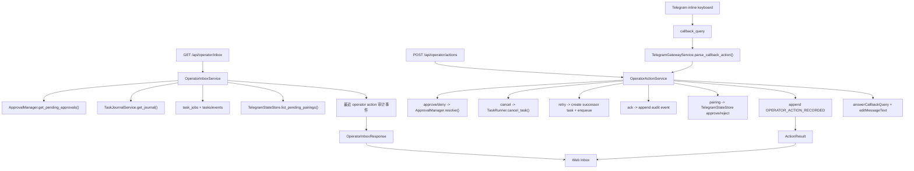

# Implementation Plan: Feature 017 — Unified Operator Inbox + Mobile Task Controls

**Branch**: `codex/feat-017-operator-inbox-mobile-controls` | **Date**: 2026-03-07 | **Spec**: `.specify/features/017-operator-inbox-mobile-controls/spec.md`
**Input**: `.specify/features/017-operator-inbox-mobile-controls/spec.md` + `research/research-synthesis.md`

---

## Summary

Feature 017 为 OctoAgent 增加真正可日常使用的 operator control surface：把 approvals、watchdog alerts、retryable failures、pending pairings 聚合为统一 inbox，并让 Web 与 Telegram 共享同一套动作语义、结果反馈和审计链。

本特性的技术策略不是重做 approvals / watchdog / Telegram transport，而是在现有能力之上新增一层轻量 control plane：

1. **共享模型放到 `packages/core`**：`OperatorInboxItem`、`OperatorActionRequest`、`OperatorActionResult`、`OperatorActionAuditPayload` 由 gateway / frontend / Telegram 共用。
2. **查询投影放到 `gateway/services`**：统一从 `ApprovalManager`、`TaskJournalService`、`task_jobs`、`TelegramStateStore` 聚合 inbox item，不新建独立事实源。
3. **动作执行也走统一服务**：approve / deny、cancel、retry、alert acknowledge、pairing decision 都经过同一 `OperatorActionService`，保证幂等结果和统一审计。
4. **Telegram 只补最小 operator 扩展**：在现有 016 transport 基线上增加 inline keyboard / callback query 支持，不引入新消息协议。
5. **retry 采用 successor task 语义**：不在终态 task 上强行重跑，而是从来源工作项创建新的可追溯 attempt，并把动作写回来源事件链。

这样可以同时满足三个目标：
- operator 有统一入口，而不是继续在多个页面和接口之间切换；
- Web 与 Telegram 的动作结果一致，可直接移动端干预；
- 017 与 011 / 016 / 019 保持并行边界，不互相吞职责。

---

## Technical Context

**Language/Version**: Python 3.12+、TypeScript 5.x

**Primary Dependencies**:
- `fastapi` / `pydantic`（已有）— inbox API、action contract、结构化响应
- `structlog`（已有）— operator action 审计日志
- `click` / `rich`（已有）— 非主入口，仅供必要的 DX 诊断复用
- `httpx`（已有）— Telegram Bot API client 扩展
- React + Vite（已有）— Web inbox surface

**Existing Sources to Reuse**:
- `ApprovalManager` / approvals API（已有）
- `TaskJournalService` / `GET /api/tasks/journal`（已有）
- `TaskRunner.cancel_task()` / `task_jobs`（已有）
- `TelegramStateStore` / `telegram-state.json`（已有）
- `TelegramGatewayService` / `TelegramBotClient`（已有）

**Storage**:
- `tasks/events/task_jobs`（已有）— task / approval / retry / cancel 的主审计链
- `data/telegram-state.json`（已有）— pending pairings / approved users
- 无新增 inbox 持久化表；017 采用 query-time projection
- 无新增旁路 audit log；统一写入 Event Store

**Testing**:
- `pytest`
- `httpx.AsyncClient` + `ASGITransport`
- `tmp_path` / fake stores / fake Telegram transport
- 前端使用 `vite build` 作为最小验证

**Target Platform**: 本地单机 gateway + Web + Telegram operator surface

**Performance Goals**:
- `GET /api/operator/inbox` 在活跃待处理项 <= 100 的 MVP 规模下应在 500ms 量级返回
- Telegram callback action 在正常网络下应在单次交互内返回结果反馈
- inbox 视图不得为每个 item 再做多次 DB 全量扫描

**Constraints**:
- 不得重写 ApprovalManager、Watchdog 检测器、Telegram ingress/routing 基础逻辑
- Telegram `callback_data` 必须满足 Bot API 64-byte 限制
- retry 不得在终态 task 上直接重跑
- pairing request 可能没有天然 `task_id`，但动作仍必须可审计
- 无 operator Telegram target 时，系统必须显式降级为 Web-only

**Scale/Scope**: 单用户、本地 Personal AI OS 的 operator inbox；不覆盖原生 mobile app 与第三方 ITSM 集成

---

## Constitution Check

| Constitution 原则 | 适用性 | 评估 | 说明 |
|---|---|---|---|
| 原则 1: Durability First | 直接适用 | PASS | 017 不新增易丢失的临时状态；动作与结果写入 Event Store，retry 通过新 attempt 保持可追溯 |
| 原则 2: Everything is an Event | 直接适用 | PASS | 所有 operator action 都通过统一审计事件落盘，不允许旁路日志 |
| 原则 4: Side-effect Must be Two-Phase | 直接适用 | PASS | approval / retry / cancel / pairing 等动作都先校验当前状态，再执行并记录结果 |
| 原则 6: Degrade Gracefully | 直接适用 | PASS | 某个 source 或 Telegram target 不可用时，inbox 仍应部分可用并明确标识降级 |
| 原则 7: User-in-Control | 直接适用 | PASS | operator 可从 Web 或 Telegram 直接 intervene，并收到明确结果反馈 |
| 原则 8: Observability is a Feature | 直接适用 | PASS | pending 数量、最近动作结果、来源渠道、动作结果都可见且可回放 |

**结论**: 无硬性冲突，可进入任务拆解。

---

## Project Structure

### 文档制品

```text
.specify/features/017-operator-inbox-mobile-controls/
├── spec.md
├── research.md
├── plan.md
├── data-model.md
├── contracts/
│   ├── operator-inbox-api.md
│   ├── operator-action-event.md
│   └── telegram-inline-actions.md
├── tasks.md
├── checklists/
└── research/
```

### 源码变更布局

```text
octoagent/packages/core/src/octoagent/core/models/
├── operator_inbox.py             # 新增：inbox item / action / result / summary 模型
├── enums.py                      # 新增 OPERATOR_ACTION_RECORDED 事件类型
├── payloads.py                   # 新增 operator action audit payload
└── __init__.py

octoagent/apps/gateway/src/octoagent/gateway/
├── services/operator_inbox.py    # 新增：聚合 approvals/journal/task_jobs/pairings
├── services/operator_actions.py  # 新增：统一动作执行与审计
├── routes/operator_inbox.py      # 新增：GET inbox / POST actions
├── services/telegram.py          # 扩展：callback_query 解析与 operator action dispatch
└── main.py                       # 注册 inbox route / 注入依赖

octoagent/packages/provider/src/octoagent/provider/dx/
└── telegram_client.py            # 扩展：inline keyboard / callback answer / message edit

octoagent/frontend/src/
├── api/client.ts                 # 扩展 inbox/action API
├── types/index.ts                # 扩展 operator inbox 类型
├── hooks/useOperatorInbox.ts     # 新增：inbox 查询与动作提交
├── components/OperatorInbox*.tsx # 新增：Web inbox surface
├── pages/TaskList.tsx            # 接入 inbox 面板（作为 landing control surface）
└── App.tsx                       # 如有必要补充导航或路由
```

**Structure Decision**: 共享 schema 放 `core`；聚合和动作执行放 `gateway/services`；Telegram Bot API 能力扩展放 `provider/dx/telegram_client.py`；Web 表面落在现有 frontend。这样 017 只新增 control plane，不侵入既有 domain source-of-truth。

---

## Architecture

### 流程图



### 核心模块设计

#### 1. `packages/core`：共享 operator schema

职责：定义 gateway、Telegram、frontend 共用的结构化模型。

```python
class OperatorInboxItem(BaseModel): ...
class OperatorInboxSummary(BaseModel): ...
class OperatorActionKind(StrEnum): ...
class OperatorActionRequest(BaseModel): ...
class OperatorActionResult(BaseModel): ...
class OperatorActionAuditPayload(BaseModel): ...
```

设计选择：
- `item_id` 作为 projection snapshot key，而不是仅用 task_id；
- action result 统一输出 `succeeded / already_handled / expired / stale_state / not_allowed / not_found / failed`；
- `recent_action_result` 成为 item 一等字段，避免 UI 事后拼装。

#### 2. `OperatorInboxService`

职责：做 query-time projection，而不是新建 inbox 表。

数据源：
- approvals：`ApprovalManager`
- alerts：`TaskJournalService`
- retryable failures：`task_jobs` + 任务最近失败状态 / worker retryable 信息
- pending pairings：`TelegramStateStore`
- recent action results：最近 `OPERATOR_ACTION_RECORDED` 事件

关键点：
- alert item 的稳定 identity 由 `task_id + drift_event_id` 决定；
- retry item 必须只对“可重试失败”暴露，不对所有 FAILED 一视同仁；
- pairing item 直接消费 `pending_pairings`，不新增事实源。

#### 3. `OperatorActionService`

职责：统一执行 Web/Telegram 发起的动作。

```python
class OperatorActionService:
    async def execute(self, request: OperatorActionRequest) -> OperatorActionResult: ...
```

动作分发：
- `APPROVE_ONCE / APPROVE_ALWAYS / DENY` -> `ApprovalManager.resolve()`
- `CANCEL_TASK` -> `TaskRunner.cancel_task()`
- `RETRY_TASK` -> 基于来源 task 创建 successor task + enqueue
- `ACK_ALERT` -> 仅写审计事件，不改变 task 本体状态
- `APPROVE_PAIRING / REJECT_PAIRING` -> `TelegramStateStore` 状态变更

关键设计：
- `retry` 不在终态 task 上重跑，而是从 `task_jobs.user_text` / 原始 `USER_MESSAGE` 创建新的 task；
- `ACK_ALERT` 通过对 `drift_event_id` 写审计事件实现“已处理”语义；当后续出现新的 drift event 时，该 item 重新出现；
- 无 `task_id` 的 pairing action 使用 dedicated operational task（如 `ops-operator-inbox`）写审计事件。

#### 4. Telegram operator surface

职责：在现有 016 transport 基线上提供真正的移动端动作面。

新增能力：
- `TelegramBotClient.send_message(..., reply_markup=...)`
- `answer_callback_query()`
- `edit_message_text()` / `edit_message_reply_markup()`
- `TelegramUpdate.callback_query`
- `TelegramGatewayService` 中对 callback action 的解析与派发

设计选择：
- callback payload 使用紧凑编码，确保 < 64 bytes；
- 若存在 approved operator DM，则 operator card 发送到该目标；
- 若无可用 operator Telegram target，则仍返回 Web inbox，但不会假装 Telegram 已可操作。

#### 5. Web inbox surface

职责：把 operator inbox 作为 landing control surface，而不是再造孤立面板。

策略：
- 在 `TaskList` 顶部或主区域接入 `OperatorInboxPanel`
- 展示 summary、pending 数量、到期信息、最近动作结果、快速操作
- 不扩成复杂后台；MVP 先让 operator “打开首页就看到待处理项”

---

## Retry Semantics

这是 017 最需要提前冻结的实现点。

### 选型：successor task / attempt（采纳）

当 operator 对失败任务执行 retry 时：

1. 不直接复用终态 `task_id`
2. 从来源任务的原始输入与上下文创建新的 task
3. 将来源任务与新任务通过 operator audit event 关联
4. Web / Telegram 向用户展示新的 `result_task_id`

理由：
- 现有 `TaskStatus` 状态机不支持终态直接回到 RUNNING
- 强行复用终态 task 会破坏事件链和回放语义
- 用户需要知道“这次重试产生了哪个新的执行”

### 不采纳：在原 task 上直接 requeue

原因：
- 与现有状态机冲突
- 审计与回放混乱
- 容易造成终态任务被“幽灵复活”

---

## Telegram Delivery Strategy

### 选型：优先已批准 operator DM（采纳）

operator Telegram target 的 MVP 规则：

1. 优先使用 `TelegramStateStore.first_approved_user()`
2. 作为 operator card 的默认投递目标
3. 若不存在 approved operator，则 Telegram action surface 降级为 unavailable，Web 仍然可用

理由：
- 对 Web-origin task / watchdog alert / pairing request，需要一个稳定的 owner/operator 承载面
- 复用现有 approved user 状态，不新增配置

---

## Parallelization Plan

在共享 schema / action contract 冻结后，可最大化拆成三条线：

1. **查询线**：`OperatorInboxService + GET /api/operator/inbox + Web hook/panel`
2. **动作线**：`OperatorActionService + POST /api/operator/actions + audit + retry semantics`
3. **Telegram 线**：`Telegram client callback support + operator cards + callback dispatch`

唯一硬前置是：
- 共享模型、事件 payload、callback 编码规则先冻结

---

## Verification Strategy

- core models：枚举值、序列化、recent result 结构
- gateway service：聚合与动作执行单测
- gateway route：GET inbox / POST action 集成测试
- Telegram：callback parsing、幂等结果反馈、消息编辑
- frontend：`vite build`
- 回归：approvals、journal、cancel、telegram ingress 既有测试不得回退
