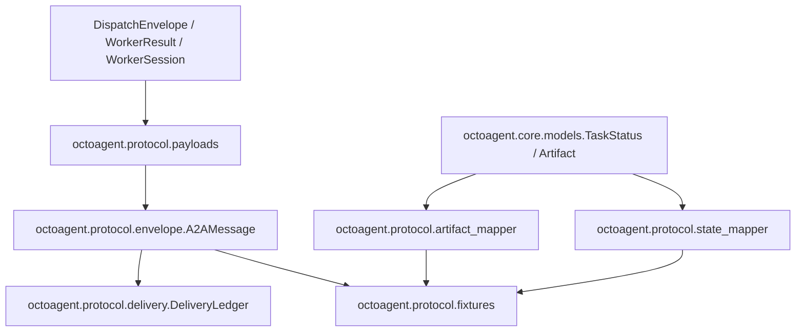

# Implementation Plan: Feature 018 — A2A-Lite Envelope + A2AStateMapper

**Branch**: `codex/feat-018-a2a-lite-envelope` | **Date**: 2026-03-07 | **Spec**: `.specify/features/018-a2a-lite-envelope/spec.md`
**Input**: `.specify/features/018-a2a-lite-envelope/spec.md` + `research/tech-research.md`

---

## Summary

Feature 018 通过新增独立的 `octoagent-protocol` workspace package，冻结 A2A-Lite envelope、状态映射、artifact 映射、协议级投递守卫和 fixture builders。

技术策略：

1. `protocol` 作为跨 Agent wire contract 的单一事实源。
2. `core` 继续保留领域模型；`protocol` 通过 bridge helpers 复用 `TaskStatus`、`DispatchEnvelope`、`WorkerResult`、`WorkerSession`。
3. 先交付“纯 contract + 纯 mapper + 纯 guard”，不提前实现 transport。

---

## Technical Context

**Language/Version**: Python 3.12+

**Primary Dependencies**:
- `pydantic>=2.10,<3.0`
- `octoagent-core`

**Storage**: N/A（018 不引入 durable queue 或额外 DB schema）

**Testing**:
- `pytest`
- `pytest-asyncio`（无需异步时可不用）

**Target Platform**: Python workspace package（供 kernel / gateway / worker / tests 复用）

**Performance Goals**:
- 模型构造 / mapper / guard 都是纯内存操作
- fixture 序列化应稳定，无额外 IO

**Constraints**:
- 不改 transport
- 不做 durable ledger
- 不把协议逻辑散落到 gateway service

**Scale/Scope**: 单 feature contract 包 + 对现有 `core` / workspace 的最小对接

---

## Constitution Check

| Constitution 原则 | 适用性 | 评估 | 说明 |
|---|---|---|---|
| 原则 1: Durability First | 间接适用 | PASS | 018 不承诺 durable transport，仅冻结协议与 guard，避免虚假 durability 承诺 |
| 原则 2: Everything is an Event | 间接适用 | PASS | envelope 显式包含 trace / idempotency / message_id，便于后续写事件 |
| 原则 3: Tools are Contracts | 直接适用 | PASS | `protocol` package 本身就是冻结 contract 的实现 |
| 原则 6: Degrade Gracefully | 直接适用 | PASS | 版本不兼容、hop 超限、replay 都在协议层结构化返回 |
| 原则 8: Observability is a Feature | 直接适用 | PASS | trace / metadata / internal_status 均为一等字段 |
| 原则 14: A2A Compatibility | 直接适用 | PASS | 018 核心就是状态与 artifact 的 A2A 兼容层 |

**结论**: 无硬性违背，可直接实施。

---

## Project Structure

### 文档制品

```text
.specify/features/018-a2a-lite-envelope/
├── spec.md
├── plan.md
├── research.md
├── data-model.md
├── quickstart.md
├── tasks.md
├── checklists/
│   └── requirements.md
├── contracts/
│   ├── a2a-envelope.md
│   └── mapping-fixtures.md
├── research/
│   └── tech-research.md
└── verification/
    └── verification-report.md
```

### 源码变更布局

```text
octoagent/
├── pyproject.toml
└── packages/
    ├── core/
    │   └── src/octoagent/core/models/
    │       └── artifact.py
    └── protocol/
        ├── pyproject.toml
        ├── src/octoagent/protocol/
        │   ├── __init__.py
        │   ├── artifact_mapper.py
        │   ├── delivery.py
        │   ├── envelope.py
        │   ├── fixtures.py
        │   ├── payloads.py
        │   └── state_mapper.py
        └── tests/
            ├── test_artifact_mapper.py
            ├── test_delivery.py
            ├── test_envelope.py
            ├── test_fixtures.py
            └── test_state_mapper.py
```

**Structure Decision**: 采用独立 `protocol` package，与 blueprint 的目标 repo 结构对齐；只对 `core` 做最小补充，不把协议 contract 混回 `core`。

---

## Architecture



### 核心模块

#### 1. `envelope.py`

- 定义 `A2AMessageType`
- 定义 `A2ATaskState`
- 定义 `A2ATraceContext`
- 定义 `A2AMessage`
- 提供 `wrap()` / `forward_to()` 等便捷构造能力

#### 2. `payloads.py`

- 定义六类 payload model
- 为 `DispatchEnvelope` / `WorkerResult` / `WorkerSession` 提供桥接 builder

#### 3. `state_mapper.py`

- 定义双向映射表
- 提供 metadata merge helper

#### 4. `artifact_mapper.py`

- 定义 protocol-side `OctoArtifactView`
- 定义 `A2AArtifact` / `A2AArtifactPart`
- 提供 core artifact -> A2A artifact 的纯映射

#### 5. `delivery.py`

- 定义 `DeliveryDecision`
- 定义 `DeliveryAssessment`
- 定义 `DeliveryLedger`

#### 6. `fixtures.py`

- 提供六类标准 message fixture builders
- 提供可直接被 019/023 导入的 catalog

---

## Complexity Tracking

| 决策 | 为什么需要 | 拒绝的更简单方案 |
|---|---|---|
| 新增独立 package | blueprint 已明确 `packages/protocol` 为正式边界，且下游 feature 需要直接依赖 | 继续扩展 `core.models.orchestrator` 会让 domain 与 wire contract 混层 |
| protocol-side `OctoArtifactView` | 先冻结 A2A 映射 contract，同时避免直接触碰现有持久化 schema | 直接升级 core ArtifactStore schema 会扩大回归半径，超出 018 MVP |
