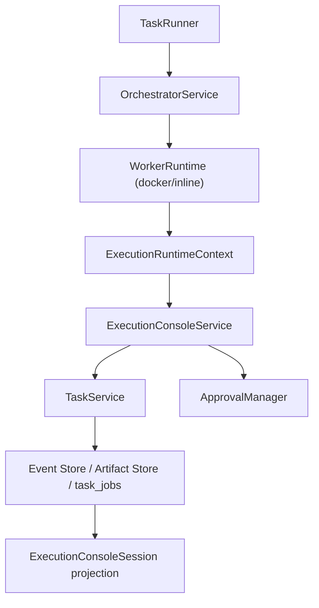

# Implementation Plan: Feature 019 — Interactive Execution Console + Durable Input Resume

**Branch**: `codex/feat-019-jobrunner-interactive-console` | **Date**: 2026-03-07 | **Spec**: `.specify/features/019-jobrunner-interactive-console/spec.md`
**Input**: `.specify/features/019-jobrunner-interactive-console/spec.md` + `research/tech-research.md`

---

## Summary

Feature 019 采用“最小 schema 变更、最大复用现有 durable 基线”的策略落地：

1. 用 `ExecutionConsoleService` + `ExecutionRuntimeContext` 把现有 `WorkerRuntime` 升级为统一执行面；
2. 用粒度化 `EXECUTION_STATUS_CHANGED / LOG / STEP / INPUT_* / CANCEL_REQUESTED` 事件承接日志、步骤、输入、状态协议，并投影为统一 stream；
3. 用 `WAITING_INPUT` + `task_jobs` 等待态 + Artifact 输入持久化，完成 live path 和 restart-after-input path；
4. 用 `ApprovalManager` 复用高风险输入 gate，不新增 execution 专用表。

---

## Technical Context

**Language/Version**: Python 3.12+

**Primary Dependencies**:
- `pydantic>=2`
- `fastapi`
- `aiosqlite`
- `structlog`
- `octoagent-core`
- `octoagent-policy`

**Storage**:
- 复用现有 SQLite `tasks` / `events` / `task_jobs`
- 复用现有 `artifacts/` 目录保存人工输入全文

**Testing**:
- `pytest`
- `pytest-asyncio`
- `httpx.AsyncClient`

**Constraints**:
- 不新增持久化表
- 不破坏现有 cancel / task detail / SSE 语义
- docker 不可用时必须 graceful fallback

---

## Constitution Check

| Constitution 原则 | 评估 | 说明 |
|---|---|---|
| Durability First | PASS | 等待输入与输入内容都要有 durable 表达 |
| Everything is an Event | PASS | execution 状态/日志/输入统一落现有 task 事件链 |
| Least Privilege by Default | PASS | 高风险输入复用 approval gate |
| User-in-Control | PASS | attach_input / cancel / status 三类控制路径都正式化 |
| Observability is a Feature | PASS | execution session + event stream 成为显式 API |

---

## Source Layout

```text
octoagent/
├── apps/gateway/src/octoagent/gateway/
│   ├── routes/
│   │   └── execution.py
│   └── services/
│       ├── execution_console.py
│       ├── execution_context.py
│       ├── task_runner.py
│       ├── task_service.py
│       └── worker_runtime.py
├── apps/gateway/tests/
│   ├── test_execution_api.py
│   ├── test_task_runner.py
│   └── test_worker_runtime.py
└── packages/core/src/octoagent/core/
    ├── models/
    │   ├── __init__.py
    │   ├── enums.py
    │   ├── execution.py
    │   └── payloads.py
    ├── store/
    │   └── task_job_store.py
    └── tests/
        └── test_models.py
```

---

## Architecture



---

## Complexity Tracking

| 决策 | 为什么需要 | 拒绝的更简单方案 |
|---|---|---|
| 基于 `EXECUTION_*` 事件投影统一 stream | 复用现有 Event Store / SSE 事实链，不额外发明 execution 总事件 | 新增单一 `EXECUTION_STREAM` 总事件，会形成双重事实源 |
| 输入全文落 Artifact | 满足 Constitution 的最小化日志原则 | 直接把输入原文写到 event payload，存在泄露风险 |
| `task_jobs` 新等待态 | 防止 startup recovery 把 `WAITING_INPUT` 任务当 orphan running 失败掉 | 继续只用 `RUNNING`/`QUEUED`，会在重启后误恢复 |
| `ContextVar` 暴露执行 API | 不强绑具体 LLM 接口，后续 Worker/Skill 均可复用 | 把 log/request_input 方法硬塞进 `LLMService.call` 签名 |
