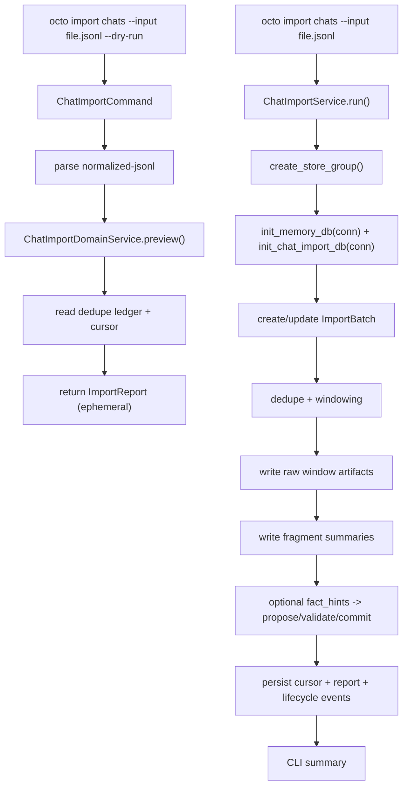

# Implementation Plan: Feature 021 — Chat Import Core

**Branch**: `codex/feat-021-chat-import-core` | **Date**: 2026-03-07 | **Spec**: `.specify/features/021-chat-import-core/spec.md`
**Input**: `.specify/features/021-chat-import-core/spec.md` + `research/research-synthesis.md`

---

## Summary

Feature 021 为 OctoAgent 增加一条真正可用的历史聊天导入闭环：

- `octo import chats`：用户可触达的导入入口；
- `--dry-run`：在真正写入前预览新增数、重复数、scope 和窗口摘要；
- `ImportBatch / ImportCursor / ImportReport`：导入任务的 durability 骨架；
- 原文窗口 → Artifact，窗口摘要 → Fragment，稳定事实候选 → `WriteProposal -> validate -> commit`；
- `ops-chat-import` 生命周期事件：让导入过程进入现有可观测与可恢复链路。

本特性的技术策略不是“把外部聊天直接塞进 Memory”，而是新增一层**generic import orchestration**：

1. **导入 domain 放在 `packages/memory`**：导入批次、去重账本、窗口、报告和 schema 都与 020 memory contract 同域，避免再开第二套导入框架。
2. **用户入口放在 `provider/dx`**：`octo import chats` 延续 015/022 的 CLI first 路线，保证 M2 有真实入口。
3. **同库同连接，不引入反向依赖**：021 不把 `memory` 依赖硬塞回 `core`；而是在 provider 侧用同一个 SQLite 连接顺序执行 `core.init_db()`、`memory.init_memory_db()` 和 `chat import schema init`。
4. **MVP 摘要采取 deterministic strategy**：窗口摘要先用确定性规则生成，避免 021 被在线 LLM 可用性卡死；未来可插拔替换为模型摘要器。
5. **事实写入通过 optional hints 驱动**：MVP 仅在 source payload 提供 `fact_hints` 或明确 subject metadata 时生成 proposal；通用原始聊天默认 fragment-only，不强做黑箱事实提取。

这样可以同时满足三个目标：
- 用户能安全地把历史聊天导入系统，而不是只拥有一个内部库；
- 020 的治理 contract 保持单一事实源；
- 021 不吞掉微信 adapter、Web 面板或额外 UI 管理面。

---

## Technical Context

**Language/Version**: Python 3.12+

**Primary Dependencies**:
- `octoagent-core`（已有）— Event Store / Artifact Store / `NormalizedMessage` / project DB
- `octoagent-memory`（已有 workspace package）— `MemoryService` 与 020 governance contract
- `click` / `rich`（已有）— CLI 签名与用户摘要输出
- `aiosqlite`（已有）— 同连接 SQLite 持久化
- Python stdlib `hashlib` / `json` / `pathlib` — message key、JSONL 解析、文件输入处理

**Storage**:
- `data/sqlite/octoagent.db`（已有）— 主数据库；021 在此新增 import tables
- `data/artifacts/`（已有）— 原始聊天窗口 artifact
- `events` / `artifacts` / `memory_*` 表（已有/020 已交付）
- `chat_import_*` 表（021 新增）

**Testing**:
- `pytest`
- `pytest-asyncio`
- `click.testing.CliRunner`
- `tmp_path` / `monkeypatch`

**Target Platform**: 本地单机 CLI 场景（macOS / Linux）

**Performance Goals**:
- `--dry-run` 对中小型 JSONL 输入应在 5 秒内返回结构化预览
- 重复导入时 dedupe 命中路径不得扫描整个 history artifact
- 导入失败时必须保留足够批次信息用于 resume / audit

**Constraints**:
- 不在 021 直接交付微信 / Slack / Telegram 历史 adapter
- 不在 021 交付 Web 导入面板
- 不在 021 旁路 020 的 proposal contract 写 SoR
- 不在 021 把 `memory` 反向依赖塞进 `core`
- dry-run 不得产生 memory / artifact / event 副作用

**Scale/Scope**: 单用户、单项目、文件输入驱动的 generic chat import core

---

## Constitution Check

| Constitution 原则 | 适用性 | 评估 | 说明 |
|---|---|---|---|
| 原则 1: Durability First | 直接适用 | PASS | 真实导入必须持久化 batch/cursor/dedupe/report，不依赖进程内状态 |
| 原则 2: Everything is an Event | 直接适用 | PASS | 导入生命周期通过 dedicated operational task 写入事件链 |
| 原则 4: Side-effect Must be Two-Phase | 直接适用 | PASS | dry-run 先预览，SoR 写入仍经 proposal -> validate -> commit |
| 原则 5: Least Privilege by Default | 间接适用 | PASS | 021 不直接放大权限面；原文进入 artifact，事实写入受 020 治理 |
| 原则 6: Degrade Gracefully | 直接适用 | PASS | 摘要器 / backend 不可用时仍可 dry-run 或 fragment-only 导入 |
| 原则 7: User-in-Control | 直接适用 | PASS | 用户可预览、重复执行、定位失败原因和 artifact 来源 |
| 原则 8: Observability is a Feature | 直接适用 | PASS | batch/report/event/artifact 保证导入可回放、可追查 |
| 原则 11: Context Hygiene | 直接适用 | PASS | 原文窗口 artifact 化，fragment 只保留摘要，不把长聊天塞入主上下文 |
| 原则 12: 记忆写入必须治理 | 直接适用 | PASS | SoR 写入只经 `WriteProposal -> validate -> commit` |

**结论**: 无硬性冲突，可进入任务拆解。

---

## Project Structure

### 文档制品

```text
.specify/features/021-chat-import-core/
├── spec.md
├── research.md
├── plan.md
├── data-model.md
├── contracts/
│   ├── import-cli.md
│   ├── import-source.md
│   └── import-report.md
├── tasks.md
├── checklists/
└── research/
```

### 源码变更布局

```text
octoagent/packages/memory/src/octoagent/memory/
├── __init__.py
├── imports/
│   ├── __init__.py
│   ├── models.py                # ImportBatch / Cursor / Window / Report / SourceMessage
│   ├── sqlite_init.py           # chat_import_* 表
│   ├── store.py                 # import batch / dedupe / cursor / report CRUD
│   └── service.py               # ChatImportDomainService（解析/去重/窗口/summary/proposal orchestration）


octoagent/packages/provider/src/octoagent/provider/dx/
├── cli.py                       # 注册 import 命令组
├── chat_import_commands.py      # `octo import chats`
└── chat_import_service.py       # provider-facing bootstrap：shared conn + artifact/event/memory wiring


octoagent/packages/provider/tests/
├── test_chat_import_commands.py
└── test_chat_import_service.py


octoagent/packages/memory/tests/
├── test_import_models.py
├── test_import_store.py
└── test_import_service.py


octoagent/packages/core/src/octoagent/core/models/
├── enums.py                     # 新增 CHAT_IMPORT_* 事件类型
└── payloads.py                  # 新增 ChatImportLifecyclePayload
```

**Structure Decision**:
- import domain 放到 `packages/memory`，因为 021 本质是 memory ingest；
- CLI/bootstrap 放到 `provider/dx`，因为它是 operator-facing DX 能力；
- 事件枚举与 payload 放到 `core.models`，因为它们进入现有 Event Store 契约。

---

## Architecture

### 流程图



### 核心模块设计

#### 1. `imports/models.py`

职责：定义 021 的强类型输入/输出与 durable entities。

```python
class ImportedChatMessage(BaseModel): ...
class ImportFactHint(BaseModel): ...
class ImportBatch(BaseModel): ...
class ImportCursor(BaseModel): ...
class ImportWindow(BaseModel): ...
class ImportSummary(BaseModel): ...
class ImportReport(BaseModel): ...
class ImportDedupeEntry(BaseModel): ...
```

设计选择：
- 输入模型与 durable 模型同域，保证 adapter / CLI / tests 用同一语义；
- `ImportFactHint` 是 MVP 对接 SoR 的最小桥梁，避免强依赖 LLM 抽取；
- `ImportReport` 是用户视角第一对象，而不是内部事务日志。

#### 2. `imports/sqlite_init.py` + `imports/store.py`

职责：新增并管理导入 durability schema：

- `chat_import_batches`
- `chat_import_cursors`
- `chat_import_windows`
- `chat_import_dedupe`
- `chat_import_reports`

关键约束：
- `(source_id, scope_id, message_key)` 唯一，保证重复执行安全；
- `chat_import_reports.batch_id` 唯一，保证每批次最终只有一份 canonical report；
- `chat_import_cursors` 以 `(source_id, scope_id)` 作为唯一键，支持增量继续。

#### 3. `ChatImportDomainService`

职责：在 memory package 内完成与具体 CLI 无关的导入编排：

- 输入 JSONL 解析与模型校验
- message key 计算
- dedupe 命中判断
- window 切分
- deterministic summary 生成
- optional `fact_hints` -> proposal drafts

关键点：
- `preview()` 为只读路径，不写表、不写 artifact、不写事件；
- `run()` 只返回“要写什么”和“执行结果”，真正 artifact/event 落盘由 provider-facing service 协调；
- deterministic summary 先做结构化摘要：参与者、时间范围、消息数、关键 excerpt，避免 021 被在线模型耦死。

#### 4. `chat_import_service.py`

职责：provider-facing bootstrap。

```python
class ChatImportService:
    async def preview(...): ...
    async def run(...): ...
```

实现策略：
- 通过 `create_store_group()` 获取主库连接与 artifact store；
- 随后在**同一连接**上执行 `init_memory_db(conn)` 与 `init_chat_import_db(conn)`；
- 构造 `MemoryService(conn)` 与 `ChatImportDomainService(...)`；
- 将原始窗口写为 artifact，并在必要时写 lifecycle event。

这样实现可以避免 `core` 反向依赖 `memory`，同时仍然保证同库同连接。

#### 5. `CHAT_IMPORT_*` lifecycle payload

职责：把导入纳入现有 Event Store / trace 语义。

新增：
- `CHAT_IMPORT_STARTED`
- `CHAT_IMPORT_COMPLETED`
- `CHAT_IMPORT_FAILED`

payload 至少包含：
- `batch_id`
- `source_id`
- `scope_id`
- `imported_count`
- `duplicate_count`
- `window_count`
- `report_id`
- `message`

约束：
- dry-run 不写 lifecycle event；
- 真实导入一律挂在 dedicated operational task `ops-chat-import` 上。

---

## Input Format Strategy

### Generic Source Contract

021 本轮不实现具体 adapter，因此必须冻结一个 generic input contract：

- 格式：`normalized-jsonl`
- 每行一个 JSON object
- 字段对齐 `NormalizedMessage`，额外增加：
  - `source_message_id`
  - `source_cursor`
  - `fact_hints[]`（可选）

这样后续微信导入插件只需要做一件事：把微信原始导出转换成 `normalized-jsonl`，再交给 021 内核处理。

### Why JSONL

- 流式友好，适合大批量导入；
- 易于 resume / line cursor；
- 与 OpenClaw transcript / raw stream 的 JSONL 实践接近；
- 比一次性 JSON array 更适合未来 adapter 和 CLI 管道。

---

## Deterministic Summary Strategy

MVP 不依赖在线 LLM 自动总结，而采用 deterministic summary：

- 统计参与者列表
- 汇总时间窗口
- 提取前 N 条关键 excerpt
- 生成结构化摘要文本

这样做的原因：
- 021 是 durability / import 功能，不应被 live model 可用性阻塞；
- deterministic summary 足够支持审计与初步检索；
- future summarizer 可在不改变 import contract 的前提下替换实现。

---

## Integration Boundaries

### 对 020 的边界

- 021 只消费 `MemoryService` contract
- 不修改 `WriteProposal` / `SorRecord` / `FragmentRecord` 主语义
- `fact_hints` 生成 proposal 是 021 的 adapter/orchestration 行为，不是 020 的职责

### 对 022 的边界

- 021 使用同一主 SQLite 和 artifacts dir，因此 backup/export 会自然覆盖：
  - import tables（在主 DB 内）
  - raw window artifacts（在 artifacts dir 内）
- 不要求 022 新增专门的 import report 打包逻辑

### 对 023 的边界

023 可以直接消费：
- `octo import chats --dry-run`
- 重复执行安全
- cursor 恢复
- event / artifact / memory 联动结果

---

## Implementation Phases

### Phase 1: Module Setup & Dependency Wiring

- provider 接入 `octoagent-memory`
- 创建 memory import module 与 provider DX skeleton
- 建立测试骨架

### Phase 2: Shared Schema & Contract Freeze

- 实现 import models / enums / sqlite schema
- 新增 `CHAT_IMPORT_*` 事件类型与 payload
- 冻结 `normalized-jsonl` 输入契约

### Phase 3: CLI Preview Path

- 输入解析
- dedupe/cursor 只读检查
- dry-run report 生成
- CLI 输出与参数校验

### Phase 4: Durable Import Path

- batch / cursor / dedupe / report 持久化
- raw window artifact 写入
- fragment summary 写入
- lifecycle events

### Phase 5: Governed Fact Writes

- optional `fact_hints` 转 `WriteProposal`
- `validate_proposal()` / `commit_memory()` 联动
- fragment-only / `NONE` fallback

### Phase 6: Tests, Doc Sync, Verification

- memory/provider targeted tests
- blueprint / m2 split 回写
- verification report 准备

---

## Non-goals

- 不实现具体微信 / Slack / Telegram 历史解析 adapter
- 不实现 Web 导入面板
- 不实现批次回滚 / 删除
- 不实现 LLM 驱动的开放式事实抽取

