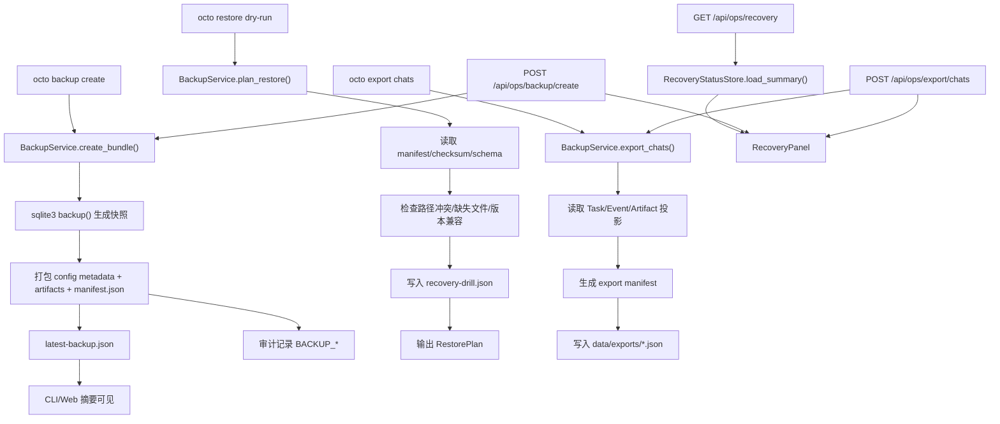

# Implementation Plan: Feature 022 — Backup/Restore + Export + Recovery Drill

**Branch**: `codex/feat-022-backup-restore-export` | **Date**: 2026-03-07 | **Spec**: `.specify/features/022-backup-restore-export/spec.md`
**Input**: `.specify/features/022-backup-restore-export/spec.md` + `research/research-synthesis.md`

---

## Summary

Feature 022 为 OctoAgent 增加一组真正面向操作者的恢复能力：

- `octo backup create`：生成可迁移的 backup bundle；
- `octo restore dry-run`：在恢复前给出结构化恢复计划与冲突说明；
- `octo export chats`：导出 task/thread 范围内的聊天与任务记录；
- CLI/Web 共用的恢复状态摘要：最近 backup 与最近 recovery drill 结果。

本特性的技术策略不是“把整个实例目录直接打包”，而是新增一层轻量 recovery operator 服务：

1. **领域模型放到 `packages/core`**：bundle、manifest、restore plan、export manifest、recovery drill record 由 CLI/Web 共用。
2. **操作服务放到 `provider/dx`**：backup/export/restore dry-run 都作为 operator-facing DX 能力，延续 014/015 的 CLI 体系。
3. **状态源采用双文件**：`data/ops/latest-backup.json` 记录最近 backup；`data/ops/recovery-drill.json` 记录最近一次 dry-run 验证结果。
4. **Web 只做最小入口**：gateway 暴露 recovery summary 和 backup/export 触发 API，frontend 在首页显示一个极简 recovery panel。
5. **恢复只做到 preview-first**：022 不执行 destructive restore apply，只交付 `RestorePlan` 和 recovery drill 记录。

这样可以同时满足三个目标：
- 用户有稳定的自助入口，而不是只能读 runbook；
- CLI 和 Web 读同一份状态，不会出现语义漂移；
- 022 保持和 016/018/020/021 的并行边界，不额外吞并其他里程碑能力。

---

## Technical Context

**Language/Version**: Python 3.12+、TypeScript 5.x

**Primary Dependencies**:
- Python stdlib `sqlite3` / `zipfile` / `hashlib` / `tempfile` — 在线数据库快照、bundle 打包、完整性校验
- `pydantic>=2`（已有）— backup/export/recovery 模型
- `click` / `rich`（已有）— CLI 签名、摘要输出、错误提示
- `aiosqlite`（已有）— chat export / 审计读取现有 SQLite 数据
- `fastapi` / `httpx`（已有）— recovery summary 与 Web 触发 API
- React + Vite（已有）— 最小 recovery panel

**Storage**:
- `data/sqlite/octoagent.db`（已有）— Task/Event/Checkpoint 核心数据
- `data/artifacts/`（已有）— artifact 文件树
- `octoagent.yaml`（已有）— config metadata
- `litellm-config.yaml`（已有）— runtime config metadata
- `data/backups/*.zip`（新增）— backup bundle 默认输出目录
- `data/exports/*.json`（新增）— chat export 默认输出目录
- `data/ops/latest-backup.json`（新增）— 最近一次 backup 摘要
- `data/ops/recovery-drill.json`（新增）— 最近一次 restore dry-run 摘要

**Testing**:
- `pytest`
- `click.testing.CliRunner`
- `httpx.AsyncClient` + `ASGITransport`
- `tmp_path` / `monkeypatch`
- 前端无测试框架，使用 `vite build` 作为最小验证

**Target Platform**: macOS / Linux 本地单机环境

**Performance Goals**:
- `octo restore dry-run` 在小型本地 bundle 上应在 5 秒内给出结构化计划
- `octo backup create` 对单机 SQLite 数据采用在线 backup，不要求停服务
- CLI 与 Web 摘要读取状态文件时不得扫描整个 artifact 树

**Constraints**:
- 022 只做 restore preview，不做 destructive restore apply
- backup 默认不打包明文 secrets 文件，但必须给出敏感性提示
- Web 入口保持最小，不扩成完整运维后台
- chat export 不依赖 021，不得提前绑定 import/memory schema
- 若要把 `BACKUP_*` 记入现有 Event Store，必须通过可审计的 operational task 语义，不得绕过 core 约束

**Scale/Scope**: 单用户、单项目的本地恢复与迁移能力；不覆盖远程同步与多机恢复

---

## Constitution Check

| Constitution 原则 | 适用性 | 评估 | 说明 |
|---|---|---|---|
| 原则 1: Durability First | 直接适用 | PASS | backup bundle、latest backup、recovery drill 都有持久化落点，恢复结果不只存在于终端输出 |
| 原则 2: Everything is an Event | 直接适用 | PASS | backup 生命周期必须有结构化审计；若接入 Event Store，则通过 operational task 语义写入 |
| 原则 4: Side-effect Must be Two-Phase | 直接适用 | PASS | 022 只交付 `restore dry-run`，明确先计划、后执行；不在本 Feature 引入 destructive restore apply |
| 原则 5: Least Privilege by Default | 直接适用 | PASS | backup 默认排除明文 secrets 文件，并通过 manifest 输出敏感性摘要 |
| 原则 6: Degrade Gracefully | 直接适用 | PASS | bundle 损坏、状态文件损坏、空 chat 导出都必须给出结构化降级结果，而非崩溃 |
| 原则 7: User-in-Control | 直接适用 | PASS | 用户可先 preview 再决定，恢复风险显式可见 |
| 原则 8: Observability is a Feature | 直接适用 | PASS | 最近 backup / recovery drill 成为可查询状态，并进入 CLI/Web 摘要 |

**结论**: 无硬性冲突，可进入任务拆解。

---

## Project Structure

### 文档制品

```text
.specify/features/022-backup-restore-export/
├── spec.md
├── research.md
├── plan.md
├── data-model.md
├── contracts/
│   ├── backup-cli.md
│   ├── backup-manifest.md
│   └── recovery-api.md
├── tasks.md
├── checklists/
└── research/
```

### 源码变更布局

```text
octoagent/packages/core/src/octoagent/core/models/
├── backup.py                     # 新增：bundle / manifest / restore / export / drill 模型
├── enums.py                      # 新增 BACKUP_* 事件类型（如采纳 Event Store 审计）
├── payloads.py                   # 新增 backup lifecycle payload
└── __init__.py

octoagent/packages/provider/src/octoagent/provider/dx/
├── cli.py                        # 注册 backup / restore / export 命令组
├── backup_commands.py            # 新增：CLI 命令入口
├── backup_service.py             # 新增：bundle 创建、dry-run 规划、chat export
├── recovery_status_store.py      # 新增：latest-backup / recovery-drill 状态文件
└── backup_audit.py               # 新增：结构化 backup 生命周期审计（可选 Event Store 接入）

octoagent/apps/gateway/src/octoagent/gateway/
├── routes/ops.py                 # 新增：recovery summary + Web 触发 backup/export
└── main.py                       # 注册 ops router

octoagent/frontend/src/
├── api/client.ts                 # 扩展 recovery/backup/export API
├── types/index.ts                # 扩展 recovery panel / export 响应类型
├── components/RecoveryPanel.tsx  # 新增：最小状态卡片
└── pages/TaskList.tsx            # 接入 RecoveryPanel
```

**Structure Decision**: 共享 schema 放 `core`；用户入口和文件系统操作放 `provider/dx`；Web 摘要放 `gateway + frontend`。这样 022 的实现边界和 014/015 一致，也便于做 CLI 与 API 双路径测试。

---

## Architecture

### 流程图



### 核心模块设计

#### 1. `packages/core`：统一领域模型

职责：定义 CLI、gateway、frontend 共用的结构化 schema，避免 022 自己再造一套 JSON 口径。

```python
class BackupManifest(BaseModel): ...
class BackupFileEntry(BaseModel): ...
class BackupBundle(BaseModel): ...
class RestoreConflict(BaseModel): ...
class RestorePlan(BaseModel): ...
class ExportManifest(BaseModel): ...
class RecoveryDrillRecord(BaseModel): ...
```

设计选择：
- manifest / restore plan / export manifest / drill record 全部走 Pydantic；
- bundle layout 契约和 API 输出引用同一组模型；
- 若接入 Event Store 审计，则新增 `BackupLifecyclePayload` 和 `EventType.BACKUP_*`。

#### 2. `RecoveryStatusStore`

职责：读写两份 operator-facing 状态文件：

- `data/ops/latest-backup.json`
- `data/ops/recovery-drill.json`

```python
class RecoveryStatusStore:
    def save_latest_backup(self, record: BackupBundle) -> None: ...
    def load_latest_backup(self) -> BackupBundle | None: ...
    def save_recovery_drill(self, record: RecoveryDrillRecord) -> None: ...
    def load_recovery_drill(self) -> RecoveryDrillRecord | None: ...
```

约束：
- 使用原子写入；
- 文件损坏时备份为 `.corrupted` 并返回 `None`；
- 读取必须是 O(1)，不能为前端摘要扫描整个 bundle 目录。

#### 3. `BackupService`

职责：交付 022 的三条主路径：

1. `create_bundle()`
2. `plan_restore()`
3. `export_chats()`

```python
class BackupService:
    def create_bundle(self, *, output_path: Path | None = None, label: str | None = None) -> BackupBundle: ...
    async def plan_restore(self, bundle_path: Path, *, target_root: Path) -> RestorePlan: ...
    async def export_chats(self, filters: ExportFilter, *, output_path: Path | None = None) -> ExportManifest: ...
```

关键点：
- `create_bundle()` 使用标准库 `sqlite3.Connection.backup()` 生成快照；
- manifest 写明 bundle schema version、包含范围、校验摘要、sensitivity summary；
- `plan_restore()` 不写目标文件，只生成结构化冲突清单，并同步更新 `recovery-drill.json`；
- `export_chats()` 直接读取 task/event/artifact 投影，不等待 021。

#### 4. `backup_audit.py`

职责：为 `BACKUP_*` 提供结构化审计封装。

选型：
- 首选：写入现有 Event Store，使用 dedicated operational task（scope=`ops:recovery`）承载 `BACKUP_*`；
- 回退：若当前阶段不接 Event Store，则至少写入结构化日志和状态文件，保持 payload schema 一致。

说明：这里必须在实现阶段明确签字，不能临时绕过现有 task/event 约束。

#### 5. `ops.py` + `RecoveryPanel`

职责：提供最小 Web 入口：
- 查询最近 backup / recovery drill 状态
- 触发 backup create
- 触发 chats export

API 只返回 JSON 摘要与生成路径，不承担大型二进制下载协议；MVP 先满足本地操作者场景。

---

## Bundle Layout

```text
data/backups/octoagent-backup-YYYYmmdd-HHMMSS.zip
├── manifest.json
├── sqlite/
│   └── octoagent.db
├── config/
│   ├── octoagent.yaml
│   └── litellm-config.yaml
└── artifacts/
    └── ...
```

**默认不包含**:
- `.env`
- `.env.litellm`
- `.venv`
- `node_modules`
- `__pycache__` / `.pytest_cache` / 临时运行目录

---

## Restore Semantics

`octo restore dry-run` 的职责是“给出恢复计划”，不是“执行恢复”。

最小检查项：
1. bundle 文件存在且为有效 ZIP
2. `manifest.json` 存在且 schema version 可识别
3. SQLite snapshot 存在且可打开
4. config metadata 文件存在性
5. artifact 目录条目完整性
6. 目标路径覆盖风险
7. 目标项目与 manifest 版本/路径兼容性

输出：
- `RestorePlan.compatible`
- `RestorePlan.blocking_conflicts`
- `RestorePlan.warnings`
- `RestorePlan.next_actions`

`recovery-drill.json` 以 dry-run 结果为准：
- 通过 => 最近成功验证时间更新
- 失败 => 记录失败原因与修复建议

---

## Web Surface

首页新增一个极简 recovery panel，包含：
- 最近 backup 时间
- 最近 recovery drill 时间 / 状态
- 最近失败原因（若有）
- `Create Backup` 按钮
- `Export Chats` 按钮

说明：
- 不新增完整页面，先嵌入 `TaskList`
- 不做复杂表单，MVP 默认操作当前项目的全量 backup 和默认 chat export

---

## Testing Strategy

### Provider / CLI

- `test_backup_models.py`
- `test_recovery_status_store.py`
- `test_backup_service.py`
- `test_backup_commands.py`

覆盖：
- SQLite backup 快照生成
- manifest / checksum / sensitivity summary
- dry-run 冲突分类
- chat export 过滤与空结果
- 状态文件损坏恢复

### Gateway / API

- `test_ops_api.py`
- `test_us12_health.py` 扩展 recovery summary 字段

覆盖：
- `GET /api/ops/recovery`
- `POST /api/ops/backup/create`
- `POST /api/ops/export/chats`

### Frontend

- 无单独测试框架，先以 `vite build` 做验证
- 手工断言：
  - RecoveryPanel 正常显示
  - 触发 backup/export 后成功更新状态或显示输出路径

---

## Risks & Mitigations

| 风险 | 等级 | 缓解 |
|---|---|---|
| backup 审计事件与现有 Event Store 约束冲突 | 高 | 明确用 operational task 语义承载，避免临时写脏数据 |
| Web 入口过度膨胀 | 中 | 仅保留 summary + 两个按钮，不做新页面 |
| secrets 被无感打包 | 高 | manifest 输出敏感性摘要，默认排除明文 secrets 文件 |
| dry-run 结果不够可操作 | 高 | 冲突必须分类并附 next actions |
| chat export 绑定未来导入 schema | 中 | 只导出 task/event/artifact 最小投影 |

---

## Conclusion

Feature 022 的最佳实现路径是“结构化 recovery operator 层”，而不是“目录打包脚本”：

1. `packages/core` 冻结 recovery schema；
2. `provider/dx` 交付 backup / restore dry-run / export 主入口与状态文件；
3. `gateway + frontend` 只负责最小状态可视化和触发入口；
4. `recovery-drill` 由 `restore dry-run` 产出，形成用户可感知的恢复准备度。
