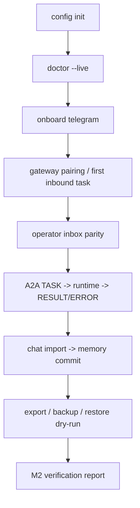

# Implementation Plan: Feature 023 — M2 Integration Acceptance

**Branch**: `codex/feat-023-m2-integration-acceptance` | **Date**: 2026-03-07 | **Spec**: `.specify/features/023-m2-integration-acceptance/spec.md`  
**Input**: `.specify/features/023-m2-integration-acceptance/spec.md` + `research/research-synthesis.md`

---

## Summary

Feature 023 的目标是把 M2 从“一组已交付 Feature”收束成“可被用户验证的日常使用闭环”。

本特性的技术策略不是新增新的产品面，而是采用三层收口：

1. **断点修补层**：只修首次使用链和联合验收所需的最小断点；
2. **联合验收层**：新增四条真实的自动化验收链；
3. **报告层**：沉淀一份 M2 验收矩阵和剩余风险清单。

这样做的目标是：

- 不扩 M2 范围；
- 让用户视角的关键链条真的连起来；
- 让里程碑结论有自动化证据，不依赖口头判断。

---

## Technical Context

**Language/Version**: Python 3.12+、TypeScript 5.x  

**Primary Dependencies**:

- `pytest` / `pytest-asyncio`
- `httpx.AsyncClient` + `ASGITransport`
- `click.testing.CliRunner`
- `aiosqlite`
- 现有 `provider.dx` / `gateway` / `protocol` / `memory` / `core` workspace packages

**Testing Strategy**:

- 首次使用链：CLI + provider service + gateway route + operator action 联合
- operator parity：gateway API / Telegram callback codec / audit chain
- A2A + JobRunner：protocol adapter + orchestrator/runtime + task store
- import / recovery：chat import + memory + backup/export/restore

**Target Platform**: macOS / Linux 本地单项目环境

**Constraints**:

- 不新增新的业务能力
- 不重定义 015-022 的主 contract
- 真实本地组件优先，外部 API 允许替身
- 必须产出验收报告与风险清单

**Scale/Scope**: 单用户、单项目、M2 范围内的验收整合；不覆盖 M3 增强能力

---

## Constitution Check

| Constitution 原则 | 适用性 | 评估 | 说明 |
|---|---|---|---|
| 原则 1: Durability First | 直接适用 | PASS | 023 要验证导入数据、任务、审计、backup/recovery 在同一 durability boundary 内 |
| 原则 2: Everything is an Event | 直接适用 | PASS | operator parity 与 import/recovery 验收都依赖审计事件链 |
| 原则 4: Side-effect Must be Two-Phase | 直接适用 | PASS | restore 仍保持 dry-run，pairing/approval/cancel 继续沿用现有治理链 |
| 原则 6: Degrade Gracefully | 直接适用 | PASS | 外部依赖可替身，联合验收聚焦本地真实组件 |
| 原则 7: User-in-Control | 直接适用 | PASS | 023 明确 owner pairing、operator actions 与 cancel/resume 的主路径 |
| 原则 8: Observability is a Feature | 直接适用 | PASS | 023 最终必须交付验收矩阵与剩余风险报告 |

**结论**: 无硬性冲突，可进入任务拆解与实现。

---

## Project Structure

### 文档制品

```text
.specify/features/023-m2-integration-acceptance/
├── spec.md
├── research.md
├── plan.md
├── data-model.md
├── contracts/
│   └── m2-acceptance-matrix.md
├── tasks.md
├── checklists/
│   └── requirements.md
└── research/
```

### 源码与测试变更布局

```text
octoagent/packages/provider/src/octoagent/provider/dx/
├── config_bootstrap.py          # 统一 config init / doctor / onboarding 首次使用前置
├── config_commands.py           # Telegram channel 最小可操作闭环
├── doctor.py                    # 首次使用前置对齐
├── onboarding_service.py        # onboarding 汇合编排
└── telegram_verifier.py         # 首条消息“入站完成”验证

octoagent/apps/gateway/src/octoagent/gateway/
├── routes/operator_inbox.py     # Web operator action 主路径
├── routes/telegram.py           # Telegram ingress / callback 路由
├── services/operator_actions.py # 审计与同 item 语义
├── services/telegram.py         # pairing / ingress / result notify
├── services/task_runner.py      # interactive execution / cancel / resume
└── services/worker_runtime.py   # runtime 联合验收入口

octoagent/packages/protocol/src/octoagent/protocol/
├── adapters.py                  # A2A TASK/RESULT/ERROR 联合验收入口
└── mappers.py                   # A2AStateMapper / ArtifactMapper

octoagent/tests/integration/
└── test_f023_m2_acceptance.py   # 023 联合验收主测试文件
```

**Structure Decision**: 023 的重心在已有模块之间的编织与验收，不新增独立 app / package。文档聚焦 `.specify/features/023-*`，实现聚焦现有 provider / gateway / protocol / integration tests。

---

## Architecture

### 验收闭环总览



### 核心设计

#### 1. 首次使用闭环修补

职责：把 `config init`、`doctor`、`onboard`、Telegram pairing 与 first inbound task 串成一次可恢复流程。

关键点：

- 统一首次配置前置，不再让 `.env` 缺失成为错误入口分叉
- 把 Telegram 配置纳入可操作闭环
- onboarding 的 first message 以入站证据为完成标准

#### 2. Operator parity 联合验收

职责：证明 Web / Telegram 处理的是同一 operator item，而不是两套平行控制面。

关键点：

- item_id 一致
- 动作全集一致
- 审计事件进入同一 operational task
- 重复动作返回 `already_handled` 等价语义

#### 3. A2A + JobRunner 联合验收

职责：证明协议层与执行层之间没有断层。

关键点：

- `DispatchEnvelope -> A2A TASK -> DispatchEnvelope`
- `WorkerRuntime / TaskRunner` 真实执行
- `RESULT/ERROR` 消息映射
- 至少覆盖一条非成功路径

#### 4. Memory / Import / Recovery 联合验收

职责：证明导入结果真正进入 durability boundary。

关键点：

- `octo import chats`
- memory fragment / fact commit
- `octo export chats`
- `octo backup create`
- `octo restore dry-run`
- recovery summary 证据

#### 5. M2 验收报告

职责：把四条联合验收线与五个 M2 gate 对齐成一份可回看的结论。

关键点：

- 测试命令
- 通过/失败证据
- remaining risks
- out-of-scope

---

## Phase Plan

### Phase 1: 规范与矩阵冻结

目标：先把 023 的边界、验收矩阵和任务拆解固定住，避免实现期范围膨胀。

产物：

- `spec.md`
- `contracts/m2-acceptance-matrix.md`
- `tasks.md`
- `checklists/requirements.md`

### Phase 2: 首次使用断点修补

目标：只修补会阻塞联合验收的三类 DX 断点。

范围：

- `config init` 与 `doctor` 前置对齐
- Telegram channel 配置闭环
- onboarding 的 first inbound verification

### Phase 3: 联合验收测试落地

目标：固定四条自动化联合验收线。

范围：

- first-use
- operator parity
- A2A + runtime
- import / recovery

### Phase 4: 验收报告与回归

目标：运行 023 相关测试和既有回归，形成 M2 结论。

产物：

- 023 验收报告
- 风险清单
- 非目标边界说明

---

## Risks & Tradeoffs

### Tradeoff 1: 使用外部替身 vs 真实联网

- 选择：真实本地组件 + 外部 API 替身
- 原因：023 关注的是本地控制面与 durability chain，不是第三方 API 稳定性

### Tradeoff 2: 修补断点 vs 保持完全只读

- 选择：允许最小修补
- 原因：如果不修补阻塞断点，023 无法交付真正的联合验收

### Tradeoff 3: 单一大测试 vs 四条清晰验收线

- 选择：四条独立联合验收线
- 原因：便于定位回归，也更符合 Feature 023 的 gate mapping

---

## Exit Criteria

023 可视为完成，当且仅当：

1. 四条联合验收线全部具备自动化证据；
2. 首次使用链的关键断点已修补到不阻塞主路径；
3. M2 五个 gate 有明确矩阵映射；
4. 验收报告已列明结论、剩余风险和 out-of-scope。
