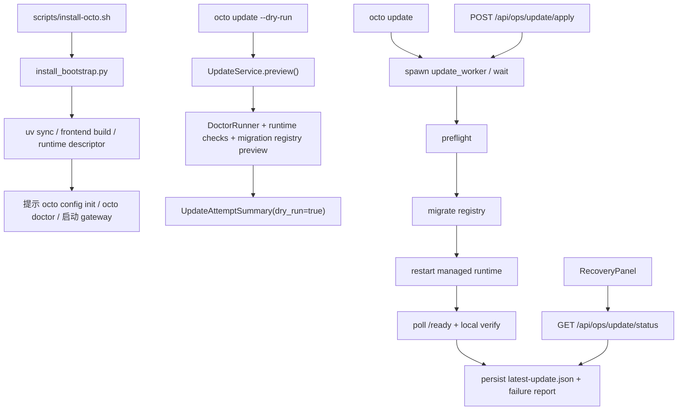

# Implementation Plan: Feature 024 — Installer + Updater + Doctor/Migrate

**Branch**: `codex/feat-024-installer-updater-doctor-migrate` | **Date**: 2026-03-08 | **Spec**: `.specify/features/024-installer-updater-doctor-migrate/spec.md`
**Input**: `.specify/features/024-installer-updater-doctor-migrate/spec.md` + `research/research-synthesis.md`

---

## Summary

Feature 024 为 OctoAgent 增加一条真正可执行的安装与升级主路径：

- `scripts/install-octo.sh`：官方一键安装入口；
- `octo update`：CLI 侧正式升级入口，支持 `--dry-run`；
- `preflight -> migrate -> restart -> verify`：固定阶段化 operator flow；
- `UpgradeFailureReport` + `UpdateAttemptSummary`：失败可诊断、结果可回看；
- Web recovery/ops 面板新增 update / restart / verify 动作与最近一次升级状态。

本特性的技术策略不是“再造一个配置/控制台系统”，而是**复用现有 DX + recovery 基线，补一条 managed operator workflow**：

1. **Installer 只是薄壳，核心逻辑用 Python 实现**  
   对外提供 `scripts/install-octo.sh`，内部委托给 `provider/dx/install_bootstrap.py`。这样既能满足“一键入口”，又能让安装逻辑可测试、可复用。

2. **把可重启能力收敛到 `ManagedRuntimeDescriptor`**  
   024 不依赖 systemd / launchd / Docker supervisor；而是在 `data/ops/managed-runtime.json` 中记录 start/restart/verify 所需的最小 runtime descriptor。installer 负责创建它，CLI 与 Web 共享它。

3. **真实 update 通过 detached worker 执行，避免被 restart 吃掉**  
   Web 场景下，执行 update 的 gateway 进程自己会被 restart，因此真正的 apply 必须由独立 worker 进程执行。CLI 也复用同一 worker，只是默认同步等待完成。

4. **状态持久化采用 `UpdateStatusStore`，与 022 的 recovery store 并列**  
   不扩展 022 的 `RecoveryStatusStore` 语义，而是新增 `UpdateStatusStore`，让 recovery 状态与 update 状态既可组合展示，又不互相污染。

5. **restart 仅保证“managed install”真实可执行；非 managed runtime fail-closed**  
   024 的 Web update/restart/verify 会在 UI 中统一暴露，但只有 installer 创建的 managed runtime 保证支持真正 restart。未托管安装返回结构化 `ACTION_REQUIRED` / `UNMANAGED_RUNTIME`，符合 `Degrade Gracefully`。

这样可以同时满足三个目标：
- 用户有一条官方安装入口，不再从 README 手工拼装；
- CLI 与 Web 共享同一套 update/restart/verify contract；
- 024 不提前吞并 025/026 的 Project / Secret / Session / Scheduler 范围。

---

## Technical Context

**Language/Version**: Python 3.12+, TypeScript 5.x

**Primary Dependencies**:
- `click` / `rich`（已有）— CLI 命令组与用户摘要输出
- `filelock`（已有）— `UpdateStatusStore` / runtime descriptor 原子写
- `httpx`（已有）— verify 阶段轮询 `/ready`
- `FastAPI`（已有）— Web ops API 扩展
- `React 19 + Vite`（已有）— RecoveryPanel 扩展
- Python stdlib `subprocess` / `signal` / `json` / `pathlib`

**Storage**:
- `data/ops/managed-runtime.json` — managed runtime descriptor
- `data/ops/runtime-state.json` — 当前 gateway 运行态快照（pid / started_at / verify_url）
- `data/ops/latest-update.json` — 最近一次 canonical update attempt
- `data/ops/active-update.json` — 当前运行中的 attempt（若存在）
- `data/ops/update-history/` — 可选的 attempt 历史快照

**Testing**:
- `pytest`
- `pytest-asyncio`
- `click.testing.CliRunner`
- `httpx.AsyncClient`
- `subprocess` / `signal` monkeypatch

**Target Platform**: 本地单机 / 单实例 OctoAgent 项目目录

**Performance Goals**:
- `octo update --dry-run` 在健康实例上应于 5 秒内返回结构化 preflight 结果
- Web `GET /api/ops/update/status` 应为纯状态读取，无长耗时副作用
- verify 阶段默认在 30 秒内给出 pass/fail 结论

**Constraints**:
- 不在 024 内引入 Project/Workspace、Secret Store、配置中心、Session Center、Scheduler、Memory Console
- 不做多节点 / 零停机升级
- 不要求 systemd / launchd / Docker compose 成为唯一 runtime manager
- 不把 restart 逻辑硬编码到平台专有 supervisor；MVP 用 managed runtime descriptor 驱动

**Scale/Scope**: 单用户、单项目、单实例的安装/升级/重启/验证闭环

---

## Constitution Check

| Constitution 原则 | 适用性 | 评估 | 说明 |
|---|---|---|---|
| 原则 1: Durability First | 直接适用 | PASS | update 状态、失败报告、runtime descriptor 都持久化到 `data/ops` |
| 原则 2: Everything is an Event | 间接适用 | PASS | 024 至少保证 update lifecycle 有结构化状态源；如需事件化可在实现中补到现有审计链 |
| 原则 4: Side-effect Must be Two-Phase | 直接适用 | PASS | `octo update --dry-run` 是 preflight preview，真实 apply 必须显式触发 |
| 原则 5: Least Privilege by Default | 直接适用 | PASS | runtime descriptor 只保存命令/路径/verify URL，不保存明文 secrets |
| 原则 6: Degrade Gracefully | 直接适用 | PASS | 未托管 runtime、缺 descriptor、verify 不通时都返回结构化失败而不是崩溃 |
| 原则 7: User-in-Control | 直接适用 | PASS | CLI 与 Web 都能看到阶段、失败点和恢复建议 |
| 原则 8: Observability is a Feature | 直接适用 | PASS | RecoveryPanel 与 CLI 共享 attempt/failure summary |
| 原则 11: Context Hygiene | 间接适用 | PASS | 024 只处理 runtime / update 元数据，不把 secrets 或大日志塞进状态摘要 |

**结论**: 无硬性冲突，可进入任务拆解。

---

## Project Structure

### 文档制品

```text
.specify/features/024-installer-updater-doctor-migrate/
├── spec.md
├── plan.md
├── data-model.md
├── contracts/
│   ├── install-entrypoint.md
│   ├── update-cli.md
│   ├── ops-update-api.md
│   └── update-report.md
├── tasks.md
├── checklists/
└── research/
```

### 源码变更布局

```text
octoagent/scripts/
└── install-octo.sh                         # 官方一键安装入口（薄壳）

octoagent/packages/core/src/octoagent/core/models/
├── __init__.py
└── update.py                              # UpdateAttempt / Phase / FailureReport / RuntimeDescriptor

octoagent/packages/provider/src/octoagent/provider/dx/
├── cli.py                                 # 注册 update / restart / verify 命令
├── install_bootstrap.py                   # installer Python 核心逻辑
├── update_commands.py                     # `octo update` / `octo restart` / `octo verify`
├── update_service.py                      # preflight / migrate / restart / verify orchestration
├── update_status_store.py                 # latest/active attempt + runtime descriptor 持久化
└── update_worker.py                       # detached worker，跨 restart 执行真实 apply

octoagent/apps/gateway/src/octoagent/gateway/
├── main.py                                # 启动时写 runtime-state
└── routes/ops.py                          # update/restart/verify/status API

octoagent/frontend/src/
├── api/client.ts                          # 新增 update/restart/verify/status API client
├── types/index.ts                         # UpdateAttemptSummary / UpgradeFailureReport 类型
└── components/RecoveryPanel.tsx           # 扩展 update 区块与状态轮询

octoagent/packages/provider/tests/
├── test_install_bootstrap.py
├── test_update_commands.py
├── test_update_service.py
└── test_update_status_store.py

octoagent/apps/gateway/tests/
├── test_ops_api.py
└── test_main.py
```

**Structure Decision**:
- shared contract 放在 `core.models`，这样 provider/gateway/frontend 类型都有清晰单一事实源；
- orchestration 放在 `provider/dx`，延续 014/015/022 的 operator-facing DX 边界；
- gateway 与 frontend 只消费 update contract，不复制业务逻辑。

---

## Architecture

### 流程图



### 核心模块设计

#### 1. `install_bootstrap.py` + `scripts/install-octo.sh`

职责：提供 024 的官方安装入口。

策略：
- shell 薄壳仅做 `cd` / `exec uv run python -m ...`；
- 真实检查与写文件逻辑全部在 Python 中完成；
- 成功后生成 `ManagedRuntimeDescriptor`，供后续 `octo update` / Web restart 使用。

设计理由：
- shell 入口满足“单条命令安装”；
- Python 内核更易测试与复用。

#### 2. `UpdateStatusStore`

职责：持久化 024 的 canonical update state。

建议文件：
- `managed-runtime.json`
- `runtime-state.json`
- `latest-update.json`
- `active-update.json`

设计理由：
- 复用 022 `RecoveryStatusStore` 的 JSON + lock 模式；
- 不把 update 状态强行塞进 recovery summary。

#### 3. `UpdateService`

职责：聚合 preflight / migrate / restart / verify 的领域编排。

关键策略：
- `preview()` 只读，无副作用；
- `apply()` 写 `active-update.json`，并按阶段更新；
- preflight 复用 `DoctorRunner.run_all_checks(live=False)`；
- migrate 通过版本化 registry 执行，首批只覆盖 `uv sync` / `octo config migrate` / 前端 build / runtime metadata sync；
- restart 只在 managed runtime 上执行真实动作；
- verify 通过 `/ready` 轮询 + doctor 摘要二次确认。

#### 4. `update_worker.py`

职责：让真实 apply 跨 restart 存活。

实现策略：
- 独立子进程读取 `ManagedRuntimeDescriptor` 与 `UpdateAttempt`
- 执行 migrate
- 停止旧 pid / 触发 restart
- 轮询 verify URL，写最终结果

设计理由：
- Web 触发 update 时，当前 gateway 进程不能承担整个生命周期；
- detached worker 是最小可测、最不依赖外部 supervisor 的方案。

#### 5. Gateway `ops.py` 与 RecoveryPanel 扩展

职责：把 update / restart / verify 接到已有 recovery 面板。

策略：
- 不新建第二个 console 页面；
- 新增 `GET /api/ops/update/status`
- 新增 `POST /api/ops/update/dry-run`
- 新增 `POST /api/ops/update/apply`
- 新增 `POST /api/ops/restart`
- 新增 `POST /api/ops/verify`

设计理由：
- 保持 022 的 recovery 面板投资不浪费；
- 024 的 Web 范围严格限定在现有入口增量扩展。

---

## 关键设计决策

### D1. 用 `ManagedRuntimeDescriptor` 取代平台专有 supervisor 假设

原因：
- 当前仓库没有 systemd / launchd / Docker orchestrator 抽象层；
- 024 仍然需要真正的 restart / verify；
- descriptor 模式能让 installer、CLI、Web 使用同一份 runtime 事实源。

### D2. 真实 update 必须由 detached worker 执行

原因：
- Web 场景下 current gateway 进程会被 restart；
- 直接在路由请求内做 update 会在 restart 阶段自杀；
- worker 既可服务 Web，也可服务 CLI。

### D3. preflight 只做 `doctor --live` 之外的本地健康检查

原因：
- 普通 update 不应被外网或真实 provider/token 卡死；
- 024 的 verify 目标是“本实例升级后可运行”，不是“外部依赖全部实时健康”；
- 必要时仍可把 `doctor --live` 作为建议动作而不是硬阻塞。

### D4. 非 managed runtime 必须 fail-closed，而不是假装 restart 成功

原因：
- 当前很多手工运行方式并没有可恢复的启动命令；
- 对未托管实例，最安全的行为是输出结构化 `ACTION_REQUIRED` / `UNMANAGED_RUNTIME`；
- 这样既保留 Web 入口，又不制造虚假的成功状态。

---

## Testing Strategy

### 单元测试

- `install_bootstrap.py`
  - 依赖缺失 / 目录不可写 / 已有 descriptor / 幂等执行
- `UpdateStatusStore`
  - 原子写、损坏文件降级、latest/active attempt 读写
- `UpdateService.preview()`
  - dry-run 无副作用、doctor 阻塞、runtime 缺失、迁移预览
- migration registry
  - registry 顺序、幂等跳过、失败短路

### 集成测试

- `octo update --dry-run`
  - 成功路径、阻塞路径、命令退出码
- `octo verify`
  - `/ready` pass/fail、超时、错误提示
- gateway ops API
  - `GET /api/ops/update/status`
  - `POST /api/ops/update/dry-run`
  - `POST /api/ops/restart`
  - `POST /api/ops/verify`

### 回归验证

- 022 recovery summary 现有 API 不回归
- RecoveryPanel 原有 backup/export 动作不回归
- `octo doctor` / `octo config migrate` 现有行为不回归

---

## Implementation Notes

- installer 入口优先落在 `octoagent/scripts/install-octo.sh`，不新增仓库根散落脚本
- `UpdateStatusStore` 优先复用 `RecoveryStatusStore` 的锁文件与 JSON 持久化风格
- `UpdateAttemptSummary` 作为 Web UI 主消费对象；失败时附带 `UpgradeFailureReport`
- RecoveryPanel 在 update 进行中使用轻量轮询，不引入新的 SSE 通道

---

## Open Risks

1. **restart 的可移植性**  
   不同启动方式下 restart 差异较大；024 通过 managed runtime descriptor 缩小支持面，但仍需在测试中覆盖“unmanaged runtime”降级路径。

2. **worker 与当前进程的竞态**  
   update worker、旧 gateway 进程、新 gateway 进程之间存在交接窗口，需要明确 `active-update.json` 的状态机。

3. **frontend build 的成本**  
   若 update 强制重装前端依赖，执行时间会明显变长；MVP 应将前端 build 作为 registry step，可按条件跳过。

4. **历史实例兼容**  
   老项目没有 runtime descriptor，Web update/restart 只能给出结构化 action required；文案与状态码必须清晰，避免误导。
