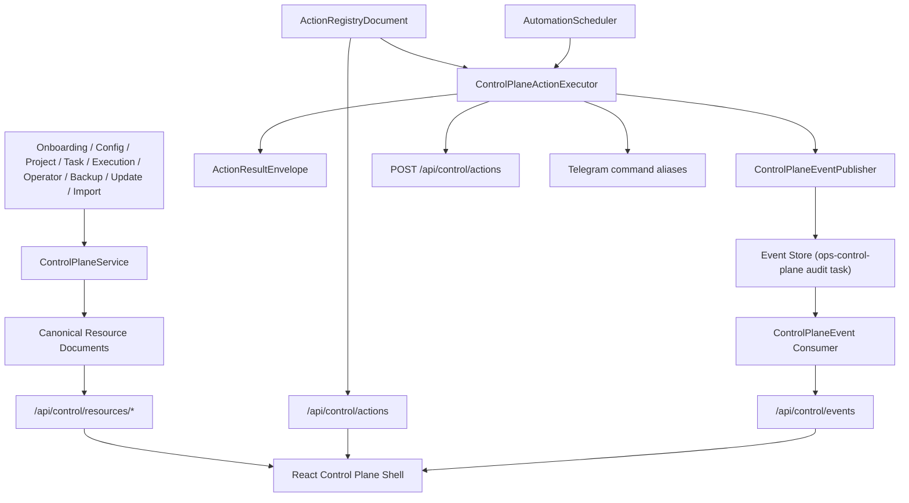

# Implementation Plan: Feature 026 — Control Plane Delivery

**Branch**: `codex/feat-026-control-plane` | **Date**: 2026-03-08 | **Spec**: `.specify/features/026-control-plane-contract/spec.md`  
**Input**: `.specify/features/026-control-plane-contract/spec.md` + `research/*.md`

## Summary

Feature 026 采用“先 contract、后 producer、再 shell”的路线：

1. 以 026-A 已冻结 contract 为上游，在 `packages/core` 定义正式 control-plane documents / envelopes / automation models；
2. 在 Gateway 落 `ControlPlaneService + ActionRegistry + ActionExecutor + EventPublisher + AutomationScheduler`，把 onboarding/config/project/task/execution/operator/backup/update/import 统一适配成 canonical producer；
3. 在 React 前端落正式 control plane shell，所有页面只消费 `/api/control/*`，并把旧 `TaskList/TaskDetail` 退化成 Session/Task detail 子视图；
4. 在 Telegram 入口增加 command alias 解析，统一走 action registry；
5. 用 backend API、projection、frontend integration、e2e 四层测试锁住语义。

## Technical Context

**Language/Version**: Python 3.12, TypeScript 5.8, React 19  
**Primary Dependencies**: FastAPI, aiosqlite, APScheduler, Pydantic v2, structlog, filelock, React Router, Vite  
**Storage**: SQLite WAL（task/event/project） + project-root JSON stores（wizard/control-plane state/automation jobs） + `octoagent.yaml` + `.env*`  
**Testing**: pytest, ruff, npm build, vitest + jsdom（新增）, Gateway e2e pytest  
**Target Platform**: 单实例本地 Gateway + Web Control Plane + Telegram channel  
**Project Type**: uv workspace monorepo + Vite frontend  
**Performance Goals**:
- control-plane snapshot 在单机 1000 级 tasks 下维持可接受响应（秒级内）
- automation scheduler 重启后秒级恢复
- Web 首屏加载仅一次 snapshot + 后续轻量 polling  
**Constraints**:
- 不得重定义 026-A canonical semantics
- 兼容 025-A default project baseline
- Secret 实值不得出现在 config/control-plane docs/frontend cache
- frontend 不得绕过 backend canonical producer
- side-effect 动作必须复用现有 service 审计路径  
**Scale/Scope**: 单实例控制台产品化 + Telegram/Web action unification

## Constitution Check

- **Durability First**: 通过。automation jobs、selected project/workspace、wizard session、action audit 和 control-plane events 都必须可恢复。
- **Everything is an Event**: 通过。control-plane action/resource 进入统一 audit event 路径，diagnostics/automation 消费相同事件。
- **Least Privilege by Default**: 通过。敏感配置仍以 env ref 表达；审批动作复用 `PolicyEngine/ApprovalManager`。
- **Degrade Gracefully**: 通过。未实现或 unavailable 的子域通过 resource-level `degraded/unavailable` 表达，不让整个控制面失效。
- **User-in-Control**: 通过。取消、重试、审批、项目切换、配置修改、automation pause/resume 都进入统一控制台。
- **Observability is a Feature**: 通过。Diagnostics Console 与 ControlPlaneEvent 成为正式产品面。

## Project Structure

### Documentation (this feature)

```text
.specify/features/026-control-plane-contract/
├── spec.md
├── plan.md
├── tasks.md
├── data-model.md
├── contracts/
│   └── control-plane-api.md
├── research/
│   ├── product-research.md
│   ├── tech-research.md
│   ├── online-research.md
│   └── research-synthesis.md
├── checklists/
│   └── requirements.md
└── verification/
    └── verification-report.md
```

### Source Code

```text
octoagent/
├── packages/core/src/octoagent/core/
│   ├── models/
│   │   ├── control_plane.py
│   │   ├── execution.py
│   │   ├── project.py
│   │   └── payloads.py
│   └── store/
│       └── sqlite_init.py
├── packages/provider/src/octoagent/provider/dx/
│   ├── config_schema.py
│   ├── config_wizard.py
│   ├── onboarding_service.py
│   ├── onboarding_store.py
│   ├── backup_service.py
│   ├── chat_import_service.py
│   ├── telegram_pairing.py
│   ├── update_service.py
│   ├── doctor.py
│   ├── control_plane_state.py
│   └── automation_store.py
├── apps/gateway/src/octoagent/gateway/
│   ├── routes/
│   │   ├── control_plane.py
│   │   ├── execution.py
│   │   ├── operator_inbox.py
│   │   ├── ops.py
│   │   └── telegram.py
│   ├── services/
│   │   ├── control_plane.py
│   │   ├── control_plane_actions.py
│   │   ├── control_plane_events.py
│   │   ├── automation_scheduler.py
│   │   ├── execution_console.py
│   │   ├── operator_actions.py
│   │   ├── operator_inbox.py
│   │   ├── task_runner.py
│   │   └── telegram.py
│   └── main.py
└── frontend/
    └── src/
        ├── App.tsx
        ├── api/
        ├── components/
        ├── hooks/
        ├── pages/
        └── types/
```

**Structure Decision**:
- canonical documents / envelopes 放 `packages/core`，保证 Web/Telegram/backend 都共享同一模型；
- project-root durable state（selected project、automation jobs）放 `packages/provider/dx` 的 file store，复用当前 onboarding/telegram pairing 的工程习惯，避免引入不必要的 DB 横切；
- Gateway 负责 canonical producer / scheduler / action executor / routes；
- frontend 以 control-plane shell 和 resource consumers 为核心，不新增平行 DTO。

## Architecture



## Backend / Frontend Boundary

### Backend owns

- canonical resource projection
- contract compatibility metadata
- action registry
- action execution / policy / approval / audit
- automation scheduling and persistence
- control-plane event production

### Frontend owns

- shell/navigation/layout
- schema/uiHints rendering within supported capability
- action form UX and polling
- resource/event presentation

### Explicit non-goals for frontend

- 不得自造 canonical field
- 不得本地修改 project/session/automation projection
- 不得绕过 action executor 直连 side-effect services

## Implementation Phases

### Phase 1 — Contract Producer Foundation

- 新增 `control_plane.py` core models
- 扩展 `EventType` / payloads，承接 control-plane audit events
- 新增 selected-project / automation file stores
- 新增 `ControlPlaneService` / `ActionRegistry` / `ActionExecutor`

### Phase 2 — Resource Producers & Routes

- 落六类 resource document producers
- 落 `/api/control/resources/*`、`/api/control/actions`、`/api/control/events`、`/api/control/snapshot`
- 把旧 execution/operator/ops routes 退化为 adapter / detail API

### Phase 3 — Automation & Event Path

- automation job persistence / restore / schedule / run history
- control-plane event publisher / consumer
- deferred correlation for long-running actions

### Phase 4 — Telegram / Web Shared Semantics

- Telegram command alias parser -> action registry
- Web action dispatcher -> same action registry
- unify result rendering / unsupported/degraded semantics

### Phase 5 — Formal Web Control Plane

- app shell + navigation
- dashboard/projects/sessions/operator/automation/diagnostics/config/channels pages
- schema-driven config renderer
- session center + operator console + diagnostics console

### Phase 6 — Verification & Sync

- backend API/projection tests
- frontend integration tests
- e2e flow tests
- blueprint / m3 split sync
- verification report

## Design Gate Decision

本轮用户明确要求“消费 026-A contract，完成 026 后续全部范围”，因此设计门禁的关键不是“是否缩 scope”，而是“实现必须不偏离 frozen contract”。本 plan 选择：

- 允许对 frozen contract 做 additive producer fields
- 不新增替代 resource type / action semantics
- 用 file-store 持久化 `control-plane state` 与 `automation jobs`，避免在 026 内再引入新的数据库域迁移
- Memory/Vault 只做入口集成，不做领域浏览

该决策不需要额外用户确认，可继续实施。

## Complexity Tracking

| 决策 | 为什么需要 | 拒绝的更简单方案 |
|---|---|---|
| 增加 control-plane 专用 core models | 防止旧 route DTO 继续外泄 | 直接返回现有 route payload，会再次形成多套语义 |
| action executor 复用现有 service，而不是重复实现 side effects | 保持审计与政策路径一致 | 前端直连旧 REST route 或 service，会绕开统一 request/result/event 语义 |
| automation 使用持久化 store + APScheduler 恢复 | M3 要求 automation 产品化 | 只做前端面板而不做持久化，会失去产品对象意义 |
| 前端引入基础测试框架 | 026 之后 UI 复杂度显著提升 | 只靠 `npm build` 无法锁定交互回归 |
