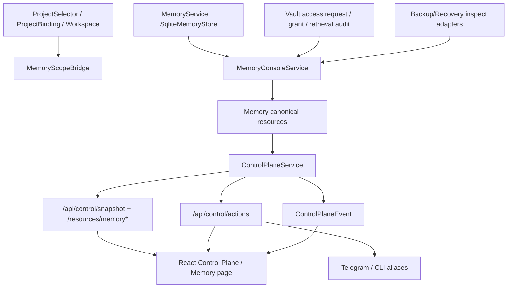

# Implementation Plan: Feature 027 — Memory Console + Vault Authorized Retrieval

**Branch**: `codex/feat-027-memory-console-vault` | **Date**: 2026-03-08 | **Spec**: `.specify/features/027-memory-console-vault-authorized-retrieval/spec.md`  
**Input**: `.specify/features/027-memory-console-vault-authorized-retrieval/spec.md` + `research/*.md`

## Summary

Feature 027 采用“**020 治理内核不动、026 控制面扩展、027 新增投影/授权/审计层**”的路线：

1. 在 `packages/memory` 继续复用 `WriteProposal -> validate_proposal() -> commit_memory()`、SoR current 唯一约束、Vault default deny，不重写权威事实模型；
2. 在 `packages/core` / `apps/gateway` 新增 Memory canonical resources、actions、events，把 Memory/Vault 正式接入现有 control plane；
3. 在 `packages/memory` 或其配套 store/service 中新增 Vault 授权申请、授权记录、检索审计与 proposal 审计查询能力；
4. 在 `packages/provider/dx` 增加 project/workspace 到 memory scope 的桥接与 export/restore inspect adapter，复用 022 的 backup/recovery 思路；
5. 在 `frontend` 的现有 Control Plane 中新增 Memory 页面，展示浏览、subject history、Vault 授权、proposal audit 与 export/restore verify 入口。

整体策略是：**Memory 仍由 020 负责“真相”，027 只把“解释、授权、审计、校验”产品化。**

## Technical Context

**Language/Version**: Python 3.12, TypeScript 5.8, React 19  
**Primary Dependencies**: FastAPI, Pydantic v2, aiosqlite, filelock, structlog, React Router, Vite, existing provider/core/memory packages  
**Storage**:
- SQLite WAL（沿用 `store_group.conn`，扩展 `packages/memory` schema 与必要的 control-plane audit/event）
- project-root durable state（沿用 `data/control-plane` / `data/ops` 风格，仅保存校验摘要或缓存时使用）
- 现有 event store（control-plane action/event audit）  
**Testing**: pytest, ruff, vitest/jsdom, frontend build, gateway integration/e2e  
**Target Platform**: 单实例本地 Gateway + Web Control Plane + Telegram/CLI alias consumer  
**Project Type**: uv workspace monorepo + Vite frontend  
**Performance Goals**:
- Memory overview / subject history 在单 project、千级 memory records 下维持秒级响应
- Vault 授权与检索动作在同步路径内返回结构化结果，长查询时可 deferred
- 首屏 snapshot 保持可接受体积；Memory 详细视图按需单独请求  
**Constraints**:
- 不得旁路 020 治理内核
- 不得重做 026 控制台与 `/api/control/*` canonical API
- 未授权时不得暴露 Vault 原文
- 028 只允许消费 027 contract 与 integration points，不引入 MemU 深度语义
- export inspect / restore verify 只做检查，不直接写权威事实  
**Scale/Scope**: 单实例、project-aware、operator-facing Memory/Vault 产品面

## Constitution Check

- **Durability First**: 通过。Vault 授权申请、授权决议、检索审计与 export/restore 校验摘要都必须落盘；不能只停留在内存态。
- **Everything is an Event**: 通过。Vault 授权、Vault 检索、proposal 审计读取、inspect/verify 动作都进入现有 control-plane audit/event 路径。
- **Least Privilege by Default**: 通过。Vault 默认 deny 保持不变；资源层默认只暴露 redacted summary。
- **Degrade Gracefully**: 通过。backend/index/evidence 缺失时，Memory Console 仍应给出 degraded/warnings，而不是整个控制面不可用。
- **User-in-Control**: 通过。敏感内容访问必须先申请/批准；export/restore 先 inspect/verify，不做 silent write。
- **Observability is a Feature**: 通过。proposal audit、vault retrieval audit、subject history 都属于 operator-facing 可解释面。

## Project Structure

### Documentation (this feature)

```text
.specify/features/027-memory-console-vault-authorized-retrieval/
├── spec.md
├── plan.md
├── tasks.md
├── data-model.md
├── contracts/
│   ├── memory-console-api.md
│   ├── vault-authorization-api.md
│   ├── memory-export-restore.md
│   └── memory-permissions.md
├── research/
│   ├── product-research.md
│   ├── tech-research.md
│   ├── research-synthesis.md
│   └── online-research.md
├── checklists/
│   └── requirements.md
└── verification/
    └── verification-report.md
```

### Source Code

```text
octoagent/
├── packages/
│   ├── core/
│   │   └── src/octoagent/core/models/
│   │       ├── control_plane.py
│   │       ├── payloads.py
│   │       └── __init__.py
│   ├── memory/
│   │   └── src/octoagent/memory/
│   │       ├── enums.py
│   │       ├── models/
│   │       │   ├── common.py
│   │       │   ├── proposal.py
│   │       │   ├── sor.py
│   │       │   ├── vault.py
│   │       │   └── __init__.py
│   │       ├── service.py
│   │       └── store/
│   │           ├── sqlite_init.py
│   │           ├── memory_store.py
│   │           └── protocols.py
│   └── provider/
│       └── src/octoagent/provider/dx/
│           ├── project_selector.py
│           ├── backup_service.py
│           ├── onboarding_service.py
│           ├── memory_console_service.py      # new
│           ├── memory_scope_bridge.py         # new
│           └── memory_recovery_service.py     # new
├── apps/gateway/src/octoagent/gateway/
│   ├── routes/
│   │   └── control_plane.py
│   ├── services/
│   │   └── control_plane.py
│   └── main.py
└── frontend/src/
    ├── api/client.ts
    ├── pages/ControlPlane.tsx
    ├── pages/ControlPlane.test.tsx
    ├── types/index.ts
    └── index.css
```

**Structure Decision**:

- `packages/memory` 继续承担 domain truth、SQLite schema 和授权/审计原语；
- `packages/provider/dx` 负责 project/workspace 到 memory scope 的桥接，以及 export/restore inspect adapter；
- `apps/gateway/services/control_plane.py` 继续作为 Memory canonical producer / action executor；
- `frontend` 继续只消费 control-plane resources，不引入 memory 私有 DTO。

## Architecture



## Design Decisions

### 1. 授权记录落在 memory schema，而不是前端缓存或临时 JSON

原因：

- 授权链属于 Memory 领域事实，且需要 durable audit
- 与 `proposal / sor / vault` 共用查询条件与 scope/subject 维度
- 便于 restore verify / export inspect 统一检查

### 2. `scope_id -> project/workspace` 通过 bridge/projection 显式解析

原因：

- 020 的存储主键仍然是 `scope_id`
- 025-B 已把 project/workspace 固化为 operator 主心智
- 不应通过 UI 猜测 `scope_id`，必须由后端根据 `ProjectBinding(type=MEMORY_SCOPE|SCOPE|IMPORT_SCOPE)` 统一解析

### 3. export/restore 复用 022 的 preview-first 思路

原因：

- 027 只交付 inspect/verify 入口，不应开启 destructive restore
- 022 已经有 bundle/manifest/restore dry-run 设计基线
- 027 应把 Memory 领域对象纳入检查和摘要，而不是再造一条恢复链

## Implementation Phases

### Phase 1 — Foundational Models & Memory Durable Schema

- 扩展 `packages/memory` 的枚举、公共模型、store 协议与 SQLite schema
- 新增 Vault 授权申请/授权决议/检索审计持久化对象
- 补 `list_proposals`、多条件 query、subject history、authorization query 等 store 方法
- 扩展 `packages/core` 的 control-plane canonical models 与 action/result/event payloads

### Phase 2 — Scope Bridge & Projection Services

- 实现 `MemoryScopeBridge`，把 project/workspace 与底层 scope 关联起来
- 实现 `MemoryConsoleService`，生产 memory overview、subject history、proposal audit、vault authorization documents
- 建立对 orphan scope / degraded evidence 的明确表达

### Phase 3 — Vault Authorization & Retrieval Chain

- 定义 `vault.access.request / resolve / retrieve` 动作与结果码
- 复用现有 operator/policy/control-plane audit 路径
- 保证未授权时 fail-closed、授权后带检索审计和证据链

### Phase 4 — Export / Inspect / Restore Verify

- 基于 022 backup/recovery 基线，为 Memory 增加 export inspect / restore verify adapter
- 输出结构化检查结果与 remediation，不执行 destructive restore
- 将 inspect/verify 接入 control-plane actions 和资源 refs

### Phase 5 — Gateway Control Plane Integration

- 扩展 `ControlPlaneService`、snapshot、per-resource routes、action registry、event emission
- 新增 Memory 相关 canonical resources 与 actions
- 保证 Web/Telegram/CLI 共语义消费

### Phase 6 — Web Memory Console

- 在现有 `ControlPlane.tsx` 中新增 Memory section
- 落地浏览器、subject history、proposal audit、vault authorization panel、inspect/verify 入口
- 保持移动端与 redaction UX 可用

### Phase 7 — Verification & Docs Sync

- 补 memory 单元、API、integration、frontend integration、e2e 测试
- 回写 verification report
- 如有必要同步 `docs/blueprint.md` / `docs/m3-feature-split.md` 的 027 交付事实

## Design Gate Decision

本轮用户已批准 027 的 spec 范围，因此设计门禁的关键点不是再缩 scope，而是锁定两条不允许漂移的边界：

- 020 是唯一 Memory 治理 truth
- 026 是唯一 control-plane contract / shell

本 plan 已把这两条边界固化为结构决策，因此可以进入任务拆解和一致性分析。

## Complexity Tracking

| 决策 | 为什么需要 | 拒绝的更简单方案 |
|---|---|---|
| 在 `packages/memory` 增加授权/检索审计表 | 需要 durable、可查询、可恢复的授权链 | 只放 JSON 或前端状态，重启后丢失且难以校验 |
| 新增 `MemoryScopeBridge` | 025-B 的 project/workspace 与 020 的 scope_id 需要显式桥接 | 让 UI 猜 scope 所属，会造成 project 语义漂移 |
| 在 control plane 中新增 Memory canonical resources | 027 要复用 026，而不是旁路 | 单独做 memory API 会再分叉 canonical contract |
| export/restore 只做 inspect/verify | 避免越界到 destructive restore | 直接做 restore apply 会突破 027 范围和安全门禁 |
