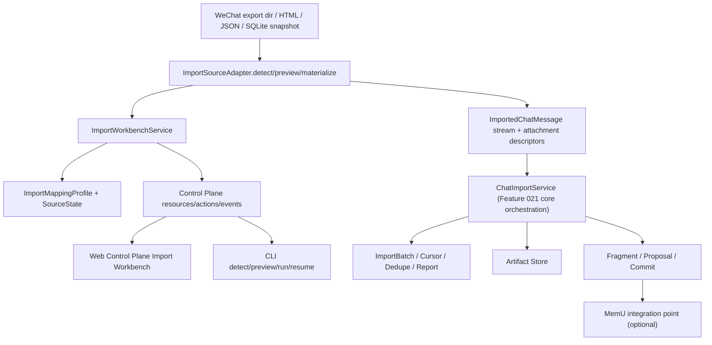

# Implementation Plan: Feature 029 — WeChat Import + Multi-source Import Workbench

**Branch**: `codex/feat-029-wechat-import-workbench` | **Date**: 2026-03-08 | **Spec**: `.specify/features/029-wechat-import-workbench/spec.md`  
**Input**: `.specify/features/029-wechat-import-workbench/spec.md` + `research/*.md`

## Summary

Feature 029 不重写 021 的导入内核，而是在既有基线上新增三层能力：

1. **Source Adapter Layer**
   - 为 WeChat 及未来多源导入定义统一 detect / preview / materialize contract
   - 首个落地 WeChat adapter，默认消费用户提供的本地离线导出物
2. **Import Workbench Projection Layer**
   - 把 detect、mapping、dry-run、dedupe、recent runs、resume、warnings/errors 提升为 control-plane canonical resources / actions
   - 让 Web Control Plane 成为普通用户主路径，同时保留 CLI 等价入口
3. **Attachment + Memory Effect Layer**
   - 将多源附件稳定 materialize 到 artifact store
   - 为 fragment / proposal / MemU integration point 提供有 provenance 的输入
   - 保持任何权威事实写入继续经过 `WriteProposal -> validate -> commit`

技术路线是“**复用既有治理链，补齐 source-specific 解析与产品层工作台**”：

- 021 继续处理 batch/cursor/dedupe/window/report/proposal/artifact/event
- 025 继续提供 project/workspace 语义与绑定目标
- 026 继续提供 control-plane shell、resource/action/event 框架
- 027 继续承接 Memory/Proposal/Vault 领域解释面
- 028 只提供 MemU integration point，不反向定义 029 语义

## Technical Context

**Language/Version**: Python 3.12, TypeScript 5.8, React 19  
**Primary Dependencies**:
- `octoagent-memory`（既有）— 021 import core、020/027 memory governance
- `octoagent-core`（既有）— control-plane documents、event/artifact/task models
- `FastAPI` / `Pydantic v2` / `aiosqlite`（既有）
- `React + Vite + vitest`（既有 control-plane frontend）
- 可选外部适配依赖：本轮尽量保持零新增重量运行时依赖，优先解析用户提供的离线导出物

**Storage**:
- 主 SQLite：继续复用 `octoagent.db`
- Artifact Store：继续复用 `data/artifacts`
- provider DX durable state：用于 mapping profile / source state / workbench projection index
- 不新建平行生产数据库

**Testing**:
- `pytest` / `pytest-asyncio`
- gateway control-plane API / integration tests
- frontend vitest integration
- 必要 e2e（以 detect/preview/run/resume 主路径为主）

**Target Platform**: 单实例本地 OctoAgent（CLI + Gateway + Web Control Plane）

**Performance Goals**:
- detect / preview 对中等规模离线导出物保持秒级返回可接受摘要
- dry-run 不产生副作用
- resume 不重复 materialize 已成功写入的消息和附件
- MemU 不可用时，导入仍以 artifact/fragment-only 完成

**Constraints**:
- 不绕过 021 import core / 020 memory governance
- 不重做 026 control-plane framework
- 不把 031 的最终 M3 acceptance 范围提前吞并
- secret / token / 本地导出敏感原文不得进入日志、事件或 LLM 上下文

**Scale/Scope**: 单用户、单实例、多源导入工作台；首个 source 为 WeChat

## Constitution Check

| Constitution 原则 | 适用性 | 评估 | 说明 |
|---|---|---|---|
| Durability First | 直接适用 | PASS | mapping、recent runs、resume entries、import reports 都必须可恢复 |
| Everything is an Event | 直接适用 | PASS | detect/run/resume 的关键动作与结果需进入 control-plane / import 审计链 |
| Tools are Contracts | 直接适用 | PASS | source adapter contract、workbench API、attachment pipeline 必须冻结 |
| Side-effect Must be Two-Phase | 直接适用 | PASS | detect/preview/mapping 先行，真实导入后执行 |
| Least Privilege by Default | 直接适用 | PASS | 离线导出物解析优先，不默认接管线上账号或设备；敏感附件只进 artifact/ref |
| Degrade Gracefully | 直接适用 | PASS | MemU / 部分附件解析失败时必须降级，不阻断主导入 |
| User-in-Control | 直接适用 | PASS | workbench 要先预览、可修正、可 resume |
| Observability is a Feature | 直接适用 | PASS | 导入报告、warnings/errors、recent runs、memory effects 都是正式产品对象 |

**结论**: 无硬性冲突，可进入任务分解。

## Project Structure

### Documentation

```text
.specify/features/029-wechat-import-workbench/
├── spec.md
├── plan.md
├── data-model.md
├── tasks.md
├── contracts/
│   ├── import-source-adapter.md
│   ├── import-workbench-api.md
│   ├── import-mapping-profile.md
│   └── import-attachment-pipeline.md
├── checklists/
│   └── requirements.md
└── verification/
    └── verification-report.md
```

### Source Code

```text
octoagent/
├── packages/memory/src/octoagent/memory/imports/
│   ├── models.py
│   ├── service.py
│   ├── store.py
│   └── source_adapters/
│       ├── __init__.py
│       ├── base.py
│       └── wechat.py
├── packages/provider/src/octoagent/provider/dx/
│   ├── chat_import_service.py
│   ├── chat_import_commands.py
│   ├── import_workbench_service.py
│   ├── import_mapping_store.py
│   └── import_source_store.py
├── packages/core/src/octoagent/core/models/
│   └── control_plane.py
├── apps/gateway/src/octoagent/gateway/services/
│   └── control_plane.py
└── frontend/src/
    ├── api/client.ts
    ├── types/index.ts
    └── pages/ControlPlane.tsx
```

**Structure Decision**:
- source adapter 落在 `packages/memory/imports/source_adapters`，保持与 021 import core 同域，避免 provider 层复制 parse 逻辑
- workbench projection / mapping / source state 落在 `provider/dx`，因为它是 operator-facing durable state，不是 memory 权威事实
- control-plane canonical documents 继续落在 `packages/core.models.control_plane`
- gateway 继续作为唯一 canonical producer / action executor
- frontend 继续只消费 `/api/control/*`

## Architecture



## Backend / Frontend Boundary

### Backend owns

- source adapter detect / preview / materialize
- mapping profile validation and persistence
- workbench canonical resources
- import action execution
- artifact materialization / memory effect summary
- recent runs / resume projection

### Frontend owns

- workbench shell / sections / forms / preview rendering
- mapping editor UX
- dedupe / warning / recent run presentation
- action dispatch and polling

### Explicit frontend non-goals

- 不得自行解析 WeChat 导出物
- 不得本地持久化 canonical mapping / run state 作为事实源
- 不得绕过 `import.preview` / `import.run` 直接调用 021 service

## Implementation Phases

### Phase 1 — Contract & Durable State Foundation

- 扩展 control-plane canonical import documents
- 定义 source adapter base protocol
- 增加 mapping profile / source state / resume projection durable store

### Phase 2 — WeChat Adapter & Source Detection

- 实现 WeChat source detect / preview / materialize
- 解析 conversation metadata 与附件引用
- 将输出规范化为 021 既有 `ImportedChatMessage` 流

### Phase 3 — Import Workbench Producer & Actions

- 新增 `import.preview`、`import.mapping.save`、`import.resume` 等 actions
- 新增 recent runs / report inspect / resume resources
- 让 control-plane snapshot 可消费 import workbench

### Phase 4 — Attachment Pipeline & Memory Effects

- 统一附件 materialization contract
- artifact / fragment / proposal / MemU integration point 串联
- degraded / partial-success 结果模型

### Phase 5 — Web / CLI Delivery

- Web Control Plane 导入工作台
- CLI detect / preview / run / resume 等价入口
- reports / warnings / errors / resume UX

### Phase 6 — Verification / Docs / Sync

- unit / API / integration / e2e
- verification report
- blueprint / m3 split sync（若本轮实现改变事实）

## Design Decisions Locked by This Plan

1. **WorkBench 是 resource，不是纯 action result**
   - `import.run` 不再是唯一导入控制面
2. **WeChat 默认走离线导出物**
   - 不引入在线抓取或账号托管为主路径
3. **附件 artifact-first**
   - 先保 provenance，再谈 fragment/MemU
4. **mapping 是 project-scoped durable object**
   - 不是前端临时草稿
5. **021 继续是唯一生产导入内核**
   - 029 只在其前后新增 adapter 和工作台投影

## Complexity Tracking

| 决策 | 为什么需要 | 拒绝的更简单方案 |
|---|---|---|
| adapter 层独立于 021 | 保护 generic import core 可复用性 | 把 WeChat 解析直接塞进 021，后续多源扩展会变差 |
| workbench 作为 canonical resources | recent runs / resume / warnings 需要可恢复、可轮询 | 只靠一次性 action result，不足以支撑工作台 |
| mapping profile 持久化 | project/workspace 绑定需要稳定恢复 | 只保存在前端或 CLI 参数中，无法形成 resume UX |
| attachment artifact-first | 需要 provenance 与 028 integration point | 直接把附件文本化塞进消息，会丢失证据链 |
| degraded/partial-success 明确建模 | 导入场景天然会遇到部分失败 | 全部成功/失败二元模型不够用 |
