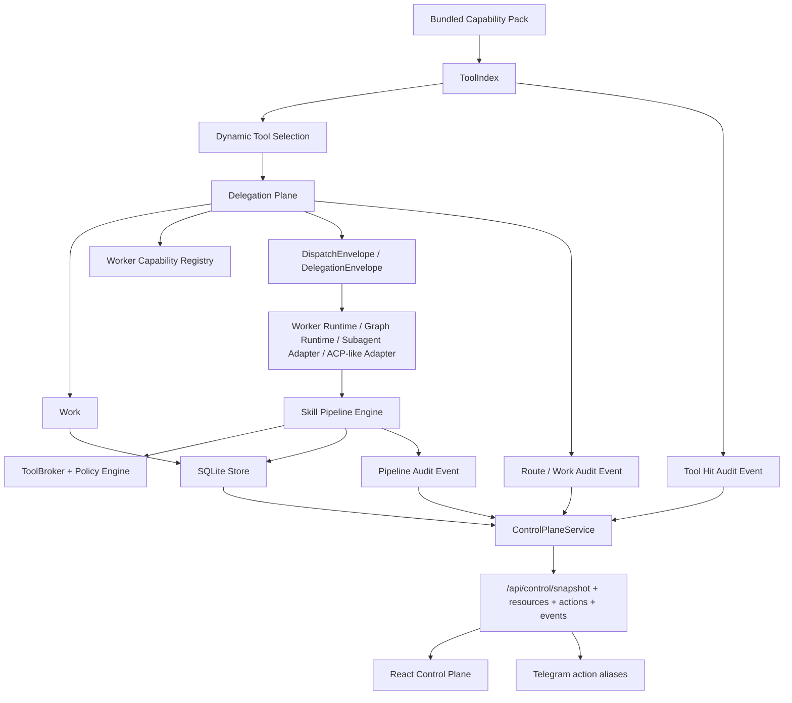

# Implementation Plan: Feature 030 — Built-in Capability Pack + Delegation Plane + Skill Pipeline

**Branch**: `030-capability-pack-delegation-plane` | **Date**: 2026-03-08 | **Spec**: `.specify/features/030-capability-pack-delegation-plane/spec.md`

## Summary

Feature 030 采用“基础模型 -> 运行时增强 -> 控制台接入”的顺序推进：

1. 在 `packages/core` 定义 `Work`、delegation、pipeline、capability pack 共享模型，并增加 SQLite 持久化；
2. 在 `packages/tooling` 实现 ToolIndex 与动态工具选择，在 `packages/skills` 实现 Skill Pipeline Engine；
3. 在 Gateway 扩展 worker capability registry、delegation plane、orchestrator route 与 runtime adapters；
4. 在 026 control plane 上增量增加 capability/work/pipeline 资源与动作；
5. 在前端控制台接入新的运行面，并补齐单测/集成/e2e/verification。

## Technical Context

**Language/Version**: Python 3.12, TypeScript 5.8  
**Primary Dependencies**: FastAPI, aiosqlite, structlog, pydantic v2, APScheduler v3, pydantic-ai-slim, pydantic-graph（已存在于环境）, React 19, Vite  
**Storage**: SQLite WAL（task/event/project + work/pipeline） + project-root JSON state（control plane / automation）  
**Testing**: pytest, ruff, vitest, frontend build, Gateway e2e  
**Constraints**:

- 不得绕过 ToolBroker / Policy Engine / audit
- 不得重做 026 control plane 基础框架
- 必须保留单 Worker / 静态工具集降级路径
- 不得引入 M4 remote nodes / companion surfaces
- 必须兼容 025-B project/workspace 基线

## Constitution Check

- **Durability First**: 通过。`Work` 与 `SkillPipelineRun` 将持久化到 SQLite，重启后可恢复。
- **Everything is an Event**: 通过。tool hits、work lifecycle、pipeline lifecycle、delegation routing 都写事件。
- **Tools are Contracts**: 通过。动态工具注入只选择工具，不改变 ToolBroker 真实执行契约。
- **Side-effect Must be Two-Phase**: 通过。pipeline/tool execution 继续复用 Policy/Approval gate。
- **Least Privilege by Default**: 通过。动态工具集默认收敛权限面，fallback 也遵守 tool profile。
- **Degrade Gracefully**: 通过。ToolIndex backend、多 Worker registry、subagent/acp runtime 都有 degraded/fallback 语义。
- **User-in-Control**: 通过。新增 work/pipeline cancel/retry/resume/escalation 控制动作。
- **Observability is a Feature**: 通过。control plane 接入 route reason、tool hits、work ownership、runtime status。

## Backend / Frontend Boundary

### Backend owns

- capability pack producer
- ToolIndex backend / selection / event audit
- work / delegation / pipeline canonical state
- multi-worker route reason
- control-plane canonical resources / actions / events

### Frontend owns

- capability/work/pipeline/runtime 的展示
- action dispatcher 与 polling
- 026 shell 内的新分区与卡片

### Explicit non-goals for frontend

- 不得本地推导 route reason
- 不得自行计算 work lifecycle
- 不得直接调 tool/runtime side-effect API

## Architecture

## Implementation Phases

### Phase 1 — Core Models & Durable Stores

- 新增 `packages/core/models/delegation.py`
- 新增 `packages/core/store/work_store.py`
- 扩展 `sqlite_init.py`、`StoreGroup`
- 新增事件类型与 payload

### Phase 2 — ToolIndex & Capability Pack

- 扩展 `ToolMeta`
- 新增 `packages/tooling/tool_index.py`
- 新增 bundled capability pack / worker bootstrap producer
- 补 ToolIndex 单测

### Phase 3 — Skill Pipeline Engine

- 新增 `packages/skills/pipeline.py`
- 实现 checkpoint / replay / pause / resume / node retry
- 节点内部继续复用 SkillRunner / ToolBroker

### Phase 4 — Delegation Plane & Multi Worker Routing

- 新增 Gateway capability registry / delegation plane service
- 扩展 orchestrator / runtime adapters
- 定义统一 delegation protocol 与 fallback 行为

### Phase 5 — Control Plane & Frontend

- 扩展 control-plane core models / service / routes / actions
- 在前端增加 capability / delegation / pipeline 展示
- 扩展 Telegram/Web 共用 action 语义

### Phase 6 — Verify / Review / Sync

- 运行 ruff + pytest + frontend tests/build
- 做全面 review 并修复问题
- 更新 verification / milestone docs

## Design Decisions

| 决策 | 原因 | 拒绝的更简单方案 |
|---|---|---|
| `Work` 用 SQLite 持久化 | 需要 durable ownership / status / merge state | 只用 event payload 推导，恢复复杂且查询慢 |
| ToolIndex 放 `packages/tooling` | 与 ToolMeta/ToolBroker/manifest 贴合 | 放 Gateway 使运行时耦合过重 |
| Pipeline 与 SkillRunner 分层 | pipeline 是 deterministic orchestration，SkillRunner 是单 skill loop | 直接在 SkillRunner 内塞多节点逻辑，会破坏现有模型 |
| 多 Worker registry 放 Gateway service | 依赖具体 runtime adapter 可用性 | 放 core 会把运行时细节污染 domain 层 |
| subagent / ACP-like 先做本地 adapter | 先统一协议与控制面，避免偷带 M4 | 直接做远端节点会越界 |
