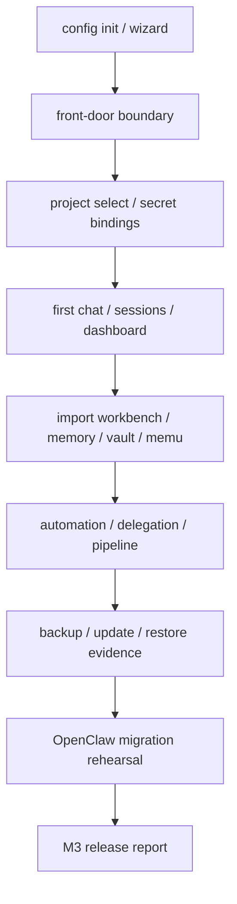

# Implementation Plan: Feature 031 — M3 User-Ready E2E Acceptance

**Branch**: `master` | **Date**: 2026-03-08 | **Spec**: `.specify/features/031-m3-user-ready-acceptance/spec.md`
**Input**: `.specify/features/031-m3-user-ready-acceptance/spec.md` + Feature 024-030 verification reports + `_references/openclaw-snapshot/`

---

## Summary

Feature 031 的目标不是再做一轮 M3 功能开发，而是证明当前 `master` 已经具备对用户开放前必须成立的三件事：

1. 首次使用、控制面、记忆、导入、自动化、委派这些能力能在一条真实用户路径中共同成立。
2. 多条并发交付线之间的接缝已经收口，不会因为 project 选择、front-door 边界或导入格式差异而把用户导向错误路径。
3. 项目 owner 可以拿到一份结构化 release report，明确发布边界、迁移演练结论、剩余风险和 deferred items。

本 Feature 的实现策略分为四层：

1. **接缝修补层**：只修补阻塞发布验收的最小行为偏差；
2. **联合验收层**：新增 M3 acceptance tests，把 first-use / project isolation / delegation inheritance 显式自动化；
3. **迁移演练层**：把 OpenClaw 本地快照转成正式 rehearsal record，并补齐 WeFlow JSONL 导入能力；
4. **报告层**：沉淀 acceptance matrix、verification report 与里程碑状态回写。

---

## Technical Context

**Language / Version**:

- Python 3.12+
- TypeScript 5.x

**Primary Dependencies**:

- `pytest` / `httpx.AsyncClient` / `ASGITransport`
- `click.testing.CliRunner`
- 现有 `gateway` / `provider.dx` / `memory` / `frontend` workspace packages

**Target Platform**:

- macOS / Linux 单 owner、本地或 trusted-network 部署

**Testing Strategy**:

- 新增 `test_f031_m3_acceptance.py` 负责 first-use / trust boundary / project isolation / delegation inheritance
- 复用 024-030 既有定向测试作为 supporting evidence
- 复用 `frontend` 的 Control Plane integration tests 和 build 作为 UI / release smoke

**Constraints**:

- 不新增新的产品域
- 不把 M4 能力偷带进 031
- 对公网开放必须通过 `front_door.mode: bearer` 或 `trusted_proxy`
- OpenClaw 迁移演练允许使用本地快照与 redacted mapping，不要求直接迁移 live credentials

**Scale / Scope**:

- 单 owner、单实例的 M3 发布收口
- 范围覆盖 024-030 的联合用户路径，不覆盖 M4 remote nodes / companion surfaces

---

## Constitution Check

| Constitution 原则 | 适用性 | 评估 | 说明 |
|---|---|---|---|
| 原则 1: Durability First | 直接适用 | PASS | 031 需要证明 import / memory / automation / update / restore 都落在 durable boundary 内 |
| 原则 2: Everything is an Event | 直接适用 | PASS | control-plane actions、delegation、automation 与 memory/import 都依赖事件链可追溯 |
| 原则 4: Side-effect Must be Two-Phase | 直接适用 | PASS | update / restore / vault access 仍保持 preview / verify / authorize 语义 |
| 原则 5: Least Privilege by Default | 直接适用 | PASS | 031 明确 front-door boundary，且 secret 只以 ref / runtime materialization 形式存在 |
| 原则 6: Degrade Gracefully | 直接适用 | PASS | MemU unavailable、unmanaged reload、reverse proxy 缺失等路径都必须可解释降级 |
| 原则 8: Observability is a Feature | 直接适用 | PASS | 本 Feature 最终必须交付 acceptance matrix、migration rehearsal 与 release report |

**结论**: 无硬性冲突，可直接进入实现与验证。

---

## Project Structure

### 文档制品

```text
.specify/features/031-m3-user-ready-acceptance/
├── spec.md
├── plan.md
├── tasks.md
├── contracts/
│   └── m3-acceptance-matrix.md
└── verification/
    ├── openclaw-migration-rehearsal.md
    └── verification-report.md
```

### 源码与测试变更布局

```text
octoagent/apps/gateway/src/octoagent/gateway/services/
└── control_plane.py                 # control-plane selection 与 delegation selector 收口

octoagent/packages/memory/src/octoagent/memory/imports/source_adapters/
└── wechat.py                        # WeFlow JSONL 导入支持（迁移演练所需）

octoagent/tests/integration/
└── test_f031_m3_acceptance.py       # M3 联合验收主测试文件

octoagent/packages/provider/tests/
└── test_import_workbench_service.py # WeFlow JSONL workbench 回归
```

**Structure Decision**: 031 继续沿用现有 `gateway` / `provider.dx` / `memory` / `frontend` 模块，不新增 app 或 package；实现集中在 release seam 和 acceptance harness。

---

## Architecture

### 发布收口总览



### 核心设计

#### 1. Control Plane 与 Delegation 共享 project 选择态

031 新增的唯一核心代码修补，是让 control plane 的 `project.select` 同步更新 `project_store` 中的 `selector-web`。这样 Web 控制台切 project 后，delegation / capability pack / worker dispatch 读到的是同一上下文，而不会悄悄回到 default project。

#### 2. 以 acceptance tests 证明跨 Feature 接缝

031 不重复造每个 Feature 的局部测试，而是新增三条聚合验收：

- first-use + dashboard + front-door boundary
- project isolation + secrets + import + memory + automation
- project selection -> delegation work inheritance

#### 3. 以 WeFlow JSONL 作为 OpenClaw 迁移输入

OpenClaw 本地快照包含 WeFlow 风格 `.jsonl` 微信导出。031 将其纳入正式导入能力，使迁移演练不再依赖手工先转成 `.json`。

#### 4. 用 acceptance matrix 把 gate、命令、证据收敛成单一事实源

031 的结论不来自“感觉差不多可用”，而来自 gate -> scenario -> evidence -> risk 的固定矩阵。

---

## Phase Plan

### Phase 1: Freeze Release Contract

目标：补齐 `plan.md`、`tasks.md`、`m3-acceptance-matrix.md`，把 031 的 gate、证据与边界冻结。

### Phase 2: Seal Critical Seams

目标：只修补会导致真实用户路径失真的接缝问题。

范围：

- control plane `project.select` 与 `selector-web` 同步
- WeFlow JSONL 导入支持

### Phase 3: Acceptance Harness

目标：新增 031 联合验收测试，覆盖 first-use、project isolation 与 delegation inheritance。

### Phase 4: Migration & Release Reporting

目标：完成 OpenClaw rehearsal、verification report、blueprint 回写与最终发布结论。

---

## Risks & Tradeoffs

### Tradeoff 1: 定向回归 vs 全仓全量回归

- 选择：031 以定向 backend/frontend 验证为主
- 原因：目标是验证发布 gate 和关键接缝，而不是把整个 monorepo 重跑成 nightly

### Tradeoff 2: 本地 OpenClaw 快照 vs live cutover

- 选择：使用本地 snapshot 做 rehearsal
- 原因：031 目标是把迁移 mapping、风险和回滚路径写清，不在本 Feature 内做真实生产切换

### Tradeoff 3: 明确 front-door 边界 vs 假装公网 ready

- 选择：明确写死 localhost / bearer / trusted_proxy 三种模式
- 原因：真实边界比模糊承诺更重要，尤其是在开放前阶段
