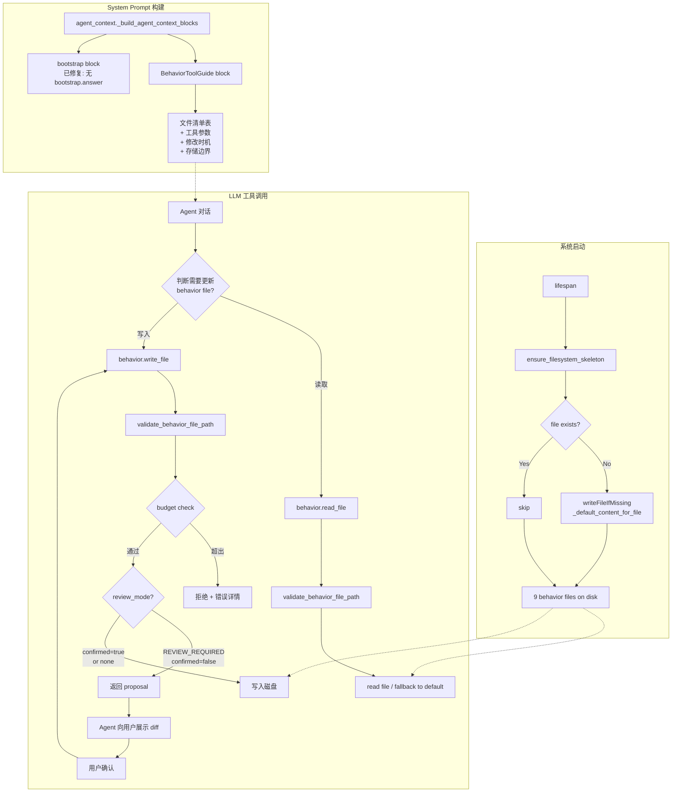

# Implementation Plan: 行为文件模板落盘与 Agent 自主更新

**Branch**: `057-behavior-template-materialize` | **Date**: 2026-03-16 | **Spec**: [spec.md](./spec.md)
**Input**: Feature specification from `.specify/features/057-behavior-template-materialize/spec.md`

## Summary

本特性实现行为文件（Behavior Files）从内存模板到磁盘的物理化（materialize），并为 Agent LLM 注册 `behavior.read_file` / `behavior.write_file` 工具，配合 System Prompt 中的 BehaviorToolGuide block 引导 Agent 自主判断何时更新行为文件。同时修复 bootstrap.answer 幽灵引用。

技术方案核心：在现有 `ensure_filesystem_skeleton()` 中新增 writeFileIfMissing 逻辑，复用 `_default_content_for_file()` 作为单一事实源；在 `capability_pack.py` 的 `@tool_contract` 体系中注册两个新 LLM 工具，核心路径校验逻辑提取到 `behavior_workspace.py` 共享；在 `agent_context.py` 中注入动态生成的 BehaviorToolGuide system block。

## Technical Context

**Language/Version**: Python 3.12+
**Primary Dependencies**: FastAPI, Pydantic, structlog, octoagent.tooling (tool_contract decorator)
**Storage**: 文件系统（behavior/*.md）— 无数据库变更
**Testing**: pytest — unit tests for materialize + path validation + budget check + tool guide generation
**Target Platform**: macOS (开发) / Linux server (部署)
**Project Type**: Monorepo (apps/ + packages/)
**Performance Goals**: N/A（低频文件操作，无性能瓶颈）
**Constraints**: 所有 9 个行为文件 < 各自 BEHAVIOR_FILE_BUDGETS 字符上限
**Scale/Scope**: 9 个行为文件，2 个 LLM 工具，1 个 system prompt block，1 个 bug fix

## Constitution Check

*GATE: Must pass before Phase 0 research. Re-check after Phase 1 design.*

| 原则 | 适用性 | 评估 | 说明 |
|------|--------|------|------|
| 1. Durability First | **HIGH** | PASS | 模板落盘确保 behavior files 在磁盘上持久化；writeFileIfMissing 保证重启不覆盖用户修改 |
| 2. Everything is an Event | MEDIUM | PASS | FR-018 要求通过 LLM 工具修改行为文件时生成事件记录；materialize 阶段通过 structlog 记录 |
| 3. Tools are Contracts | **HIGH** | PASS | `@tool_contract` 装饰器声明 schema/side_effect_level/tool_profile；schema 与函数签名一致 |
| 4. Side-effect Two-Phase | MEDIUM | PASS | behavior.write_file 声明为 `reversible`（可随时改回），不属于不可逆操作；MVP 通过 proposal 模式提供确认机制 |
| 5. Least Privilege | LOW | PASS | LLM 工具路径限制在 behavior 目录内，不暴露任意文件系统 |
| 6. Degrade Gracefully | **HIGH** | PASS | FR-017 要求模板写入失败不阻塞启动；工具不可用时 Agent 仍可通过对话提供帮助 |
| 7. User-in-Control | **HIGH** | PASS | review_mode=REVIEW_REQUIRED 的 proposal 确认机制；字符预算超出时拒绝（不截断） |
| 8. Observability | MEDIUM | PASS | 写入操作记录事件；预算超出返回明确错误信息 |
| 9. 不猜关键配置 | MEDIUM | PASS | Agent 先 read_file 再 write_file，不猜测当前内容 |
| 10. Bias to Action | LOW | PASS | 工具返回错误信息包含 budget 详情，Agent 可自行精简重试 |
| 11. Context Hygiene | LOW | PASS | BehaviorToolGuide 为结构化表格，不注入大量原文 |
| 12. Memory Write Governance | LOW | N/A | 行为文件不是 Memory SoR，此功能不涉及记忆写入 |
| 13. Failure Explainable | MEDIUM | PASS | 所有错误返回明确的 error code + message |
| 13A. Context over Policy | **HIGH** | PASS | 本特性核心就是通过 BehaviorToolGuide 上下文引导 Agent 决策，而非硬编码规则 |
| 14. A2A Compatibility | LOW | N/A | 不涉及 A2A 协议 |

**结论**: 全部 PASS，无 VIOLATION。

## Project Structure

### Documentation (this feature)

```text
.specify/features/057-behavior-template-materialize/
├── plan.md              # 本文件
├── research.md          # 技术决策研究
├── spec.md              # 需求规范
├── contracts/
│   └── behavior-tools.md  # behavior.read_file / behavior.write_file API 契约
├── checklists/
│   └── requirements.md
└── research/
```

### Source Code (repository root)

```text
octoagent/
  packages/core/src/octoagent/core/
  │ └── behavior_workspace.py          # [MODIFY] ensure_filesystem_skeleton() + 新增共享辅助函数
  │
  apps/gateway/src/octoagent/gateway/services/
  │ ├── capability_pack.py             # [MODIFY] _register_builtin_tools() 新增 2 个工具
  │ ├── agent_context.py               # [MODIFY] bootstrap 引导 block 修复 + 注入 BehaviorToolGuide
  │ ├── butler_behavior.py             # [MODIFY] 新增 build_behavior_tool_guide_block()
  │ └── control_plane.py               # [MODIFY] _handle_behavior_write_file 增加预算检查（可选）
  │
  packages/core/tests/
    └── test_behavior_materialize.py   # [NEW] 单元测试
```

**Structure Decision**: 本特性不新增模块或包，全部在现有文件中修改。核心逻辑变更集中在 `behavior_workspace.py`（包级别）和 `capability_pack.py` + `agent_context.py` + `butler_behavior.py`（网关级别）。

## Architecture



## Implementation Details

### Phase 1: 模板落盘（FR-001 ~ FR-004, FR-017）

**修改文件**: `octoagent/packages/core/src/octoagent/core/behavior_workspace.py`

**变更内容**:

1. 在 `ensure_filesystem_skeleton()` 末尾（`return created` 之前），增加模板文件写入循环：

```python
# 行为文件模板 materialize（writeFileIfMissing）
for file_id in ALL_BEHAVIOR_FILE_IDS:
    scope = _template_scope_for_file(file_id)
    target = _default_behavior_file_path(
        project_root=root,
        project_slug=project_slug,
        agent_slug=agent_slug,
        file_id=file_id,
        scope=scope,
    )
    if target.exists():
        continue
    try:
        content = _default_content_for_file(
            file_id=file_id,
            is_worker_profile=False,
            agent_name="Butler",
            project_label="当前项目",
        )
        target.parent.mkdir(parents=True, exist_ok=True)
        target.write_text(content, encoding="utf-8")
        created.append(str(target))
    except Exception:
        log.warning("behavior_template_materialize_failed", file_id=file_id, path=str(target))
```

2. 在文件顶部添加 structlog logger（如果尚未存在）。

**关键约束**:
- `_default_content_for_file()` 是模板内容的单一事实源（FR-003）
- `if target.exists(): continue` 实现 writeFileIfMissing（FR-002）
- `try/except` + `log.warning` 实现降级（FR-017, 原则 6）
- 默认 `is_worker_profile=False` + `agent_name="Butler"` 因为 startup 阶段无法传入 agent_profile

### Phase 2: 共享辅助函数（跨模块复用）

**修改文件**: `octoagent/packages/core/src/octoagent/core/behavior_workspace.py`

**新增函数**:

```python
def validate_behavior_file_path(project_root: Path, file_path: str) -> Path:
    """校验行为文件路径的安全性，返回 resolved 绝对路径。

    Raises ValueError if path is invalid or escapes project_root.
    """

def read_behavior_file_content(
    project_root: Path,
    file_path: str,
    *,
    agent_slug: str = "butler",
    project_slug: str = "default",
) -> tuple[str, bool, int]:
    """读取行为文件内容，不存在时 fallback 到默认模板。

    Returns: (content, exists_on_disk, budget_chars)
    """

def check_behavior_file_budget(file_path: str, content: str) -> dict:
    """检查内容是否超出字符预算。

    Returns: {"within_budget": bool, "current_chars": int, "budget_chars": int, "exceeded_by": int}
    """
```

### Phase 3: LLM 工具注册（FR-005 ~ FR-011）

**修改文件**: `octoagent/apps/gateway/src/octoagent/gateway/services/capability_pack.py`

**变更内容**: 在 `_register_builtin_tools()` 方法中新增两个 `@tool_contract` 工具。

#### behavior.read_file

```python
@tool_contract(
    name="behavior.read_file",
    side_effect_level=SideEffectLevel.NONE,
    tool_profile=ToolProfile.MINIMAL,
    tool_group="behavior",
    tags=["behavior", "file", "read", "context"],
    worker_types=["ops", "research", "dev", "general"],
    manifest_ref="builtin://behavior.read_file",
    metadata={
        "entrypoints": ["agent_runtime", "web"],
        "runtime_kinds": ["worker", "subagent", "graph_agent"],
    },
)
async def behavior_read_file(file_path: str) -> str:
    """读取行为文件当前内容。不存在时返回默认模板。"""
    # 1. validate_behavior_file_path()
    # 2. read_behavior_file_content()
    # 3. return JSON with content, exists, budget_chars, current_chars
```

#### behavior.write_file

```python
@tool_contract(
    name="behavior.write_file",
    side_effect_level=SideEffectLevel.REVERSIBLE,
    tool_profile=ToolProfile.STANDARD,
    tool_group="behavior",
    tags=["behavior", "file", "write", "context"],
    worker_types=["ops", "research", "dev", "general"],
    manifest_ref="builtin://behavior.write_file",
    metadata={
        "entrypoints": ["agent_runtime"],
        "runtime_kinds": ["worker", "subagent", "graph_agent"],
    },
)
async def behavior_write_file(
    file_path: str,
    content: str,
    confirmed: bool = False,
) -> str:
    """修改行为文件内容。review_mode=REVIEW_REQUIRED 时需用户确认。"""
    # 1. validate_behavior_file_path()
    # 2. check_behavior_file_budget() -> 超出则拒绝
    # 3. 查找 file_id -> 获取 review_mode
    # 4. if review_mode == REVIEW_REQUIRED and not confirmed:
    #      return proposal JSON (current_content + proposed_content + diff hint)
    # 5. 实际写入磁盘
    # 6. 记录事件（FR-018）
    # 7. return success JSON
```

**review_mode 查找策略**:
- 从 `file_path` 中提取 `file_id`（路径末段，如 `USER.md`）
- 在 `_build_file_templates()` 中查找对应模板的 `review_mode`
- 如果找不到（非标准行为文件），默认 `REVIEW_REQUIRED`

**事件记录（FR-018）**:
- 通过 `get_current_execution_context()` 获取当前 task_id
- 创建 `EventType.TOOL_CALL` 事件，包含 `file_path`、`source: "llm_tool"`、内容摘要

### Phase 4: System Prompt — BehaviorToolGuide（FR-012 ~ FR-014）

**修改文件**: `octoagent/apps/gateway/src/octoagent/gateway/services/butler_behavior.py`

**新增函数**:

```python
def build_behavior_tool_guide_block(
    *,
    workspace: BehaviorWorkspace,
    is_bootstrap_pending: bool = False,
) -> str:
    """生成行为文件工具使用指南 system block。"""
```

**输出格式（示例）**:

```
[BehaviorToolGuide]
你可以通过以下工具读写行为文件：

| file_id | 用途 | 修改时机 | path_hint |
|---------|------|----------|-----------|
| USER.md | 用户长期偏好 | 用户表达新偏好时 | behavior/system/USER.md |
| IDENTITY.md | 身份补充 | 用户自定义 Agent 名称/定位时 | behavior/agents/butler/IDENTITY.md |
| ... | ... | ... | ... |

工具参数：
- behavior.read_file(file_path): 读取指定行为文件当前内容
- behavior.write_file(file_path, content, confirmed=false): 修改行为文件
  - 所有行为文件默认需要用户确认（review_mode=review_required）
  - 第一次调用时 confirmed=false，系统返回 proposal
  - 向用户展示修改摘要，用户确认后再次调用 confirmed=true

存储边界：
- 稳定事实 -> MemoryService / memory tools
- 规则、人格、偏好 -> behavior files（通过 behavior.write_file）
- 敏感值 -> SecretService / secret bindings workflow
- 代码/数据/文档 -> project workspace roots

{如果 is_bootstrap_pending:}
[BOOTSTRAP 存储路由]
当前处于初始化阶段，收集到的信息请按以下路由存储：
- 称呼/偏好 -> behavior.write_file USER.md
- Agent 名称/定位 -> behavior.write_file IDENTITY.md
- 性格/语气 -> behavior.write_file SOUL.md
- 稳定事实（时区/地点等） -> memory tools
- 敏感信息 -> SecretService
```

**注入位置**:

**修改文件**: `octoagent/apps/gateway/src/octoagent/gateway/services/agent_context.py`

在 `_build_agent_context_blocks()` 方法中，在 behavior system block 之后注入 BehaviorToolGuide block：

```python
# 在 render_behavior_system_block() 之后
behavior_tool_guide = build_behavior_tool_guide_block(
    workspace=behavior_workspace,
    is_bootstrap_pending=(bootstrap.status is BootstrapSessionStatus.PENDING),
)
blocks.append({"role": "system", "content": behavior_tool_guide})
```

**注意**: 需要在 agent_context.py 中获取 `BehaviorWorkspace` 实例。当前 `render_behavior_system_block()` 内部已创建 workspace，需要调整为先解析 workspace，再分别传给 render 和 guide 函数。

### Phase 5: 修复 bootstrap.answer 幽灵引用（FR-015 ~ FR-016）

**修改文件**: `octoagent/apps/gateway/src/octoagent/gateway/services/agent_context.py`

**变更**: 修改 L3868-3880 的 bootstrap 引导指令：

```python
# 旧代码 (L3868-3880):
bootstrap_block_content += (
    "\n\n[BOOTSTRAP 引导指令]\n"
    "当前 bootstrap 尚未完成。你的首要任务是完成初始化问卷。\n"
    "规则：\n"
    "1. 每次只问一个问题，等用户回答后再进入下一步\n"
    "2. 先用简短友好的方式打招呼，然后自然地引出当前步骤的问题\n"
    "3. 用户回答后，通过 bootstrap.answer 工具保存答案\n"  # <-- 幽灵引用
    "4. 如果用户想跳过某个步骤，尊重用户意愿并进入下一步\n"
    "5. 不要一次性列出所有问题\n"
    ...
)

# 新代码:
bootstrap_block_content += (
    "\n\n[BOOTSTRAP 引导指令]\n"
    "当前 bootstrap 尚未完成。你的首要任务是完成初始化问卷。\n"
    "规则：\n"
    "1. 每次只问一个问题，等用户回答后再进入下一步\n"
    "2. 先用简短友好的方式打招呼，然后自然地引出当前步骤的问题\n"
    "3. 用户回答后，根据信息类型选择正确的存储方式：\n"
    "   - 称呼/偏好/规则 -> behavior.write_file 写入对应行为文件\n"
    "   - 稳定事实 -> memory tools\n"
    "   - 敏感值 -> SecretService\n"
    "4. 如果用户想跳过某个步骤，尊重用户意愿并进入下一步\n"
    "5. 不要一次性列出所有问题\n"
    ...
)
```

## File Change Summary

| 文件 | 变更类型 | 变更概述 | 影响 FR |
|------|---------|---------|---------|
| `packages/core/.../behavior_workspace.py` | MODIFY | ensure_filesystem_skeleton() 增加模板写入；新增 3 个辅助函数 | FR-001~004, FR-010~011, FR-017 |
| `apps/gateway/.../capability_pack.py` | MODIFY | _register_builtin_tools() 新增 behavior.read_file + behavior.write_file | FR-005~009 |
| `apps/gateway/.../butler_behavior.py` | MODIFY | 新增 build_behavior_tool_guide_block() | FR-012~014 |
| `apps/gateway/.../agent_context.py` | MODIFY | 注入 BehaviorToolGuide block；修复 bootstrap.answer 引用 | FR-012~016 |
| `apps/gateway/.../control_plane.py` | OPTIONAL | _handle_behavior_write_file 增加预算检查（复用共享函数） | FR-011 |
| `packages/core/tests/test_behavior_materialize.py` | NEW | 模板落盘 + 路径校验 + 预算检查 + guide 生成 单元测试 | SC-001~006 |

## Testing Strategy

### Unit Tests

1. **test_materialize_creates_all_files**: 空目录 -> ensure_filesystem_skeleton() -> 断言 9 个文件存在且内容匹配
2. **test_materialize_skips_existing**: 预填 USER.md -> ensure_filesystem_skeleton() -> 断言 USER.md 内容未变
3. **test_materialize_skips_empty_file**: 预创建空 USER.md -> ensure_filesystem_skeleton() -> 断言文件仍为空
4. **test_materialize_io_error_does_not_block**: Mock write_text 抛异常 -> ensure_filesystem_skeleton() 不抛异常
5. **test_validate_path_rejects_traversal**: `../etc/passwd` -> ValueError
6. **test_validate_path_rejects_absolute**: `/etc/passwd` -> ValueError
7. **test_budget_check_within**: 内容 < budget -> within_budget=true
8. **test_budget_check_exceeded**: 内容 > budget -> within_budget=false + exceeded_by
9. **test_tool_guide_contains_all_files**: guide block 包含所有 9 个 file_id
10. **test_tool_guide_bootstrap_pending**: is_bootstrap_pending=true -> 包含存储路由 block
11. **test_read_file_fallback_default**: 文件不存在 -> 返回默认模板内容
12. **test_write_file_proposal_mode**: confirmed=false + review_required -> proposal=true
13. **test_write_file_confirmed_writes**: confirmed=true -> 实际写入磁盘

### Integration Tests（后续）

- Agent 对话中调用 behavior.read_file / behavior.write_file 的端到端流程
- Bootstrap PENDING 状态下 system prompt 不包含 "bootstrap.answer"

## Complexity Tracking

> 本计划无 Constitution 违规项，Complexity Tracking 表为空。

| Violation | Why Needed | Simpler Alternative Rejected Because |
|-----------|------------|-------------------------------------|
| （无） | - | - |

## Risk Assessment

| 风险 | 概率 | 影响 | 缓解 |
|------|------|------|------|
| behavior.write_file 的 proposal 模式被 LLM 忽略（直接传 confirmed=true） | LOW | MEDIUM | BehaviorToolGuide 明确说明 review_mode 语义；后续可升级为 ApprovalService |
| ensure_filesystem_skeleton 中 _default_content_for_file 的 agent_name/project_label 为硬编码默认值 | LOW | LOW | 模板内容本身是通用的，具体个性化由后续 Agent 通过 write_file 完成 |
| 路径校验绕过（新的 validate 函数有 bug） | LOW | HIGH | 单元测试覆盖 traversal 场景；共享函数减少重复代码 |
