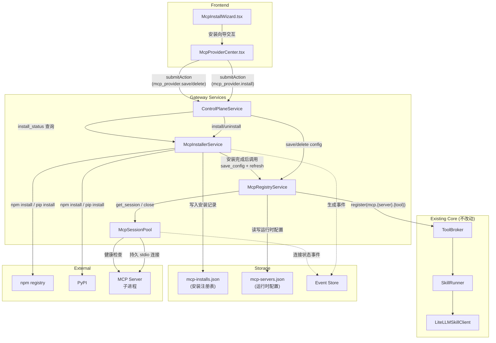

# Implementation Plan: MCP 安装与生命周期管理

**Branch**: `claude/festive-meitner` | **Date**: 2026-03-16 | **Spec**: `.specify/features/058-mcp-install-lifecycle/spec.md`
**Input**: Feature specification from `.specify/features/058-mcp-install-lifecycle/spec.md`

## Summary

为 OctoAgent 构建完整的 MCP server 安装与生命周期管理能力。核心目标是让用户通过 Web UI 安装向导完成"包名输入 -> 一键安装 -> 自动配置 -> 启用"全流程，同时将 MCP 连接从 per-operation 模式升级为持久连接池，提升性能和可靠性。

技术方案基于接缝分析（integration-gap-analysis.md）的关键约束：**不替换现有路径，只做扩展** -- ToolBroker/SkillRunner/LiteLLMClient 零改动，MCP 工具继续通过 `mcp.{server}.{tool}` 注册到 ToolBroker。新增 McpInstallerService 专注安装能力，McpSessionPool 提供持久连接，安装注册表（mcp-installs.json）与运行时配置（mcp-servers.json）分离存储。

## Technical Context

**Language/Version**: Python 3.12+（后端），TypeScript/React（前端）
**Primary Dependencies**: mcp SDK（已有），FastAPI（已有），Pydantic（已有），asyncio（已有）
**Storage**: JSON 文件（mcp-installs.json + mcp-servers.json），SQLite WAL（Event Store 事件记录）
**Testing**: pytest（后端 unit + integration），Vitest（前端 component）
**Target Platform**: macOS（主要），Linux（兼容）
**Project Type**: Web application（FastAPI 后端 + React 前端）
**Performance Goals**: 持久连接建立后工具调用延迟与手动配置等同（<100ms p95），安装流程 <3 分钟（不含网络）
**Constraints**: 安装目录限制在 `~/.octoagent/mcp-servers/`，ToolBroker/SkillRunner 零改动
**Scale/Scope**: 单用户，预计管理 5~20 个 MCP server

## Constitution Check

*GATE: Must pass before Phase 0 research. Re-check after Phase 1 design.*

| # | 原则 | 适用性 | 评估 | 说明 |
|---|------|--------|------|------|
| 1 | Durability First | **高** | PASS | 安装注册表持久化到 `mcp-installs.json`，运行时配置持久化到 `mcp-servers.json`。进程重启后安装记录完整保留，已启用 server 自动重连。不完整安装通过 status="failed" 标记，重启时可清理 |
| 2 | Everything is an Event | **高** | PASS | 安装/卸载/连接状态变更操作生成 Event 写入 Event Store。包括 `mcp.server.installed`、`mcp.server.uninstalled`、`mcp.session.connected`、`mcp.session.disconnected`、`mcp.session.reconnected` |
| 3 | Tools are Contracts | **中** | PASS | MCP 工具 schema 通过 `tools/list` 自动发现，映射为 ToolMeta 注册到 ToolBroker。现有链路完全保留，不引入额外 schema 映射层 |
| 4 | Side-effect Must be Two-Phase | **高** | PASS | 安装操作由用户在 Web UI 向导中逐步确认（选择来源 -> 输入包名 -> 配置 env -> 确认安装）。后端 action 需要显式 confirm。卸载操作弹出确认对话框 |
| 5 | Least Privilege by Default | **高** | PASS | 子进程 env 默认不继承宿主进程。env 按 per-server 隔离管理。安装路径限制在 `~/.octoagent/mcp-servers/`，检测并拒绝路径遍历攻击。npm integrity / pip hash 校验 |
| 6 | Degrade Gracefully | **高** | PASS | session pool 支持 per-server 故障隔离。单个 server 连接断开不影响其他 server。连接自动重建，重建失败降级为不可用状态但不崩溃。McpInstallerService 不可用时不影响已安装 server 的工具调用 |
| 7 | User-in-Control | **高** | PASS | 安装需用户确认，Web UI 提供安装/卸载/启用/停用控制。安装过程可查看进度，安装结果可查看摘要。卸载前等待当前工具调用完成 |
| 8 | Observability is a Feature | **高** | PASS | 每个 server 在 Web UI 显示实时运行状态。安装/卸载/连接变更写入 Event Store。structlog 记录安装过程日志。健康检查周期性探测 server 存活 |
| 9-13A | Agent Behavior | **低** | N/A | 本特性是基础设施层，不涉及 Agent 行为策略 |
| 14 | A2A Protocol Compatibility | **低** | N/A | MCP 安装管理是内部服务，不涉及 A2A 对外协议 |

**Constitution Check 结论**: 全部 PASS，无 VIOLATION。

## Project Structure

### Documentation (this feature)

```text
.specify/features/058-mcp-install-lifecycle/
├── plan.md              # 本文件
├── research.md          # 技术决策研究
├── data-model.md        # 数据模型
├── quickstart.md        # 快速上手指南
├── contracts/           # API 契约
│   ├── actions.md       # Control Plane action 契约
│   └── session-pool.md  # McpSessionPool 接口契约
├── research/            # 调研报告（已有）
│   ├── research-synthesis.md
│   ├── integration-gap-analysis.md
│   ├── agent-zero-tech-research.md
│   ├── openclaw-tech-research.md
│   └── pydantic-ai-tech-research.md
└── spec.md              # 需求规范（已有）
```

### Source Code (repository root)

```text
# 后端 -- 新建文件
octoagent/apps/gateway/src/octoagent/gateway/services/
├── mcp_installer.py          # McpInstallerService + NpmStrategy + PipStrategy
└── mcp_session_pool.py       # McpSessionPool 持久连接管理

# 后端 -- 修改文件
octoagent/apps/gateway/src/octoagent/gateway/services/
├── mcp_registry.py            # 注入 session pool 替代 per-operation session
├── control_plane.py           # 新增 install/uninstall/install_status action
└── main.py                    # 初始化 McpInstallerService + McpSessionPool

octoagent/packages/core/src/octoagent/core/models/
└── control_plane.py           # McpProviderItem 新增安装展示字段

# 前端 -- 新建文件
octoagent/frontend/src/components/
└── McpInstallWizard.tsx       # 安装向导 modal 组件

# 前端 -- 修改文件
octoagent/frontend/src/pages/
└── McpProviderCenter.tsx      # 新增"安装"按钮 + 集成安装向导
octoagent/frontend/src/types/
└── index.ts                   # McpProviderItem 类型扩展

# 后端 -- 不修改的关键文件
octoagent/packages/tooling/src/octoagent/tooling/broker.py   # ToolBroker 完全不动
octoagent/packages/skills/                                     # SkillRunner 不动
```

**Structure Decision**: 遵循 OctoAgent 现有 monorepo 结构。后端新增代码全部位于 `gateway/services/` 下，与现有 MCP 管理模块同级。前端新增安装向导组件位于 `components/` 下。不创建新 package，不改动 `packages/tooling/` 和 `packages/skills/`。

---

## Architecture

### 整体架构图



### 模块职责与依赖关系

| 模块 | 职责 | 依赖 | 文件 |
|------|------|------|------|
| **McpInstallerService** | 安装/卸载/更新 MCP server，管理安装注册表，维护安装任务状态 | McpRegistryService（安装完成后写配置） | `gateway/services/mcp_installer.py` |
| **McpSessionPool** | 管理 MCP server 的持久 stdio 连接，健康检查，自动重连 | mcp SDK（ClientSession, stdio_client） | `gateway/services/mcp_session_pool.py` |
| **McpRegistryService** | 配置管理 + 工具发现 + ToolBroker 注册（**改进**: 使用 session pool 替代 per-operation session） | McpSessionPool, ToolBroker | `gateway/services/mcp_registry.py`（现有） |
| **ControlPlaneService** | 前端 action 路由，新增 install/uninstall/install_status handler | McpInstallerService, McpRegistryService | `gateway/services/control_plane.py`（现有） |

### 初始化顺序

```
main.py lifespan:
  1. ToolBroker 创建
  2. McpSessionPool 创建
  3. McpRegistryService 创建，注入 McpSessionPool + ToolBroker
  4. McpInstallerService 创建，注入 McpRegistryService
  5. CapabilityPackService 绑定 mcp_registry
  6. ControlPlaneService 绑定 mcp_installer
  7. McpRegistryService.startup()  -- 加载配置 + 建立持久连接 + 发现工具
  8. McpInstallerService.startup() -- 加载安装注册表 + 检查不完整安装
```

### 关闭顺序

```
main.py shutdown:
  1. McpInstallerService.shutdown() -- 取消进行中的安装任务
  2. McpRegistryService.shutdown()  -- 调用 session_pool.close_all()
  3. McpSessionPool.close_all()     -- 优雅关闭所有连接和子进程
```

---

## 详细设计

### 1. McpSessionPool -- 持久连接管理

**文件**: `gateway/services/mcp_session_pool.py` (~250 行)

**核心数据结构**:

```python
@dataclass
class McpSessionEntry:
    """一个 MCP server 的持久连接条目。"""
    server_name: str
    config: McpServerConfig
    session: ClientSession | None = None
    exit_stack: AsyncExitStack | None = None
    status: Literal["connected", "disconnected", "reconnecting"] = "disconnected"
    created_at: datetime | None = None
    last_active_at: datetime | None = None
    error: str = ""
    reconnect_count: int = 0
```

**接口设计**:

```python
class McpSessionPool:
    _entries: dict[str, McpSessionEntry]
    _lock: asyncio.Lock

    async def open(self, server_name: str, config: McpServerConfig) -> None:
        """建立持久连接。如果已存在则先关闭再重建。"""

    async def get_session(self, server_name: str) -> ClientSession:
        """获取已建立的 session。如果 session 已断开，尝试自动重建。"""

    async def close(self, server_name: str) -> None:
        """关闭指定 server 的连接并清理资源。"""

    async def close_all(self) -> None:
        """关闭所有连接，用于 shutdown。"""

    async def health_check(self, server_name: str) -> bool:
        """探测指定 server 的连接健康状态。"""

    async def health_check_all(self) -> dict[str, bool]:
        """批量健康检查所有已连接 server。"""

    def get_entry(self, server_name: str) -> McpSessionEntry | None:
        """获取连接条目（只读）。"""

    def list_entries(self) -> list[McpSessionEntry]:
        """列出所有连接条目。"""
```

**连接建立流程**:

```
open(server_name, config):
  1. 获取 _lock
  2. 如果已有 entry 且 status == "connected"，先 close
  3. 创建 AsyncExitStack
  4. stack.enter_async_context(stdio_client(params))  -> (read, write)
  5. stack.enter_async_context(ClientSession(read, write))  -> session
  6. session.initialize()
  7. 记录 entry: status="connected", created_at=now
  8. 释放 _lock
```

**自动重连策略**:

```
get_session(server_name):
  1. 获取 entry
  2. 如果 entry.status == "connected"，更新 last_active_at，返回 session
  3. 如果 entry.status == "disconnected"：
     a. 设置 status = "reconnecting"
     b. 调用 open(server_name, entry.config)
     c. 如果成功，返回新 session
     d. 如果失败，记录错误，设置 status = "disconnected"，抛出异常
  4. 如果 entry.status == "reconnecting"，抛出 "连接正在重建中" 异常
```

**健康检查实现**:

```
health_check(server_name):
  1. 获取 entry
  2. 如果 entry.session 为 None 或 status != "connected"，返回 False
  3. 尝试 session.list_tools(cursor=None) 超时 5s
  4. 成功返回 True，异常返回 False（并标记 status = "disconnected"）
```

### 2. McpInstallerService -- 安装与注册表管理

**文件**: `gateway/services/mcp_installer.py` (~450 行)

**安装注册表数据结构** (McpInstallRecord):

```python
class InstallSource(StrEnum):
    NPM = "npm"
    PIP = "pip"
    DOCKER = "docker"
    MANUAL = "manual"

class InstallStatus(StrEnum):
    INSTALLING = "installing"
    INSTALLED = "installed"
    FAILED = "failed"
    UNINSTALLING = "uninstalling"

class McpInstallRecord(BaseModel):
    server_id: str
    install_source: InstallSource
    package_name: str
    version: str = ""
    install_path: str = ""
    integrity: str = ""
    installed_at: datetime
    updated_at: datetime
    status: InstallStatus
    auto_generated_config: bool = True
    error: str = ""
```

**安装任务状态（内存）**:

```python
class InstallTaskStatus(StrEnum):
    PENDING = "pending"
    RUNNING = "running"
    COMPLETED = "completed"
    FAILED = "failed"

class InstallTask(BaseModel):
    task_id: str
    server_id: str
    install_source: InstallSource
    package_name: str
    status: InstallTaskStatus = InstallTaskStatus.PENDING
    progress_message: str = ""
    error: str = ""
    result: dict[str, Any] = Field(default_factory=dict)
    created_at: datetime = Field(default_factory=_utc_now)
```

**接口设计**:

```python
class McpInstallerService:
    _registry: McpRegistryService
    _install_records: dict[str, McpInstallRecord]  # server_id -> record
    _install_tasks: dict[str, InstallTask]          # task_id -> task
    _installs_path: Path                             # data/ops/mcp-installs.json
    _mcp_servers_dir: Path                           # ~/.octoagent/mcp-servers/

    async def startup(self) -> None:
        """加载安装注册表，检查并清理不完整安装。"""

    async def shutdown(self) -> None:
        """取消进行中的安装任务。"""

    async def install(
        self,
        *,
        install_source: InstallSource,
        package_name: str,
        env: dict[str, str] | None = None,
    ) -> str:
        """启动异步安装任务，立即返回 task_id。"""

    def get_install_status(self, task_id: str) -> InstallTask | None:
        """查询安装任务进度。"""

    async def uninstall(self, server_id: str) -> None:
        """卸载已安装的 MCP server。"""

    def list_installs(self) -> list[McpInstallRecord]:
        """列出所有安装记录。"""

    def get_install(self, server_id: str) -> McpInstallRecord | None:
        """获取指定 server 的安装记录。"""
```

**npm 安装策略**:

```
_install_npm(task: InstallTask, package_name: str, env: dict):
  1. 校验 package_name 格式（防注入）
  2. 计算 server_id = slugify(package_name)
  3. 创建安装目录: ~/.octoagent/mcp-servers/{server_id}/
     - 路径遍历检查: resolved.is_relative_to(base_dir)
  4. 更新进度: "正在安装 npm 包..."
  5. 执行: npm install --prefix {install_dir} {package_name}
     - subprocess.create_subprocess_exec
     - 超时 120s
     - 捕获 stdout/stderr
  6. 读取 {install_dir}/node_modules/{pkg}/package.json
     - 提取版本号
     - 提取 integrity (npm 自动写入)
  7. 入口点检测（分层策略）:
     a. 读取 package.json 的 bin 字段 -> command = bin 路径绝对路径
     b. 如无 bin，检查 main 字段 -> command = "node", args = [main]
     c. 回退: command = "npx", args = ["-y", package_name]
  8. 更新进度: "正在验证 MCP server..."
  9. 尝试启动 server 并执行 tools/list 验证
  10. 生成 McpServerConfig: name, command, args, cwd, env, enabled=True
  11. 调用 _registry.save_config(config)
  12. 调用 _registry.refresh() 触发工具发现
  13. 写入 McpInstallRecord 到注册表
  14. 更新任务: status=completed, result={version, tools_count, tools_list}
```

**pip 安装策略**:

```
_install_pip(task: InstallTask, package_name: str, env: dict):
  1. 校验 package_name 格式
  2. 计算 server_id = slugify(package_name)
  3. 创建安装目录: ~/.octoagent/mcp-servers/{server_id}/
  4. 创建独立虚拟环境: python -m venv {install_dir}/venv
  5. 更新进度: "正在安装 pip 包..."
  6. 执行: {venv}/bin/pip install {package_name}
     - 超时 120s
  7. 提取版本号: {venv}/bin/pip show {package_name}
  8. 入口点检测（分层策略）:
     a. 扫描 venv/bin/ 中新增的可执行文件
     b. 如有唯一新增 -> command = 该文件绝对路径
     c. 如有多个，匹配包名 -> command = 匹配项
     d. 回退: command = "{venv}/bin/python", args = ["-m", pkg_module_name]
  9. 后续同 npm 策略的步骤 8~14
```

**卸载流程**:

```
uninstall(server_id):
  1. 查找 McpInstallRecord
  2. 如果 source == MANUAL，仅删除运行时配置
  3. 更新 record.status = "uninstalling"
  4. 调用 _registry.delete_config(server_id) -- 这会在 refresh 时关闭连接
  5. 调用 _registry.refresh()
  6. 删除安装目录: shutil.rmtree(install_path)
  7. 删除安装记录
  8. 保存注册表
  9. 生成 mcp.server.uninstalled 事件
```

### 3. McpRegistryService 改进

**文件**: `gateway/services/mcp_registry.py`（现有 477 行，预计改动 ~80 行）

**改动范围**:

| 方法 | 改动 | 说明 |
|------|------|------|
| `__init__` | **修改** | 新增 `session_pool: McpSessionPool \| None = None` 参数 |
| `startup` | **不变** | 仍然调用 `refresh()` |
| `refresh` | **修改** | 对 enabled server，调用 `session_pool.open()` 建立持久连接；对 disabled server，调用 `session_pool.close()` |
| `_discover_server_tools` | **修改** | 通过 `session_pool.get_session()` 获取 session，不再使用 `_open_session()` |
| `call_tool` | **修改** | 通过 `session_pool.get_session()` 获取 session，不再使用 `_open_session()` |
| `_open_session` | **保留** | 改为 fallback 方法，仅在 session_pool 不可用时使用（向后兼容） |
| `shutdown` | **新增** | 调用 `session_pool.close_all()` |
| `save_config`/`delete_config` | **不变** | 保持原样 |
| `list_*`/`get_*` | **不变** | 保持原样 |

**refresh 改进逻辑**:

```python
async def refresh(self) -> None:
    configs = self._load_configs()
    await self._clear_registered_tools()
    self._server_records = {}
    self._tool_records = {}

    for config in configs:
        record = McpServerRecord(...)
        self._server_records[config.name] = record
        if not config.enabled:
            # 新增: 关闭 disabled server 的持久连接
            if self._session_pool:
                await self._session_pool.close(config.name)
            continue

        try:
            # 新增: 先建立持久连接
            if self._session_pool:
                await self._session_pool.open(config.name, config)
            tools = await self._discover_server_tools(config)
        except Exception as exc:
            record.status = "error"
            record.error = f"{type(exc).__name__}: {exc}"
            continue

        # ... 工具注册逻辑不变 ...
```

**_discover_server_tools 改进**:

```python
async def _discover_server_tools(self, config: McpServerConfig) -> list[mcp_types.Tool]:
    tools: list[mcp_types.Tool] = []
    cursor: str | None = None

    if self._session_pool:
        # 新路径: 使用持久 session
        session = await self._session_pool.get_session(config.name)
        while True:
            result = await session.list_tools(cursor=cursor)
            tools.extend(result.tools)
            cursor = result.nextCursor
            if not cursor:
                break
    else:
        # 旧路径: per-operation fallback
        async with self._open_session(config) as session:
            while True:
                result = await session.list_tools(cursor=cursor)
                tools.extend(result.tools)
                cursor = result.nextCursor
                if not cursor:
                    break
    return tools
```

### 4. ControlPlaneService 新增 Action

**文件**: `gateway/services/control_plane.py`（修改 ~120 行）

**新增 3 个 action handler**:

| action_id | 方法 | 用途 |
|-----------|------|------|
| `mcp_provider.install` | `_handle_mcp_provider_install` | 启动安装任务 |
| `mcp_provider.uninstall` | `_handle_mcp_provider_uninstall` | 卸载已安装 server |
| `mcp_provider.install_status` | `_handle_mcp_provider_install_status` | 查询安装进度 |

**install action 流程**:

```python
async def _handle_mcp_provider_install(self, request) -> ActionResultEnvelope:
    # 1. 参数提取与校验
    install_source = params["install_source"]  # "npm" | "pip"
    package_name = params["package_name"]
    env = params.get("env", {})

    # 2. 调用 installer.install()，立即返回 task_id
    task_id = await self._mcp_installer.install(
        install_source=install_source,
        package_name=package_name,
        env=env,
    )

    # 3. 返回 task_id 给前端
    return self._completed_result(
        request=request,
        code="MCP_INSTALL_STARTED",
        message="MCP server 安装已启动",
        data={"task_id": task_id},
        resource_refs=[...],
    )
```

### 5. 前端安装向导

**文件**: `frontend/src/components/McpInstallWizard.tsx` (~300 行)

**向导步骤**:

```
Step 1: 选择安装来源
  - [npm] NPM 包 -- 适用于大多数 MCP server
  - [pip] Python 包 -- 适用于 Python 生态的 MCP server

Step 2: 输入包名
  - 输入框 + 格式提示（npm: @scope/name，pip: name）
  - 可选: 环境变量配置（KEY=VALUE 多行输入）

Step 3: 确认安装
  - 显示即将安装的信息摘要
  - "确认安装" 按钮

Step 4: 安装进行中
  - 显示进度消息（轮询 install_status）
  - 每 2 秒轮询一次
  - 超时 300 秒

Step 5: 安装完成 / 失败
  - 成功: 显示版本号、发现的工具列表、"完成" 按钮
  - 失败: 显示错误信息、"重试" / "关闭" 按钮
```

**McpProviderCenter 改动**:

```tsx
// 顶栏新增"安装"按钮，与"新建"并列
<div className="wb-topbar">
  <div className="wb-topbar-copy">...</div>
  <div className="wb-inline-actions">
    <button onClick={openInstallWizard}>安装</button>
    <button onClick={openCreate}>手动添加</button>
  </div>
</div>

// Provider 列表中区分安装来源
{item.install_source && item.install_source !== "manual" ? (
  <span className="wb-chip">{item.install_source}</span>
) : (
  <span className="wb-chip">手动配置</span>
)}
```

**McpProviderItem 前端类型扩展**:

```typescript
export interface McpProviderItem {
  // ... 现有字段 ...
  install_source: string;   // "npm" | "pip" | "docker" | "manual" | ""
  install_version: string;  // 安装版本号
  install_path: string;     // 安装路径
  installed_at: string;     // 安装时间 ISO
}
```

### 6. 数据模型变更

**McpProviderItem 后端扩展** (control_plane.py):

```python
class McpProviderItem(BaseModel):
    # ... 现有字段全部保留 ...
    # 新增安装信息展示字段
    install_source: str = Field(default="")      # "npm" | "pip" | "manual" | ""
    install_version: str = Field(default="")      # 版本号
    install_path: str = Field(default="")         # 安装路径
    installed_at: str = Field(default="")          # 安装时间 ISO
```

**get_mcp_provider_catalog_document 合并逻辑**:

```python
# ControlPlaneService.get_mcp_provider_catalog_document 中:
install_records = (
    {} if mcp_installer is None
    else {r.server_id: r for r in mcp_installer.list_installs()}
)

for config in mcp_registry.list_configs():
    install = install_records.get(config.name)
    items.append(McpProviderItem(
        # ... 现有字段赋值不变 ...
        install_source=install.install_source if install else "",
        install_version=install.version if install else "",
        install_path=install.install_path if install else "",
        installed_at=install.installed_at.isoformat() if install else "",
    ))
```

---

## 变更影响分析

### 新建文件

| 文件 | 职责 | 估算行数 | 测试文件 |
|------|------|---------|---------|
| `gateway/services/mcp_installer.py` | 安装/卸载服务 + npm/pip 策略 | ~450 | `tests/unit/test_mcp_installer.py` |
| `gateway/services/mcp_session_pool.py` | 持久连接管理 | ~250 | `tests/unit/test_mcp_session_pool.py` |
| `frontend/src/components/McpInstallWizard.tsx` | 安装向导 modal | ~300 | `frontend/tests/McpInstallWizard.test.tsx` |

### 修改文件 -- 精确到方法级别

| 文件 | 改动方法/区域 | 改动性质 | 向后兼容 |
|------|-------------|---------|---------|
| `gateway/services/mcp_registry.py` | `__init__()` | 新增 `session_pool` 可选参数 | 是（默认 None） |
| `gateway/services/mcp_registry.py` | `refresh()` | 在 enabled server 上调用 `session_pool.open()`，disabled server 调用 `session_pool.close()` | 是（session_pool=None 时走旧路径） |
| `gateway/services/mcp_registry.py` | `_discover_server_tools()` | 优先从 session pool 获取 session | 是（fallback 到 `_open_session`） |
| `gateway/services/mcp_registry.py` | `call_tool()` | 优先从 session pool 获取 session | 是（fallback 到 `_open_session`） |
| `gateway/services/mcp_registry.py` | 新增 `shutdown()` | 调用 `session_pool.close_all()` | N/A（新方法） |
| `gateway/services/control_plane.py` | action dispatch（`_dispatch_action`） | 新增 3 个 action_id 路由 | 是（新增路由） |
| `gateway/services/control_plane.py` | 新增 `_handle_mcp_provider_install()` | install action handler | N/A |
| `gateway/services/control_plane.py` | 新增 `_handle_mcp_provider_uninstall()` | uninstall action handler | N/A |
| `gateway/services/control_plane.py` | 新增 `_handle_mcp_provider_install_status()` | 安装状态查询 handler | N/A |
| `gateway/services/control_plane.py` | `get_mcp_provider_catalog_document()` | 合并安装记录到 McpProviderItem | 是（新字段有默认值） |
| `gateway/main.py` | lifespan 函数 | 新增 McpSessionPool + McpInstallerService 初始化 | 是（新增初始化步骤） |
| `core/models/control_plane.py` | `McpProviderItem` | 新增 4 个可选字段 | 是（有默认值） |
| `frontend/src/types/index.ts` | `McpProviderItem` interface | 新增 4 个字段 | 是（TypeScript 不强制字段存在） |
| `frontend/src/pages/McpProviderCenter.tsx` | 顶栏按钮区域 | "新建" 改为 "安装" + "手动添加" | 是（UI 扩展） |
| `frontend/src/pages/McpProviderCenter.tsx` | Provider 列表 | 新增安装来源标签显示 | 是（UI 扩展） |

### 不修改文件

| 文件 | 理由 |
|------|------|
| `packages/tooling/broker.py` | ToolBroker 完全不动，MCP 工具继续走 `register/unregister/execute` |
| `packages/skills/runner.py` | SkillRunner 不动，工具调用继续走 ToolBroker |
| `packages/skills/litellm_client.py` | LLM 客户端不动 |
| `gateway/services/capability_pack.py` | 已通过 McpRegistryService 间接集成 |
| `gateway/routes/control_plane.py` | action dispatch 机制自动路由新 action |

---

## 风险与缓解

| # | 风险 | 概率 | 影响 | 缓解策略 |
|---|------|------|------|---------|
| R1 | **stdio 子进程异常退出导致持久连接失效** | 高 | 高 | McpSessionPool.get_session() 自动检测并重建连接。健康检查周期性探测。重连失败后标记 server 为 error 状态 |
| R2 | **npm/pip 包不是有效 MCP server** | 中 | 中 | 安装后执行 tools/list 验证。验证失败标记为"安装完成但启动失败"，引导用户手动配置 command/args |
| R3 | **安装过程中 OctoAgent 进程被终止** | 中 | 中 | 安装记录状态为 "installing"，重启后 startup() 检测到并标记为 "failed"，清理残留文件 |
| R4 | **路径遍历攻击（恶意包名）** | 低 | 高 | 安装路径计算后调用 `resolved_path.is_relative_to(base_dir)` 检查。包名正则校验 |
| R5 | **多个安装任务并发冲突** | 低 | 中 | McpInstallerService 内部 asyncio.Lock 保证安装注册表的写入原子性。不同 server 的安装可并行 |
| R6 | **npm/pip 版本不兼容导致安装失败** | 中 | 低 | 安装前检查 npm/pip 命令是否可用。安装失败时给出清晰的错误信息和排查建议 |
| R7 | **持久连接导致资源泄漏（子进程未清理）** | 中 | 中 | shutdown() 调用 close_all()。AsyncExitStack 确保异常时自动清理。健康检查发现僵死连接时主动关闭 |
| R8 | **前端轮询安装状态产生过多请求** | 低 | 低 | 2 秒轮询间隔，安装完成/失败后停止轮询。轮询使用 install_status action（非 snapshot 刷新） |

---

## Complexity Tracking

> 记录偏离"最简单方案"的决策及理由。

| 决策 | 为什么不用更简单的方案 | 被拒绝的简单方案 |
|------|----------------------|----------------|
| 持久连接池替代 per-operation | per-operation 每次调用启动子进程，延迟 1-5 秒，对工具调用体验严重影响 | 保持 per-operation（延迟不可接受） |
| 安装注册表与运行时配置分离 | 安装元数据（source/version/path）不应污染 McpServerConfig，后者是 ToolBroker 的数据契约 | 在 McpServerConfig 中增加安装字段（违反 FR-005 + 改动零改动模块） |
| 安装任务异步执行 + 轮询 | npm install 可能耗时 30s+，同步阻塞 action 会导致前端超时 | 同步安装（用户体验差，可能超时） |
| 分层入口点检测（bin -> main -> npx/python -m） | MCP 生态中入口点格式多样，单一策略覆盖率不足 | 只用 npx（覆盖率不够，部分包无法启动） |
