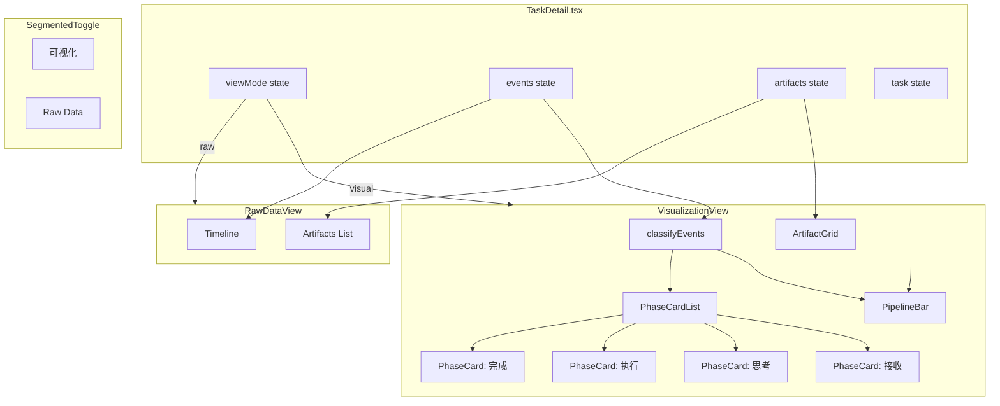

# Implementation Plan: Task 详情页可视化模式

**Branch**: `060-061-task-detail` | **Date**: 2026-03-17 | **Spec**: `spec.md`
**Input**: 纯前端实现，为 TaskDetail 页面新增可视化模式（Pipeline Bar + 阶段卡片流 + Artifacts 区），通过 segmented toggle 切换现有 Raw Data 模式。

---

## Summary

将 TaskDetail.tsx 从单一 timeline 视图重构为双模式架构（可视化 / Raw Data），核心是新增一个事件阶段归类引擎和一组可视化组件。技术方案：在 `utils/` 中实现纯函数的 `phaseClassifier`，在 `components/TaskVisualization/` 中实现 PipelineBar、PhaseCard、ArtifactGrid 三个独立组件，在 `TaskDetail.tsx` 中通过 segmented toggle 切换渲染路径。不改后端 API，不引入新依赖。

---

## Technical Context

**Language/Version**: TypeScript 5.x (React 18+, Vite)
**Primary Dependencies**: React, React Router, 现有 useSSE hook（均已在项目中）
**Storage**: N/A（纯前端，数据来自现有 API + SSE）
**Testing**: Vitest + @testing-library/react（已有 TaskDetail.test.tsx）
**Target Platform**: 现代浏览器（Chrome/Firefox/Safari 最近两版）
**Project Type**: 前端 SPA
**Performance Goals**: 100 条事件初次渲染 < 200ms，SSE 更新到 UI < 100ms，模式切换 < 50ms
**Constraints**: 不引入新 npm 依赖，不改后端 API，复用 --cp-* design tokens

---

## Constitution Check

| 原则 | 适用性 | 评估 | 说明 |
|------|--------|------|------|
| 1. Durability First | 不适用 | PASS | 纯前端展示层变更，不涉及持久化 |
| 2. Everything is an Event | 适用 | PASS | 可视化模式消费现有事件流，不绕过事件系统 |
| 3. Tools are Contracts | 不适用 | PASS | 不涉及工具 schema |
| 4. Side-effect Two-Phase | 不适用 | PASS | 纯展示，无副作用操作 |
| 5. Least Privilege | 不适用 | PASS | 不涉及 secrets |
| 6. Degrade Gracefully | 适用 | PASS | 阶段归类对未识别事件有兜底策略（归入"系统"），不会导致渲染崩溃 |
| 7. User-in-Control | 适用 | PASS | 用户可自由切换可视化/Raw Data 模式 |
| 8. Observability is a Feature | 适用 | PASS | **本特性正是为了提升可观测性** -- 将原始事件转化为用户可理解的阶段视图 |

无 VIOLATION。

---

## Architecture

### 架构决策

**决策 1：阶段归类逻辑与渲染逻辑分离**

阶段归类（EventType -> Phase）实现为纯函数模块 `phaseClassifier.ts`，不嵌入组件。理由：
- 归类映射表是配置数据，需要集中管理（FR-006）
- 纯函数便于单元测试
- SSE 新事件到达时，归类计算在 state 更新层完成，渲染层只消费结果

**决策 2：组件目录组织**

在 `components/TaskVisualization/` 下新建专属目录，避免污染已有组件。该目录包含：
- `PipelineBar.tsx` -- 顶部进度条
- `PhaseCard.tsx` -- 单个阶段卡片
- `PhaseCardList.tsx` -- 卡片流容器
- `ArtifactGrid.tsx` -- 底部 Artifacts 区
- `SegmentedToggle.tsx` -- 模式切换控件
- `task-visualization.css` -- 所有可视化样式

理由：所有新增组件聚合在一个目录，职责清晰；单独的 CSS 文件避免 index.css 膨胀。

**决策 3：TaskDetail.tsx 最小改动**

TaskDetail.tsx 的改动范围：
- 新增 `viewMode` state（`"visual"` | `"raw"`）
- 引入 SegmentedToggle 组件
- 将现有 timeline + artifacts 渲染提取为 `RawDataView`（inline 组件或同文件函数组件）
- 可视化模式渲染委托给 `VisualizationView` 组件
- `handleSSEEvent` 回调保持不变（events state 是共享数据源）

**决策 4：不使用 useMemo 做阶段归类缓存**

初次实现不引入 useMemo 优化。理由：
- 100 条事件的归类是 O(n) 线性扫描，耗时微秒级
- SSE 追加事件时 events 数组本身就变了，useMemo 的依赖会变化
- 如果后续性能分析发现瓶颈再加，避免过早优化

### 数据流

```
API Response / SSE Event
       |
       v
  events: TaskEvent[]  (React state, 共享数据源)
       |
       v
  classifyEvents(events)  -- 纯函数，每次渲染调用
       |
       v
  PhaseState[] = [
    { id: "received",  status: "done",    events: [...] },
    { id: "thinking",  status: "active",  events: [...] },
    { id: "executing", status: "pending", events: [] },
    { id: "completed", status: "pending", events: [] },
    { id: "system",    status: "hidden",  events: [...] },
  ]
       |
       +---> PipelineBar (读取 4 个用户可见阶段的 status)
       +---> PhaseCardList (遍历已到达阶段，渲染 PhaseCard)
       +---> ArtifactGrid (独立读取 artifacts state)
```

**阶段状态计算规则**：

1. 遍历 events，按 `PHASE_MAP` 归类到 5 个阶段
2. 计算每个阶段的 status：
   - 有事件且非最后一个有事件的阶段 -> `done`
   - 有事件且是最后一个有事件的阶段 -> `active`（任务未终结时）/ `done`（任务已终结时）
   - 无事件 -> `pending`
3. 特殊情况：任务终态为 FAILED/CANCELLED/REJECTED 时，最后活跃阶段标为 `error`
4. "系统"阶段不参与进度条计算，其事件在对应时间段内就近归入相邻卡片下方折叠展示

**STATE_TRANSITION 的特殊处理**：

`STATE_TRANSITION` 事件根据 `payload.to_status` 判断归类：
- `to_status` 为终态（SUCCEEDED/FAILED/CANCELLED/REJECTED）-> 归入"完成"阶段
- 否则 -> 归入"系统"阶段

### Mermaid 架构图



---

## Project Structure

### Documentation (this feature)

```text
.specify/features/060-061-task-detail/
├── spec.md              # 需求规范（已完成）
├── plan.md              # 本文件
└── tasks.md             # 任务分解（后续生成）
```

### Source Code (repository root)

```text
octoagent/frontend/src/
├── components/
│   └── TaskVisualization/
│       ├── index.ts                # barrel export
│       ├── SegmentedToggle.tsx      # 模式切换 segmented 控件
│       ├── PipelineBar.tsx          # 顶部四节点进度条
│       ├── PhaseCard.tsx            # 单个阶段卡片（接收/思考/执行/完成）
│       ├── PhaseCardList.tsx        # 阶段卡片流容器
│       ├── ArtifactGrid.tsx         # 底部 Artifacts 文件网格
│       └── task-visualization.css   # 可视化模式全部样式
├── utils/
│   └── phaseClassifier.ts           # 事件归类纯函数 + 阶段映射配置
├── pages/
│   └── TaskDetail.tsx               # [修改] 引入 toggle + 双模式渲染
└── types/
    └── index.ts                     # [修改] 新增 Phase 相关类型
```

**Structure Decision**: 纯前端变更。新增组件集中在 `TaskVisualization/` 目录，归类逻辑独立在 `utils/` 中。修改文件仅 2 个（TaskDetail.tsx, types/index.ts）。

---

## File Change Manifest

### 新增文件（7 个）

| 文件 | 职责 | 预估行数 |
|------|------|----------|
| `utils/phaseClassifier.ts` | 阶段归类映射表 + `classifyEvents()` 纯函数 + `formatFileSize()` 工具函数 | ~120 |
| `components/TaskVisualization/index.ts` | barrel export | ~10 |
| `components/TaskVisualization/SegmentedToggle.tsx` | segmented toggle 控件（可视化 / Raw Data） | ~30 |
| `components/TaskVisualization/PipelineBar.tsx` | 四节点水平进度条 + 连线 | ~80 |
| `components/TaskVisualization/PhaseCard.tsx` | 单个阶段卡片（标题 + 事件摘要列表 + 折叠） | ~120 |
| `components/TaskVisualization/PhaseCardList.tsx` | 卡片流容器，遍历已到达阶段渲染 PhaseCard | ~40 |
| `components/TaskVisualization/ArtifactGrid.tsx` | Artifacts 网格（图标 + 名称 + 友好大小） | ~50 |
| `components/TaskVisualization/task-visualization.css` | 全部可视化样式 | ~200 |

### 修改文件（2 个）

| 文件 | 变更内容 |
|------|----------|
| `pages/TaskDetail.tsx` | 新增 viewMode state、引入 SegmentedToggle、条件渲染 VisualizationView / RawDataView |
| `types/index.ts` | 新增 `PhaseId`, `PhaseStatus`, `PhaseState`, `ClassifiedResult` 类型 |

### 不变文件

| 文件 | 理由 |
|------|------|
| `hooks/useSSE.ts` | SSE hook 完全复用，不改动 |
| `index.css` | 现有样式保持不变，新样式在 task-visualization.css |
| `styles/tokens.css` | design tokens 保持不变，新样式引用已有变量 |
| 所有后端文件 | 纯前端实现 |

---

## Key Implementation Details

### 1. phaseClassifier.ts -- 阶段归类引擎

```typescript
// 核心数据结构
export type PhaseId = "received" | "thinking" | "executing" | "completed" | "system";
export type PhaseStatus = "pending" | "active" | "done" | "error";

export interface PhaseConfig {
  id: PhaseId;
  label: string;           // 用户可见名称："接收" / "思考" / "执行" / "完成"
  color: string;            // CSS token 引用
  userVisible: boolean;     // 是否在 PipelineBar 上展示
}

export interface PhaseState {
  config: PhaseConfig;
  status: PhaseStatus;
  events: TaskEvent[];
}

// 映射表：EventType -> PhaseId
const PHASE_MAP: Record<string, PhaseId> = {
  TASK_CREATED: "received",
  USER_MESSAGE: "received",
  MODEL_CALL_STARTED: "thinking",
  MODEL_CALL_COMPLETED: "thinking",
  MODEL_CALL_FAILED: "thinking",
  // ... 全部 67 种 + 兜底
};

// STATE_TRANSITION 特殊处理
function classifyStateTransition(event: TaskEvent): PhaseId { ... }

// 主函数
export function classifyEvents(
  events: TaskEvent[],
  taskStatus: TaskStatus,
): PhaseState[] { ... }
```

完整映射表覆盖后端 `EventType` 枚举的全部 67 个值（spec 近似为 65 种），加上前端特有的 `SESSION_STATUS_CHANGED`。未在映射表中的字符串一律归入 `"system"`。

### 2. PipelineBar -- 进度条

四个圆形节点 + 三段连线，纯 CSS 实现（flexbox 布局）。

节点状态样式：
- `done`: 实心圆 + 勾号（CSS ::after 伪元素画勾号），背景 `var(--cp-success)`
- `active`: 实心圆 + 呼吸动画（`@keyframes pulse`），背景 `var(--cp-primary)`
- `error`: 实心圆 + 叉号，背景 `var(--cp-danger)`
- `pending`: 空心圆，边框 `var(--cp-border)`

连线样式：
- 已走过：实线 2px `var(--cp-success)`
- 未到达：虚线 2px `var(--cp-border)`

图标方案：CSS 伪元素画简单的勾号/叉号，不引入图标库。

### 3. PhaseCard -- 阶段卡片

每张卡片结构：
```
┌─[4px 彩色左边框]─────────────────────────┐
│ 阶段图标  阶段名称          时间范围       │
│                                           │
│ 事件摘要 1（用户友好描述）                 │
│ 事件摘要 2                                │
│ 事件摘要 3                                │
│ [+ 展开全部 N 条]（事件 > 5 条时出现）     │
└───────────────────────────────────────────┘
```

**事件摘要提取策略**（按 PhaseId 区分）：

| 阶段 | 展示内容 |
|------|----------|
| 接收 | 用户消息内容（payload.content）、来源渠道（actor）、时间 |
| 思考 | 模型名称（payload.model）、token 用量（payload.usage）、耗时（payload.duration_ms）|
| 执行 | 工具/Skill 名称（payload.tool_name / payload.skill_name）、结果（COMPLETED/FAILED）、耗时 |
| 完成 | 终态 status badge、artifact 名称列表 |

对于无法提取的 payload 字段，降级显示事件类型 + 时间。

折叠逻辑：事件 > 5 条时，默认显示最近 3 条 + "展开全部"按钮。

### 4. ArtifactGrid -- Artifacts 区

网格布局（CSS grid, auto-fill, minmax(200px, 1fr)）。

每个 artifact card：
```
┌──────────────┐
│   [图标]     │
│  文件名      │
│  1.2 KB      │
└──────────────┘
```

文件类型图标方案：基于 `artifact.parts[0].mime` 或文件扩展名，用 CSS + Unicode/emoji 实现简单图标映射。常见类型：
- text/* -> 文本图标
- application/json -> JSON 图标
- image/* -> 图片图标
- 其他 -> 通用文件图标

大小格式化：`formatFileSize(bytes)` 纯函数（B / KB / MB / GB）。

### 5. SegmentedToggle -- 模式切换

两段式 segmented control，纯 CSS 实现：
- 选中项有背景高亮（`var(--cp-card-strong)` + 阴影）
- 未选中项透明
- 切换使用 CSS transition（背景平移）

### 6. SSE 实时更新

无需改动 SSE 逻辑。当 `handleSSEEvent` 将新事件追加到 `events` state 后：
- React 重新渲染
- `classifyEvents()` 重新计算（纯函数，无副作用）
- PipelineBar 和 PhaseCardList 自动更新

新事件 slide-in 动画：在 PhaseCard 内部，新增事件的 DOM 节点添加 `.phase-event-enter` CSS class，通过 `@keyframes slideIn` 实现从下方滑入效果。使用 React key 保证新节点触发动画。

---

## Style Strategy

1. **所有新增样式写在 `task-visualization.css`**，不修改 `index.css`
2. **在 `task-visualization.css` 头部 import tokens.css**（通过 CSS 层级，tokens.css 已在全局加载，直接引用 `var(--cp-*)` 即可）
3. **命名规范**：所有 class 以 `tv-` 前缀避免冲突（tv = Task Visualization）
   - `.tv-pipeline-bar`, `.tv-pipeline-node`, `.tv-pipeline-line`
   - `.tv-phase-card`, `.tv-phase-card-header`, `.tv-phase-event`
   - `.tv-artifact-grid`, `.tv-artifact-card`
   - `.tv-segmented`, `.tv-segmented-option`, `.tv-segmented-option--active`
4. **颜色映射**（复用 tokens）：
   - 接收阶段：`var(--cp-secondary)` 青绿色
   - 思考阶段：`var(--cp-primary)` 琥珀色
   - 执行阶段：`#0369a1`（需确认是否有对应 token，否则使用 `var(--cp-secondary-ink)` 或新增语义变量）
   - 完成阶段：`var(--cp-success)` 绿色
   - 错误状态：`var(--cp-danger)` 红色
5. **动画**：
   - `@keyframes tv-pulse` -- 进行中节点呼吸效果（opacity 0.6 <-> 1.0, 1.5s）
   - `@keyframes tv-slide-in` -- 新事件滑入（translateY(12px) + opacity 0 -> normal, 300ms）

---

## Risks & Mitigations

| 风险 | 影响 | 缓解措施 |
|------|------|----------|
| EventType 枚举未来新增，前端映射表未覆盖 | 新事件类型无法正确归类 | 兜底策略：未识别事件归入"系统"阶段（FR-005），不影响核心阶段展示 |
| payload 字段不一致（不同事件的 payload 结构差异大） | 事件摘要提取失败 | 每种 PhaseId 的摘要提取函数做 defensive coding，字段不存在时降级为类型+时间 |
| 大量事件（数百条）导致归类函数耗时 | 超过 200ms 的渲染预算 | 初始实现用线性扫描（O(n)）已足够；如性能不达标，后续加 useMemo + incremental 归类 |
| 前端 KnownEventType 类型与后端 EventType 枚举不同步 | TypeScript 类型不完整 | phaseClassifier 使用 `Record<string, PhaseId>` 而非严格联合类型，运行时不依赖 TS 类型完整性 |
| task-visualization.css 样式与 index.css 冲突 | 视觉异常 | 所有新 class 使用 `tv-` 前缀；不覆写任何现有 class |

---

## Complexity Tracking

无 Constitution 违规，无需记录偏离简单方案的决策。

本方案选择的是可预见范围内最直接的实现路径：纯函数归类 + 独立组件 + 独立样式文件。没有引入状态管理库、虚拟滚动、Web Worker 等增加复杂度的方案。
