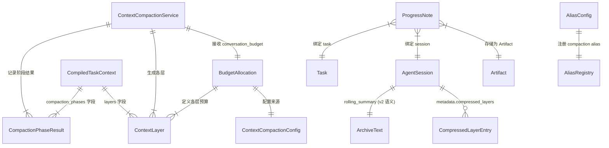

# Data Model: 060 Context Engineering Enhancement

**Date**: 2026-03-17
**Spec**: `.specify/features/060-context-engineering-enhancement/spec.md`
**Plan**: `.specify/features/060-context-engineering-enhancement/plan.md`

## 概览

Feature 060 的数据模型变更主要涉及三个层面：
1. **新增数据类**：BudgetAllocation、ContextLayer、CompactionPhaseResult、ProgressNote
2. **扩展现有模型**：CompiledTaskContext、ContextCompactionConfig、AgentSession.metadata
3. **Schema 迁移**：rolling_summary 语义升级（v1 -> v2）

所有变更不涉及 SQLite 表结构变更（metadata 为 JSON 列，天然可扩展）。

---

## 新增数据类

### BudgetAllocation

**位置**: `gateway/services/context_budget.py`
**用途**: 全局 token 预算分配结果，由 ContextBudgetPlanner 生成，传递给压缩层和装配层。

```python
@dataclass(frozen=True)
class BudgetAllocation:
    max_input_tokens: int
    """总 token 预算上限（来自 ContextCompactionConfig）"""

    system_blocks_budget: int
    """系统块预算（AgentProfile + Owner + Behavior + ToolGuide + AmbientRuntime + Bootstrap + RuntimeContext）"""

    skill_injection_budget: int
    """已加载 Skill 内容预估 token 数"""

    memory_recall_budget: int
    """Memory 回忆预估 token 数"""

    progress_notes_budget: int
    """Worker 进度笔记预估 token 数"""

    conversation_budget: int
    """对话历史预算 = max_input_tokens - system_blocks_budget - skill_injection_budget - memory_recall_budget - progress_notes_budget"""

    estimation_method: str
    """token 估算方法: "tokenizer" | "cjk_aware" | "legacy_char_div_4" """

    detail: dict[str, Any] = field(default_factory=dict)
    """调试用详情，如各组件的预估明细"""
```

**约束**:
- `conversation_budget >= 800`（MIN_CONVERSATION_BUDGET）
- 各部分之和 `<= max_input_tokens`
- `estimation_method` 反映实际使用的估算算法

### ContextLayer

**位置**: `gateway/services/context_compaction.py`
**用途**: 描述一个压缩层级，用于 CompiledTaskContext.layers 审计。

```python
@dataclass(frozen=True)
class ContextLayer:
    layer_id: str
    """层级标识: "recent" | "compressed" | "archive" """

    turns: int
    """该层覆盖的原始轮次数"""

    token_count: int
    """该层实际占用的 token 数"""

    max_tokens: int
    """该层的 token 预算上限"""

    entry_count: int
    """该层的消息条目数"""
```

### CompactionPhaseResult

**位置**: `gateway/services/context_compaction.py`
**用途**: 记录两阶段压缩每阶段的执行情况。

```python
@dataclass(frozen=True)
class CompactionPhaseResult:
    phase: str
    """阶段标识: "cheap_truncation" | "llm_summary" """

    messages_affected: int
    """受影响的消息数"""

    tokens_saved: int
    """节省的 token 数"""

    model_used: str
    """使用的模型 alias（cheap_truncation 阶段为空字符串）"""
```

### ProgressNote

**位置**: `packages/tooling/src/octoagent/tooling/progress_note.py`
**用途**: Worker 写入的结构化进度笔记。

输入模型（工具参数）：

```python
class ProgressNoteInput(BaseModel):
    step_id: str = Field(
        min_length=1,
        description="步骤标识（如 'step_1', 'data_collection'）",
    )
    description: str = Field(
        min_length=1,
        description="本步骤做了什么",
    )
    status: Literal["completed", "in_progress", "blocked"] = Field(
        default="completed",
        description="步骤状态",
    )
    key_decisions: list[str] = Field(
        default_factory=list,
        description="本步骤的关键决策（如'选择了方案 B'）",
    )
    next_steps: list[str] = Field(
        default_factory=list,
        description="接下来需要做什么",
    )
```

输出模型：

```python
class ProgressNoteOutput(BaseModel):
    note_id: str = Field(description="笔记唯一 ID")
    persisted: bool = Field(description="是否成功持久化")
```

Artifact 存储格式（JSON part）：

```json
{
    "note_id": "pn-01HXYZ...",
    "task_id": "01HXYZ...",
    "agent_session_id": "ses-01HXYZ...",
    "step_id": "data_collection",
    "description": "已从 API 获取原始数据 1200 条",
    "status": "completed",
    "key_decisions": ["选择批量接口而非逐条查询"],
    "next_steps": ["数据清洗", "格式转换"],
    "created_at": "2026-03-17T10:30:00Z"
}
```

Artifact 元信息：

| 字段 | 值 |
|------|-----|
| `artifact_id` | `pn-{task_id[:8]}-{step_id}-{ulid}` |
| `task_id` | 当前任务 ID |
| `name` | `progress-note:{step_id}` |
| `mime_type` | `application/json` |
| `metadata.type` | `progress-note` |
| `metadata.agent_session_id` | 当前 session ID |

---

## 扩展现有模型

### CompiledTaskContext 扩展

**位置**: `gateway/services/context_compaction.py`

新增字段：

```python
@dataclass(frozen=True)
class CompiledTaskContext:
    # ... 现有字段保持不变 ...

    # 060 新增
    layers: list[dict[str, Any]] = field(default_factory=list)
    """各压缩层级的审计信息。格式:
    [
        {"layer_id": "recent", "turns": 4, "token_count": 1200, "max_tokens": 1500, "entry_count": 4},
        {"layer_id": "compressed", "turns": 8, "token_count": 800, "max_tokens": 900, "entry_count": 2},
        {"layer_id": "archive", "turns": 12, "token_count": 400, "max_tokens": 600, "entry_count": 1}
    ]
    """

    compaction_phases: list[dict[str, Any]] = field(default_factory=list)
    """两阶段压缩的执行详情。格式:
    [
        {"phase": "cheap_truncation", "messages_affected": 3, "tokens_saved": 800, "model_used": ""},
        {"phase": "llm_summary", "messages_affected": 2, "tokens_saved": 600, "model_used": "compaction"}
    ]
    """

    compaction_version: str = ""
    """压缩版本: "v1" (034 扁平摘要) | "v2" (060 三层结构)"""
```

### ContextCompactionConfig 扩展

**位置**: `gateway/services/context_compaction.py`

新增字段：

```python
@dataclass(frozen=True)
class ContextCompactionConfig:
    # ... 现有字段保持不变 ...

    # 060 新增
    compaction_alias: str = "compaction"
    """压缩专用模型 alias，fallback 链: compaction -> summarizer_alias -> main"""

    large_message_ratio: float = 0.3
    """单条消息超过 conversation_budget * large_message_ratio 时触发廉价截断"""

    json_smart_truncate: bool = True
    """对 JSON 内容启用智能精简（保留关键字段，裁剪数组）"""

    recent_ratio: float = 0.50
    """Recent 层在 conversation_budget 中的占比"""

    compressed_ratio: float = 0.30
    """Compressed 层在 conversation_budget 中的占比"""

    archive_ratio: float = 0.20
    """Archive 层在 conversation_budget 中的占比"""

    compressed_window_size: int = 4
    """Compressed 层分组窗口大小（turn 数）"""

    async_compaction_timeout: float = 10.0
    """异步压缩超时时间（秒）"""

    progress_note_inject_limit: int = 5
    """上下文中注入的最大进度笔记条数"""

    progress_note_merge_threshold: int = 50
    """触发旧笔记合并的阈值"""
```

环境变量映射：

| 字段 | 环境变量 | 默认值 |
|------|---------|--------|
| `compaction_alias` | `OCTOAGENT_CONTEXT_COMPACTION_ALIAS` | `"compaction"` |
| `large_message_ratio` | `OCTOAGENT_CONTEXT_LARGE_MSG_RATIO` | `0.3` |
| `json_smart_truncate` | `OCTOAGENT_CONTEXT_JSON_SMART_TRUNCATE` | `true` |
| `recent_ratio` | `OCTOAGENT_CONTEXT_RECENT_RATIO` | `0.50` |
| `compressed_ratio` | `OCTOAGENT_CONTEXT_COMPRESSED_RATIO` | `0.30` |
| `archive_ratio` | `OCTOAGENT_CONTEXT_ARCHIVE_RATIO` | `0.20` |
| `compressed_window_size` | `OCTOAGENT_CONTEXT_COMPRESSED_WINDOW` | `4` |
| `async_compaction_timeout` | `OCTOAGENT_CONTEXT_ASYNC_TIMEOUT` | `10.0` |
| `progress_note_inject_limit` | `OCTOAGENT_PROGRESS_NOTE_INJECT_LIMIT` | `5` |
| `progress_note_merge_threshold` | `OCTOAGENT_PROGRESS_NOTE_MERGE_THRESHOLD` | `50` |

### AgentSession.metadata 扩展

**位置**: `packages/core/src/octoagent/core/models/agent_context.py`

AgentSession 模型本身不变（metadata 为 `dict[str, Any]`），但约定新增以下 metadata 键：

```python
# 060 新增 metadata 键
{
    "compaction_version": "v2",          # str: "v1" | "v2"
    "compressed_layers": [               # list[dict]: Compressed 层条目
        {
            "group_index": 0,            # int: 分组索引
            "turn_range": [4, 8],        # list[int]: 覆盖的 turn 范围 [start, end)
            "summary": "...",            # str: 该组的摘要文本
            "key_decisions": ["..."],    # list[str]: 关键决策
            "created_at": "2026-..."     # str: ISO 格式时间戳
        }
    ],
    "pending_compaction_id": "",         # str: 正在进行的后台压缩任务 ID（异步压缩用）
}
```

### AliasConfig 新增条目

**位置**: `packages/provider/src/octoagent/provider/alias.py`

在 `_get_default_aliases()` 中新增：

```python
AliasConfig(
    name="compaction",
    category="cheap",
    runtime_group="cheap",
    description="上下文压缩（推荐轻量模型如 haiku / gpt-4o-mini）",
)
```

---

## Schema 迁移

### rolling_summary 语义升级

**变更**: `AgentSession.rolling_summary` 从"全部历史的扁平摘要"升级为"Archive 层骨架摘要"。

**迁移策略**: 零停机、向后兼容

1. 新 session 创建时，`metadata.compaction_version = "v2"`
2. 旧 session（无 `compaction_version` 或 `= "v1"`）的 `rolling_summary` 按旧语义读取（整体作为 Archive 层文本）
3. 首次 v2 格式压缩时，旧 `rolling_summary` 内容直接作为 Archive 层初始内容，不做格式转换
4. `compressed_layers` 从空列表开始累积

**读取兼容逻辑**:

```python
def _parse_compaction_state(session: AgentSession) -> tuple[str, list[dict], str]:
    """解析 session 的压缩状态。

    Returns:
        (archive_text, compressed_layers, compaction_version)
    """
    version = session.metadata.get("compaction_version", "v1")
    compressed = session.metadata.get("compressed_layers", [])
    if version == "v2" and isinstance(compressed, list):
        return (session.rolling_summary, compressed, "v2")
    # v1 兼容：rolling_summary 整体视为 archive
    return (session.rolling_summary, [], "v1")
```

---

## 实体关系图



---

## 不变量（Invariants）

1. `BudgetAllocation` 各部分之和 `<= max_input_tokens`
2. `conversation_budget >= 800`（防止对话预算被系统块挤压到不可用）
3. `recent_ratio + compressed_ratio + archive_ratio == 1.0`
4. `compaction_version` 一旦升级为 `"v2"` 不可降级回 `"v1"`
5. `compressed_layers` 的 `turn_range` 不重叠
6. 进度笔记的 `step_id` 在同一 `task_id + agent_session_id` 范围内可重复（代表同一步骤的多次更新）
7. Archive 层的 `rolling_summary` 长度 <= `conversation_budget * archive_ratio` 对应的字符数
