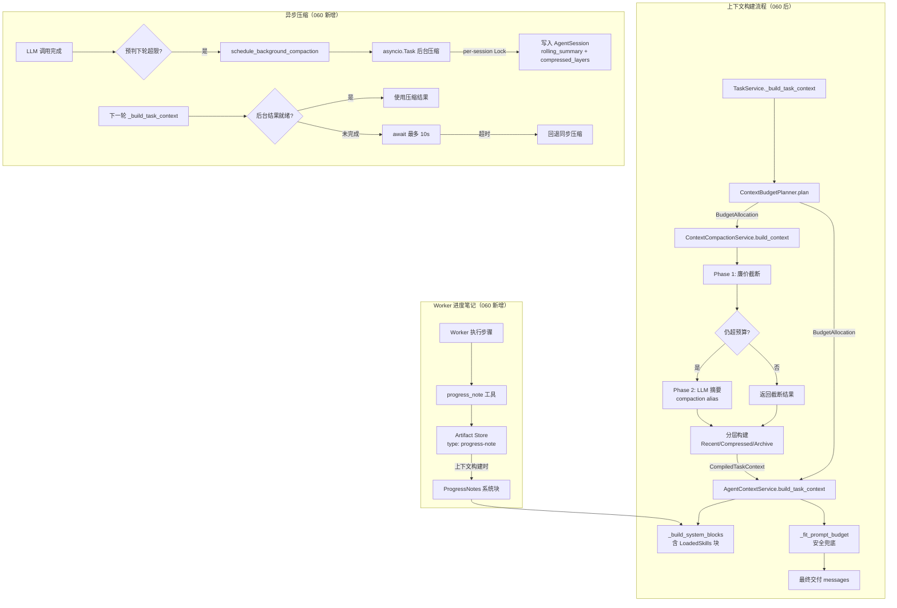
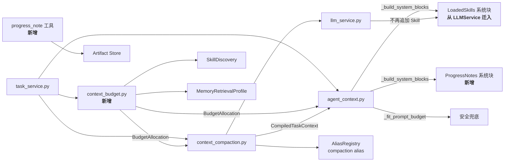

# Implementation Plan: 060 Context Engineering Enhancement

**Branch**: `claude/festive-meitner` | **Date**: 2026-03-17 | **Spec**: `.specify/features/060-context-engineering-enhancement/spec.md`
**Input**: Feature specification + codebase analysis + clarifications from `.specify/features/060-context-engineering-enhancement/clarifications.md`

## Summary

将 OctoAgent 的上下文管理从 Feature 034 的基础二级压缩升级为产品级 Context Engineering 体系。核心改动：(1) 引入 ContextBudgetPlanner 统一全局 token 预算（消除压缩层/装配层/Skill 注入三段断裂）；(2) 中文感知 token 估算替换 `len/4` 硬编码；(3) 三层历史结构 Recent/Compressed/Archive；(4) 两阶段压缩（廉价截断 + LLM 摘要）；(5) 异步后台压缩；(6) Worker 进度笔记协议；(7) compaction 语义别名可独立配置。

## Technical Context

**Language/Version**: Python 3.12+
**Primary Dependencies**: FastAPI, Pydantic, structlog, asyncio, tiktoken (optional)
**Storage**: SQLite WAL（AgentSession.metadata 扩展 + Artifact Store for progress notes）
**Testing**: pytest, pytest-asyncio
**Target Platform**: macOS / Linux 单机
**Project Type**: web（backend Python + frontend React/Vite）
**Performance Goals**: 异步压缩后 p50 请求延迟不高于 Feature 034 同步压缩方案
**Constraints**: 总交付 token <= max_input_tokens；中文 token 估算误差 < 30%；后台压缩超时 10s 回退同步
**Scale/Scope**: 单用户、单进程 async 架构

## Constitution Check

*GATE: Must pass before Phase 0 research. Re-check after Phase 1 design.*

| 原则 | 适用性 | 评估 | 说明 |
|------|--------|------|------|
| 1. Durability First | HIGH | PASS | 异步压缩结果通过 `rolling_summary` + `metadata["compressed_layers"]` 持久化到 AgentSession（SQLite）；进度笔记存储为 Artifact（SQLite）；进程重启后不丢失。后台 asyncio.Task 丢失不影响正确性（下一轮同步重建）。 |
| 2. Everything is an Event | HIGH | PASS | 所有压缩路径继续生成 `CONTEXT_COMPACTION_COMPLETED` 事件，扩展 payload 增加 layers/phase 信息；进度笔记写入生成 `ARTIFACT_CREATED` 事件。 |
| 3. Tools are Contracts | MEDIUM | PASS | 新增 `progress_note` 工具遵循 Pydantic schema 声明，副作用等级 `none`（只写 Artifact Store，不修改外部系统）。 |
| 4. Side-effect Must be Two-Phase | LOW | PASS | progress_note 写入的是 Agent 内部状态（Artifact Store），属于可逆的内部记录，不属于不可逆外部操作。无需 Plan->Gate->Execute。 |
| 5. Least Privilege by Default | LOW | PASS | 无新增 secrets 访问；compaction model alias 通过 AliasRegistry 解析，不暴露实际模型凭证。 |
| 6. Degrade Gracefully | HIGH | PASS | compaction alias 有三级 fallback 链 `compaction -> summarizer -> main`；tiktoken 不可用时 fallback 到 CJK 感知字符估算；异步压缩超时/失败回退同步路径；BudgetPlanner 预估不准时 `_fit_prompt_budget()` 暴力搜索兜底。 |
| 7. User-in-Control | MEDIUM | PASS | compaction model 可在 Settings 中配置和修改；压缩行为可通过环境变量关闭。 |
| 8. Observability is a Feature | HIGH | PASS | `CompiledTaskContext.layers` 字段提供各层 token 审计；压缩事件记录两阶段详情（截断数/摘要数/模型）；control plane 可查 Worker 进度笔记。 |
| 9. 不猜关键配置 | LOW | PASS | 不涉及外部系统配置操作。 |
| 10. Bias to Action | N/A | N/A | Agent 行为层面，不影响。 |
| 11. Context Hygiene | HIGH | PASS | 本 Feature 正是强化上下文卫生的核心改进——廉价截断大消息、分层压缩、全局预算管理。 |
| 12. 记忆写入必须治理 | LOW | PASS | progress_note 写入 Artifact Store（非 SoR），不经过记忆仲裁器。 |
| 13. 失败必须可解释 | MEDIUM | PASS | 压缩失败分类记录到 degraded_reason；fallback 链路记录到事件；BudgetPlanner 预估偏差记录到 context_frame.budget。 |
| 13A. 优先提供上下文 | MEDIUM | PASS | 进度笔记作为独立系统块注入上下文，让模型基于事实决策而非硬编码恢复逻辑。 |
| 14. A2A Protocol | LOW | PASS | progress_note Artifact 使用标准 A2A parts 结构（JSON part）。 |

**Constitution Check Result**: ALL PASS. 无需豁免。

## Architecture

### 数据流 Mermaid 图



### 模块依赖关系



## Project Structure

### Documentation (this feature)

```text
.specify/features/060-context-engineering-enhancement/
  plan.md              # 本文件
  data-model.md        # 数据模型变更
  contracts/           # API 契约变更
    context-budget-api.md
    progress-note-tool.md
    compaction-alias-api.md
  spec.md              # 需求规范
  clarifications.md    # 澄清记录
  checklists/
    requirements.md    # 需求质量检查
```

### Source Code (repository root)

```text
octoagent/
  apps/gateway/src/octoagent/gateway/services/
    context_budget.py              # [NEW] ContextBudgetPlanner + BudgetAllocation
    context_compaction.py          # [MODIFY] 三层压缩、两阶段、异步、CJK token 估算
    agent_context.py               # [MODIFY] LoadedSkills 系统块、ProgressNotes 系统块、SessionReplay 收窄
    llm_service.py                 # [MODIFY] 移除 _build_loaded_skills_context 追加逻辑
    task_service.py                # [MODIFY] 调用 BudgetPlanner、触发异步压缩

  packages/provider/src/octoagent/provider/
    alias.py                       # [MODIFY] 新增 compaction 语义别名

  packages/tooling/src/octoagent/tooling/
    progress_note.py               # [NEW] progress_note 工具定义

  packages/core/src/octoagent/core/models/
    agent_context.py               # [MODIFY] AgentSession.metadata 扩展、CompiledTaskContext.layers

  frontend/src/domains/settings/
    SettingsProviderSection.tsx     # [MODIFY] 展示 compaction 别名

  apps/gateway/tests/
    test_context_compaction.py     # [MODIFY] 扩展测试
    test_context_budget.py         # [NEW] BudgetPlanner 测试
    test_progress_note.py          # [NEW] 进度笔记测试
```

**Structure Decision**: 遵循现有 monorepo 结构。新增唯一模块文件 `context_budget.py` 放在 `gateway/services/` 下（与 context_compaction.py 同级），因为 BudgetPlanner 是压缩层和装配层的上游协调者。`progress_note` 工具定义放在 `packages/tooling/` 下，遵循现有工具定义模式。

## Phase 0: 全局 Token 预算统一 + Token 估算升级（地基）

**对应 FR**: FR-000, FR-000a, FR-000b, FR-000c, FR-000d, FR-000e, FR-000f
**优先级**: P0（所有后续 Phase 的前提）

### 0.1 中文感知 Token 估算

**当前问题**: `estimate_text_tokens()` 在 `context_compaction.py:533-538` 使用 `len(text) / 4`，中文 ~1.5-2 chars/token，导致中文内容 token 被低估约 50-100%。

**改动文件**: `context_compaction.py`

**方案**:

```python
def estimate_text_tokens(text: str) -> int:
    """中文感知的 token 估算。

    检测文本中非 ASCII 字符比例 r，在英文估算（len/4）和中文估算（len/1.5）
    之间加权插值：len(text) / (4*(1-r) + 1.5*r)。

    可选：若 tiktoken 可导入，使用 cl100k_base encoder 精确计算。
    """
    cleaned = text.strip()
    if not cleaned:
        return 0
    # 尝试精确 tokenizer
    if _tiktoken_encoder is not None:
        return max(1, len(_tiktoken_encoder.encode(cleaned)))
    # CJK 感知估算
    non_ascii = sum(1 for c in cleaned if ord(c) > 127)
    r = non_ascii / len(cleaned) if cleaned else 0.0
    chars_per_token = 4.0 * (1.0 - r) + 1.5 * r
    return max(1, math.ceil(len(cleaned) / chars_per_token))

# 模块级初始化（一次性）
_tiktoken_encoder = None
try:
    import tiktoken
    _tiktoken_encoder = tiktoken.get_encoding("cl100k_base")
except (ImportError, Exception):
    pass
```

**同步修正**: `_chunk_segments_by_token_budget()` 中 `char_budget = max(256, transcript_budget * 4)` 的硬编码 `*4` 改为动态计算：

```python
def _chars_per_token_ratio(text_sample: str = "") -> float:
    """根据文本内容动态计算 chars-per-token 比率。"""
    if not text_sample:
        return 3.0  # 保守中间值
    non_ascii = sum(1 for c in text_sample if ord(c) > 127)
    r = non_ascii / len(text_sample) if text_sample else 0.0
    return 4.0 * (1.0 - r) + 1.5 * r

# 在 _chunk_segments_by_token_budget 中：
sample_text = " ".join(s[:200] for s in segments[:3])
cpt = _chars_per_token_ratio(sample_text)
char_budget = max(256, int(transcript_budget * cpt))
```

### 0.2 ContextBudgetPlanner

**新增文件**: `gateway/services/context_budget.py`

**核心接口**:

```python
@dataclass(frozen=True)
class BudgetAllocation:
    """全局 token 预算分配结果。"""
    max_input_tokens: int
    system_blocks_budget: int      # AgentProfile + Owner + Behavior + ToolGuide + ...
    skill_injection_budget: int    # 已加载 Skill 内容预估
    memory_recall_budget: int      # Memory 回忆预估
    progress_notes_budget: int     # Worker 进度笔记预估
    conversation_budget: int       # max_input_tokens - 上述总和，传给压缩层
    estimation_method: str         # "cjk_aware" | "tokenizer" | "legacy_char_div_4"

class ContextBudgetPlanner:
    """在上下文构建开始时统一规划各组成部分的 token 预算分配。"""

    # 系统块基础开销预估（基于代码审查的经验值）
    _SYSTEM_BLOCKS_BASE: int = 1800  # AgentProfile ~80 + Owner ~150 + Behavior 400-1200 + ToolGuide 200-400 + AmbientRuntime ~120 + Bootstrap ~100 + RuntimeContext ~100
    _SKILL_PER_ENTRY: int = 250      # 每个 Skill 平均 token
    _MEMORY_PER_HIT: int = 60        # 每个 memory hit 平均 token
    _PROGRESS_NOTE_PER_ENTRY: int = 80  # 每条进度笔记平均 token
    _SESSION_REPLAY_BUDGET: int = 400   # SessionReplay 预留
    _MIN_CONVERSATION_BUDGET: int = 800 # 对话预算下限

    def __init__(
        self,
        *,
        config: ContextCompactionConfig,
        skill_discovery: SkillDiscovery | None = None,
    ) -> None: ...

    def plan(
        self,
        *,
        max_input_tokens: int,
        loaded_skill_names: list[str] | None = None,
        memory_top_k: int = 6,
        has_progress_notes: bool = False,
        progress_note_count: int = 0,
    ) -> BudgetAllocation: ...
```

**计算逻辑**:

1. `system_blocks_budget = _SYSTEM_BLOCKS_BASE + _SESSION_REPLAY_BUDGET`
2. `skill_injection_budget = len(loaded_skill_names) * _SKILL_PER_ENTRY`（精确版：遍历 SkillDiscovery 缓存，用 `estimate_text_tokens(entry.content)` 计算）
3. `memory_recall_budget = memory_top_k * _MEMORY_PER_HIT`
4. `progress_notes_budget = min(progress_note_count, 5) * _PROGRESS_NOTE_PER_ENTRY` if has_progress_notes else 0
5. `conversation_budget = max(_MIN_CONVERSATION_BUDGET, max_input_tokens - system_blocks_budget - skill_injection_budget - memory_recall_budget - progress_notes_budget)`
6. 如果 conversation_budget 被 clamp 到 `_MIN_CONVERSATION_BUDGET`，记录 warning 并按比例缩减 skill/memory/progress 预算

### 0.3 Skill 注入修复

**改动文件**: `agent_context.py`, `llm_service.py`

**方案**: 将 `LLMService._build_loaded_skills_context()` 的 Skill 内容注入从 `_try_call_with_tools()` 之后追加，迁移到 `AgentContextService._build_system_blocks()` 中作为独立的 `LoadedSkills` 系统块。

**agent_context.py `_build_system_blocks()` 新增参数和块**:

```python
def _build_system_blocks(
    self,
    *,
    # ... 现有参数 ...
    loaded_skills_content: str = "",  # 新增：已组装的 Skill 注入内容
) -> tuple[list[dict[str, str]], list[str]]:
    # ... 现有块 ...

    # LoadedSkills 系统块（060 新增）
    if loaded_skills_content:
        blocks.append({
            "role": "system",
            "content": loaded_skills_content,
        })

    # ... 后续块 ...
```

**llm_service.py 改动**: 在 `_try_call_with_tools()` 中移除 `_build_loaded_skills_context()` 追加到 `base_description` 的逻辑。`_build_loaded_skills_context()` 方法保留但标记为内部工具方法，供 `AgentContextService` 通过 LLMService 实例调用获取 Skill 内容文本。

**调用链变更**:

```
原：TaskService._build_task_context()
  -> ContextCompactionService.build_context() [不知道系统块预算]
  -> AgentContextService.build_task_context()
    -> _fit_prompt_budget() [不含 Skill]
  -> LLMService._try_call_with_tools() [追加 Skill，游离于预算外]

新：TaskService._build_task_context()
  -> ContextBudgetPlanner.plan() [统一预算]
  -> ContextCompactionService.build_context(conversation_budget=...) [用精确预算]
  -> AgentContextService.build_task_context(budget_allocation=..., loaded_skills_content=...)
    -> _build_system_blocks(loaded_skills_content=...) [Skill 作为系统块]
    -> _fit_prompt_budget() [含 Skill，作为安全兜底]
  -> LLMService._try_call_with_tools() [不再追加 Skill]
```

### 0.4 ContextCompactionService.build_context() 接口升级

**改动文件**: `context_compaction.py`

新增可选参数 `conversation_budget`:

```python
async def build_context(
    self,
    *,
    task_id: str,
    fallback_user_text: str,
    llm_service,
    dispatch_metadata: dict[str, Any] | None = None,
    worker_capability: str | None = None,
    tool_profile: str | None = None,
    conversation_budget: int | None = None,  # 060 新增
) -> CompiledTaskContext:
```

当 `conversation_budget` 传入时，`_should_compact()` 和 `target_tokens` 基于 `conversation_budget` 而非 `max_input_tokens`。未传入时回退到 `max_input_tokens`（向后兼容）。

### 0.5 task_service.py 集成

**改动文件**: `task_service.py`

`_build_task_context()` 改动：

```python
async def _build_task_context(self, ...) -> CompiledTaskContext:
    # 060 新增：统一预算规划
    budget = self._budget_planner.plan(
        max_input_tokens=self._context_compaction._config.max_input_tokens,
        loaded_skill_names=dispatch_metadata.get("loaded_skill_names", []),
        memory_top_k=...,
        has_progress_notes=...,
    )

    compiled = await self._context_compaction.build_context(
        ...,
        conversation_budget=budget.conversation_budget,  # 060 新增
    )

    # 获取 Skill 内容（从 LLMService 的 SkillDiscovery 构建）
    loaded_skills_content = llm_service._build_loaded_skills_context(dispatch_metadata)

    return await self._agent_context.build_task_context(
        ...,
        budget_allocation=budget,  # 060 新增
        loaded_skills_content=loaded_skills_content,  # 060 新增
    )
```

## Phase 1: 压缩模型配置 + 两阶段压缩

**对应 FR**: FR-001 ~ FR-004, FR-010 ~ FR-013
**优先级**: P1
**依赖**: Phase 0

### 1.1 compaction 语义别名

**改动文件**: `packages/provider/src/octoagent/provider/alias.py`

在 `_get_default_aliases()` 中新增：

```python
AliasConfig(
    name="compaction",
    category="cheap",
    runtime_group="cheap",
    description="上下文压缩（推荐轻量模型如 haiku / gpt-4o-mini）",
),
```

### 1.2 Fallback 链实现

**改动文件**: `context_compaction.py`

`ContextCompactionConfig` 新增字段：

```python
compaction_alias: str = "compaction"
```

`_call_summarizer()` 改动——实现 `compaction -> summarizer -> main` fallback：

```python
async def _call_summarizer(self, ...) -> str:
    alias_chain = [self._config.compaction_alias, self._config.summarizer_alias, "main"]
    used_alias = alias_chain[0]

    for alias in alias_chain:
        try:
            result = await llm_service.call(
                ...,
                model_alias=alias,
                ...
            )
            used_alias = alias
            return truncate_chars(result.content.strip(), self._config.summary_max_chars)
        except Exception as exc:
            log.warning("compaction_alias_fallback", alias=alias, error=str(exc))
            continue

    # 全部失败
    return ""
```

实际使用的 alias 记录到 `CompiledTaskContext.summary_model_alias`。

### 1.3 两阶段压缩

**改动文件**: `context_compaction.py`

新增 `_cheap_truncation_phase()` 方法，在 `build_context()` 中 LLM 摘要之前调用：

```python
def _cheap_truncation_phase(
    self,
    messages: list[dict[str, str]],
    conversation_budget: int,
) -> tuple[list[dict[str, str]], int]:
    """Phase 1: 廉价截断大消息。

    - 单条消息超过 conversation_budget * 0.3 时截断
    - JSON 内容智能精简（保留 status/error/result，数组只保留前 2 项）
    - 非 JSON 内容保留头 40% + 尾 10% + 中间截断标记

    Returns:
        (truncated_messages, messages_affected_count)
    """
```

JSON 智能截断逻辑：

```python
def _smart_truncate_json(self, text: str, max_tokens: int) -> str:
    """尝试解析 JSON 并智能精简。"""
    try:
        data = json.loads(text)
        return json.dumps(
            self._prune_json_value(data, depth=0, max_depth=3),
            ensure_ascii=False,
            indent=None,
        )
    except (json.JSONDecodeError, TypeError):
        return self._head_tail_truncate(text, max_tokens)

def _prune_json_value(self, value, depth: int, max_depth: int):
    """递归精简 JSON 值。"""
    if isinstance(value, dict):
        # 保留关键字段
        priority_keys = {"status", "error", "result", "message", "code", "id", "name", "type"}
        pruned = {}
        for k, v in value.items():
            if k in priority_keys or depth < max_depth:
                pruned[k] = self._prune_json_value(v, depth + 1, max_depth)
        if len(pruned) < len(value):
            pruned["__truncated_keys"] = len(value) - len(pruned)
        return pruned
    if isinstance(value, list):
        if len(value) <= 2:
            return [self._prune_json_value(item, depth + 1, max_depth) for item in value]
        return [
            self._prune_json_value(value[0], depth + 1, max_depth),
            self._prune_json_value(value[1], depth + 1, max_depth),
            f"... ({len(value) - 2} more items)",
        ]
    return value
```

非 JSON 截断逻辑：

```python
def _head_tail_truncate(self, text: str, max_tokens: int) -> str:
    """保留头 40% + 尾 10% + 中间截断标记。"""
    max_chars = int(max_tokens * _chars_per_token_ratio(text))
    if len(text) <= max_chars:
        return text
    head_size = int(max_chars * 0.4)
    tail_size = int(max_chars * 0.1)
    middle_tokens = estimate_text_tokens(text) - max_tokens
    return (
        text[:head_size].rstrip()
        + f"\n\n[... truncated ~{middle_tokens} tokens ...]\n\n"
        + text[-tail_size:].lstrip()
    )
```

**CompactionPhaseResult 记录**：

```python
@dataclass(frozen=True)
class CompactionPhaseResult:
    phase: str  # "cheap_truncation" | "llm_summary"
    messages_affected: int
    tokens_saved: int
    model_used: str  # phase 1 为空
```

新增到 `CompiledTaskContext`：

```python
compaction_phases: list[dict[str, Any]] = field(default_factory=list)
```

### 1.4 Settings 前端

**改动文件**: `frontend/src/domains/settings/SettingsProviderSection.tsx`

在 alias 编辑器中，当 alias 为 `compaction` 时，显示额外提示：

```text
上下文压缩（推荐轻量模型如 haiku / gpt-4o-mini）
当前 fallback 链：compaction -> summarizer -> main
```

无需新增页面或 API endpoint，因为 alias 配置已通过现有 Settings API 支持 CRUD。

## Phase 2: 分层历史结构

**对应 FR**: FR-005 ~ FR-009a
**优先级**: P1
**依赖**: Phase 0, Phase 1

### 2.1 三层数据结构

新增 `ContextLayer` 数据类到 `context_compaction.py`：

```python
@dataclass(frozen=True)
class ContextLayer:
    layer_id: str  # "recent" | "compressed" | "archive"
    turns: int     # 该层覆盖的原始轮次数
    token_count: int
    max_tokens: int
    entries: list[dict[str, str]]  # 该层的消息列表
```

### 2.2 build_context() 重构

`build_context()` 核心逻辑变更：

```
1. 加载全部 turns
2. 调用 _cheap_truncation_phase() [Phase 1]
3. 计算各层预算：
   recent_budget  = conversation_budget * 0.50
   compressed_budget = conversation_budget * 0.30
   archive_budget = conversation_budget * 0.20
4. 分配层级：
   - Recent: 最近 recent_turns 轮原文
   - 剩余 turns 按固定 window（3-4 轮为一组）分组
   - 最新的若干组 -> Compressed 层（每组 LLM 摘要，保留决策）
   - 更旧的组 -> Archive 层（递归合并为骨架摘要）
5. 如果 Archive 层来自已有 rolling_summary（v2 格式），直接复用
6. 构建 CompiledTaskContext，包含 layers 字段
```

### 2.3 Compressed 层分组策略

MVP 使用固定轮次窗口：

```python
_COMPRESSED_WINDOW_SIZE = 4  # 每 4 个 turn（2 轮 user+assistant 对）为一组

def _group_turns_to_compressed(
    self,
    turns: list[ConversationTurn],
) -> list[list[ConversationTurn]]:
    """将中间轮次按固定窗口分组。"""
    groups = []
    for i in range(0, len(turns), _COMPRESSED_WINDOW_SIZE):
        group = turns[i : i + _COMPRESSED_WINDOW_SIZE]
        if group:
            groups.append(group)
    return groups
```

每组生成一段保留决策的摘要（使用与当前 `_summarize_turns` 相同的 LLM 调用，但 prompt 调整为"保留关键决策和结论"）。

### 2.4 Archive 层与 rolling_summary 整合

`AgentSession.rolling_summary` 的语义从"全部历史的扁平摘要"升级为"Archive 层骨架摘要"。

`AgentSession.metadata` 新增字段：

```python
{
    "compaction_version": "v2",        # "v1" = 034 扁平摘要, "v2" = 060 Archive 层
    "compressed_layers": [             # Compressed 层内容
        {
            "group_index": 0,
            "turn_range": [4, 8],
            "summary": "...",
            "key_decisions": ["..."],
            "created_at": "2026-03-17T..."
        },
        ...
    ],
}
```

读取兼容逻辑：

```python
def _parse_rolling_summary(
    self,
    agent_session: AgentSession,
) -> tuple[str, list[dict], str]:
    """返回 (archive_text, compressed_layers, compaction_version)"""
    version = agent_session.metadata.get("compaction_version", "v1")
    if version == "v2":
        return (
            agent_session.rolling_summary,  # Archive 层
            agent_session.metadata.get("compressed_layers", []),
            "v2",
        )
    # v1 兼容：旧 rolling_summary 整体作为 Archive
    return (agent_session.rolling_summary, [], "v1")
```

### 2.5 SessionReplay 职责收窄

**改动文件**: `agent_context.py`

在 `_build_system_blocks()` 中，当有 Compressed 层数据时，SessionReplay 只注入"上次 session 的最终状态摘要"，不再承担当前 session 内中期历史的职责。

`_fit_prompt_budget()` 中 SessionReplay 的 `dialogue_limit` 梯度（8->6->4->3->None）保留，但增加条件判断：

```python
# 如果当前 session 有 compressed_layers，跳过 SessionReplay 的 dialogue 级回放
if has_compressed_layers:
    replay_options = [
        self._trim_session_replay_projection(
            session_replay,
            dialogue_limit=0,  # 只保留 session summary，不回放 dialogue
            tool_limit=0,
            include_summary=True,
            include_reply_preview=False,
        ),
        None,
    ]
```

### 2.6 CompiledTaskContext 扩展

```python
@dataclass(frozen=True)
class CompiledTaskContext:
    # ... 现有字段 ...

    # 060 新增
    layers: list[dict[str, Any]] = field(default_factory=list)
    # 格式: [{"layer_id": "recent", "turns": 4, "token_count": 1200, "max_tokens": 1500}, ...]
    compaction_phases: list[dict[str, Any]] = field(default_factory=list)
    # 格式: [{"phase": "cheap_truncation", "messages_affected": 3, "tokens_saved": 800, "model_used": ""}, ...]
    compaction_version: str = ""  # "v1" | "v2"
```

## Phase 3: 异步后台压缩

**对应 FR**: FR-014 ~ FR-017
**优先级**: P2
**依赖**: Phase 0, Phase 2

### 3.1 异步压缩调度

**改动文件**: `context_compaction.py`, `task_service.py`

新增方法到 `ContextCompactionService`：

```python
# 类属性
_compaction_locks: dict[str, asyncio.Lock] = {}
_pending_compactions: dict[str, asyncio.Task] = {}

async def schedule_background_compaction(
    self,
    *,
    agent_session_id: str,
    task_id: str,
    llm_service,
    conversation_budget: int,
    dispatch_metadata: dict[str, Any] | None = None,
    worker_capability: str | None = None,
    tool_profile: str | None = None,
) -> None:
    """在后台启动压缩任务（如果预判下一轮可能超限）。"""
    if agent_session_id in self._pending_compactions:
        return  # 已有后台任务，不重复启动

    lock = self._compaction_locks.setdefault(agent_session_id, asyncio.Lock())

    async def _bg_compact():
        try:
            async with lock:
                result = await asyncio.wait_for(
                    self._do_background_compaction(...),
                    timeout=10.0,
                )
                # 写入 AgentSession
                await self._persist_compaction_result(agent_session_id, result)
        except asyncio.TimeoutError:
            log.warning("background_compaction_timeout", session=agent_session_id)
        except Exception as exc:
            log.warning("background_compaction_failed", error=str(exc))
        finally:
            self._pending_compactions.pop(agent_session_id, None)

    task = asyncio.create_task(_bg_compact())
    self._pending_compactions[agent_session_id] = task

async def await_compaction_result(
    self,
    agent_session_id: str,
    timeout: float = 10.0,
) -> bool:
    """等待后台压缩完成。返回 True 表示成功，False 表示超时或无待处理任务。"""
    task = self._pending_compactions.get(agent_session_id)
    if task is None:
        return True  # 无待处理任务
    try:
        await asyncio.wait_for(asyncio.shield(task), timeout=timeout)
        return True
    except asyncio.TimeoutError:
        return False
```

### 3.2 task_service.py 集成

在 LLM 调用完成后（`_handle_llm_call` 末尾）触发后台压缩：

```python
# LLM 调用完成后
if compiled.final_tokens > budget.conversation_budget * 0.6:
    await self._context_compaction.schedule_background_compaction(
        agent_session_id=...,
        ...
    )
```

在 `_build_task_context()` 开头消费后台结果：

```python
# 等待后台压缩完成
await self._context_compaction.await_compaction_result(
    agent_session_id,
    timeout=10.0,
)
```

### 3.3 并发控制

per-session `asyncio.Lock` 防止后台压缩和 `record_response_context()` 的 rolling_summary 写入冲突：

- 后台压缩写入前获取锁
- `record_response_context()` 中更新 rolling_summary 前也获取同一把锁
- 锁粒度为 session 级（`dict[agent_session_id, asyncio.Lock]`），不影响不同 session 的并行

## Phase 4: Worker 进度笔记

**对应 FR**: FR-018 ~ FR-021
**优先级**: P2
**依赖**: Phase 0

### 4.1 progress_note 工具定义

**新增文件**: `packages/tooling/src/octoagent/tooling/progress_note.py`

```python
class ProgressNoteInput(BaseModel):
    step_id: str = Field(description="步骤标识（如 'step_1', 'data_collection'）")
    description: str = Field(description="本步骤做了什么")
    status: str = Field(
        default="completed",
        description="步骤状态：completed / in_progress / blocked",
    )
    key_decisions: list[str] = Field(
        default_factory=list,
        description="本步骤的关键决策（如'选择了方案 B'）",
    )
    next_steps: list[str] = Field(
        default_factory=list,
        description="接下来需要做什么",
    )

class ProgressNoteOutput(BaseModel):
    note_id: str
    persisted: bool
```

工具元数据：

```python
TOOL_META = {
    "name": "progress_note",
    "description": "记录任务执行的关键里程碑。每完成一个有意义的步骤后调用此工具，确保上下文压缩或进程重启后能从断点继续。",
    "side_effect_level": "none",
}
```

### 4.2 Artifact 存储

进度笔记存储为 Artifact：

```python
artifact = Artifact(
    artifact_id=f"pn-{task_id}-{step_id}-{ulid}",
    task_id=task_id,
    name=f"progress-note:{step_id}",
    description=f"Progress note: {description[:80]}",
    mime_type="application/json",
    parts=[
        ArtifactPart(
            part_type=PartType.JSON,
            content=json.dumps({
                "note_id": note_id,
                "task_id": task_id,
                "agent_session_id": agent_session_id,
                "step_id": step_id,
                "description": description,
                "status": status,
                "key_decisions": key_decisions,
                "next_steps": next_steps,
                "created_at": datetime.now(UTC).isoformat(),
            }),
        ),
    ],
    metadata={"type": "progress-note"},
)
```

### 4.3 上下文注入

在 `_build_system_blocks()` 中新增 `ProgressNotes` 系统块：

```python
# ProgressNotes 系统块（060 新增）
if progress_notes:
    notes_text = "## Progress Notes\n\n"
    for note in progress_notes[-5:]:  # 最近 5 条
        notes_text += (
            f"- [{note['step_id']}] {note['status']}: {note['description']}\n"
        )
        if note.get("next_steps"):
            notes_text += f"  Next: {', '.join(note['next_steps'])}\n"
    blocks.append({
        "role": "system",
        "content": notes_text,
    })
```

### 4.4 自动合并

当进度笔记累积超过 50 条时，旧笔记合并为一条汇总 Artifact：

```python
async def _merge_old_progress_notes(
    self,
    task_id: str,
    agent_session_id: str,
) -> None:
    notes = await self._load_progress_notes(task_id, agent_session_id)
    if len(notes) <= 50:
        return

    # 保留最近 10 条，旧的合并
    old_notes = notes[:-10]
    milestones = [
        f"[{n['step_id']}] {n['status']}: {n['description']}"
        for n in old_notes
    ]

    # 创建汇总 Artifact
    await self._create_merged_note_artifact(
        task_id=task_id,
        agent_session_id=agent_session_id,
        milestone_summary="\n".join(milestones),
    )
```

### 4.5 可见性控制

- Worker 自身：自动注入最近 5 条到 ProgressNotes 系统块
- Butler：通过 control plane API 查询 Worker 的 Artifact（`type: progress-note`）
- Subagent：不可见（独立 session + 绕过压缩机制）

## Risk Analysis

| 风险 | 影响 | 概率 | 缓解措施 |
|------|------|------|----------|
| BudgetPlanner 预估与实际偏差 > 20% | 总 token 仍可能超限 | MEDIUM | `_fit_prompt_budget()` 保留作为安全兜底（FR-000d）；BudgetPlanner 的预估常量基于代码审查校准，后续可通过运行时统计自适应 |
| tiktoken 在某些环境不可安装 | 回退到 CJK 感知字符估算 | LOW | `try/except ImportError` 保护，fallback 方案误差 < 30%（优于当前 100%） |
| 异步压缩后台任务泄漏 | 内存泄漏 | LOW | `finally` 块清理 `_pending_compactions`；超时保护 10s；进程重启自动清理 |
| rolling_summary 语义升级的迁移兼容 | 旧 session 读取异常 | MEDIUM | `compaction_version` 字段区分版本；v1 读取路径不变 |
| Compressed 层固定窗口分组不如语义分割精准 | 摘要可能跨话题 | LOW | MVP 可接受；后续可升级为 embedding-based 话题检测 |
| Skill 注入迁移后双重注入 | Skill 内容出现两次 | LOW | 明确删除 LLMService 中的追加逻辑；集成测试验证 |
| per-session asyncio.Lock 热点 | 高频 session 的压缩吞吐 | LOW | 单用户系统，session 并发极低 |
| 进度笔记 Artifact 累积 | 存储增长 | LOW | 50 条自动合并机制 |

## Dependency Analysis

### 内部依赖

| 依赖 | 类型 | 状态 | 影响 |
|------|------|------|------|
| Feature 034 (Context Compression) | 前置 | 已实现 | 060 在其基础上升级，不破坏 034 的 API 契约 |
| AliasRegistry (Feature 002) | 运行时 | 已实现 | 新增 `compaction` alias，使用已有注册机制 |
| SkillDiscovery (Feature 057) | 运行时 | 已实现 | BudgetPlanner 查询 Skill 内容长度；可为 None |
| Artifact Store (Core) | 运行时 | 已实现 | 进度笔记存储 |
| AgentSession (Feature 033) | 数据模型 | 已实现 | metadata 扩展，不改表结构 |
| Settings API (Feature 050) | 运行时 | 已实现 | compaction alias 通过现有 Settings 配置 |

### 外部依赖

| 依赖 | 类型 | 版本 | 影响 |
|------|------|------|------|
| tiktoken | 可选 | >= 0.5.0 | 精确 token 计数；不可用时 fallback |

## Implementation Order

```
Phase 0 (P0, ~3 days)
  0.1 中文感知 token 估算
  0.2 ContextBudgetPlanner
  0.3 Skill 注入修复
  0.4 build_context() 接口升级
  0.5 task_service.py 集成

Phase 1 (P1, ~2 days) [depends: Phase 0]
  1.1 compaction 语义别名
  1.2 Fallback 链实现
  1.3 两阶段压缩
  1.4 Settings 前端

Phase 2 (P1, ~3 days) [depends: Phase 0, Phase 1]
  2.1 三层数据结构
  2.2 build_context() 重构
  2.3 Compressed 层分组
  2.4 Archive 层整合
  2.5 SessionReplay 收窄
  2.6 CompiledTaskContext 扩展

Phase 3 (P2, ~2 days) [depends: Phase 0, Phase 2]
  3.1 异步压缩调度
  3.2 task_service 集成
  3.3 并发控制

Phase 4 (P2, ~2 days) [depends: Phase 0]
  4.1 progress_note 工具
  4.2 Artifact 存储
  4.3 上下文注入
  4.4 自动合并
  4.5 可见性控制
```

Phase 3 和 Phase 4 相互独立，可并行开发。

## Complexity Tracking

| 决策 | 为什么不用更简单方案 | 被拒绝的简单方案 |
|------|---------------------|-----------------|
| 新增独立 `context_budget.py` 模块 | BudgetPlanner 是压缩层和装配层的上游协调者，放入任一下游会导致循环依赖 | 放在 context_compaction.py 内部 -- 该文件已 597 行，继续膨胀不利于维护 |
| 三层压缩而非保持二级 | 二级压缩在 20+ 轮对话中信息密度急剧下降，中期决策细节全部丢失 | 保持二级 + 增大摘要长度 -- 不解决根本问题，只是推迟到更长对话时爆发 |
| per-session asyncio.Lock | 需要防止后台压缩和 record_response_context 对同一 session 的 rolling_summary 并发写入 | 无并发控制 -- 可能导致数据覆盖和不一致 |
| Skill 注入从 LLMService 迁到 _build_system_blocks | 修复 Skill 内容游离于预算体系之外的架构缺陷 | 在 _fit_prompt_budget 之后做一次 token 检查 -- 仍是补偿性设计，不解决根本问题 |
| tiktoken 精确计算 + CJK 感知 fallback | 双层保障：有 tiktoken 时精确计算，无时 CJK 感知估算（误差 < 30%），优于当前 len/4（误差 ~100%） | 仅升级到 len/2 -- 对英文内容过度估算，混合语言场景不准确 |
