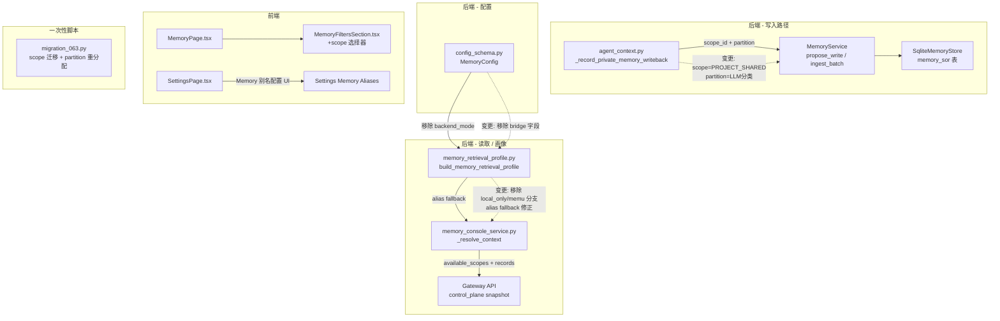

# Implementation Plan: Memory 系统整体优化

**Branch**: `claude/competent-pike` | **Date**: 2026-03-17 | **Spec**: `spec.md`
**Input**: Feature specification from `.specify/features/063-memory-holistic-optimization/spec.md`

## Summary

本计划对 Memory 系统进行五项关联优化：(1) 将 SoR 默认写入 scope 从 WORKER_PRIVATE 变更为 PROJECT_SHARED 并迁移存量 98 条记录；(2) 修复 partition 分配逻辑使其按内容主题正确分类（而非全部硬编码为 work）；(3) 在 Memory 管理页面新增 scope 选择器；(4) 补全 reasoning/expand 别名的 fallback 到 main 逻辑并在 Settings 页面增加 Memory 别名配置 UI；(5) 清除 MemU Bridge / local_only 机制残留代码。

技术路径：后端以 gateway agent_context 服务和 memory_retrieval_profile 为变更核心，前端在 MemoryFiltersSection 和 SettingsPage 扩展 UI，配合一次性迁移脚本处理存量数据。

## Technical Context

**Language/Version**: Python 3.12+ (后端), TypeScript / React + Vite (前端)
**Primary Dependencies**: FastAPI, aiosqlite, Pydantic v2, structlog, React
**Storage**: SQLite WAL (memory_sor / memory_fragments / memory_write_proposals 等表)
**Testing**: pytest (后端 unit + integration), Vitest (前端)
**Target Platform**: macOS 本地 + 局域网
**Project Type**: Web application (monorepo: apps/gateway + packages/memory + packages/provider + frontend)
**Constraints**: 单用户场景，存量 SoR 约 98 条，迁移须原子且可重试

## Constitution Check

| 原则 | 适用性 | 评估 | 说明 |
|------|--------|------|------|
| C1 Durability First | 高 | PASS | scope 迁移通过 SQLite 事务原子执行，迁移前可选备份；新写入逻辑无 in-memory only 状态 |
| C2 Everything is an Event | 中 | PASS | 迁移操作通过 maintenance_runs 表记录，可审计；scope 变更不绕过事件系统 |
| C3 Tools are Contracts | 低 | PASS | 无新工具引入，现有 memory recall tool 的 schema 不变 |
| C4 Side-effect Two-Phase | 中 | PASS | 存量迁移为一次性管理操作，通过 CLI/API 触发而非自动执行；无不可逆用户数据删除 |
| C5 Least Privilege | 高 | PASS | SoR 从 WORKER_PRIVATE 扩大到 PROJECT_SHARED 后，Vault 层的授权控制不受影响（Vault 有独立的 access grant 机制）；敏感分区(health/finance)的 Vault 记录仍需显式授权才能检索 |
| C6 Degrade Gracefully | 高 | PASS | reasoning/expand fallback 到 main 正是降级路径的完善；Qwen embedding 不可用时继续回退到 hash embedding；移除 local_only 分支后统一为内建引擎单一路径，消除混淆 |
| C7 User-in-Control | 中 | PASS | Settings UI 让用户可配置别名；scope 选择器让用户可切换查看范围；迁移操作由用户/管理员显式触发 |
| C8 Observability | 中 | PASS | 迁移操作记录到 maintenance_runs；retrieval_profile 继续暴露 binding 状态和 warnings |
| C12 记忆写入治理 | 高 | PASS | SoR 写入仍通过 WriteProposal -> 仲裁器验证 -> commit 三步流程，仅变更默认 scope_id，不绕过治理链 |
| C13A 上下文优先 | 中 | PASS | 移除 local_only/memu_compat 硬分支正是减少 case-by-case 特判的体现 |

**结论**: 无 VIOLATION，所有变更与宪法原则兼容。

## Architecture

### 变更影响模块总览



### 数据流变更

1. **SoR 写入路径**: `agent_context._record_private_memory_writeback()` 当前硬编码 `kind=WORKER_PRIVATE` + `partition=WORK` -> 变更为 `kind=PROJECT_SHARED` + `partition=LLM推断结果`
2. **Retrieval Profile 构建**: 移除 `backend_mode` 分支判断（`local_only` vs `memu_compat`），统一为内建引擎路径
3. **Memory Console**: `_resolve_context()` 已有 `available_scopes` 字段，需确保后端正确填充并传递到前端

## Implementation Phases

### Phase 1: SoR Scope 全局共享 + Partition 修复 (P1, Story 1+2)

**目标**: 修复 Memory 系统最根本的两个数据质量问题。

#### 1.1 SoR 默认写入 scope 变更

**变更文件**: `octoagent/apps/gateway/src/octoagent/gateway/services/agent_context.py`

**当前代码** (行 1950-1952):
```python
namespace = await self._resolve_memory_namespace_by_kind(
    frame=frame,
    kind=MemoryNamespaceKind.WORKER_PRIVATE,
)
```

**变更方案**:
- 将 `_record_private_memory_writeback()` 中的 namespace kind 从 `WORKER_PRIVATE` 改为 `PROJECT_SHARED`
- 函数名从 `_record_private_memory_writeback` 重命名为 `_record_memory_writeback`（语义准确性），同步更新所有调用点
- 日志事件名从 `agent_context_private_memory_writeback_degraded` 更新

**影响范围**: 仅影响 SoR 新写入的 scope_id，不影响 Vault 授权、Fragment 写入或 recall 读取路径。

#### 1.2 Partition 分配修复

**当前代码** (行 1974):
```python
partition=MemoryPartition.WORK,
```

**变更方案**:
- 在 `_record_memory_writeback()` 中，基于 `latest_user_text` + `model_response` + `continuity_summary` 的内容主题，调用一个轻量分类函数 `_infer_memory_partition()` 来推断 partition
- `_infer_memory_partition()` 策略：
  - 优先使用关键词匹配（零成本）：health/体检/用药/健身 -> health, 银行/投资/预算 -> finance, 姓名/联系方式/生日/偏好 -> core/profile, 联系人/朋友/同事 -> contact
  - 关键词无命中时 fallback 到 work（维持现有行为，无额外 LLM 调用开销）
  - 设计为纯函数，输入为文本内容，输出为 MemoryPartition 枚举值
- 不引入额外 LLM 调用（遵循 "SoR 加工需要克制" 原则）

**分区映射表**:
| 关键词模式 | 目标 partition | 说明 |
|-----------|---------------|------|
| 体检/用药/健身/医院/血压/体重/睡眠/运动 | health | 健康相关 |
| 银行/投资/预算/报销/薪资/财务/税 | finance | 财务相关 |
| 姓名/生日/偏好/习惯/联系方式/家庭/住址 | core | 核心个人信息 |
| 联系人/朋友/同事/人名+电话/邮箱 | contact | 人际联系 |
| 学习/课程/笔记/阅读/论文 | work | 学习工作统归 |
| 默认 fallback | work | 未命中任何模式 |

#### 1.3 存量数据迁移脚本

**新建文件**: `octoagent/packages/memory/src/octoagent/memory/migrations/migration_063_scope_partition.py`

**功能**:
1. **Scope 迁移**: `UPDATE memory_sor SET scope_id = ? WHERE scope_id = ? AND status = 'current'`，将所有 WORKER_PRIVATE scope 的 SoR 记录迁移到对应的 PROJECT_SHARED scope
2. **Partition 重分配**: 对已迁移的记录逐条调用 `_infer_memory_partition()`，基于 `content` 字段重新分类
3. **安全机制**:
   - 事务原子性：整体在一个 SQLite 事务中执行，失败则回滚
   - 幂等性：通过 idempotency_key 防止重复执行
   - 日志审计：每条迁移记录记录到 `memory_maintenance_runs` 表
   - 迁移前自动备份提示（stdout 提醒用户先 `cp data/memory.db data/memory.db.bak`）
4. **执行方式**: 通过 Gateway API action `memory.migrate_063` 触发，或直接 `python -m octoagent.memory.migrations.migration_063_scope_partition`

#### 1.4 测试

- Unit test: `_infer_memory_partition()` 纯函数测试，覆盖各分区关键词
- Integration test: 写入一条 SoR 记录后验证 scope_id 为 PROJECT_SHARED
- Migration test: 准备 fixture 数据，执行迁移后验证 scope + partition 变更

---

### Phase 2: 模型别名 Fallback 修复 + local_only 清理 (P2, Story 4+5)

**目标**: 降低首次使用门槛，清理技术债务。

#### 2.1 Alias Fallback 修正

**变更文件**: `octoagent/packages/provider/src/octoagent/provider/dx/memory_retrieval_profile.py`

**当前状态**: `_resolve_alias_binding()` 函数已有 fallback 机制（行 186-195），reasoning 和 expand 的 `fallback_target` 已设为 `"main"`。但上层 `build_memory_retrieval_profile()` 在 `engine_mode == "builtin"` 时的 effective_target 传递链需要验证——当前 `resolve_memory_retrieval_targets()` 返回的 `targets["reasoning"]` 在 fallback 场景下值为 `"main"` 而非实际模型名。

**变更方案**:
- 验证 `apply_retrieval_profile_to_hook_options()` 传递的 reasoning_target/expand_target 在 fallback 时是否为 `"main"` -> 如果是，需要在 recall hook 执行层将 `"main"` 解析为实际模型别名（通过 config 查找）
- 确保 `MemoryRecallHookOptions` 的 reasoning_target/expand_target 为 `"main"` 时，recall hook 能正确使用 main 别名对应的模型
- 在 `memory_console_service.py` 的状态构建中，确保 degraded 状态判断不会因 reasoning/expand 使用 fallback 而误报

**关键检查点**: recall hook 的 LLM 调用层（`MemoryService.recall_memory()` 或其 hook 实现）是否能正确解析 `"main"` 为有效的 LiteLLM 别名。

#### 2.2 MemoryConfig 清理

**变更文件**: `octoagent/packages/provider/src/octoagent/provider/dx/config_schema.py`

**变更**:
- 移除 `MemoryConfig.backend_mode` 字段（当前为 `Literal["local_only"]`，只有一个选项）
- 添加 4 个别名配置字段（如果尚未存在）：
  ```python
  class MemoryConfig(BaseModel):
      reasoning_model_alias: str = Field(default="", description="记忆加工模型别名")
      expand_model_alias: str = Field(default="", description="查询扩写模型别名")
      embedding_model_alias: str = Field(default="", description="语义检索 embedding 模型别名")
      rerank_model_alias: str = Field(default="", description="结果重排模型别名")
  ```
- 检查现有代码：`memory_retrieval_profile.py` 行 67/77/85/94 已经在读取 `memory.reasoning_model_alias` 等字段，但当前 `MemoryConfig` 模型中不含这些字段——说明这些字段可能通过 `getattr` 或 dict 访问。需要将其正式化到 MemoryConfig 模型中。

**同步更新**:
- `build_config_schema_document()` 中的 `ui_hints` 移除 `memory.backend_mode`，新增 4 个 alias 字段
- `_YAML_HEADER` 无需改动

#### 2.3 Retrieval Profile 清理

**变更文件**: `octoagent/packages/provider/src/octoagent/provider/dx/memory_retrieval_profile.py`

**变更**:
- 移除 `_resolve_transport()` 函数（仅用于 bridge 模式）
- 移除 `_TRANSPORT_LABELS` 字典
- 在 `build_memory_retrieval_profile()` 中：
  - 移除 `inferred_backend_mode` / `backend_mode` 逻辑
  - 移除 `transport` 相关逻辑
  - `engine_mode` 固定为 `"builtin"`，`engine_label` 固定为 `"内建记忆引擎"`
  - 移除 `uses_compat_bridge` 字段（或固定为 False）
  - 移除 memu_compat 分支的 `backend_summary`
- 简化后的函数只需构建 4 个 bindings + 1 个 backend_summary

#### 2.4 测试

- Unit test: 验证 `MemoryConfig` 移除 backend_mode 后的序列化/反序列化兼容性
- Unit test: 验证 `build_memory_retrieval_profile()` 简化后返回正确的 engine_mode
- Unit test: 验证 reasoning/expand fallback 到 main 时 effective_target 正确

---

### Phase 3: 前端 UI 变更 (P2, Story 3+4+5)

**目标**: 前端支持 scope 选择器、Settings Memory 别名配置、移除 Bridge UI。

#### 3.1 Memory 页面 Scope 选择器

**变更文件**: `octoagent/frontend/src/domains/memory/MemoryFiltersSection.tsx`

**变更**:
- 新增 `scopeDraft` prop 和 `scopeOptions` prop
- 在筛选器区域新增 scope 下拉选择器（位于"记忆类型"之前）
- Scope 选项标签映射：
  - `project_shared` -> "项目共享"
  - `butler_private` -> "Butler 私有"
  - `worker_private` -> "Worker 私有"
  - 空值 -> "全部作用域"
- 选择 scope 后触发 `memory.query` action，传入 `scope_id` 参数

**变更文件**: `octoagent/frontend/src/domains/memory/MemoryPage.tsx`

**变更**:
- 新增 `scopeDraft` state，从 `filters.scope_id` 初始化
- 构建 `scopeOptions` 从 `memoryResource.available_scopes`
- 将 scope draft 传递给 MemoryFiltersSection
- `refreshMemory()` 和 `resetFilters()` 中包含 scope_id 参数

**后端依赖**: `memory_console_service.py` 的 `_resolve_context()` 已有 `available_scopes` 字段填充逻辑，需验证其数据正确性。

#### 3.2 Settings Memory 别名配置 UI

**变更文件**: `octoagent/frontend/src/domains/settings/SettingsPage.tsx`

**变更** (行 459-504 的 Memory section):
- 将静态的 Memory 状态卡片扩展为包含 4 个别名配置行
- 每个别名行显示：标签（记忆加工/查询扩写/语义检索/结果重排）、当前状态（已配置/fallback/未配置）、下拉选择器（列出已定义的 model_aliases + "清空"选项）
- 保存操作调用现有的 config update action
- 移除 `backend_mode` 相关的卡片/选择器

**UI 设计**:
```
Memory
本地记忆别名配置

┌──────────┬────────────────┬──────────────┐
│ 记忆加工  │ main（默认）    │ [选择别名 v] │
│ 查询扩写  │ main（默认）    │ [选择别名 v] │
│ 语义检索  │ 内建 embedding  │ [选择别名 v] │
│ 结果重排  │ heuristic      │ [选择别名 v] │
└──────────┴────────────────┴──────────────┘
```

#### 3.3 前端 Bridge 残留清理

**变更文件**:
- `octoagent/frontend/src/domains/memory/MemoryPage.tsx`: 移除 `bridgeTransport`, `bridgeUrl`, `bridgeCommand`, `bridgeApiKeyEnv`, `missingSetupItems` 相关逻辑（行 123-146）
- `octoagent/frontend/src/domains/memory/shared.tsx`: 移除 `MEMORY_MODE_LABELS` 中的 `memu`，移除 `RETRIEVAL_LABELS` 中的 `memu`，简化 `buildMemoryNarrative` 中的 bridge/memu 分支
- `octoagent/frontend/src/domains/memory/MemoryHeroSection.tsx`: 移除 `bridgeTransport` prop

#### 3.4 测试

- 验证 Memory 页面 scope 选择器显示、切换和刷新
- 验证 Settings Memory 别名配置保存生效
- 验证 Bridge 相关 UI 元素已移除

---

## Project Structure

### Documentation (this feature)

```text
.specify/features/063-memory-holistic-optimization/
├── spec.md              # 需求规范
└── plan.md              # 本文件
```

### Source Code (变更清单)

```text
octoagent/
  apps/gateway/src/octoagent/gateway/services/
    agent_context.py           # SoR 写入 scope + partition 修复
  packages/memory/src/octoagent/memory/
    migrations/
      migration_063_scope_partition.py  # 存量迁移脚本 (新建)
  packages/provider/src/octoagent/provider/dx/
    config_schema.py           # MemoryConfig 清理 + alias 字段
    memory_retrieval_profile.py # 移除 local_only/memu 分支
    memory_console_service.py  # scope 选择器数据源验证
  frontend/src/
    domains/memory/
      MemoryPage.tsx           # scope 选择器 state + bridge 清理
      MemoryFiltersSection.tsx # scope 选择器 UI
      MemoryHeroSection.tsx    # 移除 bridge prop
      shared.tsx               # 移除 bridge 标签/逻辑
    domains/settings/
      SettingsPage.tsx         # Memory 别名配置 UI
    types/index.ts             # 类型定义验证
```

## Complexity Tracking

| 决策 | 选择 | 为何不用更简单方案 |
|------|------|-------------------|
| Partition 分配用关键词匹配而非 LLM | 关键词匹配 + work fallback | spec 明确要求 "SoR 加工需要克制"，不增加 LLM 调用；关键词匹配零成本、可预测、可调试 |
| 存量迁移通过脚本而非自动执行 | 显式触发的迁移脚本 | 98 条记录的 scope 变更是不可逆操作（影响可见性），符合 Constitution C4 二段式原则；用户可在迁移前备份 |
| 不新增 MemoryConfig 的 YAML 配置层 | 复用现有 MemoryConfig 模型 | 4 个 alias 字段已在 retrieval_profile 中通过 `memory.*_model_alias` 路径读取，正式化到 MemoryConfig 即可，无需额外配置层 |
| Settings Memory UI 用下拉选择器 | 从 model_aliases 字典列出可选项 | 参考 SettingsProviderSection 的 alias 选择器模式，保持 UI 一致性；不引入自定义输入（避免用户输错） |
