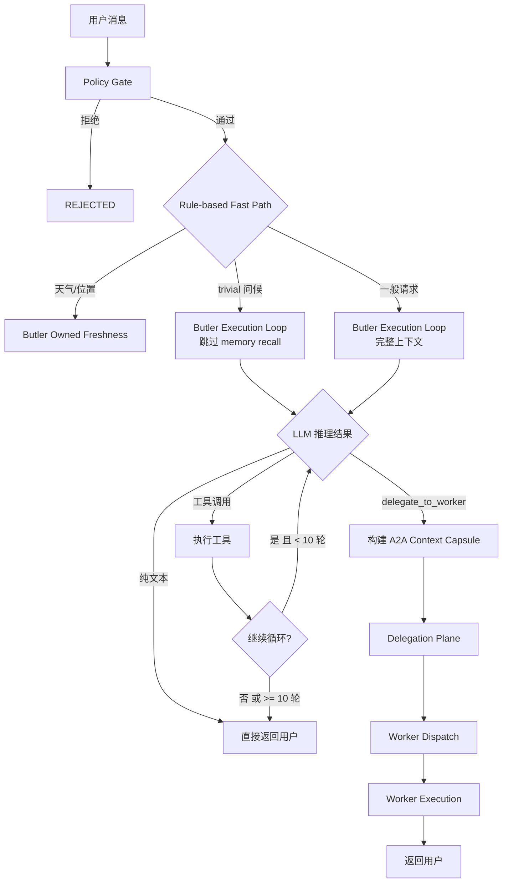

# Implementation Plan: Feature 064 — Butler Dispatch Redesign

**Branch**: `claude/festive-meitner` | **Date**: 2026-03-19 | **Spec**: `spec.md`
**Input**: `.specify/features/064-butler-dispatch-redesign/spec.md`

---

## Summary

消除 OctoAgent 预路由 LLM 调用（Butler Decision Preflight），将 Butler 从"决策者 + 路由器"转变为"主执行者"。Butler 直接使用主 LLM 回答用户请求，工具调用和 Worker 委派由 LLM 在推理过程中自主决定（通过 tool calling）。简单问题从 2-3 次 LLM 调用降至 1 次，端到端延迟从 30s+ 降至 4-15s。

**核心技术方案**（来自调研结论）：对齐 Claude Code / OpenClaw / Agent Zero 的行业共识——主 LLM 单次推理，自主决定回答/用工具/委派，不做独立预路由。

**CRITICAL-1 决议**：Phase 1 仅设轮次上限 10（对齐行业实践），不做 per-request token budget 和无进展检测。

---

## Technical Context

**Language/Version**: Python 3.12+
**Primary Dependencies**: FastAPI, Pydantic, Pydantic AI, structlog, LiteLLM (via provider wrapper)
**Storage**: SQLite WAL (Task/Event/Artifact/AgentSession/Work)
**Testing**: pytest + pytest-asyncio
**Target Platform**: macOS (本地优先，单用户)
**Project Type**: Monorepo (apps/ + packages/)
**Performance Goals**: 简单问题端到端延迟 < 15s，LLM 调用次数从 2-3 降至 1
**Constraints**: 不引入新外部依赖，不改变 A2A 协议，不改变 Task/Event 数据模型
**Scale/Scope**: 单用户，Butler 并发 = 1（task queue 串行保证）

---

## Constitution Check

*GATE: 通过。所有宪法原则评估兼容。*

| # | 宪法原则 | 适用性 | 评估 | 说明 |
|---|---------|--------|------|------|
| 1 | Durability First | 高 | PASS | Butler 直接执行路径保持完整 Event Sourcing，通过 `TaskService.record_*` 链路写入，Task 状态持久化不变 |
| 2 | Everything is an Event | 高 | PASS | 每轮 LLM 调用生成 MODEL_CALL_STARTED/MODEL_CALL_COMPLETED，工具调用生成 TOOL_CALL_STARTED/COMPLETED，最终结果生成 ARTIFACT_CREATED |
| 3 | Tools are Contracts | 高 | PASS | `delegate_to_worker` 工具有完整 schema 定义（见 `contracts/delegate-to-worker.md`），声明副作用等级 `reversible` |
| 4 | Side-effect Two-Phase | 中 | PASS | Policy Gate 保持不变（在 LLM 调用前执行）。`delegate_to_worker` 本身是可逆委派操作，不触发 Two-Phase 要求。高风险工具调用仍经过 ToolBroker + Policy Engine |
| 5 | Least Privilege | 中 | PASS | Butler 使用 `tool_profile="standard"` 复用现有工具权限集，不扩展额外权限。secrets 处理机制不变 |
| 6 | Degrade Gracefully | 高 | PASS | Phase 1 不引入 failover，但 Butler 直接执行路径本身就是对 Worker 路径的降级替代。Phase 3 引入 failover 候选链进一步增强 |
| 7 | User-in-Control | 高 | PASS | Policy Gate 在 Butler Execution Loop 前执行不变，审批/取消能力不变。轮次上限 10 防止失控循环 |
| 8 | Observability | 高 | PASS | 新增 `butler_execution_mode=direct` metadata 区分执行模式，每轮循环生成事件，循环终止原因可审计 |
| 9 | 不猜关键配置 | 低 | PASS | 不涉及配置猜测 |
| 10 | Bias to Action | 高 | PASS | Butler 直接执行正是"减少无意义中间步骤"的体现，从预路由→执行简化为直接执行 |
| 11 | Context Hygiene | 中 | PASS | 复用 `_fit_prompt_budget()` 逻辑，工具输出走压缩/摘要 + artifact 引用 |
| 12 | 记忆写入治理 | 低 | PASS | 记忆写入机制不变 |
| 13 | 失败可解释 | 高 | PASS | Butler Execution Loop 超限 → WAITING_INPUT + 通知用户；LLM 调用失败 → 分类记录 + 降级消息 |
| 13A | 优先上下文而非硬策略 | 高 | PASS | 核心理念对齐——让 LLM 自主决策回答/工具/委派，减少代码预判路由 |
| 14 | A2A 协议兼容 | 高 | PASS | Worker 委派后的 A2A 通信格式不变，`delegate_to_worker` 触发后走现有 Delegation Plane 路径 |

---

## Project Structure

### Documentation (this feature)

```text
.specify/features/064-butler-dispatch-redesign/
├── spec.md                  # 需求规范
├── plan.md                  # 本文件（技术规划）
├── research.md              # 技术决策研究
├── data-model.md            # 数据模型变更（仅 metadata 字段）
├── contracts/
│   └── delegate-to-worker.md  # delegate_to_worker 工具契约
├── checklists/
│   ├── clarifications.md    # 需求澄清
│   └── requirements.md      # 质量检查表
└── research/
    └── dispatch-architecture-comparison.md  # 调研对比
```

### Source Code (涉及变更的文件)

```text
octoagent/
├── apps/gateway/src/octoagent/gateway/services/
│   ├── orchestrator.py          # Phase 1-4: 主要变更文件
│   ├── butler_behavior.py       # Phase 1: 新增 _is_trivial_direct_answer()
│   ├── task_service.py          # Phase 1: 复用，无修改
│   └── agent_context.py         # Phase 1: 复用 _build_system_blocks()，无修改
├── apps/gateway/tests/
│   ├── test_butler_dispatch_redesign.py  # Phase 1: 新增测试文件
│   └── test_butler_behavior.py           # Phase 1: 扩展测试
└── packages/core/src/octoagent/core/models/
    └── (无 schema 变更)
```

**Structure Decision**: 变更集中在 `apps/gateway/src/octoagent/gateway/services/` 目录，不引入新模块或新包。Butler Execution Loop 作为 `OrchestratorService` 的新方法实现，与现有代码结构一致。

---

## Architecture

### 目标调度链路



### 模块边界

```
OrchestratorService (治理框架)
├── dispatch()                          # 入口：Policy Gate + 请求准备 + 路由
├── _resolve_butler_decision()          # 变更：跳过 model decision，仅规则决策
├── _dispatch_butler_direct_execution() # 新增：Butler Execution Loop 入口
├── _butler_execution_loop()            # 新增：LLM 驱动的多轮执行循环
├── _handle_delegate_to_worker()        # 新增：delegate_to_worker 工具回调
├── _dispatch_inline_butler_decision()  # 保留：Phase 4 清理
├── _dispatch_envelope()                # 不变：Worker 派发
└── _dispatch_butler_owned_freshness()  # 不变：天气/位置快速路径

butler_behavior.py (行为规则)
├── decide_butler_decision()            # 不变：天气/位置规则
├── _is_trivial_direct_answer()         # 新增：简单对话识别
└── (其余函数不变)

TaskService (事件写入)
├── process_task_with_llm()             # 复用：Butler 直接执行也走此链路
├── record_auxiliary_model_call()       # 复用：辅助调用记录
└── (其余函数不变)

AgentContextService (上下文构建)
├── _build_system_blocks()              # 复用：Butler 直接执行的 system prompt
├── _build_task_context()               # 复用：上下文编译
└── (其余函数不变)
```

### 数据流

```
用户消息
  ↓
OrchestratorService.dispatch()
  ├── Policy Gate 评估
  ├── _prepare_single_loop_butler_request()  # 现有：工具选择预处理
  ├── _resolve_butler_decision()             # 变更：跳过 model decision
  │   ├── decide_butler_decision()           # 保留：天气/位置规则
  │   └── (不再调用 _resolve_model_butler_decision)
  │
  ├── [若 freshness decision] → _dispatch_butler_owned_freshness()
  │
  ├── [若 butler_decision is None 且 Phase 1 启用]
  │   └── _dispatch_butler_direct_execution()
  │       ├── TaskService.ensure_task_running()
  │       ├── _butler_execution_loop()
  │       │   ├── TaskService._build_task_context()   # 构建 system blocks + 上下文
  │       │   ├── LLMService.call()                    # LLM 推理
  │       │   ├── [纯文本] → 写入 Artifact → 返回
  │       │   ├── [工具调用]
  │       │   │   ├── [delegate_to_worker] → _handle_delegate_to_worker()
  │       │   │   │   └── Delegation Plane → Worker Dispatch
  │       │   │   └── [其他工具] → execute_tool() → 反馈结果 → 继续循环
  │       │   └── [轮次 >= 10] → 返回截断消息
  │       └── 返回 WorkerResult
  │
  ├── [若 butler_decision is not None]
  │   └── _dispatch_inline_butler_decision()  # 保留兼容（Phase 4 移除）
  │
  └── [否则] → Delegation Plane → Worker Dispatch
```

---

## Phase 详细设计

### Phase 1: Butler 直接回答（最小变更集）

**目标**: 跳过 Butler Decision Preflight，Butler 用主 LLM 直接回答。
**风险**: 低 | **可回滚**: 是（恢复 `_resolve_model_butler_decision()` 调用）

#### 文件变更清单

##### 1. `orchestrator.py` — 主变更

**变更 1A: `_resolve_butler_decision()` 跳过 model decision**

位置: 行 913-945

当前逻辑:
```python
async def _resolve_butler_decision(self, request):
    # ... 资格检查 ...
    decision = decide_butler_decision(user_text, runtime_hints=hints)
    model_plan, status = await self._resolve_model_butler_decision(request, hints)
    resolved = model_plan.decision if model_plan else self._annotate_compatibility_fallback(decision, status)
    if resolved.mode is ButlerDecisionMode.DIRECT_ANSWER:
        return None, metadata_updates  # fallthrough → Delegation Plane → Worker
    return resolved, metadata_updates
```

目标逻辑:
```python
async def _resolve_butler_decision(self, request):
    # ... 资格检查（不变）...
    hints = await self._build_request_runtime_hints(request)
    decision = decide_butler_decision(user_text, runtime_hints=hints)

    # Phase 1: 跳过 model decision preflight
    # 天气/位置等规则决策保留，其余直接返回 None → 进入 Butler Direct Execution
    if decision.mode is ButlerDecisionMode.DIRECT_ANSWER:
        return None, {}  # 不再 fallthrough 到 Worker，由 dispatch() 路由到 Butler Direct
    return decision, {}
```

变更要点:
- 不再调用 `_resolve_model_butler_decision()`
- `DIRECT_ANSWER` 返回 `(None, {})` 的语义不变，但 `dispatch()` 中会增加新分支处理
- 规则决策（天气/位置）的 non-DIRECT_ANSWER 结果继续返回，保留 freshness 路径
- 移除 `_annotate_compatibility_fallback_decision()` 调用
- 移除 `_build_precomputed_recall_plan_metadata()` 调用（不再有 model plan）

**变更 1B: `dispatch()` 新增 Butler Direct Execution 分支**

位置: 行 610-631（在 `_build_butler_delegation_request` 和 `_dispatch_inline_butler_decision` 之间）

当前逻辑:
```python
# butler_decision is None 时 → 跳过 inline → 走 Delegation Plane → Worker
delegated_request = await self._build_butler_delegation_request(request, decision=butler_decision)
if delegated_request is not None:
    request = delegated_request
    butler_decision = None

if butler_decision is not None:
    return await self._dispatch_inline_butler_decision(...)

# freshness check ...
# Delegation Plane → Worker Dispatch
```

目标逻辑:
```python
delegated_request = await self._build_butler_delegation_request(request, decision=butler_decision)
if delegated_request is not None:
    request = delegated_request
    butler_decision = None

if butler_decision is not None:
    return await self._dispatch_inline_butler_decision(...)

# Phase 1: Butler Direct Execution —— butler_decision is None 且无委派请求
# 当 _resolve_butler_decision 返回 None（即无特殊规则决策）时，
# 走 Butler Execution Loop 而非 Delegation Plane → Worker
if self._should_butler_direct_execute(request):
    return await self._dispatch_butler_direct_execution(
        request=request,
        gate_decision=gate_decision,
    )

# 保留 freshness check ...
# 保留 Delegation Plane → Worker Dispatch（作为 fallback）
```

**变更 1C: 新增 `_should_butler_direct_execute()` 方法**

```python
def _should_butler_direct_execute(self, request: OrchestratorRequest) -> bool:
    """判断请求是否应走 Butler Direct Execution 路径。

    条件：
    1. LLMService 支持 tool calling（supports_single_loop_executor 或等效标志）
    2. 非子任务（无 parent_task_id）
    3. 非 spawned 任务
    4. worker_capability 为空或 llm_generation
    """
    if not bool(getattr(self._llm_service, "supports_single_loop_executor", False)):
        return False
    return self._is_butler_decision_eligible(request)
```

**变更 1D: 新增 `_dispatch_butler_direct_execution()` 方法**

```python
async def _dispatch_butler_direct_execution(
    self,
    *,
    request: OrchestratorRequest,
    gate_decision: OrchestratorPolicyDecision,
) -> WorkerResult:
    """Butler 直接执行路径：LLM 驱动的多轮执行循环。

    复用 TaskService.process_task_with_llm() 的 Event Sourcing 链路，
    与 Worker 执行路径保持一致的事件粒度。
    """
    is_trivial = _is_trivial_direct_answer(request.user_text)
    route_reason = (
        "butler_direct_execution:trivial"
        if is_trivial
        else "butler_direct_execution:standard"
    )
    await self._write_orch_decision_event(
        request=request,
        route_reason=route_reason,
        gate_decision=gate_decision,
    )

    butler_metadata = {
        **dict(request.metadata),
        "final_speaker": "butler",
        "butler_execution_mode": "direct",
        "butler_is_trivial": is_trivial,
    }

    task_service = TaskService(self._stores, self._sse_hub)
    await task_service.ensure_task_running(request.task_id, trace_id=request.trace_id)

    # 复用现有 process_task_with_llm 链路
    # Butler 直接执行时使用真实 LLM（self._llm_service），
    # 而非 _InlineReplyLLMService
    await task_service.process_task_with_llm(
        task_id=request.task_id,
        user_text=request.user_text,
        llm_service=self._llm_service,
        model_alias=request.model_alias or "main",
        execution_context=None,
        dispatch_metadata=butler_metadata,
        worker_capability="llm_generation",
        tool_profile="standard",
        runtime_context=request.runtime_context,
    )

    task_after = await self._stores.task_store.get_task(request.task_id)
    return self._butler_worker_result(
        request=request,
        task_status=(
            task_after.status if task_after is not None else TaskStatus.FAILED
        ),
        success_summary=f"butler_direct:{('trivial' if is_trivial else 'standard')}",
        dispatch_prefix="butler-direct",
    )
```

注意: Phase 1 的 Butler Direct Execution 通过 `process_task_with_llm()` 实现单轮 LLM 调用（含内建的工具循环支持）。`process_task_with_llm()` 内部已有 `_build_task_context()` → `_build_system_blocks()` 的完整上下文构建逻辑，以及 LLM 调用 + Event 写入 + Artifact 存储的完整链路。Butler 复用此链路而非新建，确保与 Worker 执行路径保持一致的事件粒度。

轮次上限由 `process_task_with_llm()` 内部的 LLM 调用配置控制。Phase 1 在 `dispatch_metadata` 中传递 `max_iterations=10` 作为 LLM 循环的硬上限（如果当前 LLMService 不支持多轮工具循环，则 Phase 1 为单轮——LLM 一次性回答，已含工具调用处理）。

**变更 1E: 标注 `_resolve_model_butler_decision()` 为 deprecated**

位置: 行 1131

在方法上方添加注释：
```python
# @deprecated Phase 1 (Feature 064): Butler Decision Preflight 已被 Butler Direct Execution 替代。
# 保留函数体供回滚使用。Phase 4 清理时移除。
```

**变更 1F: 从 butler_behavior 导入 `_is_trivial_direct_answer`**

位置: 行 85-95（导入区域）

新增导入:
```python
from .butler_behavior import (
    ...
    _is_trivial_direct_answer,  # Phase 1: 简单对话识别
)
```

##### 2. `butler_behavior.py` — 新增 `_is_trivial_direct_answer()`

位置: 在 `decide_butler_decision()` 函数前（约行 1190）

```python
# ---------------------------------------------------------------------------
# Phase 1 (Feature 064): 简单对话识别
# 仅作为性能优化（跳过 memory recall 等准备步骤），不影响 Butler Execution Loop 的核心执行逻辑。
# 误判（false negative）不影响正确性——未被识别的请求正常进入完整流程。
# ---------------------------------------------------------------------------

_TRIVIAL_GREETING_PATTERNS: list[re.Pattern[str]] = [
    re.compile(r"^(你好|hello|hi|hey|嗨|哈喽|早|早上好|晚上好|下午好)\s*[!！。.？?]*$", re.I),
]

_TRIVIAL_IDENTITY_PATTERNS: list[re.Pattern[str]] = [
    re.compile(r"^(你是谁|你是什么|你叫什么|what are you|who are you|你是什么模型)\s*[?？。.]*$", re.I),
]

_TRIVIAL_ACK_PATTERNS: list[re.Pattern[str]] = [
    re.compile(r"^(谢谢|thanks|thank you|好的|ok|好|明白了|知道了|收到|了解)\s*[!！。.]*$", re.I),
]

_TRIVIAL_META_PATTERNS: list[re.Pattern[str]] = [
    re.compile(r"^(你能做什么|你有什么功能|help|帮助)\s*[?？。.]*$", re.I),
]


def _is_trivial_direct_answer(user_text: str) -> bool:
    """判断用户消息是否为简单直答类型。

    保守匹配，仅覆盖最明确的几类：
    1. 纯问候（你好/hello/hi + 无实质问题）
    2. 身份询问（你是谁/什么模型）
    3. 致谢/确认（谢谢/好的/明白了）
    4. 简单元问题（你能做什么）

    该函数仅作为性能优化（跳过 memory recall 等准备步骤），
    不影响 Butler Execution Loop 的核心执行逻辑。
    误判不影响正确性——未被识别的请求正常进入完整流程。
    """
    normalized = user_text.strip()
    if not normalized or len(normalized) > 30:
        return False

    for patterns in (
        _TRIVIAL_GREETING_PATTERNS,
        _TRIVIAL_IDENTITY_PATTERNS,
        _TRIVIAL_ACK_PATTERNS,
        _TRIVIAL_META_PATTERNS,
    ):
        for pattern in patterns:
            if pattern.match(normalized):
                return True
    return False
```

##### 3. 新增测试文件

**`test_butler_dispatch_redesign.py`** — Phase 1 集成测试

覆盖场景:
1. 简单问候 → Butler Direct Execution，无 Worker 创建，1 次 LLM 调用
2. 一般对话 → Butler Direct Execution，无 Worker 创建
3. 天气查询 → 保留 freshness 路径（不走 Butler Direct）
4. `_is_trivial_direct_answer()` 单元测试（正向 + 反向）
5. `_resolve_butler_decision()` 不再调用 `_resolve_model_butler_decision()`
6. Event 链完整性验证（MODEL_CALL_STARTED → MODEL_CALL_COMPLETED → ARTIFACT_CREATED）
7. 回滚验证：恢复 model decision 调用后行为不变

**扩展 `test_butler_behavior.py`** — `_is_trivial_direct_answer` 测试

覆盖场景:
- 正向: "你好", "hello", "你是谁", "谢谢", "你能做什么"
- 反向: "帮我写一段代码", "今天天气怎么样", "你好，帮我查一下...", 空字符串, 超长文本

---

### Phase 2: delegate_to_worker 工具（LLM 自主委派）

**目标**: 新增 `delegate_to_worker` 内建工具，LLM 自主判断是否需要 Worker 委派。
**风险**: 中 | **可回滚**: 是（移除工具定义，回退到 Delegation Plane 预判）
**前置条件**: Phase 1 完成

#### 文件变更清单

##### 1. `orchestrator.py` — 增强 Butler Execution Loop

**变更 2A: 升级 `_dispatch_butler_direct_execution()` 支持多轮工具循环**

Phase 1 的 Butler Direct Execution 通过 `process_task_with_llm()` 实现单轮调用。Phase 2 需要支持 LLM 返回 `delegate_to_worker` 工具调用时的特殊处理。

方案: 在 `dispatch_metadata` 中注册 `delegate_to_worker` 工具定义，LLMService 在构建 tools 列表时将其加入。工具执行器在 `process_task_with_llm` 的工具执行回调中处理。

如果当前 `process_task_with_llm()` 不支持自定义工具执行回调（需验证），则需要：
- 新增 `_butler_execution_loop()` 方法实现多轮循环
- 或在 `process_task_with_llm()` 中增加工具执行钩子

**变更 2B: 新增 `_handle_delegate_to_worker()` 方法**

```python
async def _handle_delegate_to_worker(
    self,
    *,
    request: OrchestratorRequest,
    worker_type: str,
    task_description: str,
    urgency: str = "normal",
) -> WorkerResult:
    """处理 delegate_to_worker 工具调用。

    从当前 ButlerSession 提取上下文，构建 A2A context capsule，
    交给现有 Delegation Plane 路径处理。
    """
    # 1. 构建 context capsule（从 ButlerSession 提取）
    context_capsule = await self._build_delegation_context_capsule(
        request=request,
        task_description=task_description,
    )
    # 2. 构建委派请求
    delegated_request = request.model_copy(
        update={
            "metadata": {
                **dict(request.metadata),
                "requested_worker_type": worker_type,
                "delegate_task_description": task_description,
                "delegate_urgency": urgency,
                "delegate_source": "butler_tool_call",
                "delegate_context_capsule": context_capsule,
            }
        }
    )
    # 3. 走现有 Delegation Plane → Worker Dispatch
    plan = await self._delegation_plane.prepare_dispatch(delegated_request)
    envelope = plan.dispatch_envelope
    return await self._dispatch_envelope(
        request=delegated_request,
        envelope=envelope,
        gate_decision=...,
        work_id=plan.work.work_id,
    )
```

##### 2. 工具定义注册

`delegate_to_worker` 工具定义需要注册到 Butler 的工具集中。具体方式取决于 ToolBroker/CapabilityPack 的注册机制：
- 方案 A: 作为 builtin tool 注册到 CapabilityPackService
- 方案 B: 通过 `dispatch_metadata["additional_tools"]` 动态注入

详细契约见 `contracts/delegate-to-worker.md`。

---

### Phase 3: Failover 候选链

**目标**: LLM 调用失败时自动降级到 cheap 模型。
**风险**: 低 | **可回滚**: 是（移除 failover 逻辑）
**前置条件**: Phase 1 完成

#### 设计要点

1. **与 LiteLLM Proxy 分工**:
   - LiteLLM Proxy: 同一 alias 内的多 provider fallback（如 gpt-4o → gpt-4o-backup）
   - 应用层 failover: alias 级别降级（main → cheap），两层不重叠

2. **触发条件**: timeout / overload / context_overflow / rate_limit

3. **实现位置**: 在 `_dispatch_butler_direct_execution()` 中捕获 LLM 调用异常，根据异常类型决定是否降级重试

4. **事件记录**: 降级触发时生成 `MODEL_FAILOVER_TRIGGERED` 事件（或在 MODEL_CALL_COMPLETED 的 metadata 中标记 `is_failover=True`）

#### 文件变更

- `orchestrator.py`: 在 Butler Direct Execution 中增加 failover 逻辑
- 需确认 `cheap` alias 在 LiteLLM 配置中存在且支持 tool calling

---

### Phase 4: 清理（Code Cleanup）

**目标**: 移除废弃代码，简化 Delegation Plane。
**风险**: 低 | **可回滚**: 不需要
**前置条件**: Phase 1-3 完成且稳定运行

#### 清理清单

| 代码 | 操作 | 文件 |
|------|------|------|
| `_resolve_model_butler_decision()` | 删除 | orchestrator.py:1131-1255 |
| `_InlineReplyLLMService` 类 | 删除（若无其他引用） | orchestrator.py:113-165 |
| `_dispatch_inline_butler_decision()` | 删除 | orchestrator.py:947-1006 |
| `_annotate_compatibility_fallback_decision()` | 删除 | orchestrator.py |
| `_build_precomputed_recall_plan_metadata()` | 删除 | orchestrator.py:1257-1274 |
| `build_butler_decision_messages()` | 删除（若无其他引用） | butler_behavior.py |
| `parse_butler_loop_plan_response()` | 删除（若无其他引用） | butler_behavior.py |
| Delegation Plane 作为默认路径 | 降级为仅 delegate_to_worker 触发 | orchestrator.py dispatch() |

---

## 依赖关系

### Phase 间依赖

```
Phase 1 (Butler 直接回答) ← 无前置
Phase 2 (delegate_to_worker) ← Phase 1
Phase 3 (Failover) ← Phase 1（不依赖 Phase 2）
Phase 4 (清理) ← Phase 1 + Phase 2 + Phase 3
```

### 内部依赖

| 依赖项 | 当前状态 | Phase 1 影响 |
|--------|---------|------------|
| `self._llm_service` 支持 tool calling | 已具备（`supports_single_loop_executor=True`） | 无阻塞 |
| `tool_profile="standard"` 工具集 | 已配置（Worker 使用同一 profile） | 无阻塞 |
| `process_task_with_llm()` Event 链路 | 已实现（Worker 复用同一链路） | 无阻塞 |
| `_build_system_blocks()` 上下文构建 | 已实现（AgentContextService） | 无阻塞 |
| ButlerSession 对话历史 | 已实现（ButlerSession → AgentSession） | 无阻塞 |
| `_prepare_single_loop_butler_request()` 工具选择 | 已实现（单循环预处理） | 复用，Butler Direct 受益于此 |

### 外部依赖

无新增外部依赖。

---

## 风险评估

| 风险 | 概率 | 影响 | 缓解措施 |
|------|------|------|---------|
| Butler 直接执行的上下文与 Worker 不一致 | 中 | LLM 回复质量下降 | Butler 复用 `_build_system_blocks()`，与 Worker 使用相同的上下文构建逻辑 |
| `_is_trivial_direct_answer()` 误判 | 低 | 非简单问题跳过 memory recall | 保守匹配（仅 4 类、长度 < 30），且 false positive 只影响准备步骤，不影响 LLM 执行 |
| 轮次上限 10 太低/太高 | 低 | 复杂工具链被截断 / 循环浪费 token | Phase 1 主要场景是简单对话（1 轮），10 轮上限有足够余量；可通过 metadata 参数化调整 |
| Phase 2 delegate_to_worker 的 LLM 可靠性 | 中 | LLM 该委派时不委派 / 不该委派时委派 | 通过 system prompt 引导 + delegate_to_worker 工具描述明确使用条件；误判不致命（用户可重新请求） |
| 并发 Butler Execution Loop | 低 | 状态冲突 | 单用户串行模型（task queue 保证），不存在并发风险 |

---

## 测试策略

### Phase 1 测试矩阵

| 测试类型 | 场景 | 验证点 | 优先级 |
|---------|------|--------|--------|
| Unit | `_is_trivial_direct_answer()` 正向匹配 | 问候/身份/致谢/元问题返回 True | P0 |
| Unit | `_is_trivial_direct_answer()` 反向匹配 | 实际问题/工具请求/长文本返回 False | P0 |
| Unit | `_resolve_butler_decision()` 跳过 model decision | 不调用 `_resolve_model_butler_decision()` | P0 |
| Unit | `_should_butler_direct_execute()` 资格判断 | 子任务/spawned/非 llm_generation 排除 | P0 |
| Integration | 简单问候端到端 | 1 次 LLM 调用，无 Worker 创建，Event 链完整 | P0 |
| Integration | 一般对话端到端 | Butler Direct 执行，响应正确 | P0 |
| Integration | 天气查询不受影响 | 保留 freshness 路径 | P1 |
| Integration | 现有 Worker 派发不受影响 | 显式请求 Worker 类型时仍走 Delegation Plane | P1 |
| Regression | 前端 SSE 事件流 | 事件格式不变 | P1 |
| Regression | Event Store 查询 | `butler_execution_mode=direct` metadata 可查询 | P1 |
| Performance | 简单问题延迟 | 端到端 < 15s | P1 |

### 回滚验证

Phase 1 的回滚方式：恢复 `_resolve_butler_decision()` 中对 `_resolve_model_butler_decision()` 的调用。回滚后行为应与变更前完全一致。

测试: 在回滚分支上运行 Phase 1 所有测试的"旧行为"变体，确认 2-3 次 LLM 调用链路恢复正常。

---

## 假设与前提条件

| # | 假设 | 验证方式 | 阻塞 Phase |
|---|------|---------|-----------|
| A1 | `self._llm_service` 具备 tool calling 能力（`supports_single_loop_executor=True`） | 检查 LLMService 属性 | Phase 1 |
| A2 | `tool_profile="standard"` 已包含 Butler 所需的工具集（web_search, memory_recall 等） | 检查 CapabilityPack 配置 | Phase 1 |
| A3 | `process_task_with_llm()` 支持非 Worker 调用方（Butler 作为调用者） | 代码审查确认无 Worker 硬假设 | Phase 1 |
| A4 | 现有 ButlerSession → AgentSession 的对话历史追加逻辑可复用 | 代码审查 | Phase 1 |
| A5 | `cheap` alias 在 LiteLLM 中已配置且支持 tool calling | 检查 LiteLLM Proxy 配置 | Phase 3 |

---

## Complexity Tracking

| 决策 | 为何需要 | 被拒绝的更简单方案及原因 |
|------|---------|----------------------|
| 复用 `process_task_with_llm()` 而非新建执行链路 | 保持 Event Sourcing 一致性，减少代码重复 | 新建链路：需要重复实现 Event 写入/Artifact 存储/Checkpoint 逻辑，维护成本高 |
| Phase 1 仅设轮次上限 10，不做 budget/无进展检测 | 对齐行业实践（Claude Code/OpenClaw/Agent Zero 均无 per-request budget），Phase 1 主要场景为简单对话（1 轮） | 实现三道刹车：增加 Phase 1 工作量 ~20%，且 Butler 的典型循环次数远低于 Worker 的 50 轮上限 |
| `_is_trivial_direct_answer()` 仅做关键词匹配 | 避免扩张硬编码分类树（宪法 13A），仅作为性能优化 | 分类器/embedding 匹配：引入额外模型调用或索引，与"消除预路由 LLM"目标矛盾 |
| 保留 `_dispatch_inline_butler_decision()` 到 Phase 4 | 提供回滚安全网，Phase 1-3 期间作为 fallback | 立即删除：无法回滚到旧行为 |
