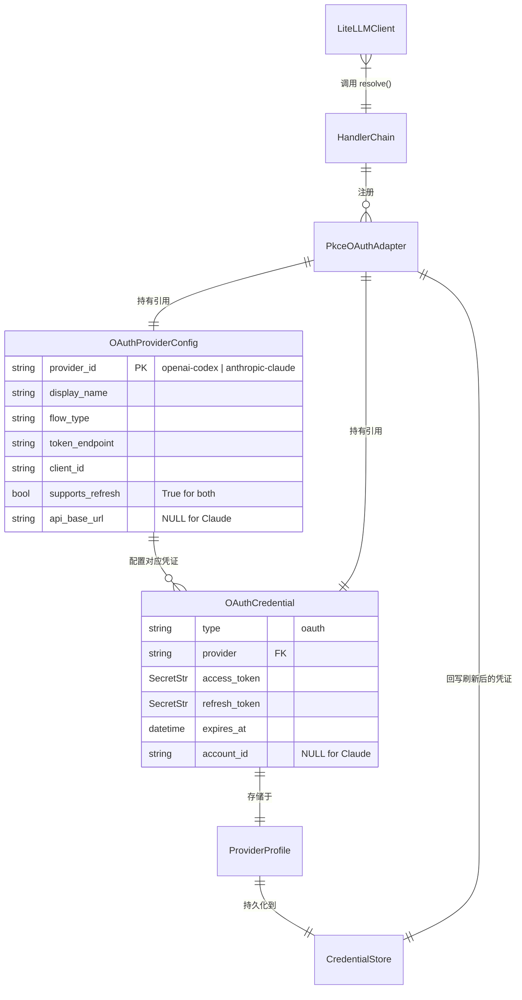

# Data Model: OAuth Token 自动刷新 + Claude 订阅 Provider 支持

**Feature**: 064-oauth-token-refresh-claude-provider
**Date**: 2026-03-19
**Status**: Draft

---

## 概述

本特性不引入全新的数据模型，而是对现有凭证模型和 Provider 配置进行**扩展和修正**。核心变更集中在三个维度：

1. OAuthProviderConfig 的 `supports_refresh` 标志修正 + 新增 Provider 注册
2. OAuthCredential 复用（Claude setup-token 存储为 OAuthCredential 而非 TokenCredential）
3. LiteLLMClient 层新增认证错误类型支持

---

## DM-1: OAuthProviderConfig 变更

### 现有模型（不变）

`OAuthProviderConfig` 数据模型本身无需修改字段定义。变更仅发生在 `BUILTIN_PROVIDERS` 注册数据层面。

### 变更 1.1: openai-codex `supports_refresh` 修正

**文件**: `octoagent/packages/provider/src/octoagent/provider/auth/oauth_provider.py`

```python
# BEFORE
"openai-codex": OAuthProviderConfig(
    ...
    supports_refresh=False,  # <-- 错误：阻塞了整个刷新链路
    ...
)

# AFTER
"openai-codex": OAuthProviderConfig(
    ...
    supports_refresh=True,   # <-- 启用刷新
    ...
)
```

**影响**: `PkceOAuthAdapter.refresh()` 第 111 行检查此标志；修正后，当 token 过期时将触发 `refresh_access_token()` 调用。

### 变更 1.2: 新增 `anthropic-claude` Provider 注册

**文件**: `octoagent/packages/provider/src/octoagent/provider/auth/oauth_provider.py`

```python
"anthropic-claude": OAuthProviderConfig(
    provider_id="anthropic-claude",
    display_name="Claude (Subscription)",
    flow_type="auth_code_pkce",       # 复用 PKCE 流程框架（实际用 paste-token 导入）
    authorization_endpoint="",         # setup-token 无需授权端点
    token_endpoint="https://console.anthropic.com/api/oauth/token",
    client_id="9d1c250a-e61b-44d9-88ed-5944d1962f5e",
    scopes=[],
    supports_refresh=True,
    # Claude 订阅走标准 Anthropic API 端点，不需要特殊 api_base_url
    api_base_url=None,
    extra_api_headers={},
)
```

**关键字段说明**:

| 字段 | 值 | 理由 |
|------|----|------|
| `provider_id` | `"anthropic-claude"` | 与 `anthropic`（API Key 模式）区分 |
| `flow_type` | `"auth_code_pkce"` | 复用 PkceOAuthAdapter 刷新链路 |
| `authorization_endpoint` | `""` | setup-token 模式无 OAuth 交互流程 |
| `token_endpoint` | Anthropic OAuth token URL | 刷新 token 使用标准 OAuth2 refresh_token 流程 |
| `client_id` | Claude Code CLI 的 Client ID | 与 Claude Code CLI 使用相同的 OAuth 应用 |
| `supports_refresh` | `True` | 启用自动刷新（access_token 有效期约 8 小时） |
| `api_base_url` | `None` | 走标准 Anthropic API，不需要自定义 base URL |
| `extra_api_headers` | `{}` | 不需要额外 headers |

### 变更 1.3: DISPLAY_TO_CANONICAL 映射扩展

```python
DISPLAY_TO_CANONICAL: dict[str, str] = {
    "openai": "openai-codex",
    "github": "github-copilot",
    "anthropic-claude": "anthropic-claude",  # 新增
}
```

---

## DM-2: OAuthCredential 复用（无模型变更）

Claude setup-token 导入后将存储为 `OAuthCredential` 实例。模型本身无需修改，字段映射如下：

| OAuthCredential 字段 | Claude Setup Token 值 | 说明 |
|---------------------|----------------------|------|
| `type` | `"oauth"` | 固定值 |
| `provider` | `"anthropic-claude"` | Provider canonical_id |
| `access_token` | `sk-ant-oat01-*` | setup-token 中的 access token |
| `refresh_token` | `sk-ant-ort01-*` | setup-token 中的 refresh token |
| `expires_at` | `now() + 28800s` | 8 小时有效期 |
| `account_id` | `None` | Claude 的 access_token 不是 JWT，无法提取 account_id |

**设计决策**: 使用 `OAuthCredential` 而非 `TokenCredential`，因为：
1. setup-token 包含 `refresh_token`，需要自动刷新（8h 有效期）
2. `OAuthCredential` 的字段集与 `PkceOAuthAdapter` 完全匹配
3. `TokenCredential` 不含 `refresh_token` 字段，无法复用刷新链路

**遗留清理**: `credentials.py` 中 `TokenCredential` 的文档注释提到"Anthropic Setup Token"，应更新为说明 setup-token 已迁移至 OAuthCredential 存储。

---

## DM-3: 异常类型扩展

### 新增: AuthenticationError

**文件**: `octoagent/packages/provider/src/octoagent/provider/exceptions.py`

```python
class AuthenticationError(ProviderError):
    """认证失败错误（401/403 响应触发）

    此异常表示 Provider API 拒绝了当前凭证。
    可能原因：access_token 过期、被吊销、权限不足。
    用于触发 refresh-then-retry 逻辑。
    """

    def __init__(
        self,
        message: str,
        status_code: int,
        provider: str = "",
    ) -> None:
        super().__init__(message, recoverable=True)
        self.status_code = status_code
        self.provider = provider
```

**用途**: `LiteLLMClient.complete()` 在检测到 401/403 响应时，抛出 `AuthenticationError`；上层调用方据此触发 refresh-then-retry 逻辑。

---

## DM-4: 常量定义

### 新增: 刷新缓冲常量

**文件**: `octoagent/packages/provider/src/octoagent/provider/auth/pkce_oauth_adapter.py`

```python
# token 过期预检缓冲时间（秒）
# 在 access_token 距过期不足此时间时提前触发刷新
# 5 分钟是业界通用实践（OpenClaw、Claude Code CLI 均采用此值）
REFRESH_BUFFER_SECONDS: int = 300
```

---

## DM-5: EventType 扩展

### 现有 EventType（确认已包含所需类型）

需要确认 `EventType` 枚举已包含以下值（用于刷新事件追踪）：

| EventType | 场景 | 已存在? |
|-----------|------|---------|
| `OAUTH_STARTED` | OAuth 流程开始 | 是 |
| `OAUTH_SUCCEEDED` | OAuth 流程成功 | 是 |
| `OAUTH_FAILED` | OAuth 流程失败 | 是 |
| `OAUTH_REFRESHED` | Token 刷新成功 | 是 |
| `CREDENTIAL_LOADED` | 凭证加载成功 | 是 |
| `CREDENTIAL_FAILED` | 凭证加载失败 | 是 |

**结论**: 所有所需 EventType 已在现有枚举中定义，无需新增。

---

## 模型关系图



---

## 变更影响评估

| 维度 | 影响范围 | 说明 |
|------|---------|------|
| 模型新增 | 1 个异常类型 | `AuthenticationError` |
| 模型修改 | 0 个 | 所有现有模型保持不变 |
| 注册数据变更 | 2 处 | `supports_refresh` 修正 + `anthropic-claude` 新增 |
| 常量新增 | 1 个 | `REFRESH_BUFFER_SECONDS` |
| 存储格式兼容性 | 完全兼容 | `auth-profiles.json` 结构不变 |
| 迁移需求 | 无 | 无 schema 迁移 |
