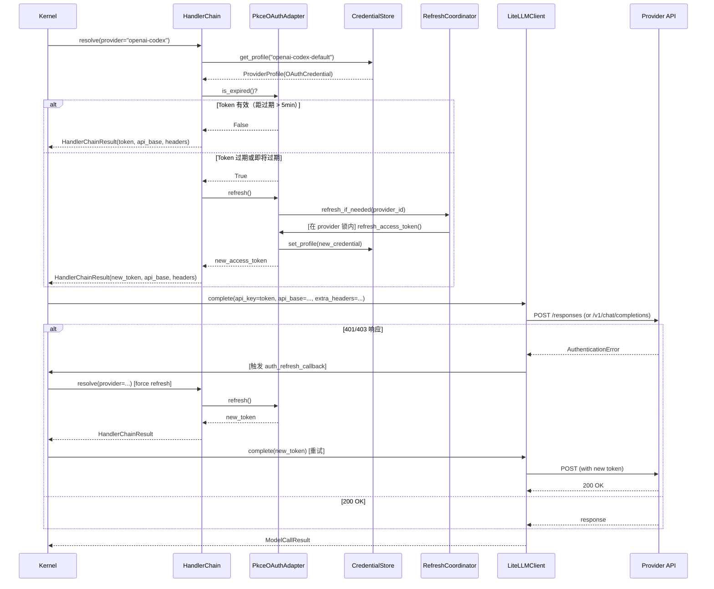

# Implementation Plan: OAuth Token 自动刷新 + Claude 订阅 Provider 支持

**Branch**: `claude/competent-pike` | **Date**: 2026-03-19 | **Spec**: `spec.md`
**Input**: Feature specification from `.specify/features/064-oauth-token-refresh-claude-provider/spec.md`

---

## Summary

实现 OAuth token 自动刷新机制，修复 OpenAI Codex token 失效后不刷新的核心痛点。同时支持 Claude 订阅用户（通过 setup-token）接入 OctoAgent。

**技术方案核心**: 采用方案 C 直连模式（OAuth Provider 不经过 LiteLLM Proxy，由 `LiteLLMClient.complete()` 直连 Provider API）。复用现有 `PkceOAuthAdapter` + `CredentialStore` + `HandlerChain` 基础设施，无需引入新依赖。关键变更为启用 `supports_refresh=True`、在 `complete()` 层面注入 refresh-on-401 重试逻辑、新增 `anthropic-claude` Provider 注册和 CLI paste-token 导入命令。

---

## Technical Context

**Language/Version**: Python 3.12+
**Primary Dependencies**: FastAPI, Pydantic, LiteLLM, httpx, structlog, filelock（全部已安装）
**Storage**: SQLite WAL（Event Store）+ JSON 文件（`auth-profiles.json` -- CredentialStore）
**Testing**: pytest + pytest-asyncio
**Target Platform**: macOS (darwin arm64) 本地部署
**Project Type**: monorepo（apps + packages 结构）
**Performance Goals**: token 刷新延迟 < 5s（网络 RTT 依赖），对用户透明
**Constraints**: 无新依赖引入；OAuth 刷新不得影响非 OAuth Provider 调用路径
**Scale/Scope**: 单用户本地部署，2 个 OAuth Provider（OpenAI Codex + Claude 订阅）

---

## Constitution Check

*GATE: 在进入实现前必须通过。*

| # | 宪法原则 | 适用性 | 评估 | 说明 |
|---|---------|--------|------|------|
| C1 | Durability First | 直接相关 | PASS | 刷新后的 token 通过 `CredentialStore` 原子写入 `auth-profiles.json`，进程重启后使用最新凭证。filelock 保证写入原子性。 |
| C2 | Everything is an Event | 直接相关 | PASS | `OAUTH_REFRESHED` / `OAUTH_FAILED` 事件已定义并在刷新链路中发射。FR-012 要求的所有事件类型已在 `EventType` 枚举中。 |
| C3 | Tools are Contracts | 间接相关 | PASS | `OAuthProviderConfig` 是 Provider 配置的 schema 契约；`OAuthTokenResponse` 是 token 端点响应的结构化契约。 |
| C4 | Side-effect Must be Two-Phase | 部分相关 | PASS (N/A) | token 刷新本身是**可逆的**（可重试）且不属于用户数据的不可逆操作，无需 Plan-Gate-Execute。setup-token 导入是用户主动操作（CLI 交互确认）。 |
| C5 | Least Privilege by Default | 直接相关 | PASS | 凭证按 provider/profile 分区存储；`auth-profiles.json` 中的 token 不进 LLM 上下文；事件 payload 中敏感字段被 `_SENSITIVE_FIELDS` 过滤。 |
| C6 | Degrade Gracefully | 直接相关 | PASS | 刷新失败时 HandlerChain 降级到 echo 模式（已实现）。Claude 订阅被 Anthropic 拒绝时，向用户展示错误提示并建议 API Key 替代（FR-010）。Event Store 写入失败不阻断刷新操作。 |
| C7 | User-in-Control | 直接相关 | PASS | setup-token 导入需用户通过 CLI 主动操作。刷新是自动但透明的（有事件记录）。refresh_token 失效时提示用户重新授权而非静默失败。 |
| C8 | Observability is a Feature | 直接相关 | PASS | 刷新成功/失败/重试触发/凭证加载 -- 所有关键节点都有 structlog + Event Store 事件。事件 payload 不含敏感原文（`_SENSITIVE_FIELDS` 过滤）。 |
| C9 | 不猜关键配置 | 间接相关 | PASS | Anthropic token 端点和 Client ID 来自调研确认的公开信息（OpenClaw 已验证），非猜测。 |
| C13 | 失败必须可解释 | 直接相关 | PASS | `invalid_grant` -> "refresh_token 无效，请重新授权"；网络错误 -> "刷新失败（网络问题），下次请求将重试"；Anthropic 403 -> "订阅凭证被拒绝，建议使用 API Key"。所有失败路径有分类、有恢复建议。 |
| C14 | A2A 协议兼容 | 不相关 | N/A | 本特性不涉及 Task 状态机或 A2A 协议。 |

**Constitution Check 结论**: 全部通过，无 VIOLATION，无需豁免。

---

## Project Structure

### Documentation (this feature)

```text
.specify/features/064-oauth-token-refresh-claude-provider/
├── plan.md                             # 本文件
├── data-model.md                       # 数据模型变更
├── contracts/
│   ├── token-refresh-api.md            # 刷新 API 契约
│   └── claude-provider-api.md          # Claude Provider API 契约
├── research/
│   └── tech-research.md                # 技术调研报告
├── checklists/
│   └── ...                             # 验证清单
└── spec.md                             # 需求规范
```

### Source Code (affected files)

```text
octoagent/packages/provider/src/octoagent/provider/
├── auth/
│   ├── oauth_provider.py               # [修改] supports_refresh=True + anthropic-claude 注册
│   ├── pkce_oauth_adapter.py           # [修改] is_expired() 增加缓冲期预检
│   ├── credentials.py                  # [修改] TokenCredential 文档注释更新
│   └── validators.py                   # [新增] Claude setup-token 格式校验
├── client.py                           # [修改] 新增 refresh-on-401 重试 + AuthenticationError 检测
├── exceptions.py                       # [修改] 新增 AuthenticationError
├── refresh_coordinator.py              # [新增] TokenRefreshCoordinator（per-provider 锁）
└── ...

octoagent/apps/gateway/src/octoagent/gateway/
├── cli/
│   └── auth_commands.py                # [修改] 新增 paste-token 子命令
└── ...

tests/
├── packages/provider/
│   ├── test_pkce_oauth_adapter.py      # [修改] 刷新逻辑测试
│   ├── test_client_auth_retry.py       # [新增] 401/403 重试测试
│   ├── test_refresh_coordinator.py     # [新增] 并发刷新测试
│   └── test_claude_provider.py         # [新增] Claude Provider 集成测试
└── ...
```

**Structure Decision**: 本特性的变更集中在 `packages/provider` 包内，符合现有 monorepo 结构。无需新建包或调整顶层目录。新文件仅 3 个：`refresh_coordinator.py`（并发协调器）、`validators.py`（Claude token 校验）、CLI 的 `paste-token` 子命令逻辑。

---

## Architecture

### 核心调用链（方案 C 直连模式）



### 组件职责

| 组件 | 职责 | 变更类型 |
|------|------|---------|
| `OAuthProviderConfig` | Provider OAuth 配置（端点、client_id、supports_refresh） | 修改注册数据 |
| `PkceOAuthAdapter` | token 过期检测 + 刷新执行 + 凭证回写 | 修改 `is_expired()` 增加缓冲期 |
| `HandlerChain` | 凭证解析链（profile -> store -> env -> fallback） | 无修改 |
| `CredentialStore` | JSON 文件持久化 + filelock 原子写入 | 无修改 |
| `TokenRefreshCoordinator` | per-provider asyncio.Lock 并发刷新串行化 | **新增** |
| `LiteLLMClient` | LLM 调用 + auth_refresh_callback 重试 | 修改 `complete()` |
| `AuthenticationError` | 认证失败异常类型（401/403） | **新增** |
| CLI `paste-token` | Claude setup-token 导入命令 | **新增** |

---

## Implementation Phases

### Phase 1: 核心刷新机制（P0 -- Must Have）

**目标**: OpenAI Codex token 过期后自动刷新，对用户透明。

**任务**:

1.1 **启用 `supports_refresh=True`**
   - 文件: `oauth_provider.py`
   - 变更: `BUILTIN_PROVIDERS["openai-codex"].supports_refresh = True`
   - 复杂度: 极低（1 行改动）

1.2 **`is_expired()` 增加缓冲期预检**
   - 文件: `pkce_oauth_adapter.py`
   - 变更: 新增 `REFRESH_BUFFER_SECONDS = 300` 常量，修改 `is_expired()` 逻辑
   - 对齐: FR-011

1.3 **新增 `AuthenticationError` 异常类型**
   - 文件: `exceptions.py`
   - 变更: 新增 `AuthenticationError(ProviderError)` 含 `status_code` 和 `provider`

1.4 **`LiteLLMClient.complete()` 注入 refresh-on-401 重试**
   - 文件: `client.py`
   - 变更: 新增 `auth_refresh_callback` 参数；在 `except` 分支检测 401/403 并触发重试
   - 约束: 最多重试一次；非 OAuth 调用不受影响
   - 对齐: FR-002, FR-003

1.5 **新增 `TokenRefreshCoordinator`**
   - 文件: `refresh_coordinator.py`（新建）
   - 变更: per-provider `asyncio.Lock` 实现并发刷新串行化
   - 对齐: FR-005

1.6 **端到端验证: Codex token 刷新**
   - 测试: `test_pkce_oauth_adapter.py` 扩展 + `test_client_auth_retry.py` 新增
   - 覆盖: token 过期 -> 自动刷新 -> 成功；refresh_token 失效 -> 提示重新授权；并发刷新 -> 只执行一次

**验收标准**: SC-001, SC-002, SC-003, SC-004

### Phase 2: Claude 订阅 Provider 支持（P1 -- Should Have）

**目标**: Claude 订阅用户通过 setup-token 接入 OctoAgent。

**任务**:

2.1 **新增 `anthropic-claude` Provider 注册**
   - 文件: `oauth_provider.py`
   - 变更: `BUILTIN_PROVIDERS` 新增 `anthropic-claude` 配置 + `DISPLAY_TO_CANONICAL` 映射
   - 详见: `data-model.md` DM-1.2

2.2 **Claude setup-token 格式校验器**
   - 文件: `validators.py`（新建或扩展）
   - 变更: `validate_claude_setup_token(access_token, refresh_token)` 格式校验
   - 对齐: Edge Case "无效的 setup-token 格式"

2.3 **CLI `paste-token` 命令**
   - 文件: `auth_commands.py`（扩展）
   - 变更: 新增 `paste-token --provider anthropic-claude` 子命令
   - 交互: 提示政策风险 -> 接受 access_token + refresh_token -> 校验 -> 存储为 OAuthCredential
   - 对齐: FR-008, FR-010

2.4 **Claude Provider HandlerChain 注册**
   - 文件: Kernel 初始化代码
   - 变更: 注册 `anthropic-claude` 的 PkceOAuthAdapter factory
   - 逻辑: 与 openai-codex 完全一致的 factory 注册模式

2.5 **TokenCredential 文档注释更新**
   - 文件: `credentials.py`
   - 变更: 更新 `TokenCredential` 类文档，说明 Anthropic setup-token 已迁移至 OAuthCredential

2.6 **端到端验证: Claude 订阅调用**
   - 测试: `test_claude_provider.py` 新增
   - 覆盖: paste-token 导入 -> 调用成功；token 过期 -> 自动刷新（8h）；Anthropic 403 -> 友好提示

**验收标准**: SC-005

### Phase 3: 可观测性与边缘场景（P1-P2）

**目标**: 确保所有刷新事件可追踪，边缘场景有合理处理。

**任务**:

3.1 **验证事件完整性**
   - 确认 `OAUTH_REFRESHED` / `OAUTH_FAILED` 事件在以下场景正确发射：
     - 正常刷新成功
     - refresh_token 失效（invalid_grant）
     - 网络错误
     - 并发刷新（只发一次事件）

3.2 **非 OAuth Provider 回归测试**
   - 确认 API Key Provider（OpenAI、OpenRouter、Anthropic 标准模式）的调用路径不受影响
   - 对齐: FR-007

3.3 **`_curl_post()` 向 httpx 迁移（可选 P2）**
   - 文件: `oauth_flows.py`
   - 变更: 将 `_curl_post()` 替换为 `httpx.AsyncClient` 实现
   - 理由: 消除对外部 `curl` 命令的依赖，提高跨平台兼容性
   - 注意: 需验证 asyncio 环境下的 SSL 行为（当前使用 curl 正是为了绕过 Python ssl 问题）

**验收标准**: SC-006

---

## Technical Decisions (Research Summary)

| # | 决策 | 选择 | 理由 | 替代方案 |
|---|------|------|------|---------|
| TD-1 | LLM 调用如何传递动态 token | 方案 C: 直连模式，每次从 CredentialStore 读取 | OctoAgent 已有 Codex 直连路径（`_complete_via_responses_api`）；LiteLLM Proxy 容器环境变量无法热更新 | 方案 A: Proxy Hook（需自定义 LiteLLM 镜像）；方案 B: Proxy 重启（有不可用窗口） |
| TD-2 | Claude setup-token 存储类型 | OAuthCredential | 含 refresh_token + 需自动刷新 -> 完美匹配 OAuthCredential 字段集 | TokenCredential（无 refresh_token 字段，无法复用刷新链路） |
| TD-3 | 并发刷新控制 | per-provider asyncio.Lock + filelock | 内存锁保证进程内串行；filelock 保证跨进程原子写入（已有） | 全局单锁（不同 Provider 互相阻塞）；乐观锁（复杂度高） |
| TD-4 | token 过期预检缓冲期 | 硬编码 5 分钟 | 业界通用实践（OpenClaw、Claude Code CLI）；MVP 无需可配 | 可配置参数（增加复杂度，MVP 无收益） |
| TD-5 | 401/403 重试策略 | 最多一次 refresh-then-retry | 防止无限循环；覆盖"token 被提前吊销"场景 | 指数退避多次重试（过度设计） |
| TD-6 | Claude 导入方式 | CLI `paste-token` 命令 | MVP 最小实现；setup-token 本身是 CLI 操作，保持一致 | Web UI 导入入口（增加前端工作量，MVP 非必要） |

---

## Risk Assessment

| # | 风险 | 概率 | 影响 | 缓解策略 |
|---|------|------|------|---------|
| R1 | Anthropic 限制 setup-token 用于非 Claude Code 应用 | 中 | 高（P2 功能不可用） | 明确标注"技术兼容性"；导入时警告用户；推荐 API Key 作为主要方案 |
| R2 | OpenAI Codex refresh_token 轮换导致 CLI 用户被登出 | 高 | 中（需要重新授权） | 刷新后保存新 refresh_token；文档警告"一个账号一个客户端"限制 |
| R3 | `_curl_post()` 在某些环境不可用 | 低 | 中（刷新失败） | Phase 3 迁移到 httpx（需验证 SSL 行为） |
| R4 | 并发刷新在高负载下的锁竞争 | 低 | 低（单用户场景） | per-provider 锁已足够；监控锁等待时间 |
| R5 | 刷新成功但新 token 立即无效（Provider 异常） | 极低 | 中 | 重试一次后不再刷新，返回错误给用户 |

---

## Complexity Tracking

> 本特性无 Constitution Check violation，无需复杂度豁免。

以下记录偏离最简方案的设计选择：

| 选择 | 为何不用更简单的方案 | 更简单方案被否的原因 |
|------|--------------------|--------------------|
| per-provider `asyncio.Lock` 而非全局锁 | 全局锁更简单 | 全局锁会导致 Codex 刷新时阻塞 Claude 请求，违反 FR-005 "不同 Provider 互不阻塞" |
| `auth_refresh_callback` 注入而非直接耦合 | `complete()` 内部直接调用 HandlerChain 更简单 | 直接耦合违反 `LiteLLMClient` 的职责边界（不应知道 HandlerChain），也破坏了现有测试 mock 模式 |
| 新增 `TokenRefreshCoordinator` 类而非内联锁逻辑 | 在 PkceOAuthAdapter.refresh() 内部加锁更简单 | Adapter 不应持有全局锁状态；Coordinator 可被多个 Adapter 共享；便于测试 |
