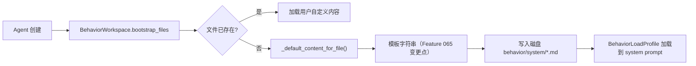

# Implementation Plan: 全面改进 Behavior 默认模板内容

**Branch**: `claude/bold-aryabhata` | **Date**: 2026-03-19 | **Spec**: `spec.md`
**Input**: Feature specification from `.specify/features/065-improve-behavior-templates/spec.md`

## Summary

将 `behavior_workspace.py` 中 `_default_content_for_file` 函数返回的 9 个行为文件默认模板从当前的 1-3 句话（27-462 字符，预算利用率 1.7%-14.5%）扩展为结构化 Markdown 内容，覆盖角色定义、委派框架、安全红线、工具优先级、引导仪式、人格定义等内容域。变更范围极度集中：唯一需要修改的源码函数为 `_default_content_for_file`，无 API/schema/前端/加载机制变更。

## Technical Context

**Language/Version**: Python 3.12+
**Primary Dependencies**: 无新增依赖（纯字符串内容变更）
**Storage**: N/A（无 schema 变更）
**Testing**: pytest（`test_behavior_workspace.py` + `test_butler_behavior.py`）
**Target Platform**: Mac + Linux（本地部署）
**Project Type**: single（单文件变更）
**Performance Goals**: N/A（无运行时性能影响，模板在 Agent 创建时一次性生成）
**Constraints**: 每个模板严格遵守 `BEHAVIOR_FILE_BUDGETS` 字符预算上限
**Scale/Scope**: 1 个函数、9 个模板（含 2 个 Butler/Worker 差异化分支 = 11 个模板文本）

## Constitution Check

*GATE: Must pass before Phase 0 research. Re-check after Phase 1 design.*

| 原则 | 适用性 | 评估 | 说明 |
|------|--------|------|------|
| 1. Durability First | 不适用 | PASS | 模板内容为纯函数返回值，无持久化状态变更 |
| 2. Everything is an Event | 不适用 | PASS | 无新状态迁移或工具调用 |
| 3. Tools are Contracts | 不适用 | PASS | 不修改任何工具 schema |
| 4. Side-effect Two-Phase | 不适用 | PASS | 模板生成无副作用 |
| 5. Least Privilege | 适用 | PASS | 模板中明确指引 secrets 不进 LLM 上下文（TOOLS.md FR-014） |
| 6. Degrade Gracefully | 不适用 | PASS | 模板为 fallback 默认值，降级路径不受影响 |
| 7. User-in-Control | 适用 | PASS | 模板仅在文件不存在时使用，用户自定义内容始终优先 |
| 8. Observability | 不适用 | PASS | 无新 Event/Metric 变更 |
| 9. 不猜关键配置 | 适用 | PASS | TOOLS.md 模板强化了"先查后改"指令 |
| 10. Bias to Action | 适用 | PASS | AGENTS.md 模板保留"优先直接解决"原则 |
| 11. Context Hygiene | 适用 | PASS | 模板在字符预算内，不膨胀 system prompt |
| 12. 记忆写入治理 | 适用 | PASS | 多个模板明确指引通过 Memory 工具写入事实 |
| 13. 失败可解释 | 不适用 | PASS | 无新失败路径 |
| 13A. 优先上下文非硬策略 | **核心适用** | PASS | 本 Feature 的核心目标正是通过丰富行为文件上下文来引导模型行为，而非新增代码硬编码 |
| 14. A2A 兼容 | 适用 | PASS | AGENTS.md 模板包含 A2A 状态机感知指引 |

**结论**: 全部 PASS，无 VIOLATION。Feature 065 与 Constitution 13A "优先提供上下文" 原则高度对齐。

## Architecture

本 Feature 不引入新架构组件。变更完全在已有架构内：



**变更边界**:
- 唯一代码变更点：`_default_content_for_file` 函数体（行 1542-1622）
- 函数签名不变：`(file_id, is_worker_profile, agent_name, project_label)`
- 返回类型不变：`str`
- 调用链不变：`bootstrap_files -> _default_content_for_file -> 写入磁盘`

## 变更策略

### 模板设计原则

1. **结构化 Markdown**: 使用 `##` 标题 + 有序/无序列表，帮助 LLM 解析指令层级
2. **独立完整**: 每个文件独立成篇，不依赖交叉引用（BehaviorLoadProfile 差异化加载不保证所有文件同时在上下文）
3. **双语规范**: 中文散文 + 英文代码标识符（`agent_name`, `project_label`, `Memory`, `SecretService`）
4. **动态插值**: 仅使用现有 4 个参数（`file_id`, `is_worker_profile`, `agent_name`, `project_label`），不扩展签名
5. **轻量引导**: 提供方向性框架和占位区域，而非大量限制性规则（对齐 Constitution 13A）
6. **预算管控**: 每个模板的 `len()` 严格 < `BEHAVIOR_FILE_BUDGETS[file_id]`，目标利用率 50%-85%

### 逐文件变更清单

| 文件 | 预算 | 当前字符 | 当前利用率 | 差异化分支 | 目标内容域 | Priority |
|------|------|---------|-----------|-----------|-----------|----------|
| AGENTS.md (Butler) | 3200 | ~340 | 10.6% | `is_worker_profile=False` | 角色定位、委派决策框架、安全红线、内存协议、A2A 感知 | P1 |
| AGENTS.md (Worker) | 3200 | ~190 | 5.9% | `is_worker_profile=True` | Worker 角色定位、协作协议、执行纪律、Subagent 判断 | P1 |
| BOOTSTRAP.md | 2200 | ~462 | 21.0% | 无 | 编号引导步骤(>=4步)、数据去向、自我介绍话术、完成标记 | P1 |
| TOOLS.md | 3200 | ~436 | 13.6% | 无 | 工具优先级(>=3级)、secrets 红线、delegate 规范、读写指引 | P1 |
| SOUL.md | 1600 | ~27 | 1.7% | 无 | 核心价值观(>=3条)、沟通风格、认知边界 | P1 |
| IDENTITY.md (Butler) | 1600 | ~80 | 5.0% | `is_worker_profile=False` | 结构化身份字段、自我修改权限 | P1 |
| IDENTITY.md (Worker) | 1600 | ~80 | 5.0% | `is_worker_profile=True` | Worker 身份字段、角色定位 | P1 |
| USER.md | 1800 | ~90 | 5.0% | 无 | 渐进式画像框架(>=3区)、存储边界提示 | P2 |
| PROJECT.md | 2400 | ~60 | 2.5% | 无 | 项目元信息框架(>=4区)、`project_label` 插值 | P2 |
| KNOWLEDGE.md | 2200 | ~50 | 2.3% | 无 | 知识入口地图(>=3类)、canonical 引用规范、更新策略 | P2 |
| HEARTBEAT.md | 1600 | ~55 | 3.4% | 无 | 自检触发条件、检查清单(>=4项)、进度报告要素、收口标准 | P2 |

### 实现顺序

**Phase 1 (P1 -- 核心角色与安全)**:
1. AGENTS.md (Butler + Worker) -- 角色锚点，影响最大
2. TOOLS.md -- 安全边界，防止工具误用
3. BOOTSTRAP.md -- 首次体验入口
4. SOUL.md + IDENTITY.md (Butler + Worker) -- 人格定义

**Phase 2 (P2 -- 渐进式模板)**:
5. USER.md + PROJECT.md -- 用户/项目画像框架
6. KNOWLEDGE.md + HEARTBEAT.md -- 知识管理与长任务自检

每个模板编写后立即运行 `len()` 验证不超预算，再运行现有测试确认无回归。

## 测试策略

### 单元测试（新增 / 更新）

在 `test_behavior_workspace.py` 中新增或更新以下测试用例：

**1. 字符预算合规测试（覆盖全部 11 个模板文本）**

```python
@pytest.mark.parametrize("file_id,is_worker", [
    ("AGENTS.md", False), ("AGENTS.md", True),
    ("USER.md", False), ("PROJECT.md", False),
    ("KNOWLEDGE.md", False), ("TOOLS.md", False),
    ("BOOTSTRAP.md", False), ("SOUL.md", False),
    ("IDENTITY.md", False), ("IDENTITY.md", True),
    ("HEARTBEAT.md", False),
])
def test_default_template_within_budget(file_id, is_worker):
    content = _default_content_for_file(
        file_id=file_id, is_worker_profile=is_worker,
        agent_name="TestAgent", project_label="test-project",
    )
    budget = BEHAVIOR_FILE_BUDGETS[file_id]
    assert len(content) <= budget, f"{file_id} 超预算: {len(content)} > {budget}"
    # SHOULD: 利用率 >= 40%
    assert len(content) >= budget * 0.3, f"{file_id} 内容过少: {len(content)} < 30% of {budget}"
```

**2. 内容域覆盖测试（每个 FR 对应一个断言）**

针对每个 FR 的内容域关键词进行子字符串匹配检查。示例：

```python
def test_agents_butler_content_domains():
    content = _default_content_for_file(
        file_id="AGENTS.md", is_worker_profile=False,
        agent_name="Butler", project_label="default",
    )
    # FR-001 内容域检查（关键词匹配，非精确结构验证）
    assert "委派" in content or "delegate" in content.lower()
    assert "Worker" in content or "worker" in content
    assert "安全" in content or "红线" in content
    assert "Memory" in content or "记忆" in content or "内存" in content
```

**3. 已有测试适配**

- `TestBootstrapTemplate.test_default_template_contains_completion_instructions`: 验证 `<!-- COMPLETED -->` 标记仍然存在 -- 模板改进后此断言不变
- `test_butler_behavior.py` 中涉及模板内容的断言：如有硬编码字符串匹配，需更新为关键词匹配

### 集成测试（不新增）

本 Feature 无 API/前端变更，不需要新增集成测试。SC-005（Agent 首次交互验证）为手动定性验证。

### 测试执行命令

```bash
cd octoagent && uv run pytest packages/core/tests/test_behavior_workspace.py -v
cd octoagent && uv run pytest apps/gateway/tests/test_butler_behavior.py -v
```

## 风险评估

| 风险 | 概率 | 影响 | 缓解措施 |
|------|------|------|---------|
| 模板内容超预算 | 低 | 低（truncation 兜底） | 每个模板编写后立即 `len()` 验证 |
| 模板指令与 provider system prompt 冲突 | 极低 | 中 | 模板设计遵循"避免冲突"原则（CONF-01），不重复上游指令 |
| 现有测试断言因内容变化失败 | 中 | 低 | 识别所有硬编码断言并同步更新 |
| 模板内容质量不佳导致 Agent 行为退化 | 低 | 中 | 参考 OpenClaw/Agent Zero 颗粒度；手动验证 SC-005 |
| 多语言 LLM 对中文指令解析差异 | 极低 | 低 | OctoAgent 面向中文用户，与 CLAUDE.md 规范一致 |

**总体风险等级**: 极低。变更范围高度集中（单函数纯字符串替换），无架构/数据/API 影响，有 truncation 安全兜底。

## 回滚策略

```bash
git revert <commit-hash>
```

单一 commit 覆盖全部变更（1 个 `.py` 文件 + 测试文件），`git revert` 即可完整回滚。无数据迁移、无 schema 变更、无配置变更。

## Project Structure

### Documentation (this feature)

```text
.specify/features/065-improve-behavior-templates/
├── spec.md              # 需求规范（已完成）
├── plan.md              # 本文件 - 技术方案
├── data-model.md        # 数据模型说明（无 schema 变更）
├── checklists/
│   ├── clarify-report.md
│   └── requirements.md
└── tasks.md             # Phase 2 输出（待生成）
```

### Source Code (repository root)

```text
octoagent/packages/core/
├── src/octoagent/core/
│   └── behavior_workspace.py    # 唯一代码变更文件（_default_content_for_file 函数）
└── tests/
    └── test_behavior_workspace.py  # 测试更新（预算合规 + 内容域覆盖）

octoagent/apps/gateway/tests/
└── test_butler_behavior.py  # 可能需要更新硬编码断言
```

**Structure Decision**: 无新增文件/目录。变更完全在现有文件内，符合最小影响原则。

## Complexity Tracking

> 无 Constitution 违规，无复杂度偏离。

| 偏离项 | 无 |
|--------|-----|

本 Feature 是典型的"纯内容增强"变更，不引入任何新的架构复杂度、依赖、抽象层或配置项。
