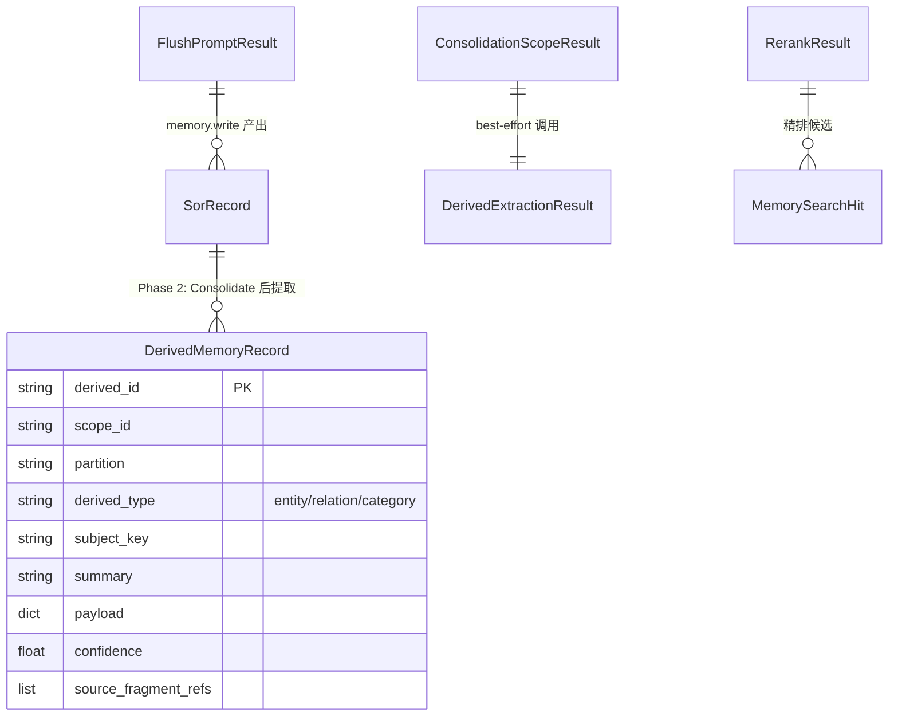

# Data Model: Memory Automation Pipeline (Phase 2)

**Feature**: 065-memory-automation-pipeline
**Date**: 2026-03-19

## 概述

Phase 2 **不新增数据库表**。所有新增实体复用已有表结构。本文档说明 Phase 2 引入的数据模型变更和新增的内存数据类。

## 已有实体变更

### DerivedMemoryRecord（已有表: `derived_memory`）

**Phase 2 新增使用场景**: US-4 Consolidate 后自动提取 entity/relation/category。

Phase 1 中 `DerivedMemoryRecord` 仅在 import pipeline（`SqliteMemoryBackend.ingest_batch`）中触发。Phase 2 新增了 Consolidate 后的自动提取路径。

**Phase 2 derived_type 使用范围**:
- `entity`: 命名实体（人名、地名、组织、工具、技术等）
- `relation`: 实体间关系（"用户-出差-东京"）
- `category`: 信息分类标签（"差旅计划"、"技术选型"）
- `tom`: 暂不使用（Phase 3 US-7）

**Phase 2 字段使用约定**:

| 字段 | Phase 2 使用方式 |
|------|-----------------|
| `derived_id` | `derived:consolidate:{scope_id}:{index}:{derived_type}` 格式 |
| `scope_id` | 来自源 SoR 的 scope_id |
| `partition` | 来自源 SoR 的 partition |
| `derived_type` | `entity` / `relation` / `category` |
| `subject_key` | LLM 提取的主题标识 |
| `summary` | LLM 提取的摘要 |
| `payload` | 结构化数据（依 derived_type 不同而异，见下文） |
| `confidence` | LLM 输出的置信度（0.0-1.0） |
| `source_fragment_refs` | 源 SoR 关联的 fragment_id 列表 |
| `source_artifact_refs` | 空列表（Consolidate 路径不涉及 artifact） |
| `proposal_ref` | 空字符串（Derived 不走 Proposal 治理） |
| `created_at` | 提取时间 |

**payload 结构约定**:

```python
# entity
{
    "entity_type": "person" | "location" | "organization" | "tool" | "technology" | "other",
    "name": "实体名称",
    "excerpt": "来源文本摘录（前 240 字符）",
    "source_memory_ids": ["mem-id-1"],  # 来源 SoR 的 memory_id
}

# relation
{
    "source": "关系的主体",
    "relation": "关系类型动词",
    "target": "关系的客体",
    "time": "时间信息（可选）",
    "source_memory_ids": ["mem-id-1"],
}

# category
{
    "category": "分类标签名",
    "source_memory_ids": ["mem-id-1", "mem-id-2"],
}
```

### MemoryRecallRerankMode（已有枚举）

**Phase 2 变更**: 新增 `MODEL` 枚举值。

```python
class MemoryRecallRerankMode(StrEnum):
    NONE = "none"
    HEURISTIC = "heuristic"
    MODEL = "model"          # Phase 2 新增
```

**影响范围**:
- `MemoryRecallHookOptions.rerank_mode` 可接受 `MODEL` 值
- `MemoryService._apply_recall_hooks` 新增 MODEL 分支
- agent_context preferences 的 `rerank_mode` 键可设为 `"model"`
- capability_pack 的 `memory.recall` 工具参数默认值不变（仍为 HEURISTIC）

### ConsolidationScopeResult（已有内存数据类）

**Phase 2 变更**: 新增 `derived_extracted` 字段。

```python
@dataclass(slots=True)
class ConsolidationScopeResult:
    scope_id: str
    consolidated: int = 0
    skipped: int = 0
    errors: list[str] = field(default_factory=list)
    derived_extracted: int = 0   # Phase 2 新增: Derived 记录提取数
```

## 新增代码模型（非数据库模型）

以下为 Phase 2 新增的内存数据类，不持久化：

### DerivedExtractionResult

```python
@dataclass(slots=True)
class DerivedExtractionResult:
    """Derived 提取结果。"""
    scope_id: str
    extracted: int = 0            # 成功提取的 derived 记录数
    skipped: int = 0              # 跳过的条目数
    errors: list[str] = field(default_factory=list)
```

### CommittedSorInfo

```python
@dataclass(slots=True)
class CommittedSorInfo:
    """Consolidate 产出的 SoR 摘要信息，供 derived 提取用。"""
    memory_id: str
    subject_key: str
    content: str
    partition: MemoryPartition
    source_fragment_ids: list[str] = field(default_factory=list)
```

### FlushPromptResult

```python
@dataclass(slots=True)
class FlushPromptResult:
    """Flush Prompt 注入结果。"""
    writes_attempted: int = 0     # memory.write 尝试次数
    writes_committed: int = 0     # 成功 commit 次数
    skipped: bool = False         # LLM 判断无需保存
    errors: list[str] = field(default_factory=list)
    fallback_to_summary: bool = False  # 是否降级到原有摘要 Flush
```

### RerankResult

```python
@dataclass(slots=True)
class RerankResult:
    """Rerank 结果。"""
    scores: list[float]           # 与 candidates 一一对应的相关性得分
    model_id: str = ""            # 使用的模型标识
    degraded: bool = False        # 是否降级
    degraded_reason: str = ""     # 降级原因
```

## 实体关系图（Phase 2 增量）



## 写入路径对比

| 路径 | 触发场景 | 产出层级 | 写入方式 |
|------|---------|---------|---------|
| memory.write | Agent 对话中主动调用 | SoR | propose -> validate -> commit |
| Compaction Flush | 上下文压缩 | Fragment | run_maintenance(FLUSH) |
| Flush Prompt (Phase 2) | Compaction 前静默 turn | SoR | 通过 memory.write 走治理流程 |
| Consolidate | Flush 后/Scheduler | Fragment -> SoR | propose -> validate -> commit |
| Derived 提取 (Phase 2) | Consolidate 后 | SoR -> Derived | upsert_derived_records |
