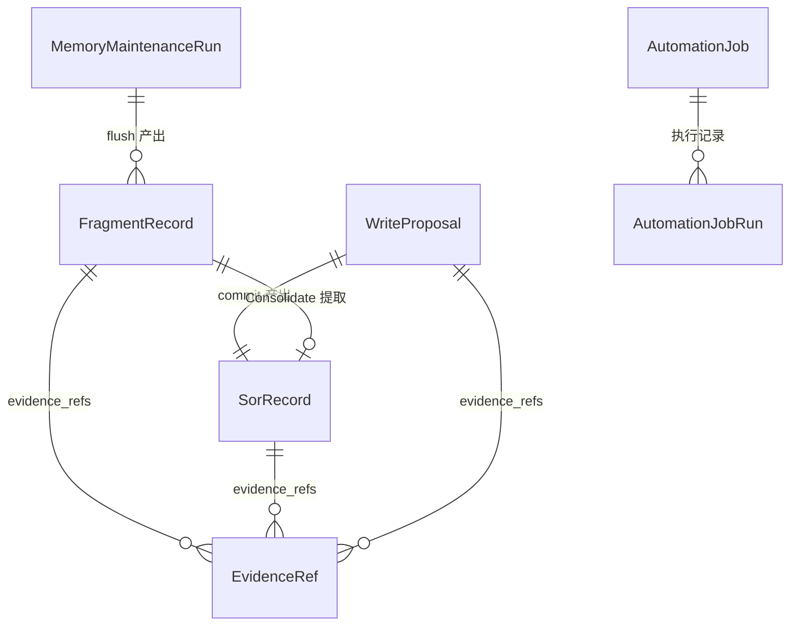

# Data Model: Memory Automation Pipeline (Phase 1)

**Feature**: 065-memory-automation-pipeline
**Date**: 2026-03-19

## 概述

Phase 1 **不新增数据库表或字段**。所有实现基于已有的 Memory 数据模型和 ControlPlane 模型。本文档说明各实体在 Phase 1 中的使用方式。

## 已有实体使用说明

### SorRecord（Source of Record）

**用途**: memory.write 工具和 Consolidate 流程的最终产出。

**关键字段**:
- `memory_id: str` -- ULID，全局唯一
- `scope_id: str` -- 归属的 scope
- `partition: MemoryPartition` -- 业务分区 (core/profile/work/health/finance/chat)
- `subject_key: str` -- 记忆主题标识，`/` 分层
- `content: str` -- 记忆内容
- `version: int` -- 乐观锁版本号，每次 UPDATE 递增
- `status: SorStatus` -- CURRENT / SUPERSEDED / DELETED
- `evidence_refs: list[EvidenceRef]` -- 证据链引用

**Phase 1 使用场景**:
1. `memory.write` ADD -> 新建 version=1 的 CURRENT 记录
2. `memory.write` UPDATE -> 旧记录标记 SUPERSEDED，新建 version+1 的 CURRENT 记录
3. `Consolidate` -> 从 Fragment 提取事实，创建/更新 SoR

### FragmentRecord

**用途**: Compaction Flush 的产出，Consolidate 的输入。

**关键字段**:
- `fragment_id: str` -- ULID
- `scope_id: str` -- 归属的 scope
- `partition: MemoryPartition` -- 业务分区
- `content: str` -- 对话摘要文本
- `metadata: dict` -- 元数据，包含 `consolidated_at` 标记
- `evidence_refs: list[EvidenceRef]` -- 来源证据

**Phase 1 使用场景**:
1. Flush 产出 Fragment 后，`metadata` 中无 `consolidated_at` 表示待整理
2. Consolidate 处理后，设置 `metadata.consolidated_at = ISO时间戳` 标记已整理
3. Scheduler Consolidate 通过 `metadata.consolidated_at is None` 筛选积压 Fragment

**`consolidated_at` 标记约定**:
- 类型: `str | None`（ISO 8601 时间戳字符串，存储在 metadata JSON 中）
- 设置时机: Consolidate 成功处理该 Fragment 后
- 查询条件: `not fragment.metadata.get("consolidated_at")` 表示未整理

### WriteProposal

**用途**: 记忆写入的治理中间产物。

**关键字段**:
- `proposal_id: str` -- ULID
- `scope_id: str`
- `partition: MemoryPartition`
- `action: WriteAction` -- ADD / UPDATE / DELETE
- `subject_key: str`
- `content: str`
- `rationale: str` -- 写入理由
- `confidence: float` -- 0.0-1.0
- `evidence_refs: list[EvidenceRef]`
- `expected_version: int | None` -- 乐观锁版本
- `status: ProposalStatus` -- PENDING -> VALIDATED/REJECTED -> COMMITTED
- `is_sensitive: bool` -- 敏感标记
- `validation_errors: list[str]`

**Phase 1 使用场景**:
1. `memory.write` -> 创建 Proposal(action=ADD/UPDATE)
2. `Consolidate` -> 为每条提取的事实创建 Proposal
3. 两者都走 propose_write -> validate_proposal -> commit_memory 完整流程

### EvidenceRef

**用途**: 证据链引用，关联到对话消息、artifact 或 fragment。

**字段**:
- `ref_id: str` -- 引用目标的 ID
- `ref_type: str` -- 引用类型 ("message" / "artifact" / "fragment")
- `snippet: str` -- 可选的文本摘要

**Phase 1 使用场景**:
1. `memory.write` -> `ref_type="message"`，指向对话中的消息
2. `Consolidate` -> `ref_type="fragment"`，指向源 Fragment

### AutomationJob

**用途**: Scheduler 定时任务定义。

**关键字段**:
- `job_id: str` -- 唯一标识（系统内置作业用 `system:` 前缀）
- `name: str` -- 显示名
- `action_id: str` -- 关联的 control-plane action
- `params: dict` -- 执行参数
- `schedule_kind: AutomationScheduleKind` -- cron / interval / once
- `schedule_expr: str` -- 调度表达式
- `enabled: bool` -- 启用/禁用

**Phase 1 使用场景**:
- 系统启动时创建 `job_id="system:memory-consolidate"`
- `action_id="memory.consolidate"`
- `schedule_kind=CRON`, `schedule_expr="0 */4 * * *"`

### MemoryMaintenanceRun

**用途**: 维护操作的审计记录。

**关键字段**:
- `run_id: str` -- ULID
- `kind: MemoryMaintenanceCommandKind` -- FLUSH / CONSOLIDATE / COMPACT 等
- `scope_id: str`
- `status: MemoryMaintenanceRunStatus`
- `metadata: dict` -- 执行上下文

**Phase 1 使用场景**:
- Flush 产出 run_id，Consolidate 通过 run_id 关联本次 Flush 的 Fragment
- Consolidate 执行结果也通过 MaintenanceRun 记录

## 新增代码模型（非数据库模型）

以下为 ConsolidationService 的返回值数据类，仅存在于内存中，不持久化：

```python
@dataclass(slots=True)
class ConsolidationScopeResult:
    """单个 scope 的 consolidate 结果。"""
    scope_id: str
    consolidated: int      # 成功提取的事实数
    skipped: int           # 跳过的事实数
    errors: list[str]      # 错误信息列表

@dataclass(slots=True)
class ConsolidationBatchResult:
    """批量 consolidate 的汇总结果。"""
    results: list[ConsolidationScopeResult]
    total_consolidated: int
    total_skipped: int
    all_errors: list[str]
```

## 实体关系图


