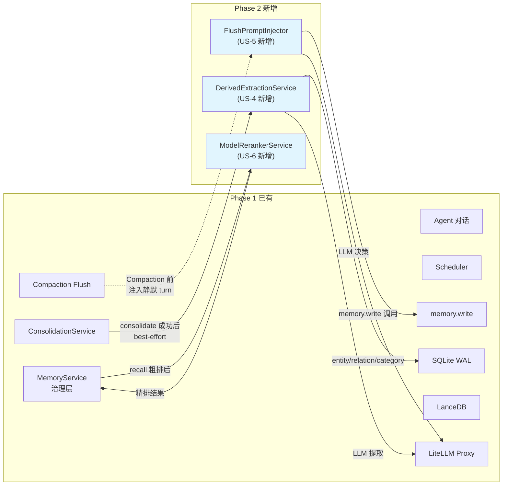
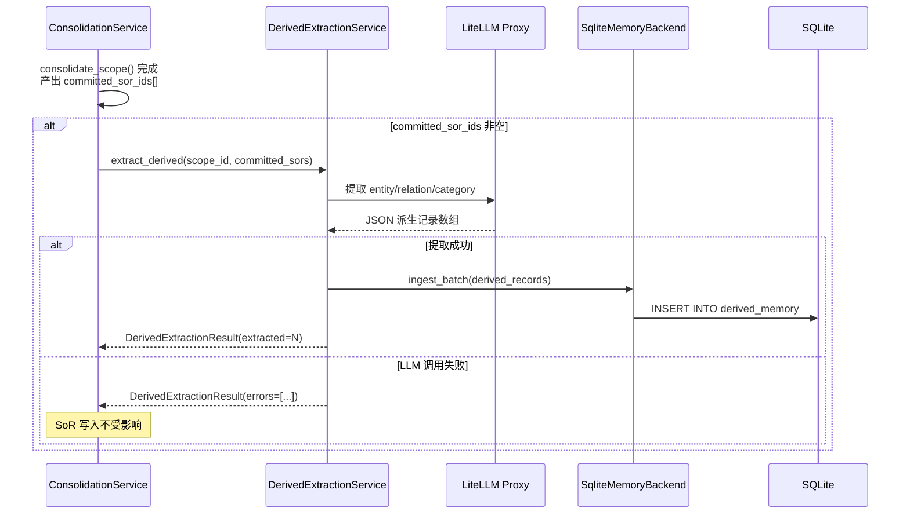
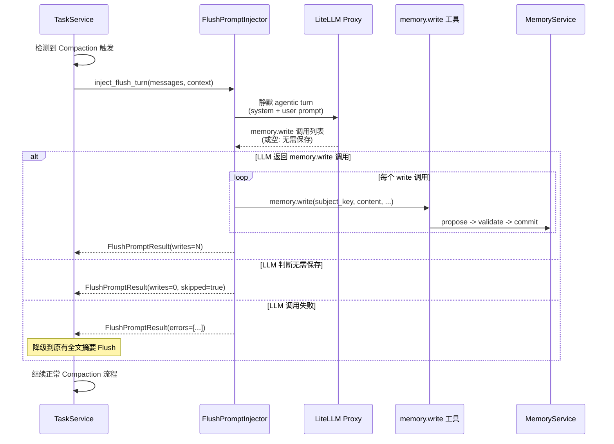
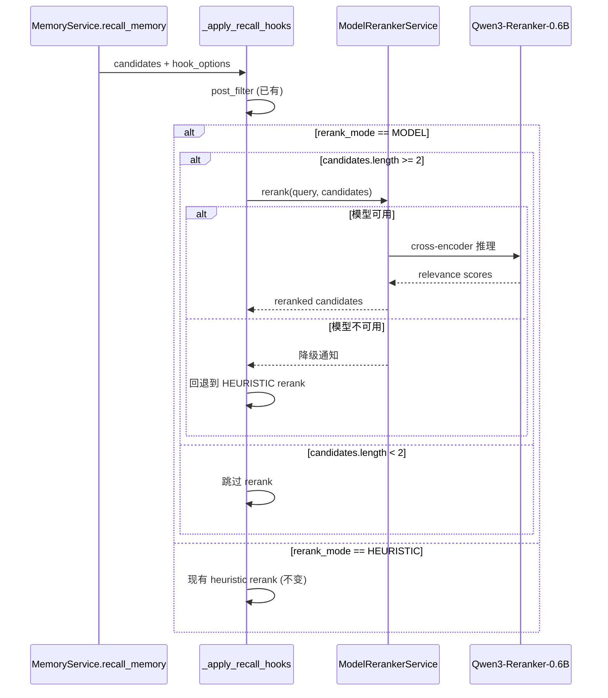

# Implementation Plan: Memory Automation Pipeline -- Phase 2

**Branch**: `claude/competent-pike` | **Date**: 2026-03-19 | **Spec**: `spec.md`
**Input**: Feature specification from `.specify/features/065-memory-automation-pipeline/spec.md`
**Scope**: Phase 2 Quality Improvement (US-4, US-5, US-6) -- 在 Phase 1 已完成基础上扩展
**Prerequisites**: Phase 1 已实现并合并 (ConsolidationService, memory.write, Scheduler)

## Summary

为 OctoAgent Memory 自动化管线构建 Phase 2 质量提升层：

1. **Derived Memory 自动提取**（US-4, FR-012/FR-013）：在 `ConsolidationService.consolidate_scope()` 成功 commit SoR 后，自动调用 LLM 提取 entity/relation/category 类型的 `DerivedMemoryRecord`，写入 SQLite。提取失败不影响 SoR 写入结果（best-effort）。
2. **Memory Flush Prompt 优化**（US-5, FR-014/FR-015）：在 Compaction 触发前注入静默 agentic turn，让 LLM 主动审视当前对话并通过 `memory.write` 持久化值得记住的信息，替代当前的全文摘要式 Flush。对话无有价值信息时可跳过或产出极简 Fragment。
3. **Retrieval Reranker 精排**（US-6, FR-016/FR-017/FR-018）：在 `MemoryService.recall_memory` 的 rerank 环节新增 `MODEL` 模式，接入 Qwen3-Reranker-0.6B 本地模型做交叉编码精排。模型不可用时自动降级到现有 HEURISTIC 模式。候选结果 < 2 条时跳过 rerank。

## Technical Context

**Language/Version**: Python 3.12+
**Primary Dependencies**: FastAPI, Pydantic, Pydantic AI, sentence-transformers, structlog, aiosqlite
**Storage**: SQLite WAL (fragments, sor, derived_memory 表) + LanceDB (向量索引)
**Testing**: pytest + pytest-asyncio
**Target Platform**: macOS (local-first) + Docker
**Project Type**: monorepo (apps/gateway + packages/memory + packages/provider + packages/core)
**Performance Goals**: Derived 提取 < 10 秒/batch（不含 LLM 等待）；Reranker 推理 < 500ms/batch(10 条)
**Constraints**: Derived 提取 best-effort 不阻塞 consolidate；Reranker 必须支持降级；Flush Prompt 不阻塞 Compaction 返回
**Scale/Scope**: 单用户 Personal AI OS

## Constitution Check

*GATE: Must pass before implementation. All principles re-evaluated against Phase 2 design.*

| # | 原则 | 适用性 | 评估 | 说明 |
|---|------|--------|------|------|
| 1 | Durability First | HIGH | PASS | Derived 记录落盘 SQLite derived_memory 表（已有表结构）；Flush Prompt 产出走 memory.write 治理流程落盘；Reranker 为查询时计算，不涉及持久化 |
| 2 | Everything is an Event | MEDIUM | PASS | Derived 提取结果通过 consolidation 日志记录；Flush Prompt 的 memory.write 调用产出标准事件链；Reranker 结果记入 hit.metadata |
| 3 | Tools are Contracts | MEDIUM | PASS | Flush Prompt 复用已有 memory.write 工具契约；Reranker 作为内部服务层，不暴露新工具 |
| 4 | Side-effect Two-Phase | HIGH | PASS | Derived 提取通过 ingest_batch 走 SqliteMemoryBackend 的标准写入路径；Flush Prompt 的 memory.write 走完整 propose/validate/commit 治理 |
| 5 | Least Privilege | LOW | PASS | Derived 提取不涉及 secrets；Reranker 为本地模型，不访问外部服务 |
| 6 | Degrade Gracefully | **CRITICAL** | PASS | Derived 提取失败 -> SoR 不受影响，日志记录 warning（FR-013）；Reranker 模型不可用 -> 降级到 HEURISTIC（FR-017）；Flush Prompt LLM 失败 -> 回退到原有全文摘要 Flush |
| 7 | User-in-Control | MEDIUM | PASS | Flush Prompt 产出走 memory.write 治理流程，敏感分区可拦截；Reranker 模式可通过 recall preferences 配置 |
| 8 | Observability | HIGH | PASS | Derived 提取结果数量/错误记入 ConsolidationScopeResult；Reranker 模式和得分记入 hit.metadata；Flush Prompt 执行情况记入结构化日志 |
| 9 | 不猜关键配置 | LOW | PASS | Reranker 模型路径可通过配置指定，不硬猜 |
| 10 | Bias to Action | LOW | N/A | 非 Agent 行为约束 |
| 11 | Context Hygiene | MEDIUM | PASS | Flush Prompt 注入的静默 turn 不进入用户可见的对话历史；Derived 提取的 LLM 调用不占用对话上下文 |
| 12 | 记忆写入必须治理 | **CRITICAL** | PASS | Derived 记录通过 SqliteMemoryBackend.ingest_batch 写入（已有路径）；Flush Prompt 通过 memory.write 走完整治理流程 |
| 13 | 失败必须可解释 | HIGH | PASS | Derived 提取失败分类到 ConsolidationScopeResult.errors；Reranker 降级原因记入 metadata；Flush Prompt 失败记入日志 |
| 13A | 优先提供上下文 | MEDIUM | PASS | Flush Prompt 通过丰富的系统指令引导 LLM 判断，不硬编码信息选择规则 |
| 14 | A2A 协议兼容 | LOW | N/A | Phase 2 不涉及 A2A 对外交互 |

**结论**: 所有适用原则均 PASS，无 VIOLATION。原则 6（Degrade Gracefully）和原则 12（记忆写入必须治理）是 Phase 2 的关键检查点，已充分设计降级路径和治理流程。

## Architecture

### Phase 2 整体数据流



### US-4: Derived Memory 提取流程



### US-5: Flush Prompt 优化流程



### US-6: Reranker 精排流程



## Project Structure

### Documentation (this feature)

```text
.specify/features/065-memory-automation-pipeline/
├── plan.md                  # Phase 1 计划（已有）
├── plan-phase2.md           # 本文件（Phase 2 计划）
├── research-phase2.md       # Phase 2 技术决策研究
├── data-model-phase2.md     # Phase 2 数据模型补充
├── spec.md                  # 需求规范（已有）
├── contracts/
│   ├── memory-write-tool.md        # Phase 1（已有）
│   ├── consolidation-service.md    # Phase 1（已有）
│   ├── derived-extraction.md       # Phase 2 新增
│   └── model-reranker.md           # Phase 2 新增
├── quickstart-phase2.md     # Phase 2 快速上手指南
├── checklists/              # 已有
└── research/                # 已有
```

### Source Code (repository root)

```text
octoagent/
├── packages/
│   ├── provider/
│   │   └── src/octoagent/provider/dx/
│   │       ├── consolidation_service.py     # [MODIFY] 添加 derived 提取 hook
│   │       ├── derived_extraction_service.py # [NEW] DerivedExtractionService
│   │       ├── flush_prompt_injector.py      # [NEW] FlushPromptInjector
│   │       └── model_reranker_service.py     # [NEW] ModelRerankerService
│   │
│   └── memory/
│       └── src/octoagent/memory/
│           ├── models/integration.py          # [MODIFY] MemoryRecallRerankMode 新增 MODEL
│           └── service.py                     # [MODIFY] _apply_recall_hooks 新增 MODEL 分支
│
├── apps/
│   └── gateway/
│       ├── src/octoagent/gateway/services/
│       │   ├── task_service.py               # [MODIFY] Compaction 前注入 Flush Prompt
│       │   ├── agent_context.py              # [MODIFY] 新增 get_reranker_service()
│       │   └── capability_pack.py            # [REFERENCE] Flush Prompt 复用 memory.write
│       │
│       └── tests/
│           ├── test_derived_extraction.py     # [NEW] Derived 提取测试
│           ├── test_flush_prompt_injector.py  # [NEW] Flush Prompt 测试
│           └── test_model_reranker.py         # [NEW] Reranker 测试
│
└── packages/
    └── memory/
        └── tests/
            └── test_recall_rerank_model.py    # [NEW] MODEL rerank 集成测试
```

**Structure Decision**: 延续 Phase 1 的 monorepo 结构。三个新服务（DerivedExtractionService、FlushPromptInjector、ModelRerankerService）均放在 `packages/provider/dx/` 下，与 ConsolidationService 平级。MemoryRecallRerankMode 扩展在 `packages/memory/models/` 中。不创建新包。

## Detailed Implementation

### Task 1: DerivedExtractionService（US-4 基础）

**文件**: `octoagent/packages/provider/src/octoagent/provider/dx/derived_extraction_service.py` (NEW)

**职责**: 从新产出的 SoR 记录中，通过 LLM 提取 entity/relation/category 类型的 DerivedMemoryRecord。

**关键接口**:

```python
@dataclass(slots=True)
class DerivedExtractionResult:
    """Derived 提取结果。"""
    scope_id: str
    extracted: int = 0
    skipped: int = 0
    errors: list[str] = field(default_factory=list)


class DerivedExtractionService:
    """从 SoR 中自动提取 entity/relation/category 派生记录。"""

    def __init__(
        self,
        memory_store: SqliteMemoryStore,
        llm_service: LlmServiceProtocol | None,
        project_root: Path,
    ) -> None: ...

    async def extract_from_sors(
        self,
        *,
        scope_id: str,
        partition: MemoryPartition,
        committed_sors: list[CommittedSorInfo],
        model_alias: str = "",
    ) -> DerivedExtractionResult:
        """从一批刚 commit 的 SoR 中提取 Derived Memory。

        best-effort: 任何失败都不抛异常，只记录到 result.errors。
        """
        ...
```

**CommittedSorInfo 辅助数据类**:

```python
@dataclass(slots=True)
class CommittedSorInfo:
    """consolidate 产出的 SoR 摘要信息，供 derived 提取用。"""
    memory_id: str
    subject_key: str
    content: str
    partition: MemoryPartition
    source_fragment_ids: list[str] = field(default_factory=list)
```

**LLM Prompt 设计**:

系统 prompt 指导 LLM 从 SoR 内容中识别并提取：
- **entity**: 人名、地名、组织名、工具名、技术名等命名实体
- **relation**: 实体之间的关系（如"用户-出差-东京"、"OctoAgent-使用-SQLite"）
- **category**: 信息所属分类标签（如"差旅计划"、"技术选型"、"个人偏好"）

输出格式为 JSON 数组：
```json
[
  {
    "derived_type": "entity",
    "subject_key": "东京",
    "summary": "city: 东京（用户出差目的地）",
    "confidence": 0.9,
    "payload": {"entity_type": "location", "name": "东京"}
  },
  {
    "derived_type": "relation",
    "subject_key": "用户/差旅/东京",
    "summary": "用户 3 月 15 日出差去东京",
    "confidence": 0.85,
    "payload": {"source": "用户", "relation": "出差", "target": "东京", "time": "3月15日"}
  }
]
```

**写入路径**: 通过 `SqliteMemoryBackend.ingest_batch()` 写入（该方法已有 derived 记录处理逻辑，当前仅在 import pipeline 触发）。但鉴于 ingest_batch 面向批量导入场景且参数结构偏重（需要 MemoryIngestBatch），Phase 2 将新增一个更轻量的写入方法：

```python
async def write_derived_records(
    self,
    scope_id: str,
    records: list[DerivedMemoryRecord],
) -> int:
    """直接写入 derived 记录到 SQLite，返回成功写入数。"""
    # 调用 SqliteMemoryStore 的 derived 表写入
    ...
```

**降级策略**: LLM 调用失败时，`extract_from_sors` 捕获异常，返回 errors 列表。ConsolidationService 调用方记录 warning 日志，SoR commit 结果不受影响。

### Task 2: ConsolidationService 添加 Derived 提取 Hook（US-4 集成）

**文件**: `octoagent/packages/provider/src/octoagent/provider/dx/consolidation_service.py` (MODIFY)

**变更范围**: `consolidate_scope()` 方法，在步骤 8（SoR 创建）完成后、步骤 9（标记 fragment）之前，新增 derived 提取调用。

**新增依赖**:

```python
class ConsolidationService:
    def __init__(
        self,
        memory_store: SqliteMemoryStore,
        llm_service: LlmServiceProtocol | None,
        project_root: Path,
        derived_extraction_service: DerivedExtractionService | None = None,  # Phase 2 新增
    ) -> None:
        ...
        self._derived_service = derived_extraction_service
```

**consolidate_scope 中的变更**:

```python
# 步骤 8 完毕后，收集已 commit 的 SoR 信息
committed_sors: list[CommittedSorInfo] = []
for fact in facts:
    # ... 现有 propose/validate/commit 逻辑 ...
    if validation.accepted:
        await memory.commit_memory(proposal.proposal_id)
        consolidated += 1
        committed_sors.append(CommittedSorInfo(
            memory_id=proposal.target_memory_id,
            subject_key=subject_key,
            content=content,
            partition=partition,
            source_fragment_ids=source_ids,
        ))

# --- Phase 2: Derived Memory 自动提取 (best-effort) ---
if self._derived_service and committed_sors:
    try:
        derived_result = await self._derived_service.extract_from_sors(
            scope_id=scope_id,
            partition=partition,
            committed_sors=committed_sors,
            model_alias=resolved_alias,
        )
        _log.info(
            "consolidation_derived_extraction",
            scope_id=scope_id,
            extracted=derived_result.extracted,
            errors=derived_result.errors[:3],
        )
    except Exception as exc:
        _log.warning(
            "consolidation_derived_extraction_failed",
            scope_id=scope_id,
            error_type=type(exc).__name__,
            error=str(exc),
        )
```

**关键约束**:
- `DerivedExtractionService` 为可选依赖（`None` 时跳过）
- 整个 derived 提取块在 try/except 中，任何异常不影响 consolidate 返回值
- ConsolidationScopeResult 新增 `derived_extracted: int = 0` 字段用于可观测

### Task 3: FlushPromptInjector（US-5）

**文件**: `octoagent/packages/provider/src/octoagent/provider/dx/flush_prompt_injector.py` (NEW)

**职责**: 在 Compaction 触发前注入静默 agentic turn，让 LLM 主动选择值得持久化的信息。

**关键接口**:

```python
@dataclass(slots=True)
class FlushPromptResult:
    """Flush Prompt 注入结果。"""
    writes_attempted: int = 0
    writes_committed: int = 0
    skipped: bool = False       # LLM 判断无需保存
    errors: list[str] = field(default_factory=list)
    fallback_to_summary: bool = False  # 降级到原有摘要 Flush


class FlushPromptInjector:
    """Compaction 前的静默 agentic turn 注入器。

    参考 OpenClaw memory-flush.ts:
    注入 system + user 消息让 LLM 审视当前对话，
    通过 memory.write tool call 保存重要信息。
    """

    def __init__(
        self,
        llm_service: LlmServiceProtocol | None,
        project_root: Path,
    ) -> None: ...

    async def run_flush_turn(
        self,
        *,
        conversation_messages: list[dict[str, str]],
        scope_id: str,
        memory_write_fn: Callable[..., Awaitable[str]],
        model_alias: str = "",
    ) -> FlushPromptResult:
        """注入静默 turn 并执行 LLM 返回的 memory.write 调用。

        Args:
            conversation_messages: 当前对话消息列表（用于 LLM 审视）
            scope_id: 当前 scope
            memory_write_fn: memory.write 工具的调用函数
            model_alias: LLM 模型别名
        """
        ...
```

**静默 Turn Prompt 设计**:

```python
_FLUSH_SYSTEM_PROMPT = """\
你是一个记忆管理助手。在对话即将压缩之前，请审视当前对话内容，
判断是否有值得长期记住的信息。

## 判断标准

值得保存的信息：
- 用户明确表达的偏好、习惯、喜好
- 重要的个人事实（生日、住址、工作信息等）
- 关键的项目决策和结论
- 用户未来的计划或承诺
- 纠正之前错误认知的新信息

不需要保存的信息：
- 纯粹的问答过程（"怎么做 X？" -> 答案）
- 临时状态（"我正在等回复"）
- 已经被保存过的重复信息
- 闲聊寒暄

## 输出格式

输出一个 JSON 数组，每个元素是一个需要保存的记忆：
```json
[
  {
    "subject_key": "主题/子主题",
    "content": "完整的陈述句",
    "partition": "work"
  }
]
```

如果当前对话中没有值得长期保存的新信息，输出空数组 `[]`。
"""

_FLUSH_USER_PROMPT_TEMPLATE = """\
以下是即将被压缩的对话内容，请审视并决定哪些信息值得作为长期记忆保存：

{conversation_summary}
"""
```

**集成点**: `task_service.py` 的 `_persist_compaction_flush` 方法。

**执行流程**:

1. Compaction 检测到需要压缩
2. 在执行现有 Flush 之前，调用 `FlushPromptInjector.run_flush_turn()`
3. LLM 返回 memory.write 调用列表 -> 逐条执行 memory.write（走完整治理流程）
4. 无论 Flush Prompt 成功/失败/跳过，都继续执行原有的 Compaction Flush 流程
5. 如果 FlushPromptInjector 失败（LLM 不可用），降级到原有行为（全文摘要 Flush），不影响 Compaction

**task_service.py 修改位置**: `_persist_compaction_flush` 方法开头。

```python
async def _persist_compaction_flush(self, ...) -> str:
    task = await self.get_task(task_id)
    if task is None:
        return ""

    # --- Phase 2: Flush Prompt 优化 (US-5) ---
    flush_prompt_result = None
    try:
        injector = self._agent_context.get_flush_prompt_injector()
        if injector is not None:
            flush_prompt_result = await injector.run_flush_turn(
                conversation_messages=...,  # 从 context frame 获取
                scope_id=flush_scope_id,
                memory_write_fn=self._memory_write_for_flush,
                model_alias="",
            )
            log.info(
                "flush_prompt_completed",
                writes=flush_prompt_result.writes_committed,
                skipped=flush_prompt_result.skipped,
            )
    except Exception as exc:
        log.warning(
            "flush_prompt_failed",
            error_type=type(exc).__name__,
            error=str(exc),
        )

    # --- 继续原有 Flush 流程（不变）---
    try:
        ...  # 现有 Flush 逻辑
```

**关键约束**:
- Flush Prompt 在 Flush 之前执行，但不阻塞 Flush（失败则降级）
- 静默 turn 不进入用户可见的对话历史
- memory.write 调用走完整治理流程（原则 12）
- LLM 返回空数组时表示无需保存，正常继续 Flush

### Task 4: ModelRerankerService（US-6 基础）

**文件**: `octoagent/packages/provider/src/octoagent/provider/dx/model_reranker_service.py` (NEW)

**职责**: 封装 Qwen3-Reranker-0.6B 本地模型，提供 cross-encoder rerank 能力。

**关键接口**:

```python
@dataclass(slots=True)
class RerankResult:
    """Rerank 结果。"""
    scores: list[float]           # 与 candidates 一一对应的相关性得分
    model_id: str = ""            # 使用的模型标识
    degraded: bool = False        # 是否降级
    degraded_reason: str = ""     # 降级原因


class ModelRerankerService:
    """基于 Qwen3-Reranker-0.6B 的本地 cross-encoder reranker。

    sentence-transformers 兼容，使用 CrossEncoder API。
    模型加载失败时降级到 heuristic rerank。
    """

    _RERANKER_MODEL_ID: str = "Qwen/Qwen3-Reranker-0.6B"
    _MIN_CANDIDATES_FOR_RERANK: int = 2
    _RERANK_INSTRUCTION: str = (
        "Given a query, retrieve relevant memory passages that contain "
        "the information needed to answer the query."
    )

    def __init__(self, *, auto_load: bool = True) -> None:
        self._model: Any | None = None
        self._model_loaded: bool = False
        self._load_attempted: bool = False
        self._load_error: str = ""
        self._warmup_task: asyncio.Task[None] | None = None
        if auto_load:
            self._schedule_warmup()

    @property
    def is_available(self) -> bool:
        return self._model_loaded and self._model is not None

    async def rerank(
        self,
        query: str,
        candidates: list[str],
    ) -> RerankResult:
        """对候选文本进行 cross-encoder 精排。

        如果模型不可用或 candidates < 2，返回 degraded=True。
        """
        if len(candidates) < self._MIN_CANDIDATES_FOR_RERANK:
            return RerankResult(
                scores=[1.0] * len(candidates),
                degraded=True,
                degraded_reason="candidates < 2, skipped rerank",
            )

        if not self.is_available:
            return RerankResult(
                scores=[0.0] * len(candidates),
                degraded=True,
                degraded_reason=self._load_error or "reranker model not loaded",
            )

        try:
            pairs = [
                {"query": query, "passage": candidate}
                for candidate in candidates
            ]
            # Qwen3-Reranker 使用 instruction-aware reranking
            scores = await asyncio.to_thread(
                self._model.predict,
                pairs,
                activation_fn=None,  # 原始 logit 分数
            )
            return RerankResult(
                scores=[float(s) for s in scores],
                model_id=self._RERANKER_MODEL_ID,
            )
        except Exception as exc:
            return RerankResult(
                scores=[0.0] * len(candidates),
                degraded=True,
                degraded_reason=f"rerank inference failed: {exc}",
            )
```

**模型加载策略**:
- 与 Qwen3-Embedding-0.6B 相同的 warmup 模式：后台异步加载，不阻塞启动
- 使用 `sentence_transformers.CrossEncoder` API（Qwen3-Reranker-0.6B 兼容）
- 首次使用时如果模型未下载，sentence-transformers 会自动从 HuggingFace 下载
- 加载失败后设置退避时间，避免频繁重试

**Qwen3-Reranker-0.6B 特性**:
- 支持 instruction-aware reranking（可提供查询意图指令）
- 输入格式: `[query, passage]` pair
- 输出: relevance score (logit)
- 模型大小约 600MB，CPU 推理可接受（< 500ms / 10 candidates）

### Task 5: MemoryRecallRerankMode 扩展 + recall 集成（US-6 集成）

**文件 1**: `octoagent/packages/memory/src/octoagent/memory/models/integration.py` (MODIFY)

**变更**: `MemoryRecallRerankMode` 新增 `MODEL` 枚举值。

```python
class MemoryRecallRerankMode(StrEnum):
    """Recall rerank 模式。"""
    NONE = "none"
    HEURISTIC = "heuristic"
    MODEL = "model"          # Phase 2 新增: 本地 cross-encoder 模型精排
```

**文件 2**: `octoagent/packages/memory/src/octoagent/memory/service.py` (MODIFY)

**变更位置**: `_apply_recall_hooks` 方法，在现有 HEURISTIC 分支后新增 MODEL 分支。

```python
# 现有代码（不变）
if hook_options.rerank_mode is MemoryRecallRerankMode.HEURISTIC and candidates:
    candidates = self._rerank_recall_candidates(candidates)

# Phase 2 新增: MODEL rerank
elif hook_options.rerank_mode is MemoryRecallRerankMode.MODEL and candidates:
    if len(candidates) >= 2 and self._reranker_service is not None:
        rerank_result = await self._reranker_service.rerank(
            query=query,
            candidates=[c[-1].summary or c[-1].subject_key for c in candidates],
        )
        if rerank_result.degraded:
            # 降级到 HEURISTIC
            candidates = self._rerank_recall_candidates(candidates)
            degraded_reasons.append(f"reranker_degraded:{rerank_result.degraded_reason}")
        else:
            # 按 reranker 分数重排
            scored = list(zip(rerank_result.scores, candidates))
            scored.sort(key=lambda x: -x[0])
            candidates = [
                self._annotate_recall_candidate(
                    c,
                    recall_rerank_score=round(s, 4),
                    recall_rerank_mode="model",
                    recall_rerank_model=rerank_result.model_id,
                )
                for s, c in scored
            ]
    else:
        # candidates < 2 或 reranker 不可用，降级到 HEURISTIC
        if candidates:
            candidates = self._rerank_recall_candidates(candidates)
```

**MemoryService 构造注入**:

```python
class MemoryService:
    def __init__(
        self,
        ...
        reranker_service: ModelRerankerService | None = None,  # Phase 2 新增
    ) -> None:
        ...
        self._reranker_service = reranker_service
```

**agent_context.py 变更**: 新增 `get_reranker_service()` 方法，返回 `ModelRerankerService` 实例（或 None）。在创建 MemoryService 时注入。

**recall preferences 默认值**: Phase 2 实现后，默认 rerank_mode 保持 `HEURISTIC`（现有行为不变）。用户可通过 `octo config memory` 或 agent_context preferences 设置为 `MODEL`。后续可在验证 MODEL 模式稳定后将默认值切换。

### 依赖注入与服务初始化

**新服务创建位置**: 在 AgentContext（或 ServiceContainer）中创建并持有：

1. **DerivedExtractionService**: 随 ConsolidationService 一起创建，注入到 ConsolidationService 构造函数
2. **FlushPromptInjector**: 在 AgentContext 中创建，通过 `get_flush_prompt_injector()` 供 TaskService 使用
3. **ModelRerankerService**: 在 AgentContext 中创建（单例），通过 `get_reranker_service()` 供 MemoryService 使用

**降级矩阵**:

| 服务 | 依赖 | 不可用时的降级行为 |
|------|------|------------------|
| DerivedExtractionService | LLM | 返回空结果 + errors，SoR 不受影响 |
| FlushPromptInjector | LLM | 返回 fallback_to_summary=True，继续原有 Flush |
| ModelRerankerService | sentence-transformers + 模型文件 | 返回 degraded=True，MemoryService 降级到 HEURISTIC |

## Complexity Tracking

> 本计划无 Constitution Check violations，以下为技术选型的复杂度记录。

| 决策 | 为何不用更简方案 | 被拒的简单方案 |
|------|-----------------|---------------|
| DerivedExtractionService 独立于 ConsolidationService | 职责单一：Consolidate 专注 Fragment->SoR，Derived 专注 SoR->entity/relation | 在 ConsolidationService 内直接写 derived 逻辑 -- 职责混杂，且 derived 提取可能后续有独立触发场景 |
| FlushPromptInjector 用 LLM tool-call 而非纯 prompt | LLM 通过 memory.write 工具调用走完整治理流程，符合原则 12 | 纯 prompt 提取 JSON 后直接写数据库 -- 绕过治理流程，违反宪法原则 12 |
| ModelRerankerService 使用 Qwen3-Reranker-0.6B 而非 LLM API | 本地模型延迟低（< 500ms），无 API 成本，离线可用 | 调用 LiteLLM Proxy 做 rerank -- 延迟高、成本高、检索路径上增加外部依赖 |
| rerank_mode 默认保持 HEURISTIC | 渐进式切换，先验证 MODEL 效果再设为默认 | 直接默认 MODEL -- 模型首次下载阻塞体验差，且未经验证 |
| Flush Prompt 在 Flush 之前执行 | 让 LLM 在对话上下文压缩前审视完整内容，信息密度更高 | Flush 之后执行 -- 此时对话已被压缩，LLM 只能审视摘要而非原文 |
