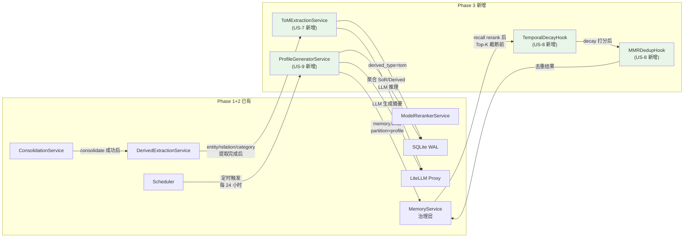
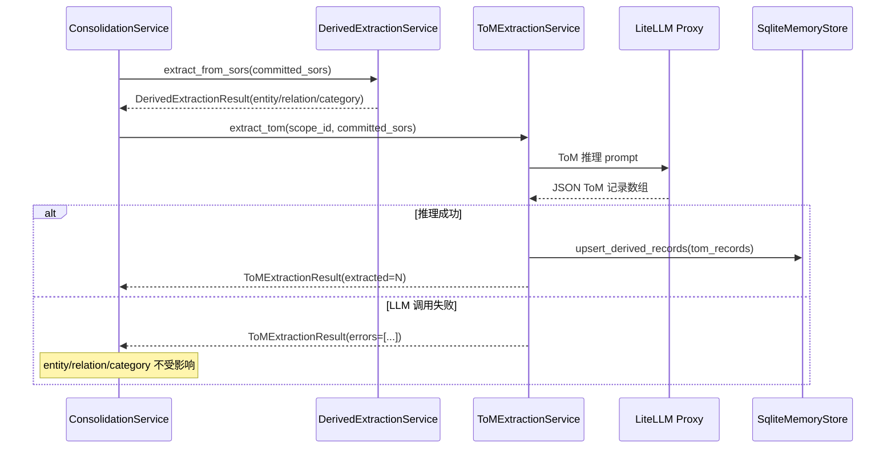
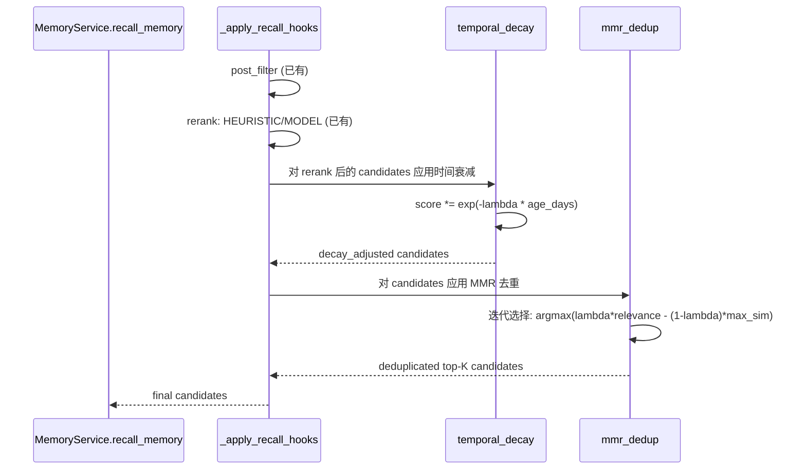
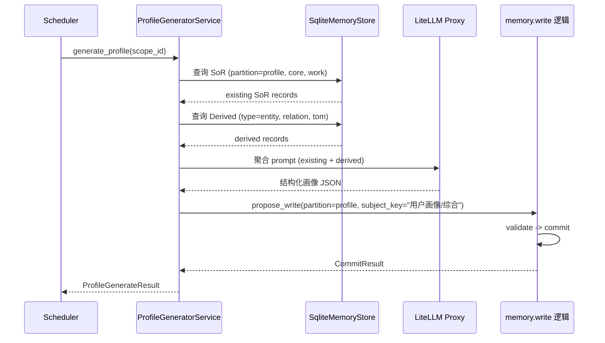

# Implementation Plan: Memory Automation Pipeline -- Phase 3

**Branch**: `claude/competent-pike` | **Date**: 2026-03-19 | **Spec**: `spec.md`
**Input**: Feature specification from `.specify/features/065-memory-automation-pipeline/spec.md`
**Scope**: Phase 3 Advanced Features (US-7, US-8, US-9) -- 在 Phase 1+2 已完成基础上扩展
**Prerequisites**: Phase 1 (ConsolidationService, memory.write, Scheduler) + Phase 2 (DerivedExtractionService, FlushPromptInjector, ModelRerankerService) 已实现并合并

## Summary

为 OctoAgent Memory 自动化管线构建 Phase 3 高级功能层：

1. **Theory of Mind 推理**（US-7, FR-019）：扩展已有的 `DerivedExtractionService`，在 Consolidate 产出新 SoR 后额外运行一次 ToM 推理 LLM 调用，从对话事实中推断用户意图、偏好、知识水平和情绪倾向，生成 `derived_type="tom"` 的 `DerivedMemoryRecord`。
2. **Temporal Decay + MMR 去重**（US-8, FR-020/FR-021）：在 `MemoryService._apply_recall_hooks()` 的 rerank 阶段，为所有候选结果注入时间衰减因子（指数衰减，半衰期 30 天），并在 Top-K 截断前应用 MMR（Maximal Marginal Relevance）去重，提升召回结果的新鲜度和多样性。
3. **用户画像自动生成**（US-9, FR-022/FR-023）：新增 `ProfileGeneratorService`，通过 Scheduler 定期从 SoR + Derived 聚合生成 profile 摘要，写入 `partition=profile` 的专用 SoR 记录。Agent 启动会话时可通过 recall 快速加载画像注入 system prompt。

核心技术决策：
- ToM 推理复用 `DerivedExtractionService` 的架构，新增独立 Prompt + `derived_type="tom"` 写入路径
- Temporal Decay 和 MMR 作为 `_apply_recall_hooks` 中的两个独立阶段，在 rerank 之后、Top-K 截断之前执行
- 用户画像复用 Phase 1 Scheduler + Phase 1 ConsolidationService 的注册模式，新增 `memory.profile_generate` action

## Technical Context

**Language/Version**: Python 3.12+
**Primary Dependencies**: FastAPI, Pydantic, structlog, aiosqlite, numpy (MMR 计算)
**Storage**: SQLite WAL (fragments, sor, derived_memory 表) + LanceDB (向量索引)
**Testing**: pytest + pytest-asyncio
**Target Platform**: macOS (local-first) + Docker
**Project Type**: monorepo (apps/gateway + packages/memory + packages/provider + packages/core)
**Performance Goals**: ToM 推理 < 10 秒/batch（不含 LLM 等待）；Temporal Decay + MMR < 50ms/batch(20 条)；画像生成 < 30 秒（不含 LLM 等待）
**Constraints**: ToM 和画像为 best-effort，失败不影响核心管线；Temporal Decay/MMR 不引入外部依赖
**Scale/Scope**: 单用户 Personal AI OS

## Constitution Check

*GATE: Must pass before implementation. All principles re-evaluated against Phase 3 design.*

| # | 原则 | 适用性 | 评估 | 说明 |
|---|------|--------|------|------|
| 1 | Durability First | HIGH | PASS | ToM 记录落盘 SQLite derived_memory 表；画像落盘 SoR 表 (partition=profile)；Temporal Decay/MMR 为查询时计算，不涉及持久化 |
| 2 | Everything is an Event | MEDIUM | PASS | ToM 提取通过 DerivedExtractionResult 记录；画像生成通过 MemoryMaintenanceRun 审计；Temporal Decay/MMR 在 hook_trace 中记录 |
| 3 | Tools are Contracts | LOW | PASS | Phase 3 不新增对外暴露的工具；画像生成为内部 Scheduler action |
| 4 | Side-effect Two-Phase | HIGH | PASS | 画像写入通过 memory.write 的 propose/validate/commit 治理流程；ToM 通过 DerivedExtractionService 的标准 derived 写入路径 |
| 5 | Least Privilege | LOW | PASS | ToM 推理不涉及 secrets；画像不含敏感分区数据 |
| 6 | Degrade Gracefully | **CRITICAL** | PASS | ToM 推理失败 -> SoR/entity/relation/category 提取不受影响（独立 LLM 调用）；画像生成失败 -> Scheduler 下次重试，不影响 Agent 对话；Temporal Decay/MMR 为纯计算，无外部依赖 |
| 7 | User-in-Control | MEDIUM | PASS | 画像生成 Scheduler 作业可通过管理台启用/禁用/调整间隔；Temporal Decay 参数可配置 |
| 8 | Observability | HIGH | PASS | ToM 提取记录数量/错误记入 ConsolidationScopeResult 新增字段；画像生成记入 AutomationJobRun；Temporal Decay/MMR 参数和效果记入 hook_trace |
| 9 | 不猜关键配置 | LOW | PASS | 半衰期和 MMR lambda 有默认值，可通过配置覆盖 |
| 12 | 记忆写入必须治理 | **CRITICAL** | PASS | 画像写入走完整 propose/validate/commit 治理流程；ToM 记录通过 SqliteMemoryStore.upsert_derived_records 写入（已有路径） |
| 13 | 失败必须可解释 | HIGH | PASS | 所有服务的失败分类到各自 result.errors 列表中，含 error_type 和可读消息 |
| 13A | 优先提供上下文 | MEDIUM | PASS | ToM 推理通过丰富 prompt 上下文引导 LLM 判断，不硬编码推断规则 |

**结论**: 所有适用原则均 PASS，无 VIOLATION。原则 6（Degrade Gracefully）和原则 12（记忆写入必须治理）是 Phase 3 的关键检查点。

## Architecture

### Phase 3 整体数据流



### US-7: ToM 推理流程



### US-8: Temporal Decay + MMR 流程



### US-9: 用户画像生成流程



## Project Structure

### Documentation (this feature)

```text
.specify/features/065-memory-automation-pipeline/
├── plan.md                  # Phase 1 计划（已有）
├── plan-phase2.md           # Phase 2 计划（已有）
├── plan-phase3.md           # 本文件（Phase 3 计划）
├── research-phase3.md       # Phase 3 技术决策研究
├── data-model-phase3.md     # Phase 3 数据模型补充
├── spec.md                  # 需求规范（已有）
├── contracts/
│   ├── memory-write-tool.md        # Phase 1（已有）
│   ├── consolidation-service.md    # Phase 1（已有）
│   ├── derived-extraction.md       # Phase 2（已有）
│   ├── model-reranker.md           # Phase 2（已有）
│   ├── tom-extraction.md           # Phase 3 新增
│   ├── temporal-decay-mmr.md       # Phase 3 新增
│   └── profile-generator.md        # Phase 3 新增
├── quickstart-phase3.md     # Phase 3 快速上手指南
├── checklists/              # 已有
└── research/                # 已有
```

### Source Code (repository root)

```text
octoagent/
├── packages/
│   ├── provider/
│   │   └── src/octoagent/provider/dx/
│   │       ├── consolidation_service.py     # [MODIFY] 添加 ToM 提取 hook
│   │       ├── derived_extraction_service.py # [REFERENCE] 已有，供 ToM 参考
│   │       ├── tom_extraction_service.py     # [NEW] ToMExtractionService
│   │       └── profile_generator_service.py  # [NEW] ProfileGeneratorService
│   │
│   └── memory/
│       └── src/octoagent/memory/
│           ├── models/integration.py          # [MODIFY] MemoryRecallHookOptions 新增 decay/mmr 参数
│           └── service.py                     # [MODIFY] _apply_recall_hooks 新增 decay + MMR 阶段
│
├── apps/
│   └── gateway/
│       ├── src/octoagent/gateway/services/
│       │   ├── control_plane.py              # [MODIFY] 注册 memory.profile_generate action + Scheduler job
│       │   └── agent_context.py              # [MODIFY] 新增 get_tom_extraction_service() / get_profile_generator_service()
│       │
│       └── tests/
│           ├── test_tom_extraction.py         # [NEW] ToM 提取测试
│           ├── test_temporal_decay_mmr.py     # [NEW] Temporal Decay + MMR 测试
│           └── test_profile_generator.py      # [NEW] 画像生成测试
│
└── packages/
    └── memory/
        └── tests/
            └── test_recall_decay_mmr.py       # [NEW] decay + MMR 集成测试
```

**Structure Decision**: 延续 Phase 1/2 的 monorepo 结构。ToMExtractionService 和 ProfileGeneratorService 放在 `packages/provider/dx/` 下，与 DerivedExtractionService 平级。Temporal Decay 和 MMR 逻辑直接实现在 `MemoryService._apply_recall_hooks()` 内部（纯计算，不需要独立服务类）。

## Detailed Implementation

### Task 1: ToMExtractionService（US-7 基础）

**文件**: `octoagent/packages/provider/src/octoagent/provider/dx/tom_extraction_service.py` (NEW)

**职责**: 从 Consolidate 新产出的 SoR 记录中，通过 LLM 推断用户意图、偏好、知识水平和情绪倾向，生成 `derived_type="tom"` 的 DerivedMemoryRecord。

**关键接口**:

```python
@dataclass(slots=True)
class ToMExtractionResult:
    """ToM 推理结果。"""
    scope_id: str
    extracted: int = 0
    skipped: int = 0
    errors: list[str] = field(default_factory=list)


class ToMExtractionService:
    """Theory of Mind 推理服务。

    从 SoR 事实记录中推断用户的：
    - 意图/目标 (intent)
    - 偏好/倾向 (preference)
    - 知识水平 (knowledge_level)
    - 情绪状态 (emotional_state)
    """

    def __init__(
        self,
        memory_store: SqliteMemoryStore,
        llm_service: LlmServiceProtocol | None,
        project_root: Path,
    ) -> None: ...

    async def extract_tom(
        self,
        *,
        scope_id: str,
        partition: MemoryPartition,
        committed_sors: list[CommittedSorInfo],
        model_alias: str = "",
    ) -> ToMExtractionResult:
        """从一批 SoR 中推理 Theory of Mind 记录。

        best-effort: 任何失败都不抛异常，只记录到 result.errors。
        """
        ...
```

**LLM Prompt 设计**:

```python
_TOM_SYSTEM_PROMPT = """\
你是一个用户心智模型分析助手。你的任务是从一组已整理的事实记录中推断用户的心智状态。

## 推断维度

1. **intent（意图/目标）**: 用户当前关注什么、想要达成什么
   - 例如："Connor 近期关注 OctoAgent 的 Memory 系统优化"
2. **preference（偏好/倾向）**: 用户在某方面的持续偏好
   - 例如："Connor 偏好使用 Python + SQLite 的轻量方案"
3. **knowledge_level（知识水平）**: 用户在某领域的熟练程度
   - 例如："Connor 在分布式系统领域是高级工程师水平"
4. **emotional_state（情绪倾向）**: 用户对某事物的态度或情绪
   - 例如："Connor 对当前 Memory 系统的检索质量不太满意"

## 推断规则

- 只输出有合理依据的推断，不要凭空猜测
- confidence 反映推断的确信程度：
  - 0.9+: 多次直接表达的偏好或意图
  - 0.7-0.8: 从行为模式中推断
  - 0.5-0.6: 单次间接信号
- 如果无法做出任何有意义的推断，输出 []

## 输出格式

```json
[
  {
    "derived_type": "tom",
    "tom_dimension": "intent|preference|knowledge_level|emotional_state",
    "subject_key": "ToM/维度/主题",
    "summary": "推断描述",
    "confidence": 0.8,
    "payload": {
      "dimension": "intent",
      "domain": "领域",
      "evidence": "支持此推断的简要证据"
    },
    "source_memory_ids": ["mem-id"]
  }
]
```
"""
```

**写入路径**: 与 `DerivedExtractionService` 相同，通过 `SqliteMemoryStore.upsert_derived_records()` 写入。`derived_type` 固定为 `"tom"`，`payload` 中包含 `tom_dimension` 字段区分子类型。

**降级策略**: LLM 调用失败时捕获异常，返回 errors 列表。不影响 entity/relation/category 的提取结果。

### Task 2: ConsolidationService 添加 ToM 提取 Hook（US-7 集成）

**文件**: `octoagent/packages/provider/src/octoagent/provider/dx/consolidation_service.py` (MODIFY)

**变更范围**: `consolidate_scope()` 方法，在步骤 8.5（Derived 提取）之后，新增 ToM 提取调用。

**新增依赖**:

```python
class ConsolidationService:
    def __init__(
        self,
        memory_store: SqliteMemoryStore,
        llm_service: LlmServiceProtocol | None,
        project_root: Path,
        derived_extraction_service: Any | None = None,
        tom_extraction_service: Any | None = None,  # Phase 3 新增
    ) -> None:
        ...
        self._tom_service = tom_extraction_service
```

**consolidate_scope 中的变更**:

```python
# 步骤 8.5: Derived Memory 自动提取 (已有)
# ...

# --- Phase 3: ToM 推理 (best-effort) ---
tom_extracted = 0
if self._tom_service and committed_sors:
    try:
        _partition = committed_sors[0].partition if committed_sors else MemoryPartition.WORK
        tom_result = await self._tom_service.extract_tom(
            scope_id=scope_id,
            partition=_partition,
            committed_sors=committed_sors,
            model_alias=resolved_alias,
        )
        tom_extracted = tom_result.extracted
        _log.info(
            "consolidation_tom_extraction",
            scope_id=scope_id,
            extracted=tom_result.extracted,
            errors=tom_result.errors[:3],
        )
    except Exception as exc:
        _log.warning(
            "consolidation_tom_extraction_failed",
            scope_id=scope_id,
            error_type=type(exc).__name__,
            error=str(exc),
        )
```

**ConsolidationScopeResult 扩展**:

```python
@dataclass(slots=True)
class ConsolidationScopeResult:
    scope_id: str
    consolidated: int = 0
    skipped: int = 0
    errors: list[str] = field(default_factory=list)
    derived_extracted: int = 0
    tom_extracted: int = 0  # Phase 3 新增
```

### Task 3: Temporal Decay + MMR 去重（US-8）

**文件**: `octoagent/packages/memory/src/octoagent/memory/service.py` (MODIFY)

**修改位置**: `_apply_recall_hooks` 方法，在现有 rerank 完成后、Top-K 截断之前。

**3a. MemoryRecallHookOptions 扩展**:

**文件**: `octoagent/packages/memory/src/octoagent/memory/models/integration.py` (MODIFY)

```python
class MemoryRecallHookOptions(BaseModel):
    """Recall hooks 输入。"""
    post_filter_mode: MemoryRecallPostFilterMode = MemoryRecallPostFilterMode.NONE
    rerank_mode: MemoryRecallRerankMode = MemoryRecallRerankMode.NONE
    # ... 已有字段 ...

    # Phase 3 新增
    temporal_decay_enabled: bool = Field(default=False)
    temporal_decay_half_life_days: float = Field(default=30.0, gt=0.0)
    mmr_enabled: bool = Field(default=False)
    mmr_lambda: float = Field(default=0.7, ge=0.0, le=1.0)
```

**3b. MemoryRecallHookTrace 扩展**:

```python
class MemoryRecallHookTrace(BaseModel):
    # ... 已有字段 ...

    # Phase 3 新增
    temporal_decay_applied: bool = Field(default=False)
    temporal_decay_half_life_days: float = Field(default=0.0)
    mmr_applied: bool = Field(default=False)
    mmr_lambda: float = Field(default=0.0)
    mmr_removed_count: int = Field(default=0)
```

**3c. _apply_recall_hooks 变更**:

```python
async def _apply_recall_hooks(self, ...) -> ...:
    # ... 已有 post_filter + rerank 逻辑 ...

    # --- Phase 3: Temporal Decay (US-8, FR-020) ---
    if hook_options.temporal_decay_enabled and candidates:
        candidates = self._apply_temporal_decay(
            candidates,
            half_life_days=hook_options.temporal_decay_half_life_days,
        )
        trace.temporal_decay_applied = True
        trace.temporal_decay_half_life_days = hook_options.temporal_decay_half_life_days

    # --- Phase 3: MMR 去重 (US-8, FR-021) ---
    if hook_options.mmr_enabled and len(candidates) > 1:
        before_count = len(candidates)
        candidates = self._apply_mmr_dedup(
            candidates,
            max_hits=max_hits,
            mmr_lambda=hook_options.mmr_lambda,
        )
        trace.mmr_applied = True
        trace.mmr_lambda = hook_options.mmr_lambda
        trace.mmr_removed_count = before_count - len(candidates)

    # Top-K 截断（已有）
    bounded_max_hits = max(1, max_hits)
    trace.delivered_count = min(len(candidates), bounded_max_hits)
    return candidates[:bounded_max_hits], trace
```

**3d. Temporal Decay 实现**:

```python
def _apply_temporal_decay(
    self,
    candidates: list[tuple[int, int, int, MemorySearchHit]],
    *,
    half_life_days: float = 30.0,
) -> list[tuple[int, int, int, MemorySearchHit]]:
    """对候选结果应用指数时间衰减。

    decay_factor = exp(-ln(2) / half_life_days * age_days)

    将 decay_factor 乘以已有的 rerank_score（或 1.0），
    按调整后的分数重排。
    """
    import math

    decay_constant = math.log(2) / max(half_life_days, 1.0)
    now = datetime.now(UTC)

    scored: list[tuple[float, tuple[int, int, int, MemorySearchHit]]] = []
    for candidate in candidates:
        hit = candidate[-1]
        age_seconds = (now - hit.created_at).total_seconds()
        age_days = max(0.0, age_seconds / 86400.0)

        # 指数衰减因子：新记忆 ~= 1.0，半衰期时 = 0.5
        decay_factor = math.exp(-decay_constant * age_days)

        # 读取已有 rerank_score（来自 HEURISTIC 或 MODEL 阶段）
        existing_score = float(hit.metadata.get("recall_rerank_score", 1.0) or 1.0)
        adjusted_score = existing_score * decay_factor

        scored.append((
            adjusted_score,
            self._annotate_recall_candidate(
                candidate,
                recall_temporal_decay_factor=round(decay_factor, 4),
                recall_decay_adjusted_score=round(adjusted_score, 4),
            ),
        ))

    scored.sort(key=lambda x: -x[0])
    return [item[1] for item in scored]
```

**3e. MMR 去重实现**:

```python
def _apply_mmr_dedup(
    self,
    candidates: list[tuple[int, int, int, MemorySearchHit]],
    *,
    max_hits: int,
    mmr_lambda: float = 0.7,
) -> list[tuple[int, int, int, MemorySearchHit]]:
    """Maximal Marginal Relevance 去重。

    迭代选择 argmax(lambda * relevance - (1-lambda) * max_similarity_to_selected)
    使用 Jaccard token similarity 作为相似度度量（避免引入 embedding 依赖）。
    """
    if len(candidates) <= 1:
        return candidates

    n = min(max_hits, len(candidates))

    # 提取文本用于相似度计算
    texts = [
        (c[-1].summary or c[-1].subject_key or "").lower()
        for c in candidates
    ]

    # 预计算 token 集合
    token_sets = [set(text.split()) for text in texts]

    # 归一化 relevance score（取 decay_adjusted_score 或 rerank_score）
    relevance_scores = []
    for c in candidates:
        score = float(
            c[-1].metadata.get("recall_decay_adjusted_score")
            or c[-1].metadata.get("recall_rerank_score")
            or 1.0
        )
        relevance_scores.append(score)

    max_rel = max(relevance_scores) if relevance_scores else 1.0
    if max_rel > 0:
        norm_relevance = [s / max_rel for s in relevance_scores]
    else:
        norm_relevance = [1.0] * len(relevance_scores)

    # MMR 迭代选择
    selected_indices: list[int] = []
    remaining = set(range(len(candidates)))

    for _ in range(n):
        if not remaining:
            break

        best_idx = -1
        best_mmr = float("-inf")

        for idx in remaining:
            rel = norm_relevance[idx]

            # 计算与已选集合的最大 Jaccard 相似度
            max_sim = 0.0
            for sel_idx in selected_indices:
                sim = self._jaccard_similarity(token_sets[idx], token_sets[sel_idx])
                if sim > max_sim:
                    max_sim = sim

            mmr_score = mmr_lambda * rel - (1 - mmr_lambda) * max_sim
            if mmr_score > best_mmr:
                best_mmr = mmr_score
                best_idx = idx

        if best_idx >= 0:
            selected_indices.append(best_idx)
            remaining.discard(best_idx)

    return [
        self._annotate_recall_candidate(
            candidates[idx],
            recall_mmr_rank=rank,
        )
        for rank, idx in enumerate(selected_indices)
    ]

@staticmethod
def _jaccard_similarity(set_a: set[str], set_b: set[str]) -> float:
    """Jaccard 相似度。"""
    if not set_a and not set_b:
        return 0.0
    intersection = len(set_a & set_b)
    union = len(set_a | set_b)
    return intersection / union if union > 0 else 0.0
```

**关键设计决策**:

1. **Jaccard 而非 cosine**：MMR 经典实现用 embedding cosine similarity，但此处在 recall hooks 中引入 embedding 计算会增加延迟和依赖。Jaccard token similarity 对中文需要分词，但对于 Memory 场景下的 subject_key + summary 文本，简单的空格/标点分词已足够区分语义重复（因为 SoR 的 subject_key 本身就是结构化的 `/` 分层标识符）。后续可替换为 embedding cosine。

2. **decay 在 rerank 之后**：确保 rerank 不受时间偏差影响（rerank 只看语义相关性），decay 作为后置调整因子。

3. **MMR 在 decay 之后**：MMR 使用 decay-adjusted relevance score，确保去重时也考虑时效性。

### Task 4: ProfileGeneratorService（US-9 基础）

**文件**: `octoagent/packages/provider/src/octoagent/provider/dx/profile_generator_service.py` (NEW)

**职责**: 定期从 SoR + Derived Memory 聚合生成用户画像摘要，写入 `partition=profile` 的 SoR 记录。

**关键接口**:

```python
@dataclass(slots=True)
class ProfileGenerateResult:
    """画像生成结果。"""
    scope_id: str
    dimensions_generated: int = 0
    dimensions_updated: int = 0
    skipped: bool = False
    errors: list[str] = field(default_factory=list)


class ProfileGeneratorService:
    """用户画像自动生成服务。

    从 SoR (partition in [core, profile, work]) + Derived (entity, relation, tom)
    聚合生成结构化画像，写入 SoR (partition=profile)。

    画像维度：
    - 基本信息 (profile/基本信息)
    - 工作领域 (profile/工作领域)
    - 技术偏好 (profile/技术偏好)
    - 个人偏好 (profile/个人偏好)
    - 常用工具 (profile/常用工具)
    - 近期关注 (profile/近期关注)
    """

    _PROFILE_DIMENSIONS: list[str] = [
        "基本信息", "工作领域", "技术偏好",
        "个人偏好", "常用工具", "近期关注",
    ]

    def __init__(
        self,
        memory_store: SqliteMemoryStore,
        llm_service: LlmServiceProtocol | None,
        project_root: Path,
    ) -> None: ...

    async def generate_profile(
        self,
        *,
        memory: MemoryService,
        scope_id: str,
        model_alias: str = "",
    ) -> ProfileGenerateResult:
        """从 SoR + Derived 聚合生成用户画像。

        1. 查询相关 SoR 记录（core, profile, work 分区）
        2. 查询 Derived 记录（entity, relation, tom）
        3. 调用 LLM 生成结构化画像
        4. 逐维度通过 memory.write 治理流程写入 SoR (partition=profile)
        """
        ...
```

**LLM Prompt 设计**:

```python
_PROFILE_SYSTEM_PROMPT = """\
你是一个用户画像生成助手。基于用户的记忆记录和派生知识，生成一份结构化的用户画像。

## 画像维度

为以下每个维度生成一段简洁的描述（1-3 句话）：

1. **基本信息**: 姓名、职业、所在地等
2. **工作领域**: 主要从事的工作、所属行业、关注的技术方向
3. **技术偏好**: 编程语言、框架、工具链的偏好
4. **个人偏好**: 饮食、生活习惯、兴趣爱好
5. **常用工具**: 经常使用的软件、平台、服务
6. **近期关注**: 最近在关注或处理的事情

## 规则

- 只输出有依据的内容，不要凭空编造
- 如果某个维度没有足够信息，输出 null
- 每个维度的描述应该是**完整的自然语言句子**，而非关键词列表
- 如果已有画像内容且新信息与之矛盾，以新信息为准

## 输出格式

```json
{
  "基本信息": "描述或null",
  "工作领域": "描述或null",
  "技术偏好": "描述或null",
  "个人偏好": "描述或null",
  "常用工具": "描述或null",
  "近期关注": "描述或null"
}
```
"""
```

**写入路径**: 每个维度作为独立的 SoR 记录，通过 `MemoryService.propose_write -> validate_proposal -> commit_memory` 完整治理流程写入。`partition=profile`，`subject_key` 格式为 `用户画像/{维度名}`。

**执行流程**:

1. 查询 `search_sor(scope_id, partition in [core, profile, work], limit=200)`
2. 查询 `list_derived(scope_id, derived_types=["entity", "relation", "tom"], limit=100)`
3. 格式化为 LLM 输入（SoR 列表 + Derived 列表 + 已有画像）
4. 调用 LLM 生成画像 JSON
5. 逐维度调用 propose_write -> validate -> commit（ADD 或 UPDATE）
6. 返回 ProfileGenerateResult

### Task 5: Scheduler 注册画像生成作业（US-9 集成）

**文件**: `octoagent/apps/gateway/src/octoagent/gateway/services/control_plane.py` (MODIFY)

**5a. 注册 `memory.profile_generate` action handler**:

在 `execute_action` 方法中新增分支：

```python
if action_id == "memory.profile_generate":
    return await self._handle_memory_profile_generate(request)
```

**5b. 实现 `_handle_memory_profile_generate`**:

```python
async def _handle_memory_profile_generate(
    self,
    request: ActionRequestEnvelope,
) -> ActionResultEnvelope:
    """定期聚合生成用户画像。"""
    project_id, workspace_id = await self._resolve_memory_action_context(request)
    memory = await self._get_memory_service(
        project_id=project_id,
        workspace_id=workspace_id,
    )
    profile_service = self._get_profile_generator_service()
    if profile_service is None:
        return self._action_error(request, "PROFILE_SERVICE_UNAVAILABLE", "画像服务未配置")

    scope_ids = await self._resolve_memory_scope_ids(
        project_id=project_id,
        workspace_id=workspace_id,
    )

    results = []
    for scope_id in scope_ids:
        result = await profile_service.generate_profile(
            memory=memory,
            scope_id=scope_id,
        )
        results.append(result)

    total_generated = sum(r.dimensions_generated for r in results)
    total_updated = sum(r.dimensions_updated for r in results)
    all_errors = [e for r in results for e in r.errors]

    return self._action_success(
        request,
        code="PROFILE_GENERATE_COMPLETED",
        message=f"画像生成完成：{total_generated} 新增, {total_updated} 更新",
        data={
            "dimensions_generated": total_generated,
            "dimensions_updated": total_updated,
            "errors": all_errors[:10],
        },
    )
```

**5c. 注册 Scheduler 作业**:

在 `_ensure_system_jobs()` 或 `_initialize_automation_jobs()` 中新增：

```python
def _ensure_system_profile_generate_job(self) -> None:
    """确保 system:memory-profile-generate 定时作业存在。"""
    job_id = "system:memory-profile-generate"
    existing = self._automation_store.get_job(job_id)
    if existing is not None:
        return

    job = AutomationJob(
        job_id=job_id,
        name="Memory Profile Generate (用户画像)",
        action_id="memory.profile_generate",
        params={},
        schedule_kind=AutomationScheduleKind.CRON,
        schedule_expr="0 2 * * *",  # 每天凌晨 2 点
        timezone="UTC",
        enabled=True,
    )
    self._automation_store.upsert_job(job)
    _log.info("system_profile_generate_job_created", job_id=job_id)
```

**默认调度间隔**: 每 24 小时（cron: `0 2 * * *`，每天凌晨 2 点 UTC）。画像聚合不需要高频更新，且 LLM 成本较高。

### 依赖注入与服务初始化

**新服务创建位置**: 在 AgentContext（或 ServiceContainer）中创建并持有：

1. **ToMExtractionService**: 随 ConsolidationService 一起创建，注入到 ConsolidationService 构造函数
2. **ProfileGeneratorService**: 在 AgentContext 中创建，通过 `get_profile_generator_service()` 供 ControlPlaneService 使用

**降级矩阵**:

| 服务 | 依赖 | 不可用时的降级行为 |
|------|------|------------------|
| ToMExtractionService | LLM | 返回空结果 + errors，entity/relation/category 提取不受影响 |
| ProfileGeneratorService | LLM + SoR 数据 | 返回空结果 + errors，Scheduler 下次重试 |
| Temporal Decay | 无外部依赖 | 纯数学计算，不会失败 |
| MMR 去重 | 无外部依赖 | 纯计算，不会失败 |

### Agent System Prompt 注入画像（US-9 消费侧）

画像生成后，Agent 在会话开始时可通过以下方式加载：

1. **Prefetch Recall 自动加载**：在 `MemoryRecallHookOptions` 中设置 `subject_hint="用户画像"`，recall 会自动检索到 `partition=profile` 的 SoR 记录
2. **显式 API 读取**：`memory.read(partition="profile")` 直接读取画像维度列表
3. **System Prompt 注入**：在 Agent 启动时，将画像内容格式化后注入 system prompt 的 `{memory_context}` 占位符

Phase 3 只实现画像生成，消费侧的 system prompt 注入作为后续优化（可在 Agent 行为文件中通过 `memory.recall` 引导 Agent 主动加载画像）。

## Complexity Tracking

> 本计划无 Constitution Check violations，以下为技术选型的复杂度记录。

| 决策 | 为何不用更简方案 | 被拒的简单方案 |
|------|-----------------|---------------|
| ToM 独立于 DerivedExtractionService | ToM 推理的 prompt 逻辑和输出结构与 entity/relation/category 提取完全不同，混合会导致单次 LLM 调用 prompt 过长、输出不稳定 | 在 DerivedExtractionService 的 prompt 中同时要求提取 entity/relation/category/tom -- prompt 过载，token 消耗高，输出质量下降 |
| Jaccard 而非 Cosine Similarity | recall hooks 中无法直接获取 embedding 向量（只有 MemorySearchHit 文本），引入 embedding 计算会增加延迟和 LanceDB 依赖 | 调用 LanceDB 获取 embedding 再做 cosine -- 增加 IO 往返，延迟不可控 |
| Temporal Decay 和 MMR 在 _apply_recall_hooks 内而非独立服务 | 两者都是纯计算逻辑（无 IO、无外部依赖），提取为独立服务增加不必要的间接层 | 创建 TemporalDecayService + MMRService -- 过度抽象，增加依赖注入复杂度 |
| 画像 Scheduler 每 24 小时而非实时 | 画像是聚合摘要，高频更新浪费 LLM 成本且无实际收益 | 每次 Consolidate 后立即更新画像 -- LLM 成本过高，且画像变化缓慢 |
| 画像走 propose/validate/commit 治理 | 符合宪法原则 12，画像本身就是 SoR 层级的信息 | 直接写入 SQLite 绕过治理 -- 违反宪法原则 12 |
| decay + MMR 默认关闭 | 渐进式验证，先在配置中手动启用观察效果 | 默认启用 -- 未经验证的行为变化可能影响现有 recall 质量 |
