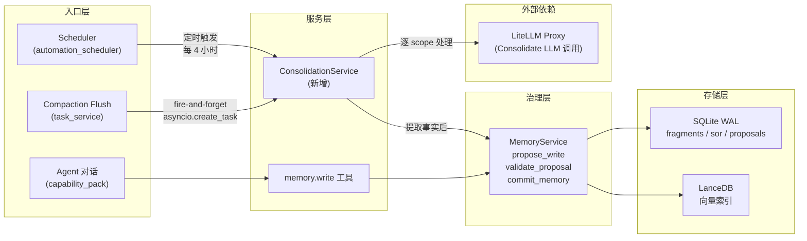
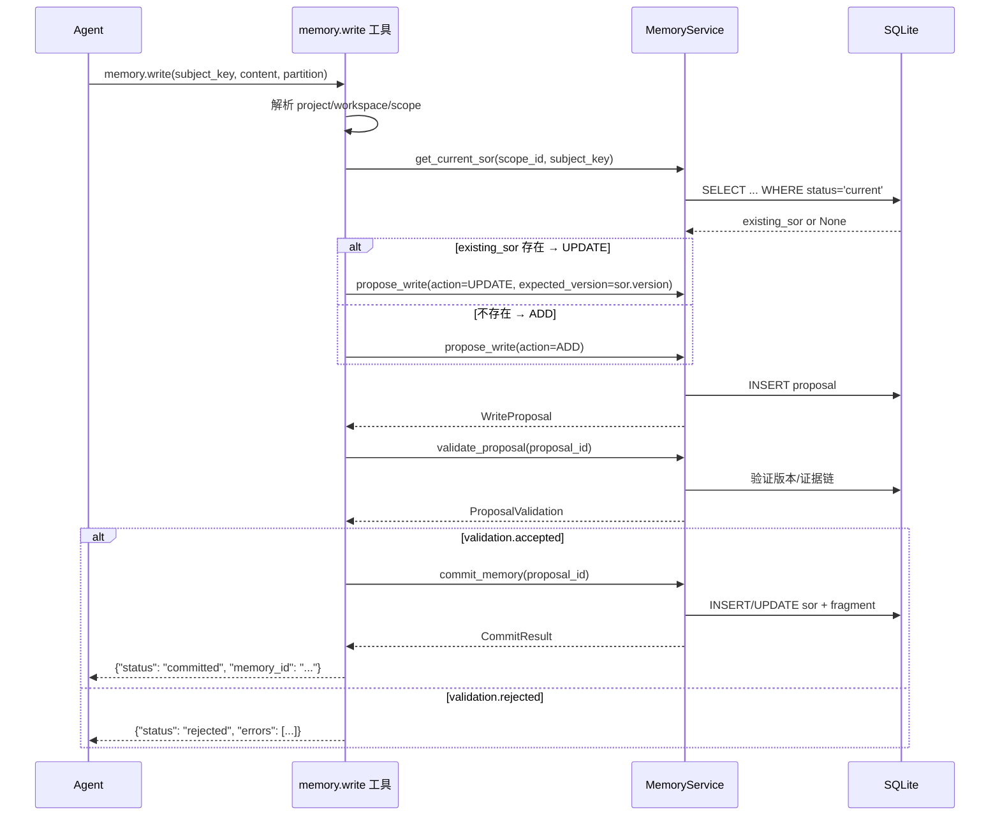
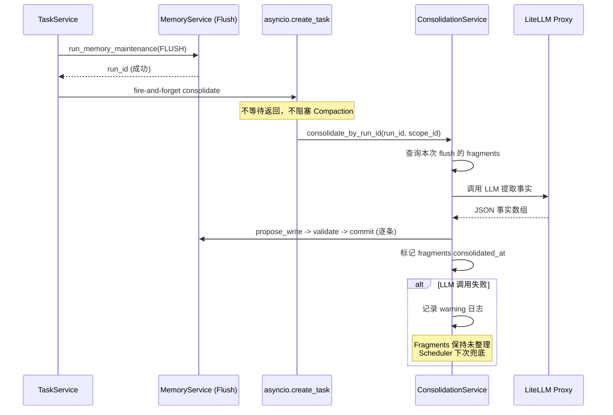

# Implementation Plan: Memory Automation Pipeline

**Branch**: `claude/competent-pike` | **Date**: 2026-03-19 | **Spec**: `spec.md`
**Input**: Feature specification from `.specify/features/065-memory-automation-pipeline/spec.md`
**Scope**: Phase 1 MVP only (US-1, US-2, US-3) -- Phase 2/3 as future extension markers

## Summary

为 OctoAgent Memory 系统构建自动化管线的 Phase 1 最小闭环：

1. **memory.write 工具**（US-1）：在 capability_pack.py 的 memory 工具组中注册新工具，让 Agent 在对话中主动写入记忆，走完整 propose_write -> validate_proposal -> commit_memory 治理流程，直接产出 SoR 记录
2. **Compaction Flush 后自动 Consolidate**（US-2）：在 task_service._persist_compaction_flush() 成功返回 run_id 后，fire-and-forget 启动轻量 Consolidate，仅处理本次 Flush 产出的 Fragment
3. **Scheduler 定期 Consolidate**（US-3）：在 AutomationScheduler 中注册 memory_consolidate 定时作业，默认每 4 小时处理所有积压的未整理 Fragment

核心技术决策：提取 `_consolidate_scope` 为独立的 `ConsolidationService`（CL-004），使三个入口（管理台手动/Flush 即时/Scheduler 定期）共享同一个实现。

## Technical Context

**Language/Version**: Python 3.12+
**Primary Dependencies**: FastAPI, Pydantic, Pydantic AI, APScheduler, structlog, aiosqlite
**Storage**: SQLite WAL (memory tables: fragments, sor, proposals, vault)
**Testing**: pytest + pytest-asyncio
**Target Platform**: macOS (local-first) + Docker
**Project Type**: monorepo (apps/gateway + packages/memory + packages/provider + packages/core)
**Performance Goals**: memory.write < 3 秒端到端；Flush 后 Consolidate < 30 秒（不含 LLM 等待）
**Constraints**: 不阻塞 Compaction 主流程；LLM 不可用时优雅降级
**Scale/Scope**: 单用户 Personal AI OS

## Constitution Check

*GATE: Must pass before implementation. All principles evaluated against Phase 1 design.*

| # | 原则 | 适用性 | 评估 | 说明 |
|---|------|--------|------|------|
| 1 | Durability First | HIGH | PASS | memory.write 通过 propose_write/commit_memory 落盘 SQLite；Scheduler 作业通过 AutomationJob 持久化；Flush 后 Consolidate 失败的 Fragment 保持未整理状态由 Scheduler 兜底 |
| 2 | Everything is an Event | HIGH | PASS | memory.write 产出 WriteProposal + CommitResult 事件链；Consolidate 通过 MemoryMaintenanceRun 记录审计；Scheduler 通过 AutomationJobRun 记录执行 |
| 3 | Tools are Contracts | HIGH | PASS | memory.write 使用 @tool_contract 注册，声明 side_effect_level=REVERSIBLE；参数 schema 与代码签名一致 |
| 4 | Side-effect Two-Phase | HIGH | PASS | memory.write 遵循 propose_write(Plan) -> validate_proposal(Gate) -> commit_memory(Execute) 三阶段治理 |
| 5 | Least Privilege | MEDIUM | PASS | 敏感分区(HEALTH/FINANCE)写入经 validate_proposal 识别 persist_vault 标记；secrets 不进 LLM 上下文 |
| 6 | Degrade Gracefully | HIGH | PASS | LLM 不可用时 Consolidate 降级：Fragment 保持未整理，Scheduler 下次重试；memory.write 本身不依赖 LLM |
| 7 | User-in-Control | MEDIUM | PASS | memory.write 走治理流程，敏感分区可拦截；Scheduler 作业可通过管理台启用/禁用/调整间隔 |
| 8 | Observability | HIGH | PASS | memory.write 产出 memory_committed 结构化日志；Consolidate 产出 MemoryMaintenanceRun 审计记录；Scheduler 产出 AutomationJobRun |
| 9 | 不猜关键配置 | LOW | PASS | memory.write UPDATE 模式内部查询当前 SoR version，不靠 Agent 猜测 |
| 10 | Bias to Action | LOW | N/A | 非 Agent 行为约束，不直接适用 |
| 11 | Context Hygiene | LOW | PASS | memory.write 返回精简 JSON，不把大量内容塞回上下文 |
| 12 | 记忆写入必须治理 | **CRITICAL** | PASS | memory.write 严格走 propose_write -> validate_proposal -> commit_memory，不绕过治理 |
| 13 | 失败必须可解释 | HIGH | PASS | memory.write 返回 validation_errors；Consolidate 记录 errors 到 MaintenanceRun；Scheduler 记录 run status |
| 13A | 优先提供上下文 | MEDIUM | PASS | memory.write 工具描述提供充分指引，让 LLM 自主判断何时写入、如何分区 |
| 14 | A2A 协议兼容 | LOW | N/A | 本 feature 不涉及 A2A 对外交互 |

**结论**: 所有适用原则均 PASS，无 VIOLATION。

## Architecture

### 整体数据流



### memory.write 工具调用序列



### Flush 后自动 Consolidate 触发流程



## Project Structure

### Documentation (this feature)

```text
.specify/features/065-memory-automation-pipeline/
├── plan.md              # 本文件
├── spec.md              # 需求规范
├── data-model.md        # 数据模型（无新增表/字段，仅使用说明）
├── quickstart.md        # 快速上手指南
├── contracts/
│   ├── memory-write-tool.md     # memory.write 工具契约
│   └── consolidation-service.md # ConsolidationService 接口契约
├── checklists/          # 已有
└── research/            # 已有
```

### Source Code (repository root)

```text
octoagent/
├── packages/
│   └── provider/
│       └── src/octoagent/provider/dx/
│           ├── memory_console_service.py    # [MODIFY] 提取 _consolidate_scope 核心逻辑
│           └── consolidation_service.py     # [NEW] 独立 ConsolidationService
│
├── apps/
│   └── gateway/
│       └── src/octoagent/gateway/services/
│           ├── capability_pack.py           # [MODIFY] 新增 memory.write 工具注册
│           ├── task_service.py              # [MODIFY] Flush 后触发异步 Consolidate
│           ├── automation_scheduler.py      # [REFERENCE] 已有，不需修改
│           └── control_plane.py             # [MODIFY] 注册 Consolidate 定时作业初始化
│
│   └── gateway/
│       └── tests/
│           ├── test_memory_write_tool.py    # [NEW] memory.write 工具测试
│           ├── test_consolidation_service.py # [NEW] ConsolidationService 单元测试
│           └── test_auto_consolidate.py     # [NEW] Flush 后自动 Consolidate 集成测试
│
└── packages/
    └── memory/
        └── src/octoagent/memory/
            └── service.py                   # [REFERENCE] 已有治理流程，不需修改
```

**Structure Decision**: 采用现有 monorepo 结构，在 `packages/provider/dx/` 下新增 `consolidation_service.py`，从 `memory_console_service.py` 提取 consolidate 核心逻辑。工具注册在 `apps/gateway/services/capability_pack.py`。不创建新包或新目录。

## Detailed Implementation

### Task 1: ConsolidationService 提取（US-2/US-3 共用基础）

**文件**: `octoagent/packages/provider/src/octoagent/provider/dx/consolidation_service.py` (NEW)

**职责**: 将 `MemoryConsoleService._consolidate_scope` 的核心逻辑提取为独立服务，支持三个入口共享：

- 管理台手动触发（通过 MemoryConsoleService 调用）
- Flush 后即时触发（通过 task_service 调用）
- Scheduler 定时触发（通过 control_plane 调用）

**关键接口**:

```python
class ConsolidationService:
    def __init__(
        self,
        memory_store: SqliteMemoryStore,
        llm_service: LlmService,
        project_root: Path,
    ) -> None: ...

    async def consolidate_scope(
        self,
        *,
        memory: MemoryService,
        scope_id: str,
        model_alias: str = "",
        fragment_filter: Callable[[FragmentRecord], bool] | None = None,
    ) -> ConsolidationScopeResult: ...

    async def consolidate_by_run_id(
        self,
        *,
        memory: MemoryService,
        scope_id: str,
        run_id: str,
        model_alias: str = "",
    ) -> ConsolidationScopeResult: ...

    async def consolidate_all_pending(
        self,
        *,
        memory: MemoryService,
        scope_ids: list[str],
        model_alias: str = "",
    ) -> ConsolidationBatchResult: ...
```

**实现要点**:

1. 从 `MemoryConsoleService._consolidate_scope` 完整迁移 LLM 调用、事实解析、propose/validate/commit 流程
2. `_CONSOLIDATE_SYSTEM_PROMPT` 移至此处
3. `_parse_consolidation_response` 移至此处
4. `MemoryConsoleService.run_consolidate` 改为委托调用 `ConsolidationService.consolidate_all_pending`
5. `consolidate_by_run_id` 用于 Flush 后即时 Consolidate：通过 run_id 查询 flush 关联的 fragments，仅处理这些 fragments
6. `fragment_filter` 参数提供灵活的过滤能力（如按 run_id 过滤）

**数据模型**:

```python
@dataclass(slots=True)
class ConsolidationScopeResult:
    scope_id: str
    consolidated: int
    skipped: int
    errors: list[str]

@dataclass(slots=True)
class ConsolidationBatchResult:
    results: list[ConsolidationScopeResult]
    total_consolidated: int
    total_skipped: int
    all_errors: list[str]
```

### Task 2: memory.write 工具注册（US-1）

**文件**: `octoagent/apps/gateway/src/octoagent/gateway/services/capability_pack.py` (MODIFY)

**插入位置**: 在 `memory.recall` 工具定义之后（约行 2993），`behavior.read_file` 之前

**工具定义**:

```python
@tool_contract(
    name="memory.write",
    side_effect_level=SideEffectLevel.REVERSIBLE,
    tool_profile=ToolProfile.MINIMAL,
    tool_group="memory",
    tags=["memory", "write", "persist"],
    worker_types=["ops", "research", "dev", "general"],
    manifest_ref="builtin://memory.write",
    metadata={
        "entrypoints": ["agent_runtime", "web"],
        "runtime_kinds": ["worker", "subagent", "graph_agent"],
    },
)
async def memory_write(
    subject_key: str,
    content: str,
    partition: str = "work",
    evidence_refs: list[dict[str, str]] | None = None,
    scope_id: str = "",
    project_id: str = "",
    workspace_id: str = "",
) -> str:
    """将重要信息持久化为长期记忆（SoR 记录）。

    当用户透露偏好、事实、决策或其他值得长期记住的信息时，
    调用此工具保存。系统会自动判断是新增还是更新已有记忆。

    Args:
        subject_key: 记忆主题标识，用 `/` 分层（如"用户偏好/编程语言"）
        content: 记忆内容，完整的陈述句
        partition: 业务分区 (core/profile/work/health/finance/chat)，默认 work
        evidence_refs: 证据引用列表 [{"ref_id": "...", "ref_type": "message"}]
        scope_id: 可选，指定 scope
        project_id: 可选，指定 project
        workspace_id: 可选，指定 workspace
    """
```

**实现流程**（详见 contracts/memory-write-tool.md）:

1. 解析 runtime project/workspace/scope context
2. 获取 MemoryService 实例
3. 查询 `get_current_sor(scope_id, subject_key)` 判断 ADD 或 UPDATE
4. 若 UPDATE，取 `existing.version` 作为 `expected_version`
5. 构建 `EvidenceRef` 列表（从 evidence_refs 参数 + 自动追加当前 task_id）
6. 调用 `propose_write` -> `validate_proposal` -> `commit_memory`
7. 返回 JSON 结果

**side_effect_level**: REVERSIBLE -- 记忆可被后续 UPDATE 或 DELETE 覆盖

**敏感分区处理**: `validate_proposal` 已内置 `persist_vault` 检测，HEALTH/FINANCE 分区自动走 Vault 存储。Phase 1 不额外增加审批拦截，依赖现有 validate_proposal 逻辑。

### Task 3: Flush 后异步 Consolidate 触发（US-2）

**文件**: `octoagent/apps/gateway/src/octoagent/gateway/services/task_service.py` (MODIFY)

**修改位置**: `_persist_compaction_flush` 方法，在 `return run.run_id`（行 1894）之前

**实现**:

```python
# --- Flush 后自动 Consolidate (Feature 065) ---
if run.run_id:
    asyncio.create_task(
        self._auto_consolidate_after_flush(
            run_id=run.run_id,
            scope_id=flush_scope_id,
            project=project,
            workspace=workspace,
        )
    )
```

**后台方法**:

```python
async def _auto_consolidate_after_flush(
    self,
    *,
    run_id: str,
    scope_id: str,
    project: Project | None,
    workspace: Workspace | None,
) -> None:
    """Flush 后 fire-and-forget 轻量 Consolidate。"""
    try:
        memory_service = await self._agent_context.get_memory_service(
            project=project,
            workspace=workspace,
        )
        consolidation_service = self._agent_context.get_consolidation_service()
        if consolidation_service is None:
            return

        result = await consolidation_service.consolidate_by_run_id(
            memory=memory_service,
            scope_id=scope_id,
            run_id=run_id,
        )
        log.info(
            "auto_consolidate_after_flush",
            run_id=run_id,
            scope_id=scope_id,
            consolidated=result.consolidated,
            skipped=result.skipped,
        )
    except Exception as exc:
        log.warning(
            "auto_consolidate_after_flush_failed",
            run_id=run_id,
            scope_id=scope_id,
            error_type=type(exc).__name__,
            error=str(exc),
        )
```

**关键约束**:
- 使用 `asyncio.create_task` fire-and-forget，不 await
- 内部捕获所有异常，不让异常逸出影响事件循环
- 失败时 Fragment 保持未整理状态，由 Scheduler 兜底

### Task 4: Scheduler 定期 Consolidate 注册（US-3）

**文件**: `octoagent/apps/gateway/src/octoagent/gateway/services/control_plane.py` (MODIFY)

**方案**: 在系统启动时（ControlPlaneService 初始化流程中）检查是否存在 `memory.consolidate` 类型的 AutomationJob，若不存在则自动创建默认配置。

**默认 AutomationJob 配置**:

```python
AutomationJob(
    job_id="system:memory-consolidate",
    name="Memory Consolidate (定期整理)",
    action_id="memory.consolidate",
    params={},
    schedule_kind=AutomationScheduleKind.CRON,
    schedule_expr="0 */4 * * *",  # 每 4 小时
    timezone="UTC",
    enabled=True,
)
```

**注册时机**: 在 `ControlPlaneService` 的启动流程中（或 `AutomationSchedulerService.startup()` 增强），检查 `automation_store` 中是否已有 `job_id="system:memory-consolidate"` 的作业。若无则创建并持久化。

**已有集成点**: `memory.consolidate` action 已在 control_plane.py 行 3263 注册，`_handle_memory_consolidate` 已实现。Scheduler 通过 `execute_action` 调用此 action，无需额外路由。

**执行流程**:
1. APScheduler 按 cron 触发 `_run_scheduled_job`
2. 创建 `ActionRequestEnvelope` with `action_id="memory.consolidate"`
3. `_handle_memory_consolidate` 调用 `MemoryConsoleService.run_consolidate`
4. `run_consolidate` 委托 `ConsolidationService.consolidate_all_pending`
5. 逐 scope 处理所有未整理 Fragment

### Task 5: MemoryConsoleService 重构（支撑 Task 1）

**文件**: `octoagent/packages/provider/src/octoagent/provider/dx/memory_console_service.py` (MODIFY)

**变更**:

1. 新增 `_consolidation_service: ConsolidationService` 依赖注入
2. `run_consolidate` 方法改为委托调用：
   ```python
   async def run_consolidate(self, ...) -> dict[str, Any]:
       # ... 解析 context 和 scope（保持不变）
       result = await self._consolidation_service.consolidate_all_pending(
           memory=memory,
           scope_ids=context.selected_scope_ids,
           model_alias=model_alias,
       )
       return {
           "consolidated_count": result.total_consolidated,
           "skipped_count": result.total_skipped,
           "errors": result.all_errors,
           "model_alias": model_alias,
           "message": f"已整理 {result.total_consolidated} 条事实"
               if result.total_consolidated
               else "没有可提取的新事实",
       }
   ```
3. 删除 `_consolidate_scope`, `_parse_consolidation_response`, `_CONSOLIDATE_SYSTEM_PROMPT`（移至 ConsolidationService）

### 依赖注入与服务初始化

**ConsolidationService 创建位置**: 在 AgentContext（或 ServiceContainer）中创建并持有 ConsolidationService 实例，使其可被以下组件获取：

- `MemoryConsoleService.__init__` -- 初始化时注入
- `TaskService._auto_consolidate_after_flush` -- 通过 `self._agent_context.get_consolidation_service()` 获取
- Control Plane 的 `_handle_memory_consolidate` -- 间接通过 MemoryConsoleService 使用

**LLM 服务降级**: ConsolidationService 构造时 `llm_service` 可为 None。调用 consolidate 方法时检查，若无 LLM 则立即返回空结果并记录 warning。

## Phase 2/3 Extension Markers

以下为 spec 中 Phase 2/3 的功能，本次实现中不涉及，但在架构设计中预留扩展点：

| 功能 | Phase | 扩展点 |
|------|-------|--------|
| Derived Memory 自动提取 (US-4) | P2 | ConsolidationService.consolidate_scope 返回新增 SoR 列表，后续可接 Derived 提取 pipeline |
| Flush Prompt 优化 (US-5) | P2 | task_service._persist_compaction_flush 中 Flush 前注入 agentic turn |
| Reranker 精排 (US-6) | P2 | memory.recall 已有 rerank_mode 参数，新增 MODEL 模式即可 |
| ToM 推理 (US-7) | P3 | DerivedMemoryRecord 已支持 derived_type 扩展 |
| Temporal Decay + MMR (US-8) | P3 | MemoryRecallHookOptions 已有扩展空间 |
| 用户画像 (US-9) | P3 | 新增 Scheduler 作业 + 专用 prompt |

## Complexity Tracking

> 本计划无 Constitution Check violations，以下为技术选型的复杂度记录。

| 决策 | 为何不用更简方案 | 被拒的简单方案 |
|------|-----------------|---------------|
| 提取 ConsolidationService 为独立类 | 三个入口共享逻辑需解耦管理台上下文 | 直接在 task_service 中复制 _consolidate_scope -- 代码重复且后续维护成本高 |
| memory.write 内部自动查询 version | LLM 管理版本号不可靠 | 暴露 expected_version 给 Agent -- 增加 Agent 认知负担，出错率高 |
| fire-and-forget Consolidate | Flush 后不能阻塞 Compaction 返回 | await Consolidate -- 阻塞 Compaction，超时风险高 |
| Scheduler 默认每 4 小时 | 兼顾及时性和 LLM 成本 | 每小时 -- LLM 调用成本过高；每日 -- Fragment 积压过多 |
