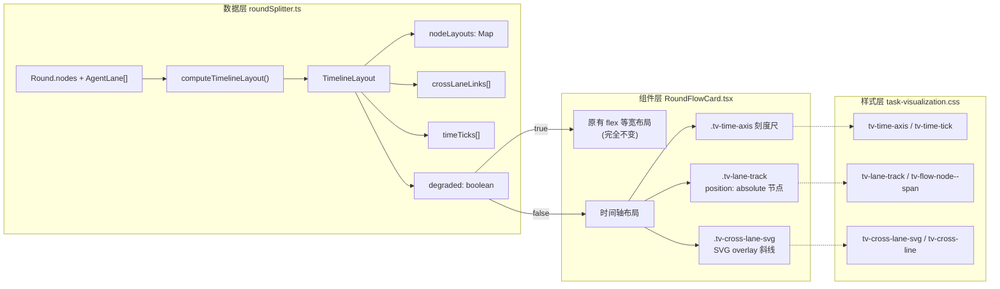

# Implementation Plan: Task 可视化时间轴对齐泳道布局

**Feature ID**: `065-task-timeline-swimlane-layout` | **Date**: 2026-03-19 | **Spec**: `spec.md`
**Input**: 将 Task 可视化的泳道从等宽线性排列改为按时间戳定位的时间轴布局，支持 Worker 节点展宽、跨泳道连接线、统一水平滚动，并在时间数据不足时优雅降级。

---

## Summary

当前 Task 可视化的泳道采用 flexbox 等宽线性排列（每节点 32px 圆 + 16px 连接线），与实际时间无关。本次实现将泳道切换为**时间轴对齐布局**：节点按事件时间戳在横轴定位，Worker 节点展宽为胶囊条反映执行时长，跨泳道 SVG 斜线表示 dispatch/return 调用关系，时间刻度尺提供参照，并在时间数据不足时自动降级为当前等宽布局。

技术方案基于已批准的架构：`roundSplitter.ts` 新增纯函数布局计算层 -> `RoundFlowCard.tsx` 根据 `degraded` 标志切换渲染路径 -> `task-visualization.css` 新增时间轴相关样式类。

---

## Technical Context

**Language/Version**: TypeScript 5.x (React 18, Vite)
**Primary Dependencies**: React 18, 无新增外部依赖（纯 CSS + 原生 SVG）
**Storage**: N/A（纯前端布局计算，数据来自已有 TaskEvent/Round）
**Testing**: TypeScript 编译检查 (`npx tsc --noEmit`) + 手动验证
**Target Platform**: Web (Chrome/Firefox/Safari, 桌面端优先)
**Project Type**: web (frontend 子项目)
**Performance Goals**: 布局计算 < 5ms（典型 50 节点场景）；滚动 60fps
**Constraints**: 总宽度上限 8000px；最小节点宽度 48px；SVG overlay 不阻挡节点交互
**Scale/Scope**: 典型场景 2-6 个泳道，5-50 个节点/轮次

---

## Constitution Check

*GATE: 前端纯展示层变更，不涉及后端事件存储/任务状态/安全策略。*

| 原则 | 适用性 | 评估 | 说明 |
|------|--------|------|------|
| C1 Durability First | 不适用 | PASS | 纯前端渲染层，无持久化变更 |
| C2 Everything is Event | 不适用 | PASS | 读取已有事件流，不修改事件系统 |
| C3 Tools are Contracts | 不适用 | PASS | 不涉及工具层 |
| C4 Two-Phase Side-effect | 不适用 | PASS | 无副作用操作 |
| C5 Least Privilege | 不适用 | PASS | 不涉及 secrets |
| C6 Degrade Gracefully | **适用** | **PASS** | FR-005/FR-006 明确要求降级机制：有效时间戳 < 2 或时间范围 = 0 时回退等宽布局 |
| C7 User-in-Control | 不适用 | PASS | 纯展示功能，不涉及审批/门禁 |
| C8 Observability | **适用** | **PASS** | 本功能本身就是增强可观测性——让用户可视化看到时间维度的步骤关系 |
| C13 失败可解释 | **适用** | **PASS** | 降级路径有明确标志 (`degraded: true`)，UI 行为可预测 |
| C13A 优先上下文 | 不适用 | PASS | 前端展示层，不涉及 Agent 行为策略 |

**结论**: 无 VIOLATION，通过 Constitution Check。

---

## Architecture



---

## Project Structure

### Documentation (this feature)

```text
.specify/features/065-task-timeline-swimlane-layout/
├── plan.md              # 本文件
├── research.md          # 技术决策研究
├── data-model.md        # 数据模型（TypeScript 接口）
├── contracts/
│   └── timeline-layout-api.md  # 布局计算函数契约
├── quickstart.md        # 快速上手指南
└── spec.md              # 功能规范
```

### Source Code (变更文件)

```text
octoagent/frontend/src/
├── utils/
│   └── roundSplitter.ts           # [修改] 新增 ~150 行布局计算函数
├── components/TaskVisualization/
│   ├── RoundFlowCard.tsx           # [修改] 条件渲染双路径 + SVG overlay
│   └── task-visualization.css      # [修改] 新增 ~80 行时间轴样式
```

**Structure Decision**: 本功能不新增文件，仅修改现有 3 个文件。布局计算逻辑放在 `roundSplitter.ts` 是因为它已经是泳道数据处理的聚合点（`groupByAgent`、`FlowNode`、`AgentLane` 均在此），时间轴布局是其自然延伸。

---

## Implementation Phases

### Phase 1: 数据层 -- 时间轴布局计算 (P1 核心)

**目标**: 在 `roundSplitter.ts` 中新增纯函数，接收 `AgentLane[]` 和时间范围，输出 `TimelineLayout`。

**涉及文件**:
- `octoagent/frontend/src/utils/roundSplitter.ts`

**任务清单**:

1. **T1.1** 定义 TypeScript 接口
   - `TimelineLayout`: `{ totalWidthPx, nodeLayouts, crossLaneLinks, timeTicks, degraded }`
   - `NodeLayout`: `{ leftPx, widthPx, laneIndex }`
   - `CrossLaneLink`: `{ fromLane, fromNodeId, toLane, toNodeId, type: 'dispatch' | 'return' }`
   - `TimeTick`: `{ label, leftPx }`

2. **T1.2** 实现 `computeTimelineLayout(lanes: AgentLane[], startTime: string, endTime?: string): TimelineLayout`
   - 解析所有节点的 `ts` 字段为毫秒时间戳
   - 统计有效时间戳数量：`< 2` 或时间范围 `= 0` 时返回 `buildDegradedLayout(lanes)`
   - 计算缩放因子: `scale = PX_PER_SECOND(12)`，受 `maxTotalPx(8000)` 约束
   - 每个节点: `leftPx = padding + (nodeTs - tMin) * scale`
   - Worker 类型节点: `widthPx = max(durationMs / 1000 * scale, 48)`
   - 防重叠修正: 遍历同一泳道节点，若 `nextLeft < prevLeft + prevWidth + minGap(8)`，则 `nextLeft = prevLeft + prevWidth + minGap`

3. **T1.3** 实现 `buildDegradedLayout(lanes: AgentLane[]): TimelineLayout`
   - 返回 `degraded: true`，其余字段为空 Map/空数组
   - 组件层据此走原有 flex 渲染路径

4. **T1.4** 实现 `buildCrossLaneLinks(lanes: AgentLane[], nodeLayouts: Map): CrossLaneLink[]`
   - 遍历所有泳道找 `kind === 'worker'` 的节点（在 Orchestrator 泳道中）
   - 根据节点的 agent 名称匹配对应的 Worker 泳道
   - 生成 dispatch 连接: Orchestrator.worker 节点 -> Worker 泳道首个节点
   - 生成 return 连接: Worker 泳道末个节点 -> Orchestrator.worker 节点（右端）

5. **T1.5** 实现 `generateTimeTicks(tMin: number, tMax: number, scale: number): TimeTick[]`
   - 根据时间跨度自动选择刻度间隔: `<=5s -> 1s`, `<=30s -> 5s`, `<=3min -> 30s`, `>3min -> 1min`
   - 生成刻度标记: `{ label: "+0s" / "+5s" / "+1m30s", leftPx }`

6. **T1.6** 混合时间戳处理
   - 有效时间戳 `>= 2` 但部分节点缺失时间戳
   - 缺失节点在前后有效节点之间均匀分布（线性插值）

**依赖**: 无，纯函数，可独立开发和测试。

---

### Phase 2: 组件层 -- 条件渲染双路径 (P1 核心)

**目标**: `RoundFlowCard.tsx` 调用布局计算，根据 `degraded` 切换渲染。

**涉及文件**:
- `octoagent/frontend/src/components/TaskVisualization/RoundFlowCard.tsx`

**前置依赖**: Phase 1 完成。

**任务清单**:

1. **T2.1** 在组件中调用布局计算
   ```
   const layout = useMemo(
     () => computeTimelineLayout(lanes, round.startTime, round.endTime),
     [lanes, round.startTime, round.endTime]
   );
   ```

2. **T2.2** 降级路径 (`layout.degraded === true`)
   - 保留当前 `tv-lanes` > `tv-lane` > `tv-lane-flow-scroll` > `tv-lane-flow`(flex) 的完整 JSX
   - 不做任何改动，确保旧数据行为完全不变

3. **T2.3** 时间轴路径 (`layout.degraded === false`)
   - 外层: `div.tv-timeline-container` > `div.tv-lanes-scroll`（统一水平滚动容器）
   - 刻度尺: `div.tv-time-axis`，渲染 `layout.timeTicks` 为 `span.tv-time-tick`（absolute 定位）
   - 泳道标签: 保持原有 `div.tv-lane-label` 不变
   - 泳道轨道: `div.tv-lane-track`（`position: relative; width: ${layout.totalWidthPx}px`）
     - 节点: 复用现有 `button.tv-flow-node`，追加 `style={{ position: 'absolute', left: nl.leftPx }}`
     - Worker 展宽节点: 追加 class `tv-flow-node--span`，覆盖 `width: ${nl.widthPx}px`
   - 连接线: 泳道内相邻节点不再用 `tv-flow-connector`（时间轴模式下间距由 absolute 定位保证）

4. **T2.4** Worker 展宽节点渲染
   - 当 `nl.widthPx > 48` 时，节点圆改为胶囊条：
     - 外层 `button.tv-flow-node.tv-flow-node--span`
     - 内部 `div.tv-flow-node-bar`（pill-shaped container），内含图标 + 标签
   - 当 `nl.widthPx <= 48` 时（短时长 Worker），保持普通圆形节点

5. **T2.5** SVG overlay 渲染跨泳道连接线
   - `svg.tv-cross-lane-svg`（absolute 覆盖整个泳道区域，`pointer-events: none`）
   - 遍历 `layout.crossLaneLinks`，渲染 `<line>` 元素
   - dispatch 线: 从 Orchestrator 的 Worker 节点左边缘 -> Worker 泳道首节点中心
   - return 线: 从 Worker 泳道末节点中心 -> Orchestrator 的 Worker 节点右边缘
   - 需要根据 `laneIndex` 计算 Y 坐标（泳道高度 52px + gap 4px）

6. **T2.6** 保持节点交互功能
   - `onNodeClick` 回调在时间轴模式和降级模式下均正常触发
   - 泳道折叠/展开（`shouldCollapse` 逻辑）在时间轴模式下正常工作

---

### Phase 3: 样式层 -- 时间轴 CSS (P1 核心)

**目标**: 新增时间轴布局相关 CSS 类。

**涉及文件**:
- `octoagent/frontend/src/components/TaskVisualization/task-visualization.css`

**前置依赖**: Phase 2 完成（需确认 class 名称和 DOM 结构）。

**任务清单**:

1. **T3.1** 统一滚动容器
   ```css
   .tv-timeline-container { position: relative; }
   .tv-lanes-scroll {
     overflow-x: auto;
     -webkit-overflow-scrolling: touch;
   }
   ```

2. **T3.2** 时间刻度尺
   ```css
   .tv-time-axis {
     position: relative;
     height: 24px;
     border-bottom: 1px solid var(--cp-border);
     margin-left: calc(110px + var(--cp-space-3)); /* 对齐泳道标签后的内容区 */
   }
   .tv-time-tick {
     position: absolute;
     top: 0;
     font-size: 10px;
     color: var(--cp-muted);
     transform: translateX(-50%);
     white-space: nowrap;
   }
   ```

3. **T3.3** 泳道轨道
   ```css
   .tv-lane-track {
     position: relative;
     min-height: 52px;
   }
   /* 时间轴模式下节点用 absolute 定位 */
   .tv-lane-track .tv-flow-node {
     position: absolute;
     top: 4px; /* 垂直居中微调 */
   }
   ```

4. **T3.4** Worker 展宽胶囊条
   ```css
   .tv-flow-node--span {
     flex-direction: row;
     gap: 6px;
   }
   .tv-flow-node-bar {
     display: flex;
     align-items: center;
     gap: 6px;
     height: 32px;
     border-radius: 16px; /* pill shape */
     padding: 0 12px;
     background: var(--cp-success-soft);
     width: 100%;
   }
   .tv-flow-node--span .tv-flow-node-text {
     max-width: none; /* 展宽后文字不截断 */
   }
   ```

5. **T3.5** SVG 跨泳道斜线
   ```css
   .tv-cross-lane-svg {
     position: absolute;
     top: 0;
     left: 0;
     width: 100%;
     height: 100%;
     pointer-events: none;
     z-index: 10;
   }
   .tv-cross-line--dispatch {
     stroke: var(--cp-primary);
     stroke-width: 1.5;
     stroke-dasharray: 6 3;
     opacity: 0.7;
   }
   .tv-cross-line--return {
     stroke: var(--cp-success);
     stroke-width: 1.5;
     stroke-dasharray: 6 3;
     opacity: 0.7;
   }
   ```

---

### Phase 4: 时间刻度尺 (P2 增强)

**目标**: 完善时间刻度尺的自适应间隔和格式化。

**涉及文件**:
- `octoagent/frontend/src/utils/roundSplitter.ts`（`generateTimeTicks` 函数）
- `octoagent/frontend/src/components/TaskVisualization/RoundFlowCard.tsx`（渲染刻度尺）

**前置依赖**: Phase 1-3 基础完成。

**任务清单**:

1. **T4.1** 细化 `generateTimeTicks` 的间隔选择逻辑
   - 时长 <= 5s: 间隔 1s
   - 时长 <= 30s: 间隔 5s
   - 时长 <= 3min: 间隔 30s
   - 时长 > 3min: 间隔 1min
   - 标签格式: `+0s`, `+5s`, `+1m`, `+1m30s`

2. **T4.2** 降级模式下隐藏刻度尺
   - `layout.degraded === true` 时不渲染 `.tv-time-axis`

---

### Phase 5: 跨泳道斜线连接 (P2 增强)

**目标**: 完善跨泳道连接线的坐标计算和视觉表现。

**涉及文件**:
- `octoagent/frontend/src/utils/roundSplitter.ts`（`buildCrossLaneLinks`）
- `octoagent/frontend/src/components/TaskVisualization/RoundFlowCard.tsx`（SVG 渲染）

**前置依赖**: Phase 1-3 基础完成。

**任务清单**:

1. **T5.1** 精确计算 SVG 线段坐标
   - X: 基于 `nodeLayouts` 中的 `leftPx` 和 `widthPx`
   - Y: 基于泳道索引 * (laneHeight + gap) + 泳道高度/2（中心线）
   - 需要考虑泳道标签区偏移（110px + gap）

2. **T5.2** 单泳道场景安全跳过
   - 当只有 Orchestrator 泳道时，`buildCrossLaneLinks` 返回空数组
   - SVG overlay 不渲染

3. **T5.3** 视觉区分
   - dispatch: `stroke: var(--cp-primary)`, `stroke-dasharray: 6 3`
   - return: `stroke: var(--cp-success)`, `stroke-dasharray: 6 3`

---

## Dependency Graph

```
Phase 1 (数据层)
    │
    ├──> Phase 2 (组件层) ──> Phase 3 (样式层)
    │                              │
    │                              ├──> Phase 4 (刻度尺, P2)
    │                              └──> Phase 5 (斜线, P2)
    │
    └──> 验证
```

**关键路径**: Phase 1 -> Phase 2 -> Phase 3 -> 验证

Phase 4 和 Phase 5 是 P2 增强，可在 P1 核心验证通过后并行实施。

---

## Verification Strategy

### 编译验证

- **V-001**: `npx tsc --noEmit` 无错误通过（SC-005）

### 功能验证 -- 时间轴模式

- **V-002**: 新任务（Orchestrator + Worker，事件均有时间戳）
  - 泳道节点按时间横轴对齐，同时刻事件垂直对齐（SC-001）
  - Worker 节点展宽为胶囊条，宽度与执行时长成比例（SC-002）
  - 水平滚动流畅，泳道同步对齐，无双滚动条（SC-004）

### 功能验证 -- 降级模式

- **V-003**: 旧任务（事件无有效时间戳或时间戳 < 2 个）
  - 渲染结果与改动前完全一致（SC-003）
  - 节点点击弹框正常（FR-013）

### 功能验证 -- 跨泳道连接 (P2)

- **V-004**: 斜线从 Orchestrator 的 Worker 节点连向 Worker 泳道
  - dispatch 线和 return 线颜色不同
  - SVG 层不阻挡节点点击（`pointer-events: none`）

### Edge Case 验证

- **V-005**: 所有节点时间戳完全相同 -> 降级为等宽布局（不除以零）
- **V-006**: 极长任务（> 10 分钟） -> 总宽度不超过 8000px
- **V-007**: 单泳道任务（仅 Orchestrator） -> 无斜线，时间轴布局正常
- **V-008**: 节点时间间隔极短（< 1s） -> 防重叠修正生效，节点可分别点击
- **V-009**: 浏览器窗口窄于内容 -> 滚动条正确，无泳道错位

---

## Complexity Tracking

> 本功能无 Constitution violation，以下记录关键设计决策的复杂度取舍。

| 决策 | 选择 | 更简单的替代方案 | 为何拒绝更简单方案 |
|------|------|------------------|-------------------|
| 布局计算放在 roundSplitter.ts | 与现有数据层同文件 | 新建独立文件 timelineLayout.ts | 布局计算强依赖 FlowNode/AgentLane 类型和 groupByAgent 输出，同文件减少导入链且 ~150 行增量可控 |
| SVG overlay 画跨泳道斜线 | 单层 SVG + pointer-events:none | Canvas / DOM 元素 | SVG 天然支持斜线/虚线，典型 2-6 条线性能无压力，CSS 可控样式 |
| 线性时间映射 + 防重叠 | 直接线性缩放 + 后处理推移 | 对数映射 / 分段映射 | 线性最直觉，防重叠后处理简单有效，极端场景由 maxTotalPx 兜底 |
| 双路径渲染（flex vs absolute） | 降级走原 flex，时间轴走 absolute | 统一用 absolute + 等间距 | 降级路径必须 100% 与改动前一致（SC-003），最安全的方式是完全保留原有 JSX |

---

## Risk Assessment

| 风险 | 影响 | 缓解策略 |
|------|------|----------|
| 时间戳精度不够（秒级而非毫秒级） | 相近事件重叠 | 防重叠修正 + 最小间距 8px |
| 泳道 Y 坐标计算与实际 DOM 高度不匹配 | SVG 斜线错位 | Phase 5 中使用 ref 读取实际泳道高度 |
| 大量节点（>50/泳道）时布局计算耗时 | 卡顿 | useMemo 缓存 + maxTotalPx 限制节点密度 |
| 泳道折叠与时间轴布局的交互 | 折叠后斜线目标消失 | 折叠时跳过已折叠泳道的斜线 |
