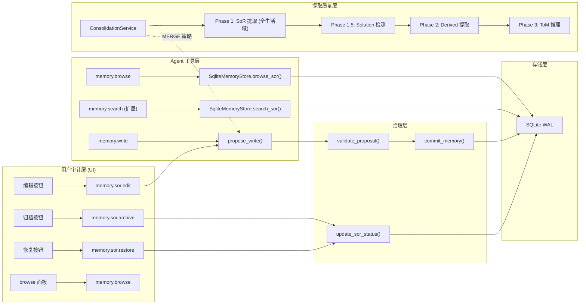
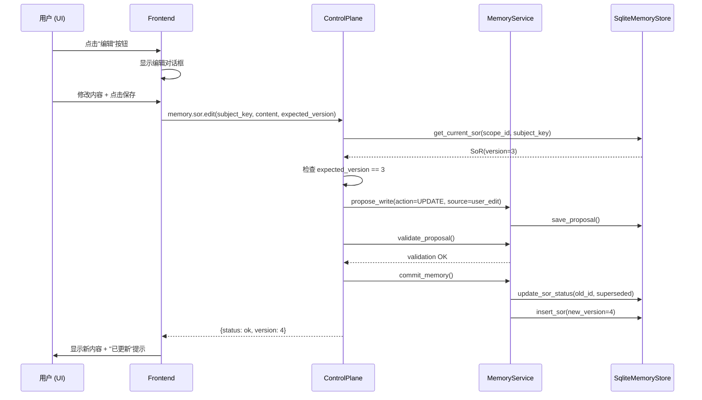
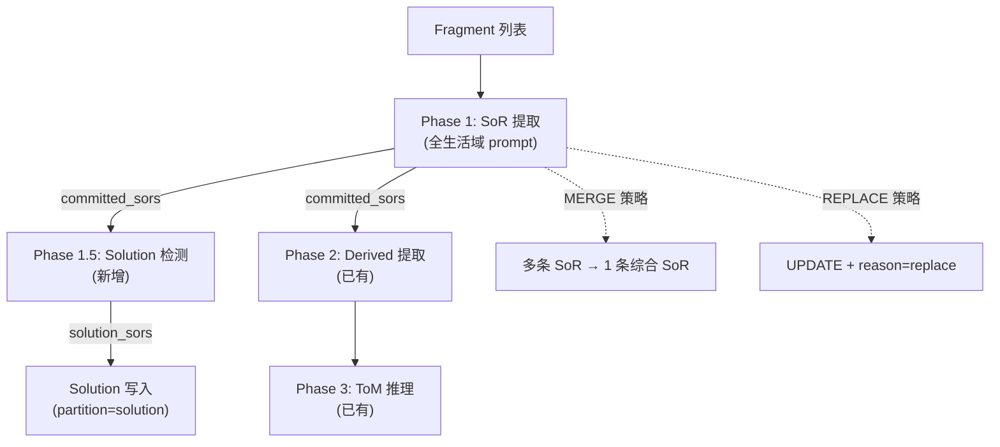

# Implementation Plan: Memory 提取质量、索引利用与审计优化

**Branch**: `claude/competent-pike` | **Date**: 2026-03-19 | **Spec**: `spec.md`
**Input**: Feature specification from `.specify/features/066-memory-quality-indexing-audit/spec.md`
**Research**: `research/tech-research.md`（方案 A 增量式扩展）

---

## Summary

基于 spec.md 定义的 8 个 User Stories（P1x4 + P2x3 + P3x1），在现有 Memory 系统上增量式扩展三个维度的能力：

1. **索引利用**（Story 1, 7）：新增 `memory.browse` 工具 + 扩展 `memory.search` 结构化筛选参数，让 Agent 从"只能搜"升级为"能浏览 + 能精确筛选"
2. **审计机制**（Story 2, 3）：新增 SoR 编辑/归档/恢复能力，走 propose-validate-commit 治理流程，前端 Memory UI 补齐操作按钮和"已归档"视图
3. **提取质量**（Story 4, 5, 6, 8）：扩展 Consolidation prompt 覆盖全生活域、新增 Solution 检测阶段、支持 MERGE 策略、提升 Profile 信息密度

技术方案采用调研推荐的**方案 A（增量式扩展）**：不引入新外部依赖，复用现有 Store/Proposal/Event 基础设施，所有变更向后兼容。

---

## Technical Context

**Language/Version**: Python 3.12+ (backend), TypeScript/React (frontend)
**Primary Dependencies**: FastAPI, Pydantic, SQLite WAL, LanceDB, structlog, Logfire
**Storage**: SQLite WAL（结构化数据） + LanceDB（向量检索）
**Testing**: pytest（单元 + 集成）, vitest（前端）
**Target Platform**: macOS 单机部署（本地优先）
**Project Type**: Web application (FastAPI backend + React frontend)
**Performance Goals**: browse/search 响应 < 200ms，编辑/归档操作 < 2s
**Constraints**: 向后兼容，不引入新外部依赖，不改变现有工具语义
**Scale/Scope**: 单用户，记忆条目 < 10k

---

## Constitution Check

*GATE: Must pass before Phase 0 research. Re-check after Phase 1 design.*

| # | 原则 | 适用性 | 评估 | 说明 |
|---|------|--------|------|------|
| 1 | Durability First | 适用 | PASS | SoR 编辑/归档不做物理删除，superseded 版本永久保留。browse 查询基于 SQLite 持久化数据 |
| 2 | Everything is an Event | 适用 | PASS | 所有审计操作（编辑/归档/恢复）通过 Proposal 流程生成事件记录；Solution 提取生成 consolidation 事件 |
| 3 | Tools are Contracts | 适用 | PASS | 新增 `memory.browse` 遵循 `tool_contract` 装饰器规范，schema 与签名一致。browse 副作用等级 = none |
| 4 | Side-effect Must be Two-Phase | 适用 | PASS | SoR 编辑走 propose → validate → commit 三步流程（source=user_edit）。归档通过 `update_sor_status` + 事件记录 |
| 5 | Least Privilege by Default | 适用 | PASS | Vault 层记忆（HEALTH/FINANCE）的编辑/归档需要额外授权确认 |
| 6 | Degrade Gracefully | 适用 | PASS | browse 纯 SQLite 查询，不依赖向量后端。LanceDB 不可用时 browse 正常工作 |
| 7 | User-in-Control | 适用 | PASS | 用户可通过 UI 编辑/归档/恢复记忆。归档需二次确认。编辑走乐观锁防止静默覆盖 |
| 8 | Observability is a Feature | 适用 | PASS | 编辑/归档/恢复操作生成审计日志，用户可在 Memory 操作历史中追溯 |
| 9 | 不猜关键配置 | 不适用 | N/A | 本 feature 不涉及外部系统配置 |
| 10 | Bias to Action | 不适用 | N/A | 本 feature 不涉及 Agent 行为策略变更 |
| 11 | Context Hygiene | 适用 | PASS | browse 返回摘要（content 前 100 字符），不将完整记忆内容塞进上下文 |
| 12 | 记忆写入必须治理 | 适用 | PASS | 用户编辑走 WriteProposal 流程，不直接写入 SoR。MERGE/REPLACE 同样走 Proposal |
| 13 | 失败必须可解释 | 适用 | PASS | 版本冲突返回 VERSION_CONFLICT 错误码 + 明确提示。Solution 匹配设置阈值 |
| 13A | 优先提供上下文 | 适用 | PASS | Consolidation 扩展通过 prompt 指令（全生活域维度）引导，不硬编码分类逻辑 |
| 14 | A2A 协议兼容 | 不适用 | N/A | Memory 操作不涉及 A2A 协议 |

**Constitution Check 结果**: 全部 PASS，无 VIOLATION。

---

## Project Structure

### Documentation (this feature)

```text
.specify/features/066-memory-quality-indexing-audit/
├── plan.md                        # 本文件
├── spec.md                        # 需求规范
├── research.md                    # 技术决策研究（11 个决策）
├── data-model.md                  # 数据模型变更
├── quickstart.md                  # 快速上手指南
├── contracts/
│   ├── agent-tools.md             # Agent 工具契约（browse 新增 + search 扩展）
│   └── control-plane-actions.md   # Control Plane action 契约（edit/archive/restore/browse）
├── research/
│   └── tech-research.md           # 前序技术调研
└── checklists/
    └── ...
```

### Source Code (repository root)

```text
octoagent/
  packages/
    memory/
      src/octoagent/memory/
        enums.py                   # 枚举变更：+ARCHIVED, +SOLUTION, +MERGE
        models/
          sor.py                   # 无结构变更（枚举自动生效）
          proposal.py              # 无结构变更（metadata 约定）
          browse.py                # 新增：BrowseItem, BrowseGroup, BrowseResult
        store/
          protocols.py             # 新增 browse_sor 签名，扩展 search_sor 签名
          memory_store.py          # 实现 browse_sor，扩展 search_sor
      tests/
        test_memory_store.py       # browse + search 扩展测试
        test_enums.py              # 新枚举值测试
  packages/
    provider/
      src/octoagent/provider/dx/
        consolidation_service.py   # prompt 扩展 + solution 检测阶段 + MERGE 策略
        profile_generator_service.py # prompt 放宽信息密度限制
        memory_console_service.py  # 新增 browse 查询方法
  packages/
    core/
      src/octoagent/core/models/
        control_plane.py           # 新增 MemorySorEditRequest 等模型
  apps/
    gateway/
      src/octoagent/gateway/services/
        capability_pack.py         # 新增 memory_browse 工具 + 扩展 memory_search 参数
        control_plane.py           # 新增 sor.edit/archive/restore/browse action handler
  frontend/
    src/domains/memory/
      MemoryDetailModal.tsx        # 新增"编辑"/"归档"按钮
      MemoryResultsSection.tsx     # 新增"已归档"筛选标签
      MemoryEditDialog.tsx         # 新增：编辑对话框组件
      MemoryFiltersSection.tsx     # 新增 status 筛选选项
```

**Structure Decision**: Web application 结构，backend（Python packages + apps）和 frontend（React）分离。所有变更在现有目录结构内，不新增顶层目录。

---

## Architecture

### 整体数据流



### 编辑流程序列



### Consolidation Pipeline 扩展



---

## Implementation Phases

### Phase A: 数据模型与枚举扩展 (P1 基础)

**涉及 Story**: 全部（基础设施）
**范围**: 枚举变更 + 数据模型 + 存储层方法

1. `enums.py` 新增 `SorStatus.ARCHIVED`、`MemoryPartition.SOLUTION`、`WriteAction.MERGE`
2. `models/browse.py` 新增 `BrowseItem`/`BrowseGroup`/`BrowseResult`
3. `memory_store.py` 实现 `browse_sor()` 方法（SQLite GROUP BY 查询）
4. `memory_store.py` 扩展 `search_sor()` 新增可选参数
5. `protocols.py` 更新 Protocol 签名
6. 确认/新增 SQLite 索引：`scope_id + partition + status`、`scope_id + subject_key`
7. 单元测试：枚举值、browse_sor、search_sor 扩展参数

### Phase B: Agent 工具层 (Story 1, 7)

**涉及 Story**: 1 (browse), 7 (search 扩展)
**范围**: capability_pack.py 工具注册

1. 新增 `memory_browse` 工具函数，调用 `MemoryConsoleService.browse_memory()`
2. 扩展 `memory_search` 工具函数参数（`derived_type`, `status`, `updated_after`, `updated_before`）
3. `MemoryConsoleService` 新增 `browse_memory()` 方法
4. 工具 contract 测试：schema 一致性
5. 集成测试：browse 返回分组、search 新参数过滤

### Phase C: 审计机制——后端 (Story 2, 3)

**涉及 Story**: 2 (编辑), 3 (归档/恢复)
**范围**: Control Plane action + 审计事件

1. `control_plane.py` 新增 `_handle_memory_sor_edit()` handler
2. `control_plane.py` 新增 `_handle_memory_sor_archive()` handler
3. `control_plane.py` 新增 `_handle_memory_sor_restore()` handler
4. `control_plane.py` 新增 `_handle_memory_browse()` handler
5. Action 定义注册（`_build_action_definitions()`）
6. 乐观锁实现：编辑/归档前检查 `expected_version`
7. Vault 层记忆的额外授权检查（`SENSITIVE_PARTITIONS`）
8. 审计事件生成（操作人、时间、变更摘要）
9. 单元/集成测试：编辑流程、归档流程、版本冲突、Vault 授权

### Phase D: 审计机制——前端 (Story 2, 3)

**涉及 Story**: 2 (编辑 UI), 3 (归档/恢复 UI)
**范围**: React 组件

1. `MemoryDetailModal.tsx` 新增"编辑"和"归档"操作按钮
2. 新增 `MemoryEditDialog.tsx` 编辑对话框组件（inline 编辑 content + subject_key）
3. 归档操作：二次确认对话框
4. `MemoryFiltersSection.tsx` 新增 status 筛选选项（current / archived / all）
5. `MemoryResultsSection.tsx` 支持"已归档"筛选标签
6. 恢复操作：在"已归档"视图中显示"恢复"按钮
7. 乐观锁冲突处理：前端显示"版本冲突，请刷新"提示
8. 版本历史对比视图（可选增强）

### Phase E: 提取质量——Consolidation 扩展 (Story 4, 6)

**涉及 Story**: 4 (全生活域), 6 (MERGE/REPLACE 策略)
**范围**: consolidation_service.py prompt + 策略逻辑

1. 扩展 `_CONSOLIDATE_SYSTEM_PROMPT` 覆盖全生活域提取维度
2. 在 prompt 中添加主体归因规则（A 提到 B 的信息 → 归因到 B）
3. LLM 输出 JSON 格式扩展：新增 `action` 字段（`"add"` / `"update"` / `"merge"` / `"replace"`）
4. MERGE 执行逻辑：批量 supersede 源 SoR + 创建综合 SoR + evidence_refs 指向所有原始
5. REPLACE 执行逻辑：复用 UPDATE 流程 + `metadata.reason = "replace"`
6. 回退安全：LLM 未输出 action 时默认为 `add`/`update`（现有行为）
7. 测试：全生活域提取、主体归因、MERGE 策略、REPLACE 策略

### Phase F: Solution 记忆 (Story 5)

**涉及 Story**: 5 (Solution 提取与自动匹配)
**范围**: 新增 Solution 检测阶段 + 自动匹配

1. `consolidation_service.py` 新增 Phase 1.5：Solution 检测阶段
2. Solution 检测 prompt：从 committed_sors 中识别 problem-solution 模式
3. Solution SoR 写入：`partition=SOLUTION`，content 包含结构化的 problem + solution
4. 自动匹配：在 Agent 遇到工具执行错误时，自动搜索 `partition=solution` 的匹配记忆
5. 匹配阈值：相似度 < 0.7 不注入
6. 匹配结果注入 Agent 下一轮上下文（通过 recall frame 扩展）
7. 测试：Solution 提取、自动匹配触发、阈值过滤

### Phase G: Profile 信息密度 (Story 8)

**涉及 Story**: 8 (Profile 密度提升)
**范围**: profile_generator_service.py prompt

1. 修改 `_PROFILE_SYSTEM_PROMPT`：将"1-3 句话"改为"多段详细描述"
2. 更新规则：允许每个维度输出多段落，覆盖子维度
3. 保持输出 JSON 格式不变（`string | null`）
4. 测试：生成的 Profile 信息密度验证

---

## 各 Phase 与 Story/FR 映射

| Phase | Story | Priority | 涉及 FR |
|-------|-------|----------|---------|
| A | 全部 | P1 | 基础设施 |
| B | 1, 7 | P1, P2 | FR-001~005 |
| C | 2, 3 | P1 | FR-006~013, FR-023~026 |
| D | 2, 3 | P1 | FR-010~012 |
| E | 4, 6 | P1, P2 | FR-014~018 |
| F | 5 | P2 | FR-019~021 |
| G | 8 | P3 | FR-022 |

---

## 实现顺序与依赖关系

```
Phase A (数据模型)
  ├── Phase B (Agent 工具) — 依赖 A 的 browse_sor + search_sor 扩展
  ├── Phase C (审计后端) — 依赖 A 的 ARCHIVED 枚举
  │     └── Phase D (审计前端) — 依赖 C 的 action handler
  ├── Phase E (Consolidation) — 依赖 A 的 MERGE 枚举 + SOLUTION 分区
  │     └── Phase F (Solution) — 依赖 E 的全生活域 prompt
  └── Phase G (Profile) — 独立，仅依赖 A 基础设施
```

建议实施顺序：A → B + C 并行 → D → E → F → G

---

## Complexity Tracking

> 无 Constitution Check violation，无需额外复杂度论证。

| 设计选择 | 为何不用更简单的方案 | 简单方案被拒原因 |
|----------|---------------------|------------------|
| 编辑走 Proposal 流程 | 直接 UPDATE SoR 更简单 | 违反 Constitution 原则 4 和 12 |
| MERGE 作为独立 WriteAction | 复用 UPDATE + metadata | 丢失 N:1 vs 1:1 的语义精确性，审计链无法区分 |
| ARCHIVED 作为独立状态 | 复用 DELETED + metadata | 混淆可恢复/不可恢复语义 |
| browse 纯 SQLite 查询 | 经过向量后端 | browse 不需要语义匹配，且违反"Degrade Gracefully" |
