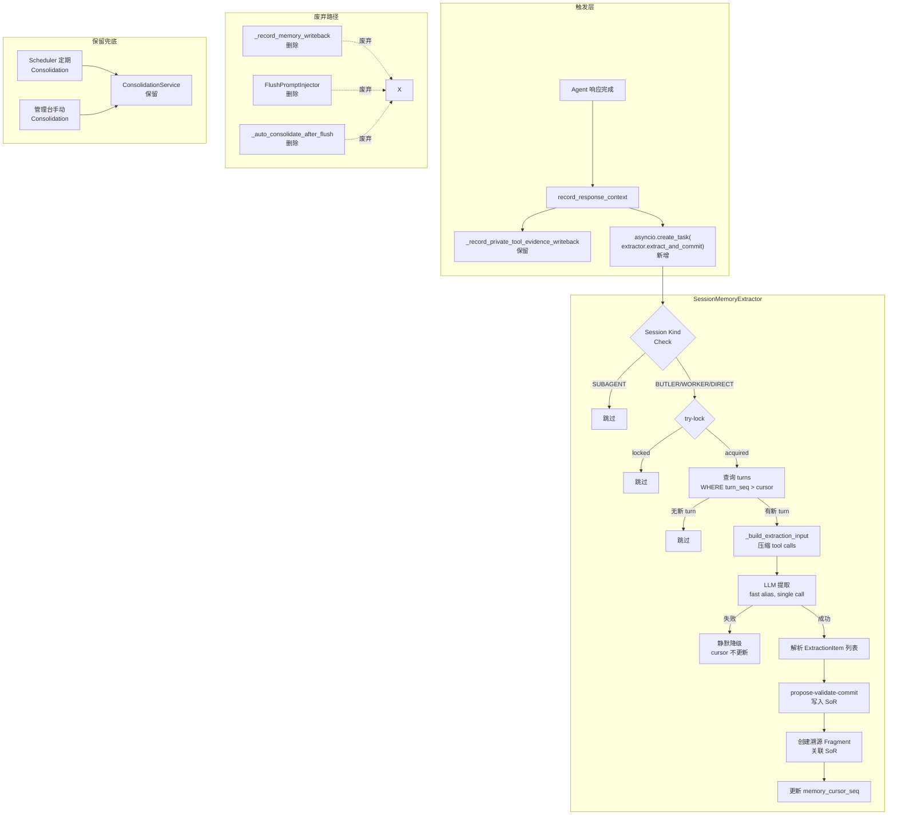

# Implementation Plan: Session 驱动统一记忆管线

**Branch**: `claude/competent-pike` | **Date**: 2026-03-19 | **Spec**: [spec.md](./spec.md)
**Input**: Feature specification from `.specify/features/067-session-driven-memory-pipeline/spec.md`

## Summary

将当前 6 条分散的记忆写入路径统一为一个 Session 级入口 `SessionMemoryExtractor`，解决 Fragment 碎片化问题。核心方案：在 `record_response_context()` 末尾 fire-and-forget 触发提取，通过 `memory_cursor_seq` 实现增量处理和崩溃恢复，单次 LLM 调用提取 facts/solutions/entities/ToM 四类记忆，通过现有 propose-validate-commit 治理流程写入 SoR。同时废弃 4 条旧路径，保留 Scheduler Consolidation 兜底和 `memory.write` 主动通道。

## Technical Context

**Language/Version**: Python 3.12+
**Primary Dependencies**: Pydantic (数据模型), structlog (日志), asyncio (并发), LiteLLM (LLM 网关)
**Storage**: SQLite WAL (`agent_sessions` 表新增 `memory_cursor_seq` 列; `agent_session_turns` 表现有 `turn_seq` 索引)
**Testing**: pytest + pytest-asyncio; unit + integration
**Target Platform**: macOS / Linux 单机部署
**Project Type**: 后端服务（OctoAgent gateway + kernel + packages）
**Performance Goals**: 提取延迟不影响用户感知（fire-and-forget 异步）；单次 LLM 调用 < 5s (fast alias)
**Constraints**: 不阻塞 Agent 响应；崩溃恢复不丢不重；per-Session 互斥
**Scale/Scope**: 单用户，并发 Session 数 < 10

## Constitution Check

*GATE: Must pass before Phase 0 research. Re-check after Phase 1 design.*

| 原则 | 适用性 | 评估 | 说明 |
|------|--------|------|------|
| 1. Durability First | 高 | PASS | memory_cursor_seq 持久化到 SQLite；cursor 仅在 SoR 写入成功后才推进；崩溃后未确认 turn 可重新处理 |
| 2. Everything is an Event | 中 | PASS | 提取结果通过 propose-validate-commit 生成事件记录；结构化日志记录 started/completed/skipped/failed |
| 3. Tools are Contracts | 低 | N/A | 本 Feature 不涉及工具 schema 变更 |
| 4. Side-effect Two-Phase | 中 | PASS | SoR 写入走 propose → validate → commit 三阶段；提取本身是 append-only 不可逆操作 |
| 5. Least Privilege | 中 | PASS | 提取管线不接触 Vault/secrets；Private Tool 证据走独立通道不经过 LLM |
| 6. Degrade Gracefully | 高 | PASS | LLM 不可用时静默跳过（FR-019）；cursor 不更新，下次可重试；Scheduler Consolidation 兜底 |
| 7. User-in-Control | 低 | PASS | 记忆提取全自动无需审批（FR-018）；用户可通过管理台查看/删除记忆 |
| 8. Observability | 高 | PASS | 每次提取产出结构化日志（session_id, scope_id, counts, errors）；result 记录 turns_processed 和各类 committed 数 |
| 9. 不猜关键配置 | 低 | N/A | 提取管线不操作外部系统配置 |
| 10. Bias to Action | 低 | N/A | 后台服务，不涉及 Agent 决策行为 |
| 11. Context Hygiene | 高 | PASS | Tool Call 压缩为 `tool_name + summary`，不传入原始 input/output；避免上下文膨胀 |
| 12. 记忆写入治理 | 高 | PASS | 所有 SoR 写入通过 propose-validate-commit；Fragment 作为证据写入；不绕过仲裁器 |
| 13. 失败可解释 | 高 | PASS | 分类记录 llm_failed / parse_failed / commit_failed；skipped_reason 明确说明跳过原因 |
| 13A. 优先上下文 | 中 | PASS | LLM 自主决定提取内容和粒度，系统不预设硬规则；仅提供结构化 prompt 作为引导 |
| 14. A2A 兼容 | 低 | N/A | 内部服务，不涉及 A2A 协议 |

**Constitution Check 结果: PASS** -- 无 VIOLATION，所有适用原则均满足。

## Project Structure

### Documentation (this feature)

```text
.specify/features/067-session-driven-memory-pipeline/
├── plan.md                                    # 本文件
├── spec.md                                    # 需求规范
├── research.md                                # Phase 0 技术决策研究
├── data-model.md                              # Phase 1 数据模型
├── quickstart.md                              # 快速上手指南
├── contracts/
│   ├── session-memory-extractor.md            # SessionMemoryExtractor 服务契约
│   └── deprecation-paths.md                   # 废弃路径移除契约
└── checklists/
    └── spec-checklist.md                      # Spec 检查清单
```

### Source Code (repository root)

```text
octoagent/
├── packages/core/src/octoagent/core/
│   ├── models/agent_context.py                # [修改] AgentSession 新增 memory_cursor_seq
│   └── store/agent_context_store.py           # [修改] schema 迁移 + list_turns_after_seq()
├── packages/provider/src/octoagent/provider/dx/
│   ├── flush_prompt_injector.py               # [删除] 整个文件废弃
│   ├── consolidation_service.py               # [保留] Scheduler 兜底 + 管理台入口
│   └── llm_common.py                          # [复用] LlmServiceProtocol + parse_llm_json_array
├── apps/gateway/src/octoagent/gateway/services/
│   ├── session_memory_extractor.py            # [新建] 核心提取服务
│   ├── agent_context.py                       # [修改] 触发点注入 + 删除 _record_memory_writeback
│   └── task_service.py                        # [修改] 删除 FlushPromptInjector 调用 + _auto_consolidate
├── apps/gateway/tests/
│   └── test_session_memory_extractor.py       # [新建] 单元测试
└── tests/integration/
    └── test_f067_session_memory_pipeline.py   # [新建] 集成测试
```

**Structure Decision**: 新建 `session_memory_extractor.py` 放在 gateway/services/ 下（与 agent_context.py 同级），因为它需要直接访问 AgentContextStore 和 MemoryService，且触发点在 gateway 层的 record_response_context 中。

## Architecture



## Implementation Phases

### Phase A: 基础设施 (US-3 Cursor + 模型变更)

1. `AgentSession` 模型新增 `memory_cursor_seq: int = 0` 字段
2. `agent_context_store.py` 新增 schema 迁移（ALTER TABLE）
3. `agent_context_store.py` 新增 `list_turns_after_seq(agent_session_id, after_seq, limit)` 方法
4. `agent_context_store.py` 新增 `update_memory_cursor(agent_session_id, new_cursor_seq)` 方法
5. 单元测试覆盖 cursor 初始化、查询、更新

### Phase B: 核心提取服务 (US-1 + US-4)

1. 新建 `session_memory_extractor.py`，实现 `SessionMemoryExtractor` 类
2. 实现 `_build_extraction_input()`：从 turns 构建 LLM 输入，压缩 tool calls
3. 实现统一 LLM prompt（facts + solutions + entities + ToM）
4. 实现 `_parse_extraction_output()`：JSON 解析为 `ExtractionItem` 列表
5. 实现 `_commit_extractions()`：逐条通过治理流程写入 SoR
6. 实现 per-Session asyncio.Lock（try-lock 语义）
7. 单元测试覆盖正常流程、空结果、LLM 失败、解析失败、部分写入失败

### Phase C: 触发点注入 + Fragment 溯源 (US-1 + US-5)

1. `agent_context.py` :: `record_response_context()` 末尾注入 fire-and-forget 调用
2. 实现 scope_id 推导逻辑（复用 `_resolve_memory_namespace_by_kind` + `_select_writeback_scope`）
3. 实现溯源 Fragment 创建（metadata 包含 `evidence_for_sor_ids`）
4. 集成测试：完整对话流程 → 自动提取 → SoR 和 Fragment 产出

### Phase D: 废弃旧路径 (US-2)

1. 删除 `_record_memory_writeback` 方法及其在 `record_response_context` 中的调用
2. 删除 `_persist_compaction_flush` 中 FlushPromptInjector 的调用逻辑
3. 删除 `_auto_consolidate_after_flush` 方法及其调用点
4. 删除 `flush_prompt_injector.py` 整个文件
5. 清理所有 import 引用
6. 验证：grep 确认无死代码引用

### Phase E: 兜底与验证 (US-6)

1. 验证 Scheduler Consolidation 正常运行（`consolidate_all_pending`）
2. 验证管理台手动 Consolidation 正常运行
3. 验证 `memory.write` 工具正常运行
4. 端到端集成测试：多种 Session Kind、崩溃恢复、并发防护

## Complexity Tracking

本计划未发现 Constitution 违规项，无需豁免论证。

| 决策 | 选择 | 简单替代方案 | 选择当前方案的理由 |
|------|------|-------------|-------------------|
| 单次 LLM 调用提取四类记忆 | 统一 prompt | 分四次调用 | 减少延迟和成本，LLM 在全局语境下判断更准确 |
| per-Session asyncio.Lock | try-lock | 无锁（靠 SoR 去重） | 避免浪费 LLM 调用，锁开销极低 |
| 直接删除旧路径 | 硬删除 | Feature flag 切换 | 新旧路径并存会导致双写，spec 明确要求统一入口 |
| cursor 存储在 AgentSession | 模型字段 | metadata dict / 独立表 | 类型安全、查询方便、1:1 关系无需分表 |
