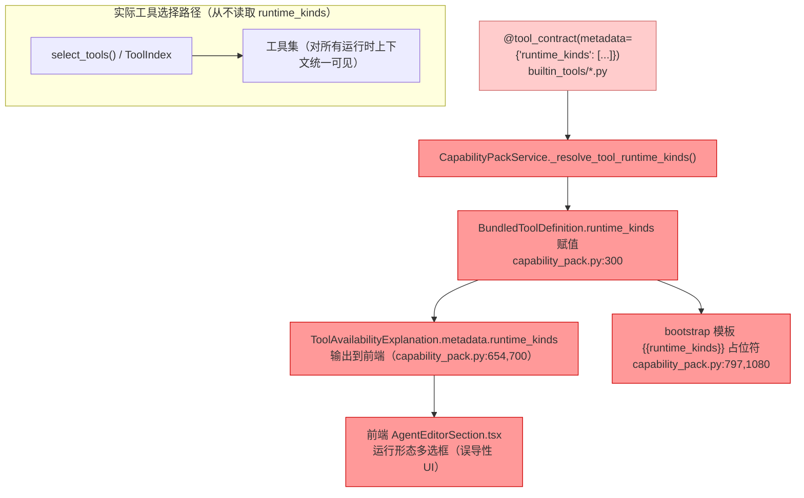
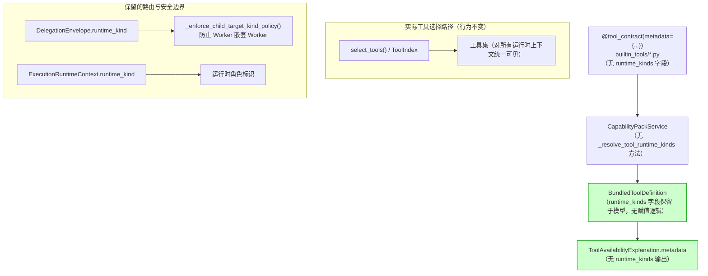

# Implementation Plan: 统一主 Agent 与 Worker 工具集 — 清除 runtime_kinds 工具过滤死代码

**Branch**: `076-unify-agent-worker-tools` | **Date**: 2026-04-18 | **Spec**: `spec.md`
**Input**: Feature specification from `.specify/features/076-unify-agent-worker-tools/spec.md`

---

## Summary

删除 `_resolve_tool_runtime_kinds()` 方法及所有相关的 `runtime_kinds` 过滤死代码，统一主 Agent 与 Worker 的工具集视图。

技术方案：纯删除操作。`BundledToolDefinition.runtime_kinds` 字段赋值从未参与工具过滤决策，`@tool_contract` metadata 中的 `runtime_kinds` 声明从未被 `select_tools()` 或 `ToolIndex` 读取，bootstrap 模板占位符 `{{runtime_kinds}}` 仅插入 Worker Profile 元数据（不影响工具集合）。删除这些代码后，系统行为与删除前完全一致——工具集对所有运行时上下文统一可见，这正是当前实际行为。

---

## Technical Context

**Language/Version**: Python 3.12+（后端），TypeScript（前端 React）
**Primary Dependencies**: Pydantic AI、FastAPI、React（无新增依赖）
**Storage**: N/A（无 schema 迁移，无数据变更）
**Testing**: pytest（后端工具合约 contract test）、vitest（前端组件测试）
**Target Platform**: macOS 本地（开发/运行环境一致）
**Project Type**: Monorepo（`octoagent/` 后端 + `frontend/` 前端）
**Performance Goals**: N/A（纯删除操作）
**Constraints**: 不得删除 `RuntimeKind` 枚举、`ExecutionRuntimeContext.runtime_kind`、`DelegationEnvelope.runtime_kind`、`_enforce_child_target_kind_policy()`；不得执行任何数据库 schema 迁移

---

## Codebase Reality Check

对所有目标文件进行扫描，记录当前状态。

### 后端目标文件

| 文件 | LOC | 直接受影响的 `runtime_kinds` 引用数 | Debt 标记 | 清理规模 |
|------|-----|-------------------------------------|-----------|---------|
| `capability_pack.py` | 2046 | 7 处（方法体 + 字段赋值 + 模板输出 + WorkerProfile 配置 + bootstrap 占位符） | 0 | 删除 1 个方法（22 行）+ 清理 6 处引用 |
| `builtin_tools/delegation_tools.py` | ~280 | 6 处 `runtime_kinds` key | 0 | 删除 6 个 dict key |
| `builtin_tools/browser_tools.py` | 195 | 6 处 | 0 | 删除 6 个 dict key |
| `builtin_tools/mcp_tools.py` | ~382 | 6 处 | 0 | 删除 6 个 dict key |
| `builtin_tools/terminal_tools.py` | ~80 | 1 处 | 0 | 删除 1 个 dict key |
| `builtin_tools/runtime_tools.py` | ~180 | 6 处 | 0 | 删除 6 个 dict key |
| `builtin_tools/misc_tools.py` | 397 | 6 处 | 0 | 删除 6 个 dict key |
| `builtin_tools/supervision_tools.py` | ~100 | 2 处 | 0 | 删除 2 个 dict key |
| `builtin_tools/session_tools.py` | ~180 | 5 处 | 0 | 删除 5 个 dict key |
| `builtin_tools/filesystem_tools.py` | 160 | 3 处 | 0 | 删除 3 个 dict key |
| `builtin_tools/memory_tools.py` | ~340 | 6 处 | 0 | 删除 6 个 dict key |
| `builtin_tools/network_tools.py` | ~80 | 2 处 | 0 | 删除 2 个 dict key |
| `builtin_tools/config_tools.py` | 404 | 6 处 | 0 | 删除 6 个 dict key |
| `mcp_registry.py` | 504 | 1 处 | 0 | 删除 1 个 dict key |
| `tool_search_tool.py` | 208 | 1 处 | 0 | 删除 1 个 dict key |

**后端合计**：约 57 处 `runtime_kinds` 引用，均为 dict 中的单行 key-value 删除，或方法定义/调用删除。

### 前端目标文件

| 文件 | LOC | 直接受影响的 `runtime_kinds`/`runtimeKinds` 引用数 | Debt 标记 | 清理规模 |
|------|-----|--------------------------------------------------|-----------|---------|
| `AgentEditorSection.tsx` | 273 | 4 处（props 接口、解构、2 处 JSX 引用）+ `RUNTIME_KIND_OPTIONS` 常量 | 0 | 删除约 35 行（UI 区块 + prop 定义） |
| `AgentCenter.tsx` | 867 | 2 处（`updateDraftList("runtimeKinds")` 调用 + `onToggleRuntimeKind` 传递）+ `updateDraftList` 函数签名 | 0 | 删除约 15 行 |
| `agentManagementData.ts` | 586 | 4 处（`runtimeKinds` draft 字段、初始化、payload 字段 + 常量） | 0 | 删除约 6 行 |
| `types/index.ts` | 1945 | `RuntimeKind` type 定义（1063 行）被 `BundledToolDefinition.runtime_kinds` 和 `WorkerCapabilityProfile.runtime_kinds` 继续使用 | 0 | **不触碰**（见注释） |

**注释：`types/index.ts` 中的 `RuntimeKind` type 以及 `BundledToolDefinition.runtime_kinds`、`WorkerCapabilityProfile.runtime_kinds` 字段不可删除**。这些字段对应后端 API 响应中的真实字段（`WorkerProfile.runtime_kinds` DB 字段被保留），前端仍需正确反序列化 API 数据。`AgentCenter.tsx` 中的 `onToggleRuntimeKind` prop 名称与 `RuntimeKind` type 无直接关联——即使删除 UI 回调，`RuntimeKind` type 仍通过数据类型被引用。

### 前置清理规则检查

- `capability_pack.py`（2046 行）将净减少约 28 行 → 不满足"新增 > 50 行"条件 → **无需前置 cleanup task**
- 所有目标文件无 TODO/FIXME debt → **无需前置 cleanup task**
- 无代码重复触发条件 → **无需前置 cleanup task**

---

## Impact Assessment

### 影响范围

| 维度 | 值 | 说明 |
|------|-----|------|
| 直接修改文件数 | 18 | 后端 15 个 + 前端 3 个（`types/index.ts` 不修改） |
| 间接受影响文件数 | 约 5-7 | 前端测试 mock 数据含 `runtime_kinds` 字段（`App.test.tsx`、`AgentCenter.test.tsx`），但字段来自 API 响应，不受清理影响 |
| 跨包影响 | 是，1 个边界 | 跨 `gateway/` 后端包 → `frontend/` 前端包；但均为删除操作，无新增耦合 |
| 数据迁移 | 否 | `WorkerProfile.runtime_kinds` DB 字段保留，零 schema 迁移 |
| API/契约变更 | 否 | 后端 `capability_pack.py` 的 `BundledToolDefinition.runtime_kinds` 字段仍在数据模型中，API 响应格式不变（字段值不再被特殊赋值，使用默认值或空列表） |
| 测试文件影响 | 约 2 个 | `App.test.tsx` 和 `AgentCenter.test.tsx` 的 mock 数据中有 `runtime_kinds: ["worker"]` 字段，在 `WorkerCapabilityProfile` mock 中使用，保持不动 |

### 风险等级判定

- 影响文件数：18 个直接修改 → 在 10-20 范围内
- 跨包影响：1 个边界（gateway ↔ frontend）
- 数据迁移：无
- API 契约变更：无
- **判定：MEDIUM**

**判定依据**：文件数 18（满足 MEDIUM 的 10-20 范围）；跨 1 个顶层包边界（MEDIUM 条件之一）；所有变更为纯删除，无新增逻辑，无运行时行为变化。HIGH 条件（>20 文件、>2 跨包、数据迁移、公共 API 变更）均不满足。

**MEDIUM 风险处置**：不强制分阶段，但实现应按后端/前端两个逻辑批次进行，并在每批次后验证测试通过。

---

## Constitution Check

| 原则 | 适用性 | 评估 | 说明 |
|------|--------|------|------|
| 1. Durability First | 不适用 | PASS | 纯删除死代码，不涉及任务持久化逻辑 |
| 2. Everything is an Event | 不适用 | PASS | 不涉及事件系统变更 |
| 3. Tools are Contracts | 直接相关 | PASS | 删除 `@tool_contract` metadata 中的无效 `runtime_kinds` 字段，使工具合约更加精简、准确。符合"单一事实源"原则 |
| 4. Side-effect Must be Two-Phase | 不适用 | PASS | 纯删除操作，无副作用引入 |
| 5. Least Privilege by Default | 不适用 | PASS | 不涉及权限/secrets 逻辑 |
| 6. Degrade Gracefully | 间接相关 | PASS | 删除死代码后工具集行为不变，可降级能力不受影响 |
| 7. User-in-Control | 间接相关 | PASS | 删除误导性 UI 组件实际上提升了用户控制的准确性（移除无效控件） |
| 8. Observability is a Feature | 不适用 | PASS | `ToolAvailabilityExplanation.metadata.runtime_kinds` 删除后，工具状态输出更简洁，无观测性损失 |
| 9. Agent Autonomy | 不适用 | PASS | 不涉及 Agent 决策逻辑 |
| 10. Policy-Driven Access | 不适用 | PASS | `_resolve_tool_runtime_kinds()` 从未参与权限决策，删除不影响 Policy Engine |
| 11-14（行为宪章） | 不适用 | PASS | 纯结构清理，不涉及 Agent prompt 或 A2A 协议 |
| III. 技术约束 | 间接相关 | PASS | 继续使用 Python 3.12+、Pydantic、FastAPI，无违反 |
| IV. 质量门控 | 直接相关 | PASS | 清理后须运行现有工具 contract test 验证工具 schema 未损坏 |

**Constitution Check 结论：全部 PASS，无 VIOLATION。**

---

## Project Structure

### 制品目录

```text
.specify/features/076-unify-agent-worker-tools/
├── spec.md                  # 需求规范（已存在）
├── research/
│   └── tech-research.md     # 技术调研（已存在）
├── plan.md                  # 本文件
└── tasks.md                 # 实现任务（由 /speckit.tasks 生成）
```

注：本特性为纯清理操作，无新增 API 契约、无数据模型变更，不生成 `research.md`、`data-model.md`、`contracts/`、`quickstart.md`（spec 未要求，且清理类特性可从简）。

### 源代码目录（受影响）

```text
octoagent/apps/gateway/src/octoagent/gateway/services/
├── capability_pack.py                 # 主要修改：删除方法 + 字段赋值 + 模板输出 + 占位符
├── mcp_registry.py                    # 次要修改：删除 1 处 metadata key
├── tool_search_tool.py                # 次要修改：删除 1 处 metadata key
└── builtin_tools/
    ├── browser_tools.py               # 删除 6 处 metadata key
    ├── config_tools.py                # 删除 6 处 metadata key
    ├── delegation_tools.py            # 删除 6 处 metadata key
    ├── filesystem_tools.py            # 删除 3 处 metadata key
    ├── mcp_tools.py                   # 删除 6 处 metadata key
    ├── memory_tools.py                # 删除 6 处 metadata key
    ├── misc_tools.py                  # 删除 6 处 metadata key
    ├── network_tools.py               # 删除 2 处 metadata key
    ├── runtime_tools.py               # 删除 6 处 metadata key
    ├── session_tools.py               # 删除 5 处 metadata key
    ├── supervision_tools.py           # 删除 2 处 metadata key
    └── terminal_tools.py              # 删除 1 处 metadata key

octoagent/frontend/src/
├── domains/agents/
│   ├── AgentEditorSection.tsx         # 删除运行形态 UI 区块 + prop 定义
│   └── agentManagementData.ts         # 删除 runtimeKinds draft/payload 字段
├── pages/
│   └── AgentCenter.tsx                # 删除 updateDraftList("runtimeKinds") 逻辑 + prop 传递
└── types/
    └── index.ts                       # 不修改（RuntimeKind type 仍被 API 类型使用）
```

---

## Architecture

### 当前（清理前）数据流



### 目标（清理后）数据流



---

## Implementation Phases

本特性为 MEDIUM 风险，不强制分阶段，但为便于 review 和验证，按逻辑批次组织：

### Batch 1：后端清理（核心）

**目标文件**：`capability_pack.py` + 15 个 `builtin_tools/*.py` + `mcp_registry.py` + `tool_search_tool.py`

**操作清单**：

1. **`capability_pack.py`**：
   - 删除 `_resolve_tool_runtime_kinds()` 方法（第 1714-1736 行）
   - 删除第 300 行：`runtime_kinds=self._resolve_tool_runtime_kinds(meta.name),`
   - 删除第 654 行：`"runtime_kinds": [item.value for item in bundled.runtime_kinds],`
   - 删除第 700 行：`"runtime_kinds": [item.value for item in bundled.runtime_kinds],`
   - 删除第 797-798 行：`"{{runtime_kinds}}": ...` 替换映射条目
   - 删除第 1080 行：`"Runtime Kinds: {{runtime_kinds}}\n"` bootstrap 模板内容

2. **`builtin_tools/*.py`（共 12 个文件）**：
   - 删除每个 `@tool_contract` metadata 中的 `"runtime_kinds": [...]` 行（共约 49 处）

3. **`mcp_registry.py`**：
   - 删除第 432 行：`"runtime_kinds": ["worker", "subagent", "graph_agent", "acp_runtime"],`

4. **`tool_search_tool.py`**：
   - 删除第 86 行：`"runtime_kinds": ["worker", "subagent", "graph_agent"],`

**验证点**：
- `grep -r "_resolve_tool_runtime_kinds"` 在代码库中结果为零
- `grep -r '"runtime_kinds"' octoagent/apps/gateway/src/octoagent/gateway/services/` 结果为零
- 现有 pytest 全量通过（尤其是工具 contract test）

### Batch 2：前端清理

**目标文件**：`AgentEditorSection.tsx`、`AgentCenter.tsx`、`agentManagementData.ts`

**操作清单**：

1. **`AgentEditorSection.tsx`**：
   - 删除 `RUNTIME_KIND_OPTIONS` 常量（第 10-15 行）
   - 删除 `onToggleRuntimeKind: (value: string) => void;` prop 声明（第 30 行）
   - 删除解构中的 `onToggleRuntimeKind`（第 64 行）
   - 删除运行形态 UI 区块（`div.wb-field` 包含 `{RUNTIME_KIND_OPTIONS.map(...)}` 的整段 JSX，约第 250-267 行）

2. **`AgentCenter.tsx`**：
   - 删除 `updateDraftList` 函数的 `"runtimeKinds"` key 类型约束（第 540 行），若该函数只剩这一种用法则整个函数删除；若有其他用途则收窄类型
   - 删除传递给 `AgentEditorSection` 的 `onToggleRuntimeKind` prop（第 788 行）

3. **`agentManagementData.ts`**：
   - 删除 `AgentEditorDraft.runtimeKinds: string[]` 字段声明（第 93 行）
   - 删除 `runtimeKinds` 初始化逻辑（第 450-451 行）
   - 删除 `DEFAULT_RUNTIME_KINDS` 常量（如存在且无其他引用）
   - 删除 `buildAgentPayload` 中的 `runtime_kinds: uniqueStrings(draft.runtimeKinds),` 输出（第 526 行）

**不修改**：`types/index.ts`（`RuntimeKind` type 及相关接口字段继续用于 API 响应类型标注）

**验证点**：
- `grep -r "runtimeKinds\|onToggleRuntimeKind\|RUNTIME_KIND_OPTIONS" frontend/src/` 结果为零（测试文件除外）
- 前端构建通过（`pnpm build` 无 TypeScript 错误）
- 前端测试通过（`AgentCenter.test.tsx` 中的 mock `runtime_kinds` 字段属于 `WorkerCapabilityProfile` 数据，与 UI 组件无关，不受影响）
- AgentEditor 页面不再渲染"运行形态"多选框

---

## Complexity Tracking

本特性 Constitution Check 全部 PASS，无 VIOLATION，无需记录例外项。

> 唯一值得记录的设计决策：**`types/index.ts` 的 `RuntimeKind` type 保留**。
> 理由：`BundledToolDefinition.runtime_kinds` 和 `WorkerCapabilityProfile.runtime_kinds` 字段在 API 响应中仍存在（后端保留了 `WorkerProfile.runtime_kinds` DB 字段），前端需要正确类型化这些数据。删除 `RuntimeKind` type 会造成 TypeScript 编译错误。该决策符合 spec.md FR-011 中的"可选"定性：前提条件"无其他组件引用"不满足，因此不删除。

---

## Acceptance Checklist

清理完成后，逐条验证：

- [ ] `grep -r "_resolve_tool_runtime_kinds"` 在整个代码库中结果为零（SC-001）
- [ ] `grep -r '"runtime_kinds"' octoagent/apps/gateway/src/` 结果为零，仅 `BundledToolDefinition` Pydantic 模型字段定义可保留（SC-002）
- [ ] `pytest` 全量通过，主 Agent 和 Worker 工具列表与清理前一致（SC-003）
- [ ] AgentEditor 页面中不再渲染"运行形态"多选框（SC-004）
- [ ] 前端 TypeScript 编译无错误，`pnpm build` 通过（SC-005）
- [ ] 无任何数据库 schema 迁移脚本被添加（SC-006）
- [ ] `RuntimeKind` 枚举（Python）和 `_enforce_child_target_kind_policy()` 仍存在于代码库
- [ ] `WorkerProfile.runtime_kinds` DB 字段未被触碰（通过 `sqlite_init.py` grep 确认）
