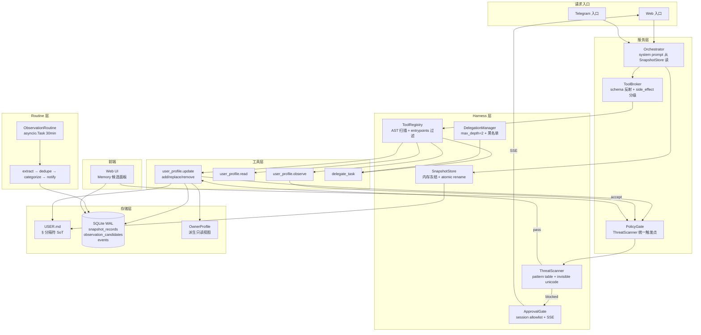

# Implementation Plan: Feature 084 — Context + Harness 全栈重构

**Branch**: `084-context-harness-rebuild` | **Date**: 2026-04-28 | **Spec**: `spec.md`  
**Input**: `.specify/features/084-context-harness-rebuild/spec.md` (已批准，9 旅程 / 10 FR / 5 阶段)

---

## Summary

F082（Bootstrap & Profile Integrity）四个架构断层（D1 web 入口缺失 / D2 Snapshot Store 不存在 / D3 is_filled 误判 / D4 工具命名语义失配）在本次 F084 中统一根治。技术路线以 **Hermes Agent 为首要参考架构**，移植其生产验证的 Snapshot Pattern、Tool Registry（AST 扫描 + module-level register()）、Approval Gate 和 Threat Scanner，同时实现 OctoAgent 特有的 Observation Routine 和 Sub-agent Delegation。

核心技术决策（均源于 research-synthesis.md 6 个锁定选型）：

| 模块 | 选型 | 理由 |
|------|------|------|
| SnapshotStore | 内存 dict 冻结 + atomic rename + fcntl.flock | prefix cache 保护最彻底，零新依赖 |
| Tool Registry | AST 扫描 + module-level register() | Hermes 可移植约 450 行，entrypoints 字段解决 D1 |
| Threat Scanner | 正则 pattern table + invisible unicode 检测 | 微秒级，完全离线，Constitution C6 兼容 |
| Routine Scheduler | asyncio.Task（不经 APScheduler） | 完全隔离，cancel 语义精确 |
| USER.md 合并 | append-only § 分隔符 + add/replace/remove | 零 token 成本，用户审视成本低 |
| Sub-agent Delegation | 读用 ProviderRouter 直调 / 写走 ToolBroker+PolicyGate | C4 Two-Phase 合规，避免过度 Worker spawn |

**变更规模**：预计删除约 2500 行 F082 遗留代码（5 个模块退役），新增约 3500 行跨 6 个核心组件。**5 阶段、约 10 天**完成。

---

## Technical Context

**Language/Version**: Python 3.12+  
**Primary Dependencies**: FastAPI + Uvicorn + SSE、Pydantic v2、pydantic-ai、aiosqlite、APScheduler（现有 cron 保留）、structlog + Logfire  
**Storage**: SQLite WAL（现有，新增 `snapshot_records` + `observation_candidates` 两表）+ 文件系统（USER.md / MEMORY.md）  
**Testing**: pytest（全量 ≥ 2759 用例基准，目标 0 regression）  
**Target Platform**: macOS / Linux（单机 Personal AI OS）  
**Project Type**: Web application（FastAPI backend + React frontend）  
**Performance Goals**: Tool Registry AST 扫描 < 200ms；Threat Scanner 单次 < 1ms；SnapshotStore prefix cache 命中率不降  
**Constraints**: 零新外部依赖（SC-002）；BootstrapSession 表退役（SC-003）；bootstrap.complete 工具退役（SC-004）  
**Scale/Scope**: 单用户，单机部署，约 47 个内置工具，USER.md ≤ 50,000 字符上限

---

## Codebase Reality Check

> 注意：worktree `084-context-harness-rebuild` 当前 clean（仅含 .specify/ 文档制品），源码位于主工作树。以下数据基于 spec.md / tech-research.md 对现有代码的描述以及 F082 完成时的代码量统计。

| 目标文件 | LOC（估） | 公开方法数（估） | 已知 Debt |
|---------|----------|----------------|---------|
| `gateway/services/builtin_tools/__init__.py`（CapabilityPack 注册） | ~200 | 3（register_all, resolve, list） | 硬编码 explicit 字典（D1 根因）；无 entrypoints 字段 |
| `gateway/services/builtin_tools/bootstrap_tools.py` | ~180 | 5（bootstrap.complete 等） | 语义失配（D4）；命名为 bootstrap 但承担档案写入职责 |
| `gateway/services/orchestrator.py` | ~800 | 10+ | system prompt 构造与 CapabilityPack 强耦合；bootstrap 分支硬编码 |
| `gateway/services/agent_decision.py` | ~350 | 6（render_runtime_hint_block 等） | render_runtime_hint_block 依赖旧 UserMdRenderer |
| `gateway/services/policy.py` | ~300 | 8 | Threat Scanner 未集成；policy 决策散落 |
| `gateway/services/tool_broker.py` | ~400 | 6（execute, schema_for 等） | 无 ToolRegistry 下游，工具来源为 CapabilityPack |
| `gateway/services/bootstrap_orchestrator.py` | ~450 | 8 | 目标删除（Phase 4）；BootstrapSession 状态机 |
| `gateway/services/bootstrap_integrity.py` | ~300 | 5 | 目标删除（Phase 4）；is_filled 误判根因（D3） |
| `gateway/services/user_md_renderer.py` | ~250 | 4 | 目标删除（Phase 4）；D3 错误来源 |
| `gateway/services/behavior_workspace.py` | ~600 | 12 | `_detect_legacy_onboarding_completion` 要删；其余保留 |
| `core/models/agent_context.py`（OwnerProfile） | ~300 | 8 | OwnerProfile 既是 SoT 又是写入目标（D2/R7 根因） |
| `gateway/main.py`（lifespan） | ~200 | 3（lifespan, app 初始化） | 需接入 SnapshotStore 单例 + RoutineScheduler 启动 |
| `core/store/sqlite_init.py` | ~150 | 2 | 需新增 snapshot_records + observation_candidates 表 |

**前置清理规则触发**：

- `orchestrator.py`（~800 行，将新增 > 50 行）→ **触发**：需前置 CLEANUP task，抽离 system prompt 构造为独立函数
- `behavior_workspace.py`（~600 行，将删除遗留检测函数）→ **触发**：前置清理 `_detect_legacy_onboarding_completion` + 相关注释死代码
- `bootstrap_orchestrator.py` / `bootstrap_integrity.py` / `user_md_renderer.py`：目标整体删除，无需前置 cleanup，直接在 Phase 4 一次性删除

---

## Impact Assessment

**影响文件数**：
- 直接修改：13 个文件（见 Codebase Reality Check 表格）
- 间接受影响（调用方/依赖方）：约 15-20 个（builtin_tools 各工具模块添加 entrypoints 字段、test 文件迁移、blueprint 文档更新）
- **合计约 30-35 个文件**

**跨包影响**：
- `apps/gateway/` → `packages/core/`（OwnerProfile sync 接口变更）
- `apps/gateway/` 内部（services/ → tools/ 新目录，harness/ 新目录）
- `packages/provider/`（`bootstrap_commands.py` 退役）
- `apps/frontend/`（新增 Memory 候选面板，新增 React 页面 + API 接入）
- 跨包边界数：3（gateway、core、frontend/provider）

**数据迁移**：
- SQLite schema 变更：新增 `snapshot_records` + `observation_candidates` 两表
- SQLite schema 变更：`BootstrapSession` 表在 Phase 4 DROP（保留 migration DDL）
- OwnerProfile 表：从"写入目标"降级为"派生只读视图"（字段语义变更，无数据丢失）
- USER.md 文件路径和格式：保持不变（§ 分隔符与现有兼容）

**API/契约变更**：
- 新增 5 个 REST API endpoint（`/api/memory/candidates` 等）
- 新增 4 个 Agent 工具接口（`user_profile.update/read/observe`、`delegate_task`）
- 修改 `APPROVAL_REQUESTED` / `APPROVAL_DECIDED` 事件 schema（新增 `threat_category`、`pattern_id` 字段）
- `ToolBroker.execute()` 接口下游从 CapabilityPack 切换到 ToolRegistry.dispatch()（内部变更，外层 API 不变）

**风险等级：HIGH**

判定依据：影响文件约 30-35 个（> 20）；跨包影响 3 个（> 2）；涉及 SQLite schema 变更（数据迁移）；修改 `APPROVAL_REQUESTED` 事件 schema（公共 API 契约变更）。

**HIGH 风险强制分阶段**：5 个 Phase 均设有独立验证点，Phase 1/2 末尾必须全量 pytest 通过，Phase 3 末尾验收场景 2+3 通过，Phase 4 末尾 grep 清零验证 + 验收场景 4 通过。

---

## Constitution Check

| 原则 | 适用性 | 评估 | 说明 |
|------|--------|------|------|
| C1 Durability First | ✅ 适用 | PASS | SnapshotRecord 落 SQLite（TTL 30 天），ObservationCandidate 落表，observation routine task 通过 asyncio.Task cancel 到终态 |
| C2 Everything is an Event | ✅ 适用 | PASS | FR-10 定义 10 个新事件类型；所有写操作有对应事件；APPROVAL_REQUESTED/DECIDED 扩展字段 |
| C3 Tools are Contracts | ✅ 适用 | PASS | ToolEntry.schema 为 Pydantic BaseModel（单一事实源）；ToolBroker 保留 schema 反射 |
| C4 Side-effect Two-Phase | ✅ 适用 | PASS | replace/remove 走 Approval Gate 卡片（C1 已解决 → Option B）；sub-agent 写操作走 ToolBroker+PolicyGate |
| C5 Least Privilege | ✅ 适用 | PASS | Threat Scanner 统一扫描写入内容，防止恶意内容进系统提示；secrets 路径不变 |
| C6 Degrade Gracefully | ✅ 适用 | PASS | Threat Scanner 纯标准库，离线可用；observation routine 用 asyncio.Task，utility model 不可用时跳过 categorize，候选以低置信度入队（J6 验收场景 4） |
| C7 User-in-Control | ✅ 适用 | PASS | Approval Gate session allowlist + Web UI 审批卡片；observation routine 支持 feature flag 关闭；candidates 超限通知用户 |
| C8 Observability is a Feature | ✅ 适用 | PASS | 每个 Phase 完成写 OBSERVATION_STAGE_COMPLETED 事件；SUBAGENT_SPAWNED/RETURNED；所有新模块接入 structlog + Logfire span |
| C9 Agent Autonomy | ✅ 适用 | PASS | bootstrap.complete 直接删除（FR-1.6）；user_profile.observe 调用时机由 LLM 自主决策；observation routine promote 由 LLM categorize 决定 |
| C10 Policy-Driven Access | ✅ 适用 | PASS | ThreatScanner 在 PolicyGate 统一触发（FR-3.1）；replace/remove 经 Approval Gate；无工具层自行拦截 |
| C12 记忆写入治理 | ✅ 适用 | PASS | USER.md 写入前经 Threat Scanner；observation routine 产生 WriteProposal（候选）→ 用户确认后提交（仲裁器角色） |
| C13A 上下文优先于硬策略 | ✅ 适用 | PASS | SnapshotStore 冻结完整 USER.md 内容注入系统提示；LLM 自主决定调用哪个 user_profile 工具 |

**结论：无 VIOLATION，计划有效。**

---

## Project Structure

### Documentation（本 Feature）

```text
.specify/features/084-context-harness-rebuild/
├── plan.md              # 本文件
├── research.md          # 6 个技术决策记录（见下方 Phase 0 输出）
├── data-model.md        # ToolEntry / SnapshotRecord / ObservationCandidate 实体模型
├── quickstart.md        # 开发者快速上手指南
├── contracts/           # API 契约（user_profile 工具、memory candidates API）
│   ├── tools-contract.md
│   └── api-contract.md
└── tasks.md             # tasks 子代理输出（本阶段不生成）
```

### Source Code（变更后的目标结构）

```text
apps/gateway/src/octoagent/gateway/
├── harness/                        # [NEW] 核心 Harness 基础设施层
│   ├── __init__.py
│   ├── tool_registry.py            # ToolEntry + Registry + AST 扫描
│   ├── toolset_resolver.py         # toolsets.yaml 读取 + entrypoint 过滤
│   ├── snapshot_store.py           # SnapshotStore（内存冻结 + atomic rename）
│   ├── threat_scanner.py           # ThreatScanner（pattern table + invisible unicode）
│   ├── approval_gate.py            # ApprovalGate（session allowlist + SSE 路径）
│   └── delegation.py               # DelegationManager + delegate_task 工具
├── routines/                       # [NEW] 异步后台 Routine 层
│   ├── __init__.py
│   └── observation_promoter.py     # ObservationRoutine（asyncio.Task + pipeline）
├── tools/                          # [NEW] 新工具实现（替代 bootstrap_tools.py）
│   ├── __init__.py
│   ├── user_profile_tools.py       # user_profile.update / observe / read
│   ├── memory_tools.py             # memory.add / replace / remove / read（供未来扩展）
│   └── clarify_tool.py             # clarify(prompt, fields_schema)
├── services/
│   ├── builtin_tools/              # [MODIFIED] 迁移 entrypoints 字段，删除 bootstrap_tools.py
│   │   ├── __init__.py             # 改写：移除 register_all() 硬编码，改用 ToolRegistry
│   │   └── [existing tools...]     # 各工具添加 entrypoints 字段声明
│   ├── orchestrator.py             # [MODIFIED] system prompt 从 SnapshotStore 读取
│   ├── agent_decision.py           # [MODIFIED] render_runtime_hint_block 适配
│   ├── policy.py                   # [MODIFIED] 集成 ThreatScanner
│   ├── tool_broker.py              # [MODIFIED] execute() 调用 ToolRegistry.dispatch()
│   ├── behavior_workspace.py       # [MODIFIED] 删除 _detect_legacy_onboarding_completion
│   ├── memory/
│   │   └── builtin_memory_bridge.py # [MODIFIED] 接入 SnapshotStore
│   # 以下文件在 Phase 4 删除：
│   # ├── bootstrap_orchestrator.py  [DELETE]
│   # ├── bootstrap_integrity.py     [DELETE]
│   # └── user_md_renderer.py        [DELETE]
├── api/
│   └── memory_candidates.py        # [NEW] GET/POST /api/memory/candidates 路由
└── main.py                         # [MODIFIED] lifespan 接入 SnapshotStore + RoutineScheduler

packages/core/src/octoagent/core/
├── models/
│   └── agent_context.py            # [MODIFIED] OwnerProfile 降级为派生只读视图
└── store/
    └── sqlite_init.py              # [MODIFIED] 新增两表 DDL

packages/provider/src/octoagent/provider/
└── bootstrap_commands.py           # [DELETE Phase 4]

apps/gateway/
└── toolsets.yaml                   # [NEW] 声明式 toolset 配置

apps/frontend/src/
├── pages/MemoryCandidates.tsx      # [NEW] Memory 候选面板页面
└── components/memory/
    ├── CandidateList.tsx           # [NEW]
    ├── CandidateCard.tsx           # [NEW]
    └── BatchRejectButton.tsx       # [NEW]
```

**Structure Decision**：Web application 模式（FastAPI backend + React frontend）。新增 `harness/`、`routines/`、`tools/` 三个顶层子目录，职责边界清晰。Phase 4 删除文件以 DROP migration 替代，不保留注释代码。

---

## Architecture

### 组件交互图（目标态）



### 关键数据流：USER.md 写入路径（J1 路径 A）

```
LLM 调用 user_profile.update(add, content)
  → ToolBroker.execute()
  → ToolRegistry.dispatch("user_profile.update")
  → PolicyGate.check()
  → ThreatScanner.scan(content)  -- O(n) 正则扫描，微秒级
  → [blocked?] → ApprovalGate（触发 APPROVAL_REQUESTED 事件 + SSE）
  → [pass] → user_profile_tools._write_atomic()
    → fcntl.flock(LOCK_EX)
    → tempfile.mkstemp() + os.replace()  -- 原子写入
    → SnapshotStore.update_live_state()  -- 更新 live state（非快照）
    → sync_owner_profile_from_user_md()  -- 异步 sync hook
  → 写入 SnapshotRecord（SQLite）
  → 写入 MEMORY_ENTRY_ADDED 事件（Event Store）
  → 返回 {success: True, written_content: "前 200 字符摘要"}
  → LLM 看到摘要 → 向用户回显确认
```

---

## Phase 0：研究决策

所有 `NEEDS CLARIFICATION` 项已在 spec.md 自动解决（4 个 AUTO-CLARIFIED，1 个 C1 用户决策 → Option B）。本阶段无额外调研项。

**技术决策记录（输出到 research.md）**：

| 决策 ID | 决策 | 理由 | 替代方案 |
|---------|------|------|---------|
| D1 | SnapshotStore 用内存 dict + atomic rename | Hermes 生产验证，prefix cache 保护最彻底，零新依赖 | SQLite snapshot 表（过度设计）、mtime watch（破坏 prefix cache） |
| D2 | Tool Registry 用 AST 扫描 + module-level register() | Hermes 可移植约 450 行；entrypoints 字段解决 D1 断层 | Pydantic AI 装饰器（与 PolicyGate 解耦困难）、保留 CapabilityPack（不解决维护问题） |
| D3 | Threat Scanner 用纯正则 pattern table（无 LLM） | 微秒级，离线，Constitution C6 降级兼容；FR-3.6 YAGNI-移除 smart_scan | LLM-based（100ms+，依赖网络），safety 库（用途不符） |
| D4 | Routine Scheduler 用 asyncio.Task（不扩展 APScheduler） | 完全隔离，cancel 语义精确，不引入 cron 耦合 | 复用 APScheduler（共享线程池，争抢 LLM 窗口） |
| D5 | USER.md 合并用 § 分隔符 + add/replace/remove | 零 token 成本，用户审视成本低，Hermes 验证 | LLM 调和（不可预测，高 token 成本）、section upsert（需 markdown parser） |
| D6 | replace/remove two-phase 确认用 Approval Gate 卡片（Option B） | 复用 FR-4 已有机制，符合 C10 单一入口，工具无需维护中间状态 | LLM 对话轮次确认（需工具维护 pending diff 状态，引入复杂度） |

---

## Phase 1 — Harness 基础层（约 2 天）

**目标**：ToolRegistry + ThreatScanner 上线，bootstrap.complete 退役，web 入口工具可见性修通（D1 断层根治）。

**前置 CLEANUP Task**：
- `[CLEANUP-1]` 清理 `orchestrator.py` system prompt 构造逻辑，抽离为 `_build_system_prompt(session, snapshot_store)` 独立函数，为 Phase 2 SnapshotStore 接入做准备
- `[CLEANUP-2]` 清理 `behavior_workspace.py` 的 `_detect_legacy_onboarding_completion` 方法及相关注释，grep 确认引用清零后删除

**新增文件**：

`harness/tool_registry.py` — 核心 Harness 组件：

```python
# 关键类/函数签名
class ToolEntry(BaseModel):
    name: str
    entrypoints: set[str]           # {"web", "agent_runtime", "telegram"} 的子集
    toolset: str
    handler: Callable
    schema: type[BaseModel]         # Constitution C3 单一事实源
    side_effect_level: SideEffectLevel  # none | reversible | irreversible

class ToolRegistry:
    def __init__(self) -> None: ...
    def register(self, entry: ToolEntry) -> None: ...
    def deregister(self, name: str) -> None: ...       # 热更新接口（FR-1.5）
    def dispatch(self, name: str, args: dict) -> Any: ...
    def list_for_entrypoint(self, entrypoint: str) -> list[ToolEntry]: ...
    def _snapshot_entries(self) -> list[ToolEntry]: ... # 无锁读副本

def scan_and_register(registry: ToolRegistry, tools_dir: Path) -> int:
    """AST 扫描 tools_dir，检测含 registry.register() 调用的模块，动态 import。
    耗时 < 200ms（FR-1.1），返回注册数量。"""
```

`harness/toolset_resolver.py` — toolsets.yaml 读取 + entrypoint 过滤：

```python
def load_toolsets(yaml_path: Path) -> dict[str, ToolsetConfig]: ...
def resolve_for_entrypoint(registry: ToolRegistry, entrypoint: str) -> list[ToolEntry]: ...
```

`harness/threat_scanner.py` — Threat Scanner（参考 Hermes `_MEMORY_THREAT_PATTERNS`）：

```python
# ≥ 15 条 pattern，每条含 pattern_id + severity（WARN/BLOCK）
_MEMORY_THREAT_PATTERNS: list[ThreatPattern] = [
    ThreatPattern(id="PI-001", pattern=r"\bignore\s+(previous|above)\s+instructions\b", severity=BLOCK),
    ThreatPattern(id="PI-002", pattern=r"\byou\s+are\s+now\s+(a|an)\b", severity=WARN),
    ThreatPattern(id="RH-001", pattern=r"\bnew\s+persona\b|\bact\s+as\b.*\brole\b", severity=WARN),
    ThreatPattern(id="EX-001", pattern=r"\b(curl|wget)\s+.+\|", severity=BLOCK),
    ThreatPattern(id="EX-002", pattern=r"\bssh\b.*\b-R\b|\bssh\b.*\bbackdoor\b", severity=BLOCK),
    ThreatPattern(id="B64-001", pattern=r"base64\s*(-d|--decode)", severity=BLOCK),
    # ... 共 15+ 条
]
_INVISIBLE_CHARS: frozenset[str] = frozenset(["​", "‌", "‍", "", ...])

@dataclass
class ThreatScanResult:
    blocked: bool
    pattern_id: str | None
    severity: Literal["WARN", "BLOCK"] | None
    matched_pattern_description: str | None

def scan(content: str) -> ThreatScanResult: ...  # O(n) 扫描，微秒级
```

`toolsets.yaml`（声明式工具配置）：

```yaml
toolsets:
  core:
    entrypoints: [web, agent_runtime, telegram]
    tools: [user_profile.update, user_profile.read, user_profile.observe, delegate_task]
  agent_only:
    entrypoints: [agent_runtime]
    tools: [memory.read, clarify]
  # ... 其他 toolset
```

**现有工具迁移**：grep 所有 `broker.try_register` / `capability_pack` 调用，逐一为每个工具模块添加顶层 `registry.register(ToolEntry(...))` 调用。**全量迁移**，不遗留旧注册路径。

**Phase 1 末保留 shim**：
- `builtin_tools/__init__.py` 的 `register_all()` 函数保留为 shim（内部改为调用 `scan_and_register()`），外层 API 不变
- `CapabilityPackService` 保留接口（实现改为委托到 ToolRegistry），不破坏现有测试

**bootstrap.complete 退役**（FR-1.6）：
1. `grep -r "bootstrap.complete"` 全量扫描，确认引用文件列表
2. 删除 `bootstrap_tools.py` 的 `bootstrap.complete` handler
3. 重新 grep 验证清零，记录到删除影响矩阵

**R8 缓解**：启动时添加 AST 扫描计时，超过 200ms 写 WARN 日志；添加 `_module_registers_tools()` 快速过滤逻辑，AST 解析前跳过无关模块。

**Phase 1 验收**：
- `pytest tests/` 全量通过（0 regression）
- `grep -r "bootstrap.complete"` 结果为零
- 单元测试：`test_tool_registry_entrypoints`（web 入口可见 user_profile.* 工具）
- 性能测试：`test_ast_scan_under_200ms`

---

## Phase 2 — Snapshot Store + USER.md 写入流（约 2 天）

**目标**：SnapshotStore + user_profile 三工具 + OwnerProfile sync 上线，验收场景 1（路径 A 完整打通）通过（D2/D3/D4 三个断层根治）。

**新增文件**：

`harness/snapshot_store.py` — SnapshotStore（Hermes `MemoryStore` 适配版）：

```python
class SnapshotStore:
    _system_prompt_snapshot: dict[str, str]  # 会话开始时冻结，整个 session 不变
    _live_state: dict[str, str]              # 随写入更新（user_profile.read 读此）
    _file_mtimes: dict[Path, float]          # session 开始时记录 mtime（R1 缓解）
    _locks: dict[Path, asyncio.Lock]         # per-file 写入锁（R1 缓解）

    async def load_snapshot(self, session_id: str) -> None: ...
    def format_for_system_prompt(self) -> str: ...  # 始终返回冻结副本
    async def write_through(self, file_path: Path, new_content: str) -> None:
        """fcntl.flock(LOCK_EX) + tempfile.mkstemp() + os.replace() 原子写入"""
    def get_live_state(self, key: str) -> str | None: ...  # user_profile.read 使用
    async def check_drift_on_session_end(self) -> None:
        """比对 mtime，漂移则写 SNAPSHOT_DRIFT_DETECTED WARN 日志（FR-2.5）"""
```

**SQLite 新表 DDL**（写入 `sqlite_init.py`）：

```sql
-- snapshot_records 表（FR-2.3）
CREATE TABLE IF NOT EXISTS snapshot_records (
    id            TEXT PRIMARY KEY,          -- UUID
    tool_call_id  TEXT NOT NULL UNIQUE,
    result_summary TEXT NOT NULL,            -- UTF-8 ≤ 500 字符
    timestamp     TEXT NOT NULL,             -- ISO 8601
    ttl_days      INTEGER NOT NULL DEFAULT 30,
    expires_at    TEXT NOT NULL,             -- timestamp + ttl_days
    created_at    TEXT NOT NULL DEFAULT (datetime('now'))
);
CREATE INDEX IF NOT EXISTS idx_snapshot_records_expires_at ON snapshot_records(expires_at);

-- observation_candidates 表（FR-7.4 / FR-8）
CREATE TABLE IF NOT EXISTS observation_candidates (
    id                TEXT PRIMARY KEY,      -- UUID
    fact_content      TEXT NOT NULL,
    fact_content_hash TEXT NOT NULL,         -- SHA-256，dedupe 用
    category          TEXT,
    confidence        REAL,
    status            TEXT NOT NULL DEFAULT 'pending',  -- pending/promoted/rejected/archived
    source_turn_id    TEXT,
    edited            INTEGER NOT NULL DEFAULT 0,       -- bool
    created_at        TEXT NOT NULL DEFAULT (datetime('now')),
    expires_at        TEXT NOT NULL,                    -- created_at + 30 天
    promoted_at       TEXT,
    user_id           TEXT NOT NULL
);
CREATE INDEX IF NOT EXISTS idx_obs_candidates_status ON observation_candidates(status);
CREATE INDEX IF NOT EXISTS idx_obs_candidates_expires_at ON observation_candidates(expires_at);
CREATE INDEX IF NOT EXISTS idx_obs_dedup ON observation_candidates(source_turn_id, fact_content_hash);
```

**新增事件类型**（写入 Event Store schema，FR-10）：

```python
# 新增 10 个事件类型枚举值
MEMORY_ENTRY_ADDED = "MEMORY_ENTRY_ADDED"
MEMORY_ENTRY_REPLACED = "MEMORY_ENTRY_REPLACED"
MEMORY_ENTRY_REMOVED = "MEMORY_ENTRY_REMOVED"
MEMORY_ENTRY_BLOCKED = "MEMORY_ENTRY_BLOCKED"
OBSERVATION_OBSERVED = "OBSERVATION_OBSERVED"
OBSERVATION_STAGE_COMPLETED = "OBSERVATION_STAGE_COMPLETED"
OBSERVATION_PROMOTED = "OBSERVATION_PROMOTED"
OBSERVATION_DISCARDED = "OBSERVATION_DISCARDED"
SUBAGENT_SPAWNED = "SUBAGENT_SPAWNED"
SUBAGENT_RETURNED = "SUBAGENT_RETURNED"
```

**新增协议（WriteResult Contract — FR-2.4 / FR-2.7）**（`packages/core/src/octoagent/core/models/tool_results.py` 新文件）：

```python
from typing import Literal
from pydantic import BaseModel

class WriteResult(BaseModel):
    """所有"写入型工具"（produces_write=True）的统一返回类型（Constitution C3）。

    覆盖：config / mcp / delegation / filesystem / memory / behavior / canvas / user_profile。
    不覆盖：browser / terminal / tts / pipeline 等"执行类副作用"工具（语义不是产生新写入物）。
    """
    status: Literal["written", "skipped", "rejected", "pending"]  # pending 用于异步启动（mcp.install）
    target: str                         # 文件路径 / DB 表名 / 子任务 ID / 异步 job ID
    bytes_written: int | None = None
    preview: str | None = None          # 前 200 字符摘要
    mtime_iso: str | None = None        # 写入后的 ISO 8601 mtime（仅文件类）
    reason: str | None = None           # 状态非 written 时的原因或异步任务说明
```

`tool_contract` 装饰器扩展（**实际路径**：`octoagent/packages/tooling/src/octoagent/tooling/decorators.py` + `schema.py`）：

```python
# decorators.py — 已有的 tool_contract 装饰器加 produces_write 参数（默认 False）
# 关键：复用现有的 func._tool_meta 属性（不是新建 __tool_contract__），
# 与 schema.py:41 的 getattr(func, "_tool_meta", None) 路径一致
def tool_contract(
    *,
    side_effect_level: SideEffectLevel,
    tool_group: str,
    produces_write: bool = False,    # 新增（FR-2.4）
    metadata: dict[str, Any] | None = None,
    ...
) -> Callable:
    def decorator(func):
        merged_metadata = {**(metadata or {}), "produces_write": produces_write}
        func._tool_meta = {  # 现有属性，扩展 metadata
            ...,
            "metadata": merged_metadata,
        }
        return func
    return decorator

# schema.py — 已有的 reflect_tool_schema(func) 在现有 _tool_meta 读取路径上加 enforcement
import typing

def reflect_tool_schema(func: Callable) -> ToolMeta:
    tool_meta_dict = getattr(func, "_tool_meta", None)
    if tool_meta_dict is None:
        raise ValueError(f"函数 '{func.__name__}' 未附加 @tool_contract 装饰器")
    produces_write = tool_meta_dict.get("metadata", {}).get("produces_write", False)
    _enforce_write_result_contract(func, produces_write)  # 新增检查
    return ToolMeta(...)

def _enforce_write_result_contract(handler, produces_write: bool) -> None:
    if not produces_write:
        return  # 只有显式声明的写工具才约束 return type
    # 关键：必须用 get_type_hints 解析 string-form forward refs
    # 因为 14/15 个 builtin_tools 启用了 from __future__ import annotations
    hints = typing.get_type_hints(handler, include_extras=True)
    return_type = hints.get('return')
    if not (isinstance(return_type, type) and issubclass(return_type, WriteResult)):
        raise SchemaReflectionError(  # 复用现有异常类（防 F13 回归）
            f"{handler.__name__}: produces_write=True 要求 return type 是 WriteResult 子类，"
            f"实际为 {return_type!r}"
        )
```

**ToolEntry metadata 字段 + 注册期同步**（`octoagent/apps/gateway/src/octoagent/gateway/harness/tool_registry.py`）：

当前 `ToolEntry` 只有 `name / entrypoints / toolset / handler / schema / side_effect_level / description` 字段，没有 metadata。SC-012 测试需要按 `metadata.produces_write=True` 扫描注册表，必须先给 ToolEntry 加这个字段：

```python
class ToolEntry(BaseModel):
    ...（现有字段）
    metadata: dict[str, Any] = Field(default_factory=dict)  # 新增

def register(entry: ToolEntry) -> None:
    # 注册期自动从 handler._tool_meta sync metadata，不需要修改 12 个 builtin_tools 的 register 调用
    handler_meta = getattr(entry.handler, "_tool_meta", {}).get("metadata", {})
    entry.metadata = {**entry.metadata, **handler_meta}

    # 关键（防 F9）：register 路径独立触发 enforce，不依赖 broker.reflect_tool_schema
    # 任何走 _registry_register 直接路径的工具都会被检查
    from octoagent.tooling.schema import _enforce_write_result_contract
    _enforce_write_result_contract(entry.handler, entry.metadata.get("produces_write", False))

    _REGISTRY.register(entry)  # 现有 API（不是 add，防 F11 回归）
```

这样 ToolRegistry 与 broker 的 `_tool_meta` 对同一工具的 `produces_write` 标记保持一致，**且任一路径写入工具都触发 fail-fast**。Phase 1 已完成的 12 个 builtin_tools 的 `_registry_register(ToolEntry(...))` 调用代码无需改动（自动 sync + enforce 路径生效）。

**ToolBroker 序列化路径同步改造**（`octoagent/packages/tooling/src/octoagent/tooling/broker.py:378`）：

当前 `ToolBroker.execute()` 用 `output_str = str(raw_output)` 把工具输出转字符串。如果 handler 直接 return `WriteResult` 子类（Pydantic BaseModel），`str(model)` 返回 Python repr 字符串（`status='written' target='/tmp/f' ...`），不是 JSON。LLM / Web UI / CLI 解析 `task_id` / `children` / `memory_id` 等字段会失败。

改造为：检测 `BaseModel` 类型用 `model_dump_json()`，否则保持 `str()`：

```python
# broker.py:378 替代
from pydantic import BaseModel

if raw_output is None:
    output_str = ""
elif isinstance(raw_output, BaseModel):
    output_str = raw_output.model_dump_json()  # 保留所有字段为 JSON
else:
    output_str = str(raw_output)  # 老路径兼容（return JSON string 的工具）
```

**关键设计：每个写工具定义 WriteResult 子类，保留现有结构化字段**——避免压扁后丢失下游关联键（`task_id` / `work_id` / `session_id` / `artifact_id` / `memory_id` / `version` / `children[]` 等）。在 `tool_results.py` 同文件或 `octoagent.core.models` 内：

```python
class SubagentsSpawnResult(WriteResult):
    requested: int
    created: int
    children: list[ChildSpawnInfo]   # 含 task_id / work_id / session_id

class SubagentsKillResult(WriteResult):
    task_id: str
    work_id: str
    runtime_cancelled: bool
    work: WorkSnapshot | None

class SubagentsSteerResult(WriteResult):
    session_id: str
    request_id: str
    artifact_id: str | None
    delivered_live: bool
    approval_id: str | None

class WorkMergeResult(WriteResult):
    child_work_ids: list[str]
    merged: WorkSnapshot | None

class MemoryWriteResult(WriteResult):
    memory_id: str
    version: int
    action: Literal["create", "update", "append"]
    scope_id: str

class CanvasWriteResult(WriteResult):
    artifact_id: str
    task_id: str

class McpInstallResult(WriteResult):
    """异步安装：通常 status="pending"，task_id 用于通过 mcp.install_status 追踪进度。
    
    yaml 配置写入是同步的，但实际包安装（npm/pip）是异步 job。
    防 F14 回归：必须保留 task_id 让调用方继续追踪。
    """
    server_id: str
    install_source: str
    task_id: str | None = None  # status="pending" 时 MUST 必填（npm/pip 异步路径）；同步路径可为 None

class GraphPipelineResult(WriteResult):
    """Pipeline 编排结果（F15 修复：之前被误归到执行类豁免）。
    
    graph_pipeline.start 会创建 Task / 保存 Work / commit SQLite 事务 / 启动后台 run，
    是真实持久化 state 写入，必须走 WriteResult 契约让调用方稳定追踪 run_id/task_id。
    覆盖 action: start / resume / cancel / retry。
    """
    action: Literal["start", "resume", "cancel", "retry"]
    run_id: str | None = None       # start 时返回；后续 action 必填
    task_id: str | None = None      # 启动的 child task ID（用于追踪进度）
    # status 语义：
    # - "pending" + run_id + task_id：start 成功，后台 run 在执行
    # - "written"：resume / cancel / retry 同步操作完成
    # - "rejected" + reason：参数非法 / 状态机不允许
# 其他工具按现有 return shape 一一定义
```

**现存写入型工具迁移清单**（FR-2.7，Phase 2 内一次完成；**真实工具名**已核对代码库）：

| 模块 | 工具（真实 name） | 数量 | 子类 |
|------|------|------|------|
| `config_tools.py` | `config.add_provider` / `config.set_model_alias` / `config.sync` / `setup.quick_connect` | 4 | `Config*Result(WriteResult)` |
| `mcp_tools.py` | `mcp.install` / `mcp.uninstall` | 2 | `Mcp*Result(WriteResult)` |
| `delegation_tools.py` | `subagents.spawn` / `subagents.kill` / `subagents.steer` / `work.merge` / `work.delete` | 5 | `Subagents*Result` / `Work*Result` |
| `filesystem_tools.py` | `filesystem.write_text` ⚠️（**不是 filesystem.write**） | 1 | `FilesystemWriteTextResult(WriteResult)` |
| `memory_tools.py` | `memory.write` | 1 | `MemoryWriteResult(WriteResult)` |
| `misc_tools.py` | `behavior.write_file` ⚠️ / `canvas.write` ⚠️（**无 misc 前缀**） | 2 | `BehaviorWriteFileResult` / `CanvasWriteResult` |
| `pipeline_tool.py` | `graph_pipeline` ⚠️（F15 修复：从执行类移入；`action="start"` 创建 Task / save_work / commit DB） | 1 | `GraphPipelineResult`（保留 `run_id` / `task_id` / `action`） |
| Phase 2 新增 | `user_profile.update` / `user_profile.observe` | 2 | `UserProfileUpdateResult` / `ObserveResult` |
| **合计** | | **≥ 18** | |

**显式不纳入清单的执行类工具**（`produces_write=False`，return type 不约束）：
`browser.open` / `browser.navigate` / `browser.act`（浏览器 session 控制）/ `terminal.exec`（命令执行）/ `tts.speak`（音频输出）—— 这些工具的 `side_effect_level` 也是 REVERSIBLE+ 但不产生持久化写入物，强制 WriteResult 在语义上不准确，且会破坏现有调用方（web UI 显示 stdout / 浏览器 snapshot 等）。**注**：`graph_pipeline` 之前被误归到此类，R8 review 发现其实际写 Task/Work + commit DB，已移到写入型清单。

**新增工具**（`tools/user_profile_tools.py`）：

```python
# user_profile.update：替代 bootstrap.complete，语义明确（D4 根治）
class UserProfileUpdateInput(BaseModel):
    operation: Literal["add", "replace", "remove"]
    content: str                    # add/remove 时的内容
    old_text: str | None = None     # replace 时的被替换文本
    target_text: str | None = None  # remove 时的目标文本

async def user_profile_update(input: UserProfileUpdateInput) -> UserProfileUpdateResult:
    """
    add：直接写入（可逆，不经 Approval Gate）
    replace/remove：触发 Approval Gate APPROVAL_REQUESTED（Constitution C4 + FR-7.5）
    所有操作写入前经 ThreatScanner.scan()（Constitution C10）
    """

# user_profile.read：读取 live state（非快照）
async def user_profile_read() -> list[str]: ...   # 返回 § 解析后的 entry 列表

# user_profile.observe：写入 candidates 队列（非直接写入 USER.md）
async def user_profile_observe(
    fact_content: str,
    source_turn_id: str,
    initial_confidence: float
) -> ObserveResult: ...
```

**OwnerProfile sync hook**（FR-9）：

```python
async def sync_owner_profile_from_user_md(user_md_path: Path) -> None:
    """从 USER.md § 解析内容，更新 OwnerProfile 派生字段。
    user_profile.update 成功后异步触发，不阻塞工具响应。"""

async def owner_profile_sync_on_startup(user_md_path: Path) -> None:
    """系统启动时调用，解析失败时 WARN 日志不阻断启动（FR-9.2）。"""
```

**gateway/main.py lifespan 改动**：
1. 构建 `SnapshotStore` 单例，注入 DI container
2. 调用 `scan_and_register(tool_registry, builtin_tools_path)`（Phase 1）
3. 调用 `owner_profile_sync_on_startup()`（Phase 2 新增）

**R9 缓解**（重装路径防误覆盖）：bootstrap 逻辑检查 `USER.md` 是否存在且 `len(content) > 100`，满足则跳过初始化写入（J5 验收场景 3）。

**Phase 2 验收**：
- 验收场景 1（路径 A）：USER.md 写入成功 + SnapshotRecord 存在 + MEMORY_ENTRY_ADDED 事件写入
- `grep -r "is_filled"` 结果为零（FR-9.5）
- 单元测试：`test_snapshot_store_prefix_cache_immutable`（session 内系统提示不变）
- 单元测试：`test_owner_profile_sync_from_usermd`
- 单元测试：`test_write_result_contract_enforced_with_future_annotations`（注册期 `get_type_hints` 解析 `from __future__ import annotations` 的字符串注解，检查写工具 return type）
- 单元测试：`test_all_produces_write_tools_return_write_result`（扫描注册表，`produces_write=True` 工具 ≥ 18 含 graph_pipeline 且 100% 合规）
- 单元测试：`test_non_write_tools_unconstrained`（`browser.open` / `terminal.exec` / `tts.speak` 等 `produces_write=False` 工具 return type 不被约束；**注**：`graph_pipeline` 已移入写入型清单，不在此测试列表）
- SC-012 满足：所有写入型工具迁移到 WriteResult，注册期 fail-fast 机制就位

---

## Phase 3 — Approval + Delegation + Routine + UI（约 4 天）

**目标**：全部 P1 Nice 功能上线，observation → UI promote 完整闭环（J6/J7/J8/J9 通过）。

### 3.1 ApprovalGate 重构

`harness/approval_gate.py`：

```python
class ApprovalGate:
    _session_allowlist: dict[str, set[str]]  # session_id → 已批准操作类型集合

    async def request_approval(
        self,
        session_id: str,
        tool_name: str,
        scan_result: ThreatScanResult,
        operation_summary: str,
        diff_content: str | None = None,  # replace/remove 时携带 diff
    ) -> ApprovalHandle:
        """写入 APPROVAL_REQUESTED 事件（含 threat_category + pattern_id 扩展字段），
        通过 SSE 推送审批卡片到 Web UI，返回可 await 的 ApprovalHandle。"""

    async def wait_for_decision(self, handle: ApprovalHandle) -> Literal["approved", "rejected"]:
        """Agent 侧 await 此方法，SSE 回调注入决策结果。"""

    def check_allowlist(self, session_id: str, operation_type: str) -> bool: ...
    def add_to_allowlist(self, session_id: str, operation_type: str) -> None: ...
```

与 ToolBroker 集成：`ToolBroker.execute()` 在调用 `ToolRegistry.dispatch()` 前，先经 `PolicyGate.check()`，PolicyGate 内部调用 `ThreatScanner.scan()` + `ApprovalGate.request_approval()`（如需）。

### 3.2 DelegationManager

`harness/delegation.py`：

```python
class DelegationContext(BaseModel):
    task_id: str        # UUID
    depth: int          # 当前深度（max 2）
    target_worker: str
    parent_task_id: str | None = None
    active_children: list[str] = []  # 当前活跃子任务 ID（max 3）

class DelegationManager:
    _blacklist: set[str]  # 黑名单 Worker 名称（默认空，通过配置扩展）
    MAX_DEPTH = 2
    MAX_CONCURRENT_CHILDREN = 3

    async def delegate(self, ctx: DelegationContext, input: DelegateTaskInput) -> DelegateResult:
        """
        1. 检查 ctx.depth < MAX_DEPTH（FR-5.2）
        2. 检查 len(ctx.active_children) < MAX_CONCURRENT_CHILDREN（FR-5.3）
        3. 检查 target_worker 不在黑名单（FR-5.4）
        4. 派发到目标 Worker，写 SUBAGENT_SPAWNED 事件
        """
```

**R5 缓解**：`max_concurrent_children=3` + `max_depth=2` 是运行时强制约束，不可 bypass（spec 不变量 5）。

### 3.3 Observation Routine

`routines/observation_promoter.py`：

```python
class ObservationRoutine:
    INTERVAL_SECONDS = 1800  # 30 分钟（FR-6.1）
    _task: asyncio.Task | None = None

    async def start(self) -> None:
        """在 main.py lifespan 中启动（feature flag 检查）"""

    async def stop(self) -> None:
        """asyncio.Task.cancel() + await，Constitution C7 可取消"""

    async def _run_loop(self) -> None:
        """每 INTERVAL_SECONDS 执行一次 pipeline：
        extract → dedupe → categorize → notify"""

    async def _extract(self, recent_turns: list[Turn]) -> list[CandidateDraft]: ...
    async def _dedupe(self, drafts: list[CandidateDraft]) -> list[CandidateDraft]:
        """按 source_turn_id + fact_content_hash 去重（FR-7.4 AUTO-CLARIFIED）"""
    async def _categorize(self, drafts: list[CandidateDraft]) -> list[CandidateDraft]:
        """ProviderRouter 直调 utility model（max_tokens=200），打 category + confidence。
        模型不可用时降级：全部以低置信度进队（Constitution C6）（J6 验收场景 4）"""
    async def _write_candidates(self, candidates: list[ObservationCandidate]) -> None:
        """confidence >= 0.7 入库（仲裁 2）；队列超 50 条停止写入并推送 Telegram 通知（FR-7.4 + J7 验收场景 5）"""
```

**R4 缓解**：ObservationRoutine 不经 APScheduler；与现有 cron 完全隔离（不同 asyncio.Task，不同 model alias）。

**R6 缓解**：candidates 超 50 条停止提取；30 天自动归档 cleanup（`expires_at` 字段 + 定期 DELETE）。

### 3.4 Memory Candidates API + Web UI

**后端 API**（`api/memory_candidates.py`）：

```python
GET  /api/memory/candidates              # 返回 pending 状态候选列表（FR-8.1）
POST /api/memory/candidates/{id}/promote # accept / edit+accept（FR-8.2）
POST /api/memory/candidates/{id}/discard # reject（FR-8.2）
PUT  /api/memory/candidates/bulk_discard # 批量 reject（FR-8.3）
GET  /api/snapshots/{tool_call_id}       # SnapshotRecord 查询（FR-2.3）
```

**前端 Web UI**（React，参考 Linear.app 设计规范 `~/.claude/design-references/linear.app/DESIGN.md`）：

- `MemoryCandidates.tsx`：列表页，展示 `fact_content`、`category`、`confidence`、`created_at`
- `CandidateCard.tsx`：单条候选，支持 accept / edit+accept / reject
- `BatchRejectButton.tsx`：全选 + 批量 reject
- 路由注册到 Web UI 主导航，有未处理候选时红点 badge（FR-8.4）

**Phase 3 验收**：
- 验收场景 2（Threat Scanner）：`grep -r` 测试 `MEMORY_ENTRY_BLOCKED` 事件写入
- 验收场景 3（observation → promote 闭环）：candidates 入库 + Web UI 可见 + accept 后 USER.md 更新

---

## Phase 4 — 退役 + 文档（约 1 天）

**目标**：F082 遗留代码完全清除，架构文档同步更新，验收场景 4（重装路径）通过。

### 4.1 删除影响矩阵

| 删除目标 | 当前调用方（grep -r 关键词） | 替代方案 | 删除时机 | 风险等级 |
|---------|--------------------------|---------|---------|---------|
| `bootstrap_orchestrator.py` | `from .bootstrap_orchestrator import`（估 3-5 处）；`main.py` lifespan 初始化 | 无替代，功能迁移到 ToolRegistry + SnapshotStore | Phase 4 | HIGH（整体删除前需 shim 过渡） |
| `bootstrap_integrity.py` | `BootstrapIntegrityChecker`（估 2-3 处）；测试文件 | `owner_profile_sync_on_startup()` 替代完整性检查 | Phase 4 | MEDIUM |
| `user_md_renderer.py` | `UserMdRenderer`（估 3-4 处）；`agent_decision.py` render_runtime_hint_block | SnapshotStore.format_for_system_prompt() 替代 | Phase 4 | MEDIUM |
| `builtin_tools/bootstrap_tools.py` | `bootstrap.complete`（估 2-3 处工具注册 + 测试）| `user_profile.update` 替代（Phase 2 已上线） | Phase 4（Phase 1 已退役 handler，Phase 4 删文件） | MEDIUM |
| `packages/provider/bootstrap_commands.py` | CLI `octo bootstrap`（估 1-2 处）| 无 CLI 替代（仲裁 1：不做 migrate CLI） | Phase 4 | LOW |
| `capability_pack._resolve_tool_entrypoints` + explicit 字典 | CapabilityPackService 内部引用 | ToolRegistry.list_for_entrypoint() 替代 | Phase 4（Phase 1 已加 shim） | HIGH（shim 先行，Phase 4 彻底删除） |
| `behavior_workspace._detect_legacy_onboarding_completion` | behavior_workspace 内部（估 1 处）；可能有测试 | 直接检查 USER.md 存在性（FR-9.5） | Phase 1 CLEANUP（提前） | LOW |
| `OwnerProfile.is_filled()` 方法 | 估 5-8 处引用（bootstrap 流程）；F082 测试 | 直接检查 `len(USER.md content) > 100`（FR-9.5） | Phase 4 | MEDIUM |
| `BootstrapSession` SQLite 表 + 状态机 | `BootstrapSession` ORM/query（估 5-10 处）；F082 约 50 个测试 | `OwnerProfile.bootstrap_completed` 字段替代 | Phase 4（保留 DROP migration） | HIGH（大范围测试迁移） |
| F082 测试（约 50 个） | 相关测试文件 | Phase 4 逐一评估：可迁移的改写，不可迁移的 deprecate | Phase 4 | MEDIUM |

**删除前检查清单**（Phase 4 起始时执行）：
```bash
grep -r "BootstrapSession" --include="*.py" .     # 必须清零
grep -r "bootstrap.complete" --include="*.py" .   # 必须清零（Phase 1 已做）
grep -r "is_filled" --include="*.py" .            # 必须清零
grep -r "UserMdRenderer" --include="*.py" .       # 必须清零
grep -r "BootstrapIntegrityChecker" --include="*.py" . # 必须清零
grep -r "bootstrap_orchestrator" --include="*.py" .    # 必须清零
```

**SQLite DROP migration**（Phase 4 写入 sqlite_init.py migration 版本）：
```sql
-- Migration: drop BootstrapSession table（F082 退役）
DROP TABLE IF EXISTS bootstrap_sessions;
DROP INDEX IF EXISTS idx_bootstrap_sessions_owner;
```

**文档更新**：
- 新建 `docs/codebase-architecture/harness-and-context.md`（Harness 架构说明 + 数据流图）
- 更新 `docs/blueprint/bootstrap-profile-flow.md`（F084 重构后的 bootstrap 流程）
- 更新 `CLAUDE.md` M5 section，添加 F084 完成状态

**Phase 4 验收**：
- 所有 grep 检查清零
- 验收场景 4（重装路径）通过
- `pytest` 全量通过（F082 约 50 个测试迁移/deprecate 后）

---

## Phase 5 — 稳定性 + 端对端验证（约 1 天）

**目标**：端对端压测、性能验证、Codex adversarial review。

**测试执行**：
- 4 个验收场景连续 **5 次**全量通过（spec 要求 3 次，Phase 5 加严为 5 次）
- Threat Scanner false positive 测试：30 条边界用例，FP 率 < 5%（R2 缓解验证）
- Observation Routine 压测：模拟 10 次 routine 运行，事件写入完整性 100%
- 性能基准：AST 扫描 < 200ms；SnapshotStore prefix cache 命中率通过 LLM provider cache 指标验证；Threat Scanner 单次 < 1ms

**Codex adversarial review**（独立 background task）：
- 重点审查 Threat Scanner pattern 是否存在绕过路径
- 审查 max_depth 约束是否可被 bypass
- 审查 SnapshotStore atomic rename 在异常中断时的行为

**收尾**：
- Logfire / structlog 覆盖检查：所有新模块有 span + 结构化日志
- Commit + Push，里程碑状态更新（M5 文件工作台阶段，F084 完成）

---

## 测试金字塔

| 层级 | 数量（目标） | 覆盖 FR |
|------|------------|---------|
| Unit Tests | ~80 | FR-1（ToolRegistry AST 扫描、entrypoints 过滤）；FR-2（SnapshotStore 冻结、atomic rename）；FR-3（ThreatScanner pattern 匹配 + invisible unicode）；FR-7（§ 分隔符 add/replace/remove）；FR-9（OwnerProfile sync） |
| Contract Tests | ~30 | FR-1.2（ToolEntry schema 与 handler 签名一致）；FR-10（事件 schema 字段完整性）；FR-2.3（SnapshotRecord 字段约束）；API endpoint schema（/api/memory/candidates） |
| Integration Tests | ~20 | FR-2+FR-7（USER.md 写入全链路）；FR-3+FR-4（Threat Scanner → ApprovalGate 联动）；FR-6+FR-7（Observation Routine → candidates 写入）；FR-8（candidates → promote → USER.md） |
| E2E Tests | ~5 | 验收场景 1-4 各一个 E2E 测试 + 重装路径 |
| Property-based Tests | ~10 | Threat Scanner（任意 Unicode 输入不崩溃）；§ 分隔符解析（任意内容不破坏格式）；SnapshotStore atomic rename（并发写不丢数据） |
| **合计** | **~145（新增）** | 叠加现有 ≥ 2759 个，总量 ≥ 2904 个 |

---

## Phase 依赖关系图（DAG）

```
[CLEANUP-1] orchestrator.py 抽离 ───┐
[CLEANUP-2] behavior_workspace 清理 ─┤
                                     ↓
Phase 1: ToolRegistry + ThreatScanner + bootstrap.complete 退役
    ├── P1-T1: harness/tool_registry.py [串行]
    ├── P1-T2: harness/threat_scanner.py [并行 with P1-T1]
    ├── P1-T3: harness/toolset_resolver.py + toolsets.yaml [依赖 P1-T1]
    ├── P1-T4: 现有工具 entrypoints 迁移 [依赖 P1-T1]
    └── P1-T5: builtin_tools/__init__.py shim 改写 [依赖 P1-T4]
                                     ↓
Phase 2: SnapshotStore + USER.md 写入流（依赖 Phase 1 完成）
    ├── P2-T1: harness/snapshot_store.py [串行]
    ├── P2-T2: sqlite_init.py 新增两表 DDL [并行 with P2-T1]
    ├── P2-T3: tools/user_profile_tools.py [依赖 P2-T1 + threat_scanner]
    ├── P2-T4: OwnerProfile sync hook [依赖 P2-T3]
    ├── P2-T5: gateway/main.py lifespan 改动 [依赖 P2-T1 + P2-T4]
    └── P2-T6: orchestrator.py 接入 SnapshotStore [依赖 P2-T1]
                                     ↓
Phase 3: Approval + Delegation + Routine + UI（依赖 Phase 2 完成）
    ├── P3-T1: harness/approval_gate.py [串行]
    ├── P3-T2: harness/delegation.py [并行 with P3-T1]
    ├── P3-T3: routines/observation_promoter.py [并行 with P3-T1, 依赖 P2-T2]
    ├── P3-T4: api/memory_candidates.py [依赖 P2-T2]
    ├── P3-T5: frontend Memory 候选面板 [并行 with P3-T4]
    └── P3-T6: policy.py 集成 ThreatScanner [依赖 P3-T1]
                                     ↓
Phase 4: 退役 + 文档（依赖 Phase 3 完成）
    ├── P4-T1: grep 检查清零验证 [串行]
    ├── P4-T2: 文件删除（顺序：bootstrap_tools → user_md_renderer → bootstrap_integrity → bootstrap_orchestrator）
    ├── P4-T3: F082 测试迁移/deprecate [并行 with P4-T2]
    └── P4-T4: 文档更新 [依赖 P4-T1 + P4-T2]
                                     ↓
Phase 5: 稳定性验证（依赖 Phase 4 完成）
    ├── P5-T1: 5x 全量回归 [串行]
    ├── P5-T2: 性能测试 [并行 with P5-T1]
    └── P5-T3: Codex adversarial review [并行 with P5-T1]
```

---

## Complexity Tracking

| 偏离简单方案的决策 | 为什么需要 | 更简单方案被拒的原因 |
|------------------|-----------|-------------------|
| SnapshotStore 维护两份内存 dict（冻结副本 + live state）| prefix cache 保护：系统提示 token 序列在整个 session 内必须不变（SC-011）| 只维护一份 dict 会导致 mid-session 写入改变系统提示，prefix cache 命中率归零 |
| Phase 1 保留 shim（CapabilityPack 接口不变，内部切换 ToolRegistry）| R3 缓解：2500 行删除前必须有缓冲期，防止 silent break | 直接切换会导致未识别的依赖在运行时 ImportError，R3 概率中/影响高 |
| HIGH 风险强制 5 Phase 分阶段（而非 2-3 Phase）| Impact Radius HIGH（30+ 文件，跨 3 个包，数据迁移）| 压缩为更少阶段会使每阶段回归周期过长，无法及时发现 silent break |
| Observation Routine 独立 asyncio.Task（不复用 APScheduler）| R4 缓解：不与现有 cron 共享调度位，cancel 语义精确，Constitution C7 | 复用 APScheduler 可减少代码量但引入耦合，测试复杂度更高 |
| Threat Scanner 15+ 条 pattern（超过最小实现）| Constitution C5/spec J3 要求：覆盖 prompt injection、role hijacking、exfiltration、SSH backdoor、base64 payload | 少于 15 条会遗漏已知攻击向量；Hermes 生产验证 15 条为合理下界 |

---

*Plan 基于 spec.md（2026-04-28 批准版）+ research-synthesis.md + tech-research.md 生成。所有 6 个技术选型已锁定，3 个冲突仲裁已 honored，1 个 C1 CRITICAL 用户决策（Option B：Approval Gate 卡片）已落实到 FR-7.5 + Phase 3。*
